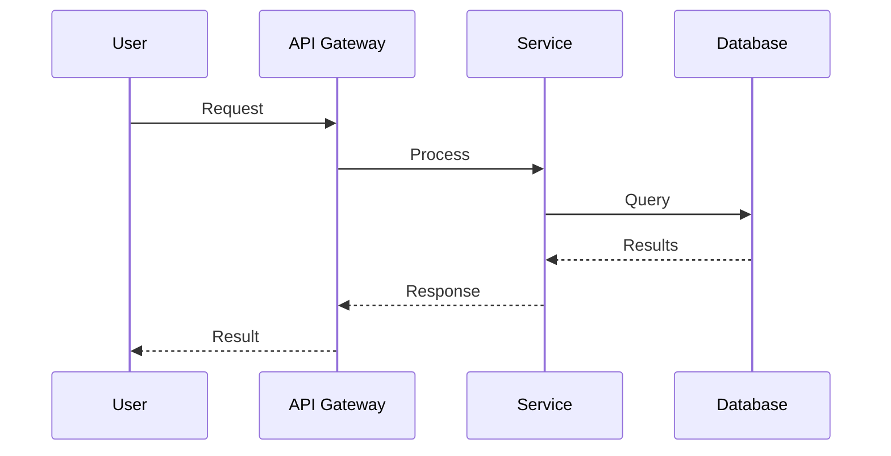

# Agent Job Execution Prompt

**Created**: 2025-11-20
**Status**: Active
**Purpose**: Provides step-by-step instructions for generating design documents from requirements using parallel design jobs.
**Related**: docs/design/parallel_design_jobs.md, docs/design/agents/multi_agent_orchestration.md, docs/design/agents/workspace_isolation_system.md

---

## Document Overview

This document serves as the primary execution guide for AI agents tasked with transforming requirements into comprehensive design documents. It establishes the contract between requirements authors and design implementers, ensuring consistent output quality across all 11 parallel design job streams.

### Target Audience
- AI design agents (Claude, Kiro, Cursor, Cline)
- Technical architects reviewing design outputs
- Implementation teams consuming design documents

### Success Criteria
A successful design document must:
- Address 100% of requirements from the source file
- Include executable code examples (SQL, Python, YAML)
- Provide Mermaid diagrams for architecture visualization
- Define clear integration points with other systems
- Follow the established style guide from reference documents

---

## Instructions

You are tasked with generating a design document from requirements. Follow these steps:

### Step 1: Read the Job Specification File

Read the file: `docs/design/parallel_design_jobs.md`

This file contains 11 independent job specifications. Each job:
- Reads ONE requirements file
- Produces ONE design document
- Is completely independent (can run in parallel)

### Step 2: Select Your Job

Choose ONE job by its number (1-11):

1. **Memory System Design** - Hybrid search (semantic + keyword) with RRF fusion
2. **Validation System Design** - Multi-layer validation with property-based testing
3. **Diagnosis Agent Design** - Self-healing diagnostic workflows
4. **Enhanced Result Submission Design** - Structured result handling with feedback loops
5. **Monitoring Architecture Design** - Guardian, Conductor, and Health Check subsystems
6. **Task Queue Management Design** - Priority-based assignment with dependency resolution
7. **Ticket Human Approval Design** - Review workflows with quality gates
8. **Ticket Workflow Design** - Lifecycle management from creation to completion
9. **Agent Lifecycle Management Design** - Registration, heartbeat, and termination
10. **Fault Tolerance Design** - Circuit breakers, retries, and graceful degradation
11. **MCP Server Integration Design** - Model Context Protocol with tool registry

**If no job number is specified, start with Job 1 (Memory System Design).**

### Step 3: Read the Requirements File

Read the source requirements file specified in your chosen job's contract:
- Path will be something like `docs/requirements/[category]/[filename].md`
- This is your SOLE SOURCE OF TRUTH for what to design

### Step 4: Read Existing Design Documents (for Style Reference)

Read these files to understand the expected format and style:
- `docs/design/agents/multi_agent_orchestration.md` (main reference for style)
- `docs/design/agents/workspace_isolation_system.md` (if relevant to your job)

**DO NOT modify these files** - they are read-only references.

### Step 5: Generate the Design Document

Create the target design document at the path specified in your job contract.

**Required Sections** (adapt based on your job's contract):

#### 1. Document Overview
- Purpose and scope
- Target audience
- Related documents (link to requirements and other design docs)

#### 2. Architecture Overview
- High-level architecture diagram (Mermaid or ASCII)
- Component responsibilities table
- System boundaries

#### 3. Component Details
- Detailed description of each component
- Interfaces and contracts
- Key methods/functions
- Data flows between components

#### 4. Data Models
- Database schemas (SQL CREATE TABLE statements)
- Pydantic models (if applicable)
- Relationships and constraints

#### 5. API Specifications
- Endpoint tables (method, path, purpose, request/response)
- Request/response models
- Error handling and status codes
- Authentication/authorization requirements

#### 6. Integration Points
- How this system integrates with others
- Memory System integration (if specified in requirements)
- Other cross-system integrations
- Event/WebSocket contracts

#### 7. Implementation Details
- Algorithms and pseudocode
- Performance considerations
- Configuration parameters
- Error handling strategies

#### 8. Related Documents
- Links back to requirements document
- Links to related design documents
- Cross-references

---

## LLM Service Integration

When implementing design documents that require LLM interactions, use the following patterns:

### Structured Output Pattern (Preferred)

```python
from omoi_os.services.llm_service import get_llm_service
from pydantic import BaseModel, Field

# Define output structure
class AnalysisResult(BaseModel):
    """LLM analysis result structure."""
    score: float = Field(..., ge=0.0, le=1.0)
    summary: str
    needs_action: bool = Field(default=False)
    details: dict = Field(default_factory=dict)

# Use structured_output for type-safe responses
llm = get_llm_service()
result = await llm.structured_output(
    prompt="Analyze this agent trajectory...",
    output_type=AnalysisResult,
    system_prompt="You are an expert analyzer.",
    output_retries=3,
    http_retries=3,
)

# Convert to JSON-serializable dict for storage
result_dict = result.model_dump(mode='json')
```

### Simple Completion Pattern

```python
from omoi_os.services.llm_service import get_llm_service

llm = get_llm_service()
result = await llm.complete(
    prompt="What is the capital of France?",
    system_prompt="You are a helpful assistant."
)
```

### Retry Configuration

The LLM service includes automatic retry with exponential backoff:
- **HTTP retries**: 3 attempts for transient errors (503, 429, etc.)
- **Output retries**: 5 attempts for structured output validation
- **Backoff**: Exponential with jitter (1s, 2s, 4s + random)

---

## PydanticAI Service Integration

For advanced structured outputs with Fireworks.ai backend:

```python
from omoi_os.services.pydantic_ai_service import PydanticAIService
from pydantic import BaseModel

class DesignOutput(BaseModel):
    components: list[str]
    data_models: list[dict]
    api_endpoints: list[dict]

service = PydanticAIService()
agent = service.create_agent(
    output_type=DesignOutput,
    system_prompt="You are a system architect.",
    output_retries=5,
)

result = await agent.run("Design a task queue system")
```

**Configuration**:
- Default model: `accounts/fireworks/models/minimax-m2p1`
- Provider: Fireworks.ai via OpenAI-compatible API
- API key: From `FIREWORKS_API_KEY` or `LLM_API_KEY` env var

---

## Phase Manager Integration

For design documents involving ticket workflows:

### Phase Configuration

```python
from omoi_os.services.phase_manager import PhaseConfig, ExecutionMode

config = PhaseConfig(
    id="PHASE_IMPLEMENTATION",
    name="Implementation",
    description="Building the feature or fix",
    sequence_order=3,
    allowed_transitions=("PHASE_TESTING", "PHASE_DONE"),
    mapped_status="building",
    execution_mode=ExecutionMode.IMPLEMENTATION,
    default_task_types=["implement_feature"],
    continuous_mode=True,
)
```

### Transition Rules

| From Phase | Allowed To | Conditions |
|------------|------------|------------|
| PHASE_BACKLOG | PHASE_REQUIREMENTS, PHASE_IMPLEMENTATION | Can skip to implementation |
| PHASE_REQUIREMENTS | PHASE_DESIGN, PHASE_IMPLEMENTATION | Gate: requirements_document |
| PHASE_DESIGN | PHASE_IMPLEMENTATION | Gate: design_document |
| PHASE_IMPLEMENTATION | PHASE_TESTING, PHASE_DONE | Gate: code_changes, 80% coverage |
| PHASE_TESTING | PHASE_DEPLOYMENT, PHASE_IMPLEMENTATION, PHASE_DONE | Gate: test_results |
| PHASE_BLOCKED | Any phase | Unblocking transitions |

---

## Database Schema Patterns

### Standard Model Structure

```python
from sqlalchemy import Column, String, DateTime, JSON, ForeignKey
from sqlalchemy.dialects.postgresql import UUID, JSONB
from omoi_os.models.base import Base
from omoi_os.utils.datetime import utc_now

class Task(Base):
    """Task model with dependency tracking."""
    
    __tablename__ = "tasks"
    
    id = Column(UUID(as_uuid=True), primary_key=True)
    ticket_id = Column(UUID(as_uuid=True), ForeignKey("tickets.id"))
    phase_id = Column(String(50), nullable=False)
    
    # Task configuration
    description = Column(String(500), nullable=False)
    priority = Column(String(20), default="medium")
    status = Column(String(50), default="pending")
    
    # Dependency tracking (JSONB for flexibility)
    dependencies = Column(JSONB, default=list)
    
    # Retry configuration
    retry_count = Column(Integer, default=0)
    max_retries = Column(Integer, default=3)
    
    # Timeout handling
    timeout_seconds = Column(Integer, nullable=True)
    
    # Timestamps
    created_at = Column(DateTime(timezone=True), default=utc_now)
    started_at = Column(DateTime(timezone=True), nullable=True)
    completed_at = Column(DateTime(timezone=True), nullable=True)
```

### Index Patterns

```python
# GIN index for JSONB queries
op.create_index(
    'idx_tasks_dependencies',
    'tasks',
    ['dependencies'],
    postgresql_using='gin'
)

# Standard indexes for filtering
op.create_index('idx_tasks_status', 'tasks', ['status'])
op.create_index('idx_tasks_priority', 'tasks', ['priority'])
op.create_index('idx_tasks_phase', 'tasks', ['phase_id'])
```

---

## Event System Integration

### Publishing Events

```python
from omoi_os.services.event_bus import EventBusService, SystemEvent

event_bus = EventBusService()
event_bus.publish(SystemEvent(
    event_type="TASK_COMPLETED",
    entity_type="task",
    entity_id=str(task.id),
    payload={
        "result": result,
        "agent_id": agent_id,
        "duration_seconds": 120,
    }
))
```

### Event Types Reference

| Event Type | Entity | Payload Fields |
|------------|--------|----------------|
| TASK_CREATED | task | ticket_id, phase_id, task_type |
| TASK_ASSIGNED | task | agent_id, assigned_at |
| TASK_COMPLETED | task | result, duration, agent_id |
| TASK_FAILED | task | error, retry_count |
| PHASE_TRANSITIONED | ticket | from_phase, to_phase |
| AGENT_HEARTBEAT | agent | timestamp, status |
| DISCOVERY_REPORTED | discovery | type, description, spawn_task_id |

---

## Quality Checklist

Before completing, verify:

- [ ] All requirements from source file are addressed
- [ ] Architecture diagrams included (Mermaid or ASCII)
- [ ] API specifications match requirements exactly
- [ ] Database schemas match requirements exactly
- [ ] Integration points clearly documented
- [ ] Configuration parameters documented
- [ ] Code examples provided where appropriate
- [ ] Cross-references to related design docs included
- [ ] Formatting consistent with existing design docs
- [ ] Memory System integration included (if specified in requirements)
- [ ] LLM service patterns documented (if applicable)
- [ ] Phase manager integration documented (if applicable)
- [ ] Event system integration documented (if applicable)

---

## Output Format

Use Markdown with:
- Code blocks for SQL, Python, JSON, YAML
- Tables for API endpoints, configuration, comparisons
- Mermaid diagrams for state machines, sequence diagrams, architecture
- Clear headings and subheadings
- Consistent formatting with existing design docs

### Mermaid Diagram Standards



---

## Example Execution

If you're assigned **Job 1 (Memory System Design)**:

1. Read `docs/design/parallel_design_jobs.md` → Find Job 1 contract
2. Read `docs/requirements/memory/memory_system.md` → Your source of truth
3. Read `docs/design/agents/multi_agent_orchestration.md` → Style reference
4. Create `docs/design/memory/memory_system.md` → Your output
5. Follow the contract exactly:
   - Cover ACE workflow (Executor → Reflector → Curator)
   - Include PostgreSQL schema with pgvector
   - Document all API endpoints
   - Include hybrid search implementation (RRF)
   - Add integration patterns

---

## Important Notes

- **Stay within scope**: Only address what's in your assigned requirements file
- **Don't invent**: If something isn't in requirements, don't add it unless it's a necessary implementation detail
- **Be consistent**: Match the style and depth of existing design documents
- **Include diagrams**: Visual representations help understanding
- **Link everything**: Cross-reference requirements, related design docs, and integration points
- **Memory integration**: If your requirements file mentions Memory System integration (REQ-*-MEM-*), include those sections
- **Use structured_output**: Always prefer `structured_output()` over manual JSON parsing for LLM calls
- **Datetime handling**: Always use `omoi_os.utils.datetime.utc_now()` for timestamps
- **Reserved words**: Never use `metadata` or `registry` as SQLAlchemy column names

---

## Job Selection

**To select a job, respond with:**

```
I will execute Job [NUMBER]: [JOB NAME]
```

Then proceed with Steps 3-7 above.

---

## Troubleshooting

### Common Issues

| Issue | Solution |
|-------|----------|
| Requirements unclear | Ask for clarification in the coordination channel |
| Conflicting requirements | Document the conflict and propose resolution |
| Missing dependencies | Note in "Integration Points" section |
| Technical constraints | Document in "Implementation Details" section |

### Getting Help

- **Slack/Channel**: #design-jobs
- **Questions**: Tag @tech-lead for architectural decisions
- **Reviews**: Submit PR for design review before implementation

---

**Ready to begin?** Select your job number and start reading the requirements file!
