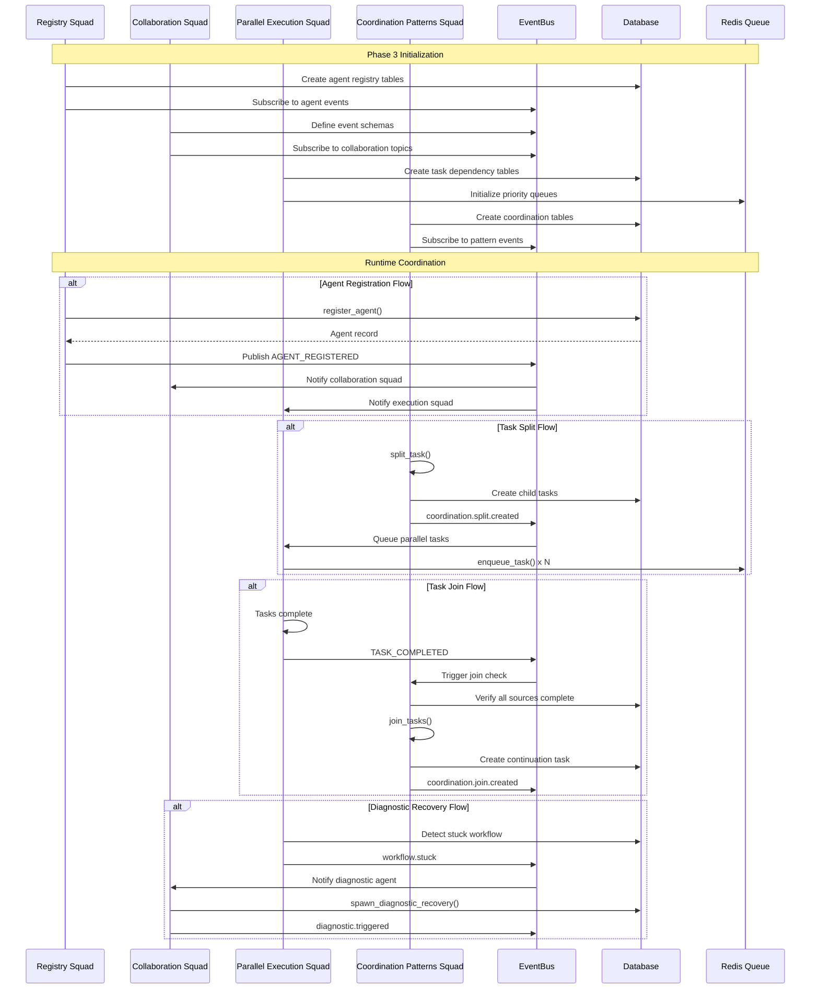

# Phase 3 Parallel Agent Prompt – Multi-Agent Coordination

**Created**: 2025-11-20  
**Updated**: 2025-04-22 (Expanded with architecture details, code references, coordination patterns, and integration guides)  
**Status**: Draft → Active  
**Purpose**: Comprehensive technical specification for implementing Phase 3 parallel multi-agent coordination, covering coordination patterns, agent registry, diagnostic systems, and inter-agent communication protocols.  
**Related**: 
- `docs/design/services/event_bus.md` (Event system)
- `docs/design/services/scheduler.md` (Task scheduling)
- `docs/requirements/workflows/phase2.md` (Phase 2 requirements)
- `docs/requirements/phase1_telemetry.md` (Telemetry requirements)
- `docs/implementation_roadmap.md` (Implementation timeline)
- `backend/omoi_os/services/coordination.py` (Coordination service)
- `backend/omoi_os/services/diagnostic.py` (Diagnostic service)
- `backend/omoi_os/services/agent_registry.py` (Agent registry)

---

## Overview

Phase 3 introduces **parallel multi-agent coordination** to the OmoiOS execution pipeline. Unlike earlier phases where agents worked in isolation, Phase 3 enables multiple agents to work concurrently with proper synchronization, resource management, and inter-agent communication.

### Core Capabilities

| Capability | Description | Implementation |
|------------|-------------|----------------|
| **Agent Registry** | Capability-aware agent discovery and registration | `agent_registry.py` |
| **Coordination Patterns** | SYNC, SPLIT, JOIN, MERGE primitives | `coordination.py` |
| **Diagnostic System** | Stuck workflow detection and recovery | `diagnostic.py` |
| **Event Bus** | Redis-backed pub/sub for agent communication | `event_bus.py` |
| **Task Queue** | Priority-based task assignment with dependencies | `task_queue.py` |

### Agent Roles

Phase 3 defines four specialized agent squads that work in parallel:

| Squad | Responsibility | Key Files |
|-------|---------------|-----------|
| **Registry Squad** | Agent CRUD, capability management, discovery | `agent_registry.py`, `models/agent.py` |
| **Collaboration Squad** | Inter-agent messaging, handoff protocols | `event_bus.py`, `agent_collab.py` |
| **Parallel Execution Squad** | DAG scheduling, resource locking, concurrency | `task_queue.py`, `scheduler.py` |
| **Coordination Patterns Squad** | SYNC, SPLIT, JOIN, MERGE templates | `coordination.py` |

---

## Architecture

### System Context Diagram

```
┌─────────────────────────────────────────────────────────────────────────────┐
│                        Phase 3 Multi-Agent Coordination                      │
├─────────────────────────────────────────────────────────────────────────────┤
│                                                                             │
│  ┌─────────────────────────────────────────────────────────────────────┐   │
│  │                        Agent Registry Squad                        │   │
│  │  ┌─────────────┐  ┌─────────────┐  ┌─────────────┐              │   │
│  │  │   Register  │  │   Update    │  │   Search    │              │   │
│  │  │   Agent     │  │ Capabilities│  │   Best-Fit  │              │   │
│  │  └──────┬──────┘  └──────┬──────┘  └──────┬──────┘              │   │
│  │         │                │                │                     │   │
│  │         └────────────────┬─┴────────────────┘                     │   │
│  │                          │                                        │   │
│  │                   ┌──────▼──────┐                                │   │
│  │                   │  Agent DB   │                                │   │
│  │                   │   (Postgres)│                                │   │
│  │                   └──────┬──────┘                                │   │
│  └──────────────────────────┼────────────────────────────────────────┘   │
│                             │                                            │
│  ┌──────────────────────────┼────────────────────────────────────────┐   │
│  │                   Collaboration Squad                               │   │
│  │  ┌─────────────┐  ┌─────────────┐  ┌─────────────┐              │   │
│  │  │   Message   │  │   Handoff   │  │   Thread    │              │   │
│  │  │   Send      │  │   Request   │  │   Persist   │              │   │
│  │  └──────┬──────┘  └──────┬──────┘  └──────┬──────┘              │   │
│  │         │                │                │                     │   │
│  │         └────────────────┬─┴────────────────┘                     │   │
│  │                          │                                        │   │
│  │                   ┌──────▼──────┐                                │   │
│  │                   │  Event Bus  │                                │   │
│  │                   │   (Redis)   │                                │   │
│  │                   └──────┬──────┘                                │   │
│  └──────────────────────────┼────────────────────────────────────────┘   │
│                             │                                            │
│  ┌──────────────────────────┼────────────────────────────────────────┐   │
│  │              Parallel Execution Squad                               │   │
│  │  ┌─────────────┐  ┌─────────────┐  ┌─────────────┐              │   │
│  │  │    DAG      │  │   Resource  │  │  Concurrency│              │   │
│  │  │   Resolver  │  │    Lock     │  │    Control  │              │   │
│  │  └──────┬──────┘  └──────┬──────┘  └──────┬──────┘              │   │
│  │         │                │                │                     │   │
│  │         └────────────────┬─┴────────────────┘                     │   │
│  │                          │                                        │   │
│  │                   ┌──────▼──────┐                                │   │
│  │                   │  Task Queue │                                │   │
│  │                   │   (Redis)   │                                │   │
│  │                   └──────┬──────┘                                │   │
│  └──────────────────────────┼────────────────────────────────────────┘   │
│                             │                                            │
│  ┌──────────────────────────┼────────────────────────────────────────┐   │
│  │            Coordination Patterns Squad                              │   │
│  │  ┌─────────────┐  ┌─────────────┐  ┌─────────────┐  ┌──────────┐│   │
│  │  │    SYNC     │  │    SPLIT    │  │    JOIN     │  │   MERGE  ││   │
│  │  │   Point     │  │   Task      │  │   Tasks     │  │  Results ││   │
│  │  └──────┬──────┘  └──────┬──────┘  └──────┬──────┘  └─────┬────┘│   │
│  │         │                │                │               │      │   │
│  │         └────────────────┴────────────────┴───────────────┘      │   │
│  │                              │                                    │   │
│  │                       ┌──────▼──────┐                            │   │
│  │                       │Coordination │                            │   │
│  │                       │  Service    │                            │   │
│  │                       └─────────────┘                            │   │
│  └──────────────────────────────────────────────────────────────────┘   │
│                                                                             │
└─────────────────────────────────────────────────────────────────────────────┘
```

### Mermaid Sequence Diagram



---

## Phase Workflow Steps

### Step 1: Registry Squad Implementation

The Registry Squad extends the agent model with capability tracking:

```python
# From backend/omoi_os/services/agent_registry.py (lines 58-213)
class AgentRegistryService:
    """Capability-aware agent registry and discovery service."""
    
    def __init__(
        self,
        db: DatabaseService,
        event_bus: Optional[EventBusService] = None,
        status_manager: Optional[AgentStatusManager] = None,
    ):
        self.db = db
        self.event_bus = event_bus
        self.status_manager = status_manager

    def register_agent(
        self,
        *,
        agent_type: str,
        phase_id: Optional[str],
        capabilities: List[str],
        capacity: int = 1,
        status: str = AgentStatus.IDLE.value,
        tags: Optional[List[str]] = None,
        config: Optional[Dict[str, Any]] = None,
        resource_requirements: Optional[Dict[str, Any]] = None,
        binary_path: Optional[str] = None,
        version: Optional[str] = None,
    ) -> Agent:
        """
        Register a new agent using multi-step protocol.
        
        Steps:
        1. Pre-registration validation
        2. Identity assignment (UUID, name, crypto)
        3. Registry entry creation
        4. Event bus subscription
        5. Initial heartbeat timeout (60s)
        """
```

**Database Schema Extensions:**

```python
# From backend/omoi_os/services/agent_registry.py (lines 137-156)
with self.db.get_session() as session:
    agent = Agent(
        id=agent_id,
        agent_name=agent_name,
        agent_type=agent_type,
        phase_id=phase_id,
        status=AgentStatus.SPAWNING.value,
        capabilities=normalized_caps,
        capacity=max(1, capacity),
        tags=normalized_tags or None,
        health_status="healthy",
        crypto_public_key=crypto_identity["public_key"],
        crypto_identity_metadata=crypto_identity["metadata"],
        agent_metadata=metadata if metadata else None,
        registered_by=registered_by,
    )
    session.add(agent)
    session.commit()
```

### Step 2: Collaboration Squad Implementation

The Collaboration Squad handles inter-agent messaging:

```python
# Event schemas from agent_registry.py (lines 195-212)
# Publish registration event
if self.event_bus:
    self.event_bus.publish(
        SystemEvent(
            event_type="AGENT_REGISTERED",
            entity_type="agent",
            entity_id=agent_id,
            payload={
                "agent_id": agent_id,
                "agent_name": agent_name,
                "agent_type": agent_type,
                "phase_id": phase_id,
                "capabilities": normalized_caps,
            },
        )
    )

self._publish_capability_event(agent_id, normalized_caps)
```

**Capability Update Events:**

```python
# From backend/omoi_os/services/agent_registry.py (lines 405-418)
def _publish_capability_event(self, agent_id: str, capabilities: List[str]) -> None:
    if not self.event_bus:
        return
    
    event = SystemEvent(
        event_type="agent.capability.updated",
        entity_type="agent",
        entity_id=agent_id,
        payload={
            "agent_id": agent_id,
            "capabilities": capabilities,
        },
    )
    self.event_bus.publish(event)
```

### Step 3: Parallel Execution Squad Implementation

The Parallel Execution Squad manages task dependencies and scheduling:

```python
# From backend/omoi_os/services/coordination.py (lines 192-246)
def split_task(
    self,
    split_id: str,
    source_task_id: str,
    target_tasks: List[Dict[str, Any]],
    required_capabilities: Optional[List[str]] = None,
) -> List[Task]:
    """
    Split a task into multiple parallel tasks.
    
    Args:
        split_id: Unique identifier for the split operation
        source_task_id: ID of the source task being split
        target_tasks: List of task configurations for parallel tasks
        required_capabilities: Optional capabilities required for target tasks
        
    Returns:
        List of created Task objects
    """
    with self.db.get_session() as session:
        source_task = session.query(Task).filter(Task.id == source_task_id).first()
        if not source_task:
            raise ValueError(f"Source task {source_task_id} not found")
        
        created_tasks = []
        for task_config in target_tasks:
            # Create task with dependency on source task
            task = self.queue.enqueue_task(
                ticket_id=source_task.ticket_id,
                phase_id=task_config.get("phase_id", source_task.phase_id),
                task_type=task_config.get("task_type", "split_task"),
                description=task_config.get("description", ""),
                priority=task_config.get("priority", source_task.priority),
                dependencies={"depends_on": [source_task_id]},
            )
            created_tasks.append(task)
        
        # Publish split event
        if self.event_bus:
            self.event_bus.publish(
                SystemEvent(
                    event_type="coordination.split.created",
                    entity_type="split",
                    entity_id=split_id,
                    payload={
                        "split_id": split_id,
                        "source_task_id": source_task_id,
                        "target_task_ids": [t.id for t in created_tasks],
                        "required_capabilities": required_capabilities,
                    },
                )
            )
        
        return created_tasks
```

### Step 4: Coordination Patterns Squad Implementation

The Coordination Patterns Squad provides reusable primitives:

```python
# From backend/omoi_os/services/coordination.py (lines 20-82)
class CoordinationPattern(str, Enum):
    """Coordination pattern types."""
    
    SYNC = "sync"      # Synchronization point - wait for multiple tasks
    SPLIT = "split"    # Split work into parallel tasks
    JOIN = "join"      # Join multiple tasks before proceeding
    MERGE = "merge"    # Merge results from multiple tasks

@dataclass
class SyncPoint:
    """Synchronization point configuration."""
    
    sync_id: str
    waiting_task_ids: List[str]
    required_count: Optional[int] = None  # None = wait for all
    timeout_seconds: Optional[int] = None

@dataclass
class SplitConfig:
    """Split configuration for parallel task creation."""
    
    split_id: str
    source_task_id: str
    target_tasks: List[Dict[str, Any]]
    required_capabilities: Optional[List[str]] = None

@dataclass
class JoinConfig:
    """Join configuration for aggregating parallel tasks."""
    
    join_id: str
    source_task_ids: List[str]
    continuation_task: Dict[str, Any]
    merge_strategy: str = "all"  # "all", "first", "majority"
```

---

## Decision Points and Branching Logic

### Agent Selection Decision Tree

```
┌─────────────────────────────────────────────────────────────────┐
│                    Agent Selection Algorithm                       │
├─────────────────────────────────────────────────────────────────┤
│                                                                  │
│  ┌─────────────┐                                                │
│  │ Task Created │                                               │
│  └──────┬──────┘                                               │
│         │                                                        │
│         ▼                                                        │
│  ┌─────────────────┐                                            │
│  │ Get Required Caps│                                           │
│  │ from Task Config │                                           │
│  └────────┬────────┘                                           │
│           │                                                      │
│           ▼                                                      │
│  ┌─────────────────┐                                            │
│  │ Search Agents   │                                           │
│  │ (AgentRegistry) │                                           │
│  └────────┬────────┘                                           │
│           │                                                      │
│     ┌─────┴─────┐                                                │
│     ▼           ▼                                                │
│  [Found]     [None]                                              │
│     │           │                                                │
│     ▼           ▼                                                │
│  ┌────────┐  ┌─────────────┐                                    │
│  │Score   │  │Spawn New    │                                    │
│  │Agents  │  │Agent (if    │                                    │
│  │        │  │auto-scale   │                                    │
│  │        │  │enabled)     │                                    │
│  └────┬───┘  │or Queue     │                                    │
│       │      │for later    │                                    │
│       ▼      └─────────────┘                                    │
│  ┌─────────────────┐                                            │
│  │ Select Best Fit │                                           │
│  │ (highest score) │                                           │
│  └─────────────────┘                                            │
│                                                                  │
└─────────────────────────────────────────────────────────────────┘
```

### Coordination Pattern Selection

| Pattern | Use Case | Implementation |
|---------|----------|----------------|
| **SYNC** | Wait for N tasks to complete before proceeding | `create_sync_point()` |
| **SPLIT** | Divide work into parallel subtasks | `split_task()` |
| **JOIN** | Aggregate results from parallel tasks | `join_tasks()` |
| **MERGE** | Combine outputs using strategy | `merge_task_results()` |

### Diagnostic Trigger Conditions

The Diagnostic Service (`backend/omoi_os/services/diagnostic.py`) monitors for stuck workflows:

```python
# From backend/omoi_os/services/diagnostic.py (lines 98-334)
def find_stuck_workflows(
    self,
    cooldown_seconds: int = 60,
    stuck_threshold_seconds: int = 60,
) -> List[dict]:
    """Find workflows meeting all stuck conditions.
    
    Conditions (ALL must be true):
    1. Active workflow exists
    2. Tasks exist
    3. All tasks finished (no pending/running tasks)
    4. No validated WorkflowResult
    5. Cooldown passed
    6. Stuck time met
    
    Safeguard conditions (any true = skip):
    - Has pending diagnostic recovery tasks
    - Exceeded consecutive failure limit
    - Exceeded total diagnostic run limit
    """
```

---

## Integration with Other Phases

### Phase 2 Integration (State Machine)

Phase 3 agents consume Phase 2 ticket/task schemas:

```python
# From backend/omoi_os/services/coordination.py (lines 270-308)
def join_tasks(
    self,
    join_id: str,
    source_task_ids: List[str],
    continuation_task: Dict[str, Any],
    merge_strategy: str = "all",
) -> Task:
    """Join multiple tasks and create a continuation task."""
    with self.db.get_session() as session:
        # Verify all source tasks exist
        source_tasks = (
            session.query(Task).filter(Task.id.in_(source_task_ids)).all()
        )
        if len(source_tasks) != len(source_task_ids):
            raise ValueError("Some source tasks not found")
        
        # Get ticket_id from first source task
        ticket_id = source_tasks[0].ticket_id
        
        # Create continuation task with dependencies on all source tasks
        continuation = self.queue.enqueue_task(
            ticket_id=ticket_id,
            phase_id=continuation_task.get("phase_id", source_tasks[0].phase_id),
            task_type=continuation_task.get("task_type", "join_task"),
            description=continuation_task.get("description", ""),
            priority=continuation_task.get("priority", source_tasks[0].priority),
            dependencies={"depends_on": source_task_ids},
        )
```

### Phase 4 Integration (Monitoring)

Phase 3 provides telemetry data to Phase 4 monitoring:

```python
# From backend/omoi_os/services/diagnostic.py (lines 336-539)
async def spawn_diagnostic_agent(
    self,
    workflow_id: str,
    context: dict,
    max_tasks: int = 5,
) -> DiagnosticRun:
    """Create diagnostic run, generate hypotheses, and spawn recovery tasks."""
    with self.db.get_session() as session:
        # Create diagnostic run record
        diagnostic_run = DiagnosticRun(
            workflow_id=workflow_id,
            triggered_at=utc_now(),
            total_tasks_at_trigger=context.get("total_tasks", 0),
            done_tasks_at_trigger=context.get("done_tasks", 0),
            failed_tasks_at_trigger=context.get("failed_tasks", 0),
            time_since_last_task_seconds=context.get("time_stuck_seconds", 0),
            workflow_goal=context.get("workflow_goal"),
            phases_analyzed=context.get("phases_analyzed"),
            agents_reviewed=context.get("agents_reviewed"),
            status="running",
        )
```

### Phase 5 Integration (Guardian)

Phase 3 Registry provides capability data to Phase 5 Guardian:

```python
# From backend/omoi_os/services/agent_registry.py (lines 317-384)
def search_agents(
    self,
    *,
    required_capabilities: Optional[List[str]] = None,
    phase_id: Optional[str] = None,
    agent_type: Optional[str] = None,
    limit: int = 5,
    include_degraded: bool = False,
) -> List[dict]:
    """Search for agents ranked by capability overlap and availability."""
    required = self._normalize_tokens(required_capabilities or [])
    
    with self.db.get_session() as session:
        query = session.query(Agent)
        filters = []
        if phase_id:
            filters.append(Agent.phase_id == phase_id)
        if agent_type:
            filters.append(Agent.agent_type == agent_type)
        if not include_degraded:
            filters.append(
                Agent.status.notin_([
                    AgentStatus.TERMINATED.value,
                    AgentStatus.QUARANTINED.value,
                    AgentStatus.FAILED.value,
                ])
            )
```

---

## Configuration and Environment Variables

### Phase 3 Environment Variables

| Variable | Default | Description |
|----------|---------|-------------|
| `AGENT_REGISTRY_ENABLED` | `true` | Enable agent registry service |
| `COLLABORATION_ENABLED` | `true` | Enable inter-agent messaging |
| `PARALLEL_EXECUTION_ENABLED` | `true` | Enable DAG scheduling |
| `COORDINATION_PATTERNS_ENABLED` | `true` | Enable SYNC/SPLIT/JOIN/MERGE |
| `DIAGNOSTIC_ENABLED` | `true` | Enable stuck workflow detection |
| `MAX_CONSECUTIVE_FAILURES` | `3` | Max diagnostic failures per workflow |
| `MAX_DIAGNOSTICS_PER_WORKFLOW` | `5` | Max total diagnostic runs |
| `STUCK_THRESHOLD_SECONDS` | `60` | Time before workflow considered stuck |

### YAML Configuration

```yaml
# From backend/config/base.yaml
agent_registry:
  heartbeat_timeout_seconds: 60
  stale_agent_threshold_minutes: 5
  auto_cleanup_enabled: true

coordination:
  sync_timeout_seconds: 300
  join_wait_seconds: 60
  merge_strategy: "combine"

diagnostic:
  enabled: true
  check_interval_seconds: 60
  max_consecutive_failures: 3
  max_diagnostics_per_workflow: 5
  similarity_threshold: 0.90
```

---

## Error Handling and Recovery

### Agent Registration Failure

```python
# From backend/omoi_os/services/agent_registry.py (lines 99-113)
# Step 1: Pre-Registration Validation
validation = self._pre_validate(
    agent_type=agent_type,
    capabilities=capabilities,
    resource_requirements=resource_requirements,
    config=config,
    binary_path=binary_path,
    version=version,
)
if not validation.success:
    raise RegistrationRejectedError(
        reason=validation.reason or "Pre-validation failed",
        details=validation.details,
    )
```

### Coordination Pattern Failure

If a coordination pattern fails:
1. Log the failure with context
2. Publish failure event to EventBus
3. Trigger diagnostic agent if critical
4. Allow manual intervention via API

### Diagnostic Runaway Prevention

```python
# From backend/omoi_os/services/diagnostic.py (lines 254-272)
# ===== SAFEGUARD: Check consecutive failure limit =====
consecutive_failures = self._consecutive_failures.get(ticket.id, 0)
if consecutive_failures >= self.max_consecutive_failures:
    logger.warning(
        f"Skipping workflow {ticket.id}: exceeded max consecutive failures ({consecutive_failures})"
    )
    continue

# ===== SAFEGUARD: Check total diagnostic run limit =====
total_diagnostic_runs = (
    session.query(DiagnosticRun)
    .filter(DiagnosticRun.workflow_id == ticket.id)
    .count()
)
if total_diagnostic_runs >= self.max_diagnostics_per_workflow:
    logger.warning(
        f"Skipping workflow {ticket.id}: exceeded max total diagnostics ({total_diagnostic_runs})"
    )
    continue
```

---

## Communication & Integration Rituals

### Daily Async Sync

- Post updates in shared doc or Slack thread with status + blockers
- Include: completed work, in-progress work, blockers, needs from other squads

### Contract Tests

Before merging, run cross-team scripts that validate:
- Registry client compatibility
- Messaging DTO serialization
- Scheduler API compatibility

### Shared Fixtures

Store sample capability/agent/task payloads under `tests/fixtures/phase3/`:

```python
# Example fixture structure
fixtures/phase3/
├── agents/
│   ├── registry_agent.json
│   └── capabilities_agent.json
├── tasks/
│   ├── split_task.json
│   └── join_task.json
└── coordination/
    ├── sync_point.json
    └── merge_config.json
```

### Merge Order Suggestion

1. Registry migration + client (Role 1)
2. Collaboration schemas/endpoints (Role 2)
3. Scheduler/locks (Role 3)
4. Coordination templates + E2E sims (Role 4)

**Note**: All four can develop in parallel so long as DTOs and interfaces are stubbed first; maintain feature flags if needed.

---

## Definition of Done (Phase 3)

| Criterion | Status Check |
|-----------|--------------|
| All four milestone deliverables implemented | `ls omoi_os/services/{agent_registry,coordination,diagnostic}.py` |
| Passing unit/integration tests | `uv run pytest tests/test_agent_registry.py tests/test_coordination.py tests/test_diagnostic.py -v` |
| Cross-squad contract tests green | `uv run pytest tests/contract/ -v` |
| Documentation updated | `docs/implementation_roadmap.md`, service READMEs |
| Telemetry hooks emitting data | Check Redis `MONITOR` for events |
| No regressions in existing test suite | `uv run pytest tests/ -v` |

---

## Related Documentation

| Document | Purpose |
|----------|---------|
| `docs/design/services/event_bus.md` | Event system architecture |
| `docs/design/services/scheduler.md` | Task scheduling design |
| `docs/requirements/workflows/phase2.md` | Phase 2 requirements |
| `docs/requirements/phase1_telemetry.md` | Telemetry requirements |
| `docs/implementation_roadmap.md` | Implementation timeline |
| `backend/omoi_os/services/coordination.py` | Coordination service implementation |
| `backend/omoi_os/services/diagnostic.py` | Diagnostic service implementation |
| `backend/omoi_os/services/agent_registry.py` | Agent registry implementation |

---

## Quick Reference

### 4 Agent Roles at a Glance

| Role | Scope | Dependencies | Tests |
|------|-------|--------------|-------|
| **Registry Squad** | Agent CRUD, capabilities, search | Phase 2 ticket/task schemas | `test_agent_registry.py` |
| **Collaboration Squad** | Messaging, handoffs, threads | Registry client | `test_agent_communication.py` |
| **Parallel Execution Squad** | DAG scheduling, locks, concurrency | Registry + Collaboration | `test_parallel_execution.py` |
| **Coordination Patterns Squad** | SYNC, SPLIT, JOIN, MERGE | Scheduler + Messaging | `test_coordination_patterns.py` |

### Key API Endpoints

| Endpoint | Squad | Purpose |
|----------|-------|---------|
| `POST /agents` | Registry | Register new agent |
| `GET /agents/search` | Registry | Find agents by capability |
| `POST /agents/{id}/message` | Collaboration | Send inter-agent message |
| `POST /tasks/split` | Coordination | Split task into parallel subtasks |
| `POST /tasks/join` | Coordination | Join parallel tasks |
| `GET /diagnostics/stuck` | Diagnostic | Find stuck workflows |
| `POST /diagnostics/{id}/recover` | Diagnostic | Trigger recovery |

---

**Use this prompt to spin up four specialized editor agents who will implement Phase 3 concurrently. Copy the relevant role block when launching each agent.**
