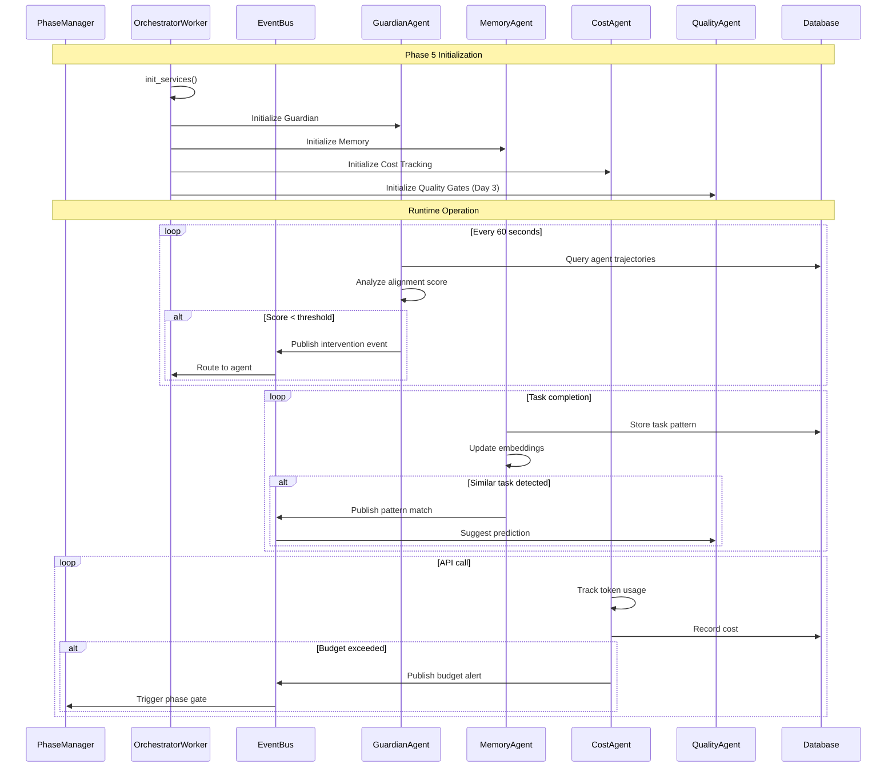

# Phase 5 Ready to Start — Parallel Agent Squad Kickoff

**Created**: 2025-11-20  
**Updated**: 2025-04-22 (Expanded with architecture details, code references, and integration patterns)  
**Status**: Active  
**Purpose**: Provide comprehensive technical reference for Phase 5 parallel agent squad development, including architecture, coordination patterns, integration contracts, and execution workflows.  
**Related**: 
- `docs/PHASE5_PARALLEL_PLAN.md` (Master coordination plan)
- `docs/design/services/phase_manager.md` (Phase management service)
- `docs/design/services/guardian_monitoring.md` (Guardian agent design)
- `docs/architecture/04-monitoring-loop.md` (Monitoring architecture)
- `backend/omoi_os/services/phase_manager.py` (Phase management implementation)
- `backend/omoi_os/workers/orchestrator_worker.py` (Orchestrator initialization)

---

## Overview

Phase 5 introduces **parallel agent squads** that operate concurrently to enhance the OmoiOS execution pipeline. Unlike previous phases where agents worked sequentially, Phase 5 enables multiple specialized agents to run simultaneously, each handling a specific aspect of workflow monitoring, optimization, and quality assurance.

### Phase 5 Agent Squads

| Squad | Purpose | When It Starts | Lines of Code | Tests |
|-------|---------|----------------|---------------|-------|
| **Guardian** | Emergency intervention and trajectory analysis | Day 1 | ~1,200 | 23 |
| **Memory** | Pattern learning and semantic embeddings | Day 1 | ~1,500 | 30 |
| **Cost Tracking** | LLM cost tracking and budget enforcement | Day 1 | ~950 | 18 |
| **Quality Gates** | Predictive quality validation | Day 3 | ~1,200 | 22 |

### Execution Context

Phase 5 agents integrate with the **PhaseManager** (`backend/omoi_os/services/phase_manager.py`) and the **OrchestratorWorker** (`backend/omoi_os/workers/orchestrator_worker.py`). The phase manager handles phase transitions and gate validation, while the orchestrator worker initializes and coordinates all Phase 5 services.

---

## Architecture

### System Context Diagram

```
┌─────────────────────────────────────────────────────────────────────────────┐
│                           OmoiOS Execution Pipeline                          │
├─────────────────────────────────────────────────────────────────────────────┤
│                                                                             │
│  ┌──────────────┐    ┌──────────────┐    ┌──────────────┐                  │
│  │   Phase 1    │───▶│   Phase 2    │───▶│   Phase 3    │                  │
│  │  (Bootstrap) │    │ (State Mach) │    │(Coordination)│                  │
│  └──────────────┘    └──────────────┘    └──────────────┘                  │
│         │                   │                   │                            │
│         ▼                   ▼                   ▼                            │
│  ┌─────────────────────────────────────────────────────────────────────┐   │
│  │                     PHASE 5 PARALLEL SQUADS                          │   │
│  │  ┌────────────┐ ┌────────────┐ ┌────────────┐ ┌────────────┐      │   │
│  │  │  Guardian  │ │   Memory   │ │Cost Track  │ │  Quality   │      │   │
│  │  │   Agent    │ │   Agent    │ │  Agent     │ │   Gates    │      │   │
│  │  │ (Monitor)  │ │ (Learn)    │ │ (Budget)   │ │ (Predict)  │      │   │
│  │  └─────┬──────┘ └─────┬──────┘ └─────┬──────┘ └─────┬──────┘      │   │
│  │        │              │              │              │              │   │
│  │        └──────────────┬┴──────────────┴──────────────┘              │   │
│  │                       │                                              │   │
│  │                       ▼                                              │   │
│  │              ┌─────────────────┐                                     │   │
│  │              │   Event Bus     │                                     │   │
│  │              │   (Redis)       │                                     │   │
│  │              └─────────────────┘                                     │   │
│  └─────────────────────────────────────────────────────────────────────┘   │
│                                    │                                       │
│                                    ▼                                       │
│                         ┌─────────────────┐                                │
│                         │  Orchestrator   │                                │
│                         │    Worker       │                                │
│                         └─────────────────┘                                │
│                                                                             │
└─────────────────────────────────────────────────────────────────────────────┘
```

### Mermaid Sequence Diagram



---

## Phase Workflow Steps

### Step 1: Guardian Agent Initialization

The Guardian agent is initialized in `orchestrator_worker.py` as part of the service initialization sequence:

```python
# From backend/omoi_os/workers/orchestrator_worker.py (lines 1397-1505)
async def init_services():
    """Initialize required services."""
    # ... other services ...
    
    # Phase Gate Service (for phase validation)
    phase_gate = PhaseGateService(db)
    logger.info("service_initialized", service="phase_gate")
    
    # Ticket Workflow Orchestrator
    workflow_orchestrator = TicketWorkflowOrchestrator(...)
    
    # Phase Progression Service (Hook 1 + Hook 2)
    phase_progression = get_phase_progression_service(...)
    phase_progression.subscribe_to_events()
```

The Guardian agent uses the **PhaseGateService** to validate phase transitions and the **PhaseManager** for orchestration:

```python
# From backend/omoi_os/services/phase_manager.py (lines 314-340)
class PhaseManager:
    """
    Unified Phase Manager for orchestrating ticket phase transitions.
    
    Provides:
    1. Single source of truth for phase configurations
    2. Validation of all phase transitions
    3. Automatic status synchronization
    4. Callback hooks for pre/post transition logic
    5. Integration with phase gates and task spawning
    """
    
    def __init__(
        self,
        db: DatabaseService,
        task_queue: Optional["TaskQueueService"] = None,
        phase_gate: Optional["PhaseGateService"] = None,
        event_bus: Optional[EventBusService] = None,
        context_service: Optional["ContextService"] = None,
    ):
```

### Step 2: Memory Agent Integration

The Memory agent integrates with the **PhaseManager** through context aggregation:

```python
# From backend/omoi_os/services/phase_manager.py (lines 611-644)
# Aggregate context from current phase before transitioning
from_phase_context = None
if self.context_service:
    try:
        with self.db.get_session() as session:
            ticket = session.get(Ticket, ticket_id)
            if ticket:
                current_phase = ticket.phase_id
                # Update ticket context with aggregated phase data
                self.context_service.update_ticket_context(
                    ticket_id, current_phase
                )
                # Get context to pass to spawned tasks
                from_phase_context = self.context_service.get_context_for_phase(
                    ticket_id, to_phase
                )
```

### Step 3: Cost Tracking Agent Setup

Cost tracking is configured through the application settings:

```yaml
# From backend/config/base.yaml
cost_tracking:
  enabled: true
  budget_alerts: true
  default_budget_usd: 100.0
  alert_threshold_percent: 80
```

### Step 4: Quality Gates Agent Activation

Quality Gates extend the **PhaseGateService** from Phase 2:

```python
# From backend/omoi_os/services/phase_manager.py (lines 483-495)
# Check phase gate if configured
if from_config and from_config.gate_criteria and self.phase_gate:
    gate_check = self.phase_gate.check_gate_requirements(
        ticket_id, current_phase
    )
    if not gate_check.get("requirements_met"):
        missing = gate_check.get("missing_artifacts", [])
        if missing:
            blocking_reasons.append(
                f"Phase gate requirements not met. Missing: {missing}"
            )
```

---

## Decision Points and Branching Logic

### Phase Transition Decision Tree

```
┌─────────────────────────────────────────────────────────────────┐
│                    Phase Transition Logic                        │
├─────────────────────────────────────────────────────────────────┤
│                                                                  │
│  ┌─────────────┐                                                │
│  │ Task Complete│                                               │
│  └──────┬──────┘                                               │
│         │                                                        │
│         ▼                                                        │
│  ┌─────────────────┐                                            │
│  │ Check Gate Criteria│                                           │
│  │ (PhaseGateService)│                                           │
│  └────────┬────────┘                                           │
│           │                                                      │
│     ┌─────┴─────┐                                                │
│     ▼           ▼                                                │
│  [PASS]      [FAIL]                                              │
│     │           │                                                │
│     ▼           ▼                                                │
│  ┌────────┐  ┌─────────────┐                                    │
│  │Advance │  │Block Transition│                                │
│  │ Phase  │  │Publish Event   │                                │
│  └────┬───┘  │to Guardian     │                                │
│       │      └─────────────┘                                    │
│       ▼                                                          │
│  ┌─────────────────┐                                            │
│  │ Spawn Next Tasks │                                           │
│  │ (with context)   │                                           │
│  └─────────────────┘                                            │
│                                                                  │
└─────────────────────────────────────────────────────────────────┘
```

### Guardian Intervention Triggers

The Guardian agent monitors these conditions for intervention:

| Condition | Threshold | Action |
|-----------|-----------|--------|
| Trajectory alignment score | < 0.6 | Inject steering prompt |
| Time since last progress | > 5 min | Check for stuck agent |
| Error rate spike | > 3 errors/min | Spawn diagnostic task |
| Token budget exceeded | > 80% | Alert + throttle |

---

## Integration with Other Phases

### Phase 3 Integration (Coordination)

Phase 5 agents consume the coordination primitives from Phase 3:

```python
# From backend/omoi_os/services/coordination.py (lines 84-103)
class CoordinationService:
    """Service for managing coordination patterns in multi-agent workflows."""
    
    def __init__(
        self,
        db: DatabaseService,
        queue: TaskQueueService,
        event_bus: Optional[EventBusService] = None,
    ):
        self.db = db
        self.queue = queue
        self.event_bus = event_bus
```

Coordination patterns used by Phase 5:
- **SYNC**: Guardian waits for multiple agent trajectories before analysis
- **SPLIT**: Quality Gates splits validation across multiple test suites
- **JOIN**: Memory joins patterns from multiple completed tasks
- **MERGE**: Cost Tracking merges usage reports from parallel agents

### Phase 4 Integration (Monitoring)

Phase 5 extends the monitoring loop from Phase 4:

```python
# From backend/omoi_os/workers/orchestrator_worker.py (lines 1309-1395)
async def idle_sandbox_check_loop():
    """Background task that checks for idle sandboxes and terminates them."""
    # Initialize idle sandbox monitor
    from omoi_os.services.daytona_spawner import get_daytona_spawner
    from omoi_os.services.idle_sandbox_monitor import IdleSandboxMonitor
    
    daytona_spawner = get_daytona_spawner(db=db, event_bus=event_bus)
    idle_monitor = IdleSandboxMonitor(
        db=db,
        daytona_spawner=daytona_spawner,
        event_bus=event_bus,
        idle_threshold=idle_threshold,
    )
```

---

## Configuration and Environment Variables

### Phase 5 Environment Variables

| Variable | Default | Description |
|----------|---------|-------------|
| `GUARDIAN_ENABLED` | `true` | Enable Guardian agent monitoring |
| `GUARDIAN_INTERVAL_SECONDS` | `60` | Trajectory analysis interval |
| `MEMORY_ENABLED` | `true` | Enable Memory agent pattern learning |
| `COST_TRACKING_ENABLED` | `true` | Enable LLM cost tracking |
| `QUALITY_GATES_ENABLED` | `true` | Enable predictive quality gates |
| `MAX_CONCURRENT_TASKS_PER_PROJECT` | `5` | Concurrency limit for sandbox spawning |
| `IDLE_DETECTION_ENABLED` | `true` | Enable idle sandbox detection |
| `IDLE_THRESHOLD_MINUTES` | `10` | Minutes before sandbox considered idle |

### YAML Configuration

```yaml
# From backend/config/base.yaml
monitoring:
  guardian_interval_seconds: 60
  auto_steering_enabled: true
  max_interventions_per_hour: 10

memory:
  embedding_model: "sentence-transformers/all-MiniLM-L6-v2"
  similarity_threshold: 0.85
  max_patterns_per_task_type: 100

cost_tracking:
  enabled: true
  budget_alerts: true
  default_budget_usd: 100.0
  alert_threshold_percent: 80

quality_gates:
  enabled: true
  prediction_model: "default"
  min_confidence_threshold: 0.75
```

---

## Error Handling and Recovery

### Guardian Error Recovery

```python
# Error handling pattern from phase_manager.py (lines 578-592)
# Execute pre-transition callbacks
for callback in self._pre_transition_callbacks:
    try:
        with self.db.get_session() as session:
            ticket = session.get(Ticket, ticket_id)
            if ticket:
                callback(self, ticket_id, ticket.phase_id, to_phase)
    except Exception as e:
        logger.error(
            "Pre-transition callback failed",
            callback=callback.__name__,
            error=str(e),
        )
```

### Memory Service Fallback

If the Memory agent fails to generate embeddings:
1. Fall back to keyword-based pattern matching
2. Log the failure for monitoring
3. Continue with reduced pattern matching capability

### Cost Tracking Degradation

If cost tracking API is unavailable:
1. Use local token counting as estimate
2. Queue cost records for later batch upload
3. Alert operators but don't block execution

### Quality Gates Bypass

In emergency situations, quality gates can be bypassed:

```python
# From backend/omoi_os/services/phase_manager.py (lines 536-544)
def transition_to_phase(
    self,
    ticket_id: str,
    to_phase: str,
    initiated_by: Optional[str] = None,
    reason: Optional[str] = None,
    force: bool = False,  # <-- Bypass gates when True
    spawn_tasks: bool = True,
) -> TransitionResult:
```

---

## File Ownership (Zero Conflicts)

Phase 5 agents have clearly separated file ownership:

| Squad | Owns These Files | Consumes From |
|-------|------------------|---------------|
| **Guardian** | `guardian_action.py`, `guardian.py`, `test_guardian*.py` | Phase 3 Registry + TaskQueue APIs |
| **Memory** | `task_memory.py`, `learned_pattern.py`, `memory.py`, `test_memory*.py` | Task results, EventBus |
| **Cost** | `cost_record.py`, `budget.py`, `cost_tracking.py`, `test_cost*.py` | OpenHands conversation_stats |
| **Quality** | `quality_metric.py`, `quality_checker.py`, `test_quality*.py` | Phase 2 PhaseGateService |

**No overlap** — safe for parallel development!

---

## Integration Contracts

### Memory Squad Exports (for Quality)

```python
# omoi_os/services/memory.py
@dataclass
class TaskPattern:
    pattern_id: str
    task_type_pattern: str
    success_indicators: List[str]
    failure_indicators: List[str]
    confidence_score: float

def search_patterns(task_type: str, limit: int = 5) -> List[TaskPattern]:
    """Quality Squad calls this to get patterns for prediction."""
    pass
```

### All Squads Use (From Phase 3)

- `DatabaseService` — DB access
- `EventBusService` — Event publishing
- `AgentRegistryService` — Agent lookup
- `TaskQueueService` — Task operations
- `CoordinationService` — SYNC/SPLIT/JOIN/MERGE patterns

---

## Success Metrics

### Phase 5 Complete Criteria

| Metric | Target | Measurement |
|--------|--------|-------------|
| Tests passing | 93 new (264 total) | `uv run pytest` |
| Guardian override capability | 100% | Intervention test |
| Memory pattern suggestions | 80%+ accuracy | Similar task matching |
| Cost tracking coverage | 100% | All LLM calls captured |
| Quality gate predictions | 75%+ precision | Pre-validation accuracy |

### Timeline

| Mode | Duration | Savings |
|------|----------|---------|
| Parallel | 2-3 weeks | — |
| Sequential | 4 weeks | 40-50% |

---

## Quick Reference for Parallel Execution

### 3 Agents Can Start NOW (Day 1)

1. **Guardian Agent Context**
   - Implement emergency intervention system
   - 23 tests, ~1,200 lines
   - Uses: Phase 3 Registry + TaskQueue APIs
   - Prompt in PHASE5_PARALLEL_PLAN.md line 265

2. **Memory Agent Context**
   - Implement pattern learning + embeddings
   - 30 tests, ~1,500 lines
   - Dependencies: `uv add sentence-transformers openai`
   - Prompt in PHASE5_PARALLEL_PLAN.md line 280

3. **Cost Tracking Agent Context**
   - Implement LLM cost tracking + budgets
   - 18 tests, ~950 lines
   - Hooks: OpenHands conversation_stats
   - Prompt in PHASE5_PARALLEL_PLAN.md line 298

### 1 Agent Starts Later (Day 3)

4. **Quality Gates Agent Context**
   - Wait for Memory patterns to stabilize
   - 22 tests, ~1,200 lines
   - Extends: Phase 2 PhaseGateService
   - Prompt in PHASE5_PARALLEL_PLAN.md line 312

---

## Related Documentation

| Document | Purpose |
|----------|---------|
| `docs/PHASE5_PARALLEL_PLAN.md` | Master coordination plan with detailed prompts |
| `docs/design/services/phase_manager.md` | Phase management service design |
| `docs/design/services/guardian_monitoring.md` | Guardian agent architecture |
| `docs/architecture/04-monitoring-loop.md` | Monitoring system overview |
| `backend/omoi_os/services/phase_manager.py` | Phase manager implementation |
| `backend/omoi_os/workers/orchestrator_worker.py` | Service initialization |

---

**Copy the prompts from PHASE5_PARALLEL_PLAN.md and start 3 contexts now!** 🎯
