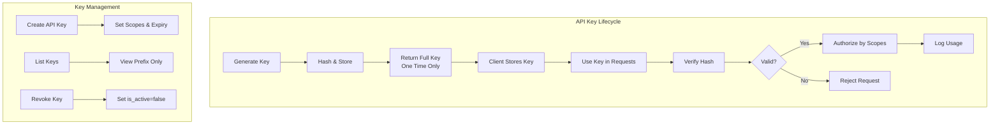
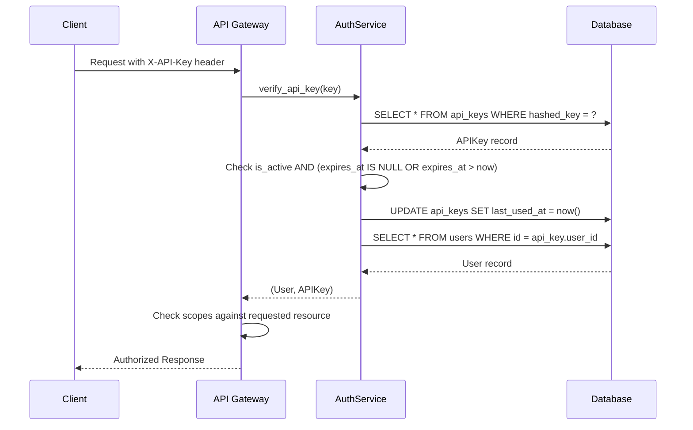

# API Key Design Document

**Created**: 2025-11-20  
**Updated**: 2025-04-22  
**Status**: Approved  
**Purpose**: Design specification for API key management system, including key generation, storage, rotation, and revocation mechanisms.

**Source Files**:
- `backend/omoi_os/services/auth_service.py` (lines 344-443)
- `backend/omoi_os/models/auth.py` (lines 76-166)
- `frontend/lib/api/auth.ts` (lines 131-156)

**Related Documents**:
- [Organization Auth](./organization_auth.md)
- [RBAC Design](./rbac_design.md)
- [ADR: Authentication System](../../architecture/auth/adr_auth_system.md)

---

## Table of Contents

1. [Architecture Overview](#architecture-overview)
2. [Data Models](#data-models)
3. [API Surface](#api-surface)
4. [Integration Points](#integration-points)
5. [Configuration](#configuration)
6. [Security Considerations](#security-considerations)
7. [Related Documentation](#related-documentation)

---

## Architecture Overview

The API Key Management System provides programmatic access to OmoiOS resources for users and agents. It implements a secure key generation, storage, and verification mechanism with support for scoped permissions, organization-level isolation, and automatic expiration.

### Key Design Principles

1. **One-Time Key Display**: Full API keys are returned only once during creation and never stored in plaintext
2. **Hashed Storage**: Only SHA-256 hashes of keys are stored in the database
3. **Prefix Identification**: First 16 characters stored as prefix for key identification without revealing full key
4. **Scoped Permissions**: JSONB scopes array controls what operations each key can perform
5. **Dual Ownership**: Keys can be owned by either users or agents (enforced by CHECK constraint)

### System Architecture



---

## Data Models

### APIKey Model (SQLAlchemy)

**File**: `backend/omoi_os/models/auth.py`

```python
class APIKey(Base):
    """API key for programmatic access (users and agents)."""
    
    __tablename__ = "api_keys"
    
    # Primary key
    id: Mapped[UUID] = mapped_column(PGUUID(as_uuid=True), primary_key=True, default=uuid4)
    
    # Ownership (user OR agent, enforced by CHECK constraint)
    user_id: Mapped[Optional[UUID]] = mapped_column(
        PGUUID(as_uuid=True), ForeignKey("users.id", ondelete="CASCADE"),
        nullable=True, index=True
    )
    agent_id: Mapped[Optional[str]] = mapped_column(
        String, ForeignKey("agents.id", ondelete="CASCADE"),
        nullable=True, index=True,
        comment="VARCHAR to match agents.id type"
    )
    
    # Organization isolation
    organization_id: Mapped[Optional[UUID]] = mapped_column(
        PGUUID(as_uuid=True), ForeignKey("organizations.id", ondelete="CASCADE"),
        nullable=True
    )
    
    # Key data
    name: Mapped[str] = mapped_column(
        String(255), nullable=False,
        comment="User-defined label for the key"
    )
    key_prefix: Mapped[str] = mapped_column(
        String(16), nullable=False, index=True,
        comment="First 8-16 chars for identification (e.g., 'sk_live_abc')"
    )
    hashed_key: Mapped[str] = mapped_column(
        String(255), nullable=False, unique=True,
        comment="SHA-256 hash of full API key"
    )
    scopes: Mapped[list[str]] = mapped_column(
        JSONB, nullable=False, default=list,
        comment="Permission scopes for this key"
    )
    
    # Status tracking
    is_active: Mapped[bool] = mapped_column(Boolean, default=True, nullable=False)
    last_used_at: Mapped[Optional[datetime]] = mapped_column(DateTime(timezone=True), nullable=True)
    expires_at: Mapped[Optional[datetime]] = mapped_column(DateTime(timezone=True), nullable=True)
    created_at: Mapped[datetime] = mapped_column(DateTime(timezone=True), nullable=False, default=utc_now)
```

### Database Schema

| Column | Type | Constraints | Description |
|--------|------|-------------|-------------|
| `id` | UUID | PK, auto-generated | Unique identifier |
| `user_id` | UUID | FK → users.id, nullable | Owner if user-owned |
| `agent_id` | VARCHAR | FK → agents.id, nullable | Owner if agent-owned |
| `organization_id` | UUID | FK → organizations.id, nullable | Org isolation |
| `name` | VARCHAR(255) | NOT NULL | Human-readable label |
| `key_prefix` | VARCHAR(16) | NOT NULL, indexed | Identification prefix |
| `hashed_key` | VARCHAR(255) | NOT NULL, unique | SHA-256 hash |
| `scopes` | JSONB | NOT NULL, default=[] | Permission array |
| `is_active` | BOOLEAN | NOT NULL, default=true | Revocation flag |
| `last_used_at` | TIMESTAMP | Nullable | Usage tracking |
| `expires_at` | TIMESTAMP | Nullable | Expiration date |
| `created_at` | TIMESTAMP | NOT NULL | Creation timestamp |

### Constraints

```sql
-- Enforce single ownership (user OR agent, not both)
CHECK (
    (user_id IS NOT NULL AND agent_id IS NULL) OR 
    (user_id IS NULL AND agent_id IS NOT NULL)
)

-- Indexes for performance
CREATE INDEX idx_api_keys_user ON api_keys(user_id) WHERE user_id IS NOT NULL;
CREATE INDEX idx_api_keys_agent ON api_keys(agent_id) WHERE agent_id IS NOT NULL;
CREATE INDEX idx_api_keys_prefix ON api_keys(key_prefix);
CREATE INDEX idx_api_keys_hash ON api_keys(hashed_key);
CREATE INDEX idx_api_keys_active ON api_keys(is_active) WHERE is_active = true;
```

---

## API Surface

### Backend Service Methods

**File**: `backend/omoi_os/services/auth_service.py`

#### Generate API Key

```python
def generate_api_key(self) -> Tuple[str, str, str]:
    """
    Generate API key.
    
    Returns:
        Tuple of (full_key, prefix, hashed_key)
        
    Format: sk_live_{32_char_random}
    """
    random_part = secrets.token_urlsafe(32)
    full_key = f"sk_live_{random_part}"
    prefix = full_key[:16]
    hashed_key = hashlib.sha256(full_key.encode()).hexdigest()
    return full_key, prefix, hashed_key
```

#### Create API Key

```python
async def create_api_key(
    self,
    user_id: UUID,
    name: str,
    scopes: Optional[list[str]] = None,
    organization_id: Optional[UUID] = None,
    expires_in_days: Optional[int] = None,
) -> Tuple[APIKey, str]:
    """
    Create API key for user.
    
    Returns:
        Tuple of (APIKey object, full_key_string)
        
    Note: Full key is returned only once!
    """
```

#### Verify API Key

```python
async def verify_api_key(self, key: str) -> Optional[Tuple[User, APIKey]]:
    """
    Verify API key and return associated user.
    
    Returns:
        Tuple of (User, APIKey) if valid, None if invalid
        
    Process:
        1. Hash the provided key
        2. Lookup by hashed_key in database
        3. Check is_active and expiration
        4. Update last_used_at timestamp
    """
```

#### Revoke API Key

```python
async def revoke_api_key(self, key_id: UUID):
    """Revoke an API key by setting is_active=False."""
    await self.db.execute(
        update(APIKey).where(APIKey.id == key_id).values(is_active=False)
    )
    await self.db.commit()
```

### Frontend API Functions

**File**: `frontend/lib/api/auth.ts`

```typescript
// Create a new API key
export async function createApiKey(
  data: APIKeyCreate
): Promise<APIKeyWithSecret> {
  return api.post<APIKeyWithSecret>("/api/v1/auth/api-keys", data);
}

// List all API keys (returns prefix only, never full key)
export async function listApiKeys(): Promise<APIKey[]> {
  return api.get<APIKey[]>("/api/v1/auth/api-keys");
}

// Revoke an API key
export async function revokeApiKey(keyId: string): Promise<MessageResponse> {
  return api.delete<MessageResponse>(`/api/v1/auth/api-keys/${keyId}`);
}
```

### TypeScript Types

```typescript
interface APIKey {
  id: string;
  name: string;
  key_prefix: string;  // e.g., "sk_live_abc123"
  scopes: string[];
  is_active: boolean;
  last_used_at?: string;
  expires_at?: string;
  created_at: string;
  organization_id?: string;
}

interface APIKeyWithSecret extends APIKey {
  full_key: string;  // Only returned on creation
}

interface APIKeyCreate {
  name: string;
  scopes?: string[];
  organization_id?: string;
  expires_in_days?: number;
}
```

---

## Integration Points

### Authentication Flow



### Scope-Based Authorization

API keys use scoped permissions stored as JSONB array:

```python
# Example scopes
scopes = [
    "projects:read",      # Read project data
    "projects:write",     # Create/modify projects
    "specs:read",         # Read specifications
    "agents:read",        # Read agent status
    "tickets:read",       # Read tickets
    "org:read",           # Read organization data
]
```

Scope checking integrates with RBAC:

```python
def check_api_key_scope(api_key: APIKey, required_scope: str) -> bool:
    """Check if API key has required scope."""
    if not api_key.is_active:
        return False
    if api_key.expires_at and api_key.expires_at < utc_now():
        return False
    return required_scope in api_key.scopes
```

### Organization Isolation

When `organization_id` is set on an API key:
- All requests are scoped to that organization
- Cross-organization access is blocked
- Membership validation is performed

---

## Configuration

### Environment Variables

```bash
# JWT settings for token-based auth (complements API keys)
AUTH_JWT_SECRET_KEY=your-secret-key
AUTH_JWT_ALGORITHM=HS256
AUTH_ACCESS_TOKEN_EXPIRE_MINUTES=15
AUTH_REFRESH_TOKEN_EXPIRE_DAYS=7
```

### Default Scopes

System-defined scope categories:

| Category | Scopes | Description |
|----------|--------|-------------|
| Projects | `projects:read`, `projects:write`, `projects:delete` | Project management |
| Specs | `specs:read`, `specs:write`, `specs:execute` | Specification operations |
| Agents | `agents:read`, `agents:write`, `agents:control` | Agent management |
| Tickets | `tickets:read`, `tickets:write`, `tickets:delete` | Ticket operations |
| Organization | `org:read`, `org:write`, `org:admin` | Org-level access |
| Billing | `billing:read`, `billing:write` | Billing operations |

---

## Security Considerations

### Key Storage Security

1. **Never Store Full Keys**: Only SHA-256 hashes are stored
2. **One-Time Display**: Full key shown only at creation time
3. **Secure Generation**: Uses `secrets.token_urlsafe(32)` for cryptographically secure randomness
4. **Prefix Safety**: First 16 characters stored for identification without compromising security

### Transmission Security

```python
# API keys must be sent in header
headers = {
    "X-API-Key": "REDACTED_STRIPE_KEY"
}

# Never in URL parameters or body
```

### Revocation Strategy

```python
# Soft delete pattern - preserve audit trail
async def revoke_api_key(self, key_id: UUID):
    """Revoke key by deactivating (preserves history)."""
    await self.db.execute(
        update(APIKey)
        .where(APIKey.id == key_id)
        .values(
            is_active=False,
            # Keep record for audit purposes
        )
    )
```

### Rate Limiting

API keys are subject to rate limiting based on scope:

```python
RATE_LIMITS = {
    "default": (1000, 3600),      # 1000 requests/hour
    "agents:control": (100, 3600), # 100 control ops/hour
    "specs:execute": (50, 3600),   # 50 executions/hour
}
```

---

## Related Documentation

| Document | Purpose |
|----------|---------|
| [Organization Auth](./organization_auth.md) | Organization-level authentication |
| [RBAC Design](./rbac_design.md) | Role-based access control integration |
| [ADR: Authentication System](../../architecture/auth/adr_auth_system.md) | Architecture decisions for auth |
| [User Journey: API Keys](../../user_journey/16_api_keys_management.md) | End-user API key management flow |
| [Frontend Auth](../../design/frontend/authentication_system.md) | Frontend authentication implementation |

---

## Changelog

| Date | Change | Author |
|------|--------|--------|
| 2025-11-20 | Initial draft | System |
| 2025-04-22 | Expanded with full implementation details | AI Agent |

---

*This document is part of the OmoiOS design documentation. For questions or updates, refer to the source files listed above.*
