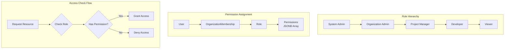

# RBAC Design Document

**Created**: 2025-11-20  
**Updated**: 2025-04-22  
**Status**: Approved  
**Purpose**: Design specification for Role-Based Access Control (RBAC) system, including role definitions, permission hierarchies, and access control mechanisms.

**Source Files**:
- `backend/omoi_os/services/auth_service.py` (lines 40-56, 176-278)
- `backend/omoi_os/models/organization.py` (lines 33-228)
- `backend/omoi_os/models/user.py` (lines 22-114)

**Related Documents**:
- [Organization Auth](./organization_auth.md)
- [API Key Design](./api_key_design.md)
- [ADR: Authentication System](../../architecture/auth/adr_auth_system.md)

---

## Table of Contents

1. [Architecture Overview](#architecture-overview)
2. [Data Models](#data-models)
3. [Permission System](#permission-system)
4. [API Surface](#api-surface)
5. [Integration Points](#integration-points)
6. [Configuration](#configuration)
7. [Related Documentation](#related-documentation)

---

## Architecture Overview

The RBAC system provides fine-grained access control for OmoiOS resources. It implements a hierarchical role structure with support for organization-specific custom roles, permission inheritance, and attribute-based access control (ABAC) extensions.

### Key Design Principles

1. **Hierarchical Roles**: Roles can inherit from parent roles, reducing permission duplication
2. **Organization Isolation**: Each organization can define custom roles scoped to their tenant
3. **System Roles**: Predefined roles (admin, member, viewer) available across all organizations
4. **Permission Granularity**: Fine-grained permissions like `project:read`, `spec:write`, `agent:control`
5. **ABAC Integration**: User and organization attributes can influence access decisions

### System Architecture



---

## Data Models

### Organization Model

**File**: `backend/omoi_os/models/organization.py` (lines 33-98)

```python
class Organization(Base):
    """Organization for multi-tenant resource isolation."""
    
    __tablename__ = "organizations"
    
    # Identity
    id: Mapped[UUID] = mapped_column(PGUUID(as_uuid=True), primary_key=True, default=uuid4)
    name: Mapped[str] = mapped_column(String(255), nullable=False)
    slug: Mapped[str] = mapped_column(String(255), nullable=False, unique=True, index=True)
    description: Mapped[Optional[str]] = mapped_column(Text, nullable=True)
    
    # Ownership
    owner_id: Mapped[UUID] = mapped_column(
        PGUUID(as_uuid=True), ForeignKey("users.id"), nullable=False, index=True
    )
    
    # Settings
    billing_email: Mapped[Optional[str]] = mapped_column(String(255), nullable=True)
    is_active: Mapped[bool] = mapped_column(Boolean, default=True, nullable=False)
    settings: Mapped[Optional[dict]] = mapped_column(JSONB, nullable=True)
    org_attributes: Mapped[Optional[dict]] = mapped_column(
        JSONB, nullable=True,
        comment="ABAC attributes for organization-level policies"
    )
    
    # Resource Limits
    max_concurrent_agents: Mapped[int] = mapped_column(Integer, default=5, nullable=False)
    max_agent_runtime_hours: Mapped[float] = mapped_column(Float, default=100.0, nullable=False)
    
    # Relationships
    owner: Mapped["User"] = relationship(back_populates="owned_organizations")
    memberships: Mapped[list["OrganizationMembership"]] = relationship(
        back_populates="organization", cascade="all, delete-orphan"
    )
    roles: Mapped[list["Role"]] = relationship(
        back_populates="organization", cascade="all, delete-orphan"
    )
```

### OrganizationMembership Model

**File**: `backend/omoi_os/models/organization.py` (lines 100-177)

```python
class OrganizationMembership(Base):
    """Join table for organization members (users and agents)."""
    
    __tablename__ = "organization_memberships"
    
    id: Mapped[UUID] = mapped_column(PGUUID(as_uuid=True), primary_key=True, default=uuid4)
    
    # Member (user OR agent, enforced by CHECK constraint)
    user_id: Mapped[Optional[UUID]] = mapped_column(
        PGUUID(as_uuid=True), ForeignKey("users.id", ondelete="CASCADE"),
        nullable=True, index=True
    )
    agent_id: Mapped[Optional[str]] = mapped_column(
        String, ForeignKey("agents.id", ondelete="CASCADE"),
        nullable=True, index=True,
        comment="VARCHAR to match agents.id type"
    )
    
    organization_id: Mapped[UUID] = mapped_column(
        PGUUID(as_uuid=True), ForeignKey("organizations.id", ondelete="CASCADE"),
        nullable=False, index=True
    )
    role_id: Mapped[UUID] = mapped_column(
        PGUUID(as_uuid=True), ForeignKey("roles.id"), nullable=False
    )
    
    # Audit
    invited_by: Mapped[Optional[UUID]] = mapped_column(
        PGUUID(as_uuid=True), ForeignKey("users.id"), nullable=True
    )
    joined_at: Mapped[datetime] = mapped_column(
        DateTime(timezone=True), nullable=False, default=utc_now
    )
    updated_at: Mapped[datetime] = mapped_column(
        DateTime(timezone=True), nullable=False, default=utc_now, onupdate=utc_now
    )
    
    # Relationships
    user: Mapped[Optional["User"]] = relationship(back_populates="memberships")
    agent: Mapped[Optional["Agent"]] = relationship(back_populates="memberships")
    organization: Mapped["Organization"] = relationship(back_populates="memberships")
    role: Mapped["Role"] = relationship()
```

### Role Model

**File**: `backend/omoi_os/models/organization.py` (lines 179-228)

```python
class Role(Base):
    """Role for RBAC permissions."""
    
    __tablename__ = "roles"
    
    id: Mapped[UUID] = mapped_column(PGUUID(as_uuid=True), primary_key=True, default=uuid4)
    
    # NULL for system roles, set for custom org roles
    organization_id: Mapped[Optional[UUID]] = mapped_column(
        PGUUID(as_uuid=True), ForeignKey("organizations.id", ondelete="CASCADE"),
        nullable=True,
        comment="NULL for system roles, set for custom org roles"
    )
    
    name: Mapped[str] = mapped_column(String(100), nullable=False)
    description: Mapped[Optional[str]] = mapped_column(Text, nullable=True)
    permissions: Mapped[list[str]] = mapped_column(
        JSONB, nullable=False,
        comment="Array of permission strings (e.g., ['org:read', 'project:*'])"
    )
    is_system: Mapped[bool] = mapped_column(
        Boolean, default=False, nullable=False,
        comment="True for predefined system roles"
    )
    
    # Role inheritance
    inherits_from: Mapped[Optional[UUID]] = mapped_column(
        PGUUID(as_uuid=True), ForeignKey("roles.id", ondelete="SET NULL"), nullable=True
    )
    
    created_at: Mapped[datetime] = mapped_column(
        DateTime(timezone=True), nullable=False, default=utc_now
    )
    
    # Relationships
    organization: Mapped[Optional["Organization"]] = relationship(back_populates="roles")
    parent_role: Mapped[Optional["Role"]] = relationship(
        remote_side=[id], backref="child_roles"
    )
```

### User Model (ABAC Attributes)

**File**: `backend/omoi_os/models/user.py` (lines 22-114)

```python
class User(Base):
    """User model for authentication and multi-tenant organizations."""
    
    # Identity fields...
    
    # ABAC Attributes
    department: Mapped[Optional[str]] = mapped_column(
        String(100), nullable=True, index=True
    )
    attributes: Mapped[Optional[dict]] = mapped_column(JSONB, nullable=True)
    
    # Status flags
    is_active: Mapped[bool] = mapped_column(Boolean, default=True, nullable=False)
    is_verified: Mapped[bool] = mapped_column(Boolean, default=False, nullable=False)
    is_super_admin: Mapped[bool] = mapped_column(
        Boolean, default=False, nullable=False, index=True
    )
    
    # Relationships
    memberships: Mapped[list["OrganizationMembership"]] = relationship(
        back_populates="user",
        foreign_keys="OrganizationMembership.user_id",
        cascade="all, delete-orphan"
    )
    owned_organizations: Mapped[list["Organization"]] = relationship(
        back_populates="owner", foreign_keys="Organization.owner_id"
    )
```

### Database Schema Summary

| Table | Purpose | Key Constraints |
|-------|---------|-----------------|
| `organizations` | Multi-tenant isolation | slug UNIQUE, owner_id FK |
| `organization_memberships` | User/org join table | CHECK (user_id OR agent_id), UNIQUE(user_id, org_id) |
| `roles` | Role definitions | UNIQUE(org_id, name), FK to parent role |
| `users` | User accounts | email UNIQUE, is_super_admin indexed |

---

## Permission System

### Permission Format

Permissions follow a resource:action pattern with wildcard support:

```python
# Permission string format
"resource:action"

# Examples
"org:read"              # Read organization data
"org:write"             # Modify organization settings
"org:admin"             # Full organization control
"project:*"             # All project actions
"project:read"          # Read projects only
"spec:write"            # Create/modify specs
"agent:control"         # Control agent execution
"ticket:delete"         # Delete tickets
"billing:read"          # View billing info
"billing:write"         # Modify billing settings
```

### System Roles

| Role | Permissions | Description |
|------|-------------|-------------|
| `super_admin` | `*` | Full system access |
| `org_admin` | `org:*`, `project:*`, `member:*`, `billing:*` | Organization administration |
| `org_manager` | `org:read`, `project:*`, `member:read` | Project management |
| `developer` | `project:read`, `spec:*`, `agent:control`, `ticket:*` | Standard development |
| `viewer` | `project:read`, `spec:read`, `ticket:read` | Read-only access |

### Permission Inheritance

```python
def get_effective_permissions(role: Role) -> set[str]:
    """Get all permissions including inherited ones."""
    permissions = set(role.permissions)
    
    # Walk up inheritance chain
    current = role
    while current.inherits_from:
        parent = current.parent_role
        permissions.update(parent.permissions)
        current = parent
    
    return permissions
```

### ABAC Attribute Checks

```python
def check_abac_access(
    user: User,
    organization: Organization,
    resource: str,
    action: str,
    context: dict
) -> bool:
    """
    Attribute-based access control check.
    
    Examples:
    - Department-based access to projects
    - Time-based restrictions
    - Resource ownership checks
    """
    # Check department match for sensitive resources
    if resource in {"billing", "org_settings"}:
        user_dept = user.attributes.get("department") if user.attributes else None
        org_dept = organization.org_attributes.get("department") if organization.org_attributes else None
        
        if user_dept and org_dept and user_dept != org_dept:
            return False
    
    # Check standard RBAC
    return check_rbac_permission(user, organization, f"{resource}:{action}")
```

---

## API Surface

### Backend Service Methods

**File**: `backend/omoi_os/services/auth_service.py`

#### Check User Access

```python
async def get_user_by_id(self, user_id: UUID) -> Optional[User]:
    """Get user by ID with active status check."""
    result = await self.db.execute(
        select(User).where(
            User.id == user_id,
            User.is_active.is_(True),
            User.deleted_at.is_(None)
        )
    )
    return result.scalar_one_or_none()

async def get_user_by_email(self, email: str) -> Optional[User]:
    """Get user by email (includes inactive for auth flows)."""
    result = await self.db.execute(
        select(User).where(User.email == email, User.deleted_at.is_(None))
    )
    return result.scalar_one_or_none()
```

### Permission Checking

```python
class RBACService:
    """Service for role-based access control operations."""
    
    def __init__(self, db: AsyncSession):
        self.db = db
    
    async def check_permission(
        self,
        user_id: UUID,
        organization_id: UUID,
        permission: str
    ) -> bool:
        """
        Check if user has permission in organization.
        
        Args:
            user_id: User to check
            organization_id: Organization context
            permission: Permission string (e.g., 'project:write')
            
        Returns:
            True if user has permission
        """
        # Get user's role in organization
        result = await self.db.execute(
            select(OrganizationMembership)
            .where(
                OrganizationMembership.user_id == user_id,
                OrganizationMembership.organization_id == organization_id
            )
            .options(joinedload(OrganizationMembership.role))
        )
        membership = result.scalar_one_or_none()
        
        if not membership:
            return False
        
        # Get effective permissions
        permissions = get_effective_permissions(membership.role)
        
        # Check exact match or wildcard
        return (
            permission in permissions or
            f"{permission.split(':')[0]}:*" in permissions or
            "*" in permissions
        )
    
    async def get_user_roles(
        self,
        user_id: UUID,
        organization_id: Optional[UUID] = None
    ) -> list[Role]:
        """Get all roles for user (optionally filtered by org)."""
        query = select(Role).join(
            OrganizationMembership,
            OrganizationMembership.role_id == Role.id
        ).where(OrganizationMembership.user_id == user_id)
        
        if organization_id:
            query = query.where(
                OrganizationMembership.organization_id == organization_id
            )
        
        result = await self.db.execute(query)
        return list(result.scalars().all())
```

---

## Integration Points

### Middleware Integration

```python
# FastAPI dependency for route protection
async def require_permission(permission: str):
    """Dependency factory for permission checking."""
    async def checker(
        request: Request,
        current_user: User = Depends(get_current_user),
        db: AsyncSession = Depends(get_db)
    ):
        org_id = request.path_params.get("organization_id")
        if not org_id:
            raise HTTPException(400, "Organization context required")
        
        rbac = RBACService(db)
        has_perm = await rbac.check_permission(
            current_user.id, UUID(org_id), permission
        )
        
        if not has_perm:
            raise HTTPException(403, f"Missing permission: {permission}")
        
        return current_user
    
    return checker

# Usage in routes
@app.post("/api/v1/projects")
async def create_project(
    data: ProjectCreate,
    user: User = Depends(require_permission("project:write"))
):
    """Create project - requires project:write permission."""
    ...
```

### Organization Context Resolution

```python
async def resolve_organization(
    request: Request,
    user: User = Depends(get_current_user),
    db: AsyncSession = Depends(get_db)
) -> Organization:
    """Resolve organization from request context."""
    # Priority: path param > header > user's default org
    org_id = (
        request.path_params.get("organization_id") or
        request.headers.get("X-Organization-ID")
    )
    
    if org_id:
        org = await db.get(Organization, UUID(org_id))
        if not org:
            raise HTTPException(404, "Organization not found")
        return org
    
    # Fall back to user's primary organization
    result = await db.execute(
        select(Organization)
        .join(OrganizationMembership)
        .where(OrganizationMembership.user_id == user.id)
        .order_by(OrganizationMembership.joined_at.desc())
        .limit(1)
    )
    org = result.scalar_one_or_none()
    
    if not org:
        raise HTTPException(400, "No organization context available")
    
    return org
```

---

## Configuration

### Default Role Definitions

```yaml
# config/base.yaml
rbac:
  system_roles:
    - name: super_admin
      permissions: ["*"]
      is_system: true
      
    - name: org_admin
      permissions:
        - "org:*"
        - "project:*"
        - "member:*"
        - "billing:*"
        - "role:*"
      is_system: true
      
    - name: org_manager
      permissions:
        - "org:read"
        - "project:*"
        - "member:read"
        - "spec:*"
        - "agent:control"
      is_system: true
      inherits_from: viewer
      
    - name: developer
      permissions:
        - "project:read"
        - "spec:*"
        - "agent:control"
        - "ticket:*"
      is_system: true
      inherits_from: viewer
      
    - name: viewer
      permissions:
        - "org:read"
        - "project:read"
        - "spec:read"
        - "ticket:read"
        - "agent:read"
      is_system: true
```

### Resource Limits by Role

```python
# Organization resource limits
RESOURCE_LIMITS = {
    "super_admin": {
        "max_concurrent_agents": float("inf"),
        "max_agent_runtime_hours": float("inf"),
    },
    "org_admin": {
        "max_concurrent_agents": 20,
        "max_agent_runtime_hours": 500,
    },
    "org_manager": {
        "max_concurrent_agents": 10,
        "max_agent_runtime_hours": 200,
    },
    "developer": {
        "max_concurrent_agents": 5,
        "max_agent_runtime_hours": 100,
    },
    "viewer": {
        "max_concurrent_agents": 0,
        "max_agent_runtime_hours": 0,
    },
}
```

---

## Related Documentation

| Document | Purpose |
|----------|---------|
| [Organization Auth](./organization_auth.md) | Organization-level authentication flows |
| [API Key Design](./api_key_design.md) | API key authentication and scoped access |
| [ADR: Authentication System](../../architecture/auth/adr_auth_system.md) | Architecture decisions for auth |
| [User Journey: Organization Management](../../user_journey/17_organization_management.md) | End-user org management flow |
| [Frontend: Organizations](../../design/frontend/organizations_multi_tenancy.md) | Frontend org/team UI |

---

## Changelog

| Date | Change | Author |
|------|--------|--------|
| 2025-11-20 | Initial draft | System |
| 2025-04-22 | Expanded with full RBAC implementation details | AI Agent |

---

*This document is part of the OmoiOS design documentation. For questions or updates, refer to the source files listed above.*
