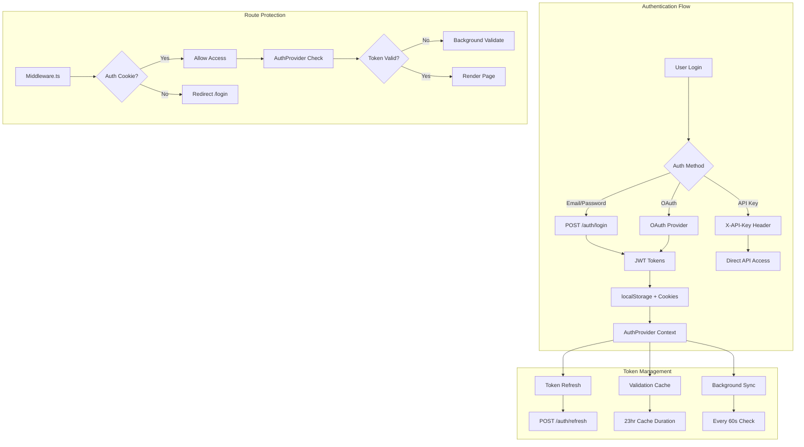
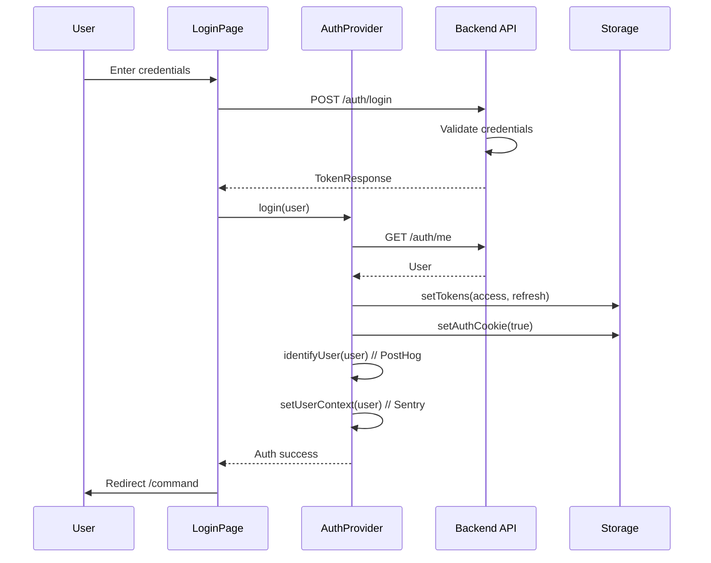
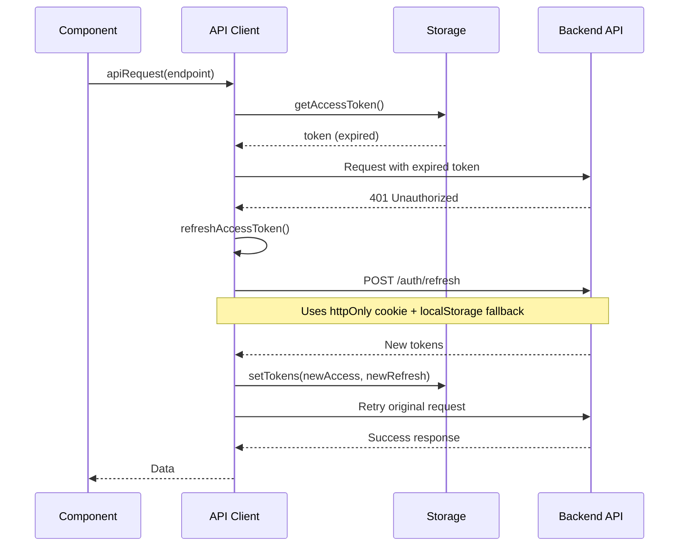
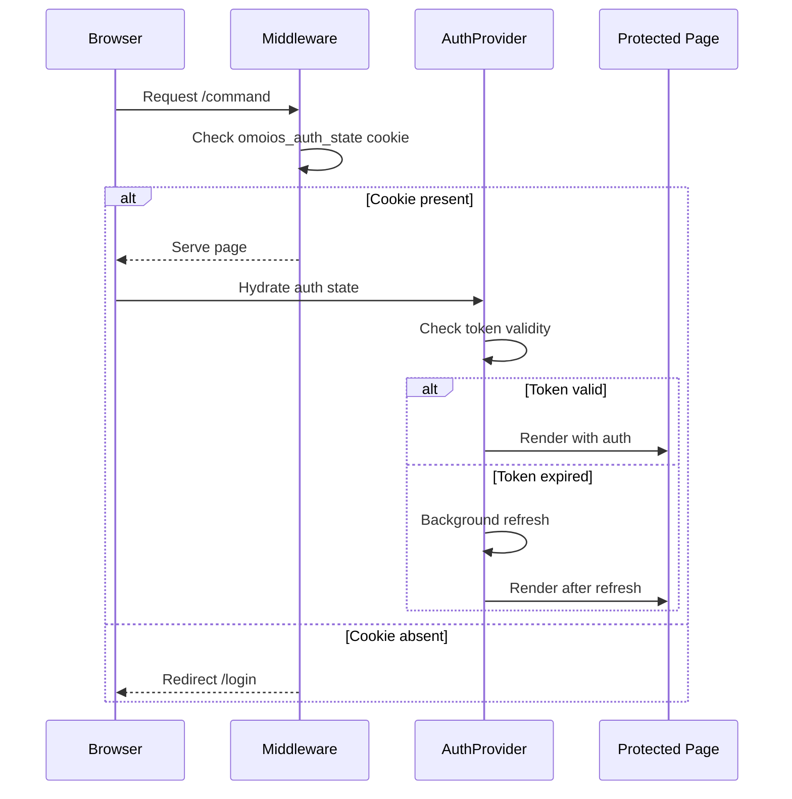

# Frontend Authentication System

**Created**: 2025-04-22
**Status**: Active
**Purpose**: Comprehensive documentation of the OmoiOS frontend authentication architecture including JWT + OAuth flows, session management, protected routes, and role-based access control.
**Related Docs**: 
- [Backend Auth Architecture](../../architecture/07-auth-and-security.md)
- API Client
- [Organizations System](./organizations_multi_tenancy.md)

---

## 1. Architecture Overview

The OmoiOS authentication system implements a hybrid approach combining JWT tokens for API authentication, OAuth for social login, and API keys for programmatic access. The frontend architecture is designed for security, performance, and seamless user experience.



### 1.1 Core Components

| Component | File Path | Responsibility |
|-----------|-----------|----------------|
| AuthProvider | `frontend/providers/AuthProvider.tsx` | React context for auth state, token management, user sync |
| API Client | `frontend/lib/api/client.ts` | Token storage, refresh logic, request interception |
| Auth API | `frontend/lib/api/auth.ts` | Authentication endpoint wrappers |
| Auth Hook | `frontend/hooks/useAuth.ts` | Re-export of AuthProvider hooks |
| Middleware | `frontend/middleware.ts` | Edge-level route protection |

---

## 2. Component Map

### 2.1 AuthProvider Architecture

The `AuthProvider` is the central authentication state manager using Zustand for persistence and React Context for component access.

```mermaid
graph LR
    subgraph "AuthProvider State"
        A[useAuthStore<br/>Zustand + Persist] --> B[user: User \| null]
        A --> C[isLoading: boolean]
        A --> D[isAuthenticated: boolean]
        A --> E[error: string \| null]
        A --> F[lastValidatedAt: number]
    end
    
    subgraph "Actions"
        G[setUser] --> H[Update Sentry Context]
        G --> I[Identify PostHog]
        J[login] --> K[Set Tokens]
        J --> L[Track Analytics]
        M[logout] --> N[Clear Tokens]
        M --> O[Reset Analytics]
        P[refreshUser] --> Q[GET /auth/me]
    end
```

**Key Features:**
- **Dual Token Storage**: Access token in localStorage, auth state in cookie for middleware
- **Background Validation**: Non-blocking token validation every 23 hours
- **Auto-refresh**: Proactive token refresh 2 minutes before expiry
- **Analytics Integration**: Automatic user identification in PostHog on login
- **Error Tracking**: Sentry user context updated on auth state changes

### 2.2 Authentication Pages

| Page | Route | Component | Purpose |
|------|-------|-----------|---------|
| Login | `/login` | `app/(auth)/login/page.tsx` | Email/password + OAuth login |
| Register | `/register` | `app/(auth)/register/page.tsx` | New user registration |
| Verify Email | `/verify-email` | `app/(auth)/verify-email/page.tsx` | Email verification handler |
| Forgot Password | `/forgot-password` | `app/(auth)/forgot-password/page.tsx` | Password reset request |
| Reset Password | `/reset-password` | `app/(auth)/reset-password/page.tsx` | Password reset confirmation |
| OAuth Callback | `/callback` | `app/(auth)/callback/page.tsx` | OAuth provider callback |

### 2.3 Auth Layout

```typescript
// frontend/app/(auth)/layout.tsx
export default function AuthLayout({ children }) {
  return (
    <div className="flex min-h-screen flex-col items-center justify-center">
      <Link href="/" className="mb-8">
        <OmoiOSLogo size="xl" />
      </Link>
      <Card className="w-full max-w-md p-6">{children}</Card>
      <footer>© {new Date().getFullYear()} OmoiOS</footer>
    </div>
  );
}
```

---

## 3. State Management

### 3.1 Zustand Auth Store

```typescript
// Core state structure
interface AuthState {
  user: User | null;
  isLoading: boolean;
  isAuthenticated: boolean;
  error: string | null;
  lastValidatedAt: number | null;
  
  // Actions
  setUser: (user: User | null) => void;
  setLoading: (loading: boolean) => void;
  setError: (error: string | null) => void;
  setLastValidatedAt: (timestamp: number | null) => void;
  reset: () => void;
}

// Persistence configuration
const useAuthStore = create<AuthState>()(
  persist(
    (set) => ({ /* implementation */ }),
    {
      name: "omoios-auth",
      partialize: (state) => ({
        user: state.user,
        isAuthenticated: state.isAuthenticated,
        lastValidatedAt: state.lastValidatedAt,
      }),
    }
  )
);
```

### 3.2 Token Storage Strategy

| Storage | Key | Value | Purpose |
|---------|-----|-------|---------|
| localStorage | `omoios_access_token` | JWT access token | API authentication |
| localStorage | `omoios_refresh_token` | JWT refresh token | Token refresh |
| localStorage | `omoios_access_expires_at` | Expiry timestamp | Client-side validation |
| localStorage | `omoios_last_validated` | Validation timestamp | Cache control |
| Cookie | `omoios_auth_state` | `true` | Middleware edge detection |

### 3.3 React Query Integration

Auth state does not use React Query (it's client-only), but auth mutations invalidate related queries:

```typescript
// On login success
queryClient.invalidateQueries({ queryKey: ["organizations"] });
queryClient.invalidateQueries({ queryKey: ["projects"] });

// On logout
queryClient.clear(); // Clear all cached data
```

---

## 4. API Surface

### 4.1 Authentication Endpoints

| Endpoint | Method | Auth Required | Purpose |
|----------|--------|---------------|---------|
| `/api/v1/auth/register` | POST | No | User registration |
| `/api/v1/auth/login` | POST | No | Email/password login |
| `/api/v1/auth/logout` | POST | Yes | Session termination |
| `/api/v1/auth/refresh` | POST | No | Token refresh (cookie-based) |
| `/api/v1/auth/me` | GET | Yes | Current user profile |
| `/api/v1/auth/verify-email` | POST | No | Email verification |
| `/api/v1/auth/resend-verification` | POST | No | Resend verification email |
| `/api/v1/auth/forgot-password` | POST | No | Password reset request |
| `/api/v1/auth/reset-password` | POST | No | Password reset confirmation |
| `/api/v1/auth/change-password` | POST | Yes | Password change (authenticated) |

### 4.2 OAuth Endpoints

| Endpoint | Method | Purpose |
|----------|--------|---------|
| `/api/v1/auth/oauth/github` | GET | Initiate GitHub OAuth flow |
| `/api/v1/auth/oauth/google` | GET | Initiate Google OAuth flow |
| `/api/v1/auth/oauth/github/connect` | POST | Authenticated GitHub connect |

### 4.3 API Key Endpoints

| Endpoint | Method | Purpose |
|----------|--------|---------|
| `/api/v1/auth/api-keys` | GET | List API keys |
| `/api/v1/auth/api-keys` | POST | Create new API key |
| `/api/v1/auth/api-keys/{id}` | DELETE | Revoke API key |

### 4.4 TypeScript Types

```typescript
// From frontend/lib/api/types.ts

interface User {
  id: string;
  email: string;
  full_name: string | null;
  department: string | null;
  is_active: boolean;
  is_verified: boolean;
  is_super_admin: boolean;
  avatar_url: string | null;
  attributes: Record<string, unknown> | null;
  waitlist_status: "pending" | "approved" | "none";
  created_at: string;
  last_login_at: string | null;
}

interface TokenResponse {
  access_token: string;
  refresh_token: string;
  token_type: string;
  expires_in: number;
}

interface APIKey {
  id: string;
  name: string;
  key_prefix: string;
  scopes: string[];
  is_active: boolean;
  last_used_at: string | null;
  expires_at: string | null;
  created_at: string;
}
```

---

## 5. Data Flow

### 5.1 Login Flow



### 5.2 Token Refresh Flow



### 5.3 Route Protection Flow



---

## 6. Error Handling

### 6.1 Error Types

```typescript
class ApiError extends Error {
  status: number;
  code?: string;
  errors?: ValidationError[];
  
  constructor(message, status, code?, errors?) {
    super(message);
    this.name = "ApiError";
    this.status = status;
    this.code = code;
    this.errors = errors;
  }
}
```

### 6.2 Error Scenarios

| Scenario | Status | Code | Handling |
|----------|--------|------|----------|
| Invalid credentials | 401 | - | Display error message |
| Token expired | 401 | - | Auto-refresh, retry |
| Rate limited | 429 | rate_limited | Show retry countdown |
| Validation error | 422 | VALIDATION_ERROR | Display field errors |
| Account locked | 403 | - | Contact support message |
| Email not verified | 403 | - | Resend verification option |

### 6.3 AuthProvider Error States

```typescript
// Error handling in AuthProvider
const logout = useCallback(async () => {
  try {
    track(ANALYTICS_EVENTS.USER_LOGGED_OUT, {});
    await apiLogout();
  } catch (err) {
    console.error("Logout error:", err);
    // Continue with cleanup even if API fails
  } finally {
    clearOrganization(); // PostHog
    resetUser(); // PostHog
    reset(); // Auth store
    setOnboardingCookie(false);
    router.push("/login");
  }
}, [reset, router]);
```

---

## 7. Configuration

### 7.1 Environment Variables

| Variable | Required | Default | Purpose |
|----------|----------|---------|---------|
| `NEXT_PUBLIC_API_URL` | Yes | `http://localhost:18000` | Backend API base URL |
| `NEXT_PUBLIC_WS_URL` | Yes | `ws://localhost:18000` | WebSocket base URL |

### 7.2 Token Configuration

```typescript
// Constants from client.ts
const VALIDATION_CACHE_DURATION = 23 * 60 * 60 * 1000; // 23 hours
const TOKEN_REFRESH_BUFFER = 2 * 60 * 1000; // 2 minutes before expiry
const AUTH_COOKIE_MAX_AGE = 30 * 24 * 60 * 60; // 30 days
```

### 7.3 Public Routes

```typescript
const PUBLIC_ROUTES = [
  "/login",
  "/register",
  "/forgot-password",
  "/reset-password",
  "/verify-email",
  "/callback",
  "/docs",
  "/blog",
  "/feed.xml",
  "/sitemap.xml",
  "/robots.txt",
];

const AUTH_ROUTES = ["/login", "/register"]; // Redirect if authenticated
```

---

## 8. Security Considerations

### 8.1 Token Security

- **Access tokens** stored in localStorage (XSS vulnerable, mitigated by CSP)
- **Refresh tokens** dual-written to httpOnly cookie and localStorage
- **Token expiry** client-side checked before API calls
- **Automatic cleanup** on logout or auth failure

### 8.2 XSS Protection

```typescript
// All auth tokens cleared on security-sensitive operations
export function clearTokens(): void {
  localStorage.removeItem(TOKEN_KEYS.ACCESS);
  localStorage.removeItem(TOKEN_KEYS.REFRESH);
  localStorage.removeItem(TOKEN_KEYS.ACCESS_EXPIRES_AT);
  localStorage.removeItem(TOKEN_KEYS.LAST_VALIDATED);
  setAuthCookie(false);
}
```

### 8.3 CSRF Protection

- API requests use `credentials: "include"` for cookie-based refresh
- State parameter validation for OAuth flows
- PKCE not yet implemented (planned for mobile)

---

## 9. Integration Points

### 9.1 Analytics Integration

```typescript
// PostHog user identification
import { identifyUser, resetUser } from "@/lib/analytics";

// On login
identifyUser(user);
track(ANALYTICS_EVENTS.USER_LOGGED_IN, { auth_method: "email" });

// On logout
resetUser();
clearOrganization();
```

### 9.2 Error Tracking Integration

```typescript
// Sentry user context
import { setUserContext, clearUserContext } from "@/lib/sentry/context";

// On auth state change
setUserContext(user); // Adds user ID, email to error reports
clearUserContext(); // On logout
```

### 9.3 Onboarding Integration

```typescript
// Onboarding state sync
import { initialSync, setOnboardingCookie } from "@/lib/onboarding";

// After successful auth
const syncResult = await initialSync();
if (syncResult.status === "synced" && needsOnboarding) {
  router.replace("/onboarding");
}
```

---

## 10. Testing Strategy

### 10.1 Unit Tests

```typescript
// Test token validation logic
describe("isAccessTokenValid", () => {
  it("returns false when token is expired", () => {
    // Test implementation
  });
  
  it("returns true when token is valid", () => {
    // Test implementation
  });
});
```

### 10.2 Integration Tests

```typescript
// Test login flow
describe("Login Flow", () => {
  it("completes full login and sets auth state", async () => {
    // Test implementation
  });
});
```

### 10.3 E2E Tests

- Login with email/password
- Login with OAuth (GitHub, Google)
- Token refresh behavior
- Route protection (middleware)
- Logout and cleanup

---

## 11. Future Enhancements

### 11.1 Planned Features

1. **Multi-factor Authentication (MFA)**: TOTP-based 2FA
2. **Session Management**: View and revoke active sessions
3. **SSO Integration**: SAML 2.0 for enterprise
4. **Biometric Auth**: WebAuthn for passwordless login
5. **Device Trust**: Device fingerprinting and verification

### 11.2 Technical Debt

1. **PKCE for OAuth**: Implement PKCE for enhanced OAuth security
2. **Token Binding**: Bind tokens to device fingerprint
3. **Automatic Logout**: Inactivity-based session timeout
4. **Auth State Reconciliation**: Better handling of multi-tab auth state

---

## 12. Troubleshooting

### 12.1 Common Issues

| Issue | Cause | Solution |
|-------|-------|----------|
| Infinite redirect loop | Cookie/localStorage mismatch | Clear cookies and localStorage |
| Token refresh failing | Refresh token expired | Re-login required |
| OAuth callback error | State mismatch | Retry OAuth flow |
| 401 on authenticated routes | Clock skew | Check system time |

### 12.2 Debug Mode

```typescript
// Enable auth debugging
localStorage.setItem("omoios_auth_debug", "true");

// Check auth state
console.log("Auth State:", useAuthStore.getState());
console.log("Tokens:", {
  access: getAccessToken(),
  refresh: getRefreshToken(),
  expiresAt: getAccessTokenExpiresAt(),
});
```
