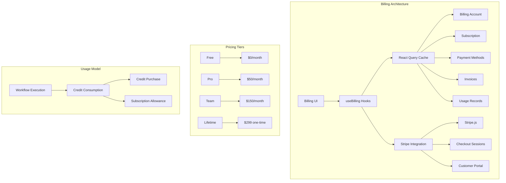
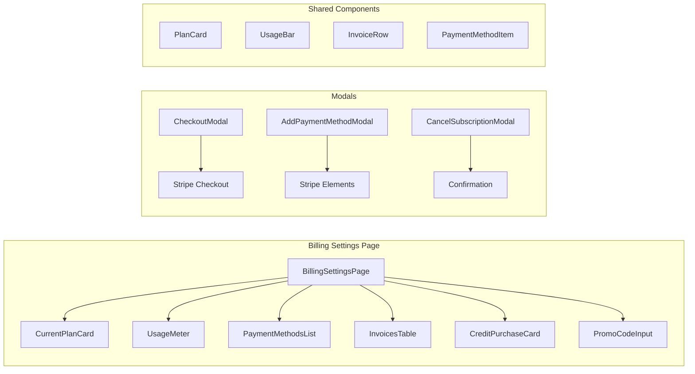
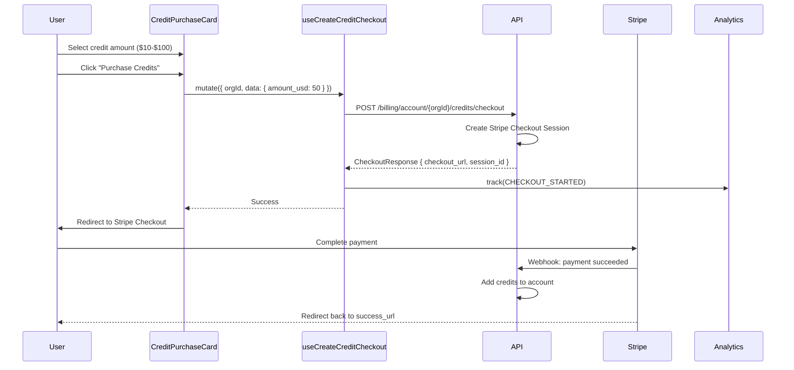
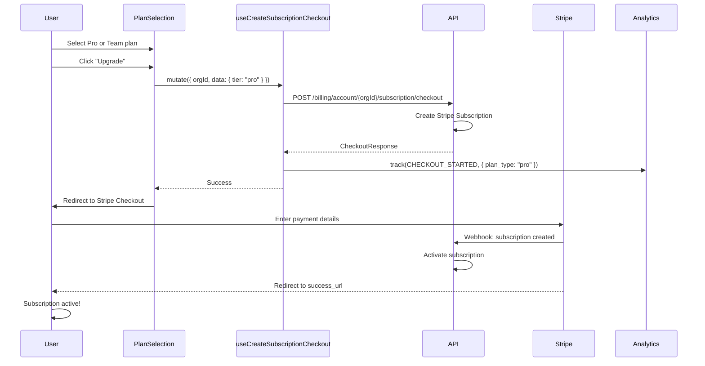
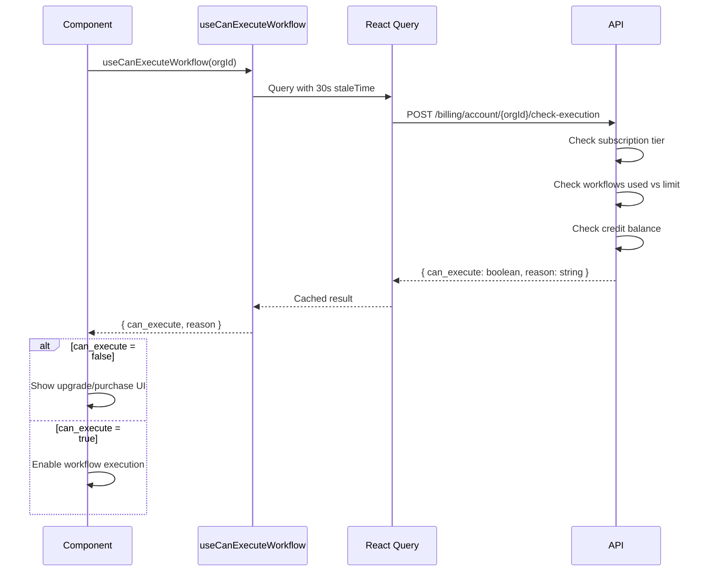
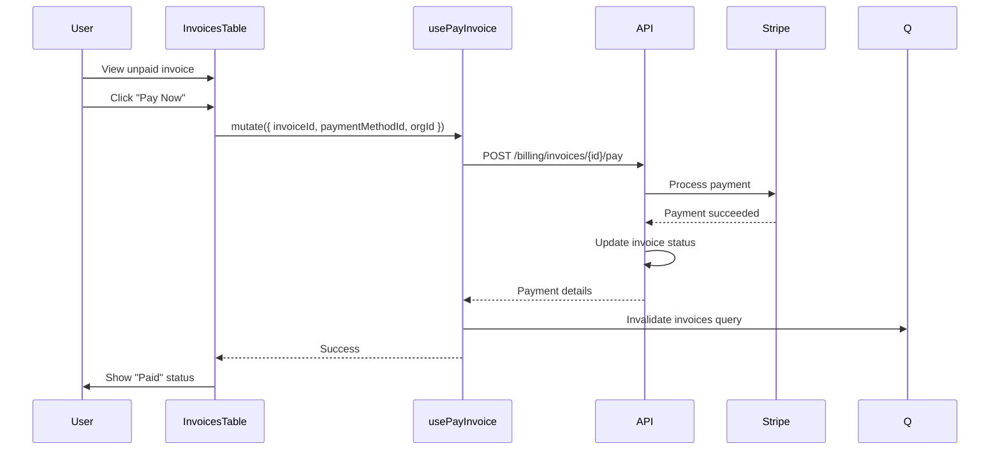

# Frontend Billing & Subscriptions

**Created**: 2025-04-22
**Status**: Active
**Purpose**: Comprehensive documentation of the OmoiOS billing system frontend including Stripe integration UI, subscription tiers, credit purchase flow, invoice management, usage meters, and billing settings.
**Related Docs**: 
- [Backend Billing Architecture](../../architecture/08-billing-and-subscriptions.md)
- [Organizations System](./organizations_multi_tenancy.md)
- [Authentication System](./authentication_system.md)

---

## 1. Architecture Overview

The OmoiOS billing system provides a complete subscription management and payment processing interface built on Stripe. It supports multiple pricing tiers (Free, Pro, Team, Lifetime), credit-based usage, and comprehensive invoice management.



### 1.1 Core Components

| Component | File Path | Responsibility |
|-----------|-----------|----------------|
| useBilling | `frontend/hooks/useBilling.ts` | React Query hooks for all billing operations |
| Billing API | `frontend/lib/api/billing.ts` | API client functions for billing endpoints |
| Stripe Config | `frontend/lib/api/billing.ts` | Stripe publishable key and configuration |
| Checkout Flow | `components/billing/CheckoutModal.tsx` | Stripe Checkout integration |
| Billing Settings | `app/(app)/settings/billing/page.tsx` | Billing management UI |

### 1.2 Pricing Tiers

| Tier | Price | Workflows/Month | Features |
|------|-------|-----------------|----------|
| Free | $0 | 3 | Basic features, community support |
| Pro | $50 | 50 | Priority support, advanced features |
| Team | $150 | 200 | Team collaboration, admin controls |
| Lifetime | $299 one-time | Unlimited | All features, forever |

---

## 2. Component Map

### 2.1 Billing Page Structure



### 2.2 Key Components

| Component | Location | Responsibility |
|-----------|----------|--------------|
| `useBillingAccount` | `hooks/useBilling.ts` | Fetch billing account for organization |
| `useSubscription` | `hooks/useBilling.ts` | Get active subscription details |
| `usePaymentMethods` | `hooks/useBilling.ts` | List and manage payment methods |
| `useInvoices` | `hooks/useBilling.ts` | Invoice history with filtering |
| `useUsage` | `hooks/useBilling.ts` | Usage records and consumption |
| `useCreateCreditCheckout` | `hooks/useBilling.ts` | Credit purchase flow |
| `useCreateSubscriptionCheckout` | `hooks/useBilling.ts` | Plan upgrade/checkout |
| `useCancelSubscription` | `hooks/useBilling.ts` | Subscription cancellation |
| `useValidatePromoCode` | `hooks/useBilling.ts` | Promo code validation |
| `useRedeemPromoCode` | `hooks/useBilling.ts` | Apply promo code benefits |

### 2.3 Billing Data Types

```typescript
// Core billing types from frontend/lib/api/types.ts

interface BillingAccount {
  id: string;
  organization_id: string;
  stripe_customer_id: string;
  stripe_subscription_id: string | null;
  subscription_status: "active" | "canceled" | "past_due" | "unpaid" | "trialing";
  subscription_tier: "free" | "pro" | "team" | "lifetime" | null;
  current_period_start: string | null;
  current_period_end: string | null;
  cancel_at_period_end: boolean;
  credit_balance: number;
  default_payment_method_id: string | null;
  billing_email: string | null;
  created_at: string;
  updated_at: string;
}

interface Subscription {
  id: string;
  tier: "free" | "pro" | "team" | "lifetime";
  status: string;
  current_period_start: string;
  current_period_end: string;
  cancel_at_period_end: boolean;
  trial_end: string | null;
}

interface PaymentMethod {
  id: string;
  type: "card" | "bank_transfer";
  card_brand?: string;
  card_last4?: string;
  card_exp_month?: number;
  card_exp_year?: number;
  is_default: boolean;
  created_at: string;
}

interface Invoice {
  id: string;
  organization_id: string;
  amount_due: number;
  amount_paid: number;
  currency: string;
  status: "draft" | "open" | "paid" | "uncollectible" | "void";
  description: string | null;
  due_date: string | null;
  paid_at: string | null;
  stripe_invoice_id: string | null;
  created_at: string;
}

interface UsageRecord {
  id: string;
  organization_id: string;
  quantity: number;
  unit: string;
  description: string | null;
  billed: boolean;
  created_at: string;
}

interface UsageSummary {
  subscription_tier: string | null;
  workflows_used: number;
  workflows_limit: number;
  free_workflows_remaining: number;
  credit_balance: number;
  can_execute: boolean;
  reason: string;
}
```

---

## 3. State Management

### 3.1 React Query Keys

```typescript
// Query key factory for billing
export const billingKeys = {
  all: ["billing"] as const,
  config: () => [...billingKeys.all, "config"] as const,
  accounts: () => [...billingKeys.all, "accounts"] as const,
  account: (orgId: string) => [...billingKeys.accounts(), orgId] as const,
  subscription: (orgId: string) =>
    [...billingKeys.account(orgId), "subscription"] as const,
  paymentMethods: (orgId: string) =>
    [...billingKeys.account(orgId), "payment-methods"] as const,
  invoices: (orgId: string) =>
    [...billingKeys.account(orgId), "invoices"] as const,
  stripeInvoices: (orgId: string) =>
    [...billingKeys.account(orgId), "stripe-invoices"] as const,
  invoice: (invoiceId: string) =>
    [...billingKeys.all, "invoice", invoiceId] as const,
  usage: (orgId: string) => [...billingKeys.account(orgId), "usage"] as const,
};
```

### 3.2 Query Configuration

```typescript
// Stripe config - rarely changes
export function useStripeConfig() {
  return useQuery<StripeConfig>({
    queryKey: billingKeys.config(),
    queryFn: getStripeConfig,
    staleTime: 1000 * 60 * 60, // 1 hour
  });
}

// Subscription - moderate staleness
export function useSubscription(orgId: string | undefined) {
  return useQuery<Subscription | null>({
    queryKey: billingKeys.subscription(orgId!),
    queryFn: () => getSubscription(orgId!),
    enabled: isValidUUID(orgId),
    staleTime: 5 * 60 * 1000, // 5 minutes
  });
}

// Usage - frequent updates
export function useUsageSummary(orgId: string | undefined) {
  return useQuery<UsageSummary>({
    queryKey: [...billingKeys.usage(orgId!), "summary"],
    queryFn: async () => {
      const { getUsageSummary } = await import("@/lib/api/billing");
      return getUsageSummary(orgId!);
    },
    enabled: isValidUUID(orgId),
    staleTime: 30 * 1000, // 30 seconds
  });
}
```

### 3.3 Mutation Patterns

```typescript
// Attach payment method with cache invalidation
export function useAttachPaymentMethod() {
  const queryClient = useQueryClient();
  
  return useMutation({
    mutationFn: ({ orgId, data }: { orgId: string; data: PaymentMethodRequest }) =>
      attachPaymentMethod(orgId, data),
    onSuccess: (_, { orgId }) => {
      // Invalidate affected queries
      queryClient.invalidateQueries({
        queryKey: billingKeys.paymentMethods(orgId),
      });
      queryClient.invalidateQueries({ queryKey: billingKeys.account(orgId) });
    },
  });
}

// Cancel subscription with analytics
export function useCancelSubscription() {
  const queryClient = useQueryClient();
  
  return useMutation({
    mutationFn: ({ orgId, atPeriodEnd = true }: { orgId: string; atPeriodEnd?: boolean }) =>
      cancelSubscription(orgId, atPeriodEnd),
    onSuccess: (_, { orgId }) => {
      queryClient.invalidateQueries({
        queryKey: billingKeys.subscription(orgId),
      });
      queryClient.invalidateQueries({ queryKey: billingKeys.account(orgId) });
      
      track(ANALYTICS_EVENTS.SUBSCRIPTION_CANCELLED, {
        organization_id: orgId,
        plan_type: "pro",
      });
    },
  });
}
```

---

## 4. API Surface

### 4.1 Billing Endpoints

| Endpoint | Method | Purpose |
|----------|--------|---------|
| `/api/v1/billing/config` | GET | Get Stripe publishable key |
| `/api/v1/billing/account/{orgId}` | GET | Get billing account |
| `/api/v1/billing/account/{orgId}/payment-method` | POST | Attach payment method |
| `/api/v1/billing/account/{orgId}/payment-methods` | GET | List payment methods |
| `/api/v1/billing/account/{orgId}/payment-methods/{id}` | DELETE | Remove payment method |
| `/api/v1/billing/account/{orgId}/credits/checkout` | POST | Create credit checkout |
| `/api/v1/billing/account/{orgId}/portal` | POST | Create customer portal |
| `/api/v1/billing/account/{orgId}/invoices` | GET | List invoices |
| `/api/v1/billing/account/{orgId}/stripe-invoices` | GET | List Stripe invoices |
| `/api/v1/billing/account/{orgId}/usage` | GET | Get usage records |
| `/api/v1/billing/account/{orgId}/usage-summary` | GET | Get usage summary |
| `/api/v1/billing/account/{orgId}/subscription` | GET | Get subscription |
| `/api/v1/billing/account/{orgId}/subscription/checkout` | POST | Create subscription checkout |
| `/api/v1/billing/account/{orgId}/subscription/cancel` | POST | Cancel subscription |
| `/api/v1/billing/account/{orgId}/subscription/reactivate` | POST | Reactivate subscription |
| `/api/v1/billing/account/{orgId}/lifetime/checkout` | POST | Create lifetime checkout |
| `/api/v1/billing/account/{orgId}/check-execution` | POST | Check workflow execution permission |
| `/api/v1/billing/invoices/{id}` | GET | Get invoice details |
| `/api/v1/billing/invoices/{id}/pay` | POST | Pay invoice |
| `/api/v1/billing/promo-codes/validate` | POST | Validate promo code |
| `/api/v1/billing/account/{orgId}/promo-codes/redeem` | POST | Redeem promo code |

### 4.2 API Client Functions

```typescript
// From frontend/lib/api/billing.ts

// Configuration
export async function getStripeConfig(): Promise<StripeConfig>;

// Billing Account
export async function getBillingAccount(organizationId: string): Promise<BillingAccount>;

// Payment Methods
export async function attachPaymentMethod(
  organizationId: string,
  request: PaymentMethodRequest
): Promise<PaymentMethod>;
export async function listPaymentMethods(organizationId: string): Promise<PaymentMethod[]>;
export async function removePaymentMethod(
  organizationId: string,
  paymentMethodId: string
): Promise<{ status: string; message: string }>;

// Credit Purchase
export async function createCreditCheckout(
  organizationId: string,
  request: CreditPurchaseRequest
): Promise<CheckoutResponse>;

// Customer Portal
export async function createCustomerPortal(organizationId: string): Promise<PortalResponse>;

// Invoices
export async function listInvoices(
  organizationId: string,
  options?: { status?: string; limit?: number }
): Promise<Invoice[]>;
export async function getInvoice(invoiceId: string): Promise<Invoice>;
export async function payInvoice(
  invoiceId: string,
  paymentMethodId?: string
): Promise<Payment>;
export async function generateInvoice(organizationId: string): Promise<Invoice | null>;
export async function listStripeInvoices(
  organizationId: string,
  options?: { status?: string; limit?: number }
): Promise<StripeInvoice[]>;

// Usage
export async function getUsage(
  organizationId: string,
  options?: { billed?: boolean }
): Promise<UsageRecord[]>;
export async function getUsageSummary(organizationId: string): Promise<UsageSummary>;
export async function checkWorkflowExecution(
  organizationId: string
): Promise<{ can_execute: boolean; reason: string }>;

// Subscription
export async function getSubscription(organizationId: string): Promise<Subscription | null>;
export async function cancelSubscription(
  organizationId: string,
  atPeriodEnd: boolean = true
): Promise<{ status: string; message: string }>;
export async function reactivateSubscription(
  organizationId: string
): Promise<{ status: string; message: string }>;
export async function createLifetimeCheckout(
  organizationId: string,
  request?: LifetimePurchaseRequest
): Promise<CheckoutResponse>;
export async function createSubscriptionCheckout(
  organizationId: string,
  request: SubscriptionCheckoutRequest
): Promise<CheckoutResponse>;

// Promo Codes
export async function validatePromoCode(
  request: PromoCodeValidateRequest
): Promise<PromoCodeValidateResponse>;
export async function redeemPromoCode(
  organizationId: string,
  request: PromoCodeRedeemRequest
): Promise<PromoCodeRedeemResponse>;
```

### 4.3 Request/Response Types

```typescript
interface CreditPurchaseRequest {
  amount_usd: number;  // e.g., 10, 25, 50, 100
  success_url?: string;
  cancel_url?: string;
}

interface SubscriptionCheckoutRequest {
  tier: "pro" | "team";
  success_url?: string;
  cancel_url?: string;
}

interface LifetimePurchaseRequest {
  success_url?: string;
  cancel_url?: string;
}

interface PaymentMethodRequest {
  payment_method_id: string;  // Stripe payment method ID
  set_default?: boolean;
}

interface CheckoutResponse {
  checkout_url: string;  // Redirect to Stripe Checkout
  session_id: string;
}

interface PortalResponse {
  portal_url: string;  // Redirect to Stripe Customer Portal
}

interface PromoCodeValidateRequest {
  code: string;
  organization_id?: string;
}

interface PromoCodeValidateResponse {
  valid: boolean;
  code: string;
  discount_type?: "percentage" | "fixed_amount" | "free_tier";
  discount_value?: number;
  tier_granted?: string;
  description?: string;
  error?: string;
}

interface PromoCodeRedeemRequest {
  code: string;
}

interface PromoCodeRedeemResponse {
  success: boolean;
  code: string;
  discount_type: string;
  tier_granted?: string;
  credit_amount?: number;
  message: string;
}
```

---

## 5. Data Flow

### 5.1 Credit Purchase Flow



### 5.2 Subscription Upgrade Flow



### 5.3 Usage Check Flow



### 5.4 Invoice Payment Flow



---

## 6. Error Handling

### 6.1 Error Types

| Error | Status | Code | Handling |
|-------|--------|------|----------|
| Invalid payment method | 400 | - | Show validation error |
| Insufficient credits | 402 | - | Prompt credit purchase |
| Subscription expired | 403 | - | Show renewal UI |
| Rate limit exceeded | 429 | rate_limited | Retry with backoff |
| Stripe error | 502 | - | Display Stripe error message |
| Promo code invalid | 400 | - | Show error, allow retry |
| Promo code expired | 400 | - | Show expiration message |

### 6.2 Checkout Error Handling

```typescript
export function useCreateCreditCheckout() {
  return useMutation({
    mutationFn: ({ orgId, data }) => createCreditCheckout(orgId, data),
    onSuccess: (response, { orgId, data }) => {
      track(ANALYTICS_EVENTS.CHECKOUT_STARTED, {
        plan_type: "free",
        price_amount: data.amount_usd,
        currency: "USD",
        organization_id: orgId,
      });
    },
    onError: (error, { orgId, data }) => {
      track(ANALYTICS_EVENTS.CHECKOUT_FAILED, {
        plan_type: "free",
        price_amount: data.amount_usd,
        organization_id: orgId,
        error_message: error.message,
      });
      
      // Show user-friendly error
      toast.error(`Payment failed: ${error.message}`);
    },
  });
}
```

### 6.3 Usage Limit Handling

```typescript
function WorkflowExecutionButton({ orgId }: { orgId: string }) {
  const { data: canExecute } = useCanExecuteWorkflow(orgId);
  
  if (!canExecute?.can_execute) {
    return (
      <div>
        <p className="text-destructive">{canExecute?.reason}</p>
        <Button asChild>
          <Link href="/settings/billing">Upgrade Plan</Link>
        </Button>
      </div>
    );
  }
  
  return <Button onClick={executeWorkflow}>Execute Workflow</Button>;
}
```

---

## 7. Configuration

### 7.1 Environment Variables

| Variable | Required | Default | Purpose |
|----------|----------|---------|---------|
| `NEXT_PUBLIC_STRIPE_PUBLISHABLE_KEY` | Yes | - | Stripe.js initialization |
| `NEXT_PUBLIC_API_URL` | Yes | `http://localhost:18000` | Backend API base URL |

### 7.2 Pricing Configuration

```typescript
// Pricing tiers configuration
const PRICING_TIERS = {
  free: {
    name: "Free",
    price: 0,
    priceDescription: "Forever free",
    workflowsPerMonth: 3,
    features: [
      "3 workflows per month",
      "Basic agent execution",
      "Community support",
    ],
  },
  pro: {
    name: "Pro",
    price: 50,
    priceDescription: "$50/month",
    workflowsPerMonth: 50,
    features: [
      "50 workflows per month",
      "Priority agent execution",
      "Advanced monitoring",
      "Email support",
    ],
  },
  team: {
    name: "Team",
    price: 150,
    priceDescription: "$150/month",
    workflowsPerMonth: 200,
    features: [
      "200 workflows per month",
      "Team collaboration",
      "Admin controls",
      "Priority support",
    ],
  },
  lifetime: {
    name: "Lifetime",
    price: 299,
    priceDescription: "$299 one-time",
    workflowsPerMonth: Infinity,
    features: [
      "Unlimited workflows",
      "All Pro features",
      "All future updates",
      "Lifetime support",
    ],
  },
};

// Credit purchase options
const CREDIT_OPTIONS = [10, 25, 50, 100];
```

### 7.3 Query Stale Times

```typescript
const STALE_TIMES = {
  stripeConfig: 60 * 60 * 1000,      // 1 hour
  subscription: 5 * 60 * 1000,       // 5 minutes
  billingAccount: 5 * 60 * 1000,     // 5 minutes
  paymentMethods: 5 * 60 * 1000,   // 5 minutes
  invoices: 60 * 1000,               // 1 minute
  usage: 30 * 1000,                  // 30 seconds
  usageSummary: 30 * 1000,           // 30 seconds
};
```

---

## 8. Analytics Integration

### 8.1 Tracked Events

| Event | Trigger | Properties |
|-------|---------|------------|
| `CHECKOUT_STARTED` | Checkout session created | `plan_type`, `price_amount`, `currency`, `organization_id` |
| `CHECKOUT_COMPLETED` | Payment successful | `plan_type`, `price_amount`, `organization_id` |
| `CHECKOUT_FAILED` | Payment failed | `plan_type`, `price_amount`, `organization_id`, `error_message` |
| `SUBSCRIPTION_CANCELLED` | User cancels | `organization_id`, `plan_type`, `at_period_end` |
| `SUBSCRIPTION_REACTIVATED` | User reactivates | `organization_id`, `plan_type` |
| `BILLING_PORTAL_OPENED` | Portal accessed | `page_path` |
| `PROMO_CODE_REDEEMED` | Code applied | `organization_id`, `discount_type`, `tier_granted` |
| `PROMO_CODE_FAILED` | Code invalid | `organization_id`, `code`, `error_message` |
| `CREDITS_PURCHASED` | Credits bought | `organization_id`, `amount_usd`, `credits_added` |

### 8.2 Analytics Implementation

```typescript
// From frontend/lib/analytics.ts

export const ANALYTICS_EVENTS = {
  CHECKOUT_STARTED: "checkout_started",
  CHECKOUT_COMPLETED: "checkout_completed",
  CHECKOUT_FAILED: "checkout_failed",
  SUBSCRIPTION_CANCELLED: "subscription_cancelled",
  SUBSCRIPTION_REACTIVATED: "subscription_reactivated",
  BILLING_PORTAL_OPENED: "billing_portal_opened",
  PROMO_CODE_REDEEMED: "promo_code_redeemed",
  PROMO_CODE_FAILED: "promo_code_failed",
  CREDITS_PURCHASED: "credits_purchased",
} as const;

// Usage in hooks
import { track, ANALYTICS_EVENTS } from "@/lib/analytics";

track(ANALYTICS_EVENTS.CHECKOUT_STARTED, {
  plan_type: "pro",
  price_amount: 50,
  currency: "USD",
  organization_id: orgId,
});
```

---

## 9. Integration Points

### 9.1 Organization Context

All billing operations are scoped to an organization:

```typescript
// Current organization from URL or context
const { currentOrganization } = useOrganization();
const orgId = currentOrganization?.id;

// All billing hooks require orgId
const { data: billingAccount } = useBillingAccount(orgId);
const { data: subscription } = useSubscription(orgId);
const { data: usage } = useUsageSummary(orgId);
```

### 9.2 Workflow Execution Integration

```typescript
// Check before executing workflow
async function executeWorkflow(orgId: string, workflowData: WorkflowData) {
  // Check execution permission
  const { can_execute, reason } = await checkWorkflowExecution(orgId);
  
  if (!can_execute) {
    throw new Error(`Cannot execute: ${reason}`);
  }
  
  // Proceed with execution
  return await createWorkflow(orgId, workflowData);
}
```

### 9.3 Real-time Updates

```typescript
// WebSocket event handling for billing updates
useEffect(() => {
  const unsubscribe = subscribeToBillingEvents((event) => {
    if (event.event_type === "subscription_updated") {
      queryClient.invalidateQueries({
        queryKey: billingKeys.subscription(orgId),
      });
    }
    
    if (event.event_type === "invoice_paid") {
      queryClient.invalidateQueries({
        queryKey: billingKeys.invoices(orgId),
      });
    }
    
    if (event.event_type === "credits_added") {
      queryClient.invalidateQueries({
        queryKey: billingKeys.account(orgId),
      });
    }
  });
  
  return () => unsubscribe();
}, [orgId, queryClient]);
```

---

## 10. Testing Strategy

### 10.1 Unit Tests

```typescript
describe("useBilling", () => {
  it("fetches billing account for organization", async () => {
    const { result, waitFor } = renderHook(() => useBillingAccount("org-123"));
    
    await waitFor(() => {
      expect(result.current.data).toBeDefined();
    });
    
    expect(result.current.data?.organization_id).toBe("org-123");
  });
  
  it("validates UUID before making API calls", () => {
    const { result } = renderHook(() => useBillingAccount("invalid-uuid"));
    expect(result.current.isLoading).toBe(false);
    expect(result.current.fetchStatus).toBe("idle");
  });
});
```

### 10.2 Integration Tests

```typescript
describe("Credit Purchase Flow", () => {
  it("completes full credit purchase", async () => {
    // Mock Stripe Checkout
    const mockCheckout = jest.spyOn(window.location, "assign");
    
    const { result } = renderHook(() => useCreateCreditCheckout());
    
    await act(async () => {
      await result.current.mutateAsync({
        orgId: "org-123",
        data: { amount_usd: 50 },
      });
    });
    
    expect(mockCheckout).toHaveBeenCalledWith(
      expect.stringContaining("stripe.com")
    );
  });
});
```

### 10.3 E2E Tests

- Complete subscription upgrade flow
- Credit purchase and balance update
- Payment method addition and removal
- Invoice viewing and payment
- Subscription cancellation and reactivation
- Promo code application

---

## 11. Security Considerations

### 11.1 Payment Security

- **Stripe.js**: All payment data handled by Stripe, never touches our servers
- **PCI Compliance**: Stripe Checkout redirects ensure PCI compliance
- **Webhook Verification**: Backend verifies Stripe webhook signatures
- **Idempotency**: All payment operations use idempotency keys

### 11.2 Access Control

```typescript
// UUID validation prevents enumeration attacks
const UUID_REGEX = /^[0-9a-f]{8}-[0-9a-f]{4}-[0-9a-f]{4}-[0-9a-f]{4}-[0-9a-f]{12}$/i;

function isValidUUID(id: string | undefined): id is string {
  return !!id && UUID_REGEX.test(id);
}

// Hooks only execute when orgId is valid UUID
export function useBillingAccount(orgId: string | undefined) {
  return useQuery<BillingAccount>({
    queryKey: billingKeys.account(orgId!),
    queryFn: () => getBillingAccount(orgId!),
    enabled: isValidUUID(orgId), // Prevents API calls with invalid IDs
  });
}
```

---

## 12. Future Enhancements

### 12.1 Planned Features

1. **Usage Alerts**: Email/Slack notifications at 80% of limit
2. **Budget Controls**: Monthly spending caps
3. **Team Billing**: Split billing across team members
4. **Annual Discounts**: 20% discount for annual prepay
5. **Custom Enterprise Plans**: Sales-led pricing
6. **Usage Forecasting**: Predict future usage and costs

### 12.2 Technical Improvements

1. **Real-time Usage**: WebSocket updates for live usage meters
2. **Billing API**: Public API for billing data export
3. **Multi-currency**: Support for EUR, GBP, etc.
4. **Tax Integration**: Automatic tax calculation (TaxJar)
5. **Invoice PDFs**: Generate and email PDF invoices

---

## 13. Troubleshooting

### 13.1 Common Issues

| Issue | Cause | Solution |
|-------|-------|----------|
| Checkout fails to load | Stripe key missing | Check NEXT_PUBLIC_STRIPE_PUBLISHABLE_KEY |
| Usage not updating | Cache stale | Wait 30s or manual refresh |
| Subscription not showing | Webhook delay | Check Stripe dashboard webhooks |
| Payment method fails | 3D Secure required | Use test card with 3DS |
| Promo code not working | Expired/used | Verify code validity |

### 13.2 Debug Mode

```typescript
// Enable billing debug logging
localStorage.setItem("omoios_billing_debug", "true");

// Check billing state
console.log("Billing State:", {
  account: useBillingAccount.getState(),
  subscription: useSubscription.getState(),
  usage: useUsageSummary.getState(),
});
```
