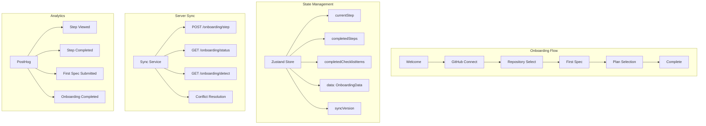
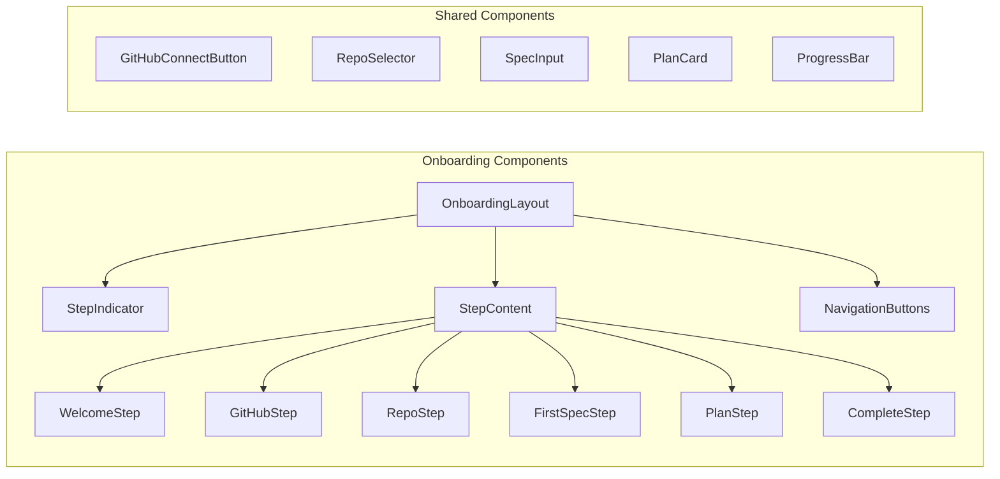
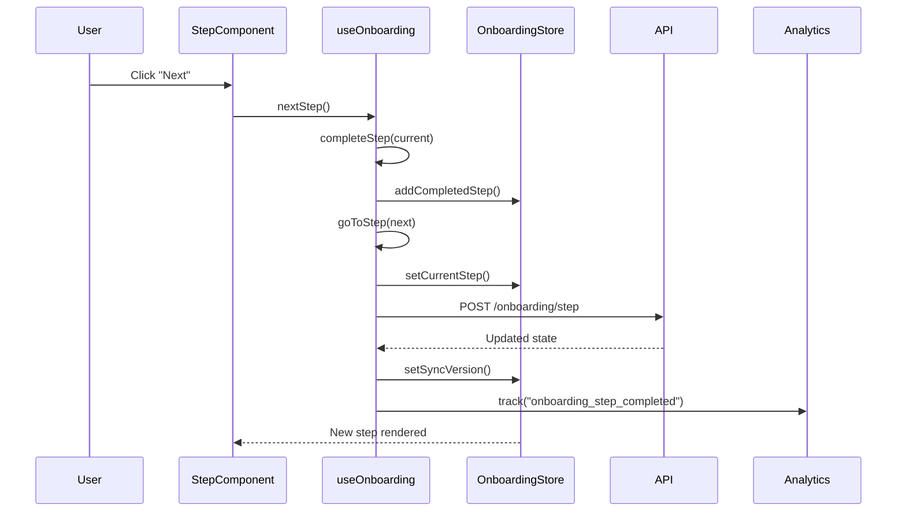
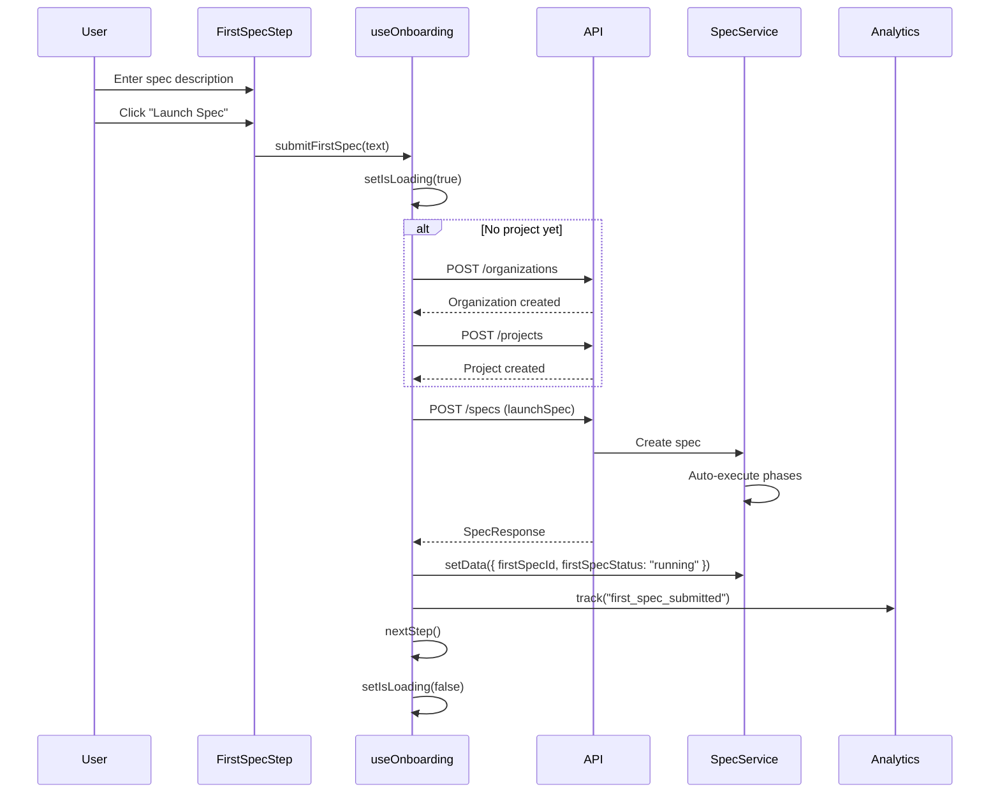
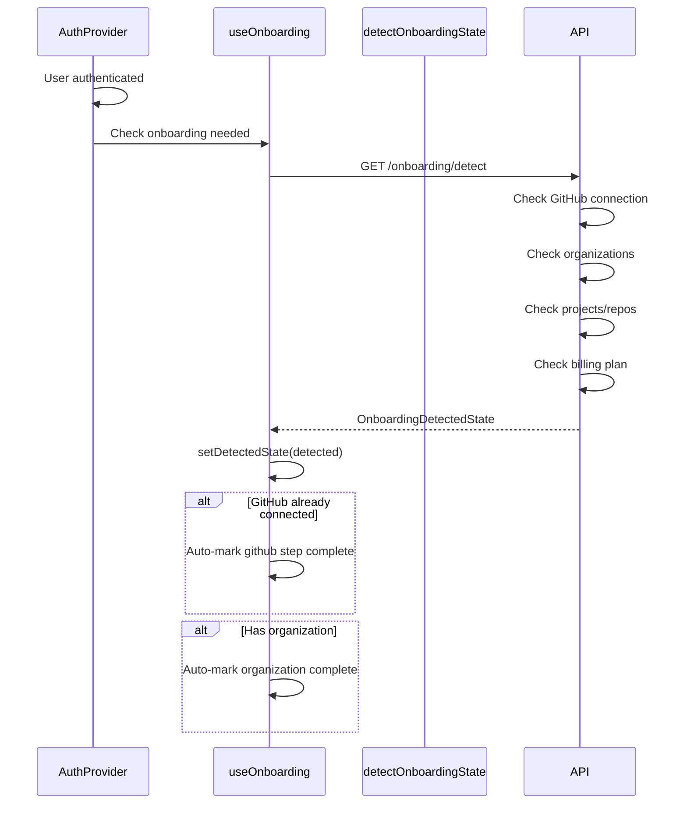

# Frontend Onboarding Flow

**Created**: 2025-04-22
**Status**: Active
**Purpose**: Comprehensive documentation of the OmoiOS user onboarding wizard, step progression, preference collection, first project setup, and guided tour system.
**Related Docs**: 
- [Authentication System](./authentication_system.md)
- [Organizations System](./organizations_multi_tenancy.md)
- [Spec-Driven Workflow](../../architecture/01-planning-system.md)

---

## 1. Architecture Overview

The OmoiOS onboarding system provides a guided, multi-step wizard that helps new users connect their GitHub account, select a repository, create their first spec, and launch their first autonomous agent execution. The system is designed to maximize activation and demonstrate core product value within minutes.



### 1.1 Onboarding Steps

| Step | ID | Purpose | Key Actions |
|------|-----|---------|-------------|
| Welcome | `welcome` | Product introduction | View value props, start onboarding |
| GitHub | `github` | Connect GitHub account | OAuth flow, verify connection |
| Repository | `repo` | Select first repository | List repos, select project source |
| First Spec | `first-spec` | Create initial spec | Write description, launch spec |
| Plan | `plan` | Select billing plan | View tiers, choose plan |
| Complete | `complete` | Finish onboarding | Review progress, enter app |

### 1.2 Extended Checklist Items

Beyond the core steps, the onboarding tracks additional activation milestones:

| Item | ID | Trigger | Purpose |
|------|-----|---------|---------|
| Watch Agent | `watch-agent` | First spec completes | View agent execution |
| Review PR | `review-pr` | PR created | Review agent output |
| Invite Team | `invite-team` | Manual action | Team collaboration |

---

## 2. Component Map

### 2.1 Onboarding Wizard Structure



### 2.2 Key Components

| Component | Location | Responsibility |
|-----------|----------|--------------|
| `useOnboarding` | `frontend/hooks/useOnboarding.ts` | Main hook providing onboarding state and actions |
| `OnboardingProvider` | Implicit in hook | Zustand store provider |
| `WelcomeStep` | `components/onboarding/WelcomeStep.tsx` | Introduction and value proposition |
| `GitHubStep` | `components/onboarding/GitHubStep.tsx` | GitHub OAuth connection |
| `RepoStep` | `components/onboarding/RepoStep.tsx` | Repository selection |
| `FirstSpecStep` | `components/onboarding/FirstSpecStep.tsx` | Spec creation and launch |
| `PlanStep` | `components/onboarding/PlanStep.tsx` | Billing plan selection |
| `CompleteStep` | `components/onboarding/CompleteStep.tsx` | Completion summary |

### 2.3 Onboarding Data Structure

```typescript
interface OnboardingData {
  role?: string;                          // User's role/department
  githubConnected: boolean;             // GitHub OAuth status
  githubUsername?: string;              // Connected GitHub username
  selectedRepo?: {                       // Selected repository
    owner: string;
    name: string;
    fullName: string;
    language?: string;
  };
  projectId?: string;                   // Created project ID
  organizationId?: string;              // Created organization ID
  firstSpecId?: string;                 // First spec ID
  firstSpecText?: string;               // First spec content
  firstSpecStatus?: "pending" | "running" | "completed" | "failed";
  selectedPlan?: string;                  // Selected billing plan
}
```

---

## 3. State Management

### 3.1 Zustand Store Architecture

```typescript
// Onboarding state structure
interface OnboardingState {
  // Current progress
  currentStep: OnboardingStep;
  completedSteps: OnboardingStep[];
  completedChecklistItems: ChecklistItemId[];
  isOnboardingComplete: boolean;
  syncVersion: number;
  
  // Data
  data: OnboardingData;
  detectedState: OnboardingDetectedState | null;
  
  // UI state
  isLoading: boolean;
  error: string | null;
  
  // Actions
  setCurrentStep: (step: OnboardingStep) => void;
  addCompletedStep: (step: OnboardingStep) => void;
  addCompletedChecklistItem: (item: ChecklistItemId) => void;
  setData: (data: Partial<OnboardingData>) => void;
  syncFromServer: (serverState: ServerState) => void;
  reset: () => void;
}

// Step order for navigation
const STEPS_ORDER: OnboardingStep[] = [
  "welcome",
  "github",
  "repo",
  "first-spec",
  "plan",
  "complete",
];
```

### 3.2 Persistence Strategy

```typescript
export const useOnboardingStore = create<OnboardingState>()(
  persist(
    (set, get) => ({ /* implementation */ }),
    {
      name: "omoios_onboarding_state",
      storage: createSafeStorage(), // Custom storage with error handling
      partialize: (state) => ({
        currentStep: state.currentStep,
        completedSteps: state.completedSteps,
        completedChecklistItems: state.completedChecklistItems,
        isOnboardingComplete: state.isOnboardingComplete,
        syncVersion: state.syncVersion,
        data: state.data,
      }),
    }
  )
);
```

### 3.3 Server Synchronization

The onboarding state is synchronized with the server to:
1. Enable cross-device continuity
2. Support admin override/reset
3. Provide analytics on onboarding funnel
4. Enable server-side step detection

```typescript
// Sync from server (server is source of truth)
async function syncWithServer() {
  const serverState = await fetchOnboardingStatus();
  
  if (serverState.sync_version > localSyncVersion) {
    // Server has newer state, update local
    syncFromServer(serverState);
  }
  
  // Update cookie for middleware
  setOnboardingCookie(serverState.is_completed);
}
```

---

## 4. API Surface

### 4.1 Onboarding Endpoints

| Endpoint | Method | Purpose |
|----------|--------|---------|
| `/api/v1/onboarding/status` | GET | Get current onboarding state |
| `/api/v1/onboarding/detect` | GET | Auto-detect completed steps |
| `/api/v1/onboarding/step` | POST | Update current step |
| `/api/v1/onboarding/complete` | POST | Mark onboarding complete |
| `/api/v1/onboarding/reset` | POST | Reset onboarding (admin) |
| `/api/v1/onboarding/sync` | POST | Full state sync to server |

### 4.2 TypeScript Types

```typescript
// Server response types
interface OnboardingServerStatus {
  is_completed: boolean;
  current_step: string;
  completed_steps: string[];
  completed_checklist_items: string[];
  completed_at: string | null;
  data: Record<string, unknown>;
  sync_version: number;
}

interface OnboardingDetectedState {
  github: DetectedStepState;
  organization: DetectedStepState;
  repo: DetectedStepState;
  plan: DetectedStepState;
  suggested_step: string;
}

interface DetectedStepState {
  completed: boolean;
  current: Record<string, unknown> | null;
  can_change: boolean;
}

// Local state types
interface OnboardingLocalState {
  currentStep: string;
  completedSteps: string[];
  completedChecklistItems: string[];
  completedAt: string | null;
  isOnboardingComplete: boolean;
  data: OnboardingData;
  syncVersion: number;
  lastSyncedAt?: string;
}
```

### 4.3 Sync Library Functions

```typescript
// From frontend/lib/onboarding/sync.ts

export async function fetchOnboardingStatus(): Promise<OnboardingServerStatus>;
export async function detectOnboardingState(): Promise<OnboardingDetectedState>;
export async function updateOnboardingStep(
  step: string,
  data: Record<string, unknown>
): Promise<OnboardingServerStatus>;
export async function completeOnboardingServer(
  data: Record<string, unknown>
): Promise<OnboardingServerStatus>;
export async function detectAndHealInconsistencies(): Promise<SyncResult>;
export async function initialSync(): Promise<SyncResult>;
export async function checkOnboardingNeeded(): Promise<boolean>;
```

---

## 5. Data Flow

### 5.1 Step Navigation Flow



### 5.2 First Spec Submission Flow



### 5.3 Auto-Detection Flow



### 5.4 Spec Completion Polling

```typescript
// Polling for first spec completion
useEffect(() => {
  if (!data.firstSpecId || data.firstSpecStatus === "completed") return;
  
  const checkSpecStatus = async () => {
    const response = await api.get(`/api/v1/specs/${data.firstSpecId}`);
    const status = response.status?.toLowerCase();
    const phase = response.current_phase?.toLowerCase();
    
    if (status === "completed" || phase === "complete" || phase === "sync") {
      setData({ firstSpecStatus: "completed" });
      addCompletedChecklistItem("watch-agent");
      setIsOnboardingComplete(true);
      track("onboarding_fully_completed", { firstSpecId: data.firstSpecId });
    } else if (status === "failed" || status === "error") {
      setData({ firstSpecStatus: "failed" });
    }
  };
  
  const interval = setInterval(checkSpecStatus, 10000); // Every 10s
  checkSpecStatus(); // Immediate check
  
  return () => clearInterval(interval);
}, [data.firstSpecId, data.firstSpecStatus]);
```

---

## 6. Error Handling

### 6.1 Error Types

| Error | Cause | Handling |
|-------|-------|----------|
| Sync failed | Network error | Continue with local state, retry later |
| GitHub connect failed | OAuth error | Show error, allow retry |
| Spec creation failed | Validation error | Show field errors, allow retry |
| Project creation failed | API error | Show error, manual retry |
| Server state conflict | Version mismatch | Server wins, local updated |

### 6.2 Conflict Resolution

```typescript
// Server is always source of truth
export async function detectAndHealInconsistencies(): Promise<SyncResult> {
  const localState = getLocalOnboardingState();
  const serverState = await fetchOnboardingStatus();
  
  // Case 1: Server says complete, local says incomplete
  if (serverState.is_completed && !localState?.isOnboardingComplete) {
    syncLocalFromServer(serverState);
    return { status: "healed", action: "local_updated_from_server" };
  }
  
  // Case 2: Local says complete, server says incomplete
  if (!serverState.is_completed && localState?.isOnboardingComplete) {
    syncLocalFromServer(serverState);
    return { status: "healed", action: "local_reset_from_server" };
  }
  
  // Case 3: Steps mismatch
  if (serverState.current_step !== localState?.currentStep) {
    syncLocalFromServer(serverState);
    return { status: "healed", action: "step_synced" };
  }
  
  // Case 4: Version mismatch - server wins
  if (localState && serverState.sync_version > localState.syncVersion) {
    syncLocalFromServer(serverState);
    return { status: "healed", action: "version_synced" };
  }
  
  return { status: "synced" };
}
```

### 6.3 Error UI States

```typescript
// In useOnboarding hook
const [error, setError] = useState<string | null>(null);

// Error display in component
{error && (
  <Alert variant="destructive">
    <AlertCircle className="h-4 w-4" />
    <AlertTitle>Error</AlertTitle>
    <AlertDescription>{error}</AlertDescription>
    <Button onClick={() => setError(null)} variant="outline" size="sm">
      Dismiss
    </Button>
  </Alert>
)}
```

---

## 7. Configuration

### 7.1 Step Configuration

```typescript
// Step order and metadata
const STEPS_ORDER: OnboardingStep[] = [
  "welcome",
  "github",
  "repo",
  "first-spec",
  "plan",
  "complete",
];

// Step metadata for UI
const STEP_METADATA: Record<OnboardingStep, {
  title: string;
  description: string;
  canSkip: boolean;
}> = {
  welcome: {
    title: "Welcome to OmoiOS",
    description: "Let's get you set up in just a few steps",
    canSkip: false,
  },
  github: {
    title: "Connect GitHub",
    description: "Link your GitHub account to get started",
    canSkip: false,
  },
  repo: {
    title: "Select Repository",
    description: "Choose a repository to work with",
    canSkip: false,
  },
  "first-spec": {
    title: "Create Your First Spec",
    description: "Describe what you want to build",
    canSkip: false,
  },
  plan: {
    title: "Choose Your Plan",
    description: "Select the plan that fits your needs",
    canSkip: true,
  },
  complete: {
    title: "You're All Set!",
    description: "Your first spec is running",
    canSkip: false,
  },
};
```

### 7.2 Storage Configuration

```typescript
// localStorage key
const STORAGE_KEY = "omoios_onboarding_state";

// Cookie for middleware
const ONBOARDING_COOKIE_NAME = "omoios_onboarding_completed";

// Cookie expiry (1 year)
const ONBOARDING_COOKIE_MAX_AGE = 31536000;
```

### 7.3 Polling Configuration

```typescript
// Spec status polling interval
const SPEC_POLLING_INTERVAL = 10000; // 10 seconds

// Maximum polling duration (5 minutes)
const MAX_POLLING_DURATION = 5 * 60 * 1000;
```

---

## 8. Analytics Integration

### 8.1 Tracked Events

| Event | Trigger | Properties |
|-------|---------|------------|
| `onboarding_step_viewed` | Step navigation | `{ step }` |
| `onboarding_step_completed` | Step completion | `{ step }` |
| `first_spec_submitted` | Spec creation | `{ specLength, projectId }` |
| `onboarding_fully_completed` | Spec completes | `{ firstSpecId, completedItems }` |
| `checklist_item_completed` | Checklist action | `{ itemId }` |
| `github_connected` | OAuth success | `{ username }` |
| `repo_selected` | Repo selection | `{ owner, name, language }` |

### 8.2 Analytics Implementation

```typescript
// In useOnboarding hook
const goToStep = useCallback(async (step: OnboardingStep) => {
  setCurrentStep(step);
  trackEvent("onboarding_step_viewed", { step });
  
  // Sync to server
  try {
    const response = await updateOnboardingStep(step, { ...data });
    setSyncVersion(response.sync_version);
  } catch {
    // Continue anyway if sync fails
  }
}, [data, setCurrentStep, setSyncVersion]);

const completeStep = useCallback((step: OnboardingStep) => {
  addCompletedStep(step);
  addCompletedChecklistItem(step as ChecklistItemId);
  trackEvent("onboarding_step_completed", { step });
}, [addCompletedStep, addCompletedChecklistItem]);
```

---

## 9. Integration Points

### 9.1 Auth Integration

```typescript
// In AuthProvider.tsx
useEffect(() => {
  if (!isAuthenticated || isLoading) return;
  
  const checkOnboarding = async () => {
    const syncResult = await syncOnboarding();
    
    if (syncResult.status === "synced" || syncResult.status === "healed") {
      const needsOnboarding = await checkOnboardingNeeded();
      
      // Skip onboarding routes and exempt routes
      const isOnboardingRoute = pathname?.startsWith("/onboarding");
      const isCallbackRoute = pathname?.startsWith("/callback");
      const isSettingsRoute = pathname?.startsWith("/settings");
      
      if (needsOnboarding && !isOnboardingRoute && !isCallbackRoute && !isSettingsRoute) {
        router.replace("/onboarding");
      }
    }
  };
  
  checkOnboarding();
}, [isAuthenticated, isLoading, pathname, router]);
```

### 9.2 GitHub Integration

```typescript
// GitHub connection with authenticated flow
const connectGitHub = useCallback(async () => {
  try {
    // Use authenticated connect flow to ensure GitHub is linked to CURRENT user
    const response = await api.post<{ auth_url: string; state: string }>(
      "/api/v1/auth/oauth/github/connect"
    );
    window.location.href = response.auth_url;
  } catch (err) {
    // Fallback to direct OAuth
    const apiUrl = process.env.NEXT_PUBLIC_API_URL || "http://localhost:18000";
    const returnUrl = `${window.location.origin}/onboarding?step=repo`;
    window.location.href = `${apiUrl}/api/v1/auth/oauth/github?onboarding=true&return_url=${encodeURIComponent(returnUrl)}`;
  }
}, []);
```

### 9.3 Spec System Integration

```typescript
// First spec uses spec-driven workflow
const submitFirstSpec = useCallback(async (specText: string) => {
  setIsLoading(true);
  
  try {
    // Ensure project exists
    let projectId = data.projectId;
    if (!projectId && data.selectedRepo) {
      // Create organization if needed
      // Create project
    }
    
    // Launch spec through spec-driven workflow
    const specResponse = await launchSpec({
      title: specText.slice(0, 100),
      description: specText,
      project_id: projectId,
      auto_execute: true, // Start immediately
    });
    
    setData({
      firstSpecId: specResponse.spec_id,
      firstSpecText: specText,
      firstSpecStatus: "running",
    });
    
    track("first_spec_submitted", {
      specLength: specText.length,
      projectId,
    });
    
    nextStep();
  } catch (err) {
    setError(err instanceof Error ? err.message : "Failed to submit spec");
  } finally {
    setIsLoading(false);
  }
}, [data, user, setData, setIsLoading, setError, nextStep]);
```

---

## 10. Testing Strategy

### 10.1 Unit Tests

```typescript
describe("useOnboarding", () => {
  it("initializes with welcome step", () => {
    const { result } = renderHook(() => useOnboarding());
    expect(result.current.currentStep).toBe("welcome");
  });
  
  it("advances to next step", async () => {
    const { result } = renderHook(() => useOnboarding());
    
    act(() => {
      result.current.nextStep();
    });
    
    expect(result.current.currentStep).toBe("github");
    expect(result.current.completedSteps).toContain("welcome");
  });
  
  it("syncs with server on mount", async () => {
    const mockServerState = {
      current_step: "repo",
      completed_steps: ["welcome", "github"],
      sync_version: 5,
    };
    
    server.use(
      rest.get("/api/v1/onboarding/status", (req, res, ctx) => {
        return res(ctx.json(mockServerState));
      })
    );
    
    const { result, waitFor } = renderHook(() => useOnboarding());
    
    await waitFor(() => {
      expect(result.current.currentStep).toBe("repo");
    });
  });
});
```

### 10.2 E2E Tests

- Complete onboarding flow from welcome to completion
- GitHub OAuth connection and callback handling
- Repository selection and project creation
- First spec submission and execution
- Plan selection and billing setup
- Onboarding state persistence across reloads

---

## 11. Future Enhancements

### 11.1 Planned Features

1. **Interactive Tours**: Guided tooltips for first-time feature usage
2. **Video Walkthroughs**: Embedded video explanations for each step
3. **Template Specs**: Pre-written spec templates for common use cases
4. **Team Onboarding**: Multi-user onboarding flow for organizations
5. **Progressive Profiling**: Collect additional user data over time

### 11.2 Technical Improvements

1. **Optimistic UI**: Immediate step advancement with rollback on error
2. **Offline Support**: Queue onboarding actions for sync when online
3. **A/B Testing**: Test different step orders and content
4. **Funnel Analytics**: Detailed drop-off analysis per step
5. **Smart Defaults**: Auto-suggest repos based on GitHub activity

---

## 12. Troubleshooting

### 12.1 Common Issues

| Issue | Cause | Solution |
|-------|-------|----------|
| Stuck on loading | Server sync failing | Check network, clear localStorage |
| Steps not advancing | State not persisting | Verify localStorage permissions |
| GitHub not connecting | OAuth popup blocked | Enable popups, try again |
| Spec not launching | Missing project | Ensure repo selected first |
| Onboarding keeps redirecting | Cookie mismatch | Clear cookies and localStorage |

### 12.2 Debug Utilities

```typescript
// From frontend/lib/onboarding/debug.ts
export function initOnboardingDebug() {
  if (typeof window === "undefined") return;
  
  (window as any).omoiosOnboarding = {
    getState: () => useOnboardingStore.getState(),
    reset: () => useOnboardingStore.getState().reset(),
    sync: async () => {
      const result = await initialSync();
      console.log("Sync result:", result);
      return result;
    },
    setStep: (step: OnboardingStep) => {
      useOnboardingStore.getState().setCurrentStep(step);
    },
    complete: () => {
      useOnboardingStore.getState().setIsOnboardingComplete(true);
    },
  };
  
  console.log("Onboarding debug utilities available at window.omoiosOnboarding");
}
```
