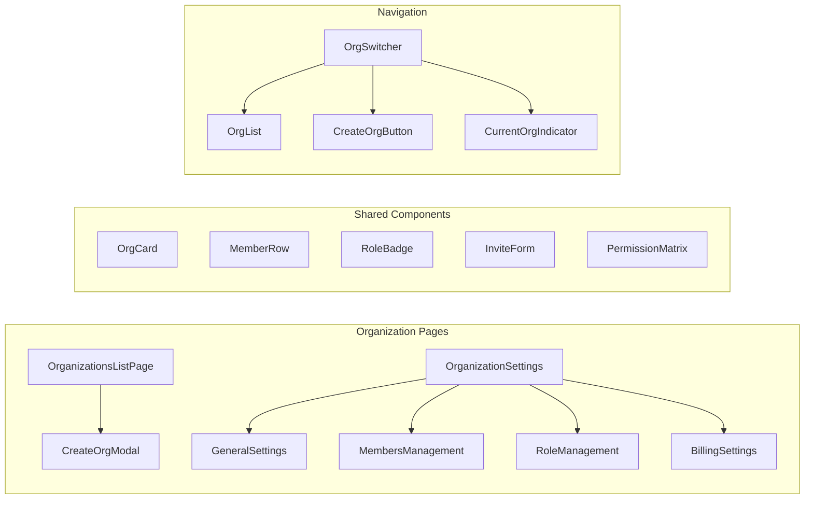
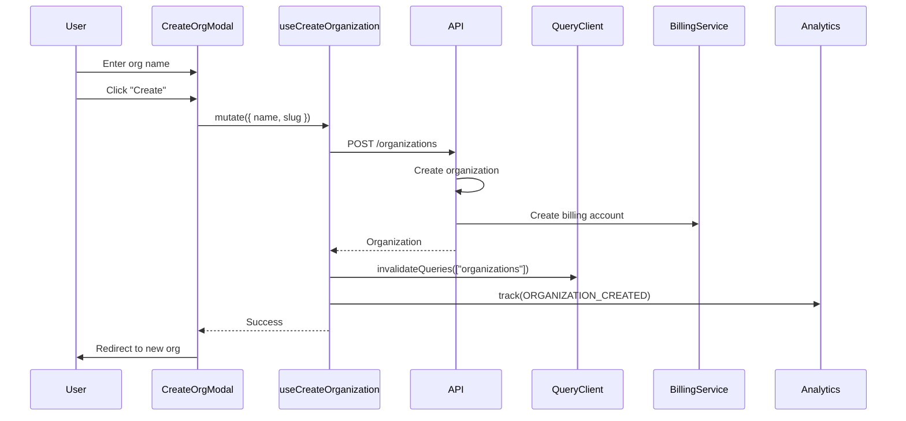
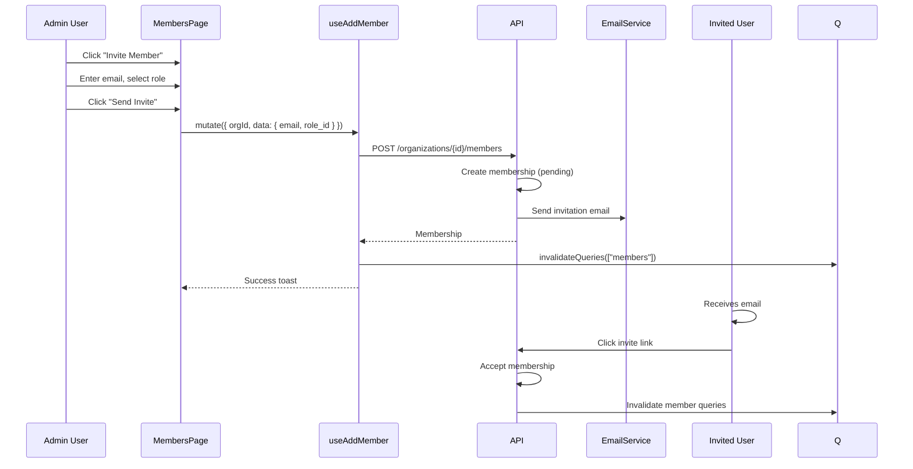
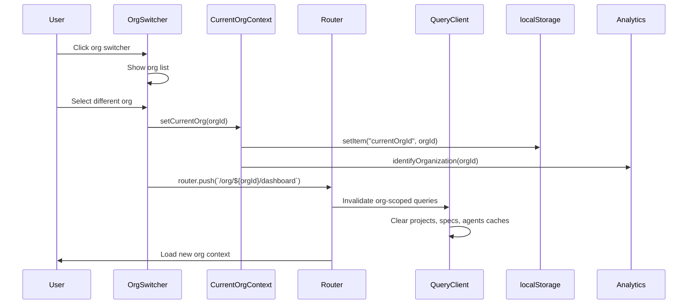
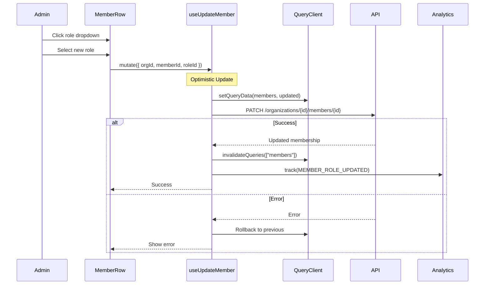

# Frontend Organizations & Multi-tenancy

**Created**: 2025-04-22
**Status**: Active
**Purpose**: Comprehensive documentation of the OmoiOS organization system including org creation, member management, role assignment, team workspaces, organization switching, and resource sharing.
**Related Docs**: 
- [Backend Organizations Architecture](../../architecture/07-auth-and-security.md)
- [Billing System](./billing_subscriptions.md)
- [Authentication System](./authentication_system.md)

---

## 1. Architecture Overview

The OmoiOS organization system provides multi-tenant workspace isolation with role-based access control (RBAC). Each user can belong to multiple organizations, with resources (projects, specs, agents) scoped to an organization. The system supports custom roles, member invitations, and organization-level settings.

```mermaid
graph TB
    subgraph "Organization Architecture"
        A[User] --> B[Membership]
        B --> C[Organization]
        C --> D[Projects]
        C --> E[Specs]
        C --> F[Agents]
        C --> G[Billing Account]
        
        C --> H[Roles]
        H --> I[Owner]
        H --> J[Admin]
        H --> K[Member]
        H --> L[Custom Roles]
    end
    
    subgraph "Multi-tenancy"
        M[Org A] --> N[Isolated Resources]
        O[Org B] --> P[Isolated Resources]
        Q[User X] --> M
        Q --> O
    end
    
    subgraph "Organization Switcher"
        R[Current Org Context] --> S[URL: /org/{id}/*]
        S --> T[LocalStorage: currentOrgId]
        S --> U[React Context: OrganizationProvider]
    end
```

### 1.1 Core Components

| Component | File Path | Responsibility |
|-----------|-----------|----------------|
| useOrganizations | `frontend/hooks/useOrganizations.ts` | React Query hooks for org operations |
| Organizations API | `frontend/lib/api/organizations.ts` | API client for org endpoints |
| OrganizationProvider | `frontend/providers/OrganizationProvider.tsx` | Current org context (if exists) |
| Org Switcher | `components/layout/OrgSwitcher.tsx` | Organization selection UI |
| Member Management | `app/(app)/settings/members/page.tsx` | Member and role management |

### 1.2 Organization Hierarchy

```
Organization
├── Settings
│   ├── General (name, slug, description)
│   ├── Members (invite, roles, remove)
│   ├── Roles (custom roles, permissions)
│   └── Billing (subscription, payment)
├── Projects
│   ├── Specs
│   ├── Tickets
│   └── Agents
└── Resources
    ├── Shared specs
    ├── Team agents
    └── Organization API keys
```

---

## 2. Component Map

### 2.1 Organization Management Structure



### 2.2 Key Components

| Component | Location | Responsibility |
|-----------|----------|--------------|
| `useOrganizations` | `hooks/useOrganizations.ts` | List all user's organizations |
| `useOrganization` | `hooks/useOrganizations.ts` | Get single organization details |
| `useCreateOrganization` | `hooks/useOrganizations.ts` | Create new organization |
| `useUpdateOrganization` | `hooks/useOrganizations.ts` | Update org settings |
| `useDeleteOrganization` | `hooks/useOrganizations.ts` | Archive organization |
| `useMembers` | `hooks/useOrganizations.ts` | List organization members |
| `useAddMember` | `hooks/useOrganizations.ts` | Invite new member |
| `useUpdateMember` | `hooks/useOrganizations.ts` | Change member role |
| `useRemoveMember` | `hooks/useOrganizations.ts` | Remove member from org |
| `useRoles` | `hooks/useOrganizations.ts` | List organization roles |
| `useCreateRole` | `hooks/useOrganizations.ts` | Create custom role |
| `useUpdateRole` | `hooks/useOrganizations.ts` | Update role permissions |
| `useDeleteRole` | `hooks/useOrganizations.ts` | Delete custom role |

### 2.3 Organization Data Types

```typescript
// Core organization types from frontend/lib/api/types.ts

interface Organization {
  id: string;
  name: string;
  slug: string;
  description: string | null;
  billing_email: string | null;
  owner_id: string;
  is_active: boolean;
  max_concurrent_agents: number;
  max_agent_runtime_hours: number;
  created_at: string;
  updated_at: string;
}

interface OrganizationSummary {
  id: string;
  name: string;
  slug: string;
  role: string;  // User's role in this organization
}

interface OrganizationCreate {
  name: string;
  slug: string;
  description?: string;
  billing_email?: string;
}

interface OrganizationUpdate {
  name?: string;
  description?: string;
  billing_email?: string;
  settings?: Record<string, unknown>;
  max_concurrent_agents?: number;
  max_agent_runtime_hours?: number;
}

interface Membership {
  id: string;
  user_id: string | null;
  agent_id: string | null;  // For agent members
  organization_id: string;
  role_id: string;
  role_name: string;
  joined_at: string;
}

interface MembershipCreate {
  user_id?: string;
  agent_id?: string;
  role_id: string;
}

interface Role {
  id: string;
  name: string;
  description: string | null;
  permissions: string[];
  organization_id: string | null;  // null = system role
  is_system: boolean;
  inherits_from: string | null;
  created_at: string;
}

interface RoleCreate {
  name: string;
  description?: string;
  permissions: string[];
  organization_id: string;
  inherits_from?: string;
}
```

---

## 3. State Management

### 3.1 React Query Keys

```typescript
// Query key factory for organizations
export const organizationKeys = {
  all: ["organizations"] as const,
  lists: () => [...organizationKeys.all, "list"] as const,
  details: () => [...organizationKeys.all, "detail"] as const,
  detail: (id: string) => [...organizationKeys.details(), id] as const,
  members: (orgId: string) =>
    [...organizationKeys.detail(orgId), "members"] as const,
  roles: (orgId: string) =>
    [...organizationKeys.detail(orgId), "roles"] as const,
};
```

### 3.2 Query Configuration

```typescript
// List all organizations (user's memberships)
export function useOrganizations() {
  return useQuery<OrganizationSummary[]>({
    queryKey: organizationKeys.lists(),
    queryFn: listOrganizations,
  });
}

// Get single organization
export function useOrganization(orgId: string | undefined) {
  return useQuery<Organization>({
    queryKey: organizationKeys.detail(orgId!),
    queryFn: () => getOrganization(orgId!),
    enabled: isValidUUID(orgId),
  });
}

// List members
export function useMembers(orgId: string | undefined) {
  return useQuery<Membership[]>({
    queryKey: organizationKeys.members(orgId!),
    queryFn: () => listMembers(orgId!),
    enabled: isValidUUID(orgId),
  });
}

// List roles
export function useRoles(orgId: string | undefined, includeSystem = true) {
  return useQuery<Role[]>({
    queryKey: organizationKeys.roles(orgId!),
    queryFn: () => listRoles(orgId!, includeSystem),
    enabled: isValidUUID(orgId),
  });
}
```

### 3.3 Mutation Patterns

```typescript
// Create organization with cache update
export function useCreateOrganization() {
  const queryClient = useQueryClient();
  
  return useMutation({
    mutationFn: (data: OrganizationCreate) => createOrganization(data),
    onSuccess: (newOrg) => {
      // Invalidate list to include new org
      queryClient.invalidateQueries({ queryKey: organizationKeys.lists() });
      
      // Pre-populate detail cache
      queryClient.setQueryData(
        organizationKeys.detail(newOrg.id),
        newOrg
      );
      
      // Track analytics
      track(ANALYTICS_EVENTS.ORGANIZATION_CREATED, {
        org_id: newOrg.id,
        org_name: newOrg.name,
      });
    },
  });
}

// Update member role with optimistic update
export function useUpdateMember() {
  const queryClient = useQueryClient();
  
  return useMutation({
    mutationFn: ({ orgId, memberId, roleId }) =>
      updateMember(orgId, memberId, roleId),
    onMutate: async ({ orgId, memberId, roleId }) => {
      // Cancel outgoing refetches
      await queryClient.cancelQueries({
        queryKey: organizationKeys.members(orgId),
      });
      
      // Snapshot previous value
      const previousMembers = queryClient.getQueryData<Membership[]>(
        organizationKeys.members(orgId)
      );
      
      // Optimistically update
      queryClient.setQueryData<Membership[]>(
        organizationKeys.members(orgId),
        (old) => old?.map((m) =>
          m.id === memberId ? { ...m, role_id: roleId } : m
        )
      );
      
      return { previousMembers };
    },
    onError: (err, { orgId }, context) => {
      // Rollback on error
      queryClient.setQueryData(
        organizationKeys.members(orgId),
        context?.previousMembers
      );
    },
    onSettled: (_, __, { orgId }) => {
      // Always refetch after error or success
      queryClient.invalidateQueries({
        queryKey: organizationKeys.members(orgId),
      });
    },
  });
}
```

---

## 4. API Surface

### 4.1 Organization Endpoints

| Endpoint | Method | Purpose |
|----------|--------|---------|
| `/api/v1/organizations` | GET | List user's organizations |
| `/api/v1/organizations` | POST | Create new organization |
| `/api/v1/organizations/{id}` | GET | Get organization details |
| `/api/v1/organizations/{id}` | PATCH | Update organization |
| `/api/v1/organizations/{id}` | DELETE | Archive organization |
| `/api/v1/organizations/{id}/members` | GET | List members |
| `/api/v1/organizations/{id}/members` | POST | Add member |
| `/api/v1/organizations/{id}/members/{id}` | PATCH | Update member role |
| `/api/v1/organizations/{id}/members/{id}` | DELETE | Remove member |
| `/api/v1/organizations/{id}/roles` | GET | List roles |
| `/api/v1/organizations/{id}/roles` | POST | Create role |
| `/api/v1/organizations/{id}/roles/{id}` | PATCH | Update role |
| `/api/v1/organizations/{id}/roles/{id}` | DELETE | Delete role |

### 4.2 API Client Functions

```typescript
// From frontend/lib/api/organizations.ts

// Organizations
export async function listOrganizations(): Promise<OrganizationSummary[]>;
export async function getOrganization(orgId: string): Promise<Organization>;
export async function createOrganization(data: OrganizationCreate): Promise<Organization>;
export async function updateOrganization(
  orgId: string,
  data: OrganizationUpdate
): Promise<Organization>;
export async function deleteOrganization(orgId: string): Promise<MessageResponse>;

// Members
export async function listMembers(orgId: string): Promise<Membership[]>;
export async function addMember(
  orgId: string,
  data: MembershipCreate
): Promise<Membership>;
export async function updateMember(
  orgId: string,
  memberId: string,
  roleId: string
): Promise<Membership>;
export async function removeMember(
  orgId: string,
  memberId: string
): Promise<MessageResponse>;

// Roles
export async function listRoles(
  orgId: string,
  includeSystem?: boolean
): Promise<Role[]>;
export async function createRole(
  orgId: string,
  data: Omit<RoleCreate, "organization_id">
): Promise<Role>;
export async function updateRole(
  orgId: string,
  roleId: string,
  data: Partial<Omit<RoleCreate, "organization_id">>
): Promise<Role>;
export async function deleteRole(
  orgId: string,
  roleId: string
): Promise<MessageResponse>;
```

### 4.3 Permission System

```typescript
// Standard permissions
const PERMISSIONS = {
  // Project permissions
  PROJECT_CREATE: "project:create",
  PROJECT_READ: "project:read",
  PROJECT_UPDATE: "project:update",
  PROJECT_DELETE: "project:delete",
  
  // Spec permissions
  SPEC_CREATE: "spec:create",
  SPEC_READ: "spec:read",
  SPEC_UPDATE: "spec:update",
  SPEC_DELETE: "spec:delete",
  SPEC_EXECUTE: "spec:execute",
  
  // Agent permissions
  AGENT_CREATE: "agent:create",
  AGENT_READ: "agent:read",
  AGENT_UPDATE: "agent:update",
  AGENT_DELETE: "agent:delete",
  
  // Member permissions
  MEMBER_INVITE: "member:invite",
  MEMBER_READ: "member:read",
  MEMBER_UPDATE: "member:update",
  MEMBER_REMOVE: "member:remove",
  
  // Role permissions
  ROLE_CREATE: "role:create",
  ROLE_READ: "role:read",
  ROLE_UPDATE: "role:update",
  ROLE_DELETE: "role:delete",
  
  // Billing permissions
  BILLING_READ: "billing:read",
  BILLING_UPDATE: "billing:update",
  
  // Organization permissions
  ORG_UPDATE: "org:update",
  ORG_DELETE: "org:delete",
} as const;

// System roles with default permissions
const SYSTEM_ROLES = {
  owner: {
    name: "Owner",
    permissions: Object.values(PERMISSIONS), // All permissions
  },
  admin: {
    name: "Admin",
    permissions: [
      // All except org delete and billing update
      ...Object.values(PERMISSIONS).filter(
        p => p !== PERMISSIONS.ORG_DELETE && p !== PERMISSIONS.BILLING_UPDATE
      ),
    ],
  },
  member: {
    name: "Member",
    permissions: [
      // Read and create, no delete or member management
      PERMISSIONS.PROJECT_CREATE,
      PERMISSIONS.PROJECT_READ,
      PERMISSIONS.SPEC_CREATE,
      PERMISSIONS.SPEC_READ,
      PERMISSIONS.SPEC_EXECUTE,
      PERMISSIONS.AGENT_READ,
      PERMISSIONS.MEMBER_READ,
    ],
  },
};
```

---

## 5. Data Flow

### 5.1 Organization Creation Flow



### 5.2 Member Invitation Flow



### 5.3 Organization Switching Flow



### 5.4 Role Update Flow



---

## 6. Error Handling

### 6.1 Error Types

| Error | Status | Code | Handling |
|-------|--------|------|----------|
| Org name taken | 409 | - | Suggest alternative name |
| Invalid slug | 400 | - | Show slug format requirements |
| Member already exists | 409 | - | Show existing member info |
| Cannot remove owner | 403 | - | Explain ownership transfer required |
| Cannot delete system role | 403 | - | Disable delete for system roles |
| Insufficient permissions | 403 | - | Show permission required |
| Org not found | 404 | - | Redirect to org list |

### 6.2 Permission Error Handling

```typescript
function PermissionGuard({
  permission,
  children,
  fallback,
}: {
  permission: string;
  children: React.ReactNode;
  fallback?: React.ReactNode;
}) {
  const { currentRole } = useCurrentOrganization();
  const hasPermission = currentRole?.permissions?.includes(permission);
  
  if (!hasPermission) {
    return fallback || (
      <Alert>
        <AlertDescription>
          You don't have permission to {permission}. Contact your organization admin.
        </AlertDescription>
      </Alert>
    );
  }
  
  return children;
}

// Usage
<PermissionGuard permission={PERMISSIONS.MEMBER_INVITE}>
  <InviteMemberButton />
</PermissionGuard>
```

### 6.3 Organization Not Found

```typescript
function OrganizationLayout({ orgId, children }) {
  const { data: organization, isError, error } = useOrganization(orgId);
  
  if (isError) {
    if (error?.status === 404) {
      return (
        <NotFoundPage
          title="Organization not found"
          description="The organization you're looking for doesn't exist or you don't have access."
          action={{ label: "Go to Organizations", href: "/organizations" }}
        />
      );
    }
    
    return <ErrorPage error={error} />;
  }
  
  return children;
}
```

---

## 7. Configuration

### 7.1 Organization Limits

```typescript
// Default limits per organization tier
const ORGANIZATION_LIMITS = {
  free: {
    maxMembers: 3,
    maxProjects: 5,
    maxCustomRoles: 0,
    maxConcurrentAgents: 2,
    maxAgentRuntimeHours: 1,
  },
  pro: {
    maxMembers: 10,
    maxProjects: 25,
    maxCustomRoles: 5,
    maxConcurrentAgents: 10,
    maxAgentRuntimeHours: 4,
  },
  team: {
    maxMembers: 50,
    maxProjects: 100,
    maxCustomRoles: 20,
    maxConcurrentAgents: 50,
    maxAgentRuntimeHours: 8,
  },
  lifetime: {
    maxMembers: 100,
    maxProjects: Infinity,
    maxCustomRoles: 50,
    maxConcurrentAgents: 100,
    maxAgentRuntimeHours: 24,
  },
};
```

### 7.2 Slug Validation

```typescript
// Slug format requirements
const SLUG_REGEX = /^[a-z0-9-]+$/;
const SLUG_MIN_LENGTH = 3;
const SLUG_MAX_LENGTH = 50;

function validateSlug(slug: string): { valid: boolean; error?: string } {
  if (slug.length < SLUG_MIN_LENGTH) {
    return { valid: false, error: `Slug must be at least ${SLUG_MIN_LENGTH} characters` };
  }
  
  if (slug.length > SLUG_MAX_LENGTH) {
    return { valid: false, error: `Slug must be at most ${SLUG_MAX_LENGTH} characters` };
  }
  
  if (!SLUG_REGEX.test(slug)) {
    return { valid: false, error: "Slug can only contain lowercase letters, numbers, and hyphens" };
  }
  
  return { valid: true };
}
```

### 7.3 Query Stale Times

```typescript
const STALE_TIMES = {
  organizations: 5 * 60 * 1000,    // 5 minutes
  organization: 5 * 60 * 1000,     // 5 minutes
  members: 30 * 1000,              // 30 seconds
  roles: 5 * 60 * 1000,            // 5 minutes
};
```

---

## 8. Analytics Integration

### 8.1 Tracked Events

| Event | Trigger | Properties |
|-------|---------|------------|
| `ORGANIZATION_CREATED` | New org created | `org_id`, `org_name`, `tier` |
| `ORGANIZATION_UPDATED` | Settings changed | `org_id`, `changed_fields` |
| `ORGANIZATION_DELETED` | Org archived | `org_id`, `member_count` |
| `MEMBER_INVITED` | Invite sent | `org_id`, `role`, `invited_by` |
| `MEMBER_JOINED` | Invite accepted | `org_id`, `user_id`, `role` |
| `MEMBER_REMOVED` | Member removed | `org_id`, `removed_by`, `role` |
| `MEMBER_ROLE_UPDATED` | Role changed | `org_id`, `user_id`, `old_role`, `new_role` |
| `ROLE_CREATED` | Custom role created | `org_id`, `role_name`, `permission_count` |
| `ROLE_UPDATED` | Role permissions changed | `org_id`, `role_id`, `changed_permissions` |
| `ROLE_DELETED` | Custom role deleted | `org_id`, `role_id` |
| `ORGANIZATION_SWITCHED` | User switched org | `from_org_id`, `to_org_id` |

### 8.2 Analytics Implementation

```typescript
// Organization creation tracking
export function useCreateOrganization() {
  const queryClient = useQueryClient();
  
  return useMutation({
    mutationFn: createOrganization,
    onSuccess: (org) => {
      queryClient.invalidateQueries({ queryKey: organizationKeys.lists() });
      
      track(ANALYTICS_EVENTS.ORGANIZATION_CREATED, {
        org_id: org.id,
        org_name: org.name,
        tier: "free", // Default tier
      });
      
      identifyOrganization(org.id); // PostHog group analytics
    },
  });
}

// Member invitation tracking
export function useAddMember() {
  const queryClient = useQueryClient();
  
  return useMutation({
    mutationFn: addMember,
    onSuccess: (membership, { orgId, data }) => {
      queryClient.invalidateQueries({
        queryKey: organizationKeys.members(orgId),
      });
      
      track(ANALYTICS_EVENTS.MEMBER_INVITED, {
        org_id: orgId,
        role: data.role_id,
        invited_by: currentUser.id,
      });
    },
  });
}
```

---

## 9. Integration Points

### 9.1 Billing Integration

```typescript
// Organization and billing are tightly coupled
interface OrganizationWithBilling extends Organization {
  billing_account: BillingAccount;
  subscription: Subscription;
}

// Fetch org with billing info
export function useOrganizationWithBilling(orgId: string) {
  const { data: org } = useOrganization(orgId);
  const { data: billing } = useBillingAccount(orgId);
  const { data: subscription } = useSubscription(orgId);
  
  return {
    data: org && billing && subscription
      ? { ...org, billing_account: billing, subscription }
      : undefined,
    isLoading: !org || !billing || !subscription,
  };
}
```

### 9.2 Project Scoping

```typescript
// All projects are scoped to an organization
export function useProjects(orgId: string | undefined) {
  return useQuery<Project[]>({
    queryKey: ["projects", orgId],
    queryFn: () => listProjects(orgId!),
    enabled: isValidUUID(orgId),
  });
}

// Creating a project requires org context
export function useCreateProject() {
  const queryClient = useQueryClient();
  const { currentOrganization } = useCurrentOrganization();
  
  return useMutation({
    mutationFn: (data: ProjectCreate) =>
      createProject({ ...data, organization_id: currentOrganization!.id }),
    onSuccess: () => {
      queryClient.invalidateQueries({
        queryKey: ["projects", currentOrganization?.id],
      });
    },
  });
}
```

### 9.3 URL Structure

```typescript
// Organization-scoped routes
const ORG_ROUTES = {
  dashboard: (orgId: string) => `/org/${orgId}`,
  projects: (orgId: string) => `/org/${orgId}/projects`,
  project: (orgId: string, projectId: string) => `/org/${orgId}/projects/${projectId}`,
  specs: (orgId: string) => `/org/${orgId}/specs`,
  settings: (orgId: string) => `/org/${orgId}/settings`,
  members: (orgId: string) => `/org/${orgId}/settings/members`,
  billing: (orgId: string) => `/org/${orgId}/settings/billing`,
};
```

---

## 10. Testing Strategy

### 10.1 Unit Tests

```typescript
describe("useOrganizations", () => {
  it("fetches user's organizations", async () => {
    const mockOrgs: OrganizationSummary[] = [
      { id: "org-1", name: "Org One", slug: "org-one", role: "owner" },
      { id: "org-2", name: "Org Two", slug: "org-two", role: "member" },
    ];
    
    server.use(
      rest.get("/api/v1/organizations", (req, res, ctx) => {
        return res(ctx.json(mockOrgs));
      })
    );
    
    const { result, waitFor } = renderHook(() => useOrganizations());
    
    await waitFor(() => {
      expect(result.current.data).toHaveLength(2);
    });
  });
});

describe("useUpdateMember", () => {
  it("optimistically updates member role", async () => {
    const { result } = renderHook(() => useUpdateMember());
    
    // Pre-populate cache
    queryClient.setQueryData(
      organizationKeys.members("org-1"),
      [{ id: "member-1", role_id: "role-member", role_name: "Member" }]
    );
    
    act(() => {
      result.current.mutate({
        orgId: "org-1",
        memberId: "member-1",
        roleId: "role-admin",
      });
    });
    
    // Check optimistic update
    const cached = queryClient.getQueryData<Membership[]>(
      organizationKeys.members("org-1")
    );
    expect(cached?.[0].role_id).toBe("role-admin");
  });
});
```

### 10.2 E2E Tests

- Create organization with valid/invalid data
- Invite member and accept invitation
- Change member roles and verify permissions
- Create custom role with specific permissions
- Switch between organizations
- Archive organization and verify cleanup

---

## 11. Security Considerations

### 11.1 Access Control

```typescript
// Permission checking hook
export function useHasPermission(permission: string): boolean {
  const { currentOrganization } = useCurrentOrganization();
  const { data: members } = useMembers(currentOrganization?.id);
  
  const currentMembership = members?.find(
    (m) => m.user_id === currentUser?.id
  );
  
  const { data: roles } = useRoles(currentOrganization?.id);
  const currentRole = roles?.find(
    (r) => r.id === currentMembership?.role_id
  );
  
  return currentRole?.permissions?.includes(permission) ?? false;
}

// Usage in components
function DeleteProjectButton({ projectId }: { projectId: string }) {
  const canDelete = useHasPermission(PERMISSIONS.PROJECT_DELETE);
  
  if (!canDelete) return null;
  
  return <Button variant="destructive">Delete Project</Button>;
}
```

### 11.2 Data Isolation

```typescript
// All API calls include organization context
export async function listProjects(orgId: string): Promise<Project[]> {
  return apiRequest<Project[]>(`/api/v1/organizations/${orgId}/projects`);
}

// Backend enforces organization isolation
// Users can only access resources in their organizations
```

---

## 12. Future Enhancements

### 12.1 Planned Features

1. **Organization Templates**: Pre-configured org setups for different use cases
2. **Resource Sharing**: Share specs/projects across organizations
3. **Organization Discovery**: Public organization directory
4. **Audit Logs**: Track all organization activity
5. **SSO Integration**: SAML/OIDC for enterprise orgs
6. **Organization API Keys**: Programmatic access scoped to org

### 12.2 Technical Improvements

1. **Organization Switcher**: Command palette style quick switch
2. **Bulk Operations**: Bulk member invite/role update
3. **Organization Analytics**: Usage and activity dashboards
4. **Custom Branding**: White-label organization pages
5. **Organization Policies**: Enforce settings across org

---

## 13. Troubleshooting

### 13.1 Common Issues

| Issue | Cause | Solution |
|-------|-------|----------|
| Can't create org | Slug taken | Try different slug |
| Member not receiving invite | Email spam | Check spam folder, resend |
| Can't switch org | Invalid org ID | Clear localStorage, re-login |
| Role changes not applying | Cache stale | Wait or manual refresh |
| Permission denied | Role insufficient | Contact org admin |

### 13.2 Debug Utilities

```typescript
// Debug organization state
function debugOrganizationState() {
  console.log("Current Organization:", {
    org: useCurrentOrganization.getState(),
    members: useMembers.getState(),
    roles: useRoles.getState(),
  });
}

// Expose for debugging
if (process.env.NODE_ENV === "development") {
  (window as any).debugOrg = debugOrganizationState;
}
```
