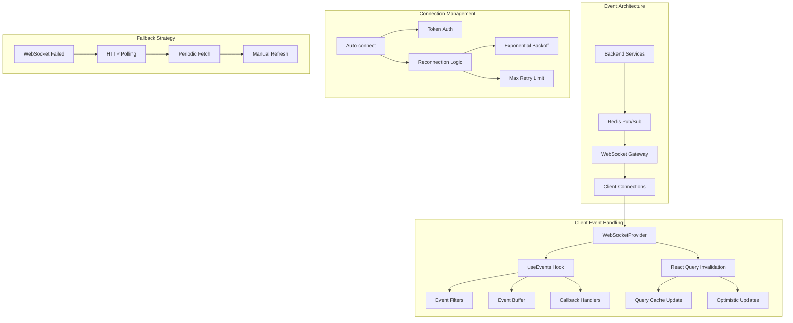
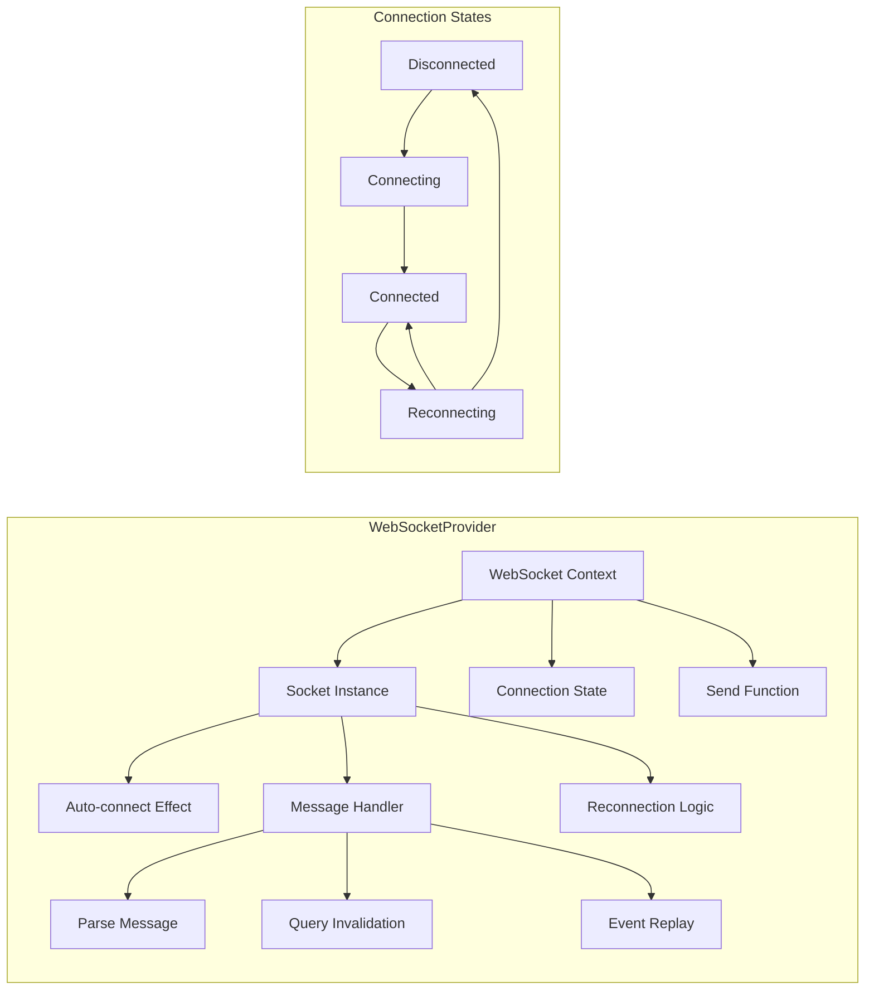
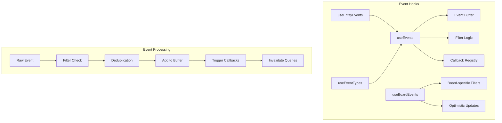
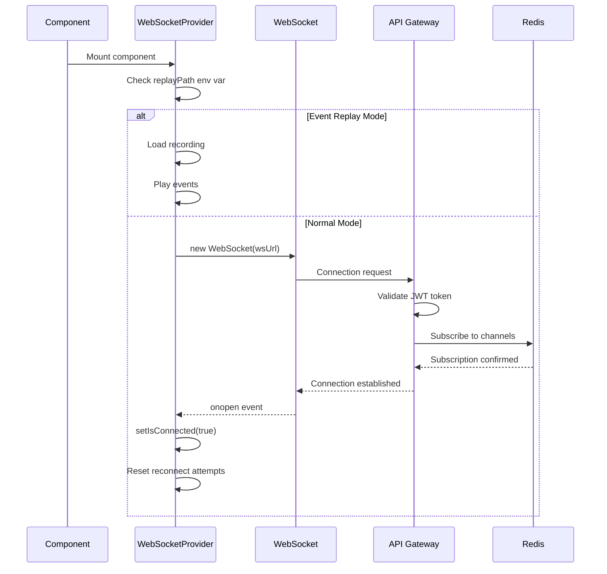
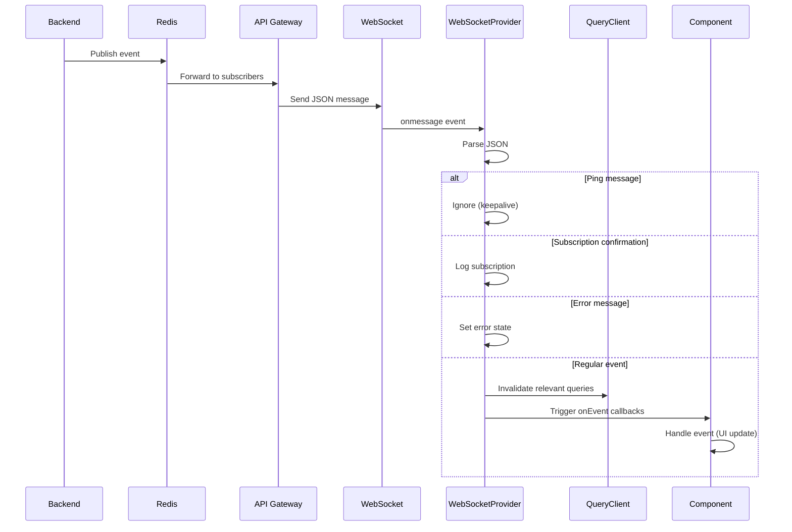
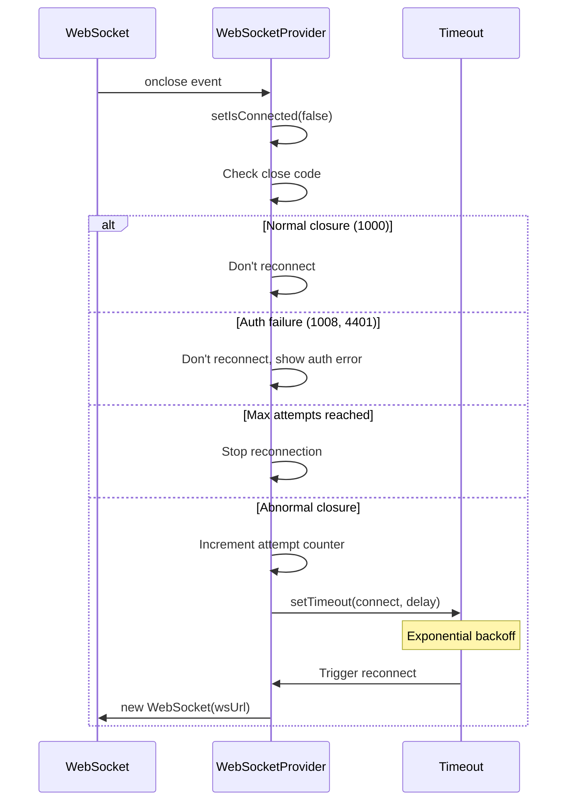

# Frontend Real-time Events Architecture

**Created**: 2025-04-22
**Status**: Active
**Purpose**: Comprehensive documentation of the OmoiOS real-time event system including WebSocket architecture, React Query invalidation, event deduplication, connection management, and fallback polling.
**Related Docs**: 
- [Backend Real-time Architecture](../../architecture/06-realtime-events.md)
- [WebSocket Provider](../providers/WebSocketProvider.tsx)
- [React Query Integration](./react_query_websocket.md)

---

## 1. Architecture Overview

The OmoiOS real-time event system provides live updates across the application using WebSocket connections with Redis pub/sub as the backend message broker. The system handles event filtering, deduplication, automatic reconnection, and graceful degradation to polling when WebSockets are unavailable.



### 1.1 Core Components

| Component | File Path | Responsibility |
|-----------|-----------|----------------|
| WebSocketProvider | `frontend/providers/WebSocketProvider.tsx` | Global WebSocket connection management |
| useEvents | `frontend/hooks/useEvents.ts` | Event subscription hook with filtering |
| useEntityEvents | `frontend/hooks/useEvents.ts` | Entity-specific event subscription |
| useEventTypes | `frontend/hooks/useEvents.ts` | Event type filtering |
| useBoardEvents | `frontend/hooks/useBoardEvents.ts` | Board-specific event handling |
| API Client | `frontend/lib/api/client.ts` | Token management for WebSocket auth |

### 1.2 Event Types

| Event Category | Event Types | Purpose |
|----------------|-------------|---------|
| Ticket Events | `ticket_created`, `ticket_updated`, `ticket_deleted` | Kanban board updates |
| Agent Events | `agent_created`, `agent_updated`, `agent_deleted` | Agent monitoring |
| Spec Events | `spec_created`, `spec_phase_changed`, `spec_completed` | Spec workflow progress |
| Task Events | `task_created`, `task_started`, `task_completed` | Task execution updates |
| System Events | `system_health`, `anomaly_detected` | System monitoring |
| User Events | `user_joined`, `user_left` | Collaboration |

---

## 2. Component Map

### 2.1 WebSocket Provider Architecture



### 2.2 Event Hooks Structure



### 2.3 Key Components

| Component | Location | Responsibility |
|-----------|----------|----------------|
| `WebSocketProvider` | `providers/WebSocketProvider.tsx` | Global WebSocket connection, auto-reconnect, message routing |
| `useWebSocket` | `providers/WebSocketProvider.tsx` | Access WebSocket context |
| `useEvents` | `hooks/useEvents.ts` | Generic event subscription with filtering |
| `useEntityEvents` | `hooks/useEvents.ts` | Subscribe to events for specific entity |
| `useEventTypes` | `hooks/useEvents.ts` | Subscribe to specific event types |
| `useBoardEvents` | `hooks/useBoardEvents.ts` | Board-specific event handling with optimistic updates |

### 2.4 Event Data Types

```typescript
// Core event types from frontend/hooks/useEvents.ts

interface SystemEvent {
  event_type: string;
  entity_type: string;
  entity_id: string;
  payload: Record<string, unknown>;
  timestamp?: string;
}

interface EventFilters {
  event_types?: string[];    // Filter by event type
  entity_types?: string[];   // Filter by entity type (ticket, agent, spec)
  entity_ids?: string[];       // Filter by specific entity IDs
}

interface UseEventsOptions {
  filters?: EventFilters;
  onEvent?: (event: SystemEvent) => void;
  enabled?: boolean;
  maxEvents?: number;         // Maximum events to keep in buffer (default: 100)
}

interface UseEventsReturn {
  events: SystemEvent[];      // Event buffer
  isConnected: boolean;
  isConnecting: boolean;
  error: string | null;
  connect: () => void;
  disconnect: () => void;
  clearEvents: () => void;
  updateFilters: (filters: EventFilters) => void;
}

// WebSocket context types
interface WebSocketContextValue {
  socket: WebSocket | null;
  isConnected: boolean;
  send: (type: string, payload: any) => void;
}
```

---

## 3. State Management

### 3.1 WebSocket Connection State

```typescript
// Connection state managed in WebSocketProvider
interface WebSocketState {
  socket: WebSocket | null;
  isConnected: boolean;
  reconnectAttempts: number;
  lastMessageAt: number | null;
}

// Reconnection configuration
const RECONNECT_CONFIG = {
  maxAttempts: 5,
  baseDelay: 3000,        // 3 seconds
  maxDelay: 30000,        // 30 seconds
  backoffMultiplier: 1.5,
};
```

### 3.2 Event Buffer Management

```typescript
// Event buffer with size limit and deduplication
function useEventBuffer(maxEvents: number = 100) {
  const [events, setEvents] = useState<SystemEvent[]>([]);
  const seenEventIds = useRef<Set<string>>(new Set());
  
  const addEvent = useCallback((event: SystemEvent) => {
    // Deduplication using composite key
    const eventKey = `${event.event_type}:${event.entity_id}:${event.timestamp}`;
    
    if (seenEventIds.current.has(eventKey)) {
      return; // Skip duplicate
    }
    
    seenEventIds.current.add(eventKey);
    
    setEvents((prev) => {
      const next = [event, ...prev];
      // Trim to max size
      if (next.length > maxEvents) {
        const trimmed = next.slice(0, maxEvents);
        // Clean up old event IDs
        const activeKeys = new Set(
          trimmed.map((e) => `${e.event_type}:${e.entity_id}:${e.timestamp}`)
        );
        seenEventIds.current = activeKeys;
        return trimmed;
      }
      return next;
    });
  }, [maxEvents]);
  
  const clearEvents = useCallback(() => {
    setEvents([]);
    seenEventIds.current.clear();
  }, []);
  
  return { events, addEvent, clearEvents };
}
```

### 3.3 React Query Integration

```typescript
// WebSocketProvider query invalidation
useEffect(() => {
  if (!socket) return;
  
  const handleMessage = (event: MessageEvent) => {
    try {
      const data = JSON.parse(event.data);
      
      // Handle ping messages
      if (data.type === "ping") return;
      
      // Handle subscription confirmations
      if (data.status === "subscribed") return;
      
      // Invalidate React Query cache on relevant events
      if (data.type?.startsWith("ticket")) {
        queryClient.invalidateQueries({ queryKey: ["tickets"] });
      }
      
      if (data.type?.startsWith("agent")) {
        queryClient.invalidateQueries({ queryKey: ["agents"] });
      }
      
      if (data.type?.startsWith("spec")) {
        queryClient.invalidateQueries({ queryKey: ["specs"] });
      }
      
      if (data.type?.startsWith("task")) {
        queryClient.invalidateQueries({ queryKey: ["tasks"] });
      }
    } catch (error) {
      console.error("Failed to parse WebSocket message:", error);
    }
  };
  
  socket.addEventListener("message", handleMessage);
  return () => socket.removeEventListener("message", handleMessage);
}, [socket, queryClient]);
```

---

## 4. API Surface

### 4.1 WebSocket Endpoints

| Endpoint | Protocol | Purpose |
|----------|----------|---------|
| `/api/v1/ws/events` | WebSocket | Main event stream |

### 4.2 Connection Parameters

```typescript
// WebSocket URL construction
function buildWsUrl(filters?: EventFilters): string {
  const apiUrl = process.env.NEXT_PUBLIC_API_URL || "http://localhost:18000";
  
  // Convert HTTP to WS protocol
  const wsProtocol = apiUrl.startsWith("https:") ? "wss:" : "ws:";
  const wsHost = new URL(apiUrl).host;
  const wsUrl = `${wsProtocol}//${wsHost}/api/v1/ws/events`;
  
  // Add query parameters
  const params = new URLSearchParams();
  
  const token = getAccessToken();
  if (token) {
    params.set("token", token);
  }
  
  if (filters?.event_types?.length) {
    params.set("event_types", filters.event_types.join(","));
  }
  
  if (filters?.entity_types?.length) {
    params.set("entity_types", filters.entity_types.join(","));
  }
  
  if (filters?.entity_ids?.length) {
    params.set("entity_ids", filters.entity_ids.join(","));
  }
  
  const query = params.toString();
  return query ? `${wsUrl}?${query}` : wsUrl;
}
```

### 4.3 Message Protocol

```typescript
// Client -> Server messages
interface SubscribeMessage {
  type: "subscribe";
  event_types?: string[];
  entity_types?: string[];
  entity_ids?: string[];
}

interface UnsubscribeMessage {
  type: "unsubscribe";
  event_types?: string[];
}

// Server -> Client messages
interface ServerEvent {
  event_type: string;
  entity_type: string;
  entity_id: string;
  payload: Record<string, unknown>;
  timestamp: string;
}

interface PingMessage {
  type: "ping";
  timestamp: string;
}

interface SubscriptionConfirmation {
  status: "subscribed";
  filters: EventFilters;
}

interface ErrorMessage {
  error: string;
  code?: string;
}
```

### 4.4 Hook API

```typescript
// From frontend/hooks/useEvents.ts

/**
 * Subscribe to real-time WebSocket events with filtering
 */
export function useEvents(options?: UseEventsOptions): UseEventsReturn;

/**
 * Subscribe to events for a specific entity
 */
export function useEntityEvents(
  entityType: string,
  entityId: string | undefined,
  options?: Omit<UseEventsOptions, "filters">
): UseEventsReturn;

/**
 * Subscribe to specific event types
 */
export function useEventTypes(
  eventTypes: string[],
  options?: Omit<UseEventsOptions, "filters">
): UseEventsReturn;
```

---

## 5. Data Flow

### 5.1 Connection Establishment Flow



### 5.2 Event Processing Flow



### 5.3 Reconnection Flow



### 5.4 Filter Update Flow

```typescript
// Dynamic filter updates without reconnecting
const updateFilters = useCallback((newFilters: EventFilters) => {
  if (!wsRef.current || wsRef.current.readyState !== WebSocket.OPEN) {
    return;
  }
  
  try {
    wsRef.current.send(
      JSON.stringify({
        type: "subscribe",
        ...newFilters,
      })
    );
    
    // Update local filter ref
    filtersRef.current = newFilters;
  } catch (err) {
    console.error("[WebSocket] Failed to update filters:", err);
  }
}, []);
```

---

## 6. Error Handling

### 6.1 Error Types

| Error | Cause | Handling |
|-------|-------|----------|
| Connection refused | Server down | Exponential backoff retry |
| Authentication failed | Invalid token | Stop reconnection, redirect to login |
| Parse error | Invalid JSON | Log error, continue processing |
| Filter invalid | Bad filter syntax | Log error, ignore filter update |
| Rate limited | Too many connections | Backoff and retry |
| Network error | Client offline | Queue events, retry when online |

### 6.2 Connection Error Handling

```typescript
// WebSocket error handling
ws.onerror = () => {
  // WebSocket error events don't contain useful info in browsers
  // The error is usually followed by onclose with more details
  console.error("[WebSocket] Error occurred - url:", url);
  isConnectingRef.current = false;
  setError("WebSocket connection error");
  setIsConnecting(false);
};

ws.onclose = (event) => {
  console.log(
    "[WebSocket] Connection closed - code:",
    event.code,
    "reason:",
    event.reason
  );
  
  isConnectingRef.current = false;
  setIsConnected(false);
  setIsConnecting(false);
  wsRef.current = null;
  
  // Only auto-reconnect on abnormal closures
  const shouldReconnect =
    event.code !== 1000 &&    // Normal closure
    event.code !== 1001 &&    // Going away
    event.code !== 4401 &&    // Auth failure
    reconnectAttempts < MAX_RECONNECT_ATTEMPTS;
  
  if (shouldReconnect) {
    reconnectAttempts++;
    const delay = Math.min(
      RECONNECT_DELAY * Math.pow(1.5, reconnectAttempts),
      MAX_RECONNECT_DELAY
    );
    
    console.log(
      `[WebSocket] Reconnecting in ${delay}ms... (attempt ${reconnectAttempts}/${MAX_RECONNECT_ATTEMPTS})`
    );
    
    reconnectTimeoutRef.current = setTimeout(connect, delay);
  }
};
```

### 6.3 Event Replay Error Handling

```typescript
// Event replay for development/testing
useEffect(() => {
  if (!replayPath) return;
  
  let cancelled = false;
  
  import("@/lib/dev/event-replay").then(async ({ EventReplayProvider, loadRecording }) => {
    if (cancelled) return;
    
    try {
      const recording = await loadRecording(replayPath);
      const replay = new EventReplayProvider(recording);
      
      replay.subscribe("*", (event) => {
        // Forward to query client
        if (event.event_type.startsWith("ticket")) {
          queryClient.invalidateQueries({ queryKey: ["tickets"] });
        }
        if (event.event_type.startsWith("agent")) {
          queryClient.invalidateQueries({ queryKey: ["agents"] });
        }
      });
      
      setIsConnected(true); // Simulate connection
      replay.play(1.0);
      console.log("[EventReplay] Playing recording:", replayPath);
    } catch (err) {
      console.error("[EventReplay] Failed to load recording:", err);
    }
  });
  
  return () => {
    cancelled = true;
  };
}, [replayPath, queryClient]);
```

---

## 7. Configuration

### 7.1 Environment Variables

| Variable | Required | Default | Purpose |
|----------|----------|---------|---------|
| `NEXT_PUBLIC_API_URL` | Yes | `http://localhost:18000` | API base URL (used for WS URL) |
| `NEXT_PUBLIC_WS_URL` | No | Derived from API_URL | Explicit WebSocket URL |
| `NEXT_PUBLIC_EVENT_REPLAY` | No | - | Path to event recording for replay |

### 7.2 Connection Configuration

```typescript
// Reconnection settings
const RECONNECT_CONFIG = {
  maxAttempts: 5,
  baseDelay: 3000,        // 3 seconds
  maxDelay: 30000,       // 30 seconds
  backoffMultiplier: 1.5,
};

// Event buffer settings
const EVENT_BUFFER_CONFIG = {
  maxEvents: 100,        // Maximum events to keep
  deduplicationWindow: 5000, // 5 seconds for dedup
};

// Ping/keepalive settings
const KEEPALIVE_CONFIG = {
  pingInterval: 30000,     // 30 seconds
  pongTimeout: 10000,    // 10 seconds
};
```

### 7.3 Query Invalidation Mapping

```typescript
// Event type to query key mapping
const EVENT_QUERY_MAP: Record<string, string[]> = {
  ticket_created: ["tickets"],
  ticket_updated: ["tickets"],
  ticket_deleted: ["tickets"],
  ticket_moved: ["tickets", "board"],
  
  agent_created: ["agents"],
  agent_updated: ["agents"],
  agent_deleted: ["agents"],
  agent_status_changed: ["agents", "monitor"],
  
  spec_created: ["specs"],
  spec_updated: ["specs"],
  spec_phase_changed: ["specs", "phases"],
  spec_completed: ["specs"],
  
  task_created: ["tasks"],
  task_started: ["tasks"],
  task_completed: ["tasks", "tickets"],
  task_failed: ["tasks"],
  
  system_health: ["monitor", "health"],
  anomaly_detected: ["monitor", "anomalies"],
};
```

---

## 8. Analytics Integration

### 8.1 Tracked Events

| Event | Trigger | Properties |
|-------|---------|------------|
| `WEBSOCKET_CONNECTED` | Connection established | `duration_ms`, `reconnect_attempts` |
| `WEBSOCKET_DISCONNECTED` | Connection closed | `code`, `reason`, `duration_ms` |
| `WEBSOCKET_RECONNECTED` | Successful reconnection | `attempts`, `total_downtime_ms` |
| `WEBSOCKET_ERROR` | Connection error | `error_type`, `message` |
| `EVENT_RECEIVED` | Event processed | `event_type`, `latency_ms` |
| `EVENT_DROPPED` | Duplicate detected | `event_type`, `entity_id` |
| `QUERY_INVALIDATED` | Cache cleared | `query_key`, `trigger_event` |

### 8.2 Analytics Implementation

```typescript
// Connection tracking
useEffect(() => {
  if (isConnected) {
    track(ANALYTICS_EVENTS.WEBSOCKET_CONNECTED, {
      duration_ms: Date.now() - connectionStartTime,
      reconnect_attempts: reconnectAttempts,
    });
  }
}, [isConnected]);

// Event tracking
const onMessage = useCallback((event: MessageEvent) => {
  const data = JSON.parse(event.data);
  
  if (data.event_type) {
    track(ANALYTICS_EVENTS.EVENT_RECEIVED, {
      event_type: data.event_type,
      entity_type: data.entity_type,
      latency_ms: Date.now() - new Date(data.timestamp).getTime(),
    });
  }
}, []);
```

---

## 9. Integration Points

### 9.1 React Query Integration

```typescript
// Automatic query invalidation on events
useEffect(() => {
  if (!socket) return;
  
  const handleMessage = (event: MessageEvent) => {
    try {
      const data = JSON.parse(event.data);
      
      if (data.type && data.payload) {
        // Map event types to query keys
        const queryKeys = EVENT_QUERY_MAP[data.type];
        
        if (queryKeys) {
          queryKeys.forEach((key) => {
            queryClient.invalidateQueries({ queryKey: [key] });
          });
        }
        
        // Track analytics
        track(ANALYTICS_EVENTS.QUERY_INVALIDATED, {
          query_key: queryKeys,
          trigger_event: data.type,
        });
      }
    } catch (error) {
      console.error("Failed to parse WebSocket message:", error);
    }
  };
  
  socket.addEventListener("message", handleMessage);
  return () => socket.removeEventListener("message", handleMessage);
}, [socket, queryClient]);
```

### 9.2 Board Events Integration

```typescript
// From frontend/hooks/useBoardEvents.ts

export function useBoardEvents(boardId: string) {
  const queryClient = useQueryClient();
  
  const { events, isConnected } = useEntityEvents("board", boardId, {
    onEvent: (event) => {
      // Optimistic updates for board
      if (event.event_type === "ticket_moved") {
        const { ticket_id, from_column, to_column } = event.payload;
        
        // Update cache optimistically
        queryClient.setQueryData(["board", boardId], (old: Board) => {
          return {
            ...old,
            columns: old.columns.map((col) => {
              if (col.id === from_column) {
                return {
                  ...col,
                  tickets: col.tickets.filter((t) => t.id !== ticket_id),
                };
              }
              if (col.id === to_column) {
                return {
                  ...col,
                  tickets: [...col.tickets, { id: ticket_id }],
                };
              }
              return col;
            }),
          };
        });
      }
    },
  });
  
  return { events, isConnected };
}
```

### 9.3 Auth Integration

```typescript
// Token refresh handling
useEffect(() => {
  const handleTokenRefresh = () => {
    // Reconnect WebSocket with new token
    disconnect();
    setTimeout(connect, 100);
  };
  
  window.addEventListener("auth:token-refreshed", handleTokenRefresh);
  return () => window.removeEventListener("auth:token-refreshed", handleTokenRefresh);
}, [connect, disconnect]);
```

---

## 10. Testing Strategy

### 10.1 Unit Tests

```typescript
describe("useEvents", () => {
  it("connects to WebSocket on mount", async () => {
    const { result } = renderHook(() => useEvents());
    
    await waitFor(() => {
      expect(result.current.isConnected).toBe(true);
    });
  });
  
  it("filters events by type", async () => {
    const onEvent = jest.fn();
    
    const { result } = renderHook(() =>
      useEvents({
        filters: { event_types: ["ticket_created"] },
        onEvent,
      })
    );
    
    // Simulate incoming events
    act(() => {
      mockWebSocket.triggerMessage({
        event_type: "ticket_created",
        entity_type: "ticket",
        entity_id: "123",
        payload: {},
      });
    });
    
    expect(onEvent).toHaveBeenCalled();
    
    // Different event type should not trigger
    act(() => {
      mockWebSocket.triggerMessage({
        event_type: "agent_updated",
        entity_type: "agent",
        entity_id: "456",
        payload: {},
      });
    });
    
    expect(onEvent).toHaveBeenCalledTimes(1);
  });
  
  it("deduplicates events", async () => {
    const { result } = renderHook(() => useEvents({ maxEvents: 10 }));
    
    // Send same event twice
    const event = {
      event_type: "ticket_created",
      entity_type: "ticket",
      entity_id: "123",
      timestamp: "2025-01-01T00:00:00Z",
      payload: {},
    };
    
    act(() => {
      mockWebSocket.triggerMessage(event);
      mockWebSocket.triggerMessage(event);
    });
    
    expect(result.current.events).toHaveLength(1);
  });
});
```

### 10.2 Integration Tests

```typescript
describe("WebSocketProvider", () => {
  it("reconnects after connection loss", async () => {
    const { result } = renderHook(() => useWebSocket(), {
      wrapper: WebSocketProvider,
    });
    
    // Wait for initial connection
    await waitFor(() => expect(result.current.isConnected).toBe(true));
    
    // Simulate disconnect
    act(() => {
      mockWebSocket.close();
    });
    
    expect(result.current.isConnected).toBe(false);
    
    // Wait for reconnection
    await waitFor(() => expect(result.current.isConnected).toBe(true), {
      timeout: 5000,
    });
  });
  
  it("invalidates queries on events", async () => {
    const queryClient = new QueryClient();
    const invalidateSpy = jest.spyOn(queryClient, "invalidateQueries");
    
    renderHook(() => useWebSocket(), {
      wrapper: ({ children }) => (
        <QueryClientProvider client={queryClient}>
          <WebSocketProvider>{children}</WebSocketProvider>
        </QueryClientProvider>
      ),
    });
    
    // Simulate ticket event
    act(() => {
      mockWebSocket.triggerMessage({
        type: "ticket_created",
        payload: { id: "123" },
      });
    });
    
    expect(invalidateSpy).toHaveBeenCalledWith({ queryKey: ["tickets"] });
  });
});
```

### 10.3 E2E Tests

- Real-time ticket updates on kanban board
- Agent status changes in monitoring view
- Spec phase transitions in spec workspace
- Connection recovery after network interruption
- Event replay functionality

---

## 11. Performance Considerations

### 11.1 Event Buffering

```typescript
// Efficient event buffering with size limit
const useEventBuffer = (maxEvents: number = 100) => {
  const [events, setEvents] = useState<SystemEvent[]>([]);
  
  const addEvent = useCallback((event: SystemEvent) => {
    setEvents((prev) => {
      const next = [event, ...prev];
      return next.length > maxEvents ? next.slice(0, maxEvents) : next;
    });
  }, [maxEvents]);
  
  return { events, addEvent };
};
```

### 11.2 Selective Subscriptions

```typescript
// Only subscribe to needed events
function TicketBoard({ boardId }: { boardId: string }) {
  // Subscribe only to ticket events for this board
  const { events } = useEntityEvents("board", boardId, {
    filters: {
      event_types: ["ticket_created", "ticket_updated", "ticket_moved"],
    },
  });
  
  // Process events...
}
```

### 11.3 Debounced Invalidation

```typescript
// Debounce rapid query invalidations
const debouncedInvalidate = useMemo(
  () => debounce((key: string) => {
    queryClient.invalidateQueries({ queryKey: [key] });
  }, 100),
  [queryClient]
);
```

---

## 12. Future Enhancements

### 12.1 Planned Features

1. **GraphQL Subscriptions**: Migrate to GraphQL for typed events
2. **Event Sourcing**: Full event log for audit and replay
3. **Selective Sync**: Choose which entities to sync in real-time
4. **Offline Queue**: Queue events when offline, sync on reconnect
5. **Event Compression**: Compress high-frequency events
6. **Multi-tab Sync**: Broadcast events across browser tabs

### 12.2 Technical Improvements

1. **WebSocket Multiplexing**: Single connection for all subscriptions
2. **Binary Protocol**: MessagePack for smaller payloads
3. **Connection Pooling**: Pool connections for multiple orgs
4. **Smart Reconnection**: Predictive reconnection before token expiry
5. **Event Persistence**: LocalStorage backup for critical events

---

## 13. Troubleshooting

### 13.1 Common Issues

| Issue | Cause | Solution |
|-------|-------|----------|
| Events not received | Filter too restrictive | Check filter configuration |
| Duplicate events | Clock skew | Use server timestamp |
| Connection drops | Network instability | Check reconnection logs |
| High memory usage | Event buffer too large | Reduce maxEvents |
| Query thrashing | Too many invalidations | Debounce or batch |
| Auth errors | Token expired | Check token refresh |

### 13.2 Debug Mode

```typescript
// Enable WebSocket debug logging
localStorage.setItem("omoios_ws_debug", "true");

// Access debug info
console.log("WebSocket State:", {
  isConnected: useWebSocket.getState().isConnected,
  reconnectAttempts: useWebSocket.getState().reconnectAttempts,
  lastMessageAt: useWebSocket.getState().lastMessageAt,
});

// Monitor events
window.addEventListener("omoios:event", (e) => {
  console.log("Event received:", e.detail);
});
```

### 13.3 Connection Diagnostics

```typescript
// Connection health check
function checkConnectionHealth(): {
  status: "healthy" | "degraded" | "failed";
  latency: number;
  reconnects: number;
} {
  const ws = useWebSocket.getState();
  
  return {
    status: ws.isConnected ? "healthy" : "failed",
    latency: ws.lastMessageAt 
      ? Date.now() - ws.lastMessageAt 
      : Infinity,
    reconnects: ws.reconnectAttempts,
  };
}
```
