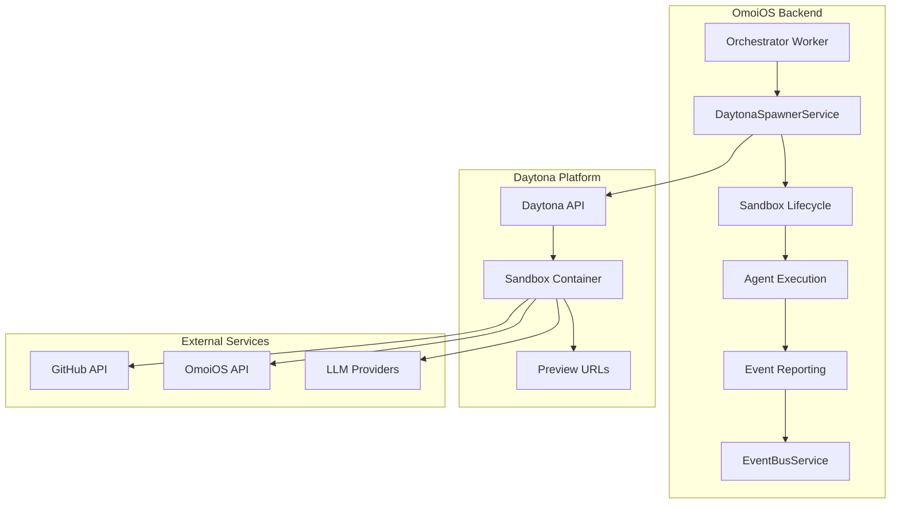
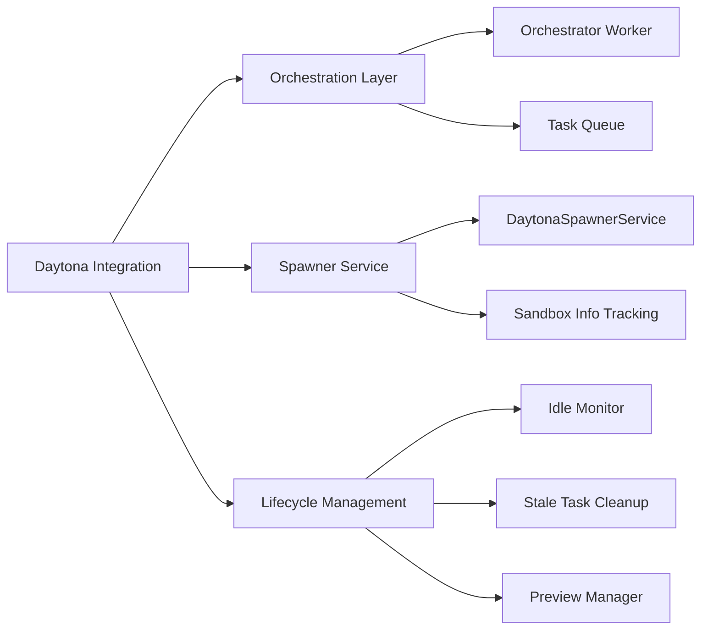
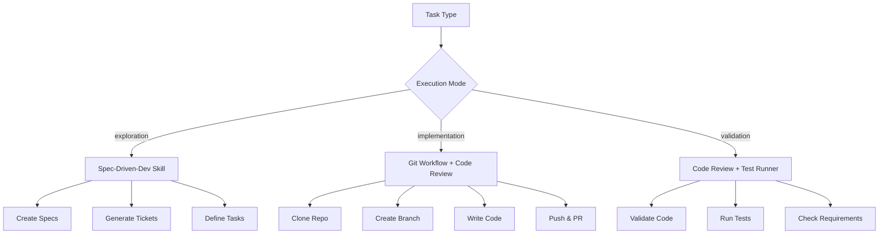
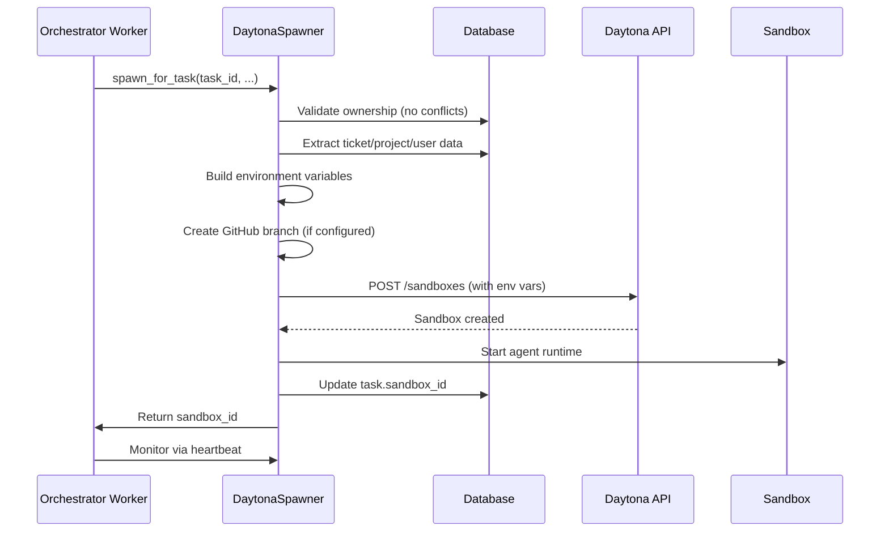
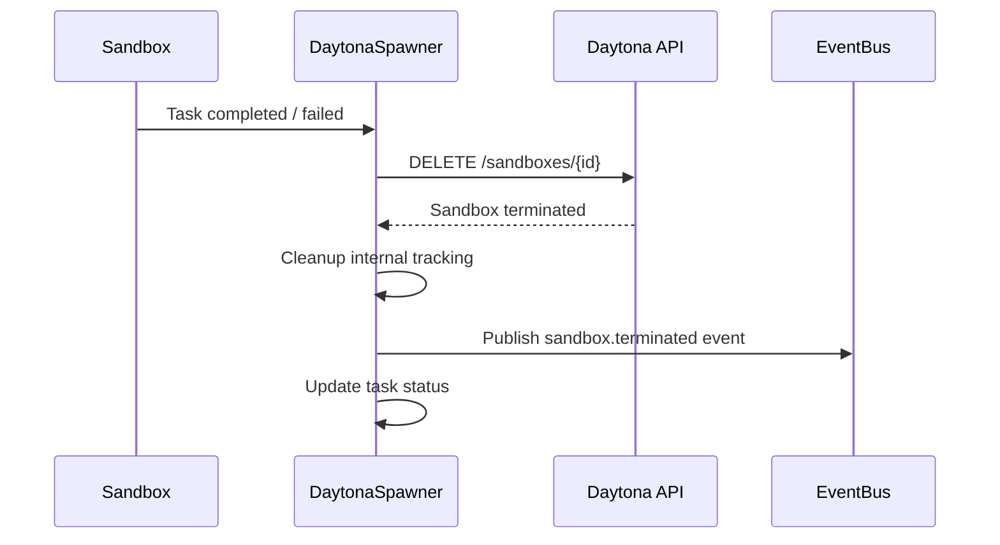
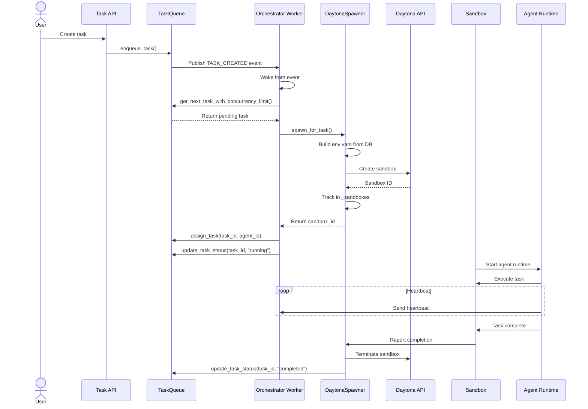
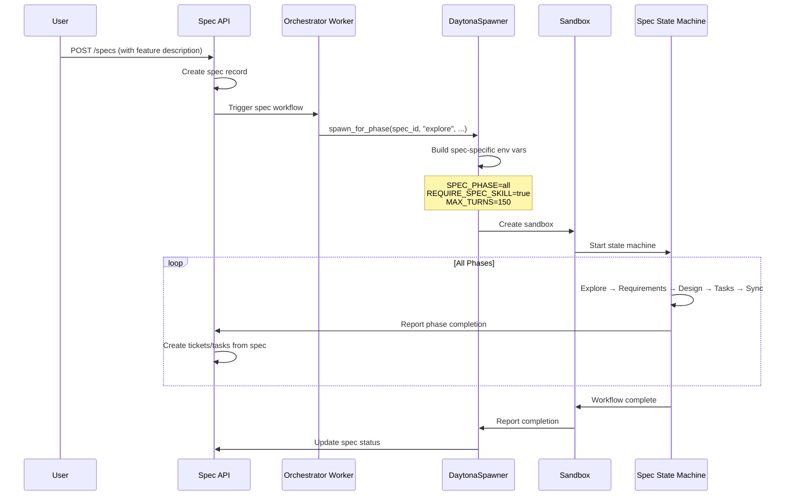
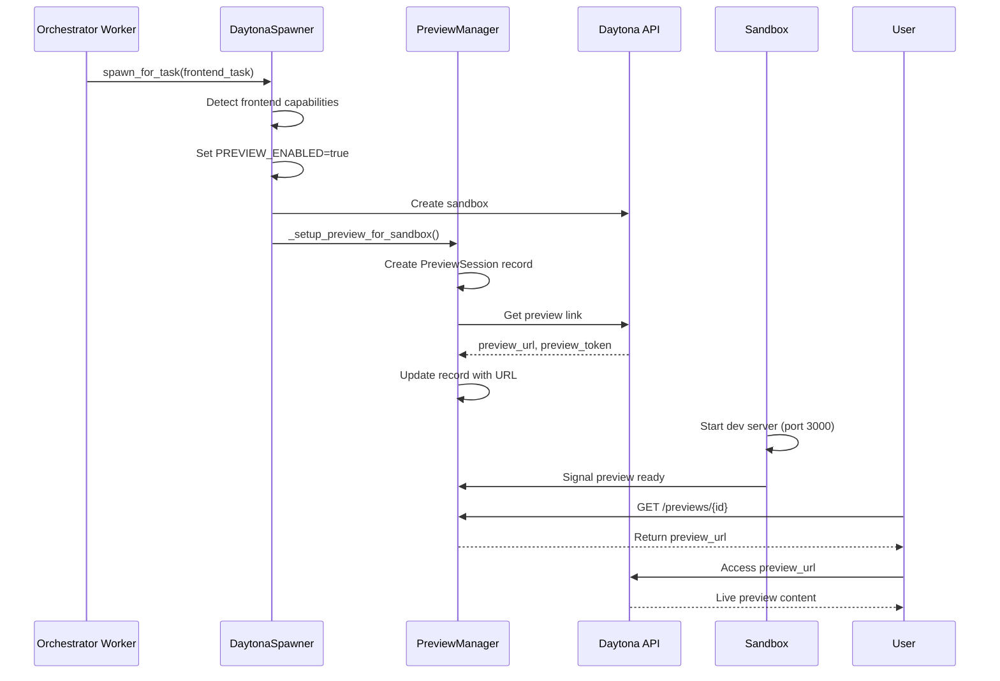

# Daytona Sandbox Integration

**Status**: Implemented  
**Last Updated**: 2026-04-22  
**Related**: [Orchestrator Worker](../../backend/omoi_os/workers/orchestrator_worker.py), [GitHub Provider](./github_provider_integration.md)

---

## 1. Overview

The Daytona Sandbox Integration provides isolated, ephemeral execution environments for OmoiOS agents. Each task gets its own sandbox — a containerized workspace with dedicated resources, pre-configured tooling, and secure access to external services. This integration enables true parallel agent execution without resource conflicts or security risks.

### Key Capabilities

- **Isolated Execution**: Each task runs in its own Daytona sandbox with dedicated CPU, memory, and disk
- **Dynamic Resource Allocation**: Configurable resource limits (CPU: 2-4 cores, Memory: 4-8 GB, Disk: 8-10 GB)
- **Multi-Runtime Support**: OpenHands SDK and Claude Agent SDK execution modes
- **Automatic Lifecycle Management**: Spawn, monitor, cleanup, and terminate sandboxes automatically
- **Git Integration**: Pre-clone repositories, create branches, and configure GitHub tokens
- **Live Preview**: Frontend tasks get automatic preview URLs for real-time development
- **Session Resumption**: Resume interrupted sessions with full transcript recovery
- **Spec-Driven Mode**: Special execution mode for spec state machine workflows

---

## 2. Architecture

### 2.1 System Context



### 2.2 Component Hierarchy



### 2.3 Sandbox Execution Modes



---

## 3. Component Details

### 3.1 DaytonaSpawnerService

The core service for managing Daytona sandbox lifecycles.

```python
class DaytonaSpawnerService:
    """Service for spawning and managing Daytona sandboxes."""
    
    def __init__(
        self,
        db: Optional[DatabaseService] = None,
        event_bus: Optional[EventBusService] = None,
        mcp_server_url: str = "http://localhost:18000/mcp/",
        daytona_api_key: Optional[str] = None,
        daytona_api_url: str = "https://app.daytona.io/api",
        sandbox_image: Optional[str] = "nikolaik/python-nodejs:python3.12-nodejs22",
        sandbox_snapshot: Optional[str] = None,
        auto_cleanup: bool = True,
        sandbox_memory_gb: int = 4,
        sandbox_cpu: int = 2,
        sandbox_disk_gb: int = 8,
    ):
```

**Configuration Parameters:**

| Parameter | Default | Range | Description |
|-----------|---------|-------|-------------|
| `sandbox_memory_gb` | 4 | 1-8 | Memory allocation in GiB |
| `sandbox_cpu` | 2 | 1-4 | CPU cores |
| `sandbox_disk_gb` | 8 | 1-10 | Disk space in GiB |
| `sandbox_image` | `nikolaik/python-nodejs:python3.12-nodejs22` | - | Base Docker image |
| `sandbox_snapshot` | None | - | Pre-configured snapshot (takes precedence) |
| `auto_cleanup` | True | - | Auto-terminate on completion |

**Key Methods:**

| Method | Purpose |
|--------|---------|
| `spawn_for_task()` | Create sandbox for a single task |
| `spawn_for_phase()` | Create sandbox for spec state machine workflow |
| `terminate_sandbox()` | Cleanly terminate a running sandbox |
| `get_sandbox_info()` | Get current status and metadata |
| `list_active_sandboxes()` | List all tracked sandboxes |

### 3.2 Sandbox Spawning Pipeline

```python
async def spawn_for_task(
    self,
    task_id: str,
    agent_id: str,
    phase_id: str,
    agent_type: Optional[str] = None,
    extra_env: Optional[Dict[str, str]] = None,
    labels: Optional[Dict[str, str]] = None,
    runtime: str = "openhands",  # "openhands" or "claude"
    execution_mode: str = "implementation",
    continuous_mode: Optional[bool] = None,
    task_requirements: Optional["TaskRequirements"] = None,
    require_spec_skill: bool = False,
    project_id: Optional[str] = None,
    omoios_api_key: Optional[str] = None,
) -> str:
    """Spawn a Daytona sandbox for executing a task."""
```

**Spawn Pipeline Steps:**

1. **Ownership Validation**: Check for conflicting file ownership with parallel tasks
2. **Environment Preparation**: Build comprehensive env vars from task, ticket, project data
3. **GitHub Branch Creation**: Create feature branch before sandbox spawn (if repo configured)
4. **Session Resumption**: Check for existing session transcripts to resume
5. **Sandbox Creation**: Call Daytona API to create container
6. **Preview Setup**: For frontend tasks, set up live preview URLs
7. **Event Publishing**: Emit `sandbox.spawned` event
8. **Monitoring**: Begin idle detection and health checks

### 3.3 Environment Variable Injection

The spawner injects critical configuration via environment variables:

**Core Variables:**

```python
env_vars = {
    # Identity
    "AGENT_ID": agent_id,
    "TASK_ID": task_id,
    "SANDBOX_ID": sandbox_id,
    "PHASE_ID": phase_id,
    
    # Execution Control
    "EXECUTION_MODE": execution_mode,  # exploration|implementation|validation
    "RUNTIME": runtime,  # openhands|claude
    "CONTINUOUS_MODE": "true" | "false",
    
    # API Connectivity
    "MCP_SERVER_URL": self.mcp_server_url,
    "CALLBACK_URL": base_url,
    "OMOIOS_API_URL": base_url,
    "OMOIOS_API_KEY": api_key,
    
    # Git Configuration
    "GITHUB_REPO": "owner/repo",
    "GITHUB_TOKEN": github_token,
    "BRANCH_NAME": branch_name,
    
    # Spec-Driven Mode
    "REQUIRE_SPEC_SKILL": "true" | "false",
    "OMOIOS_PROJECT_ID": project_id,
    "SPEC_ID": spec_id,
    "SPEC_PHASE": "all",
    
    # Validation Requirements
    "REQUIRE_CLEAN_GIT": "true" | "false",
    "REQUIRE_CODE_PUSHED": "true" | "false",
    "REQUIRE_PR_CREATED": "true" | "false",
    "REQUIRE_TESTS": "true" | "false",
    
    # Resource Limits
    "MAX_ITERATIONS": "10",
    "MAX_TOTAL_COST_USD": "20.0",
    "MAX_DURATION_SECONDS": "3600",
    "MAX_TURNS": "150",
    "MAX_BUDGET_USD": "50.0",
    
    # Session Resumption
    "RESUME_SESSION_ID": session_id,
    "SESSION_TRANSCRIPT_B64": transcript_b64,
    
    # Frontend Preview
    "PREVIEW_ENABLED": "true" | "false",
    "PREVIEW_PORT": "3000",
    
    # Security
    "IS_SANDBOX": "1",  # Enables --dangerously-skip-permissions
}
```

### 3.4 Orchestrator Worker Integration

The orchestrator worker manages the full lifecycle of task execution via sandboxes.

```python
async def orchestrator_loop():
    """Background task that polls queue and spawns sandboxes for tasks."""
    
    # Initialize Daytona spawner
    daytona_spawner = get_daytona_spawner(db=db, event_bus=event_bus)
    
    while not shutdown_event.is_set():
        # Get next pending task with concurrency limits
        task = queue.get_next_task_with_concurrency_limit(
            max_concurrent_per_project=max_concurrent_per_project,
            phase_id=None,
        )
        
        if task:
            # Spawn sandbox for implementation
            await _spawn_sandbox_for_task(
                task, "implementation", daytona_spawner, log
            )
        
        # Check for validation tasks
        validation_task = queue.get_next_validation_task(
            max_concurrent_per_project=max_concurrent_per_project,
        )
        if validation_task:
            await _spawn_sandbox_for_task(
                validation_task, "validation", daytona_spawner, log
            )
```

**Execution Modes:**

| Mode | Task Types | Skills Loaded | Git Validation |
|------|-----------|---------------|----------------|
| `exploration` | create_spec, analyze_codebase, research | spec-driven-dev | Disabled |
| `implementation` | implement_feature, fix_bug, refactor | git-workflow, code-review | Required (commit, push, PR) |
| `validation` | validate, review_code, run_tests | code-review, test-runner | Required |

### 3.5 Sandbox Lifecycle Management

**Creation Flow:**



**Termination Flow:**



### 3.6 Idle Sandbox Monitoring

```python
class IdleSandboxMonitor:
    """Monitors sandboxes for idle activity and terminates them to save resources."""
    
    async def check_and_terminate_idle_sandboxes(self) -> list[str]:
        """Check for idle sandboxes and terminate them.
        
        An idle sandbox is one that:
        - Has recent heartbeats (is alive)
        - Has no work events for an extended period
        """
```

**Idle Detection Criteria:**

| Metric | Threshold | Action |
|--------|-----------|--------|
| No work events | 10 minutes | Mark for termination |
| Heartbeat stale | 5 minutes | Consider unhealthy |
| Max duration | 1 hour | Force terminate |
| Max cost | $20 USD | Force terminate |

### 3.7 Stale Task Cleanup

```python
async def stale_task_cleanup_loop():
    """Background task that cleans up tasks stuck in 'assigned' or 'claiming' status.
    
    Tasks that have been assigned but never transitioned to 'running' are
    likely orphaned (sandbox crashed before sending agent.started event).
    """
```

**Cleanup Thresholds:**

| Status | Threshold | Action |
|--------|-----------|--------|
| `claiming` | 60 seconds | Reset to `pending` |
| `assigned` | 3 minutes | Mark as `failed` |
| `running` (no heartbeat) | 5 minutes | Mark as `failed` |

---

## 4. Integration Flow

### 4.1 Task-to-Sandbox Flow



### 4.2 Spec State Machine Flow



### 4.3 Frontend Preview Flow



---

## 5. Data Models

### 5.1 SandboxInfo (In-Memory Tracking)

```python
@dataclass
class SandboxInfo:
    """Information about a spawned sandbox."""
    
    sandbox_id: str
    agent_id: str
    task_id: str
    phase_id: str
    status: str = "creating"  # creating, running, completed, failed, terminated
    created_at: datetime = field(default_factory=utc_now)
    started_at: Optional[datetime] = None
    completed_at: Optional[datetime] = None
    error: Optional[str] = None
    extra_data: Dict[str, Any] = field(default_factory=dict)
```

### 5.2 Task Model (Sandbox Fields)

```python
class Task(Base):
    """Task with sandbox integration fields."""
    
    sandbox_id: Mapped[Optional[str]] = mapped_column(String(255), nullable=True)
    assigned_agent_id: Mapped[Optional[str]] = mapped_column(String(255), nullable=True)
    status: Mapped[str] = mapped_column(String(50), default="pending")
    # ... other fields
```

### 5.3 PreviewSession Model

```python
class PreviewSession(Base):
    """Live preview session for frontend tasks."""
    
    id: Mapped[str] = mapped_column(String(255), primary_key=True)
    sandbox_id: Mapped[str] = mapped_column(String(255))
    task_id: Mapped[str] = mapped_column(String(255))
    project_id: Mapped[Optional[str]] = mapped_column(String(255))
    port: Mapped[int] = mapped_column(Integer, default=3000)
    framework: Mapped[str] = mapped_column(String(50))
    preview_url: Mapped[Optional[str]] = mapped_column(String(500))
    preview_token: Mapped[Optional[str]] = mapped_column(String(255))
    status: Mapped[str] = mapped_column(String(50), default="pending")
    created_at: Mapped[datetime]
    started_at: Mapped[Optional[datetime]]
    terminated_at: Mapped[Optional[datetime]]
```

---

## 6. Configuration

### 6.1 Environment Variables

| Variable | Required | Default | Description |
|----------|----------|---------|-------------|
| `DAYTONA_API_KEY` | Yes | - | Daytona platform API key |
| `DAYTONA_API_URL` | No | `https://app.daytona.io/api` | Daytona API endpoint |
| `DAYTONA_SANDBOX_EXECUTION` | No | `true` | Enable sandbox mode (vs legacy) |
| `SANDBOX_RUNTIME` | No | `claude` | Default runtime: `claude` or `openhands` |
| `MAX_CONCURRENT_TASKS_PER_PROJECT` | No | `5` | Concurrency limit per project |
| `IDLE_THRESHOLD_MINUTES` | No | `10` | Idle detection threshold |
| `STALE_TASK_THRESHOLD_MINUTES` | No | `3` | Stale task cleanup threshold |
| `ORCHESTRATOR_DRY_RUN` | No | `false` | Simulate without spawning |

### 6.2 YAML Configuration

```yaml
# config/base.yaml
daytona:
  api_key: "${DAYTONA_API_KEY}"
  api_url: "${DAYTONA_API_URL}"
  sandbox_execution: true
  
  # Resource defaults (can be overridden per-sandbox)
  sandbox_memory_gb: 4
  sandbox_cpu: 2
  sandbox_disk_gb: 8
  
  # Image configuration
  image: "nikolaik/python-nodejs:python3.12-nodejs22"
  snapshot: null  # Use snapshot instead of image if set
  
  # Auto-cleanup completed sandboxes
  auto_cleanup: true

orchestrator:
  dry_run: false
  max_concurrent_per_project: 5
  
  # Idle detection
  idle_detection_enabled: true
  idle_threshold_minutes: 10
  
  # Stale task cleanup
  stale_cleanup_enabled: true
  stale_threshold_minutes: 3
```

---

## 7. Error Handling

### 7.1 Sandbox Creation Errors

| Error | Cause | Handling |
|-------|-------|----------|
| `RuntimeError: Daytona API key not configured` | Missing API key | Log error, skip sandbox spawn |
| `OwnershipConflictError` | Parallel task file conflict | Log warning, spawn anyway (lenient mode) |
| `HTTP 429 Too Many Requests` | Rate limit | Retry with exponential backoff |
| `HTTP 500 Internal Error` | Daytona platform error | Mark task as failed, retry later |

### 7.2 Runtime Errors

| Error | Cause | Handling |
|-------|-------|----------|
| Sandbox crash | Resource exhaustion | Detect via heartbeat timeout, mark failed |
| Agent error | Code execution failure | Capture logs, mark failed with error message |
| Network isolation | External API unreachable | Retry with backoff, eventually fail |
| Git auth failure | Invalid GitHub token | Log error, task fails with auth message |

### 7.3 Error Recovery

```python
try:
    sandbox_id = await daytona_spawner.spawn_for_task(...)
except OwnershipConflictError:
    # Log but continue - lenient mode
    logger.warning("Ownership conflict detected, spawning anyway")
    sandbox_id = await daytona_spawner.spawn_for_task(..., skip_validation=True)
except Exception as e:
    # Mark task as failed
    stats["tasks_failed"] += 1
    queue.update_task_status(
        task.id,
        "failed",
        error_message=f"Sandbox spawn failed: {e}",
    )
```

---

## 8. Security Considerations

### 8.1 Isolation

- **Container Isolation**: Each sandbox runs in its own Docker container
- **Network Isolation**: Sandboxes have restricted network access
- **Resource Limits**: CPU, memory, and disk quotas prevent resource exhaustion
- **No Shared State**: Each sandbox has its own filesystem

### 8.2 Credential Management

- **GitHub Tokens**: Passed via env vars, never logged
- **API Keys**: Short-lived JWT tokens (1 hour expiry)
- **OAuth Tokens**: Preferred over API keys for Claude Agent SDK
- **Secret Masking**: All tokens masked in logs (show only first 10 chars)

### 8.3 Permission Model

```python
# IS_SANDBOX=1 enables --dangerously-skip-permissions in Claude Code
# This is safe because:
# 1. Sandboxes are ephemeral and isolated
# 2. No sensitive host data is accessible
# 3. Network access is restricted
# 4. Resource limits prevent DoS
env_vars["IS_SANDBOX"] = "1"
```

---

## 9. Event Integration

### 9.1 Published Events

| Event | Publisher | Payload |
|-------|-----------|---------|
| `sandbox.spawned` | DaytonaSpawnerService | sandbox_id, task_id, agent_id, phase_id |
| `SANDBOX_SPAWNED` | Orchestrator Worker | sandbox_id, task_id, ticket_id, agent_id |
| `VALIDATION_SANDBOX_SPAWNED` | Orchestrator Worker | sandbox_id, task_id, ticket_id, agent_id |
| `sandbox.failed` | DaytonaSpawnerService | sandbox_id, error |
| `sandbox.terminated` | DaytonaSpawnerService | sandbox_id, reason |
| `TASK_ASSIGNED` | Orchestrator Worker | task_id, agent_id |
| `TASK_STATUS_CHANGED` | Orchestrator Worker | task_id, status, old_status |

### 9.2 Event Consumption

```python
# Orchestrator subscribes to these events for wakeup
event_bus.subscribe("TASK_CREATED", handle_task_event)
event_bus.subscribe("TICKET_CREATED", handle_task_event)
event_bus.subscribe("SANDBOX_agent.completed", handle_task_event)
event_bus.subscribe("SANDBOX_agent.failed", handle_task_event)
event_bus.subscribe("TASK_VALIDATION_FAILED", handle_validation_failed)
```

---

## 10. Testing

### 10.1 Unit Tests

```python
@pytest.mark.unit
async def test_spawn_for_task():
    spawner = DaytonaSpawnerService(db=mock_db, event_bus=mock_event_bus)
    
    sandbox_id = await spawner.spawn_for_task(
        task_id="task-123",
        agent_id="agent-456",
        phase_id="PHASE_IMPLEMENTATION",
        runtime="claude",
        execution_mode="implementation",
    )
    
    assert sandbox_id.startswith("omoios-")
    assert sandbox_id in spawner._sandboxes
```

### 10.2 Integration Tests

```python
@pytest.mark.integration
async def test_sandbox_lifecycle():
    # Spawn sandbox
    sandbox_id = await spawner.spawn_for_task(...)
    
    # Verify creation
    info = spawner.get_sandbox_info(sandbox_id)
    assert info.status == "running"
    
    # Terminate
    await spawner.terminate_sandbox(sandbox_id)
    
    # Verify termination
    info = spawner.get_sandbox_info(sandbox_id)
    assert info.status == "terminated"
```

### 10.3 Dry-Run Mode

```python
# Enable dry-run to test orchestrator logic without spawning
export ORCHESTRATOR_DRY_RUN=true

# Orchestrator will:
# - Run decision loop
# - Log what WOULD be spawned
# - Publish dry_run events
# - Skip actual sandbox creation
```

---

## 11. Related Documentation

- [Orchestrator Worker](../../backend/omoi_os/workers/orchestrator_worker.py) - Full worker implementation
- [Daytona Spawner Service](../../backend/omoi_os/services/daytona_spawner.py) - Spawner service code
- [GitHub Provider Integration](./github_provider_integration.md) - Git integration details
- [Spec State Machine](../../architecture/01-planning-system.md) - Spec workflow documentation
- [Architecture: Execution System](../../architecture/02-execution-system.md) - System deep-dive

---

## 12. Changelog

| Date | Change | Author |
|------|--------|--------|
| 2026-04-22 | Initial integration design document | System |
| 2026-04-20 | Added session resumption support | System |
| 2026-04-18 | Implemented live preview for frontend tasks | System |
| 2026-04-15 | Added spec-driven mode with state machine | System |
| 2026-04-10 | Initial Daytona spawner implementation | System |
