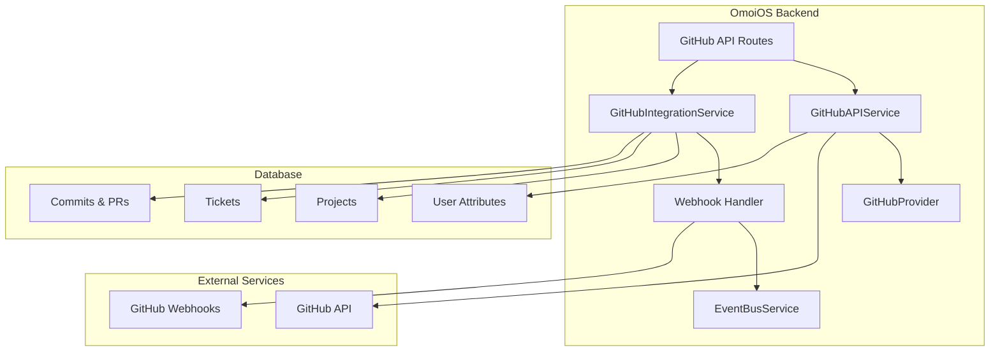
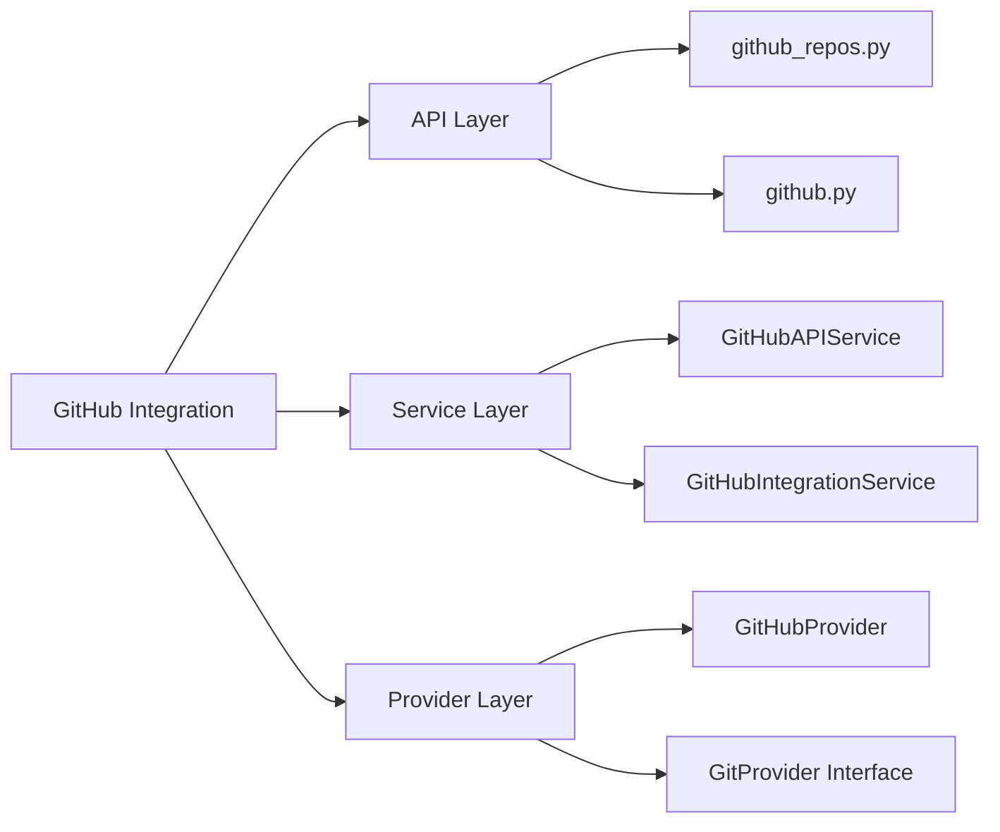
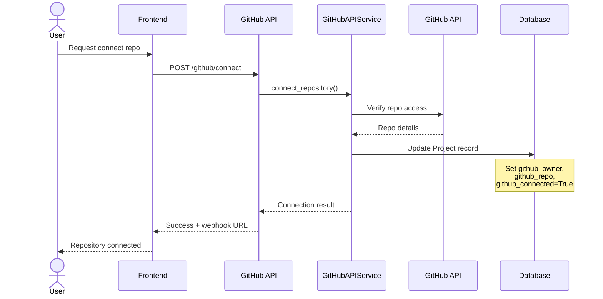
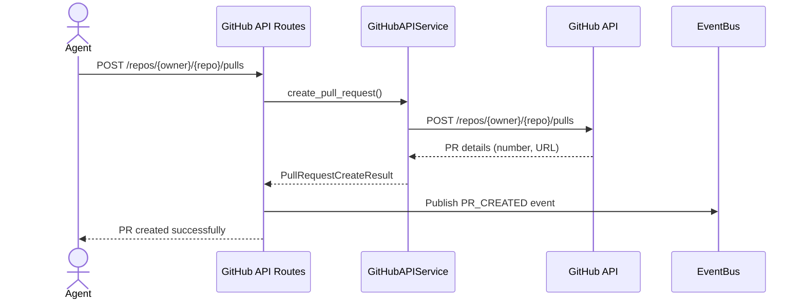
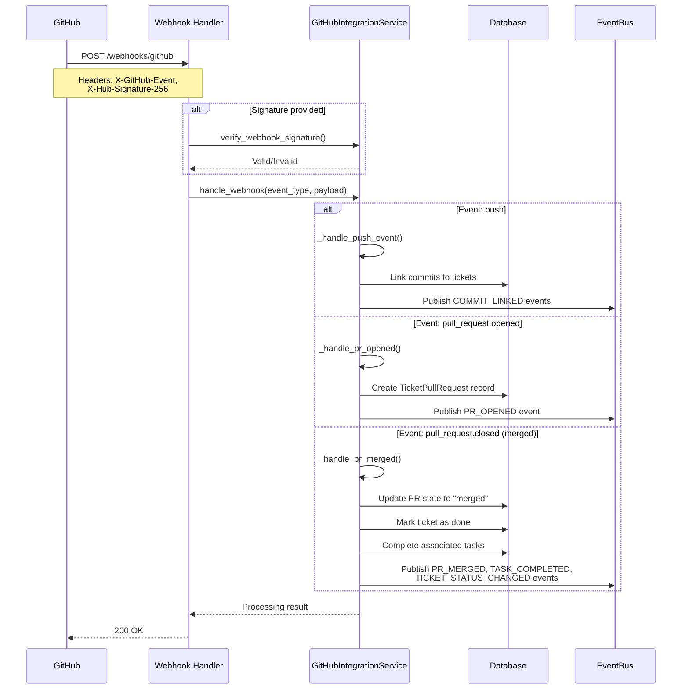
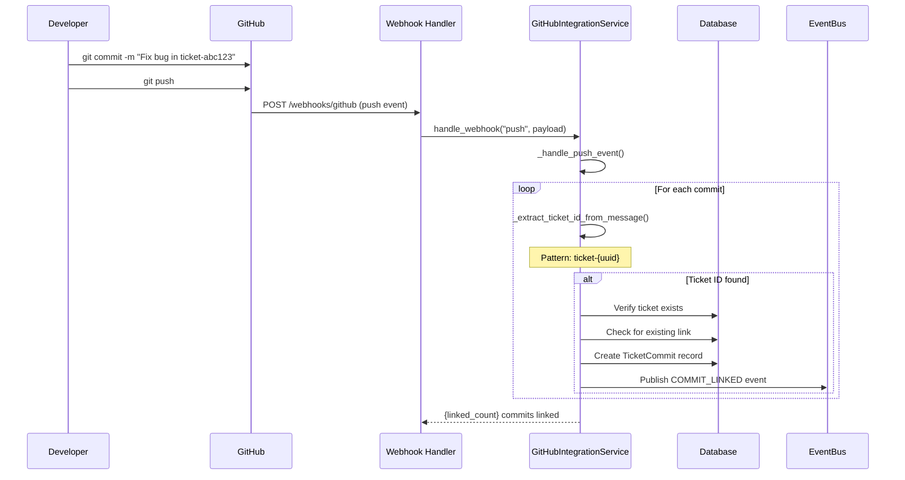

# GitHub Provider Integration

**Status**: Implemented  
**Last Updated**: 2026-04-22  
**Related**: [OAuth Integration](./oauth_integration.md), [MCP Server Integration](./mcp_server_integration.md)

---

## 1. Overview

The GitHub Provider Integration enables OmoiOS to interact with GitHub repositories on behalf of authenticated users. It provides a comprehensive abstraction layer over the GitHub API, supporting repository management, branch operations, pull request workflows, webhook handling, and commit tracking. This integration is foundational for OmoiOS's spec-driven development workflow, allowing agents to create branches, commit code, open PRs, and track development progress.

### Key Capabilities

- **Repository Management**: List, create, and manage GitHub repositories
- **Branch Operations**: Create, delete, and compare branches
- **Pull Request Workflow**: Create, merge, and track PRs with automatic ticket linking
- **Webhook Integration**: Receive and process GitHub webhooks for push, PR, and issue events
- **File Operations**: Read, create, and update files in repositories
- **Commit Tracking**: Link commits to tickets via message patterns
- **OAuth Integration**: Secure user authentication via GitHub OAuth flow

---

## 2. Architecture

### 2.1 System Context



### 2.2 Component Hierarchy



---

## 3. Component Details

### 3.1 API Routes (`github_repos.py`, `github.py`)

The API layer provides RESTful endpoints for GitHub operations, organized into logical groups:

#### Repository Routes (`github_repos.py`)

```python
# Repository listing and management
@router.get("/repos", response_model=list[GitHubRepo])
async def list_repos(
    visibility: str = Query("all", pattern="^(all|public|private)$"),
    sort: str = Query("updated", pattern="^(created|updated|pushed|full_name)$"),
    per_page: int = Query(100, ge=1, le=100),
    page: int = Query(1, ge=1),
    current_user: User = Depends(verify_github_connected),
    github_service: GitHubAPIService = Depends(get_github_api_service),
):
    """List repositories for the authenticated user."""
```

**Key Endpoints:**

| Method | Endpoint | Description |
|--------|----------|-------------|
| GET | `/github/repos` | List user's repositories (auto-pagination) |
| GET | `/github/repos/{owner}/{repo}` | Get repository details |
| POST | `/github/repos` | Create new repository |
| GET | `/github/owners` | List available owners/orgs |
| POST | `/github/check-availability` | Check repo name availability |
| GET | `/github/connected` | List connected repositories |

#### Branch Routes

```python
@router.get("/repos/{owner}/{repo}/branches", response_model=list[GitHubBranch])
async def list_branches(...)

@router.post("/repos/{owner}/{repo}/branches", response_model=BranchCreateResult)
async def create_branch(...)
```

#### File Routes

```python
@router.get("/repos/{owner}/{repo}/contents/{path:path}", response_model=GitHubFile)
async def get_file_content(...)

@router.put("/repos/{owner}/{repo}/contents/{path:path}", response_model=FileOperationResult)
async def create_or_update_file(...)

@router.get("/repos/{owner}/{repo}/directory", response_model=list[DirectoryItem])
async def list_directory(...)

@router.get("/repos/{owner}/{repo}/tree", response_model=list[TreeItem])
async def get_tree(...)
```

#### Pull Request Routes

```python
@router.get("/repos/{owner}/{repo}/pulls", response_model=list[GitHubPullRequest])
async def list_pull_requests(...)

@router.post("/repos/{owner}/{repo}/pulls", response_model=PullRequestCreateResult)
async def create_pull_request(...)
```

#### Webhook Routes (`github.py`)

```python
@router.post("/webhooks/github")
async def handle_github_webhook(
    request: Request,
    x_github_event: str = Header(..., alias="X-GitHub-Event"),
    x_hub_signature_256: Optional[str] = Header(None, alias="X-Hub-Signature-256"),
    github_service: GitHubIntegrationService = Depends(get_github_service),
):
    """Handle GitHub webhook events."""
```

### 3.2 GitHubAPIService

The core service for GitHub API operations using user OAuth tokens.

```python
class GitHubAPIService:
    """Service for GitHub API operations using user OAuth tokens."""
    
    BASE_URL = "https://api.github.com"
    
    def __init__(self, db: DatabaseService):
        self.db = db
```

**Key Methods:**

| Method | Purpose | Pagination |
|--------|---------|------------|
| `list_user_repos()` | List user's repositories | Auto-pagination (max 50 pages) |
| `get_repo()` | Get repository details | - |
| `list_branches()` | List repository branches | Manual pagination |
| `create_branch()` | Create new branch | - |
| `get_file_content()` | Read file content | - |
| `create_or_update_file()` | Write file content | - |
| `list_directory()` | List directory contents | - |
| `get_tree()` | Get repository tree | Recursive support |
| `list_commits()` | List commits | Manual pagination |
| `list_pull_requests()` | List PRs | Manual pagination |
| `create_pull_request()` | Create PR | - |
| `merge_pull_request()` | Merge PR | - |
| `delete_branch()` | Delete branch | - |
| `compare_branches()` | Compare branches | - |

**Token Management:**

```python
def _get_user_token_by_id(self, user_id: UUID) -> Optional[str]:
    """Get GitHub access token by user ID from user attributes."""
    with self.db.get_session() as session:
        user = session.get(User, user_id)
        if user:
            attrs = user.attributes or {}
            return attrs.get("github_access_token")
```

**Request Headers:**

```python
def _headers(self, token: str) -> dict[str, str]:
    return {
        "Authorization": f"Bearer {token}",
        "Accept": "application/vnd.github+json",
        "X-GitHub-Api-Version": "2022-11-28",
    }
```

### 3.3 GitHubIntegrationService

Handles webhook processing, commit tracking, and PR-ticket linking.

```python
class GitHubIntegrationService:
    """Service for GitHub repository integration."""
    
    def __init__(
        self,
        db: DatabaseService,
        event_bus: EventBusService,
        github_token: Optional[str] = None,
    ):
        self.db = db
        self.event_bus = event_bus
        self.github_token = github_token
```

**Webhook Event Handlers:**

| Event Type | Handler | Actions |
|------------|---------|---------|
| `push` | `_handle_push_event()` | Link commits to tickets |
| `pull_request` | `_handle_pull_request_event()` | Route to sub-handlers |
| `pull_request.opened` | `_handle_pr_opened()` | Create TicketPullRequest record |
| `pull_request.closed` (merged) | `_handle_pr_merged()` | Mark ticket done, complete tasks |
| `pull_request.closed` (not merged) | `_handle_pr_closed()` | Update PR state |
| `pull_request.reopened` | `_handle_pr_reopened()` | Update PR state |
| `issues` | `_handle_issue_event()` | Acknowledge only |

**Commit-Ticket Linking:**

```python
def _extract_ticket_id_from_message(self, message: str) -> Optional[str]:
    """Extract ticket ID from commit message.
    
    Patterns supported:
    - "ticket-{uuid}"
    - "#{id}"
    - "TICKET-{id}"
    """
    # Pattern 1: ticket-{uuid}
    pattern1 = r"ticket-([a-f0-9-]{36})"
    match = re.search(pattern1, message, re.IGNORECASE)
    if match:
        return f"ticket-{match.group(1)}"
    
    # Pattern 2: # followed by ticket ID
    pattern2 = r"#(\w+-\w+)"
    match = re.search(pattern2, message, re.IGNORECASE)
    if match:
        return match.group(1)
```

**PR-Ticket Linking:**

```python
def _extract_ticket_id_from_pr(
    self, title: str, body: str, branch: str
) -> Optional[str]:
    """Extract ticket ID from PR title, body, or branch name.
    
    Patterns:
    - PR title: "[TICKET-abc123] Add feature"
    - PR body: "Closes ticket-abc123"
    - Branch: "feature/ticket-abc123-description"
    """
```

**Webhook Signature Verification:**

```python
def verify_webhook_signature(
    self, payload_body: bytes, signature: str, secret: str
) -> bool:
    """Verify GitHub webhook signature using HMAC-SHA256."""
    if not signature.startswith("sha256="):
        return False
    
    expected_signature = signature[7:]  # Remove "sha256=" prefix
    
    mac = hmac.new(
        secret.encode("utf-8"),
        msg=payload_body,
        digestmod=hashlib.sha256,
    )
    calculated_signature = mac.hexdigest()
    
    return hmac.compare_digest(expected_signature, calculated_signature)
```

### 3.4 GitHubProvider

Implements the `GitProvider` interface for the convergence merge system.

```python
class GitHubProvider:
    """GitProvider backed by GitHub API. Wraps existing GitHubAPIService."""
    
    def __init__(self, github_api, user_id: Optional[UUID | str] = None):
        self._api = github_api
        self._user_id = user_id
```

**Interface Implementation:**

| Method | GitHub API Mapping |
|--------|-------------------|
| `create_branch()` | `POST /repos/{owner}/{repo}/git/refs` |
| `delete_branch()` | `DELETE /repos/{owner}/{repo}/git/refs/heads/{branch}` |
| `get_branch()` | `GET /repos/{owner}/{repo}/branches` (filtered) |
| `list_branches()` | `GET /repos/{owner}/{repo}/branches` |
| `create_pull_request()` | `POST /repos/{owner}/{repo}/pulls` |
| `merge_pull_request()` | `PUT /repos/{owner}/{repo}/pulls/{number}/merge` |
| `get_default_branch()` | `GET /repos/{owner}/{repo}` |
| `clone_repo()` | `git clone` subprocess |

---

## 4. Integration Flow

### 4.1 Repository Connection Flow



### 4.2 Pull Request Creation Flow



### 4.3 Webhook Processing Flow



### 4.4 Commit-to-Ticket Linking Flow



---

## 5. Data Models

### 5.1 Pydantic Models (API Layer)

```python
class GitHubRepo(BaseModel):
    """GitHub repository info."""
    id: int
    name: str
    full_name: str
    owner: str
    description: Optional[str] = None
    private: bool
    html_url: str
    clone_url: str
    default_branch: str = "main"
    language: Optional[str] = None
    stargazers_count: int = 0
    forks_count: int = 0

class GitHubBranch(BaseModel):
    """GitHub branch info."""
    name: str
    sha: str
    protected: bool = False

class GitHubFile(BaseModel):
    """GitHub file info."""
    name: str
    path: str
    sha: str
    size: int = 0
    type: str  # "file" or "dir"
    content: Optional[str] = None  # Base64 decoded
    encoding: Optional[str] = None

class GitHubCommit(BaseModel):
    """GitHub commit info."""
    sha: str
    message: str
    author_name: Optional[str] = None
    author_email: Optional[str] = None
    date: Optional[str] = None
    html_url: Optional[str] = None

class GitHubPullRequest(BaseModel):
    """GitHub pull request info."""
    number: int
    title: str
    state: str
    html_url: str
    head_branch: str
    base_branch: str
    body: Optional[str] = None
    merged: bool = False
    mergeable: Optional[bool] = None
    draft: bool = False
```

### 5.2 Database Models

**Project Model (GitHub Fields):**

```python
class Project(Base):
    """Project with GitHub integration fields."""
    
    # GitHub integration
    github_owner: Mapped[Optional[str]] = mapped_column(String(255), nullable=True)
    github_repo: Mapped[Optional[str]] = mapped_column(String(255), nullable=True)
    github_webhook_secret: Mapped[Optional[str]] = mapped_column(String(255), nullable=True)
    github_connected: Mapped[bool] = mapped_column(Boolean, default=False)
```

**TicketCommit Model:**

```python
class TicketCommit(Base):
    """Links GitHub commits to tickets."""
    
    id: Mapped[str] = mapped_column(String(255), primary_key=True)
    ticket_id: Mapped[str] = mapped_column(String(255), ForeignKey("tickets.id"))
    agent_id: Mapped[str] = mapped_column(String(255))
    commit_sha: Mapped[str] = mapped_column(String(255))
    commit_message: Mapped[str] = mapped_column(Text)
    commit_timestamp: Mapped[datetime]
    files_changed: Mapped[int]
    insertions: Mapped[int]
    deletions: Mapped[int]
    files_list: Mapped[Optional[dict]] = mapped_column(JSONB)
    link_method: Mapped[str] = mapped_column(String(50))  # "webhook", "manual"
```

**TicketPullRequest Model:**

```python
class TicketPullRequest(Base):
    """Links GitHub PRs to tickets."""
    
    id: Mapped[str] = mapped_column(String(255), primary_key=True)
    ticket_id: Mapped[str] = mapped_column(String(255), ForeignKey("tickets.id"))
    pr_number: Mapped[int]
    pr_title: Mapped[str] = mapped_column(String(500))
    pr_body: Mapped[Optional[str]] = mapped_column(Text)
    head_branch: Mapped[str] = mapped_column(String(255))
    base_branch: Mapped[str] = mapped_column(String(255))
    repo_owner: Mapped[str] = mapped_column(String(255))
    repo_name: Mapped[str] = mapped_column(String(255))
    state: Mapped[str] = mapped_column(String(50))  # "open", "merged", "closed"
    html_url: Mapped[str] = mapped_column(String(500))
    github_user: Mapped[str] = mapped_column(String(255))
    merge_commit_sha: Mapped[Optional[str]] = mapped_column(String(255))
    merged_at: Mapped[Optional[datetime]]
    closed_at: Mapped[Optional[datetime]]
```

### 5.3 User Attributes Storage

GitHub tokens and metadata are stored in the user's `attributes` JSONB field:

```python
{
    "github_access_token": "gho_xxxxxxxxxxxx",
    "github_user_id": "12345678",
    "github_username": "octocat",
    "github_connected_at": "2026-04-22T10:30:00Z"
}
```

---

## 6. Configuration

### 6.1 Environment Variables

| Variable | Required | Description |
|----------|----------|-------------|
| `GITHUB_TOKEN` | No | Global GitHub token for system operations |
| `GITHUB_WEBHOOK_SECRET` | No | Default webhook secret for verification |

### 6.2 YAML Configuration

```yaml
# config/base.yaml
integrations:
  github_token: "${GITHUB_TOKEN}"  # Optional global token
  github_webhook_secret: "${GITHUB_WEBHOOK_SECRET}"
  
  # Rate limiting
  github_api_rate_limit: 5000  # requests per hour
  github_per_page_default: 100
  github_max_pages: 50  # Safety limit for pagination
```

### 6.3 Webhook Configuration

**GitHub Webhook Settings:**

- **Payload URL**: `https://api.omoios.dev/api/v1/webhooks/github`
- **Content Type**: `application/json`
- **Secret**: Configured per-project or globally
- **Events**: `push`, `pull_request`, `issues`

---

## 7. Error Handling

### 7.1 Error Types

| Error | HTTP Status | Handling |
|-------|-------------|----------|
| Invalid token | 401 | Prompt user to reconnect GitHub |
| Insufficient permissions | 403 | Log and return descriptive error |
| Repository not found | 404 | Verify owner/repo name |
| Rate limit exceeded | 403 | Retry with exponential backoff |
| Merge conflict | 409 | Return conflict details to user |
| Validation failed | 422 | Return field-level errors |

### 7.2 Service-Level Error Handling

```python
async def list_user_repos(self, user_id: UUID, ...) -> list[GitHubRepo]:
    token = self._get_user_token_by_id(user_id)
    if not token:
        logger.warning(f"No GitHub access token found for user {user_id}")
        return []
    
    async with httpx.AsyncClient() as client:
        response = await client.get(...)
        
        if response.status_code != 200:
            error_detail = response.text[:500]
            logger.error(f"GitHub API error: {response.status_code}, {error_detail}")
            
            if response.status_code in (401, 403):
                raise ValueError(
                    "GitHub API authentication failed. "
                    "Token may be invalid or expired. Please reconnect."
                )
            return []
```

### 7.3 Webhook Error Handling

```python
async def handle_github_webhook(request: Request, ...):
    try:
        body = await request.body()
        payload = await request.json()
        
        # Verify signature if provided
        if x_hub_signature_256 and secret:
            if not github_service.verify_webhook_signature(body, x_hub_signature_256, secret):
                raise HTTPException(status_code=401, detail="Invalid webhook signature")
        
        result = await github_service.handle_webhook(...)
        return result
        
    except json.JSONDecodeError:
        raise HTTPException(status_code=400, detail="Invalid JSON payload")
    except Exception as e:
        logger.exception(f"Webhook processing error: {e}")
        raise HTTPException(status_code=500, detail="Internal processing error")
```

---

## 8. Security Considerations

### 8.1 Authentication & Authorization

- **OAuth Tokens**: User-specific tokens stored encrypted in database
- **Token Scopes**: Minimum required scopes (`repo`, `read:user`)
- **Token Refresh**: Automatic refresh via OAuth integration
- **Access Control**: Routes require `verify_github_connected` dependency

### 8.2 Webhook Security

- **Signature Verification**: HMAC-SHA256 verification of webhook payloads
- **Secret Management**: Per-project webhook secrets stored encrypted
- **IP Allowlisting**: GitHub webhook IP ranges (optional)

### 8.3 Data Protection

- **Token Storage**: GitHub tokens stored in user.attributes JSONB field
- **Encryption**: Database-level encryption for sensitive fields
- **Logging**: Token values never logged (only presence/absence)

### 8.4 Rate Limiting

```python
# Rate limit headers from GitHub API
rate_limit_remaining = response.headers.get("X-RateLimit-Remaining")
rate_limit_total = response.headers.get("X-RateLimit-Limit")

# Safety limits in code
max_pages = 50  # Prevent infinite pagination loops
per_page = 100  # Maximum items per page
```

---

## 9. Event Integration

### 9.1 Published Events

| Event | Publisher | Payload |
|-------|-----------|---------|
| `PR_OPENED` | GitHubIntegrationService | pr_number, ticket_id, repo_owner, repo_name |
| `PR_MERGED` | GitHubIntegrationService | pr_number, ticket_id, merge_commit_sha |
| `PR_CLOSED` | GitHubIntegrationService | pr_number, ticket_id |
| `COMMIT_LINKED` | GitHubIntegrationService | commit_sha, ticket_id, link_method |
| `TASK_COMPLETED` | GitHubIntegrationService | ticket_id, completed_by, pr_number |
| `TICKET_STATUS_CHANGED` | GitHubIntegrationService | from_status, to_status, reason |

### 9.2 Event Consumption

```python
# Example: Frontend listens for PR events
@router.get("/events/stream")
async def event_stream(
    event_bus: EventBusService = Depends(get_event_bus_service),
):
    async def generate():
        async for event in event_bus.subscribe(["PR_OPENED", "PR_MERGED"]):
            yield f"data: {json.dumps(event)}\n\n"
    
    return StreamingResponse(generate(), media_type="text/event-stream")
```

---

## 10. Testing

### 10.1 Unit Tests

```python
@pytest.mark.unit
async def test_extract_ticket_id_from_message():
    service = GitHubIntegrationService(...)
    
    # Test UUID pattern
    message = "Fix bug in ticket-abc12345-1234-1234-1234-123456789abc"
    result = service._extract_ticket_id_from_message(message)
    assert result == "ticket-abc12345-1234-1234-1234-123456789abc"
    
    # Test # pattern
    message = "Fix bug #TICKET-123"
    result = service._extract_ticket_id_from_message(message)
    assert result == "TICKET-123"
```

### 10.2 Integration Tests

```python
@pytest.mark.integration
async def test_create_pull_request(client, mock_github_api):
    response = await client.post(
        "/api/v1/github/repos/owner/repo/pulls",
        json={
            "title": "Test PR",
            "head": "feature-branch",
            "base": "main",
            "body": "Test description"
        }
    )
    assert response.status_code == 201
    data = response.json()
    assert data["success"] is True
    assert "number" in data
```

### 10.3 Webhook Tests

```python
@pytest.mark.integration
async def test_github_webhook_push(client):
    payload = {
        "repository": {
            "owner": {"login": "testowner"},
            "name": "testrepo"
        },
        "commits": [
            {
                "id": "abc123",
                "message": "Fix bug in ticket-test-uuid"
            }
        ]
    }
    
    response = await client.post(
        "/api/v1/webhooks/github",
        headers={"X-GitHub-Event": "push"},
        json=payload
    )
    assert response.status_code == 200
```

---

## 11. Related Documentation

- [OAuth Integration](./oauth_integration.md) - GitHub OAuth authentication flow
- [MCP Server Integration](./mcp_server_integration.md) - GitHub tools via MCP
- [Architecture: GitHub Integration](../../architecture/10-github-integration.md) - System deep-dive
- [API Route Catalog](../../architecture/13-api-route-catalog.md) - All API endpoints

---

## 12. Changelog

| Date | Change | Author |
|------|--------|--------|
| 2026-04-22 | Initial integration design document | System |
| 2026-04-20 | Added PR merge workflow with automatic ticket completion | System |
| 2026-04-18 | Implemented webhook signature verification | System |
| 2026-04-15 | Added GitHubProvider for convergence merge | System |
| 2026-04-10 | Initial GitHub API service implementation | System |
