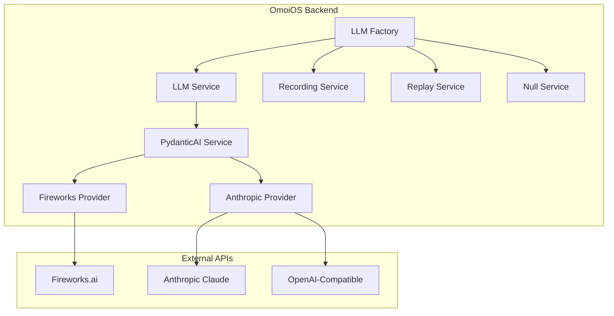
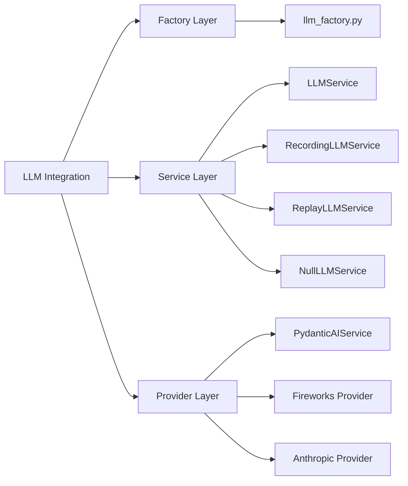
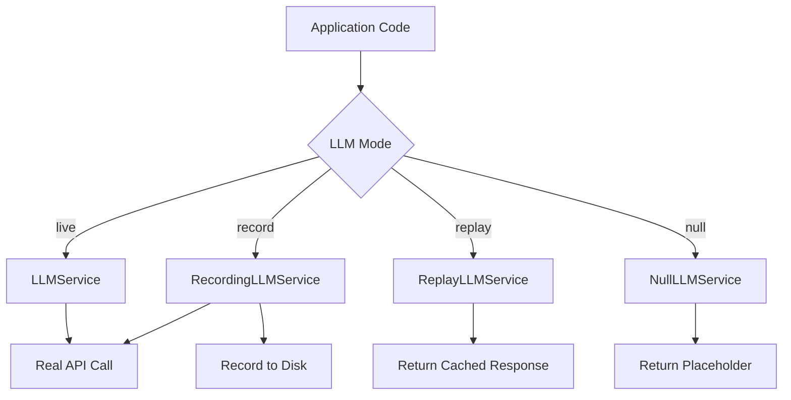
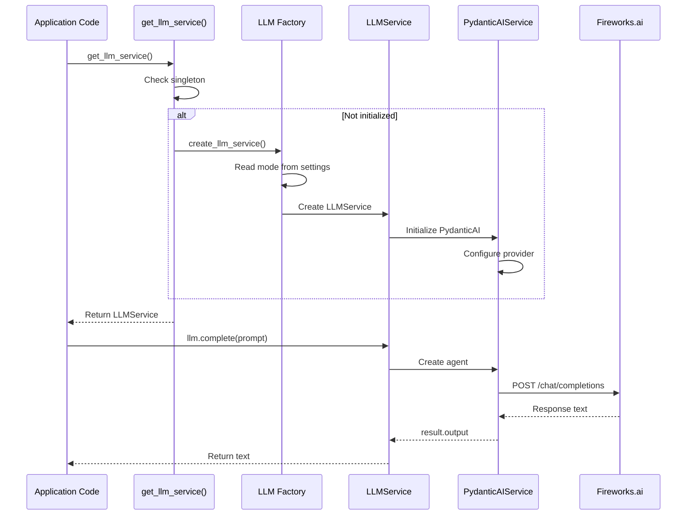
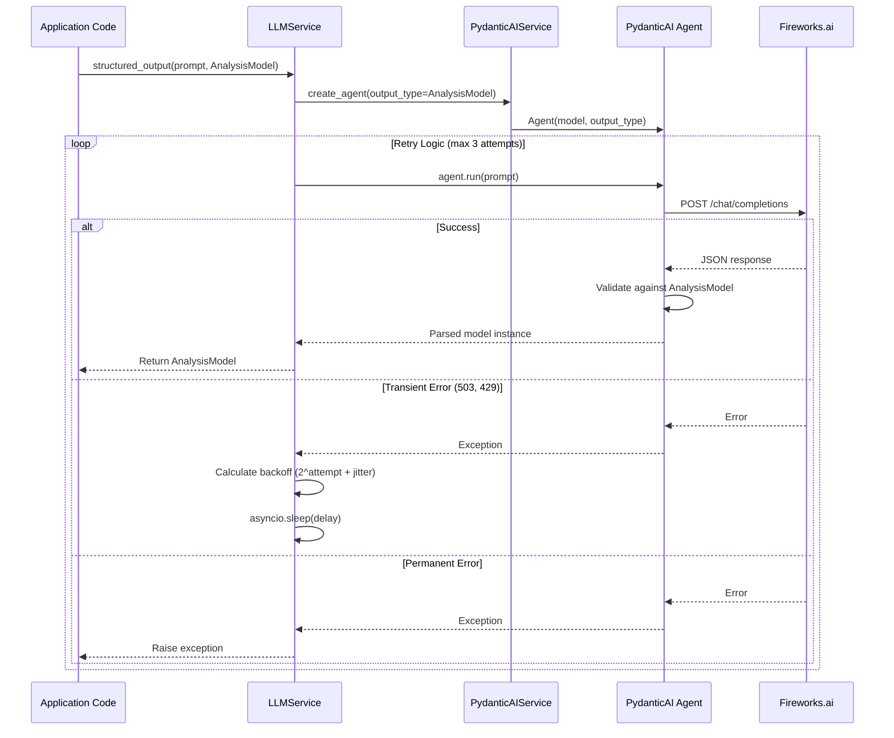
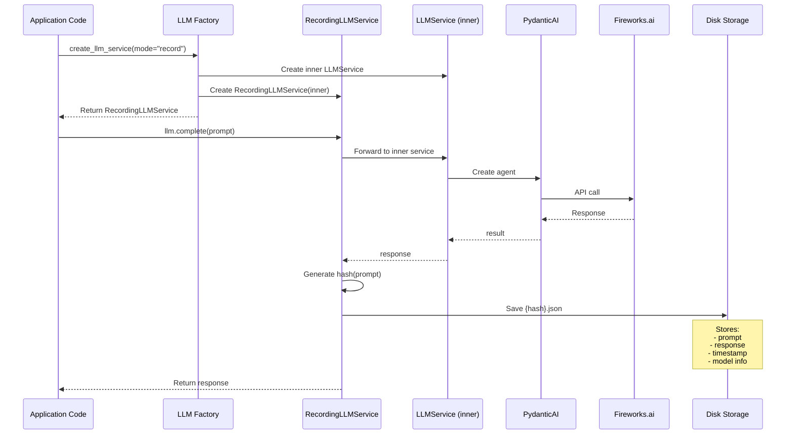

# LLM Provider Integration

**Status**: Implemented  
**Last Updated**: 2026-04-22  
**Related**: [PydanticAI Service](../../backend/omoi_os/services/pydantic_ai_service.py), [Daytona Sandbox](./daytona_sandbox_integration.md)

---

## 1. Overview

The LLM Provider Integration provides a unified, provider-agnostic interface for calling Large Language Models across OmoiOS. It supports multiple execution modes (live, record, replay, null), structured outputs via Pydantic models, automatic retry with exponential backoff, and seamless integration with both Fireworks.ai and Anthropic Claude APIs.

### Key Capabilities

- **Multi-Provider Support**: Fireworks.ai (default), Anthropic Claude, OpenAI-compatible APIs
- **Structured Outputs**: Type-safe LLM responses via Pydantic models
- **Execution Modes**: Live, record, replay, and null modes for testing and development
- **Automatic Retries**: Exponential backoff for transient HTTP errors (429, 503, etc.)
- **Factory Pattern**: Runtime service selection based on configuration
- **Singleton Access**: Global LLM service instance for easy access across codebase

---

## 2. Architecture

### 2.1 System Context



### 2.2 Component Hierarchy



### 2.3 Execution Mode Flow



---

## 3. Component Details

### 3.1 LLM Factory (`llm_factory.py`)

The factory creates the appropriate LLM service based on mode configuration.

```python
def create_llm_service(settings: LLMSettings | None = None):
    """Create the appropriate LLM service based on mode config.
    
    Returns:
        - NullLLMService for "null" mode
        - ReplayLLMService for "replay" mode  
        - RecordingLLMService for "record" mode (wraps live service)
        - LLMService for "live" mode (default)
    """
    settings = settings or get_app_settings().llm
    mode = settings.mode
    
    if mode == "null":
        return NullLLMService()
    elif mode == "replay":
        return ReplayLLMService(
            recording_dir=settings.recording_dir,
            strict=settings.replay_strict
        )
    elif mode == "record":
        inner = LLMService(settings=settings)
        return RecordingLLMService(inner=inner, recording_dir=settings.recording_dir)
    else:
        return LLMService(settings=settings)
```

**Execution Modes:**

| Mode | Purpose | Use Case |
|------|---------|----------|
| `live` | Make real API calls | Production, development |
| `record` | Record responses to disk | Creating test fixtures |
| `replay` | Return cached responses | Testing, CI/CD, offline dev |
| `null` | Return placeholder responses | Testing without API calls |

### 3.2 LLMService

The primary service for LLM text completion and structured outputs.

```python
class LLMService:
    """Simple service for LLM text completion and structured outputs.
    
    Use this for:
    - Memory operations
    - Analysis tasks
    - Classification
    - Any LLM call that doesn't need workspace execution
    """
    
    def __init__(self, settings: Optional[LLMSettings] = None):
        self.settings = settings or load_llm_settings()
        self._pydantic_ai_service: Optional[PydanticAIService] = None
```

**Key Methods:**

| Method | Purpose | Returns |
|--------|---------|---------|
| `complete()` | Simple text completion | `str` |
| `structured_output()` | Type-safe structured output | Pydantic model instance |

**Text Completion:**

```python
async def complete(
    self, 
    prompt: str, 
    system_prompt: Optional[str] = None, 
    **kwargs
) -> str:
    """Simple text completion - just get text back from the LLM."""
    from pydantic_ai import Agent
    from pydantic_ai.models.openai import OpenAIChatModel
    
    model = OpenAIChatModel(
        self._pydantic_ai.model_string,
        provider=self._pydantic_ai.provider,
        settings=self._pydantic_ai.model_settings,
    )
    
    agent_kwargs = {"model": model}
    if system_prompt:
        agent_kwargs["system_prompt"] = system_prompt
    
    agent = Agent(**agent_kwargs)
    result = await agent.run(prompt)
    return result.output
```

**Structured Output:**

```python
async def structured_output(
    self,
    prompt: str,
    output_type: type[T],
    system_prompt: Optional[str] = None,
    output_retries: int = 5,
    http_retries: int = 3,
    **kwargs,
) -> T:
    """Get structured output matching a Pydantic model.
    
    Includes automatic retry with exponential backoff for transient HTTP errors
    (503, 429, etc.) that can occur with LLM providers like Fireworks.
    """
    agent = self._pydantic_ai.create_agent(
        output_type=output_type,
        system_prompt=system_prompt,
        output_retries=output_retries,
    )
    
    last_error = None
    for attempt in range(http_retries + 1):
        try:
            result = await agent.run(prompt)
            return result.output
        except Exception as e:
            error_str = str(e).lower()
            
            # Check if this is a retryable HTTP error
            is_retryable = any(
                indicator in error_str
                for indicator in [
                    "503", "502", "500", "504", "429",
                    "service unavailable", "bad gateway",
                    "gateway timeout", "rate limit", "too many requests"
                ]
            )
            
            if is_retryable and attempt < http_retries:
                # Exponential backoff with jitter: 1s, 2s, 4s + random jitter
                base_delay = 2**attempt
                jitter = random.uniform(0, 0.5 * base_delay)
                delay = base_delay + jitter
                
                logger.warning(
                    f"LLM HTTP error (attempt {attempt + 1}/{http_retries + 1}), "
                    f"retrying in {delay:.1f}s"
                )
                await asyncio.sleep(delay)
                last_error = e
            else:
                raise
```

### 3.3 PydanticAIService

Central service for structured LLM outputs using PydanticAI with Fireworks.ai backend.

```python
class PydanticAIService:
    """Central service for PydanticAI using Fireworks.ai.
    
    Provides a unified interface for creating PydanticAI agents with structured outputs.
    """
    
    def __init__(self, settings: Optional[LLMSettings] = None):
        self.settings = settings or load_llm_settings()
        self.model_string = self._get_fireworks_model()
        
        # Get API key - prefer dedicated Fireworks key, fallback to general LLM key
        api_key = self.settings.fireworks_api_key or self.settings.api_key
        if not api_key:
            raise ValueError("fireworks_api_key or LLM api_key must be set")
        
        # Create Fireworks provider
        self.provider = OpenAIProvider(
            api_key=api_key,
            base_url="https://api.fireworks.ai/inference/v1",
        )
        
        # Model settings with JSON mode enabled
        self.model_settings = OpenAIChatModelSettings()
```

**Model Selection:**

```python
def _get_fireworks_model(self) -> str:
    """Get Fireworks model name from settings.
    
    Defaults to minimax-m2p1 if not specified.
    """
    # If model is already a Fireworks model, use it
    if (
        "fireworks" in self.settings.model.lower()
        or "accounts/fireworks" in self.settings.model
    ):
        return self.settings.model
    
    # Default to minimax-m2p1 (cost-effective)
    return "accounts/fireworks/models/minimax-m2p1"
```

**Agent Creation:**

```python
def create_agent(
    self,
    output_type: type,
    system_prompt: Optional[str] = None,
    output_retries: int = 5,
) -> Agent:
    """Create a PydanticAI agent with structured output."""
    
    # Create model with Fireworks provider
    model = OpenAIChatModel(
        self.model_string,
        provider=self.provider,
        settings=self.model_settings,
    )
    
    agent_kwargs = {
        "model": model,
        "output_type": output_type,
        "output_retries": output_retries,
    }
    if system_prompt:
        agent_kwargs["system_prompt"] = system_prompt
    
    return Agent(**agent_kwargs)
```

### 3.4 Retry Logic

The LLM service implements intelligent retry with exponential backoff:

```python
# HTTP status codes that are retryable (transient errors)
RETRYABLE_STATUS_CODES = {429, 500, 502, 503, 504}

# Retry indicators in error messages
RETRYABLE_INDICATORS = [
    "503", "502", "500", "504", "429",
    "service unavailable", "bad gateway",
    "gateway timeout", "rate limit", "too many requests"
]
```

**Backoff Strategy:**

| Attempt | Base Delay | Jitter Range | Total Delay |
|---------|-----------|--------------|-------------|
| 1 | 1s | 0-0.5s | 1-1.5s |
| 2 | 2s | 0-1s | 2-3s |
| 3 | 4s | 0-2s | 4-6s |

### 3.5 Alternative LLM Services

**NullLLMService** (for testing):

```python
class NullLLMService:
    """LLM service that returns placeholder responses without making API calls.
    
    Useful for:
    - Testing code paths that call LLMs
    - Development without API keys
    - CI/CD pipelines
    """
    
    async def complete(self, prompt: str, **kwargs) -> str:
        return f"[NULL] Response for: {prompt[:50]}..."
    
    async def structured_output(self, prompt: str, output_type: type[T], **kwargs) -> T:
        # Return default instance of the output type
        return output_type()
```

**RecordingLLMService** (for fixtures):

```python
class RecordingLLMService:
    """Wraps a live LLM service and records responses to disk.
    
    Records:
    - Prompts
    - Responses
    - Metadata (timestamp, model, etc.)
    
    Files saved to: `{recording_dir}/{hash(prompt)}.json`
    """
    
    async def complete(self, prompt: str, **kwargs) -> str:
        response = await self.inner.complete(prompt, **kwargs)
        self._record(prompt, response, "complete")
        return response
```

**ReplayLLMService** (for deterministic testing):

```python
class ReplayLLMService:
    """Returns cached responses from disk recordings.
    
    Useful for:
    - Deterministic tests
    - Offline development
    - Reproducing specific LLM responses
    """
    
    async def complete(self, prompt: str, **kwargs) -> str:
        recording = self._load_recording(prompt)
        if recording:
            return recording["response"]
        elif self.strict:
            raise ValueError(f"No recording found for prompt: {prompt[:50]}...")
        else:
            return "[REPLAY MISSING]"
```

---

## 4. Integration Flow

### 4.1 Basic LLM Call Flow



### 4.2 Structured Output Flow



### 4.3 Recording Mode Flow



---

## 5. Data Models

### 5.1 LLMSettings Configuration

```python
class LLMSettings(OmoiBaseSettings):
    """LLM configuration settings."""
    
    yaml_section = "llm"
    model_config = SettingsConfigDict(env_prefix="LLM_")
    
    # Provider settings
    api_key: Optional[str] = None
    fireworks_api_key: Optional[str] = None
    model: str = "accounts/fireworks/models/minimax-m2p1"
    
    # Execution mode
    mode: str = "live"  # live, record, replay, null
    
    # Recording settings
    recording_dir: str = ".llm_recordings"
    replay_strict: bool = False
    
    # Retry settings
    http_retries: int = 3
    output_retries: int = 5
```

### 5.2 Example Structured Output Models

```python
from pydantic import BaseModel, Field

class AnalysisResult(BaseModel):
    """LLM analysis result structure."""
    score: float = Field(..., ge=0.0, le=1.0)
    summary: str
    needs_action: bool = Field(default=False)
    details: dict = Field(default_factory=dict)

class TaskRequirements(BaseModel):
    """LLM-analyzed task requirements."""
    execution_mode: ExecutionMode
    output_type: OutputType
    requires_code_changes: bool
    requires_git_commit: bool
    requires_git_push: bool
    requires_pull_request: bool
    requires_tests: bool
    reasoning: str

class TrajectoryAnalysis(BaseModel):
    """Agent trajectory analysis result."""
    alignment_score: float = Field(..., ge=0.0, le=1.0)
    drift_detected: bool
    issues: list[str]
    recommendations: list[str]
```

---

## 6. Configuration

### 6.1 Environment Variables

| Variable | Required | Default | Description |
|----------|----------|---------|-------------|
| `LLM_API_KEY` | Yes* | - | General LLM API key (Fireworks or OpenAI-compatible) |
| `FIREWORKS_API_KEY` | No | - | Dedicated Fireworks API key (preferred) |
| `ANTHROPIC_API_KEY` | No | - | Anthropic Claude API key |
| `LLM_MODEL` | No | `accounts/fireworks/models/minimax-m2p1` | Model identifier |
| `LLM_MODE` | No | `live` | Execution mode: live, record, replay, null |
| `LLM_RECORDING_DIR` | No | `.llm_recordings` | Directory for recordings |
| `LLM_REPLAY_STRICT` | No | `false` | Fail if recording missing in replay mode |

*Either `LLM_API_KEY` or `FIREWORKS_API_KEY` required for live mode.

### 6.2 YAML Configuration

```yaml
# config/base.yaml
llm:
  api_key: "${LLM_API_KEY}"
  fireworks_api_key: "${FIREWORKS_API_KEY}"
  model: "accounts/fireworks/models/minimax-m2p1"
  mode: "live"  # live, record, replay, null
  
  # Recording settings
  recording_dir: ".llm_recordings"
  replay_strict: false
  
  # Retry configuration
  http_retries: 3
  output_retries: 5

# config/test.yaml (test overrides)
llm:
  mode: "null"  # Use null mode for tests (no API calls)
```

### 6.3 Provider-Specific Configuration

**Fireworks.ai (Default):**

```yaml
llm:
  model: "accounts/fireworks/models/minimax-m2p1"
  fireworks_api_key: "${FIREWORKS_API_KEY}"
```

**Anthropic Claude:**

```yaml
llm:
  model: "claude-3-5-sonnet-20241022"
  anthropic_api_key: "${ANTHROPIC_API_KEY}"
```

---

## 7. Error Handling

### 7.1 Error Types

| Error | Cause | Retry | Handling |
|-------|-------|-------|----------|
| HTTP 429 | Rate limit | Yes (3x) | Exponential backoff |
| HTTP 503 | Service unavailable | Yes (3x) | Exponential backoff |
| HTTP 502/504 | Gateway error | Yes (3x) | Exponential backoff |
| HTTP 401 | Invalid API key | No | Raise immediately |
| HTTP 400 | Bad request | No | Raise immediately |
| Validation Error | Invalid output format | Yes (5x) | PydanticAI handles |
| Timeout | Request timeout | Yes (3x) | Exponential backoff |

### 7.2 Retry Implementation

```python
async def structured_output_with_retry(agent, prompt, max_retries=3):
    last_error = None
    
    for attempt in range(max_retries + 1):
        try:
            result = await agent.run(prompt)
            return result.output
            
        except Exception as e:
            error_str = str(e).lower()
            
            # Check if retryable
            is_retryable = any(
                indicator in error_str
                for indicator in RETRYABLE_INDICATORS
            )
            
            if is_retryable and attempt < max_retries:
                # Exponential backoff with jitter
                base_delay = 2 ** attempt
                jitter = random.uniform(0, 0.5 * base_delay)
                delay = base_delay + jitter
                
                logger.warning(
                    f"Retryable error (attempt {attempt + 1}/{max_retries + 1}), "
                    f"retrying in {delay:.1f}s: {str(e)[:100]}"
                )
                
                await asyncio.sleep(delay)
                last_error = e
            else:
                # Not retryable or exhausted retries
                raise
    
    # Should not reach here
    if last_error:
        raise last_error
```

---

## 8. Usage Examples

### 8.1 Simple Text Completion

```python
from omoi_os.services.llm_service import get_llm_service

llm = get_llm_service()

# Simple completion
result = await llm.complete("What is the capital of France?")
print(result)  # "The capital of France is Paris."

# With system prompt
result = await llm.complete(
    prompt="Analyze this code...",
    system_prompt="You are an expert code reviewer."
)
```

### 8.2 Structured Output

```python
from pydantic import BaseModel, Field
from omoi_os.services.llm_service import get_llm_service

class SentimentAnalysis(BaseModel):
    sentiment: str = Field(..., pattern="^(positive|negative|neutral)$")
    confidence: float = Field(..., ge=0.0, le=1.0)
    key_phrases: list[str]

llm = get_llm_service()

result = await llm.structured_output(
    prompt="Analyze the sentiment: 'I love this product!'",
    output_type=SentimentAnalysis,
    system_prompt="You are a sentiment analysis expert.",
    output_retries=5,
    http_retries=3,
)

print(result.sentiment)  # "positive"
print(result.confidence)  # 0.95
print(result.key_phrases)  # ["love", "product"]
```

### 8.3 Testing with Null Mode

```python
# In test configuration
settings = LLMSettings(mode="null")
llm = create_llm_service(settings)

# Returns placeholder responses
result = await llm.complete("Any prompt")
print(result)  # "[NULL] Response for: Any prompt..."
```

### 8.4 Recording and Replay

```python
# Record mode - save responses to disk
settings = LLMSettings(mode="record", recording_dir="./fixtures")
llm = create_llm_service(settings)

response = await llm.complete("Test prompt")
# Saved to: ./fixtures/{hash}.json

# Replay mode - use recorded responses
settings = LLMSettings(mode="replay", recording_dir="./fixtures")
llm = create_llm_service(settings)

response = await llm.complete("Test prompt")
# Returns recorded response, no API call made
```

---

## 9. Testing

### 9.1 Unit Tests

```python
@pytest.mark.unit
async def test_llm_complete():
    # Use null mode for fast tests
    settings = LLMSettings(mode="null")
    llm = create_llm_service(settings)
    
    result = await llm.complete("Test prompt")
    assert "[NULL]" in result

@pytest.mark.unit
async def test_structured_output():
    from pydantic import BaseModel
    
    class TestModel(BaseModel):
        value: str
    
    settings = LLMSettings(mode="null")
    llm = create_llm_service(settings)
    
    result = await llm.structured_output(
        prompt="Test",
        output_type=TestModel
    )
    assert isinstance(result, TestModel)
```

### 9.2 Integration Tests

```python
@pytest.mark.integration
async def test_live_llm_call():
    # Requires valid API key in environment
    llm = get_llm_service()
    
    result = await llm.complete("Say 'hello'")
    assert "hello" in result.lower()

@pytest.mark.integration
async def test_structured_output_live():
    class Analysis(BaseModel):
        sentiment: str
        confidence: float
    
    llm = get_llm_service()
    
    result = await llm.structured_output(
        prompt="Analyze: 'Great service!'",
        output_type=Analysis
    )
    
    assert result.sentiment in ["positive", "negative", "neutral"]
    assert 0.0 <= result.confidence <= 1.0
```

### 9.3 Recording Fixtures

```python
# Script to generate test fixtures
async def generate_fixtures():
    settings = LLMSettings(
        mode="record",
        recording_dir="./tests/fixtures/llm"
    )
    llm = create_llm_service(settings)
    
    # Make real API calls to record responses
    await llm.complete("Common prompt 1")
    await llm.complete("Common prompt 2")
    
    # Recordings saved to disk for replay mode
```

---

## 10. Related Documentation

- [PydanticAI Service](../../backend/omoi_os/services/pydantic_ai_service.py) - Service implementation
- [LLM Factory](../../backend/omoi_os/services/llm_factory.py) - Factory pattern implementation
- [LLM Service](../../backend/omoi_os/services/llm_service.py) - Main service code
- [Architecture: LLM Service Layer](../../architecture/15-llm-service.md) - System deep-dive
- [PydanticAI Documentation](https://ai.pydantic.dev/) - External library docs

---

## 11. Changelog

| Date | Change | Author |
|------|--------|--------|
| 2026-04-22 | Initial integration design document | System |
| 2026-04-20 | Added replay and null modes for testing | System |
| 2026-04-18 | Implemented exponential backoff retry logic | System |
| 2026-04-15 | Migrated to PydanticAI for structured outputs | System |
| 2026-04-10 | Initial LLM service with Fireworks.ai | System |
