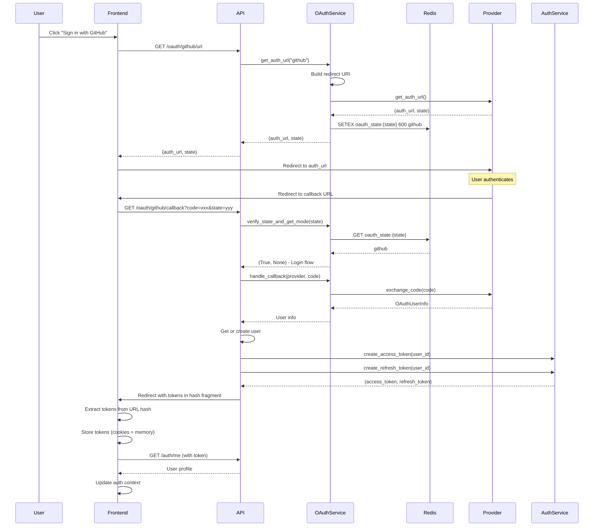
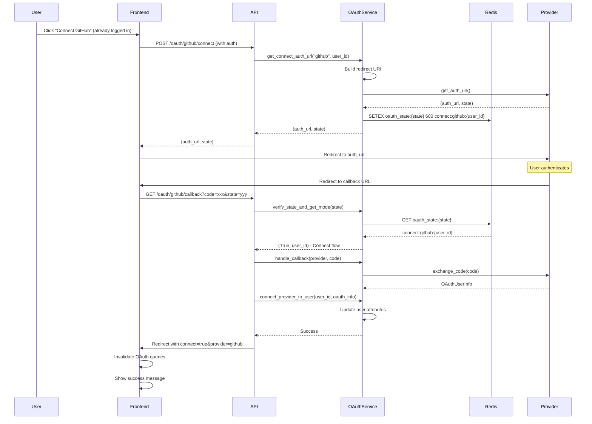

# OAuth Integration Design Document

**Created**: 2025-04-22
**Status**: Draft
**Purpose**: Describes the architecture and implementation details for OAuth2 authentication integration with GitHub, Google, and GitLab providers.
**Related**: ../architecture/07-auth-and-security.md, ./github_provider_integration.md, ../requirements/auth/oauth_requirements.md

---

## Document Overview

This design document specifies the architecture, components, and implementation details for integrating OAuth2 authentication providers (GitHub, Google, GitLab) into the OmoiOS platform. The integration provides secure, stateful authentication flows with PKCE support, token management, and seamless frontend integration.

**Target Audience**: AI spec agents, implementation teams, system architects, frontend developers

**Related Documents**:
- [Auth & Security Architecture](../../architecture/07-auth-and-security.md) - Authentication system overview
- [GitHub Provider Integration](./github_provider_integration.md) - GitHub-specific integration details
- [Frontend Auth Scaffold](../auth/frontend_auth_scaffold.md) - Frontend authentication patterns

---

## Architecture Overview

### High-Level Architecture

```
┌─────────────────────────────────────────────────────────────────────┐
│                    FRONTEND LAYER                                  │
│  ┌──────────────────────────────────────────────────────────────┐  │
│  │              OAuth Callback Handler                           │  │
│  │  ┌──────────────┐  ┌──────────────┐  ┌──────────────┐         │  │
│  │  │   Login      │  │   Connect    │  │   Token      │         │  │
│  │  │   Flow       │  │   Flow       │  │   Storage    │         │  │
│  │  └──────────────┘  └──────────────┘  └──────────────┘         │  │
│  └──────────────────────────────────────────────────────────────┘  │
└─────────────────────────────────────────────────────────────────────┘
                              │
                              ▼
┌─────────────────────────────────────────────────────────────────────┐
│                    API GATEWAY LAYER                               │
│  ┌──────────────────────────────────────────────────────────────┐  │
│  │              OAuth API Routes                                 │  │
│  │  ┌──────────────┐  ┌──────────────┐  ┌──────────────┐         │  │
│  │  │   /url       │  │  /callback   │  │  /connect    │         │  │
│  │  │  (start)     │  │  (complete)  │  │  (link)      │         │  │
│  │  └──────────────┘  └──────────────┘  └──────────────┘         │  │
│  └──────────────────────────────────────────────────────────────┘  │
└─────────────────────────────────────────────────────────────────────┘
                              │
                              ▼
┌─────────────────────────────────────────────────────────────────────┐
│                    SERVICE LAYER                                   │
│  ┌──────────────────────────────────────────────────────────────┐  │
│  │              OAuth Service                                    │  │
│  │  ┌──────────────┐  ┌──────────────┐  ┌──────────────┐         │  │
│  │  │   State      │  │   Provider   │  │   Token      │         │  │
│  │  │   Manager    │  │   Factory    │  │   Manager    │         │  │
│  │  └──────────────┘  └──────────────┘  └──────────────┘         │  │
│  └──────────────────────────────────────────────────────────────┘  │
│  ┌──────────────────────────────────────────────────────────────┐  │
│  │              Auth Service                                   │  │
│  │  ┌──────────────┐  ┌──────────────┐  ┌──────────────┐         │  │
│  │  │   JWT        │  │   Password   │  │   Session    │         │  │
│  │  │   Tokens     │  │   Hashing    │  │   Manager    │         │  │
│  │  └──────────────┘  └──────────────┘  └──────────────┘         │  │
│  └──────────────────────────────────────────────────────────────┘  │
└─────────────────────────────────────────────────────────────────────┘
                              │
                              ▼
┌─────────────────────────────────────────────────────────────────────┐
│                    EXTERNAL PROVIDERS                               │
│  ┌──────────────┐  ┌──────────────┐  ┌──────────────┐            │
│  │   GitHub     │  │   Google     │  │   GitLab     │            │
│  │   OAuth      │  │   OAuth      │  │   OAuth      │            │
│  └──────────────┘  └──────────────┘  └──────────────┘            │
└─────────────────────────────────────────────────────────────────────┘
```

### Component Responsibilities

| Component | Primary Responsibility |
|-----------|----------------------|
| OAuth Service | Central service managing all OAuth flows and state |
| State Manager | Redis-based state storage with TTL for CSRF protection |
| Provider Factory | Dynamic provider instantiation (GitHub, Google, GitLab) |
| Token Manager | OAuth token storage, refresh, and retrieval |
| Auth Service | JWT token generation and password management |
| Callback Handler | Frontend OAuth callback processing and token extraction |

---

## Component Details

### OAuth Service

The OAuth Service orchestrates the complete OAuth flow from authorization URL generation through callback handling.

#### Architecture Pattern: Stateful OAuth with Redis

```python
class OAuthService:
    """Service for OAuth authentication flows."""

    def __init__(self, db: DatabaseService, redis_client: Optional[redis.Redis] = None):
        self.db = db
        self.settings = get_app_settings().auth
        self._redis = redis_client or get_oauth_redis_client()

    def get_auth_url(self, provider_name: str) -> tuple[str, str]:
        """
        Get OAuth authorization URL for a provider.
        
        Flow:
        1. Load provider configuration
        2. Build redirect URI
        3. Generate state parameter
        4. Store state in Redis with TTL
        5. Return authorization URL
        """
        config = self.settings.get_provider_config(provider_name)
        if not config:
            raise ValueError(f"Provider '{provider_name}' not configured")

        redirect_uri = self._build_redirect_uri(provider_name)

        provider = get_provider(
            name=provider_name,
            client_id=config["client_id"],
            client_secret=config["client_secret"],
            redirect_uri=redirect_uri,
        )

        auth_url, state = provider.get_auth_url()

        # Store state in Redis with TTL for verification
        state_key = f"oauth_state:{state}"
        self._redis.setex(state_key, OAUTH_STATE_TTL, provider_name)

        return auth_url, state
```

#### State Management

OAuth state parameters are stored in Redis with a 10-minute TTL to prevent CSRF attacks:

```python
# Redis key prefix and TTL
OAUTH_STATE_PREFIX = "oauth_state:"
OAUTH_STATE_TTL = 600  # 10 minutes

# State storage for login flow
state_key = f"{OAUTH_STATE_PREFIX}{state}"
self._redis.setex(state_key, OAUTH_STATE_TTL, provider_name)

# State storage for connect flow (includes user_id)
state_value = f"connect:{provider_name}:{user_id}"
self._redis.setex(state_key, OAUTH_STATE_TTL, state_value)
```

#### Dual Flow Support

The service supports two distinct OAuth flows:

1. **Login Flow**: Creates new users or authenticates existing ones
2. **Connect Flow**: Links OAuth providers to existing authenticated users

```python
def verify_state_and_get_mode(self, state: str, provider_name: str) -> tuple[bool, Optional[UUID]]:
    """
    Verify OAuth state and determine flow type.
    
    Returns:
        - (True, None) -> Login flow
        - (True, user_id) -> Connect flow
        - (False, None) -> Invalid state
    """
    state_key = f"{OAUTH_STATE_PREFIX}{state}"
    stored_value = self._redis.get(state_key)
    
    if stored_value is None:
        return (False, None)
    
    # Check for connect flow format: "connect:provider:user_id"
    if stored_value.startswith("connect:"):
        parts = stored_value.split(":", 2)
        user_id = UUID(parts[2])
        return (True, user_id)
    
    # Regular login flow
    return (True, None)
```

### Provider Factory

Dynamic provider instantiation based on configuration:

```python
def get_provider(name: str, client_id: str, client_secret: str, redirect_uri: str, **kwargs):
    """Factory function for OAuth providers."""
    providers = {
        "github": GitHubOAuthProvider,
        "google": GoogleOAuthProvider,
        "gitlab": GitLabOAuthProvider,
    }
    
    provider_class = providers.get(name)
    if not provider_class:
        return None
    
    return provider_class(
        client_id=client_id,
        client_secret=client_secret,
        redirect_uri=redirect_uri,
        **kwargs
    )
```

### Auth Service Integration

The Auth Service handles JWT token generation after successful OAuth:

```python
class AuthService:
    """Service for authentication operations."""

    def create_access_token(self, user_id: UUID, expires_delta: Optional[timedelta] = None) -> Tuple[str, str]:
        """Create JWT access token. Returns (token, jti)."""
        expire = utc_now() + timedelta(minutes=self.access_token_expire_minutes)
        
        jti = str(uuid4())
        payload = {
            "sub": str(user_id),
            "exp": expire.timestamp(),
            "iat": utc_now().timestamp(),
            "type": "access",
            "jti": jti,
        }
        
        token = jwt.encode(payload, self.jwt_secret, algorithm=self.jwt_algorithm)
        return token, jti

    def create_refresh_token(self, user_id: UUID, expires_delta: Optional[timedelta] = None) -> Tuple[str, str]:
        """Create JWT refresh token. Returns (token, jti)."""
        expire = utc_now() + timedelta(days=self.refresh_token_expire_days)
        
        jti = str(uuid4())
        payload = {
            "sub": str(user_id),
            "exp": expire.timestamp(),
            "iat": utc_now().timestamp(),
            "type": "refresh",
            "jti": jti,
        }
        
        token = jwt.encode(payload, self.jwt_secret, algorithm=self.jwt_algorithm)
        return token, jti
```

---

## Integration Flow

### OAuth Login Flow



### OAuth Connect Flow



---

## API Surface

### REST API Endpoints

| Method | Path | Purpose | Auth Required |
|--------|------|---------|---------------|
| GET | `/oauth/providers` | List available OAuth providers | No |
| GET | `/oauth/{provider}/url` | Get authorization URL | No |
| GET | `/oauth/{provider}` | Start OAuth flow (redirect) | No |
| GET | `/oauth/{provider}/callback` | Handle OAuth callback | No |
| GET | `/oauth/connected` | List connected providers | Yes |
| POST | `/oauth/{provider}/connect` | Start connect flow | Yes |
| DELETE | `/oauth/{provider}/disconnect` | Disconnect provider | Yes |
| POST | `/oauth/{provider}/copy-from` | Copy credentials (admin) | Yes |
| GET | `/oauth/{provider}/redirect-uri` | Get redirect URI diagnostic | No |

### Request/Response Models

#### Get OAuth URL Response

```json
{
  "auth_url": "https://github.com/login/oauth/authorize?client_id=xxx&redirect_uri=...&state=yyy",
  "state": "random_state_string"
}
```

#### Connected Providers Response

```json
{
  "providers": [
    {
      "provider": "github",
      "username": "johndoe",
      "connected": true
    },
    {
      "provider": "google",
      "username": null,
      "connected": false
    }
  ]
}
```

#### OAuth Callback Redirect

```
# Success (login flow)
/callback#access_token=xxx&refresh_token=yyy&provider=github

# Success (connect flow)
/callback?connect=true&provider=github&connected=true&username=johndoe

# Error
/callback?error=access_denied
```

---

## Data Models

### Database Schema

```sql
-- Users table stores OAuth tokens in attributes JSONB
CREATE TABLE users (
    id UUID PRIMARY KEY DEFAULT gen_random_uuid(),
    email VARCHAR(255) UNIQUE NOT NULL,
    hashed_password VARCHAR(255),  -- NULL for OAuth-only users
    full_name VARCHAR(255),
    avatar_url VARCHAR(500),
    is_active BOOLEAN DEFAULT TRUE,
    is_verified BOOLEAN DEFAULT FALSE,
    attributes JSONB DEFAULT '{}'::jsonb,  -- OAuth tokens stored here
    created_at TIMESTAMP WITH TIME ZONE DEFAULT NOW(),
    updated_at TIMESTAMP WITH TIME ZONE DEFAULT NOW()
);

-- Sessions for token-based auth
CREATE TABLE sessions (
    id UUID PRIMARY KEY DEFAULT gen_random_uuid(),
    user_id UUID NOT NULL REFERENCES users(id),
    token_hash VARCHAR(64) NOT NULL,
    ip_address VARCHAR(45),
    user_agent TEXT,
    expires_at TIMESTAMP WITH TIME ZONE NOT NULL,
    created_at TIMESTAMP WITH TIME ZONE DEFAULT NOW()
);

-- API Keys for programmatic access
CREATE TABLE api_keys (
    id UUID PRIMARY KEY DEFAULT gen_random_uuid(),
    user_id UUID NOT NULL REFERENCES users(id),
    name VARCHAR(255) NOT NULL,
    key_prefix VARCHAR(16) NOT NULL,
    hashed_key VARCHAR(64) NOT NULL,
    scopes JSONB DEFAULT '[]'::jsonb,
    is_active BOOLEAN DEFAULT TRUE,
    expires_at TIMESTAMP WITH TIME ZONE,
    last_used_at TIMESTAMP WITH TIME ZONE,
    created_at TIMESTAMP WITH TIME ZONE DEFAULT NOW()
);

-- Indexes
CREATE INDEX idx_users_email ON users(email);
CREATE INDEX idx_users_attributes ON users USING GIN (attributes);
CREATE INDEX idx_sessions_token_hash ON sessions(token_hash);
CREATE INDEX idx_sessions_user_id ON sessions(user_id);
CREATE INDEX idx_api_keys_user_id ON api_keys(user_id);
CREATE INDEX idx_api_keys_hashed_key ON api_keys(hashed_key);
```

### Pydantic Models

```python
class OAuthUserInfo(BaseModel):
    """OAuth user information from provider."""
    provider: str
    provider_user_id: str
    email: str
    name: Optional[str] = None
    avatar_url: Optional[str] = None
    access_token: str
    refresh_token: Optional[str] = None
    raw_data: Dict[str, Any] = Field(default_factory=dict)

class ProviderInfo(BaseModel):
    """OAuth provider info."""
    name: str
    enabled: bool
    manage_url: Optional[str] = None

class ProvidersResponse(BaseModel):
    """List of OAuth providers."""
    providers: list[ProviderInfo]

class AuthUrlResponse(BaseModel):
    """OAuth authorization URL response."""
    auth_url: str
    state: str

class ConnectedProvider(BaseModel):
    """Connected OAuth provider info."""
    provider: str
    username: Optional[str] = None
    connected: bool = True

class ConnectedProvidersResponse(BaseModel):
    """List of connected OAuth providers."""
    providers: list[ConnectedProvider]

class DisconnectResponse(BaseModel):
    """Response for disconnecting a provider."""
    success: bool
    message: str
```

### TypeScript Types (Frontend)

```typescript
interface ConnectedProvider {
  provider: string;
  username: string | null;
  connected: boolean;
}

interface AuthUrlResponse {
  auth_url: string;
  state: string;
}

interface OAuthCallbackParams {
  access_token?: string;
  refresh_token?: string;
  provider?: string;
  connect?: string;
  connected?: string;
  username?: string;
  error?: string;
}
```

---

## Configuration

### Environment Variables

| Variable | Required | Description |
|----------|----------|-------------|
| `GITHUB_CLIENT_ID` | For GitHub OAuth | GitHub OAuth app client ID |
| `GITHUB_CLIENT_SECRET` | For GitHub OAuth | GitHub OAuth app client secret |
| `GOOGLE_CLIENT_ID` | For Google OAuth | Google OAuth client ID |
| `GOOGLE_CLIENT_SECRET` | For Google OAuth | Google OAuth client secret |
| `GITLAB_CLIENT_ID` | For GitLab OAuth | GitLab OAuth app ID |
| `GITLAB_CLIENT_SECRET` | For GitLab OAuth | GitLab OAuth app secret |
| `OAUTH_REDIRECT_URI` | Yes | Frontend callback URL |
| `OAUTH_BACKEND_URL` | No | Backend URL for callbacks (optional) |
| `REDIS_URL` | Yes | Redis connection for state storage |
| `JWT_SECRET_KEY` | Yes | Secret for JWT signing |

### YAML Configuration

```yaml
# config/base.yaml
auth:
  jwt_algorithm: HS256
  access_token_expire_minutes: 15
  refresh_token_expire_days: 7
  oauth_redirect_uri: "http://localhost:3000/callback"
  oauth_backend_url: null  # Set for production
  
  # Provider configurations (secrets from env vars)
  github:
    client_id: "${GITHUB_CLIENT_ID}"
    client_secret: "${GITHUB_CLIENT_SECRET}"
    scope: "read:user user:email repo"
  
  google:
    client_id: "${GOOGLE_CLIENT_ID}"
    client_secret: "${GOOGLE_CLIENT_SECRET}"
    scope: "openid email profile"
  
  gitlab:
    client_id: "${GITLAB_CLIENT_ID}"
    client_secret: "${GITLAB_CLIENT_SECRET}"
    scope: "read_user"
```

---

## Error Handling

### Error Types

| Error | Status Code | Description | Recovery |
|-------|-------------|-------------|----------|
| `ProviderNotConfigured` | 400 | OAuth provider not configured | Check env vars |
| `InvalidState` | 400 | CSRF state validation failed | Retry OAuth flow |
| `OAuthFailed` | 400 | Code exchange failed | Retry OAuth flow |
| `UserNotFound` | 404 | User not found for connect flow | Verify user exists |
| `CannotDisconnect` | 400 | Cannot remove only auth method | Set password first |
| `RedisError` | 500 | State storage failure | Check Redis connection |

### Frontend Error Handling

```typescript
// Callback page error handling
function CallbackContent() {
  const [status, setStatus] = useState<"loading" | "success" | "error">("loading");
  const [errorMessage, setErrorMessage] = useState<string>("");

  useEffect(() => {
    const handleCallback = async () => {
      // Check for error from OAuth provider
      const error = searchParams.get("error");
      if (error) {
        setStatus("error");
        setErrorMessage(error.replace(/_/g, " "));
        setTimeout(() => router.push(`/login?error=${error}`), 3000);
        return;
      }

      // Check for tokens
      const accessToken = hashParams.get("access_token");
      const refreshToken = hashParams.get("refresh_token");

      if (!accessToken || !refreshToken) {
        setStatus("error");
        setErrorMessage("No authentication tokens received");
        setTimeout(() => router.push("/login?error=no_tokens"), 3000);
        return;
      }

      try {
        // Store tokens and fetch user
        setTokens(accessToken, refreshToken);
        const user = await getCurrentUser();
        login(user);
        setStatus("success");
        setTimeout(() => router.push("/command"), 1500);
      } catch (err) {
        setStatus("error");
        setErrorMessage("Failed to complete authentication");
        clearTokens();
        setTimeout(() => router.push("/login?error=auth_failed"), 3000);
      }
    };

    handleCallback();
  }, [searchParams, router, login]);

  // Render based on status...
}
```

---

## Security Considerations

### CSRF Protection

- State parameter generated cryptographically per flow
- State stored in Redis with 10-minute TTL
- State verified on callback and immediately deleted (one-time use)
- State format differs for login vs connect flows

### Token Security

- Access tokens: 15-minute expiration
- Refresh tokens: 7-day expiration
- Tokens transmitted via URL hash fragment (not query params)
- Hash fragment cleared immediately after extraction
- httpOnly cookies set for additional security
- JWT tokens include unique JTI for revocation support

### OAuth Token Storage

- Provider tokens stored encrypted in user.attributes JSONB
- Access tokens and refresh tokens both stored
- Tokens never exposed in API responses
- Admin-only endpoint for copying credentials between accounts

### Redirect URI Security

- Redirect URI built dynamically from configuration
- Development: Automatically maps port 3000 to 18000
- Production: Uses explicit oauth_backend_url setting
- Diagnostic endpoint available for debugging

### Password Requirements

OAuth users can optionally set passwords for fallback authentication:

```python
def validate_password_strength(self, password: str) -> Tuple[bool, Optional[str]]:
    if len(password) < 8:
        return False, "Password must be at least 8 characters"
    if not any(c.isupper() for c in password):
        return False, "Password must contain at least one uppercase letter"
    if not any(c.islower() for c in password):
        return False, "Password must contain at least one lowercase letter"
    if not any(c.isdigit() for c in password):
        return False, "Password must contain at least one digit"
    if not re.search(r'[!@#$%^&*(),.?":{}|<>'"'"'\[\]\\~`_+\-/=;\']', password):
        return False, "Password must contain at least one special character"
    
    # Reject common passwords
    common = {"password", "12345678", "qwerty123", ...}
    if password.lower() in common:
        return False, "This password is too common"
    
    return True, None
```

---

## Frontend Integration

### React Query Hooks

```typescript
// hooks/useOAuth.ts
export function useConnectedProviders() {
  return useQuery({
    queryKey: ["oauth", "connected"],
    queryFn: async () => {
      const response = await api.get<ConnectedProvidersResponse>("/oauth/connected");
      return response.providers;
    },
  });
}

export function useConnectProvider() {
  const queryClient = useQueryClient();
  
  return useMutation({
    mutationFn: async (provider: string) => {
      const response = await api.post<AuthUrlResponse>(`/oauth/${provider}/connect`);
      return response;
    },
    onSuccess: (data) => {
      // Redirect to provider's auth page
      window.location.href = data.auth_url;
    },
  });
}

export function useDisconnectProvider() {
  const queryClient = useQueryClient();
  
  return useMutation({
    mutationFn: async (provider: string) => {
      return api.delete<DisconnectResponse>(`/oauth/${provider}/disconnect`);
    },
    onSuccess: () => {
      queryClient.invalidateQueries({ queryKey: ["oauth", "connected"] });
    },
  });
}
```

### Callback Page Implementation

```typescript
// app/(auth)/callback/page.tsx
"use client";

import { useEffect, Suspense } from "react";
import { useSearchParams } from "next/navigation";
import { useQueryClient } from "@tanstack/react-query";
import { useAuth } from "@/hooks/useAuth";
import { setTokens } from "@/lib/api/client";

function CallbackContent() {
  const searchParams = useSearchParams();
  const { login } = useAuth();
  const queryClient = useQueryClient();

  // Parse hash fragment params
  function getHashParams(): URLSearchParams {
    if (typeof window === "undefined") return new URLSearchParams();
    return new URLSearchParams(window.location.hash.substring(1));
  }

  useEffect(() => {
    const handleCallback = async () => {
      const hashParams = getHashParams();

      // Clear hash from URL immediately
      if (typeof window !== "undefined" && window.location.hash) {
        window.history.replaceState(
          null,
          "",
          window.location.pathname + window.location.search
        );
      }

      // Check for connect flow
      const isConnect = searchParams.get("connect") === "true";
      const connected = searchParams.get("connected") === "true";

      if (isConnect && connected) {
        // Invalidate queries to refresh connection status
        queryClient.invalidateQueries({ queryKey: ["oauth", "connected"] });
        // Redirect to onboarding
        router.push("/onboarding?step=repo&github_connected=true");
        return;
      }

      // Regular login flow
      const accessToken = hashParams.get("access_token");
      const refreshToken = hashParams.get("refresh_token");

      if (accessToken && refreshToken) {
        setTokens(accessToken, refreshToken);
        const user = await getCurrentUser();
        login(user);
        router.push("/command");
      }
    };

    handleCallback();
  }, [searchParams, router, login, queryClient]);

  return <LoadingState />;
}
```

---

## Related Documentation

- [Auth & Security Architecture](../../architecture/07-auth-and-security.md) - Complete authentication system overview
- [GitHub Provider Integration](./github_provider_integration.md) - GitHub-specific OAuth and API integration
- [Frontend Auth Scaffold](../auth/frontend_auth_scaffold.md) - Frontend authentication implementation
- [API Route Catalog](../../architecture/13-api-route-catalog.md) - Complete API endpoint reference
- [Database Schema](../../architecture/11-database-schema.md) - Full database schema documentation


**Created**: 2025-11-20
**Status**: Draft
**Purpose**: Design specification for OAuth integration.

---

## Overview

This document specifies the design for OAuth integration, including provider configuration, token exchange, and user mapping.

## Related Documents

- [Auth System Plan](../auth/auth_system_plan.md)
- [Auth Service](../services/auth_service.md)
- [OAuth Frontend Integration](../../guides/oauth_frontend_integration.md)

---

*TODO: Expand with full design specification*
