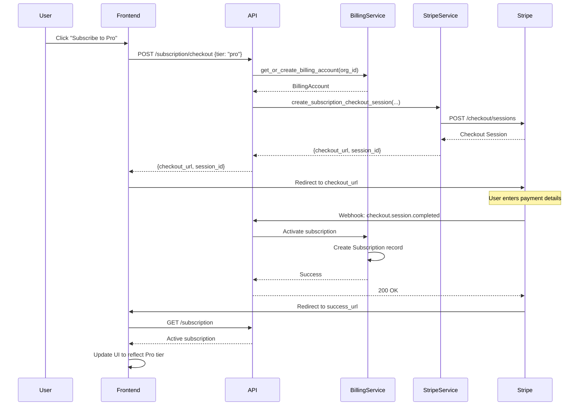
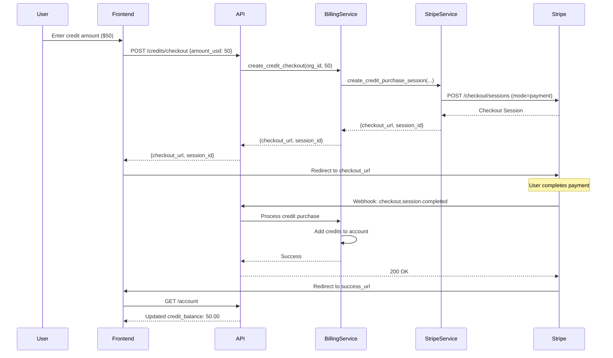
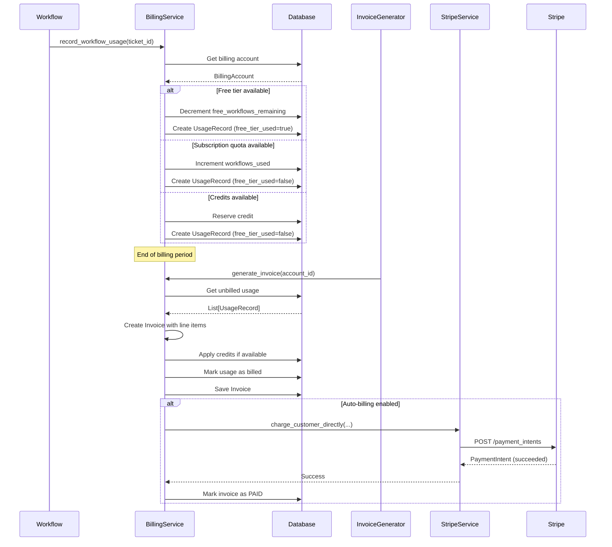

# Stripe Billing Integration Design Document

**Created**: 2025-04-22
**Status**: Draft
**Purpose**: Describes the architecture and implementation details for Stripe-powered billing, subscriptions, and payment processing.
**Related**: ../architecture/08-billing-and-subscriptions.md, ./oauth_integration.md, ../requirements/billing/billing_requirements.md

---

## Document Overview

This design document specifies the architecture, components, and implementation details for integrating Stripe as the payment processor for OmoiOS. The integration supports subscription management (Pro/Team tiers), prepaid credits, lifetime purchases, invoicing, and promo codes.

**Target Audience**: AI spec agents, implementation teams, system architects, frontend developers

**Related Documents**:
- [Billing & Subscriptions Architecture](../../architecture/08-billing-and-subscriptions.md) - Billing system overview
- [OAuth Integration](./oauth_integration.md) - Authentication integration
- **Frontend Billing Components** - UI implementation

---

## Architecture Overview

### High-Level Architecture

```
┌─────────────────────────────────────────────────────────────────────┐
│                    FRONTEND LAYER                                  │
│  ┌──────────────────────────────────────────────────────────────┐  │
│  │              Billing UI Components                            │  │
│  │  ┌──────────────┐  ┌──────────────┐  ┌──────────────┐     │  │
│  │  │   Pricing    │  │   Checkout   │  │   Invoice    │     │  │
│  │  │   Page       │  │   Flow       │  │   Viewer     │     │  │
│  │  └──────────────┘  └──────────────┘  └──────────────┘     │  │
│  └──────────────────────────────────────────────────────────────┘  │
└─────────────────────────────────────────────────────────────────────┘
                              │
                              ▼
┌─────────────────────────────────────────────────────────────────────┐
│                    API GATEWAY LAYER                               │
│  ┌──────────────────────────────────────────────────────────────┐  │
│  │              Billing API Routes                               │  │
│  │  ┌──────────────┐  ┌──────────────┐  ┌──────────────┐     │  │
│  │  │  /account    │  │  /checkout   │  │  /webhooks   │     │  │
│  │  │  /invoices   │  │  /portal     │  │  /promo      │     │  │
│  │  └──────────────┘  └──────────────┘  └──────────────┘     │  │
│  └──────────────────────────────────────────────────────────────┘  │
└─────────────────────────────────────────────────────────────────────┘
                              │
                              ▼
┌─────────────────────────────────────────────────────────────────────┐
│                    SERVICE LAYER                                   │
│  ┌──────────────────────────────────────────────────────────────┐  │
│  │              Billing Service                                  │  │
│  │  ┌──────────────┐  ┌──────────────┐  ┌──────────────┐     │  │
│  │  │   Invoice    │  │   Usage      │  │   Credit     │     │  │
│  │  │   Generator  │  │   Tracker    │  │   Manager    │     │  │
│  │  └──────────────┘  └──────────────┘  └──────────────┘     │  │
│  └──────────────────────────────────────────────────────────────┘  │
│  ┌──────────────────────────────────────────────────────────────┐  │
│  │              Stripe Service                                   │  │
│  │  ┌──────────────┐  ┌──────────────┐  ┌──────────────┐     │  │
│  │  │   Customer   │  │   Checkout   │  │   Webhook    │     │  │
│  │  │   Manager    │  │   Sessions   │  │   Handler    │     │  │
│  │  └──────────────┘  └──────────────┘  └──────────────┘     │  │
│  └──────────────────────────────────────────────────────────────┘  │
│  ┌──────────────────────────────────────────────────────────────┐  │
│  │              Subscription Service                             │  │
│  │  ┌──────────────┐  ┌──────────────┐  ┌──────────────┐     │  │
│  │  │   Tier       │  │   Lifecycle  │  │   Quota      │     │  │
│  │  │   Manager    │  │   Manager    │  │   Enforcer   │     │  │
│  │  └──────────────┘  └──────────────┘  └──────────────┘     │  │
│  └──────────────────────────────────────────────────────────────┘  │
└─────────────────────────────────────────────────────────────────────┘
                              │
                              ▼
┌─────────────────────────────────────────────────────────────────────┐
│                    STRIPE PLATFORM                                  │
│  ┌──────────────┐  ┌──────────────┐  ┌──────────────┐            │
│  │   Customers  │  │   Products   │  │   Invoices   │            │
│  │   Payments   │  │   Prices     │  │   Webhooks   │            │
│  └──────────────┘  └──────────────┘  └──────────────┘            │
└─────────────────────────────────────────────────────────────────────┘
```

### Component Responsibilities

| Component | Primary Responsibility |
|-----------|----------------------|
| Billing Service | Invoice generation, usage tracking, credit management |
| Stripe Service | Stripe API integration, checkout sessions, payment processing |
| Subscription Service | Tier management, lifecycle (create/cancel/renew), quota enforcement |
| Usage Tracker | Records workflow executions, applies free tier, calculates costs |
| Invoice Generator | Creates invoices from usage, applies credits, manages payment |
| Webhook Handler | Processes Stripe webhooks for async events |

---

## Component Details

### Billing Service

The Billing Service orchestrates all billing operations including invoice generation, usage tracking, and credit management.

#### Architecture Pattern: Session-Aware Billing

```python
class BillingService:
    """Service for billing operations and invoice management."""

    def __init__(
        self,
        db: DatabaseService,
        stripe_service: Optional[StripeService] = None,
        event_bus: Optional[EventBusService] = None,
    ):
        self.db = db
        self.stripe = stripe_service or get_stripe_service()
        self.event_bus = event_bus
        self.settings = load_stripe_settings()

    def get_or_create_billing_account(
        self,
        organization_id: UUID,
        session: Optional[Session] = None,
    ) -> BillingAccount:
        """
        Get or create a billing account for an organization.
        
        Flow:
        1. Check for existing billing account
        2. If not found, create Stripe customer
        3. Create billing account with free tier
        4. Return account
        """
        def _get_or_create(sess: Session) -> BillingAccount:
            # Try to get existing account
            result = sess.execute(
                select(BillingAccount).where(
                    BillingAccount.organization_id == organization_id
                )
            )
            account = result.scalar_one_or_none()
            
            if account:
                return account
            
            # Create Stripe customer if configured
            stripe_customer_id = None
            if self.stripe.is_configured:
                customer = self.stripe.create_customer(
                    email=org.billing_email,
                    name=org.name,
                    organization_id=organization_id,
                )
                stripe_customer_id = customer.id
            
            # Create billing account with free tier
            account = BillingAccount(
                id=uuid4(),
                organization_id=organization_id,
                stripe_customer_id=stripe_customer_id,
                status=BillingAccountStatus.PENDING.value,
                free_workflows_remaining=self.settings.free_workflows_per_month,
                free_workflows_reset_at=self._next_month_start(),
            )
            sess.add(account)
            return account
        
        if session:
            return _get_or_create(session)
        else:
            with self.db.get_session() as sess:
                account = _get_or_create(sess)
                sess.commit()
                return account
```

#### Usage Tracking

```python
def record_workflow_usage(
    self,
    organization_id: UUID,
    ticket_id: UUID,
    usage_details: Optional[dict] = None,
    session: Optional[Session] = None,
) -> UsageRecord:
    """
    Record usage for a completed workflow.
    
    Applies free tier if available, otherwise records billable usage.
    """
    def _record(sess: Session) -> UsageRecord:
        # Get or create billing account
        account = self.get_or_create_billing_account(organization_id, sess)
        
        # Check and reset free tier if needed
        self._check_free_tier_reset(account, sess)
        
        # Determine if this uses free tier
        free_tier_used = False
        unit_price = self.settings.workflow_price_usd
        total_price = unit_price
        
        if account.can_use_free_workflow():
            account.use_free_workflow()
            free_tier_used = True
            total_price = 0.0
        
        # Create usage record
        usage_record = UsageRecord(
            id=uuid4(),
            billing_account_id=account.id,
            ticket_id=ticket_id,
            usage_type="workflow_completion",
            quantity=1,
            unit_price=unit_price,
            total_price=total_price,
            free_tier_used=free_tier_used,
            recorded_at=utc_now(),
        )
        sess.add(usage_record)
        
        # Update account statistics
        account.total_workflows_completed += 1
        if not free_tier_used:
            account.total_amount_spent += total_price
        
        return usage_record
    
    if session:
        return _record(session)
    else:
        with self.db.get_session() as sess:
            record = _record(sess)
            sess.commit()
            return record
```

#### Invoice Generation

```python
def generate_invoice(
    self,
    billing_account_id: UUID,
    session: Optional[Session] = None,
) -> Optional[Invoice]:
    """
    Generate an invoice for unbilled usage.
    
    Flow:
    1. Get all unbilled usage records
    2. Create invoice with line items
    3. Apply available credits
    4. Finalize invoice
    5. Mark usage as billed
    """
    def _generate(sess: Session) -> Optional[Invoice]:
        # Get unbilled usage
        usage_records = self.get_unbilled_usage(billing_account_id, sess)
        
        if not usage_records:
            return None
        
        # Get billing account
        account = sess.execute(
            select(BillingAccount).where(BillingAccount.id == billing_account_id)
        ).scalar_one()
        
        # Create invoice
        invoice_number = self._generate_invoice_number()
        invoice = Invoice(
            id=uuid4(),
            invoice_number=invoice_number,
            billing_account_id=billing_account_id,
            status=InvoiceStatus.DRAFT.value,
            currency="usd",
            line_items=[],
            due_date=utc_now() + timedelta(days=7),
        )
        
        # Add line items for usage
        for usage in usage_records:
            invoice.add_line_item(
                description="Workflow Completion",
                unit_price=usage.unit_price,
                quantity=usage.quantity,
                ticket_id=str(usage.ticket_id),
            )
        
        # Apply credits if available
        if account.credit_balance > 0 and invoice.total > 0:
            credits_to_apply = min(account.credit_balance, invoice.total)
            invoice.credits_applied = credits_to_apply
            account.credit_balance -= credits_to_apply
            invoice._recalculate_totals()
        
        # Finalize invoice
        invoice.finalize()
        
        # Mark usage as billed
        for usage in usage_records:
            usage.mark_billed(invoice.id)
        
        sess.add(invoice)
        return invoice
    
    if session:
        return _generate(session)
    else:
        with self.db.get_session() as sess:
            invoice = _generate(sess)
            sess.commit()
            return invoice
```

### Stripe Service

The Stripe Service handles all Stripe API interactions including checkout sessions, payment processing, and webhook handling.

```python
class StripeService:
    """Service for Stripe payment processing."""

    def __init__(self):
        self.settings = load_stripe_settings()
        self.stripe = stripe
        self.stripe.api_key = self.settings.secret_key
        self.is_configured = bool(self.settings.secret_key and self.settings.publishable_key)

    def create_customer(
        self,
        email: str,
        name: str,
        organization_id: UUID,
    ) -> stripe.Customer:
        """Create a Stripe customer for an organization."""
        return self.stripe.Customer.create(
            email=email,
            name=name,
            metadata={
                "organization_id": str(organization_id),
            },
        )

    def create_subscription_checkout_session(
        self,
        customer_id: str,
        price_id: str,
        success_url: str,
        cancel_url: str,
        metadata: dict,
        idempotency_key: Optional[str] = None,
    ) -> stripe.checkout.Session:
        """Create a checkout session for subscription purchase."""
        params = {
            "mode": "subscription",
            "customer": customer_id,
            "line_items": [{"price": price_id, "quantity": 1}],
            "success_url": success_url,
            "cancel_url": cancel_url,
            "metadata": metadata,
        }
        
        if idempotency_key:
            params["idempotency_key"] = idempotency_key
        
        return self.stripe.checkout.Session.create(**params)

    def create_credit_purchase_session(
        self,
        customer_id: str,
        credit_amount_usd: float,
        success_url: str,
        cancel_url: str,
        organization_id: UUID,
    ) -> stripe.checkout.Session:
        """Create a checkout session for credit purchase."""
        return self.stripe.checkout.Session.create(
            mode="payment",
            customer=customer_id,
            line_items=[{
                "price_data": {
                    "currency": "usd",
                    "unit_amount": int(credit_amount_usd * 100),
                    "product_data": {
                        "name": f"OmoiOS Credits (${credit_amount_usd:.2f})",
                        "description": "Prepaid credits for workflow execution",
                    },
                },
                "quantity": 1,
            }],
            success_url=success_url,
            cancel_url=cancel_url,
            metadata={
                "credit_purchase": "true",
                "organization_id": str(organization_id),
                "credit_amount": str(credit_amount_usd),
            },
        )

    def charge_customer_directly(
        self,
        customer_id: str,
        amount_cents: int,
        description: str,
        payment_method_id: str,
        metadata: dict,
    ) -> stripe.PaymentIntent:
        """Create and confirm a payment intent for direct charging."""
        return self.stripe.PaymentIntent.create(
            amount=amount_cents,
            currency="usd",
            customer=customer_id,
            payment_method=payment_method_id,
            description=description,
            metadata=metadata,
            confirm=True,
            off_session=True,
        )
```

### Subscription Service

The Subscription Service manages subscription tiers, lifecycle, and quota enforcement.

```python
class SubscriptionService:
    """Service for subscription management."""

    def create_subscription(
        self,
        organization_id: UUID,
        billing_account_id: UUID,
        tier: SubscriptionTier,
        session: Optional[Session] = None,
    ) -> Subscription:
        """Create a new subscription for an organization."""
        def _create(sess: Session) -> Subscription:
            # Get tier limits
            limits = TIER_LIMITS.get(tier, TIER_LIMITS[SubscriptionTier.FREE])
            
            subscription = Subscription(
                id=uuid4(),
                organization_id=organization_id,
                billing_account_id=billing_account_id,
                tier=tier.value,
                status=SubscriptionStatus.ACTIVE.value,
                workflows_limit=limits["workflows_limit"],
                workflows_used=0,
                agents_limit=limits["agents_limit"],
                storage_limit_gb=limits["storage_limit_gb"],
            )
            sess.add(subscription)
            return subscription
        
        if session:
            return _create(session)
        else:
            with self.db.get_session() as sess:
                subscription = _create(sess)
                sess.commit()
                return subscription

    def cancel_subscription(
        self,
        subscription_id: UUID,
        at_period_end: bool = True,
    ) -> None:
        """Cancel a subscription."""
        subscription = self.get_subscription_by_id(subscription_id)
        
        if at_period_end:
            subscription.cancel_at_period_end = True
        else:
            subscription.status = SubscriptionStatus.CANCELED.value
            subscription.canceled_at = utc_now()

    def reactivate_subscription(self, subscription_id: UUID) -> None:
        """Reactivate a canceled subscription before period end."""
        subscription = self.get_subscription_by_id(subscription_id)
        
        if subscription.cancel_at_period_end:
            subscription.cancel_at_period_end = False
```

---

## Integration Flow

### Subscription Checkout Flow



### Credit Purchase Flow



### Usage Tracking & Invoice Flow



---

## API Surface

### REST API Endpoints

| Method | Path | Purpose | Auth Required |
|--------|------|---------|---------------|
| GET | `/billing/config` | Get Stripe publishable key | No |
| GET | `/billing/account/{org_id}` | Get billing account | Yes |
| POST | `/billing/account/{org_id}/payment-method` | Attach payment method | Yes |
| GET | `/billing/account/{org_id}/payment-methods` | List payment methods | Yes |
| DELETE | `/billing/account/{org_id}/payment-methods/{id}` | Remove payment method | Yes |
| POST | `/billing/account/{org_id}/credits/checkout` | Purchase credits | Yes |
| POST | `/billing/account/{org_id}/subscription/checkout` | Subscribe to tier | Yes |
| POST | `/billing/account/{org_id}/lifetime/checkout` | Purchase lifetime | Yes |
| GET | `/billing/account/{org_id}/subscription` | Get subscription | Yes |
| POST | `/billing/account/{org_id}/subscription/cancel` | Cancel subscription | Yes |
| POST | `/billing/account/{org_id}/subscription/reactivate` | Reactivate subscription | Yes |
| POST | `/billing/account/{org_id}/portal` | Create customer portal | Yes |
| GET | `/billing/account/{org_id}/invoices` | List invoices | Yes |
| GET | `/billing/account/{org_id}/stripe-invoices` | List Stripe invoices | Yes |
| GET | `/billing/invoices/{invoice_id}` | Get invoice | Yes |
| POST | `/billing/invoices/{invoice_id}/pay` | Pay invoice | Yes |
| POST | `/billing/account/{org_id}/invoices/generate` | Generate invoice | Yes |
| GET | `/billing/account/{org_id}/usage` | Get usage records | Yes |
| GET | `/billing/account/{org_id}/usage-summary` | Get usage summary | Yes |
| POST | `/billing/account/{org_id}/check-execution` | Check execution allowed | Yes |
| POST | `/billing/promo-codes/validate` | Validate promo code | Yes |
| POST | `/billing/account/{org_id}/promo-codes/redeem` | Redeem promo code | Yes |
| POST | `/billing/webhooks/stripe` | Stripe webhook handler | No (signed) |

### Request/Response Models

#### Credit Purchase Request

```json
{
  "amount_usd": 50.00,
  "success_url": "https://omoios.dev/billing/success",
  "cancel_url": "https://omoios.dev/billing/cancel"
}
```

#### Checkout Response

```json
{
  "checkout_url": "https://checkout.stripe.com/pay/cs_test_...",
  "session_id": "cs_test_..."
}
```

#### Billing Account Response

```json
{
  "id": "550e8400-e29b-41d4-a716-446655440000",
  "organization_id": "550e8400-e29b-41d4-a716-446655440001",
  "stripe_customer_id": "cus_1234567890",
  "has_payment_method": true,
  "status": "active",
  "free_workflows_remaining": 3,
  "free_workflows_reset_at": "2025-05-01T00:00:00Z",
  "credit_balance": 25.50,
  "auto_billing_enabled": true,
  "billing_email": "billing@example.com",
  "tax_exempt": false,
  "total_workflows_completed": 47,
  "total_amount_spent": 123.45
}
```

#### Subscription Response

```json
{
  "id": "550e8400-e29b-41d4-a716-446655440000",
  "organization_id": "550e8400-e29b-41d4-a716-446655440001",
  "billing_account_id": "550e8400-e29b-41d4-a716-446655440002",
  "tier": "pro",
  "status": "active",
  "current_period_start": "2025-04-01T00:00:00Z",
  "current_period_end": "2025-05-01T00:00:00Z",
  "cancel_at_period_end": false,
  "workflows_limit": 500,
  "workflows_used": 47,
  "workflows_remaining": 453,
  "agents_limit": 5,
  "storage_limit_gb": 50,
  "storage_used_gb": 12.5,
  "is_lifetime": false,
  "is_byo": true
}
```

---

## Data Models

### Database Schema

```sql
-- Billing Accounts
CREATE TABLE billing_accounts (
    id UUID PRIMARY KEY DEFAULT gen_random_uuid(),
    organization_id UUID NOT NULL REFERENCES organizations(id),
    stripe_customer_id VARCHAR(255),
    status VARCHAR(20) DEFAULT 'pending',
    free_workflows_remaining INTEGER DEFAULT 5,
    free_workflows_reset_at TIMESTAMP WITH TIME ZONE,
    credit_balance DECIMAL(10, 2) DEFAULT 0.00,
    auto_billing_enabled BOOLEAN DEFAULT FALSE,
    billing_email VARCHAR(255),
    tax_exempt BOOLEAN DEFAULT FALSE,
    total_workflows_completed INTEGER DEFAULT 0,
    total_amount_spent DECIMAL(10, 2) DEFAULT 0.00,
    created_at TIMESTAMP WITH TIME ZONE DEFAULT NOW(),
    updated_at TIMESTAMP WITH TIME ZONE DEFAULT NOW()
);

-- Subscriptions
CREATE TABLE subscriptions (
    id UUID PRIMARY KEY DEFAULT gen_random_uuid(),
    organization_id UUID NOT NULL REFERENCES organizations(id),
    billing_account_id UUID NOT NULL REFERENCES billing_accounts(id),
    tier VARCHAR(20) NOT NULL,
    status VARCHAR(20) DEFAULT 'active',
    current_period_start TIMESTAMP WITH TIME ZONE,
    current_period_end TIMESTAMP WITH TIME ZONE,
    cancel_at_period_end BOOLEAN DEFAULT FALSE,
    canceled_at TIMESTAMP WITH TIME ZONE,
    trial_start TIMESTAMP WITH TIME ZONE,
    trial_end TIMESTAMP WITH TIME ZONE,
    workflows_limit INTEGER DEFAULT 0,
    workflows_used INTEGER DEFAULT 0,
    agents_limit INTEGER DEFAULT 0,
    storage_limit_gb INTEGER DEFAULT 0,
    storage_used_gb DECIMAL(10, 2) DEFAULT 0.00,
    is_lifetime BOOLEAN DEFAULT FALSE,
    lifetime_purchase_date TIMESTAMP WITH TIME ZONE,
    lifetime_purchase_amount DECIMAL(10, 2),
    is_byo BOOLEAN DEFAULT FALSE,
    byo_providers_configured JSONB DEFAULT '[]'::jsonb,
    created_at TIMESTAMP WITH TIME ZONE DEFAULT NOW(),
    updated_at TIMESTAMP WITH TIME ZONE DEFAULT NOW()
);

-- Usage Records
CREATE TABLE usage_records (
    id UUID PRIMARY KEY DEFAULT gen_random_uuid(),
    billing_account_id UUID NOT NULL REFERENCES billing_accounts(id),
    ticket_id UUID REFERENCES tickets(id),
    usage_type VARCHAR(50) NOT NULL,
    quantity INTEGER DEFAULT 1,
    unit_price DECIMAL(10, 4) NOT NULL,
    total_price DECIMAL(10, 2) NOT NULL,
    free_tier_used BOOLEAN DEFAULT FALSE,
    invoice_id UUID REFERENCES invoices(id),
    billed BOOLEAN DEFAULT FALSE,
    usage_details JSONB DEFAULT '{}'::jsonb,
    recorded_at TIMESTAMP WITH TIME ZONE DEFAULT NOW(),
    billed_at TIMESTAMP WITH TIME ZONE
);

-- Invoices
CREATE TABLE invoices (
    id UUID PRIMARY KEY DEFAULT gen_random_uuid(),
    invoice_number VARCHAR(50) UNIQUE NOT NULL,
    billing_account_id UUID NOT NULL REFERENCES billing_accounts(id),
    ticket_id UUID REFERENCES tickets(id),
    stripe_invoice_id VARCHAR(255),
    status VARCHAR(20) DEFAULT 'draft',
    period_start TIMESTAMP WITH TIME ZONE,
    period_end TIMESTAMP WITH TIME ZONE,
    subtotal DECIMAL(10, 2) NOT NULL,
    tax_amount DECIMAL(10, 2) DEFAULT 0.00,
    discount_amount DECIMAL(10, 2) DEFAULT 0.00,
    total DECIMAL(10, 2) NOT NULL,
    credits_applied DECIMAL(10, 2) DEFAULT 0.00,
    amount_due DECIMAL(10, 2) NOT NULL,
    amount_paid DECIMAL(10, 2) DEFAULT 0.00,
    currency VARCHAR(3) DEFAULT 'usd',
    line_items JSONB DEFAULT '[]'::jsonb,
    description TEXT,
    due_date TIMESTAMP WITH TIME ZONE,
    finalized_at TIMESTAMP WITH TIME ZONE,
    paid_at TIMESTAMP WITH TIME ZONE,
    created_at TIMESTAMP WITH TIME ZONE DEFAULT NOW()
);

-- Payments
CREATE TABLE payments (
    id UUID PRIMARY KEY DEFAULT gen_random_uuid(),
    billing_account_id UUID NOT NULL REFERENCES billing_accounts(id),
    invoice_id UUID REFERENCES invoices(id),
    stripe_payment_intent_id VARCHAR(255),
    stripe_charge_id VARCHAR(255),
    amount DECIMAL(10, 2) NOT NULL,
    currency VARCHAR(3) DEFAULT 'usd',
    status VARCHAR(20) DEFAULT 'pending',
    payment_method_type VARCHAR(50),
    payment_method_last4 VARCHAR(4),
    payment_method_brand VARCHAR(50),
    failure_code VARCHAR(50),
    failure_message TEXT,
    refunded_amount DECIMAL(10, 2) DEFAULT 0.00,
    description TEXT,
    created_at TIMESTAMP WITH TIME ZONE DEFAULT NOW(),
    succeeded_at TIMESTAMP WITH TIME ZONE
);

-- Promo Codes
CREATE TABLE promo_codes (
    id UUID PRIMARY KEY DEFAULT gen_random_uuid(),
    code VARCHAR(50) UNIQUE NOT NULL,
    description TEXT,
    discount_type VARCHAR(20) NOT NULL,
    discount_value INTEGER DEFAULT 0,
    trial_days INTEGER,
    max_uses INTEGER,
    current_uses INTEGER DEFAULT 0,
    valid_from TIMESTAMP WITH TIME ZONE DEFAULT NOW(),
    valid_until TIMESTAMP WITH TIME ZONE,
    applicable_tiers JSONB DEFAULT '[]'::jsonb,
    grant_tier VARCHAR(20),
    grant_duration_months INTEGER,
    is_active BOOLEAN DEFAULT TRUE,
    created_at TIMESTAMP WITH TIME ZONE DEFAULT NOW()
);

-- Promo Code Redemptions
CREATE TABLE promo_code_redemptions (
    id UUID PRIMARY KEY DEFAULT gen_random_uuid(),
    promo_code_id UUID NOT NULL REFERENCES promo_codes(id),
    user_id UUID REFERENCES users(id),
    organization_id UUID NOT NULL REFERENCES organizations(id),
    discount_type_applied VARCHAR(20) NOT NULL,
    discount_value_applied INTEGER DEFAULT 0,
    tier_granted VARCHAR(20),
    duration_months_granted INTEGER,
    redeemed_at TIMESTAMP WITH TIME ZONE DEFAULT NOW()
);

-- Indexes
CREATE INDEX idx_billing_accounts_org ON billing_accounts(organization_id);
CREATE INDEX idx_subscriptions_org ON subscriptions(organization_id);
CREATE INDEX idx_subscriptions_status ON subscriptions(status);
CREATE INDEX idx_usage_records_account ON usage_records(billing_account_id);
CREATE INDEX idx_usage_records_billed ON usage_records(billed) WHERE billed = FALSE;
CREATE INDEX idx_invoices_account ON invoices(billing_account_id);
CREATE INDEX idx_invoices_status ON invoices(status);
CREATE INDEX idx_payments_account ON payments(billing_account_id);
CREATE INDEX idx_promo_codes_code ON promo_codes(code);
```

### Pydantic Models

```python
class BillingAccountResponse(BaseModel):
    """Response model for billing account."""
    id: str
    organization_id: str
    stripe_customer_id: Optional[str]
    has_payment_method: bool
    status: str
    free_workflows_remaining: int
    free_workflows_reset_at: Optional[datetime]
    credit_balance: float
    auto_billing_enabled: bool
    billing_email: Optional[str]
    tax_exempt: bool
    total_workflows_completed: int
    total_amount_spent: float

class SubscriptionResponse(BaseModel):
    """Response model for subscription."""
    id: str
    organization_id: str
    billing_account_id: str
    tier: str
    status: str
    current_period_start: Optional[datetime]
    current_period_end: Optional[datetime]
    cancel_at_period_end: bool
    workflows_limit: int
    workflows_used: int
    workflows_remaining: int
    agents_limit: int
    storage_limit_gb: int
    storage_used_gb: float
    is_lifetime: bool
    is_byo: bool

class InvoiceResponse(BaseModel):
    """Response model for invoice."""
    id: str
    invoice_number: str
    billing_account_id: str
    status: str
    subtotal: float
    tax_amount: float
    discount_amount: float
    total: float
    credits_applied: float
    amount_due: float
    amount_paid: float
    currency: str
    line_items: list[dict]
    due_date: Optional[datetime]
    paid_at: Optional[datetime]

class UsageRecordResponse(BaseModel):
    """Response model for usage record."""
    id: str
    billing_account_id: str
    ticket_id: Optional[str]
    usage_type: str
    quantity: int
    unit_price: float
    total_price: float
    free_tier_used: bool
    recorded_at: Optional[datetime]
```

---

## Configuration

### Environment Variables

| Variable | Required | Description |
|----------|----------|-------------|
| `STRIPE_SECRET_KEY` | Yes | Stripe secret key (sk_live_... or sk_test_...) |
| `STRIPE_PUBLISHABLE_KEY` | Yes | Stripe publishable key (pk_live_... or pk_test_...) |
| `STRIPE_WEBHOOK_SECRET` | Yes | Webhook endpoint secret (whsec_...) |
| `STRIPE_PRO_PRICE_ID` | No | Stripe Price ID for Pro tier |
| `STRIPE_TEAM_PRICE_ID` | No | Stripe Price ID for Team tier |
| `FRONTEND_URL` | Yes | Frontend URL for checkout redirects |
| `WORKFLOW_PRICE_USD` | No | Price per workflow ($0.10 default) |
| `FREE_WORKFLOWS_PER_MONTH` | No | Free tier allowance (5 default) |

### YAML Configuration

```yaml
# config/base.yaml
billing:
  workflow_price_usd: 0.10
  free_workflows_per_month: 5
  auto_billing_enabled: true
  invoice_due_days: 7
  
  # Tier pricing (fallback if Stripe Price IDs not set)
  tiers:
    free:
      workflows_limit: 5
      agents_limit: 1
      storage_limit_gb: 1
    pro:
      workflows_limit: 500
      agents_limit: 5
      storage_limit_gb: 50
      price_usd: 50.00
    team:
      workflows_limit: 2000
      agents_limit: 10
      storage_limit_gb: 200
      price_usd: 150.00
    lifetime:
      price_usd: 499.00

stripe:
  secret_key: "${STRIPE_SECRET_KEY}"
  publishable_key: "${STRIPE_PUBLISHABLE_KEY}"
  webhook_secret: "${STRIPE_WEBHOOK_SECRET}"
  pro_price_id: "${STRIPE_PRO_PRICE_ID}"
  team_price_id: "${STRIPE_TEAM_PRICE_ID}"
  frontend_url: "${FRONTEND_URL}"
```

---

## Error Handling

### Error Types

| Error | Status Code | Description | Recovery |
|-------|-------------|-------------|----------|
| `BillingAccountNotFound` | 404 | Billing account doesn't exist | Create account first |
| `NoPaymentMethod` | 400 | No payment method on file | Add payment method |
| `PaymentFailed` | 402 | Card declined or payment error | Try different payment method |
| `InsufficientCredits` | 400 | Not enough credits for workflow | Purchase more credits |
| `SubscriptionLimitReached` | 400 | Monthly workflow quota exceeded | Upgrade tier or use credits |
| `InvalidPromoCode` | 400 | Promo code invalid or expired | Try different code |
| `StripeError` | 500 | Stripe API error | Retry or contact support |

### Webhook Error Handling

```python
@router.post("/webhooks/stripe")
async def stripe_webhook(request: Request):
    """Handle Stripe webhooks."""
    payload = await request.body()
    sig_header = request.headers.get("stripe-signature")
    
    try:
        event = stripe.Webhook.construct_event(
            payload, sig_header, webhook_secret
        )
    except ValueError:
        raise HTTPException(status_code=400, detail="Invalid payload")
    except stripe.error.SignatureVerificationError:
        raise HTTPException(status_code=400, detail="Invalid signature")
    
    # Process event
    if event["type"] == "checkout.session.completed":
        await handle_checkout_completed(event["data"]["object"])
    elif event["type"] == "invoice.paid":
        await handle_invoice_paid(event["data"]["object"])
    elif event["type"] == "invoice.payment_failed":
        await handle_payment_failed(event["data"]["object"])
    
    return {"status": "success"}
```

---

## Security Considerations

### Webhook Security

- All webhooks verified using Stripe signature
- Webhook secrets rotated regularly
- Idempotency keys used for checkout sessions
- Duplicate webhook events detected and ignored

### Payment Data

- No card data stored locally (PCI compliance via Stripe)
- Only Stripe customer IDs and payment method IDs stored
- Payment method details fetched on-demand from Stripe
- All sensitive operations use Stripe Elements or Checkout

### Access Control

- Billing endpoints require authentication
- Users can only access their organization's billing data
- Admin endpoints require super_admin role
- Promo code creation/revocation admin-only

### Audit Trail

- All billing events logged with user ID and timestamp
- Invoice changes tracked
- Payment attempts logged (success and failure)
- Usage records immutable once created

---

## Frontend Integration

### React Query Hooks

```typescript
// hooks/useBilling.ts
export function useBillingAccount(orgId: string | undefined) {
  return useQuery<BillingAccount>({
    queryKey: billingKeys.account(orgId!),
    queryFn: () => getBillingAccount(orgId!),
    enabled: isValidUUID(orgId),
  });
}

export function useCreateCreditCheckout() {
  return useMutation<
    CheckoutResponse,
    Error,
    { orgId: string; data: CreditPurchaseRequest }
  >({
    mutationFn: ({ orgId, data }) => createCreditCheckout(orgId, data),
    onSuccess: (response) => {
      // Redirect to Stripe Checkout
      window.location.href = response.checkout_url;
    },
  });
}

export function useSubscription(orgId: string | undefined) {
  return useQuery<Subscription | null>({
    queryKey: billingKeys.subscription(orgId!),
    queryFn: () => getSubscription(orgId!),
    enabled: isValidUUID(orgId),
    staleTime: 5 * 60 * 1000, // 5 minutes
  });
}

export function useCancelSubscription() {
  const queryClient = useQueryClient();
  
  return useMutation({
    mutationFn: ({ orgId, atPeriodEnd }: { orgId: string; atPeriodEnd?: boolean }) =>
      cancelSubscription(orgId, atPeriodEnd),
    onSuccess: (_, { orgId }) => {
      queryClient.invalidateQueries({ queryKey: billingKeys.subscription(orgId) });
    },
  });
}
```

### Stripe.js Integration

```typescript
// components/billing/PaymentMethodForm.tsx
"use client";

import { loadStripe } from "@stripe/stripe-js";
import {
  Elements,
  CardElement,
  useStripe,
  useElements,
} from "@stripe/react-stripe-js";
import { useAttachPaymentMethod } from "@/hooks/useBilling";

const stripePromise = loadStripe(process.env.NEXT_PUBLIC_STRIPE_PUBLISHABLE_KEY!);

function PaymentForm({ orgId }: { orgId: string }) {
  const stripe = useStripe();
  const elements = useElements();
  const attachPaymentMethod = useAttachPaymentMethod();

  const handleSubmit = async (e: React.FormEvent) => {
    e.preventDefault();
    
    if (!stripe || !elements) return;
    
    // Create payment method with Stripe.js
    const { error, paymentMethod } = await stripe.createPaymentMethod({
      type: "card",
      card: elements.getElement(CardElement)!,
    });
    
    if (error) {
      console.error(error);
      return;
    }
    
    // Attach to billing account
    await attachPaymentMethod.mutateAsync({
      orgId,
      data: { payment_method_id: paymentMethod.id, set_as_default: true },
    });
  };

  return (
    <form onSubmit={handleSubmit}>
      <CardElement />
      <button type="submit" disabled={!stripe}>
        Add Payment Method
      </button>
    </form>
  );
}

export function PaymentMethodForm({ orgId }: { orgId: string }) {
  return (
    <Elements stripe={stripePromise}>
      <PaymentForm orgId={orgId} />
    </Elements>
  );
}
```

---

## Related Documentation

- [Billing & Subscriptions Architecture](../../architecture/08-billing-and-subscriptions.md) - Complete billing system overview
- [Pricing Strategy](../billing/pricing_strategy.md) - Tier definitions and pricing
- **Stripe Webhook Handling** - Webhook implementation details
- **Frontend Billing Components** - UI component documentation
