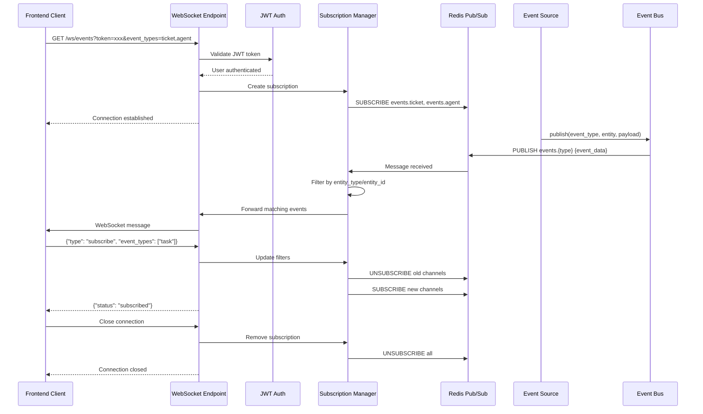

# WebSocket Events Integration

**Status:** Production  
**Last Updated:** 2026-04-22  
**Related:** [Real-Time Events Architecture](../../architecture/06-realtime-events.md), [Event Bus Service](../services/event_bus.md)

---

## 1. Overview

The WebSocket Events integration provides real-time bidirectional communication between the OmoiOS backend and frontend clients. It enables live updates for agent execution progress, ticket state changes, system notifications, and collaborative features. The system uses Redis pub/sub as the message broker with WebSocket connections for client delivery, supporting filtered subscriptions and automatic reconnection.

### Key Capabilities

- **Real-time event streaming** — Live updates for tickets, agents, tasks, and system events
- **Filtered subscriptions** — Subscribe to specific event types, entity types, or entity IDs
- **Bidirectional communication** — Client can send filter updates and heartbeat pings
- **Automatic reconnection** — Exponential backoff with max retry limits
- **Event replay for development** — Record and replay event streams for debugging
- **Graceful degradation** — Falls back to polling when WebSocket unavailable

---

## 2. Architecture

### 2.1 System Architecture

```
┌─────────────────────────────────────────────────────────────────────────────┐
│                              WebSocket Events Flow                          │
├─────────────────────────────────────────────────────────────────────────────┤
│                                                                             │
│  ┌──────────────┐     ┌──────────────┐     ┌──────────────┐                │
│  │   Frontend   │     │   Backend    │     │    Redis     │                │
│  │   Client     │◄───►│   FastAPI    │◄───►│   Pub/Sub    │                │
│  └──────────────┘     └──────────────┘     └──────────────┘                │
│         │                   │                     │                        │
│         │ WebSocket          │ HTTP                │ Channel                │
│         │ /ws/events         │ /events/*           │ events.{type}          │
│         │                   │                     │                        │
│  ┌──────▼──────┐      ┌──────▼──────┐      ┌──────▼──────┐                   │
│  │ WebSocket   │      │ Event Routes│      │ Event Bus   │                   │
│  │ Provider    │      │ /subscribe  │      │ Service     │                   │
│  │ useEvents   │      │ /broadcast  │      │ publish()   │                   │
│  └─────────────┘      └─────────────┘      └─────────────┘                   │
│                                                                             │
│  Event Sources:                                                             │
│  ┌─────────────┐  ┌─────────────┐  ┌─────────────┐  ┌─────────────┐         │
│  │ Orchestrator│  │   Sandbox   │  │   Guardian  │  │   Conductor │         │
│  │   Worker    │  │   Worker    │  │   Service   │  │   Service   │         │
│  └──────┬──────┘  └──────┬──────┘  └──────┬──────┘  └──────┬──────┘         │
│         │                │                │                │              │
│         └────────────────┴────────────────┴────────────────┘              │
│                          │                                                  │
│                          ▼                                                  │
│                   ┌─────────────┐                                          │
│                   │  Event Bus  │                                          │
│                   │  publish()  │                                          │
│                   └─────────────┘                                          │
│                                                                             │
└─────────────────────────────────────────────────────────────────────────────┘
```

### 2.2 Event Flow Sequence



---

## 3. Backend Components

### 3.1 WebSocket Endpoint (`api/routes/events.py`)

The WebSocket endpoint handles client connections, authentication, and message routing.

```python
# WebSocket connection with JWT authentication via query parameter
@router.websocket("/ws/events")
async def websocket_events(
    websocket: WebSocket,
    token: str | None = None,
    event_types: str | None = None,
    entity_types: str | None = None,
    entity_ids: str | None = None,
):
    """
    WebSocket endpoint for real-time event streaming.
    
    Query Parameters:
        token: JWT access token for authentication
        event_types: Comma-separated list of event types to subscribe to
        entity_types: Comma-separated list of entity types to filter by
        entity_ids: Comma-separated list of entity IDs to filter by
    """
    # Validate JWT token
    if not token:
        await websocket.close(code=4401, reason="Authentication required")
        return
    
    try:
        payload = jwt.decode(token, SECRET_KEY, algorithms=[ALGORITHM])
        user_id = payload.get("sub")
    except JWTError:
        await websocket.close(code=4401, reason="Invalid token")
        return
    
    # Parse filters
    filters = EventFilters(
        event_types=event_types.split(",") if event_types else None,
        entity_types=entity_types.split(",") if entity_types else None,
        entity_ids=entity_ids.split(",") if entity_ids else None,
    )
    
    # Accept connection
    await websocket.accept()
    
    # Create subscription manager
    subscription = WebSocketSubscription(
        websocket=websocket,
        user_id=user_id,
        filters=filters,
    )
    
    try:
        await subscription.start()
    except WebSocketDisconnect:
        logger.info(f"WebSocket disconnected for user {user_id}")
    finally:
        await subscription.cleanup()
```

### 3.2 Event Bus Service (`services/event_bus.py`)

The Event Bus provides a publish/subscribe abstraction over Redis.

```python
class EventBusService:
    """
    Event bus for publishing and subscribing to system events.
    Uses Redis pub/sub for message distribution.
    """
    
    def __init__(self, redis_client: Redis):
        self.redis = redis_client
        self._pubsub: PubSub | None = None
        self._handlers: dict[str, list[Callable]] = {}
    
    async def publish(
        self,
        event_type: str,
        entity_type: str,
        entity_id: str,
        payload: dict[str, Any],
    ) -> None:
        """
        Publish an event to all subscribers.
        
        Args:
            event_type: Type of event (e.g., "ticket_updated", "agent_created")
            entity_type: Entity category (e.g., "ticket", "agent", "task")
            entity_id: Unique identifier for the entity
            payload: Event-specific data
        """
        event = SystemEvent(
            event_type=event_type,
            entity_type=entity_type,
            entity_id=entity_id,
            payload=payload,
            timestamp=utc_now(),
        )
        
        # Publish to Redis channel
        channel = f"events.{event_type}"
        await self.redis.publish(channel, event.model_dump_json())
        
        # Also publish to general events channel
        await self.redis.publish("events.all", event.model_dump_json())
    
    async def subscribe(
        self,
        channels: list[str],
        handler: Callable[[SystemEvent], Awaitable[None]],
    ) -> None:
        """Subscribe to Redis channels and invoke handler for each message."""
        if not self._pubsub:
            self._pubsub = self.redis.pubsub()
            await self._pubsub.subscribe(*channels)
        
        # Store handler for cleanup
        for channel in channels:
            if channel not in self._handlers:
                self._handlers[channel] = []
            self._handlers[channel].append(handler)
        
        # Start listening loop
        async for message in self._pubsub.listen():
            if message["type"] == "message":
                try:
                    event = SystemEvent.model_validate_json(message["data"])
                    await handler(event)
                except Exception as e:
                    logger.error(f"Error handling event: {e}")
```

### 3.3 WebSocket Subscription Manager

Manages individual client subscriptions with filtering and heartbeat.

```python
class WebSocketSubscription:
    """
    Manages a single WebSocket connection with event filtering.
    """
    
    def __init__(
        self,
        websocket: WebSocket,
        user_id: str,
        filters: EventFilters,
        event_bus: EventBusService,
    ):
        self.websocket = websocket
        self.user_id = user_id
        self.filters = filters
        self.event_bus = event_bus
        self._active = False
        self._heartbeat_task: asyncio.Task | None = None
    
    async def start(self) -> None:
        """Start the subscription and begin listening for events."""
        self._active = True
        
        # Build channel list from filters
        channels = self._build_channels()
        
        # Subscribe to Redis channels
        await self.event_bus.subscribe(channels, self._on_event)
        
        # Start heartbeat
        self._heartbeat_task = asyncio.create_task(self._heartbeat_loop())
        
        # Listen for client messages
        try:
            while self._active:
                message = await self.websocket.receive_text()
                await self._handle_client_message(message)
        except WebSocketDisconnect:
            self._active = False
    
    def _build_channels(self) -> list[str]:
        """Build Redis channel list based on filters."""
        if self.filters.event_types:
            return [f"events.{et}" for et in self.filters.event_types]
        return ["events.all"]
    
    async def _on_event(self, event: SystemEvent) -> None:
        """Handle incoming event from Redis."""
        # Apply entity filters
        if self.filters.entity_types:
            if event.entity_type not in self.filters.entity_types:
                return
        
        if self.filters.entity_ids:
            if event.entity_id not in self.filters.entity_ids:
                return
        
        # Send to client
        await self.websocket.send_json({
            "event_type": event.event_type,
            "entity_type": event.entity_type,
            "entity_id": event.entity_id,
            "payload": event.payload,
            "timestamp": event.timestamp.isoformat(),
        })
    
    async def _handle_client_message(self, message: str) -> None:
        """Process messages from the client."""
        try:
            data = json.loads(message)
            msg_type = data.get("type")
            
            if msg_type == "subscribe":
                # Update subscription filters
                await self._update_filters(data)
            elif msg_type == "ping":
                # Respond to heartbeat
                await self.websocket.send_json({"type": "pong"})
            elif msg_type == "unsubscribe":
                # Unsubscribe from specific channels
                await self._unsubscribe(data.get("event_types", []))
        except json.JSONDecodeError:
            await self.websocket.send_json({
                "error": "Invalid JSON",
            })
    
    async def _heartbeat_loop(self) -> None:
        """Send periodic heartbeats to detect stale connections."""
        while self._active:
            try:
                await asyncio.sleep(30)
                await self.websocket.send_json({"type": "ping"})
            except Exception:
                self._active = False
                break
    
    async def cleanup(self) -> None:
        """Clean up resources when connection closes."""
        self._active = False
        if self._heartbeat_task:
            self._heartbeat_task.cancel()
```

---

## 4. Frontend Components

### 4.1 WebSocket Provider (`providers/WebSocketProvider.tsx`)

React context provider for WebSocket connection management.

```typescript
// WebSocketContext.tsx
interface WebSocketContextValue {
  socket: WebSocket | null;
  isConnected: boolean;
  send: (type: string, payload: any) => void;
}

const WebSocketContext = createContext<WebSocketContextValue>({
  socket: null,
  isConnected: false,
  send: () => {},
});

export function WebSocketProvider({ children }: { children: React.ReactNode }) {
  const [socket, setSocket] = useState<WebSocket | null>(null);
  const [isConnected, setIsConnected] = useState(false);
  const reconnectTimeoutRef = useRef<NodeJS.Timeout>();
  const socketRef = useRef<WebSocket | null>(null);
  const queryClient = useQueryClient();
  const replayPath = process.env.NEXT_PUBLIC_EVENT_REPLAY;

  // Event replay for development
  useEffect(() => {
    if (!replayPath) return;
    
    import("@/lib/dev/event-replay").then(async ({ EventReplayProvider, loadRecording }) => {
      const recording = await loadRecording(replayPath);
      const replay = new EventReplayProvider(recording);
      
      // Subscribe to all events and forward to query client
      replay.subscribe("*", (event) => {
        if (event.event_type.startsWith("ticket")) {
          queryClient.invalidateQueries({ queryKey: ["tickets"] });
        }
        if (event.event_type.startsWith("agent")) {
          queryClient.invalidateQueries({ queryKey: ["agents"] });
        }
      });
      
      setIsConnected(true);
      replay.play(1.0);
    });
  }, [replayPath, queryClient]);

  // WebSocket connection
  useEffect(() => {
    if (replayPath) return; // Skip WebSocket when replaying
    
    let isMounted = true;
    let reconnectAttempts = 0;
    const MAX_RECONNECT_ATTEMPTS = 5;
    const RECONNECT_DELAY = 3000;

    const connect = () => {
      const apiUrl = process.env.NEXT_PUBLIC_API_URL || "http://localhost:18000";
      const baseWsUrl = apiUrl
        .replace("http://", "ws://")
        .replace("https://", "wss://") + "/api/v1/ws/events";
      const token = getAccessToken();
      const wsUrl = token
        ? `${baseWsUrl}?token=${encodeURIComponent(token)}`
        : baseWsUrl;

      const ws = new WebSocket(wsUrl);

      ws.onopen = () => {
        if (!isMounted) {
          ws.close();
          return;
        }
        setIsConnected(true);
        reconnectAttempts = 0;
        console.log("WebSocket connected");
      };

      ws.onmessage = (event) => {
        if (!isMounted) return;
        try {
          const data = JSON.parse(event.data);
          if (data.type && data.payload) {
            // Invalidate React Query cache on relevant events
            if (data.type === "ticket_updated" || data.type === "ticket_created") {
              queryClient.invalidateQueries({ queryKey: ["tickets"] });
            }
            if (data.type === "agent_updated" || data.type === "agent_created") {
              queryClient.invalidateQueries({ queryKey: ["agents"] });
            }
          }
        } catch (error) {
          console.error("Failed to parse WebSocket message:", error);
        }
      };

      ws.onclose = (event) => {
        if (!isMounted) return;
        setIsConnected(false);

        // Don't reconnect on auth failures or normal closure
        const shouldReconnect =
          event.code !== 1008 && // Policy violation
          event.code !== 1003 && // Forbidden
          event.code !== 1000 && // Normal closure
          event.code !== 4401 && // Custom auth error
          reconnectAttempts < MAX_RECONNECT_ATTEMPTS;

        if (shouldReconnect) {
          reconnectAttempts++;
          console.log(
            `WebSocket disconnected (code: ${event.code}), reconnecting in ${RECONNECT_DELAY}ms...`
          );
          reconnectTimeoutRef.current = setTimeout(connect, RECONNECT_DELAY);
        }
      };

      ws.onerror = (error) => {
        console.error("WebSocket error:", error);
      };

      socketRef.current = ws;
      setSocket(ws);
    };

    connect();

    return () => {
      isMounted = false;
      if (reconnectTimeoutRef.current) {
        clearTimeout(reconnectTimeoutRef.current);
      }
      socketRef.current?.close();
    };
  }, [queryClient, replayPath]);

  const send = (type: string, payload: any) => {
    if (socket?.readyState === WebSocket.OPEN) {
      socket.send(JSON.stringify({ type, payload }));
    }
  };

  return (
    <WebSocketContext.Provider value={{ socket, isConnected, send }}>
      {children}
    </WebSocketContext.Provider>
  );
}

export const useWebSocket = () => useContext(WebSocketContext);
```

### 4.2 useEvents Hook (`hooks/useEvents.ts`)

React hook for subscribing to WebSocket events with filtering.

```typescript
// hooks/useEvents.ts
export interface SystemEvent {
  event_type: string;
  entity_type: string;
  entity_id: string;
  payload: Record<string, unknown>;
}

export interface EventFilters {
  event_types?: string[];
  entity_types?: string[];
  entity_ids?: string[];
}

interface UseEventsOptions {
  filters?: EventFilters;
  onEvent?: (event: SystemEvent) => void;
  enabled?: boolean;
  maxEvents?: number;
}

interface UseEventsReturn {
  events: SystemEvent[];
  isConnected: boolean;
  isConnecting: boolean;
  error: string | null;
  connect: () => void;
  disconnect: () => void;
  clearEvents: () => void;
  updateFilters: (filters: EventFilters) => void;
}

export function useEvents(options: UseEventsOptions = {}): UseEventsReturn {
  const { filters, onEvent, enabled = true, maxEvents = 100 } = options;

  const [events, setEvents] = useState<SystemEvent[]>([]);
  const [isConnected, setIsConnected] = useState(false);
  const [isConnecting, setIsConnecting] = useState(false);
  const [error, setError] = useState<string | null>(null);

  const wsRef = useRef<WebSocket | null>(null);
  const reconnectTimeoutRef = useRef<NodeJS.Timeout | null>(null);
  const filtersRef = useRef(filters);
  const onEventRef = useRef(onEvent);

  // Update refs when they change
  useEffect(() => {
    filtersRef.current = filters;
  }, [filters]);

  useEffect(() => {
    onEventRef.current = onEvent;
  }, [onEvent]);

  const buildWsUrl = useCallback(() => {
    const apiUrl = process.env.NEXT_PUBLIC_API_URL || "http://localhost:18000";
    
    let wsUrl: string;
    try {
      const url = new URL(apiUrl);
      const wsProtocol = url.protocol === "https:" ? "wss:" : "ws:";
      wsUrl = `${wsProtocol}//${url.host}/api/v1/ws/events`;
    } catch {
      wsUrl = "ws://localhost:18000/api/v1/ws/events";
    }

    const params = new URLSearchParams();
    const token = getAccessToken();
    if (token) {
      params.set("token", token);
    }
    if (filtersRef.current?.event_types?.length) {
      params.set("event_types", filtersRef.current.event_types.join(","));
    }
    if (filtersRef.current?.entity_types?.length) {
      params.set("entity_types", filtersRef.current.entity_types.join(","));
    }
    if (filtersRef.current?.entity_ids?.length) {
      params.set("entity_ids", filtersRef.current.entity_ids.join(","));
    }

    const query = params.toString();
    return query ? `${wsUrl}?${query}` : wsUrl;
  }, []);

  const connect = useCallback(() => {
    if (wsRef.current?.readyState === WebSocket.OPEN) return;

    setIsConnecting(true);
    setError(null);

    try {
      const url = buildWsUrl();
      console.log("[WebSocket] Connecting to:", url);
      const ws = new WebSocket(url);
      wsRef.current = ws;

      ws.onopen = () => {
        setIsConnected(true);
        setIsConnecting(false);
        setError(null);
        console.log("[WebSocket] Connected to events stream");
      };

      ws.onmessage = (event) => {
        try {
          const data = JSON.parse(event.data);

          // Handle ping messages
          if (data.type === "ping") return;

          // Handle subscription confirmations
          if (data.status === "subscribed") return;

          // Handle error messages
          if (data.error) {
            setError(data.error);
            return;
          }

          // Process event
          const systemEvent: SystemEvent = {
            event_type: data.event_type,
            entity_type: data.entity_type,
            entity_id: data.entity_id,
            payload: data.payload || {},
          };

          // Add to events buffer
          setEvents((prev) => {
            const next = [systemEvent, ...prev];
            return next.slice(0, maxEvents);
          });

          // Call callback if provided
          onEventRef.current?.(systemEvent);
        } catch (err) {
          console.error("[WebSocket] Failed to parse message:", err);
        }
      };

      ws.onclose = (event) => {
        console.log(
          "[WebSocket] Connection closed - code:",
          event.code,
          "reason:",
          event.reason
        );
        setIsConnected(false);
        setIsConnecting(false);
        wsRef.current = null;

        // Only auto-reconnect on abnormal closures
        if (event.code !== 1000 && event.code !== 1001 && event.code !== 4401) {
          console.log("[WebSocket] Will reconnect in 5s...");
          reconnectTimeoutRef.current = setTimeout(() => {
            connect();
          }, 5000);
        }
      };

      ws.onerror = () => {
        console.error("[WebSocket] Error occurred");
        setError("WebSocket connection error");
        setIsConnecting(false);
      };
    } catch (err) {
      setError(err instanceof Error ? err.message : "Failed to connect");
      setIsConnecting(false);
    }
  }, [buildWsUrl, maxEvents]);

  const disconnect = useCallback(() => {
    if (reconnectTimeoutRef.current) {
      clearTimeout(reconnectTimeoutRef.current);
      reconnectTimeoutRef.current = null;
    }

    if (wsRef.current) {
      wsRef.current.close(1000);
      wsRef.current = null;
    }

    setIsConnected(false);
    setIsConnecting(false);
  }, []);

  const clearEvents = useCallback(() => {
    setEvents([]);
  }, []);

  const updateFilters = useCallback((newFilters: EventFilters) => {
    if (!wsRef.current || wsRef.current.readyState !== WebSocket.OPEN) return;

    try {
      wsRef.current.send(
        JSON.stringify({
          type: "subscribe",
          ...newFilters,
        })
      );
    } catch (err) {
      console.error("[WebSocket] Failed to update filters:", err);
    }
  }, []);

  // Auto-connect when enabled changes
  useEffect(() => {
    if (enabled) {
      connect();
    } else {
      disconnect();
    }

    return () => {
      disconnect();
    };
  }, [enabled, connect, disconnect]);

  return {
    events,
    isConnected,
    isConnecting,
    error,
    connect,
    disconnect,
    clearEvents,
    updateFilters,
  };
}

// Specialized hooks for common use cases
export function useEntityEvents(
  entityType: string,
  entityId: string | undefined,
  options: Omit<UseEventsOptions, "filters"> = {}
) {
  return useEvents({
    ...options,
    filters: entityId
      ? { entity_types: [entityType], entity_ids: [entityId] }
      : undefined,
    enabled: options.enabled !== false && !!entityId,
  });
}

export function useEventTypes(
  eventTypes: string[],
  options: Omit<UseEventsOptions, "filters"> = {}
) {
  return useEvents({
    ...options,
    filters: { event_types: eventTypes },
    enabled: options.enabled !== false && eventTypes.length > 0,
  });
}
```

---

## 5. Data Models

### 5.1 SystemEvent (Backend)

```python
# models/system_event.py
from datetime import datetime
from pydantic import BaseModel
from typing import Any

class SystemEvent(BaseModel):
    """
    Standardized event structure for all system events.
    """
    event_type: str           # e.g., "ticket_updated", "agent_created"
    entity_type: str          # e.g., "ticket", "agent", "task"
    entity_id: str            # UUID of the affected entity
    payload: dict[str, Any]   # Event-specific data
    timestamp: datetime       # UTC timestamp
    user_id: str | None = None  # User who triggered the event (if applicable)
    
    class Config:
        json_encoders = {
            datetime: lambda v: v.isoformat()
        }

# Event type constants
class EventTypes:
    # Ticket events
    TICKET_CREATED = "ticket_created"
    TICKET_UPDATED = "ticket_updated"
    TICKET_DELETED = "ticket_deleted"
    TICKET_STATUS_CHANGED = "ticket_status_changed"
    
    # Agent events
    AGENT_CREATED = "agent_created"
    AGENT_UPDATED = "agent_updated"
    AGENT_STATUS_CHANGED = "agent_status_changed"
    AGENT_MESSAGE = "agent_message"
    
    # Task events
    TASK_CREATED = "task_created"
    TASK_UPDATED = "task_updated"
    TASK_COMPLETED = "task_completed"
    TASK_FAILED = "task_failed"
    
    # Spec events
    SPEC_PHASE_COMPLETED = "spec_phase_completed"
    SPEC_STATUS_CHANGED = "spec_status_changed"
    
    # System events
    SYSTEM_NOTIFICATION = "system_notification"
    ERROR_OCCURRED = "error_occurred"
```

### 5.2 EventFilters (Backend)

```python
# models/event_filters.py
from pydantic import BaseModel

class EventFilters(BaseModel):
    """
    Filters for WebSocket event subscriptions.
    All filters are AND-combined (must match all specified filters).
    """
    event_types: list[str] | None = None    # Subscribe to specific event types
    entity_types: list[str] | None = None   # Filter by entity category
    entity_ids: list[str] | None = None     # Filter by specific entity IDs
    
    def matches(self, event: SystemEvent) -> bool:
        """Check if an event matches these filters."""
        if self.event_types and event.event_type not in self.event_types:
            return False
        if self.entity_types and event.entity_type not in self.entity_types:
            return False
        if self.entity_ids and event.entity_id not in self.entity_ids:
            return False
        return True
```

### 5.3 TypeScript Interfaces (Frontend)

```typescript
// lib/api/types.ts
export interface SystemEvent {
  event_type: string;
  entity_type: string;
  entity_id: string;
  payload: Record<string, unknown>;
  timestamp: string;  // ISO 8601
  user_id?: string;
}

export interface EventFilters {
  event_types?: string[];
  entity_types?: string[];
  entity_ids?: string[];
}

export interface WebSocketMessage {
  type: string;
  payload?: unknown;
  error?: string;
  status?: string;
}
```

---

## 6. API Surface

### 6.1 WebSocket Endpoint

| Endpoint | Method | Description |
|----------|--------|-------------|
| `/api/v1/ws/events` | WebSocket | Real-time event streaming connection |

**Query Parameters:**

| Parameter | Type | Required | Description |
|-----------|------|----------|-------------|
| `token` | string | Yes | JWT access token for authentication |
| `event_types` | string | No | Comma-separated list of event types to subscribe to |
| `entity_types` | string | No | Comma-separated list of entity types to filter by |
| `entity_ids` | string | No | Comma-separated list of entity IDs to filter by |

**Client-to-Server Messages:**

```json
// Update subscription filters
{
  "type": "subscribe",
  "event_types": ["ticket_updated", "agent_message"],
  "entity_types": ["ticket"],
  "entity_ids": ["uuid-1", "uuid-2"]
}

// Heartbeat ping
{
  "type": "ping"
}

// Unsubscribe from specific channels
{
  "type": "unsubscribe",
  "event_types": ["agent_message"]
}
```

**Server-to-Client Messages:**

```json
// Event message
{
  "event_type": "ticket_updated",
  "entity_type": "ticket",
  "entity_id": "550e8400-e29b-41d4-a716-446655440000",
  "payload": {
    "status": "in_progress",
    "title": "Updated title",
    "changes": ["status", "title"]
  },
  "timestamp": "2026-04-22T10:30:00Z",
  "user_id": "user-123"
}

// Heartbeat pong
{
  "type": "pong"
}

// Subscription confirmation
{
  "status": "subscribed",
  "channels": ["events.ticket_updated"]
}

// Error message
{
  "error": "Invalid filter format",
  "code": "INVALID_FILTER"
}
```

### 6.2 HTTP Endpoints (Fallback)

| Endpoint | Method | Description |
|----------|--------|-------------|
| `/api/v1/events/poll` | GET | Poll for recent events (WebSocket fallback) |
| `/api/v1/events/subscribe` | POST | Subscribe to events via HTTP (SSE alternative) |

**GET /api/v1/events/poll:**

```bash
curl "https://api.omoios.dev/api/v1/events/poll?since=2026-04-22T10:00:00Z&event_types=ticket_updated" \
  -H "Authorization: Bearer <token>"
```

Response:
```json
{
  "events": [
    {
      "event_type": "ticket_updated",
      "entity_type": "ticket",
      "entity_id": "550e8400-e29b-41d4-a716-446655440000",
      "payload": { ... },
      "timestamp": "2026-04-22T10:30:00Z"
    }
  ],
  "cursor": "2026-04-22T10:30:00Z"
}
```

---

## 7. Configuration

### 7.1 Environment Variables

| Variable | Required | Default | Description |
|----------|----------|---------|-------------|
| `REDIS_URL` | Yes | - | Redis connection URL for pub/sub |
| `JWT_SECRET_KEY` | Yes | - | Secret key for JWT token validation |
| `WS_HEARTBEAT_INTERVAL` | No | 30 | Seconds between heartbeat pings |
| `WS_MAX_CONNECTIONS` | No | 10000 | Maximum concurrent WebSocket connections |
| `WS_RECONNECT_MAX_ATTEMPTS` | No | 5 | Max reconnection attempts for clients |
| `WS_RECONNECT_DELAY` | No | 3000 | Initial reconnection delay in milliseconds |

### 7.2 Frontend Configuration

```env
# .env.local
NEXT_PUBLIC_API_URL=http://localhost:18000
NEXT_PUBLIC_WS_URL=ws://localhost:18000

# Enable event replay for development
NEXT_PUBLIC_EVENT_REPLAY=/recordings/session-123.json
```

### 7.3 Redis Configuration

```yaml
# config/base.yaml
redis:
  host: localhost
  port: 6379
  db: 0
  
  # Pub/Sub settings
  pubsub:
    ignore_subscribe_messages: true
    
  # Connection pool for event publishing
  connection_pool:
    max_connections: 100
    retry_on_timeout: true
```

---

## 8. Error Handling

### 8.1 WebSocket Close Codes

| Code | Reason | Action |
|------|--------|--------|
| 1000 | Normal closure | No reconnection |
| 1001 | Going away | No reconnection |
| 1003 | Unsupported data | No reconnection |
| 1008 | Policy violation | No reconnection (auth issue) |
| 4401 | Custom auth error | No reconnection (invalid token) |
| 1011 | Server error | Reconnect with backoff |
| 1012 | Service restart | Reconnect immediately |

### 8.2 Error Response Format

```json
{
  "error": "Descriptive error message",
  "code": "ERROR_CODE",
  "details": {
    "field": "event_types",
    "issue": "Invalid event type 'unknown_event'"
  }
}
```

### 8.3 Client Error Handling

```typescript
// Frontend error handling pattern
const handleWebSocketError = (error: WebSocketError) => {
  switch (error.code) {
    case 4401:
      // Auth error - redirect to login
      router.push('/login');
      break;
    case 1008:
      // Policy violation - show error message
      toast.error('Connection rejected: ' + error.reason);
      break;
    case 1011:
      // Server error - retry with backoff
      scheduleReconnect();
      break;
    default:
      // Unknown error - log and retry
      console.error('WebSocket error:', error);
      scheduleReconnect();
  }
};
```

---

## 9. Security Considerations

### 9.1 Authentication

- **JWT tokens** required for all WebSocket connections
- Tokens passed via query parameter (WebSocket protocol limitation)
- Tokens validated on connection establishment
- Connection closed immediately on auth failure (code 4401)

### 9.2 Authorization

- Users only receive events for entities they have access to
- Entity-level filtering enforced server-side
- No sensitive data in event payloads (only IDs and public fields)

### 9.3 Rate Limiting

```python
# Rate limiting for WebSocket connections
@router.websocket("/ws/events")
async def websocket_events(websocket: WebSocket):
    client_ip = websocket.client.host
    
    # Check connection rate limit
    if not await rate_limiter.check(client_ip, "ws_connect", max_requests=10, window=60):
        await websocket.close(code=1008, reason="Rate limit exceeded")
        return
    
    # ... rest of connection handling
```

### 9.4 Input Validation

- All client messages validated against schemas
- Filter parameters sanitized to prevent injection
- Maximum filter complexity enforced (max 100 entity_ids)

---

## 10. Event Types Reference

### 10.1 Ticket Events

| Event Type | Description | Payload Fields |
|------------|-------------|----------------|
| `ticket_created` | New ticket created | `id`, `title`, `status`, `project_id` |
| `ticket_updated` | Ticket modified | `id`, `changes`, `title`, `status` |
| `ticket_deleted` | Ticket removed | `id`, `project_id` |
| `ticket_status_changed` | Status transition | `id`, `old_status`, `new_status` |

### 10.2 Agent Events

| Event Type | Description | Payload Fields |
|------------|-------------|----------------|
| `agent_created` | New agent spawned | `id`, `name`, `status`, `spec_id` |
| `agent_updated` | Agent state change | `id`, `status`, `progress`, `message` |
| `agent_message` | Agent output | `id`, `message`, `stream_type` |
| `agent_status_changed` | Status transition | `id`, `old_status`, `new_status` |

### 10.3 Task Events

| Event Type | Description | Payload Fields |
|------------|-------------|----------------|
| `task_created` | New task added | `id`, `title`, `spec_id`, `dependencies` |
| `task_updated` | Task modified | `id`, `changes`, `status` |
| `task_completed` | Task finished | `id`, `result_summary` |
| `task_failed` | Task error | `id`, `error`, `retry_count` |

### 10.4 Spec Events

| Event Type | Description | Payload Fields |
|------------|-------------|----------------|
| `spec_phase_completed` | Phase finished | `spec_id`, `phase`, `next_phase` |
| `spec_status_changed` | Spec state change | `spec_id`, `old_status`, `new_status` |

---

## 11. Usage Examples

### 11.1 Basic Event Subscription

```typescript
// Subscribe to all ticket events
const { events, isConnected } = useEventTypes(
  ['ticket_created', 'ticket_updated'],
  {
    onEvent: (event) => {
      console.log('Ticket event:', event);
    },
  }
);
```

### 11.2 Entity-Specific Events

```typescript
// Subscribe to events for a specific ticket
const { events } = useEntityEvents('ticket', ticketId, {
  onEvent: (event) => {
    if (event.event_type === 'ticket_updated') {
      // Refresh ticket data
      refetchTicket();
    }
  },
});
```

### 11.3 Backend Event Publishing

```python
# Publish an event from a service
from omoi_os.services.event_bus import get_event_bus

event_bus = get_event_bus()

await event_bus.publish(
    event_type="ticket_updated",
    entity_type="ticket",
    entity_id=str(ticket.id),
    payload={
        "changes": ["status", "title"],
        "status": ticket.status,
        "title": ticket.title,
    },
)
```

### 11.4 React Query Integration

```typescript
// Automatically invalidate queries on events
function useRealtimeTickets(projectId: string) {
  const queryClient = useQueryClient();
  
  useEventTypes(['ticket_created', 'ticket_updated', 'ticket_deleted'], {
    filters: { entity_types: ['ticket'] },
    onEvent: () => {
      // Invalidate and refetch tickets
      queryClient.invalidateQueries({
        queryKey: ['projects', projectId, 'tickets'],
      });
    },
  });
  
  return useQuery({
    queryKey: ['projects', projectId, 'tickets'],
    queryFn: () => fetchTickets(projectId),
  });
}
```

---

## 12. Performance Considerations

### 12.1 Connection Limits

- Maximum 10,000 concurrent WebSocket connections per API instance
- Redis pub/sub scales independently
- Horizontal scaling via load balancer with sticky sessions

### 12.2 Event Filtering

- Server-side filtering reduces bandwidth
- Client-side filtering for complex logic
- Filter at Redis level when possible

### 12.3 Message Size Limits

- Maximum event payload: 64KB
- Large data referenced by ID, not embedded
- Binary data transmitted via separate download URLs

### 12.4 Connection Pooling

```python
# Redis connection pool for high-throughput publishing
redis_pool = ConnectionPool(
    host=settings.redis_host,
    port=settings.redis_port,
    max_connections=100,
    retry_on_timeout=True,
)
```

---

## 13. Monitoring & Debugging

### 13.1 Metrics

| Metric | Description |
|--------|-------------|
| `websocket_connections_active` | Current active connections |
| `websocket_connections_total` | Total connections (counter) |
| `websocket_messages_sent` | Messages sent to clients |
| `websocket_messages_received` | Messages from clients |
| `websocket_errors` | Connection errors by type |
| `redis_pubsub_channels` | Active Redis channels |

### 13.2 Event Replay for Development

```typescript
// Record events during a session
const recorder = new EventRecorder();
recorder.start();

// ... run your test ...

const recording = recorder.stop();
await saveRecording(recording, 'session-123.json');

// Replay later
process.env.NEXT_PUBLIC_EVENT_REPLAY = '/recordings/session-123.json';
```

### 13.3 Logging

```python
# Backend logging
logger.info(
    "WebSocket event published",
    extra={
        "event_type": event.event_type,
        "entity_id": event.entity_id,
        "channels": channels,
        "subscribers": subscriber_count,
    }
)
```

---

## 14. Related Documentation

- [Real-Time Events Architecture](../../architecture/06-realtime-events.md) — System-wide event architecture
- [Event Bus Service](../services/event_bus.md) — Backend event bus implementation
- Frontend WebSocket Guide — Frontend integration patterns
- Redis Configuration — Redis setup and tuning
- [API Documentation](https://api.omoios.dev/docs) — Interactive API docs

---

## 15. Changelog

| Date | Change | Author |
|------|--------|--------|
| 2026-04-22 | Initial integration document | System |
| 2026-04-20 | Added event replay for development | Frontend Team |
| 2026-04-15 | Implemented filtered subscriptions | Backend Team |
| 2026-04-10 | Added automatic reconnection | Frontend Team |
| 2026-04-05 | Initial WebSocket implementation | Backend Team |
