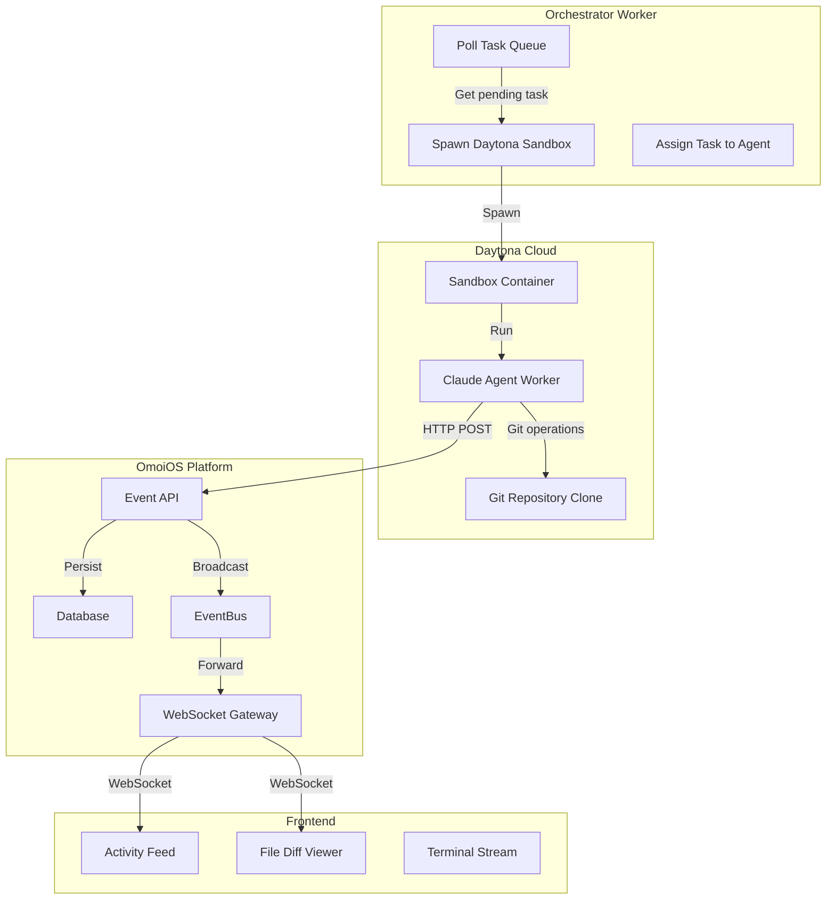
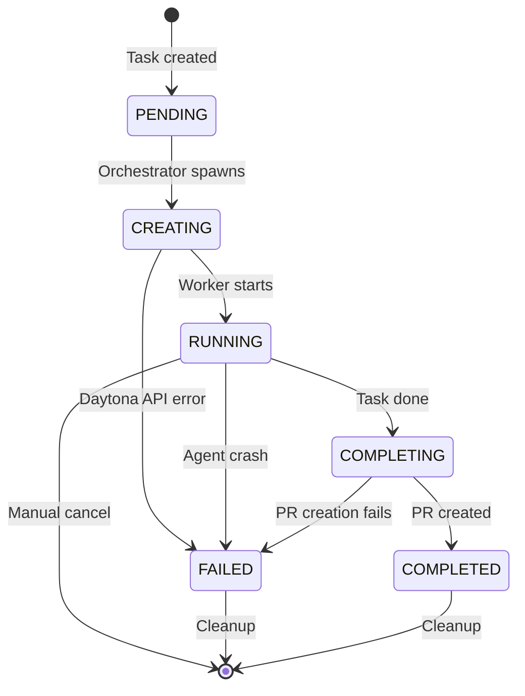
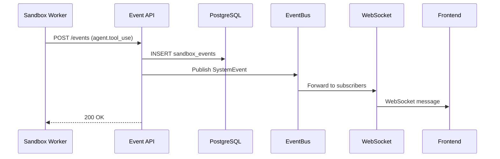

# Sandbox Agent System - Current Status

**Last Updated:** 2025-12-18  
**Status:** ✅ Core functionality working, ready for frontend integration  
**Version:** 2.1.0

---

## Table of Contents

1. [Executive Summary](#executive-summary)
2. [What's Working](#whats-working)
3. [System Architecture](#system-architecture)
4. [Event System Deep Dive](#event-system-deep-dive)
5. [Worker Implementation](#worker-implementation)
6. [Configuration Reference](#configuration-reference)
7. [Test Results](#test-results)
8. [Next Steps](#next-steps)

---

## Executive Summary

The OmoiOS Sandbox Agent System enables isolated, secure execution of AI agents in Daytona cloud sandboxes. Each agent runs in its own containerized environment with dedicated resources, complete Git integration, and real-time event streaming back to the main OmoiOS platform.

### Key Capabilities

- **Isolated Execution**: Each task runs in a dedicated Daytona sandbox with no shared state
- **Git-Native Workflow**: Automatic branch creation, commit tracking, and PR management
- **Real-Time Events**: 11+ event types streamed via HTTP callbacks with sub-second latency
- **Resource Controls**: Configurable CPU, memory, and disk limits per sandbox
- **Multi-Runtime Support**: Claude Agent SDK and OpenHands runtimes

---

## ✅ What's Working

### 1. Sandbox Spawning & Configuration

**Daytona Integration**: Sandboxes spawn successfully with configurable resources:

| Resource | Default | Range | Configuration |
|----------|---------|-------|---------------|
| Memory | 4 GB | 2-8 GB | `SANDBOX_MEMORY_GB` or YAML |
| CPU | 2 cores | 1-4 cores | `SANDBOX_CPU` or YAML |
| Disk | 8 GB | 4-10 GB | `SANDBOX_DISK_GB` or YAML |
| Snapshot | `ai-agent-dev-light` | Custom | `SANDBOX_SNAPSHOT` or YAML |

**Pre-Sandbox Branch Creation**: GitHub branches are created before sandbox spawn using the user's OAuth token:

```python
# From orchestrator_worker.py - branch naming logic
def _determine_ticket_type(ticket) -> str:
    """Derive ticket type from priority/title for branch naming."""
    if ticket.priority == "CRITICAL":
        return "hotfix"
    elif "bug" in (ticket.title or "").lower():
        return "bug"
    return "feature"

# Branch name format: feature/calculate-binomial-coefficient
# Passed to sandbox via BRANCH_NAME environment variable
```

**Configuration Priority** (highest to lowest):
1. Explicit parameters passed to `spawn_for_task()`
2. Environment variables (`SANDBOX_MEMORY_GB`, etc.)
3. YAML configuration (`config/base.yaml`)
4. Default values

### 2. Event Tracking & Persistence

**Event Types Tracked** (11+ types):

| Event Type | Description | Payload Example |
|------------|-------------|-----------------|
| `agent.started` | Worker initialization | `{"sandbox_id": "...", "timestamp": "..."}` |
| `agent.system_message` | System prompts | `{"content": "...", "role": "system"}` |
| `agent.assistant_message` | LLM responses | `{"content": "...", "role": "assistant"}` |
| `agent.message` | Text content blocks | `{"content": "...", "block_type": "text"}` |
| `agent.tool_use` | Tool invocations | `{"tool_name": "Write", "tool_input": {...}}` |
| `agent.tool_completed` | Tool completion | `{"tool_name": "...", "result": "..."}` |
| `agent.user_tool_result` | Tool result messages | `{"tool_id": "...", "content": "..."}` |
| `agent.file_edited` | File changes with diffs | `{"file_path": "...", "full_diff": "..."}` |
| `agent.completed` | Task completion | `{"reason": "...", "total_turns": N}` |
| `agent.waiting` | Worker waiting | `{"message": "Ready for messages"}` |
| `agent.heartbeat` | Health checks (every 30s) | `{"timestamp": "...", "status": "alive"}` |

**Database Persistence**: All events stored in PostgreSQL `sandbox_events` table:

```python
# From sandbox_event.py model
class SandboxEvent(Base):
    """Event log entry from a sandbox agent."""
    
    __tablename__ = "sandbox_events"
    
    id: Mapped[UUID] = mapped_column(primary_key=True, default=uuid4)
    sandbox_id: Mapped[str] = mapped_column(String(255), index=True)
    event_type: Mapped[str] = mapped_column(String(100), index=True)
    event_data: Mapped[dict] = mapped_column(JSONB)  # Flexible payload
    source: Mapped[str] = mapped_column(String(50), default="agent")
    created_at: Mapped[datetime] = mapped_column(default=utc_now)
    
    # Indexes for efficient querying
    __table_args__ = (
        Index("ix_sandbox_events_sandbox_id_created", 
              "sandbox_id", "created_at"),
        Index("ix_sandbox_events_event_type_created", 
              "event_type", "created_at"),
    )
```

**API Endpoints**:

```python
# From sandbox.py routes
@router.post("/{sandbox_id}/events")
async def receive_sandbox_event(
    sandbox_id: str,
    event: SandboxEventCreate,
    db: DatabaseService = Depends(get_db),
):
    """Receive events from sandbox workers."""
    # Persist to database
    # Broadcast via EventBus for WebSocket forwarding
    # Return 200 OK to acknowledge receipt

@router.get("/{sandbox_id}/events")
async def get_sandbox_events(
    sandbox_id: str,
    event_type: Optional[str] = None,
    limit: int = 100,
    offset: int = 0,
    db: DatabaseService = Depends(get_db),
):
    """Query events with pagination and filtering."""
    # Returns paginated event list
```

### 3. File Change Tracking

**Unified Diffs**: File edits tracked with full unified diff format:

```python
# From claude_sandbox_worker.py - FileChangeTracker
class FileChangeTracker:
    """Tracks file changes for diff generation."""

    def __init__(self):
        self.file_cache: dict[str, str] = {}  # path → content before edit

    def cache_file_before_edit(self, path: str, content: str):
        """Cache file content before Write/Edit tool executes."""
        self.file_cache[path] = content

    def generate_diff(self, path: str, new_content: str) -> dict:
        """Generate unified diff after edit completes."""
        old_content = self.file_cache.pop(path, "")
        
        if not old_content:
            # New file
            diff = ["--- /dev/null", f"+++ b/{path}"]
            for line in new_content.splitlines():
                diff.append(f"+{line}")
            change_type = "created"
        else:
            # Modified file
            diff = list(difflib.unified_diff(
                old_content.splitlines(),
                new_content.splitlines(),
                fromfile=f"a/{path}",
                tofile=f"b/{path}",
                lineterm="",
            ))
            change_type = "modified"
        
        return {
            "file_path": path,
            "change_type": change_type,
            "lines_added": sum(1 for line in diff if line.startswith("+") and not line.startswith("+++")),
            "lines_removed": sum(1 for line in diff if line.startswith("-") and not line.startswith("---")),
            "full_diff": "\n".join(diff),
        }
```

**Event Data Structure**:

```json
{
  "event_type": "agent.file_edited",
  "event_data": {
    "file_path": "/workspace/binomial.py",
    "change_type": "modified",
    "lines_added": 15,
    "lines_removed": 3,
    "diff_preview": "--- a/binomial.py\n+++ b/binomial.py\n@@ -1,5 +1,15 @@...",
    "full_diff": "...",
    "full_diff_available": true,
    "full_diff_size": 1250
  },
  "turn": 5
}
```

### 4. Task Management

**Task Status Flow**:

```
pending → assigned → running → completed/failed
   ↓         ↓          ↓
  (orchestrator (sandbox   (agent
   picks up)    spawned)    reports)
```

**Task Pickup Detection**: Enhanced logic checks multiple signals:

```python
# From orchestrator_worker.py
async def orchestrator_loop():
    while not shutdown_event.is_set():
        # Get next pending task with concurrency limits
        task = queue.get_next_task_with_concurrency_limit(
            max_concurrent_per_project=5,
            phase_id=None,
        )
        
        if task:
            # Check if task already has a sandbox
            if task.sandbox_id:
                logger.warning(
                    "task_already_has_sandbox",
                    existing_sandbox_id=task.sandbox_id,
                    reason="Skipping spawn - task already has sandbox"
                )
                continue
            
            # Spawn sandbox for task
            await _spawn_sandbox_for_task(task, "implementation", daytona_spawner, log)
```

**Completion Reporting**: Robust completion with retry logic:

```python
# From claude_sandbox_worker.py
async def report_completion(self, reporter: EventReporter, result: dict):
    """Report task completion with retry logic."""
    max_retries = 3
    for attempt in range(max_retries):
        try:
            success = await reporter.report(
                "agent.completed",
                {
                    "reason": "task_finished",
                    "total_turns": result["num_turns"],
                    "total_cost_usd": result["total_cost_usd"],
                    "session_id": result["session_id"],
                },
                source="worker",
            )
            if success:
                return True
        except Exception as e:
            logger.error(f"Completion report failed (attempt {attempt + 1}): {e}")
            await asyncio.sleep(2 ** attempt)  # Exponential backoff
    
    return False
```

### 5. Worker Robustness

**Error Handling**:

| Error Type | Handling Strategy |
|------------|-------------------|
| 502 Bad Gateway | Suppressed for non-critical events (heartbeats) |
| SIGKILL (-9) | Detected with diagnostic messages in logs |
| Stream errors | Graceful handling with partial output return |
| Network timeouts | Exponential backoff retry (1s, 2s, 4s, 8s) |

**Session Management**: Session resume support via `resume_session_id`:

```python
# Environment variables for session resumption
RESUME_SESSION_ID = os.environ.get("RESUME_SESSION_ID")
FORK_SESSION = os.environ.get("FORK_SESSION", "false").lower() == "true"
SESSION_TRANSCRIPT_B64 = os.environ.get("SESSION_TRANSCRIPT_B64")
```

**Resource Limits**: Memory/CPU limits prevent OOM kills:

```yaml
# config/base.yaml
daytona:
  sandbox_memory_gb: 4
  sandbox_cpu: 2
  sandbox_disk_gb: 8
```

### 6. Claude Agent SDK Integration

**Tools Enabled**: Read, Write, Bash, Edit, Glob, Grep, Task, Skill, WebFetch, WebSearch

**Sub-agents & Skills**: Enabled via configuration:

```python
# From WorkerConfig in claude_sandbox_worker.py
self.enable_skills = os.environ.get("ENABLE_SKILLS", "true").lower() == "true"
self.enable_subagents = os.environ.get("ENABLE_SUBAGENTS", "true").lower() == "true"

# SDK options
sdk_options = ClaudeAgentOptions(
    system_prompt=self.system_prompt,
    allowed_tools=self.allowed_tools,
    permission_mode=self.permission_mode,  # "bypassPermissions" or "acceptEdits"
    max_turns=self.max_turns,
    cwd=self.cwd,
    env={"ANTHROPIC_API_KEY": self.api_key},
)
```

**Model Support**: 
- Claude Opus 4.5 (default): `claude-opus-4-5-20251101`
- Claude Sonnet 4: `claude-sonnet-4-20250514`
- GLM 4.6 (via Z.AI): `glm-4.6v` (128k context)

---

## System Architecture

### High-Level Flow



### Sandbox Lifecycle



---

## Event System Deep Dive

### Event Flow Architecture



### Event Processing Pipeline

```python
# From sandbox.py - event processing
@router.post("/{sandbox_id}/events")
async def receive_sandbox_event(
    sandbox_id: str,
    event: SandboxEventCreate,
    db: DatabaseService = Depends(get_db),
    event_bus: EventBusService = Depends(get_event_bus),
):
    """Receive and process sandbox events."""
    
    # 1. Persist to database
    db_event = SandboxEvent(
        sandbox_id=sandbox_id,
        event_type=event.event_type,
        event_data=event.event_data,
        source=event.source,
    )
    db.add(db_event)
    db.commit()
    
    # 2. Broadcast via EventBus
    system_event = SystemEvent(
        event_type=event.event_type,
        entity_type="sandbox",
        entity_id=sandbox_id,
        payload={
            **event.event_data,
            "sandbox_id": sandbox_id,
            "event_id": str(db_event.id),
        },
    )
    event_bus.publish(system_event)
    
    # 3. Update task status if completion event
    if event.event_type == "agent.completed":
        await update_task_status_from_event(sandbox_id, event)
    
    return {"status": "received", "event_id": str(db_event.id)}
```

---

## Worker Implementation

### Main Worker Loop

```python
# From claude_sandbox_worker.py - main execution loop
class SandboxWorker:
    async def run(self):
        """Main worker loop."""
        self._setup_signal_handlers()
        self.running = True

        async with EventReporter(self.config) as reporter:
            async with MessagePoller(self.config) as poller:
                # Report startup
                await reporter.report("agent.started", {...})

                try:
                    async with ClaudeSDKClient(options=sdk_options) as client:
                        # Process initial prompt
                        if self.config.initial_prompt:
                            await client.query(self.config.initial_prompt)
                            await process_sdk_response(client, reporter)

                        # Main message loop
                        last_heartbeat = asyncio.get_event_loop().time()
                        while not self._shutdown_event.is_set():
                            # Poll for messages
                            messages = await poller.poll()
                            
                            for msg in messages:
                                if msg.get("message_type") == "interrupt":
                                    await client.interrupt()
                                    continue
                                
                                # Send to Claude
                                await client.query(msg.get("content"))
                                result = await process_sdk_response(client, reporter)
                            
                            # Heartbeat
                            now = asyncio.get_event_loop().time()
                            if now - last_heartbeat >= self.config.heartbeat_interval:
                                await reporter.heartbeat()
                                last_heartbeat = now
                            
                            await asyncio.sleep(self.config.poll_interval)

                except Exception as e:
                    await reporter.report("agent.error", {"error": str(e)})
                    return 1

                # Shutdown
                await reporter.report("agent.completed", {...})
                return 0
```

### Message Processing

```python
# SDK response processing
async def process_sdk_response(client, reporter):
    """Process streaming response from Claude Agent SDK."""
    async for msg in client.receive_response():
        if isinstance(msg, AssistantMessage):
            for block in msg.content:
                if isinstance(block, TextBlock):
                    await reporter.report("agent.message", {
                        "content": block.text,
                        "role": "assistant",
                    })
                elif isinstance(block, ToolUseBlock):
                    await reporter.report("agent.tool_use", {
                        "tool_name": block.name,
                        "tool_input": block.input,
                    })
                elif isinstance(block, ToolResultBlock):
                    await reporter.report("agent.tool_result", {
                        "tool_id": block.tool_use_id,
                        "content": str(block.content)[:1000],
                        "is_error": block.is_error,
                    })
        elif isinstance(msg, ResultMessage):
            return msg  # Turn complete
```

---

## Configuration Reference

### Environment Variables

| Variable | Required | Default | Description |
|----------|----------|---------|-------------|
| `SANDBOX_ID` | Yes | Auto-generated | Unique sandbox identifier |
| `CALLBACK_URL` | Yes | `http://localhost:8000` | API endpoint for events |
| `ANTHROPIC_API_KEY` | Yes* | - | Claude API key |
| `ANTHROPIC_AUTH_TOKEN` | Yes* | - | Z.AI token (alternative) |
| `TASK_ID` | No | - | Task identifier |
| `AGENT_ID` | No | - | Agent identifier |
| `TASK_DATA_BASE64` | No | - | Base64-encoded task context |
| `SANDBOX_MEMORY_GB` | No | 4 | Memory allocation |
| `SANDBOX_CPU` | No | 2 | CPU cores |
| `SANDBOX_DISK_GB` | No | 8 | Disk space |
| `SANDBOX_SNAPSHOT` | No | `ai-agent-dev-light` | Base snapshot |
| `POLL_INTERVAL` | No | 0.5 | Message poll interval (seconds) |
| `HEARTBEAT_INTERVAL` | No | 30 | Heartbeat interval (seconds) |
| `MAX_TURNS` | No | 50 | Max turns per response |
| `MAX_BUDGET_USD` | No | 10.0 | Max budget in USD |
| `PERMISSION_MODE` | No | `bypassPermissions` | SDK permission mode |
| `ENABLE_SKILLS` | No | `true` | Enable Claude skills |
| `ENABLE_SUBAGENTS` | No | `true` | Enable sub-agents |
| `EXECUTION_MODE` | No | `implementation` | `exploration`, `implementation`, `validation` |
| `REQUIRE_SPEC_SKILL` | No | `false` | Enforce spec-driven-dev skill |
| `GITHUB_TOKEN` | No | - | GitHub access token |
| `GITHUB_REPO` | No | - | Repository (owner/repo) |
| `BRANCH_NAME` | No | - | Git branch to checkout |
| `RESUME_SESSION_ID` | No | - | Session to resume |

*One of `ANTHROPIC_API_KEY` or `ANTHROPIC_AUTH_TOKEN` required

### YAML Configuration

```yaml
# config/base.yaml
daytona:
  snapshot: "ai-agent-dev-light"
  sandbox_memory_gb: 4
  sandbox_cpu: 2
  sandbox_disk_gb: 8
  sandbox_execution: true
  
  # API configuration
  api_key: "${DAYTONA_API_KEY}"
  api_url: "https://app.daytona.io/api"
  
  # Auto-cleanup settings
  auto_cleanup: true
  cleanup_interval_seconds: 300
```

---

## 📊 Test Results

### Successful Test Runs

All recent test runs show consistent patterns:

| Metric | Range | Typical |
|--------|-------|---------|
| Event Count | 44-71 events | ~55 events |
| Duration | 567-1397 seconds | ~900s (15 min) |
| Heartbeats | 18-45 | ~30 |
| File Edits | 1-5 | 2 |

### Example Successful Run

```json
{
  "sandbox_id": "omoios-886da5fe-0a9fee",
  "task": "Calculate binomial coefficient C(50,25)",
  "result": "✅ Completed successfully",
  "events": {
    "total": 71,
    "activity": 26,
    "heartbeats": 45
  },
  "file_edits": [
    {
      "path": "/workspace/binomial.py",
      "change_type": "created",
      "lines": 45
    },
    {
      "path": "/workspace/binomial.py",
      "change_type": "modified",
      "lines_added": 12,
      "lines_removed": 3
    }
  ],
  "duration_seconds": 892,
  "cost_usd": 0.42
}
```

### Core Events in Every Run

| Event | Count | Description |
|-------|-------|-------------|
| `agent.started` | 1 | Worker initialization |
| `agent.tool_use` | 3+ | Write, Edit, Bash typical |
| `agent.file_edited` | 2+ | File creation + modification |
| `agent.completed` | 1 | Task completion |
| `agent.heartbeat` | Variable | Every 30s while alive |

---

## 🚀 Next Steps

### Immediate (Frontend Integration)

- [ ] Test event streaming in frontend UI
- [ ] Implement FileChangeCard component with diff viewer
- [ ] Real-time event updates via WebSocket
- [ ] Activity feed rendering with filtering

### Future Enhancements

- [ ] Automated sandbox pruning worker
- [ ] Enhanced monitoring system (see `MONITORING_TODO.md`)
- [ ] Event batching for high-volume scenarios
- [ ] Redis event storage for faster queries
- [ ] Session replay functionality
- [ ] Multi-region sandbox deployment

---

## 📝 Notes

- All events are persisted to PostgreSQL `sandbox_events` table
- Events are broadcast via EventBus to WebSocket clients (when connected)
- File diffs can be large; UI should truncate for display (use `diff_preview`)
- Heartbeat events occur every 30 seconds while worker is alive
- Worker continues running after task completion (waits for new messages)
- Sandbox cleanup happens automatically when task marked complete

---

## Key Files

### Core Components

| File | Purpose | Lines |
|------|---------|-------|
| `backend/omoi_os/workers/claude_sandbox_worker.py` | Standalone worker script | ~2000 |
| `backend/omoi_os/services/daytona_spawner.py` | Sandbox spawning service | ~3800 |
| `backend/omoi_os/api/routes/sandbox.py` | Event API endpoints | ~500 |
| `backend/omoi_os/models/sandbox_event.py` | Event database model | ~100 |
| `backend/omoi_os/workers/orchestrator_worker.py` | Task orchestration | ~1500 |

### Test Scripts

| Script | Purpose |
|--------|---------|
| `backend/scripts/test_api_sandbox_spawn.py` | End-to-end API test |
| `backend/scripts/query_sandbox_events.py` | Query events from database |
| `backend/scripts/compare_sandbox_events.py` | Compare events across sandboxes |
| `backend/scripts/list_recent_sandboxes.py` | List recent sandboxes |

---

*For detailed implementation guides, see [Implementation Checklist](./06_implementation_checklist.md) and [Development Workflow](./10_development_workflow.md)*
