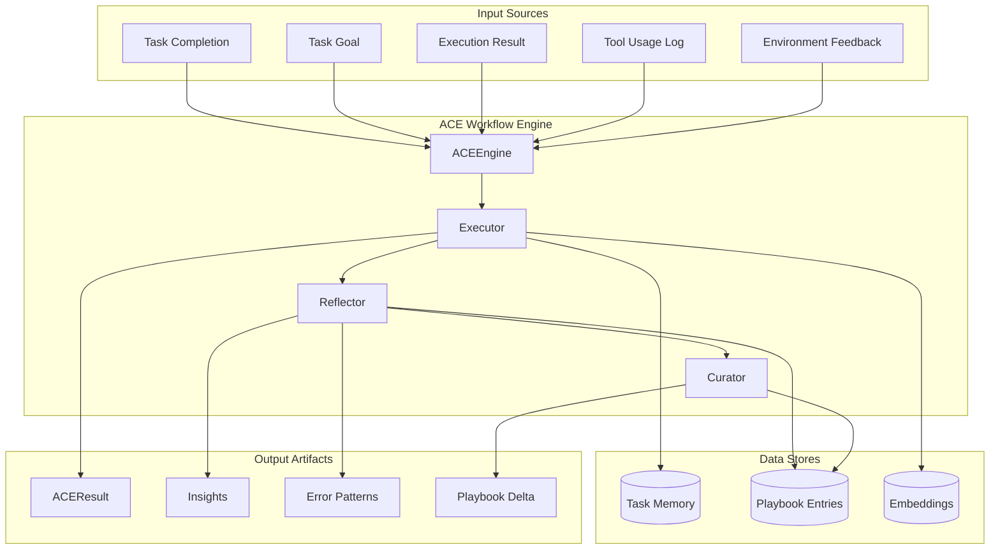
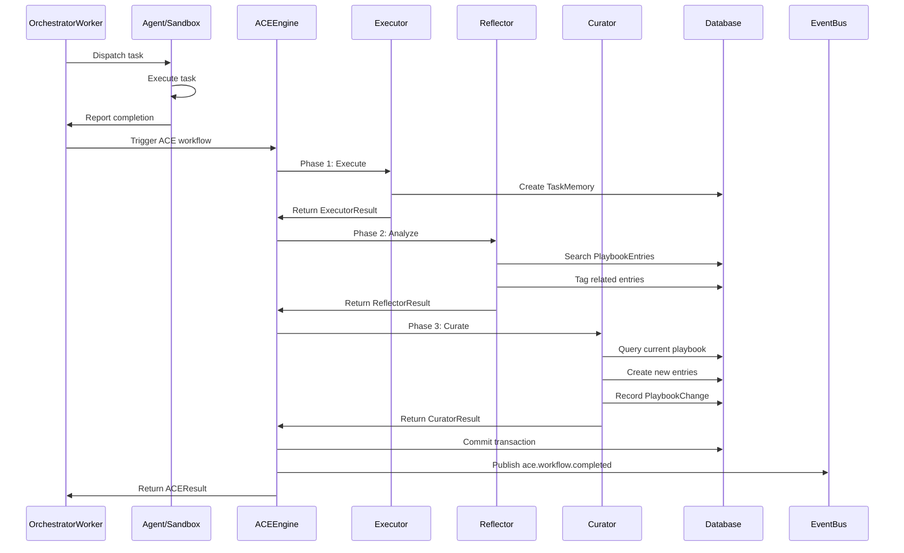
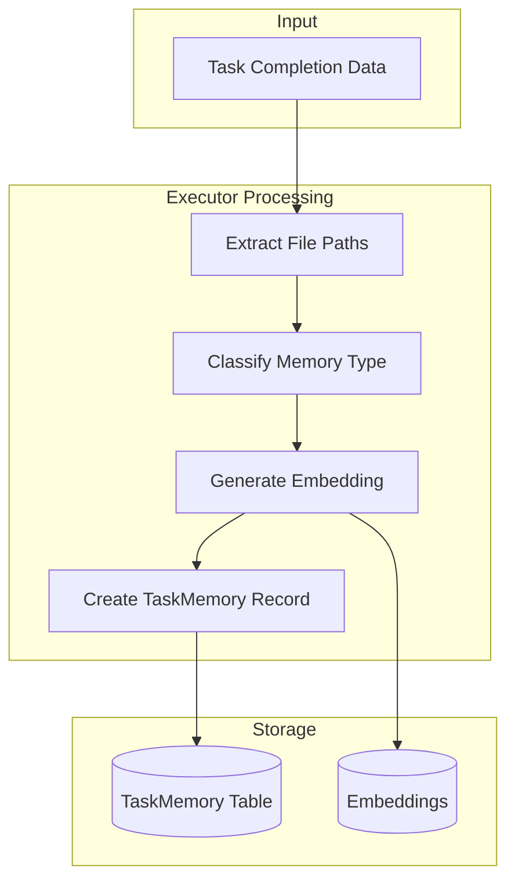
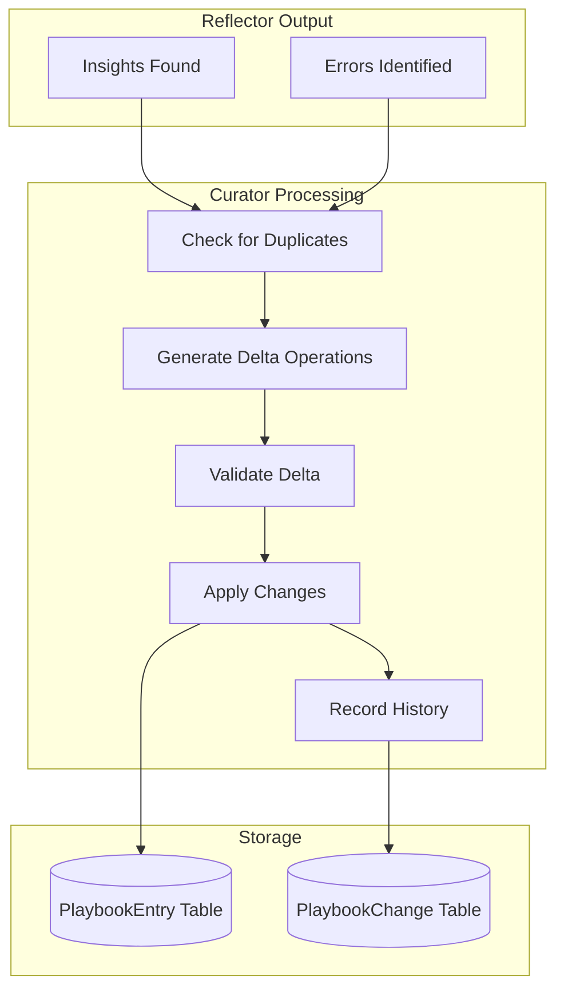
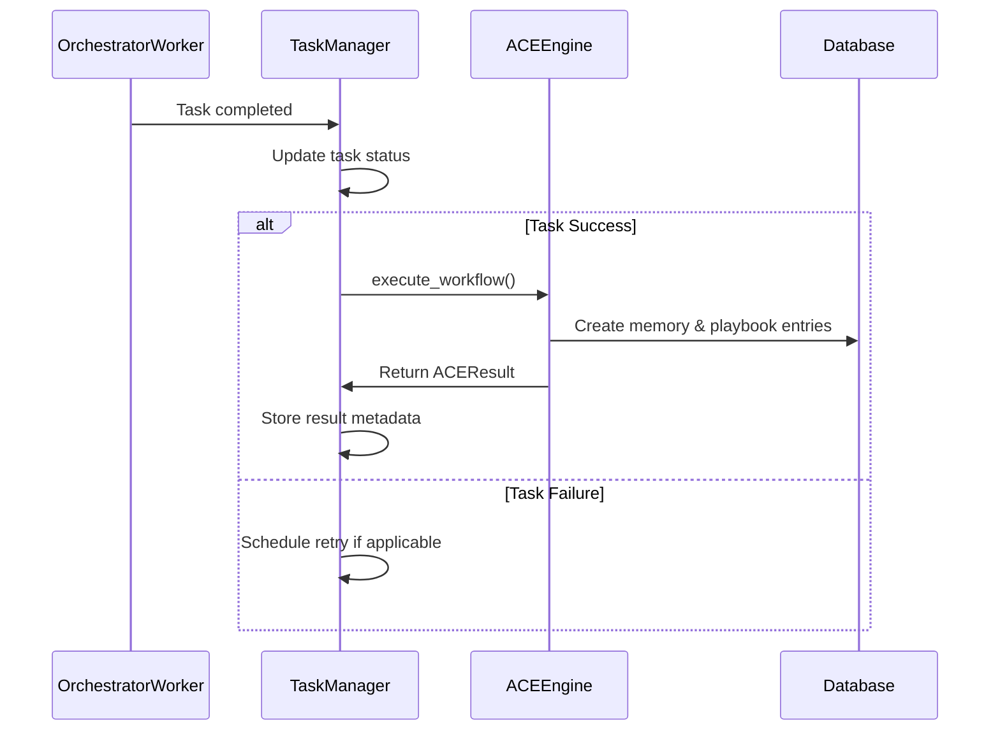

# ACE (Adaptive Code Execution) System Design Document

**Created:** 2026-04-22  
**Status:** Active  
**Purpose:** Three-phase memory and knowledge extraction workflow that transforms task completions into structured organizational memory and playbook updates  
**Related Docs:** [Orchestrator Service](./orchestrator_service.md), [Guardian Monitoring](./guardian_monitoring.md), [Sandbox Spawner](./sandbox_spawner.md), [Discovery Service](./discovery_service.md)

---

## 1. Architecture Overview

The ACE (Adaptive Code Execution) system is a three-phase workflow engine that extracts, analyzes, and curates knowledge from agent task completions. It transforms raw execution data into structured organizational memory and playbook entries that improve future agent performance.

### 1.1 High-Level Architecture



### 1.2 Three-Phase Workflow

```mermaid
flowchart LR
    subgraph "Phase 1: Executor"
        E1[Parse Tool Usage]
        E2[Classify Memory Type]
        E3[Generate Embedding]
        E4[Create Memory Record]
        E5[Link Files]
    end
    
    subgraph "Phase 2: Reflector"
        R1[Identify Errors]
        R2[Search Playbook]
        R3[Tag Related Entries]
        R4[Extract Insights]
    end
    
    subgraph "Phase 3: Curator"
        C1[Get Current Playbook]
        C2[Propose Updates]
        C3[Generate Delta]
        C4[Validate Delta]
        C5[Apply Changes]
        C6[Record History]
    end
    
    E1 --> E2 --> E3 --> E4 --> E5 --> R1
    R1 --> R2 --> R3 --> R4 --> C1
    C1 --> C2 --> C3 --> C4 --> C5 --> C6
```



---

## 2. Service Responsibilities

| Service | Responsibility | Key Methods | State |
|---------|---------------|-------------|-------|
| **ACEEngine** | Orchestrate three-phase workflow, coordinate service calls, publish completion events | `execute_workflow()`, `__init__()` | Stateless orchestrator; holds service references |
| **Executor** | Parse tool usage, classify memory type, generate embeddings, create memory records | `execute()`, `extract_file_paths()`, `extract_tags()` | Stateless; uses MemoryService and EmbeddingService |
| **Reflector** | Analyze feedback for errors, search playbook semantically, tag entries, extract insights | `analyze()`, `identify_errors()`, `search_playbook_entries()`, `extract_insights()` | Stateless; uses EmbeddingService |
| **Curator** | Propose playbook updates, generate delta operations, validate and apply changes | `curate()`, `search_playbook_for_similar()`, `validate_delta()`, `infer_category()` | Stateless; uses EmbeddingService |

---

## 3. System Boundaries

### 3.1 Inside System Boundaries

- Task completion data ingestion (goal, result, tool usage, feedback)
- Memory classification and embedding generation
- File path extraction from tool usage logs
- Error pattern identification from feedback text
- Semantic playbook entry search using cosine similarity
- Playbook entry tagging with supporting memory IDs
- Structured insight extraction (patterns, gotchas, best practices)
- Playbook delta generation (add/update/delete operations)
- Duplicate detection using similarity thresholds (0.85)
- Change history recording via PlaybookChange model
- Event publication on workflow completion

### 3.2 Outside System Boundaries

- Actual task execution (handled by Orchestrator/Agent)
- LLM-based insight generation (handled by LLM Service)
- Playbook entry manual editing (handled by UI/API)
- Memory retrieval for agent context (handled by MemoryService)
- Vector database management (handled by EmbeddingService)
- Database transaction management (handled by DatabaseService)
- Event bus infrastructure (handled by EventBusService)

---

## 4. Component Details

### 4.1 ACEEngine

The central orchestrator that coordinates the three-phase ACE workflow.

**Key Attributes:**
- `db`: DatabaseService for session management
- `executor`: Executor instance for Phase 1
- `reflector`: Reflector instance for Phase 2
- `curator`: Curator instance for Phase 3
- `event_bus`: Optional EventBusService for publishing completion events

**Core Methods:**

```python
class ACEEngine:
    """
    ACE workflow engine orchestrator (REQ-MEM-ACE-004).
    
    Responsibilities:
    - Orchestrate three-phase workflow (Executor → Reflector → Curator)
    - Coordinate service calls and handle failures
    - Track workflow metrics
    - Return structured ACEResult
    """
    
    def __init__(
        self,
        db: DatabaseService,
        memory_service: MemoryService,
        embedding_service: EmbeddingService,
        event_bus: Optional[EventBusService] = None,
    ):
        """Initialize ACE workflow engine."""
        self.db: DatabaseService = db
        self.executor: Executor = Executor(memory_service, embedding_service)
        self.reflector: Reflector = Reflector(embedding_service)
        self.curator: Curator = Curator(embedding_service)
        self.event_bus: EventBusService | None = event_bus

    def execute_workflow(
        self,
        task_id: str,
        goal: str,
        result: str,
        tool_usage: list[dict[str, Any]],
        feedback: str,
        agent_id: str,
    ) -> ACEResult:
        """
        Execute complete ACE workflow (REQ-MEM-ACE-004).
        
        Runs Executor → Reflector → Curator in sequence.
        
        Args:
            task_id: Task ID
            goal: What the agent was trying to accomplish
            result: What actually happened
            tool_usage: List of tool usage records
            feedback: Output from environment (stdout, stderr, test results)
            agent_id: Agent ID that completed the task
        
        Returns:
            ACEResult with memory_id, tags, insights, playbook_delta
        """
```

**Workflow Execution Flow:**

```python
with self.db.get_session() as session:
    # Get task to find ticket_id
    task: Task | None = session.get(Task, task_id)
    if not task:
        raise ValueError(f"Task {task_id} not found")
    ticket_id = task.ticket_id

    # Phase 1: Executor (REQ-MEM-ACE-001)
    executor_result: ExecutorResult = self.executor.execute(...)
    session.flush()

    # Phase 2: Reflector (REQ-MEM-ACE-002)
    reflector_result: ReflectorResult = self.reflector.analyze(...)
    session.flush()

    # Phase 3: Curator (REQ-MEM-ACE-003)
    curator_result: CuratorResult = self.curator.curate(...)
    session.commit()

    # Publish event (REQ-MEM-ACE-004)
    if self.event_bus:
        self.event_bus.publish(SystemEvent(...))

    return ACEResult(...)
```

### 4.2 Executor (Phase 1)

Transforms task completion data into a structured memory record with embeddings.

**Key Dataclasses:**

```python
@dataclass
class ToolUsage:
    """Tool usage record (REQ-MEM-ACE-001)."""
    tool_name: str
    arguments: dict[str, Any]
    result: Optional[str] = None

@dataclass
class ExecutorResult:
    """Result from Executor phase (REQ-MEM-ACE-001)."""
    memory_id: str
    memory_type: str
    files_linked: list[str]
    tags: list[str]
```

**Core Methods:**

```python
class Executor:
    """
    Executor service for ACE workflow (REQ-MEM-ACE-001).
    
    Responsibilities:
    - Parse tool_usage to extract file paths and classify relations
    - Classify memory_type based on goal and result
    - Generate embeddings for content
    - Create memory record
    - Link memory to relevant files
    """
    
    def __init__(
        self,
        memory_service: MemoryService,
        embedding_service: EmbeddingService,
    ):
        self.memory_service = memory_service
        self.embedding_service = embedding_service

    def execute(
        self,
        session: Session,
        task_id: str,
        goal: str,
        result: str,
        tool_usage: list[dict[str, Any]],
        feedback: Optional[str] = None,
    ) -> ExecutorResult:
        """
        Execute phase: create memory from task completion (REQ-MEM-ACE-001).
        
        Steps:
        1. Parse tool_usage to extract file paths
        2. Classify memory_type
        3. Generate embedding
        4. Create memory record
        5. Link to files (if file tracking implemented)
        """

    def extract_file_paths(
        self,
        tool_usage: list[dict[str, Any]]
    ) -> list[str]:
        """
        Extract file paths from tool usage (REQ-MEM-ACE-001).
        
        Parses tool usage to find file paths from operations like:
        - file_read: reads file paths from arguments
        - file_edit: reads file paths from arguments
        - file_create: reads file paths from arguments
        """

    def extract_tags(
        self,
        goal: str,
        result: str
    ) -> list[str]:
        """Extract tags from goal and result using keyword matching."""
```

**File Path Extraction Logic:**

```python
def extract_file_paths(self, tool_usage: list[dict[str, Any]]) -> list[str]:
    files = set()
    
    for tool in tool_usage:
        tool_name = tool.get("tool_name", "").lower()
        arguments = tool.get("arguments", {})
        
        # Extract file paths based on tool type
        if tool_name in [
            "file_read", "file_edit", "file_create",
            "read_file", "write_file", "edit_file",
        ]:
            file_path = (
                arguments.get("path")
                or arguments.get("file_path")
                or arguments.get("file")
            )
            if file_path:
                files.add(str(file_path))
    
    return sorted(list(files))
```

**Tag Extraction Patterns:**

```python
common_tags = {
    "authentication": ["auth", "login", "jwt", "oauth"],
    "database": ["db", "sql", "postgres", "mysql", "database"],
    "api": ["api", "endpoint", "rest", "graphql"],
    "testing": ["test", "pytest", "unit", "integration"],
    "frontend": ["react", "vue", "angular", "ui", "frontend"],
    "backend": ["backend", "server", "api"],
}
```

### 4.3 Reflector (Phase 2)

Analyzes task feedback to identify errors, find related playbook entries, and extract insights.

**Key Dataclasses:**

```python
@dataclass
class Error:
    """Error identified from feedback (REQ-MEM-ACE-002)."""
    error_type: str
    message: str
    context: Optional[str] = None

@dataclass
class Insight:
    """Structured insight extracted from task completion (REQ-MEM-ACE-002)."""
    insight_type: str  # pattern, gotcha, best_practice
    content: str
    confidence: float

@dataclass
class ReflectorResult:
    """Result from Reflector phase (REQ-MEM-ACE-002)."""
    tags_added: list[str]  # Entry IDs that were tagged
    insights_found: list[Insight]
    errors_identified: list[Error]
    related_playbook_entries: list[str]  # Entry IDs
```

**Core Methods:**

```python
class Reflector:
    """
    Reflector service for ACE workflow (REQ-MEM-ACE-002).
    
    Responsibilities:
    - Analyze task feedback for errors and root causes
    - Search playbook for related entries using semantic search
    - Tag related entries with supporting memory IDs
    - Extract structured insights (patterns, gotchas, best practices)
    """
    
    def __init__(self, embedding_service: EmbeddingService):
        self.embedding_service = embedding_service

    def analyze(
        self,
        session: Session,
        executor_result: ExecutorResult,
        memory_id: str,
        feedback: str,
        ticket_id: str,
        goal: str,
        result: str,
    ) -> ReflectorResult:
        """
        Reflect phase: analyze what happened and find related knowledge (REQ-MEM-ACE-002).
        
        Steps:
        1. Identify errors from feedback
        2. Find root causes
        3. Search playbook for related entries
        4. Tag related entries
        5. Extract insights
        """

    def identify_errors(self, feedback: str) -> list[Error]:
        """
        Identify errors from feedback text (REQ-MEM-ACE-002).
        
        Looks for:
        - Error messages (ImportError, ValueError, etc.)
        - Failure indicators ("failed", "error", "exception")
        - Test failures
        """

    def search_playbook_entries(
        self,
        session: Session,
        query_text: str,
        ticket_id: str,
        limit: int = 5,
        similarity_threshold: float = 0.7,
    ) -> list[Any]:
        """Search playbook entries using semantic similarity (REQ-MEM-ACE-002)."""

    def _cosine_similarity(
        self,
        vec1: list[float],
        vec2: list[float]
    ) -> float:
        """Calculate cosine similarity between two vectors."""

    def extract_insights(
        self,
        goal: str,
        result: str,
        feedback: str
    ) -> list[Insight]:
        """
        Extract structured insights from completion (REQ-MEM-ACE-002).
        
        Uses pattern matching to identify:
        - Patterns ("always", "never", "make sure to")
        - Gotchas ("careful with", "watch out for")
        - Best practices ("prefer", "recommend")
        """
```

**Error Pattern Matching:**

```python
error_patterns = {
    "ImportError": r"ImportError[^\n]*",
    "ValueError": r"ValueError[^\n]*",
    "KeyError": r"KeyError[^\n]*",
    "AttributeError": r"AttributeError[^\n]*",
    "TypeError": r"TypeError[^\n]*",
    "FileNotFoundError": r"FileNotFoundError[^\n]*",
    "PermissionError": r"PermissionError[^\n]*",
}

failure_keywords = ["failed", "error", "exception", "traceback", "failed tests"]
```

**Insight Extraction Keywords:**

```python
pattern_keywords = ["always", "never", "make sure", "must", "should"]
gotcha_keywords = ["careful", "watch out", "gotcha", "beware", "caution"]
best_practice_keywords = ["prefer", "recommend", "best practice", "should use"]
```

### 4.4 Curator (Phase 3)

Updates the playbook with new knowledge extracted from task insights.

**Key Dataclasses:**

```python
@dataclass
class DeltaOperation:
    """Delta operation for playbook changes (REQ-MEM-ACE-003)."""
    operation: str  # add, update, delete
    content: str
    category: Optional[str] = None
    tags: Optional[list[str]] = None
    entry_id: Optional[str] = None  # For update/delete operations

@dataclass
class PlaybookDelta:
    """Playbook delta with operations and summary (REQ-MEM-ACE-003)."""
    operations: list[DeltaOperation]
    summary: str

@dataclass
class PlaybookBullet:
    """Playbook bullet entry (REQ-MEM-ACE-003)."""
    id: str
    content: str
    category: Optional[str]
    tags: Optional[list[str]]
    supporting_memory_ids: Optional[list[str]]

@dataclass
class CuratorResult:
    """Result from Curator phase (REQ-MEM-ACE-003)."""
    playbook_delta: PlaybookDelta
    updated_bullets: list[PlaybookBullet]
    change_id: Optional[str]
```

**Core Methods:**

```python
class Curator:
    """
    Curator service for ACE workflow (REQ-MEM-ACE-003).
    
    Responsibilities:
    - Propose playbook updates based on insights
    - Generate delta operations (add/update/delete)
    - Validate deltas (check duplicates, quality thresholds)
    - Apply accepted deltas to playbook
    - Record change history
    """
    
    def __init__(self, embedding_service: EmbeddingService):
        self.embedding_service = embedding_service

    def curate(
        self,
        session: Session,
        executor_result: ExecutorResult,
        reflector_result: ReflectorResult,
        ticket_id: str,
        memory_id: str,
        agent_id: str,
    ) -> CuratorResult:
        """
        Curate phase: update playbook with new knowledge (REQ-MEM-ACE-003).
        
        Steps:
        1. Get current playbook state
        2. Propose updates from insights
        3. Generate delta operations
        4. Validate delta
        5. Apply delta
        6. Record change history
        """

    def search_playbook_for_similar(
        self,
        session: Session,
        content: str,
        ticket_id: str,
        threshold: float = 0.85,
    ) -> Optional[PlaybookEntry]:
        """Search playbook for similar entries (REQ-MEM-ACE-003)."""

    def validate_delta(
        self,
        delta: PlaybookDelta,
        current_playbook: list[PlaybookEntry],
    ) -> bool:
        """
        Validate delta operations (REQ-MEM-ACE-003).
        
        Checks:
        - No exact duplicates
        - Content meets minimum quality (>10 chars)
        - Category is valid (if provided)
        """

    def infer_category(self, insight: Insight) -> str:
        """Infer playbook category from insight type (REQ-MEM-ACE-003)."""

    def _cosine_similarity(
        self,
        vec1: list[float],
        vec2: list[float]
    ) -> float:
        """Calculate cosine similarity between two vectors."""
```

**Category Inference Mapping:**

```python
category_map = {
    "pattern": "patterns",
    "gotcha": "gotchas",
    "best_practice": "best_practices",
}
```

---

## 5. Data Flow

### 5.1 ACE Integration with Orchestrator



### 5.2 Memory Creation Flow



### 5.3 Playbook Update Flow



---

## 6. API Surface

### 6.1 ACEEngine Public Interface

```python
# Initialization
engine = ACEEngine(
    db=database_service,
    memory_service=memory_service,
    embedding_service=embedding_service,
    event_bus=event_bus_service,  # Optional
)

# Execute complete workflow
result: ACEResult = engine.execute_workflow(
    task_id="task-uuid",
    goal="Implement user authentication",
    result="Successfully added JWT middleware",
    tool_usage=[
        {"tool_name": "file_edit", "arguments": {"path": "auth.py"}},
        {"tool_name": "file_create", "arguments": {"path": "jwt_middleware.py"}},
    ],
    feedback="Tests passed. Coverage: 95%",
    agent_id="agent-uuid",
)
```

### 6.2 Result Dataclass

```python
@dataclass
class ACEResult:
    """Complete ACE workflow result (REQ-MEM-ACE-004)."""
    
    # Executor phase
    memory_id: str
    memory_type: str
    files_linked: list[str]
    
    # Reflector phase
    tags_added: list[str]
    insights_found: list[dict[str, Any]]  # Serialized Insight objects
    errors_identified: list[dict[str, Any]]  # Serialized Error objects
    related_playbook_entries: list[str]  # Entry IDs
    
    # Curator phase
    playbook_delta: dict[str, Any]  # Serialized PlaybookDelta
    updated_bullets: list[dict[str, Any]]  # Serialized PlaybookBullet objects
    change_id: Optional[str]
```

### 6.3 Individual Service Interfaces

```python
# Executor
executor = Executor(memory_service, embedding_service)
executor_result: ExecutorResult = executor.execute(
    session=db_session,
    task_id="task-uuid",
    goal="Task goal",
    result="Task result",
    tool_usage=[...],
    feedback="Optional feedback",
)

# Reflector
reflector = Reflector(embedding_service)
reflector_result: ReflectorResult = reflector.analyze(
    session=db_session,
    executor_result=executor_result,
    memory_id="memory-uuid",
    feedback="Environment feedback",
    ticket_id="ticket-uuid",
    goal="Task goal",
    result="Task result",
)

# Curator
curator = Curator(embedding_service)
curator_result: CuratorResult = curator.curate(
    session=db_session,
    executor_result=executor_result,
    reflector_result=reflector_result,
    ticket_id="ticket-uuid",
    memory_id="memory-uuid",
    agent_id="agent-uuid",
)
```

---

## 7. Integration Points

### 7.1 Orchestrator Integration

The ACE workflow is triggered by the Orchestrator when a task completes successfully:



### 7.2 Event Bus Integration

ACE publishes a structured event on workflow completion:

```python
SystemEvent(
    event_type="ace.workflow.completed",
    entity_type="task_memory",
    entity_id=executor_result.memory_id,
    payload={
        "task_id": task_id,
        "ticket_id": ticket_id,
        "memory_id": executor_result.memory_id,
        "memory_type": executor_result.memory_type,
        "files_linked": executor_result.files_linked,
        "insights_count": len(reflector_result.insights_found),
        "errors_count": len(reflector_result.errors_identified),
        "playbook_updates": len(curator_result.updated_bullets),
        "change_id": curator_result.change_id,
    },
)
```

### 7.3 Memory Service Integration

The Executor uses MemoryService for:
- Memory type classification via `memory_service.classify_memory_type()`
- Future: Memory retrieval for agent context

### 7.4 Embedding Service Integration

All three phases use EmbeddingService for semantic operations:
- **Executor**: Generate embeddings for memory content
- **Reflector**: Generate query embeddings for playbook search
- **Curator**: Generate embeddings for duplicate detection

---

## 8. Error Handling

### 8.1 Failure Modes

| Phase | Failure Mode | Handling Strategy |
|-------|-------------|-------------------|
| **Executor** | Task not found | Raise `ValueError` immediately |
| **Executor** | Embedding generation fails | Continue without embedding (nullable field) |
| **Reflector** | No feedback provided | Skip error identification, continue with insights |
| **Reflector** | Playbook search fails | Return empty related entries list |
| **Curator** | Delta validation fails | Return empty result with "No valid updates" summary |
| **Curator** | Duplicate detected | Skip adding, continue with other insights |
| **ACEEngine** | Database session error | Rollback transaction, propagate exception |

### 8.2 Transaction Management

```python
with self.db.get_session() as session:
    try:
        # Phase 1
        executor_result = self.executor.execute(...)
        session.flush()
        
        # Phase 2
        reflector_result = self.reflector.analyze(...)
        session.flush()
        
        # Phase 3
        curator_result = self.curator.curate(...)
        
        # Commit all changes
        session.commit()
        
    except Exception:
        session.rollback()
        raise
```

### 8.3 Validation Rules

**Curator Delta Validation:**
- Content must be > 10 characters
- No exact duplicates (case-insensitive string match)
- Category must be valid if provided

**Similarity Thresholds:**
- Playbook search: 0.7 (Reflector)
- Duplicate detection: 0.85 (Curator)

---

## 9. Configuration

### 9.1 YAML Configuration

```yaml
# config/base.yaml
ace:
  # Executor settings
  executor:
    memory_classification_enabled: true
    file_extraction_enabled: true
    tag_extraction_enabled: true
    
  # Reflector settings
  reflector:
    error_pattern_matching: true
    playbook_search_limit: 5
    playbook_similarity_threshold: 0.7
    insight_extraction_enabled: true
    
  # Curator settings
  curator:
    duplicate_detection_threshold: 0.85
    min_content_length: 10
    auto_apply_deltas: true
    record_change_history: true
    
  # Workflow settings
  workflow:
    publish_events: true
    transaction_isolation: "read_committed"
```

### 9.2 Environment Variables

| Variable | Default | Description |
|----------|---------|-------------|
| `ACE_EXECUTOR_ENABLED` | true | Enable Phase 1 (Executor) |
| `ACE_REFLECTOR_ENABLED` | true | Enable Phase 2 (Reflector) |
| `ACE_CURATOR_ENABLED` | true | Enable Phase 3 (Curator) |
| `ACE_PLAYBOOK_SEARCH_LIMIT` | 5 | Max playbook entries to search |
| `ACE_SIMILARITY_THRESHOLD` | 0.7 | Playbook search similarity threshold |
| `ACE_DUPLICATE_THRESHOLD` | 0.85 | Duplicate detection threshold |
| `ACE_MIN_CONTENT_LENGTH` | 10 | Minimum content length for playbook entries |
| `ACE_PUBLISH_EVENTS` | true | Publish completion events to EventBus |

---

## 10. Performance Characteristics

| Metric | Target | Notes |
|--------|--------|-------|
| Workflow execution time | < 2s | End-to-end for typical task |
| Embedding generation | < 500ms | Per call to EmbeddingService |
| Playbook search | < 300ms | Semantic similarity calculation |
| Database transaction | < 1s | All three phases committed |
| Memory creation throughput | > 100/min | Sustained rate |
| Playbook update throughput | > 50/min | With duplicate checking |

---

## 11. Related Documentation

| Document | Description | Relationship |
|----------|-------------|--------------|
| [Orchestrator Service](./orchestrator_service.md) | Task dispatch and execution coordination | ACE is triggered by Orchestrator on task completion |
| [Guardian Monitoring](./guardian_monitoring.md) | Trajectory analysis and intervention | Guardian may trigger ACE re-analysis after steering |
| [Sandbox Spawner](./sandbox_spawner.md) | Daytona sandbox lifecycle management | ACE processes sandbox execution outputs |
| [Discovery Service](./discovery_service.md) | Adaptive requirement discovery | ACE memories inform Discovery pattern matching |
| [Memory System](../../memory/) | Organizational memory architecture | ACE creates TaskMemory entries |
| [Playbook System](../../architecture/01-planning-system.md) | Spec-driven workflow patterns | ACE updates PlaybookEntry records |

---

## 12. Requirements Traceability

| Requirement ID | Description | Implementation |
|----------------|-------------|----------------|
| REQ-MEM-ACE-001 | Executor phase - memory creation | `Executor.execute()` method |
| REQ-MEM-ACE-002 | Reflector phase - analysis and tagging | `Reflector.analyze()` method |
| REQ-MEM-ACE-003 | Curator phase - playbook updates | `Curator.curate()` method |
| REQ-MEM-ACE-004 | Workflow orchestration | `ACEEngine.execute_workflow()` method |
| REQ-MEM-DM-007 | Change history recording | `PlaybookChange` model in Curator |

---

*Document Version: 1.0*  
*Last Updated: 2026-04-22*  
*Maintainer: OmoiOS Core Team*
