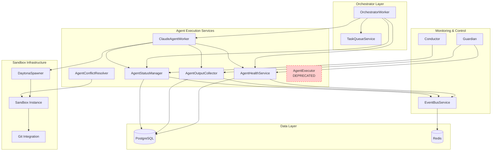
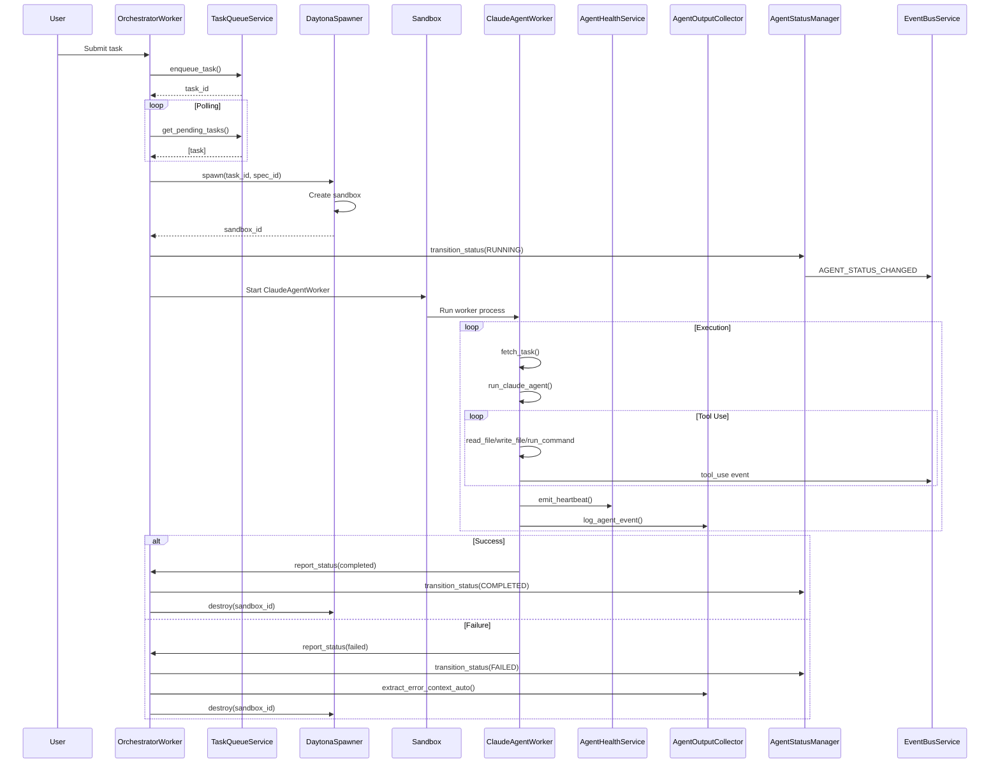

# Agent Execution System Design Document

**Created:** 2026-04-22  
**Status:** Active  
**Purpose:** Consolidated documentation for all 6 agent execution services — from task assignment to completion  
**Related Docs:** [Orchestrator Service](./orchestrator_service.md), [Sandbox Spawner](./sandbox_spawner.md), [Guardian Monitoring](./guardian_monitoring.md), [Discovery Service](./discovery_service.md), [Conductor Coherence](./conductor_coherence.md)

---

## 1. Overview

The Agent Execution System is the runtime layer of OmoiOS that manages the complete lifecycle of agent task execution. It coordinates task assignment, health monitoring, output collection, status management, and conflict resolution across isolated sandbox environments.

### 1.1 Agent Execution Lifecycle

```
┌─────────────────────────────────────────────────────────────────────────────┐
│                         AGENT EXECUTION LIFECYCLE                            │
├─────────────────────────────────────────────────────────────────────────────┤
│                                                                              │
│   ┌──────────────┐    ┌──────────────┐    ┌──────────────┐                  │
│   │   PENDING    │───▶│   QUEUED     │───▶│   RUNNING    │                  │
│   └──────────────┘    └──────────────┘    └──────────────┘                  │
│         │                   │                   │                            │
│         ▼                   ▼                   ▼                            │
│   ┌──────────────┐    ┌──────────────┐    ┌──────────────┐                  │
│   │ Orchestrator │    │   Sandbox    │    │   Claude     │                  │
│   │   Worker     │    │   Spawner    │    │Agent Worker  │                  │
│   └──────────────┘    └──────────────┘    └──────────────┘                  │
│                                              │                             │
│         ┌────────────────────────────────────┼────────────────────┐       │
│         ▼                                    ▼                    ▼       │
│   ┌──────────────┐                    ┌──────────────┐    ┌──────────────┐│
│   │Agent Health  │                    │Agent Output  │    │Agent Status  ││
│   │  Service     │                    │  Collector   │    │  Manager     ││
│   └──────────────┘                    └──────────────┘    └──────────────┘│
│                                              │                             │
│                                              ▼                             │
│   ┌──────────────┐                    ┌──────────────┐                     │
│   │Agent Conflict│◀───────────────────│  COMPLETED   │                     │
│   │  Resolver    │                    │   / FAILED   │                     │
│   └──────────────┘                    └──────────────┘                     │
│                                                                              │
└─────────────────────────────────────────────────────────────────────────────┘
```

The execution flow follows these phases:

1. **Task Assignment** — OrchestratorWorker assigns task to agent via TaskQueueService
2. **Sandbox Provisioning** — DaytonaSpawner creates isolated sandbox environment
3. **Agent Execution** — ClaudeAgentWorker runs inside sandbox with tool access
4. **Health Monitoring** — AgentHealthService tracks heartbeats and detects stale agents
5. **Output Collection** — AgentOutputCollector streams logs and events from sandbox
6. **Status Management** — AgentStatusManager enforces state machine transitions
7. **Conflict Resolution** — AgentConflictResolver handles merge conflicts using Claude Agent SDK

---

## 2. Architecture Diagram



---

## 3. Service Matrix

| Service | Responsibility | Key Methods | Status |
|---------|---------------|-------------|--------|
| **ClaudeAgentWorker** | Main execution engine using Claude Agent SDK inside sandboxes | `fetch_task()`, `run_claude_agent()`, `report_status()`, `create_agent_tools()` | **Active** |
| **AgentHealthService** | Health monitoring, heartbeat tracking, stale detection | `emit_heartbeat()`, `check_agent_health()`, `detect_stale_agents()`, `get_all_agents_health()` | **Active** |
| **AgentOutputCollector** | Output streaming from sandboxes, result aggregation, error context extraction | `get_agent_output()`, `get_sandbox_output()`, `log_agent_event()`, `extract_error_context_auto()` | **Active** |
| **AgentStatusManager** | Status transitions, state machine enforcement, audit logging | `transition_status()`, `get_transition_history()` | **Active** |
| **AgentConflictResolver** | LLM-powered conflict resolution for git merges using Claude Agent SDK | `resolve_conflict()`, `_resolve_with_sdk()`, `_resolve_fallback()` | **Active** |
| **AgentExecutor** | Legacy OpenHands-based local execution | `execute_task()`, `create_planning_executor()`, `create_execution_executor()` | **DEPRECATED** |

---

## 4. Service Details

### 4.1 ClaudeAgentWorker

**File:** `backend/omoi_os/services/claude_agent_worker.py`

The ClaudeAgentWorker is the primary agent execution engine that runs inside Daytona sandboxes. It uses the Claude Agent SDK to execute tasks with native tool support.

#### Key Features

- **Claude Agent SDK Integration**: Uses `claude-agent-sdk` for tool-using agent execution
- **Custom Tool Suite**: Provides file operations, command execution, and progress reporting
- **Event Reporting**: Reports agent events back to orchestrator for Guardian observation
- **Sandbox Native**: Designed to run inside isolated Daytona sandbox environments

#### Core Functions

```python
async def fetch_task() -> dict | None:
    """Fetch task details from orchestrator via HTTP API."""
    
async def report_status(status: str, result: str | None = None):
    """Report task status back to orchestrator."""
    
async def report_event(event_type: str, event_data: dict):
    """Report agent event for Guardian observation."""
    
async def run_claude_agent(task_description: str, workspace_dir: str = "/workspace"):
    """Run the Claude Agent SDK to complete a task."""
```

#### Custom Agent Tools

The worker creates an MCP server with these tools:

| Tool | Purpose | Parameters |
|------|---------|------------|
| `read_file` | Read file contents | `file_path: str` |
| `write_file` | Write content to file | `file_path: str, content: str` |
| `run_command` | Execute shell command | `command: str, cwd: str` |
| `list_files` | List directory contents | `directory: str` |
| `report_progress` | Report task progress | `message: str, percentage: int` |

#### Environment Configuration

```python
TASK_ID = os.environ.get("TASK_ID")
AGENT_ID = os.environ.get("AGENT_ID")
MCP_SERVER_URL = os.environ.get("MCP_SERVER_URL", "http://localhost:18000")
SANDBOX_ID = os.environ.get("SANDBOX_ID", "")
ANTHROPIC_API_KEY = os.environ.get("ANTHROPIC_API_KEY", os.environ.get("LLM_API_KEY", ""))
```

#### Agent Configuration

```python
options = ClaudeAgentOptions(
    allowed_tools=tool_names + ["Read", "Write", "Bash", "Edit", "Glob", "Grep"],
    permission_mode="bypassPermissions",  # Auto-approve in sandbox
    system_prompt=f"You are an AI coding agent working on a software development task...",
    cwd=Path(workspace_dir),
    max_turns=50,
    max_budget_usd=10.0,  # Safety limit
    model="claude-sonnet-4-5-20250929",
    mcp_servers={"workspace": tools_server},
    hooks={"PostToolUse": [HookMatcher(matcher=None, hooks=[track_tool_use])]},
)
```

---

### 4.2 AgentHealthService

**File:** `backend/omoi_os/services/agent_health.py`

**Class:** `AgentHealthService`

Monitors agent health through heartbeat tracking and stale agent detection. Integrates with AgentStatusManager for state machine enforcement.

#### Constructor

```python
def __init__(
    self, 
    db: DatabaseService, 
    status_manager: Optional[AgentStatusManager] = None
):
    """Initialize AgentHealthService.
    
    Args:
        db: Database service instance
        status_manager: Optional status manager for state machine enforcement
    """
```

#### Key Methods

```python
def emit_heartbeat(self, agent_id: str) -> bool:
    """
    Emit a heartbeat for an agent, updating last_heartbeat timestamp.
    Recovers agent from stale state if heartbeat received.
    
    Args:
        agent_id: ID of the agent to update
        
    Returns:
        True if heartbeat recorded successfully
    """

def check_agent_health(
    self, 
    agent_id: str, 
    timeout_seconds: Optional[int] = None
) -> Dict[str, any]:
    """
    Check health status of a specific agent.
    Default timeout: 90 seconds.
    
    Returns dict with:
    - agent_id, status, healthy (bool)
    - last_heartbeat (ISO format)
    - time_since_last_heartbeat (seconds)
    - health_status (healthy/stale/unknown)
    """

def detect_stale_agents(
    self, 
    timeout_seconds: Optional[int] = None
) -> List[Agent]:
    """
    Detect agents that haven't sent heartbeat within timeout.
    Updates their status to 'stale' in database.
    
    Returns list of stale Agent objects.
    """

def get_all_agents_health(
    self, 
    timeout_seconds: Optional[int] = None
) -> List[Dict[str, any]]:
    """Get health status for all agents."""

def cleanup_stale_agents(
    self, 
    timeout_seconds: Optional[int] = None, 
    mark_as: str = "timeout"
) -> int:
    """
    Mark stale agents with specific status for cleanup tracking.
    Returns number of agents marked.
    """

def get_agent_statistics(self) -> Dict[str, any]:
    """
    Get comprehensive statistics about all agents.
    
    Returns:
    - total_agents
    - by_status: dict of status counts
    - by_type: dict of agent type counts
    - by_phase: dict of phase counts
    - health_summary: {healthy, unhealthy, unknown}
    - recent_heartbeats: {last_5_minutes, last_hour, last_24_hours}
    """
```

#### Health Status Values

| Status | Description |
|--------|-------------|
| `healthy` | Agent has recent heartbeat within timeout |
| `stale` | No heartbeat received within timeout period |
| `timeout` | Agent marked for cleanup due to staleness |
| `unresponsive` | Agent not responding to health checks |
| `unknown` | No heartbeat recorded yet |

#### Default Configuration

```python
DEFAULT_HEARTBEAT_TIMEOUT = 90  # seconds
```

---

### 4.3 AgentOutputCollector

**File:** `backend/omoi_os/services/agent_output_collector.py`

**Class:** `AgentOutputCollector`

Collects agent output from multiple sources: database logs, workspace files, and sandbox events. Replaces legacy tmux-based output collection.

#### Constructor

```python
def __init__(
    self,
    db: DatabaseService,
    event_bus: Optional[EventBusService] = None,
):
    """Initialize output collector.
    
    Args:
        db: Database service for persistence
        event_bus: Optional event bus for real-time updates
    """
```

#### Key Methods

```python
def get_agent_output(
    self,
    agent_id: str,
    lines: int = 200,
    workspace_dir: Optional[str] = None,
) -> str:
    """
    Get the most recent output from an agent.
    Combines logs, workspace files, and conversation summary.
    """

def get_sandbox_output(self, sandbox_id: str, lines: int = 50) -> str:
    """
    Get recent output from sandbox events.
    Queries SandboxEvent table for agent events.
    """

def get_agent_output_auto(
    self,
    agent_id: str,
    lines: int = 200,
    workspace_dir: Optional[str] = None,
) -> str:
    """
    Automatically detect agent type and get appropriate output.
    Routes to sandbox or legacy output collection.
    """

def log_agent_event(
    self,
    agent_id: str,
    event_type: str,
    content: str,
    details: Optional[Dict[str, Any]] = None,
) -> None:
    """
    Log an agent event for trajectory analysis.
    Replaces tmux output logging with structured event system.
    """

def get_active_agents(self) -> List[Agent]:
    """
    Get list of active agents (IDLE or RUNNING status).
    Replaces tmux session enumeration.
    """

def check_agent_responsiveness(self, agent_id: str) -> bool:
    """
    Check if an agent is responsive using heartbeat and log activity.
    Returns False if no recent heartbeat (>120s) or no recent logs.
    """

def extract_error_context(self, agent_id: str) -> str:
    """
    Extract error context from agent output.
    Looks for error logs and error indicators in recent output.
    """

def extract_sandbox_error_context(self, sandbox_id: str) -> str:
    """Extract error context from sandbox events."""

def extract_error_context_auto(self, agent_id: str) -> str:
    """Automatically extract error context from appropriate source."""
```

#### Output Sources

1. **Database Logs** — AgentLog entries with types: `output`, `message`, `input`, `intervention`, `steering`
2. **Workspace Files** — `output.log`, `agent.log`, `conversation.log`, `stderr.log`, `stdout.log`
3. **Sandbox Events** — `SandboxEvent` table with event types:
   - `agent.assistant_message`
   - `agent.tool_use`
   - `agent.tool_result`
   - `agent.file_edited`
   - `agent.error`
   - `agent.completed`
   - `agent.message_injected`

---

### 4.4 AgentStatusManager

**File:** `backend/omoi_os/services/agent_status_manager.py`

**Class:** `AgentStatusManager`

Enforces agent status state machine per REQ-ALM-004. Records audit logs and emits `AGENT_STATUS_CHANGED` events.

#### Constructor

```python
def __init__(
    self,
    db: DatabaseService,
    event_bus: Optional[EventBusService] = None,
):
    """Initialize agent status manager.
    
    Args:
        db: Database service
        event_bus: Optional event bus for publishing events
    """
```

#### Key Methods

```python
def transition_status(
    self,
    agent_id: str,
    to_status: str,
    initiated_by: Optional[str] = None,
    reason: Optional[str] = None,
    task_id: Optional[str] = None,
    force: bool = False,
    metadata: Optional[dict] = None,
) -> Agent:
    """
    Transition agent to new status with validation per REQ-ALM-004.
    
    Args:
        agent_id: Agent ID
        to_status: Target status (must be valid AgentStatus value)
        initiated_by: Agent or user ID initiating transition
        reason: Optional reason for transition
        task_id: Optional task ID associated with transition
        force: Skip validation if True (guardian override)
        metadata: Optional additional context
        
    Returns:
        Updated agent
        
    Raises:
        ValueError: If agent not found or invalid status
        InvalidTransitionError: If transition is not valid
    """

def get_transition_history(
    self,
    agent_id: str,
    limit: int = 50,
) -> list[AgentStatusTransition]:
    """
    Get status transition history for an agent.
    Returns list of transitions, most recent first.
    """
```

#### State Machine

Valid transitions are defined in `omoi_os/models/agent_status.py`:

```python
class AgentStatus(Enum):
    IDLE = "idle"
    RUNNING = "running"
    PAUSED = "paused"
    COMPLETED = "completed"
    FAILED = "failed"
    STALE = "stale"
    TERMINATED = "terminated"
```

#### Event Publishing

On every status transition, publishes `AGENT_STATUS_CHANGED` event:

```python
SystemEvent(
    event_type="AGENT_STATUS_CHANGED",
    entity_type="agent",
    entity_id=str(agent.id),
    payload={
        "agent_id": str(agent.id),
        "previous_status": from_status,
        "new_status": to_status,
        "reason": reason,
        "task_id": task_id,
        "triggered_by": initiated_by,
        "timestamp": utc_now().isoformat(),
    },
)
```

#### Audit Logging

Every transition is recorded in `AgentStatusTransition` table:

```python
AgentStatusTransition(
    agent_id=agent.id,
    from_status=from_status,
    to_status=to_status,
    reason=reason,
    triggered_by=initiated_by,
    task_id=task_id,
    transition_metadata=metadata,
)
```

---

### 4.5 AgentConflictResolver

**File:** `backend/omoi_os/services/agent_conflict_resolver.py`

**Class:** `AgentConflictResolver`

LLM-powered conflict resolution for git merge conflicts using Claude Agent SDK. Runs inside Daytona sandboxes for security.

#### Data Classes

```python
@dataclass
class ResolutionContext:
    """Context for conflict resolution."""
    file_path: str
    ours_content: str
    theirs_content: str
    base_content: Optional[str] = None
    task_id: Optional[str] = None
    related_files: List[str] = field(default_factory=list)
    task_description: Optional[str] = None

@dataclass
class ResolutionResult:
    """Result of a conflict resolution attempt."""
    success: bool
    resolved_content: Optional[str] = None
    reasoning: Optional[str] = None
    error_message: Optional[str] = None
    tokens_used: int = 0
    duration_seconds: float = 0.0
```

#### Constructor

```python
def __init__(
    self,
    api_key: Optional[str] = None,
    model: str = "claude-sonnet-4-20250514",
    max_turns: int = 5,
    timeout_seconds: int = 120,
    sandbox: Optional["Sandbox"] = None,
    workspace_path: str = "/workspace",
):
    """Initialize the agent conflict resolver.
    
    Args:
        api_key: Anthropic API key (or from ANTHROPIC_API_KEY env var)
        model: Claude model to use
        max_turns: Maximum agentic turns for resolution
        timeout_seconds: Timeout for each resolution
        sandbox: Optional Daytona sandbox for isolated environment
        workspace_path: Path to workspace in sandbox
    """
```

#### Key Methods

```python
async def resolve_conflict(
    self,
    file_path: str,
    ours_content: str,
    theirs_content: str,
    base_content: Optional[str] = None,
    task_id: Optional[str] = None,
    task_description: Optional[str] = None,
    related_files: Optional[List[str]] = None,
) -> ResolutionResult:
    """
    Resolve a merge conflict using Claude Agent.
    
    Uses SDK if available, otherwise falls back to basic resolution.
    """

async def _resolve_with_sdk(self, context: ResolutionContext) -> ResolutionResult:
    """Resolve conflict using Claude Agent SDK with tool access."""

async def _resolve_fallback(self, context: ResolutionContext) -> ResolutionResult:
    """
    Fallback resolution when SDK is not available.
    Uses simple heuristics for common conflict patterns.
    """
```

#### Fallback Resolution Heuristics

1. **Empty Side** — Use non-empty side
2. **Identical Content** — Use either side
3. **Extension Pattern** — Use longer side if one extends the other
4. **Import Merging** — Combine Python imports (for `.py` files)
5. **Fail** — Return failure if no heuristic applies

#### Convenience Function

```python
def create_conflict_resolver(
    sandbox: Optional["Sandbox"] = None,
    workspace_path: str = "/workspace",
    **kwargs,
) -> AgentConflictResolver:
    """Create an AgentConflictResolver with default settings."""
```

---

### 4.6 AgentExecutor (DEPRECATED)

**File:** `backend/omoi_os/services/agent_executor.py`

**Class:** `AgentExecutor`

⚠️ **DEPRECATED as of 2025-01** — Do not use for new development.

#### Deprecation Notice

```python
"""Agent executor service wrapping OpenHands SDK for task execution.

.. deprecated:: 2025-01
    This module is DEPRECATED and should not be used for new development.

    **Why deprecated:**
    The AgentExecutor was designed for local in-process execution using the
    OpenHands SDK. This approach requires long-running worker processes that
    maintain agent state locally.

    **Current architecture (use instead):**
    Task execution now uses Daytona sandboxes via the orchestrator_worker.py:

    1. OrchestratorWorker polls TaskQueueService for pending tasks
    2. DaytonaSpawner creates isolated sandbox environments per task
    3. Sandboxes run the Claude Agent SDK worker (senior_sandbox)
    4. Results are reported back via API callbacks

    **Migration path:**
    - Use TaskQueueService to enqueue tasks
    - Let OrchestratorWorker spawn sandboxes automatically
    - Monitor via event bus (TASK_COMPLETED, TASK_FAILED events)

    See: omoi_os/workers/orchestrator_worker.py for current execution model
    See: omoi_os/services/daytona_spawner.py for sandbox spawning
"""
```

#### Migration Path

| From (AgentExecutor) | To (ClaudeAgentWorker + Orchestrator) |
|---------------------|--------------------------------------|
| `AgentExecutor(phase_id, workspace_dir)` | `TaskQueueService.enqueue_task()` + automatic sandbox spawn |
| `executor.execute_task(description)` | ClaudeAgentWorker runs automatically in sandbox |
| `executor.create_planning_executor()` | Use spec state machine (EXPLORE → REQUIREMENTS → DESIGN → TASKS) |
| `executor.create_execution_executor()` | OrchestratorWorker assigns to sandbox automatically |
| Direct OpenHands integration | Claude Agent SDK via `claude_agent_worker.py` |

#### Files Requiring Migration

- `omoi_os/worker.py` (legacy worker)
- `scripts/demo_flow.py` (demo script)
- `tests/test_04_agent_executor.py` (test file — keep for legacy testing)
- `tests/test_05_e2e_minimal.py` (e2e test)
- `examples/openhands_daytona_example.py` (example)

---

## 5. Execution Flow

### 5.1 Step-by-Step Execution Flow



### 5.2 Task Assignment Flow

1. **Task Creation** — User submits task via API
2. **Queue Insertion** — TaskQueueService adds to priority queue
3. **Orchestrator Polling** — OrchestratorWorker polls for pending tasks
4. **Agent Assignment** — Task assigned to available agent slot
5. **Sandbox Spawn** — DaytonaSpawner creates isolated environment
6. **Worker Start** — ClaudeAgentWorker process started in sandbox

### 5.3 Health Monitoring During Execution

```python
# Heartbeat emission (every 30 seconds)
agent_health.emit_heartbeat(agent_id)

# Stale detection (every 60 seconds)
stale_agents = agent_health.detect_stale_agents(timeout_seconds=90)
for agent in stale_agents:
    status_manager.transition_status(
        agent.id, 
        to_status="stale",
        reason="No heartbeat received within timeout"
    )
```

### 5.4 Output Collection Flow

```python
# Real-time output collection
output = agent_output_collector.get_agent_output_auto(
    agent_id=agent_id,
    lines=200
)

# For sandbox agents
sandbox_id = agent_output_collector.get_sandbox_id_for_agent(agent_id)
if sandbox_id:
    output = agent_output_collector.get_sandbox_output(sandbox_id, lines=50)
```

### 5.5 Status Transitions

```python
# Valid status transitions
IDLE → RUNNING      # Task assigned
RUNNING → COMPLETED # Task success
RUNNING → FAILED    # Task error
RUNNING → STALE     # Health timeout
STALE → IDLE        # Heartbeat recovered
FAILED → IDLE       # Retry scheduled
```

---

## 6. Integration Points

### 6.1 EventBus Integration

All services publish events via EventBusService:

| Service | Event Type | Payload |
|---------|-----------|---------|
| AgentStatusManager | `AGENT_STATUS_CHANGED` | `{agent_id, previous_status, new_status, reason}` |
| AgentOutputCollector | `agent.event` | `{event_type, content, details}` |
| ClaudeAgentWorker | `agent_started` | `{task, agent_id}` |
| ClaudeAgentWorker | `agent_completed` | `{success}` |
| ClaudeAgentWorker | `agent_failed` | `{error}` |
| ClaudeAgentWorker | `tool_use` | `{tool, tool_use_id}` |
| ClaudeAgentWorker | `progress` | `{message, percentage}` |
| ClaudeAgentWorker | `file_written` | `{path}` |
| ClaudeAgentWorker | `command_started` | `{command}` |

### 6.2 DaytonaSpawner Integration

```python
# Sandbox creation
sandbox = await daytona_spawner.spawn(
    spec_id=spec_id,
    task_id=task_id,
    git_repo_url=repo_url,
    branch_name=branch,
    skills=required_skills,
    continuous_mode=False,
)

# Sandbox destruction
await daytona_spawner.destroy(sandbox_id, force=False)
```

### 6.3 Guardian Integration

```python
# Guardian monitors via AgentOutputCollector
error_context = agent_output_collector.extract_error_context_auto(agent_id)

# Guardian can request status transitions via AgentStatusManager
status_manager.transition_status(
    agent_id,
    to_status="paused",
    initiated_by="guardian",
    reason="Trajectory misalignment detected",
    force=True  # Guardian override
)
```

---

## 7. Error Handling

### 7.1 Sandbox Failure Scenarios

| Scenario | Detection | Response |
|----------|-----------|----------|
| Sandbox spawn failure | Daytona API error | Retry with exponential backoff, mark task failed after max retries |
| Sandbox crash | Health check timeout | Detect via AgentHealthService, transition to FAILED |
| Resource exhaustion | ResourceMonitor alert | Throttle or kill sandbox, report to orchestrator |
| Network isolation | API timeout | Mark sandbox unhealthy, spawn replacement |

### 7.2 Health Degradation Handling

```python
# Stale agent detection
def handle_stale_agent(agent_id: str):
    health = agent_health.check_agent_health(agent_id)
    
    if not health["healthy"]:
        # Transition to stale
        status_manager.transition_status(
            agent_id,
            to_status="stale",
            reason=f"No heartbeat for {health['time_since_last_heartbeat']}s"
        )
        
        # Extract error context for analysis
        error_context = agent_output_collector.extract_error_context_auto(agent_id)
        
        # Notify Guardian
        event_bus.publish(SystemEvent(
            event_type="agent.stale_detected",
            entity_type="agent",
            entity_id=agent_id,
            payload={"error_context": error_context}
        ))
```

### 7.3 Conflict Resolution Failure

```python
# When AgentConflictResolver fails
result = await conflict_resolver.resolve_conflict(...)

if not result.success:
    # Log failure
    logger.error(f"Conflict resolution failed: {result.error_message}")
    
    # Escalate to human review
    event_bus.publish(SystemEvent(
        event_type="conflict.resolution_failed",
        entity_type="task",
        entity_id=task_id,
        payload={
            "file_path": file_path,
            "error": result.error_message,
            "requires_human_review": True
        }
    ))
```

---

## 8. Configuration

### 8.1 Environment Variables

| Variable | Default | Description |
|----------|---------|-------------|
| `ANTHROPIC_API_KEY` | — | Claude Agent SDK API key |
| `LLM_API_KEY` | — | Fallback API key |
| `MCP_SERVER_URL` | `http://localhost:18000` | Orchestrator API endpoint |
| `TASK_ID` | — | Current task ID (set in sandbox) |
| `AGENT_ID` | — | Current agent ID (set in sandbox) |
| `SANDBOX_ID` | — | Daytona sandbox ID |
| `OMOIOS_ENV` | `development` | Environment name |

### 8.2 YAML Configuration

```yaml
# config/base.yaml
agent_execution:
  # Health monitoring
  heartbeat_interval_seconds: 30
  stale_timeout_seconds: 90
  health_check_interval_seconds: 60
  
  # Agent limits
  max_turns: 50
  max_budget_usd: 10.0
  default_model: "claude-sonnet-4-5-20250929"
  
  # Conflict resolution
  conflict_resolution:
    max_turns: 5
    timeout_seconds: 120
    model: "claude-sonnet-4-20250514"
  
  # Output collection
  output:
    max_lines: 200
    sandbox_event_limit: 50
    log_retention_hours: 24
```

### 8.3 Database Schema

Key tables used by agent execution services:

```sql
-- Agent registry
CREATE TABLE agents (
    id UUID PRIMARY KEY DEFAULT gen_random_uuid(),
    agent_type VARCHAR(50) NOT NULL,
    phase_id VARCHAR(50),
    status VARCHAR(50) NOT NULL DEFAULT 'idle',
    health_status VARCHAR(50),
    last_heartbeat TIMESTAMP WITH TIME ZONE,
    capabilities JSONB,
    created_at TIMESTAMP WITH TIME ZONE DEFAULT NOW(),
    updated_at TIMESTAMP WITH TIME ZONE DEFAULT NOW()
);

-- Agent status transitions (audit log)
CREATE TABLE agent_status_transitions (
    id UUID PRIMARY KEY DEFAULT gen_random_uuid(),
    agent_id UUID NOT NULL REFERENCES agents(id) ON DELETE CASCADE,
    from_status VARCHAR(50) NOT NULL,
    to_status VARCHAR(50) NOT NULL,
    reason TEXT,
    triggered_by VARCHAR(100),
    task_id UUID,
    transition_metadata JSONB,
    transitioned_at TIMESTAMP WITH TIME ZONE DEFAULT NOW()
);

-- Agent logs
CREATE TABLE agent_logs (
    id UUID PRIMARY KEY DEFAULT gen_random_uuid(),
    agent_id UUID NOT NULL REFERENCES agents(id) ON DELETE CASCADE,
    log_type VARCHAR(50) NOT NULL,  -- output, message, input, error, etc.
    message TEXT NOT NULL,
    details JSONB,
    created_at TIMESTAMP WITH TIME ZONE DEFAULT NOW()
);

-- Sandbox events
CREATE TABLE sandbox_events (
    id UUID PRIMARY KEY DEFAULT gen_random_uuid(),
    sandbox_id VARCHAR(255) NOT NULL,
    event_type VARCHAR(100) NOT NULL,
    event_data JSONB,
    created_at TIMESTAMP WITH TIME ZONE DEFAULT NOW()
);

-- Indexes
CREATE INDEX idx_agents_status ON agents(status);
CREATE INDEX idx_agents_heartbeat ON agents(last_heartbeat);
CREATE INDEX idx_agent_logs_agent_time ON agent_logs(agent_id, created_at DESC);
CREATE INDEX idx_sandbox_events_sandbox_time ON sandbox_events(sandbox_id, created_at DESC);
```

---

## 9. Related Documentation

| Document | Purpose |
|----------|---------|
| [Orchestrator Service](./orchestrator_service.md) | Task dispatch and execution coordination |
| [Sandbox Spawner](./sandbox_spawner.md) | Daytona sandbox lifecycle management |
| [Guardian Monitoring](./guardian_monitoring.md) | Trajectory analysis and intervention |
| [Discovery Service](./discovery_service.md) | Adaptive workflow branching |
| [Conductor Coherence](./conductor_coherence.md) | Multi-agent coherence detection |
| [Agent Registry](./agent_registry.md) | Agent registration and capabilities |
| [Task Queue](./task_queue.md) | Priority task queue system |
| [Phase Manager](./phase_manager.md) | Spec phase state machine |

---

## 10. Performance Characteristics

| Metric | Target | Notes |
|--------|--------|-------|
| Task dispatch latency | < 100ms | From QUEUED to RUNNING |
| Heartbeat processing | < 10ms | Per heartbeat emission |
| Output collection latency | < 50ms | For 200 lines |
| Status transition | < 20ms | With audit logging |
| Conflict resolution | < 120s | Including LLM calls |
| Stale detection | < 90s | From missed heartbeat |
| Sandbox spawn time | < 30s | From request to ready |

---

## 11. Security Considerations

1. **Sandbox Isolation** — All agent code runs in isolated Daytona sandboxes
2. **API Key Management** — Keys injected via environment variables, never logged
3. **Tool Permissions** — ClaudeAgentWorker uses `bypassPermissions` mode inside sandbox only
4. **Budget Limits** — `$10.00 USD` max budget per agent execution
5. **Timeout Enforcement** — Hard limits on execution time and tool timeouts (300s for commands)
6. **No Secret Exposure** — Secrets never passed to sandbox environments
7. **Audit Logging** — All status transitions and agent events logged

---

*Document Version: 1.0*  
*Last Updated: 2026-04-22*  
*Maintainer: OmoiOS Core Team*
