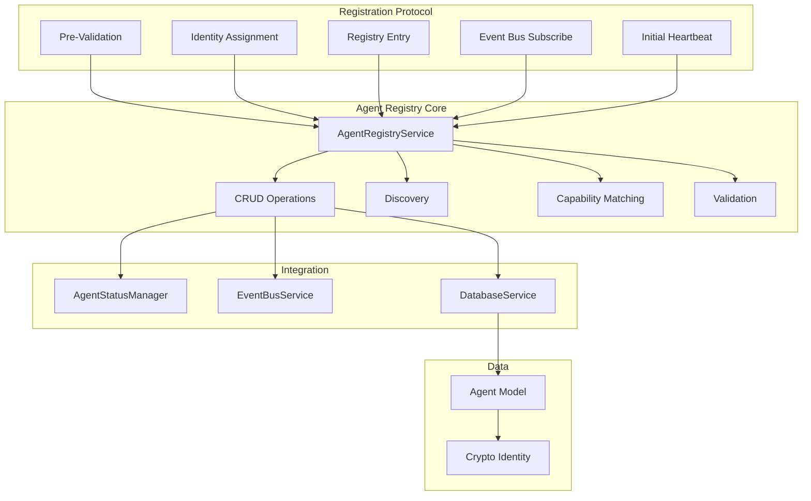
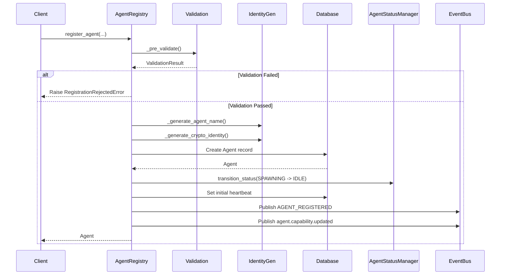
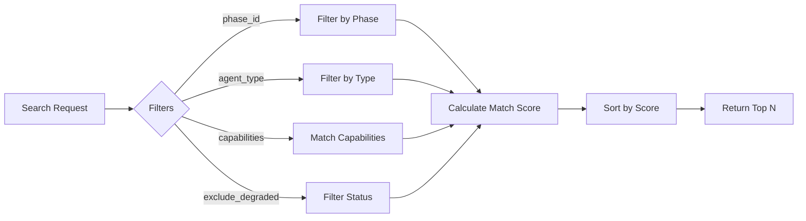
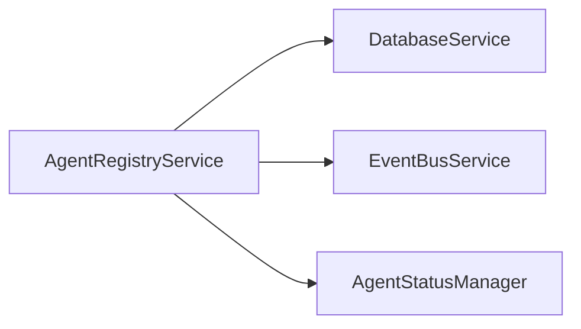

# Agent Registry Service Design Document

**Created:** 2026-04-22  
**Status:** Active  
**Purpose:** Capability-aware agent registry and discovery with multi-step registration protocol  
**Related Docs:** [Orchestrator Service](./orchestrator_service.md), [Monitor Service](./monitor_service.md), [Phase Manager](./phase_manager.md)

---

## 1. Architecture Overview

The AgentRegistryService provides CRUD operations, capability updates, and discovery for agents. It implements a multi-step registration protocol (REQ-ALM-001) with pre-validation, identity assignment, and cryptographic identity generation.

### 1.1 High-Level Architecture



### 1.2 Registration Flow



### 1.3 Discovery Flow



---

## 2. Component Responsibilities

| Component | Responsibility | Key Operations |
|-----------|---------------|----------------|
| **AgentRegistryService** | Main service orchestrating agent lifecycle | `register_agent()`, `update_agent()`, `search_agents()` |
| **Registration Protocol** | Multi-step registration per REQ-ALM-001 | `_pre_validate()`, `_generate_agent_name()`, `_generate_crypto_identity()` |
| **CRUD Operations** | Create, read, update, delete agents | `register_agent()`, `update_agent()`, `toggle_availability()` |
| **Discovery Engine** | Search and match agents | `search_agents()`, `find_best_agent()`, `_calculate_match()` |
| **Capability Manager** | Track and match capabilities | `_normalize_tokens()`, `_publish_capability_event()` |
| **Status Integrator** | Integration with AgentStatusManager | Status transitions during registration |

---

## 3. System Boundaries

### 3.1 Inside System Boundaries

- Multi-step registration protocol (5 steps)
- Pre-registration validation (binary, version, config, resources)
- Identity generation (UUID, name, crypto keys)
- Capability-aware agent discovery
- Match scoring with availability/health/capacity bonuses
- Event bus subscription during registration
- Initial heartbeat timestamp setting

### 3.2 Outside System Boundaries

- Actual agent process spawning (handled by OrchestratorWorker)
- Agent heartbeat monitoring (handled by AgentHealthService)
- Agent execution (handled by AgentExecutor)
- Sandbox management (handled by DaytonaSpawner)
- Private key distribution (noted as production consideration)

---

## 4. Data Models

### 4.1 Database Schema

```sql
-- Agent model
CREATE TABLE agents (
    id UUID PRIMARY KEY DEFAULT gen_random_uuid(),
    agent_name VARCHAR(255) NOT NULL,
    agent_type VARCHAR(100) NOT NULL,
    phase_id VARCHAR(50),
    status VARCHAR(50) NOT NULL DEFAULT 'spawning',
    
    -- Capabilities and metadata
    capabilities JSONB DEFAULT '[]',
    tags JSONB,
    capacity INTEGER DEFAULT 1,
    
    -- Health and monitoring
    health_status VARCHAR(50) DEFAULT 'healthy',
    anomaly_score DOUBLE PRECISION DEFAULT 0.0,
    consecutive_anomalous_readings INTEGER DEFAULT 0,
    last_heartbeat TIMESTAMP WITH TIME ZONE,
    
    -- Cryptographic identity
    crypto_public_key TEXT,
    crypto_identity_metadata JSONB,
    
    -- Registration info
    registered_by VARCHAR(255),
    agent_metadata JSONB,  -- version, binary_path, config, resources
    
    created_at TIMESTAMP WITH TIME ZONE DEFAULT NOW(),
    updated_at TIMESTAMP WITH TIME ZONE DEFAULT NOW()
);

-- Indexes for discovery
CREATE INDEX idx_agents_type ON agents(agent_type);
CREATE INDEX idx_agents_phase ON agents(phase_id);
CREATE INDEX idx_agents_status ON agents(status) 
WHERE status NOT IN ('terminated', 'quarantined', 'failed');

-- GIN index for capabilities (for capability search)
CREATE INDEX idx_agents_capabilities ON agents USING GIN(capabilities);
```

### 4.2 Pydantic Models

```python
from pydantic import BaseModel, Field
from dataclasses import dataclass
from typing import Optional, List, Dict, Any

@dataclass(frozen=True)
class AgentMatch:
    """Discovery result wrapper."""
    agent: "Agent"  # SQLAlchemy model
    match_score: float
    matched_capabilities: List[str]

@dataclass
class ValidationResult:
    """Result of pre-registration validation per REQ-ALM-001 Step 1."""
    success: bool
    reason: Optional[str] = None
    details: Optional[Dict[str, Any]] = None

@dataclass
class RegistrationRejectedError(Exception):
    """Raised when agent registration is rejected."""
    reason: str
    details: Optional[Dict[str, Any]] = None

class AgentRegistrationRequest(BaseModel):
    """Request to register a new agent."""
    agent_type: str
    phase_id: Optional[str]
    capabilities: List[str]
    capacity: int = Field(default=1, ge=1)
    status: str = "idle"
    tags: Optional[List[str]] = None
    config: Optional[Dict[str, Any]] = None
    resource_requirements: Optional[Dict[str, Any]] = None
    binary_path: Optional[str] = None
    version: Optional[str] = None

class AgentUpdateRequest(BaseModel):
    """Request to update agent metadata."""
    capabilities: Optional[List[str]] = None
    capacity: Optional[int] = Field(default=None, ge=1)
    status: Optional[str] = None
    tags: Optional[List[str]] = None
    health_status: Optional[str] = None

class AgentSearchRequest(BaseModel):
    """Request to search for agents."""
    required_capabilities: Optional[List[str]] = None
    phase_id: Optional[str] = None
    agent_type: Optional[str] = None
    limit: int = Field(default=5, ge=1, le=100)
    include_degraded: bool = False

class AgentMatchResult(BaseModel):
    """Result of agent discovery."""
    agent_id: str
    agent_name: str
    agent_type: str
    match_score: float
    matched_capabilities: List[str]
    status: str
    health_status: str
    capacity: int
```

### 4.3 Agent Status Enum

```python
from enum import StrEnum

class AgentStatus(StrEnum):
    """Agent lifecycle statuses per REQ-ALM-004."""
    SPAWNING = "spawning"  # Initial state during registration
    IDLE = "idle"  # Ready for task assignment
    RUNNING = "running"  # Executing a task
    DEGRADED = "degraded"  # Unavailable/unhealthy
    QUARANTINED = "quarantined"  # Isolated due to anomalies
    TERMINATED = "terminated"  # Gracefully shut down
    FAILED = "failed"  # Crashed or error state
```

---

## 5. API Surface

### 5.1 Service Methods

| Method | Signature | Description |
|--------|-----------|-------------|
| `register_agent` | `(agent_type, phase_id, capabilities, capacity=1, status="idle", tags=None, config=None, resource_requirements=None, binary_path=None, version=None) -> Agent` | Multi-step registration protocol |
| `update_agent` | `(agent_id, capabilities=None, capacity=None, status=None, tags=None, health_status=None) -> Optional[Agent]` | Update mutable agent metadata |
| `toggle_availability` | `(agent_id, available) -> Optional[Agent]` | Mark agent available/unavailable |
| `search_agents` | `(required_capabilities=None, phase_id=None, agent_type=None, limit=5, include_degraded=False) -> List[dict]` | Search with capability matching |
| `find_best_agent` | `(required_capabilities=None, phase_id=None, agent_type=None) -> Optional[dict]` | Return top-ranked agent |

### 5.2 Internal Methods

| Method | Purpose |
|--------|---------|
| `_pre_validate` | Pre-registration validation (binary, version, config, resources) |
| `_generate_agent_name` | Generate human-readable name: `{type}-{phase}-{sequence}` |
| `_generate_crypto_identity` | Generate RSA key pair for agent |
| `_calculate_match` | Calculate match score with bonuses |
| `_normalize_tokens` | Normalize capability/tag strings |
| `_publish_capability_event` | Publish capability update event |
| `_subscribe_to_event_bus` | Subscribe agent to relevant channels |
| `_get_orchestrator_identifier` | Get orchestrator instance ID |

### 5.3 FastAPI Routes

```python
# Routes typically found in api/routes/agents.py
@router.post("/agents")
async def register_agent(
    request: AgentRegistrationRequest,
    registry: AgentRegistryService = Depends(get_agent_registry)
):
    """Register a new agent."""
    try:
        agent = registry.register_agent(**request.dict())
        return agent
    except RegistrationRejectedError as e:
        raise HTTPException(400, detail=e.reason)

@router.put("/agents/{agent_id}")
async def update_agent(
    agent_id: str,
    request: AgentUpdateRequest,
    registry: AgentRegistryService = Depends(get_agent_registry)
):
    """Update agent metadata."""
    agent = registry.update_agent(agent_id, **request.dict(exclude_unset=True))
    if not agent:
        raise HTTPException(404, detail="Agent not found")
    return agent

@router.post("/agents/search")
async def search_agents(
    request: AgentSearchRequest,
    registry: AgentRegistryService = Depends(get_agent_registry)
):
    """Search for agents by capabilities."""
    matches = registry.search_agents(**request.dict())
    return {"matches": matches}

@router.get("/agents/best")
async def find_best_agent(
    required_capabilities: Optional[List[str]] = None,
    phase_id: Optional[str] = None,
    agent_type: Optional[str] = None,
    registry: AgentRegistryService = Depends(get_agent_registry)
):
    """Find best matching agent."""
    match = registry.find_best_agent(
        required_capabilities=required_capabilities,
        phase_id=phase_id,
        agent_type=agent_type
    )
    if not match:
        raise HTTPException(404, detail="No matching agent found")
    return match
```

---

## 6. Integration Points

### 6.1 Services Called By AgentRegistryService



| Service | Purpose | Key Methods Used |
|---------|---------|------------------|
| **DatabaseService** | Persistence for agents | `get_session()` |
| **EventBusService** | Publishing registration/capability events | `publish()` |
| **AgentStatusManager** | Status transitions | `transition_status()` |

### 6.2 Services That Call AgentRegistryService

| Service | Purpose |
|---------|---------|
| **OrchestratorWorker** | Agent discovery for task assignment |
| **API Routes** | User/agent-initiated registration |
| **Agent Spawner** | Registration after spawning agents |

### 6.3 Event Types

| Event | Direction | Purpose |
|-------|-----------|---------|
| `AGENT_REGISTERED` | Published | New agent registered |
| `agent.capability.updated` | Published | Agent capabilities changed |

---

## 7. Configuration Parameters

### 7.1 YAML Configuration

```yaml
# config/base.yaml
agent_registry:
  # Registration settings
  registration:
    initial_heartbeat_timeout: 60  # seconds
    default_capacity: 1
    
  # Discovery settings
  discovery:
    default_limit: 5
    max_limit: 100
    availability_bonus: 0.2
    health_bonus: 0.2
    capacity_bonus_multiplier: 0.05
    
  # Cryptographic identity
  crypto:
    enabled: true
    key_size: 2048
    algorithm: RSA
```

### 7.2 Environment Variables

| Variable | Default | Description |
|----------|---------|-------------|
| `AGENT_REGISTRATION_TIMEOUT` | 60 | Initial heartbeat timeout seconds |
| `AGENT_CRYPTO_ENABLED` | true | Enable crypto identity generation |
| `AGENT_CRYPTO_KEY_SIZE` | 2048 | RSA key size |

### 7.3 Code-Level Configuration

```python
# Match scoring weights
AVAILABILITY_BONUS = 0.2  # If status is idle
HEALTH_BONUS = 0.2  # If health_status is healthy
CAPACITY_BONUS_MULTIPLIER = 0.05  # Per capacity unit, max 5 units

# Name generation pattern
NAME_PATTERN = "{type}-{phase}-{sequence:03d}"

# Initial status
DEFAULT_STATUS = AgentStatus.IDLE
INITIAL_STATUS = AgentStatus.SPAWNING
```

---

## 8. Error Handling

### 8.1 Error Categories

| Category | Examples | Handling Strategy |
|----------|----------|-------------------|
| **Validation** | Binary not found, invalid config | Raise RegistrationRejectedError |
| **Crypto** | cryptography lib not available | Log warning, continue without crypto |
| **Database** | Connection error, constraint violation | Raise exception |
| **Status** | Invalid status transition | Log warning, fallback to direct update |
| **Not Found** | Agent not found for update | Return None |

### 8.2 Error Handling Patterns

```python
# Validation error
validation = self._pre_validate(...)
if not validation.success:
    raise RegistrationRejectedError(
        reason=validation.reason or "Pre-validation failed",
        details=validation.details,
    )

# Crypto error (graceful degradation)
if not CRYPTOGRAPHY_AVAILABLE:
    logger.warning("cryptography library not available")
    return {
        "public_key": None,
        "metadata": {"error": "cryptography library not installed"},
    }

try:
    # Generate keys
    pass
except Exception as e:
    logger.warning(f"Could not generate cryptographic identity: {e}")
    return {
        "public_key": None,
        "metadata": {"error": str(e)},
    }

# Status manager fallback
if self.status_manager:
    try:
        return self.status_manager.transition_status(...)
    except Exception:
        # Fallback to direct update
        pass
return self.update_agent(agent_id, status=new_status)
```

---

## 9. Performance Characteristics

| Metric | Target | Notes |
|--------|--------|-------|
| Registration | < 500ms | Includes crypto generation |
| Discovery query | < 50ms | Indexed database query |
| Match calculation | < 10ms | In-memory scoring |
| Capability update | < 100ms | Database + event publish |

---

## 10. Future Enhancements

1. **Agent Templates** - Pre-defined agent configurations
2. **Auto-Scaling** - Dynamic agent pool sizing
3. **Health Checks** - Proactive health verification
4. **Agent Groups** - Logical grouping for bulk operations
5. **Registration Webhooks** - External system notifications
6. **Agent Metrics** - Registration success rates, discovery latency

---

*Document Version: 1.0*  
*Last Updated: 2026-04-22*  
*Maintainer: OmoiOS Core Team*
