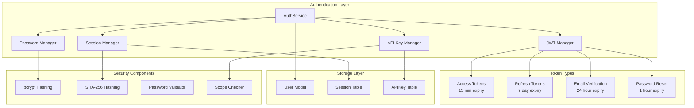
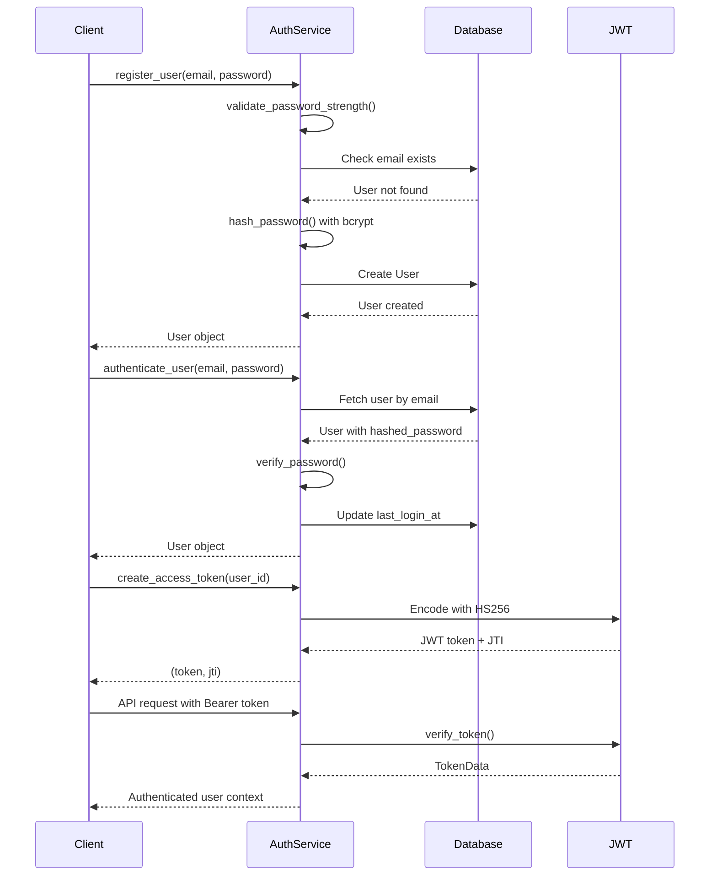
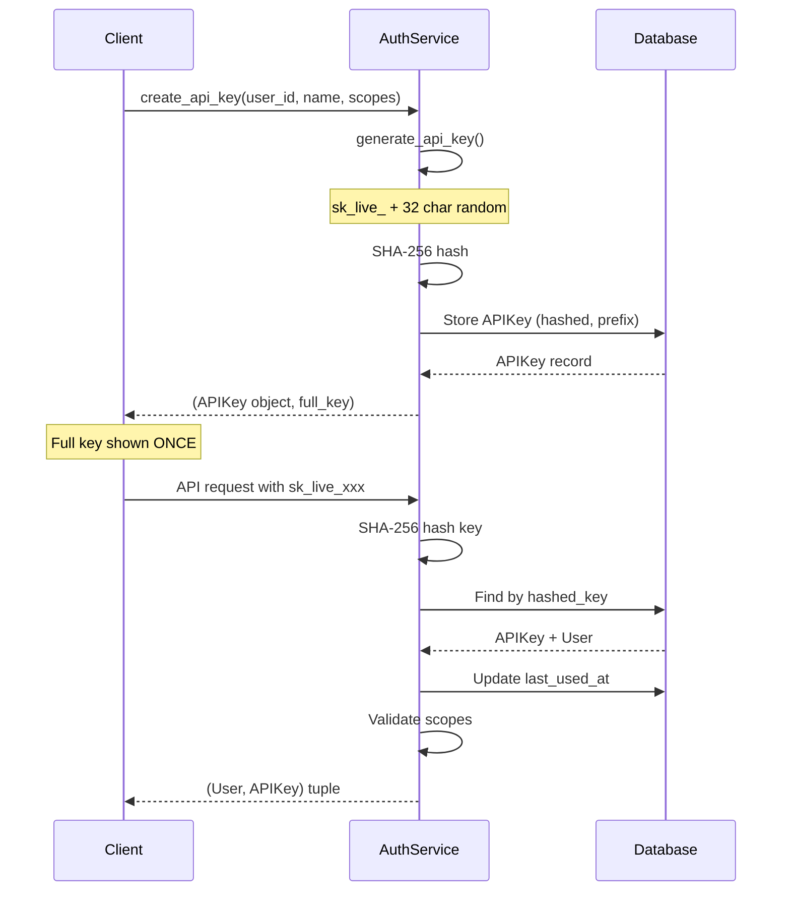
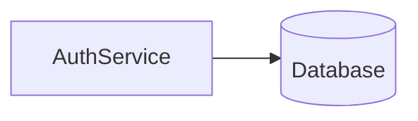

# Authentication Service Design Document

**Created:** 2026-04-22  
**Status:** Active  
**Source File:** `backend/omoi_os/services/auth_service.py`  
**Related Docs:** **User Model**, **Session Model**, [API Security](../../architecture/07-auth-and-security.md)

---

## 1. Architecture Overview

The Authentication Service provides comprehensive identity management and access control for OmoiOS. It handles user registration, password-based authentication, JWT token lifecycle management, session tracking, and API key-based service authentication. The service implements defense-in-depth security patterns including bcrypt password hashing, SHA-256 token hashing, configurable token expiration, and scope-based access control.

### 1.1 High-Level Architecture



### 1.2 Authentication Flow



### 1.3 API Key Authentication Flow



---

## 2. Component Responsibilities

| Component | Responsibility | Key Operations |
|-----------|---------------|----------------|
| **AuthService** | Main service orchestrating all authentication flows | `register_user()`, `authenticate_user()`, `create_access_token()`, `verify_token()` |
| **JWT Manager** | Creates and validates JWT tokens with configurable expiration | `create_access_token()`, `create_refresh_token()`, `verify_token()` |
| **Session Manager** | Handles browser/session-based authentication | `create_session()`, `verify_session_token()`, `invalidate_session()`, `cleanup_expired_sessions()` |
| **API Key Manager** | Manages service-to-service API authentication | `generate_api_key()`, `create_api_key()`, `verify_api_key()`, `revoke_api_key()` |
| **Password Manager** | Secure password hashing and verification | `hash_password()`, `verify_password()`, `validate_password_strength()` |
| **Token Verifier** | Validates specialized tokens (email, reset) | `create_verification_token()`, `verify_email()`, `create_reset_token()`, `reset_password()` |

---

## 3. System Boundaries

### 3.1 Inside System Boundaries

- User registration with waitlist integration (direct approval mode)
- Password-based authentication with bcrypt hashing
- JWT access tokens (15-minute default expiry) with HS256 signing
- JWT refresh tokens (7-day default expiry) for session continuity
- Browser session management with token hashing (SHA-256)
- API key generation and verification with scope-based access control
- Email verification token lifecycle (24-hour expiry)
- Password reset token lifecycle (1-hour expiry)
- Password strength validation with complexity requirements
- Session cleanup for expired tokens

### 3.2 Outside System Boundaries

- Email delivery (handled by external email service)
- OAuth provider integration (GitHub, Google - handled by separate OAuth service)
- Multi-factor authentication (MFA/TOTP)
- Rate limiting (handled by middleware/rate limiter service)
- Audit logging (handled by separate audit service)
- RBAC permission enforcement (handled by API middleware)

---

## 4. Data Models

### 4.1 Database Schema

```sql
-- Users table with authentication fields
CREATE TABLE users (
    id UUID PRIMARY KEY DEFAULT gen_random_uuid(),
    email VARCHAR(255) UNIQUE NOT NULL,
    hashed_password VARCHAR(255),
    full_name VARCHAR(255),
    department VARCHAR(100),
    is_verified BOOLEAN DEFAULT FALSE,
    is_active BOOLEAN DEFAULT TRUE,
    is_super_admin BOOLEAN DEFAULT FALSE,
    waitlist_status VARCHAR(50) DEFAULT 'approved',
    waitlist_metadata JSONB,
    last_login_at TIMESTAMP WITH TIME ZONE,
    deleted_at TIMESTAMP WITH TIME ZONE,
    created_at TIMESTAMP WITH TIME ZONE DEFAULT NOW(),
    updated_at TIMESTAMP WITH TIME ZONE DEFAULT NOW()
);

-- Sessions for browser-based auth
CREATE TABLE sessions (
    id UUID PRIMARY KEY DEFAULT gen_random_uuid(),
    user_id UUID NOT NULL REFERENCES users(id) ON DELETE CASCADE,
    token_hash VARCHAR(64) NOT NULL,  -- SHA-256 hash
    ip_address VARCHAR(45),
    user_agent TEXT,
    expires_at TIMESTAMP WITH TIME ZONE NOT NULL,
    created_at TIMESTAMP WITH TIME ZONE DEFAULT NOW()
);

CREATE INDEX idx_sessions_token_hash ON sessions(token_hash);
CREATE INDEX idx_sessions_user_id ON sessions(user_id);
CREATE INDEX idx_sessions_expires_at ON sessions(expires_at);

-- API Keys for service authentication
CREATE TABLE api_keys (
    id UUID PRIMARY KEY DEFAULT gen_random_uuid(),
    user_id UUID NOT NULL REFERENCES users(id) ON DELETE CASCADE,
    organization_id UUID REFERENCES organizations(id) ON DELETE CASCADE,
    name VARCHAR(255) NOT NULL,
    key_prefix VARCHAR(16) NOT NULL,  -- First 16 chars for identification
    hashed_key VARCHAR(64) NOT NULL,  -- SHA-256 hash of full key
    scopes JSONB DEFAULT '[]',
    is_active BOOLEAN DEFAULT TRUE,
    expires_at TIMESTAMP WITH TIME ZONE,
    last_used_at TIMESTAMP WITH TIME ZONE,
    created_at TIMESTAMP WITH TIME ZONE DEFAULT NOW()
);

CREATE INDEX idx_api_keys_hashed_key ON api_keys(hashed_key);
CREATE INDEX idx_api_keys_user_id ON api_keys(user_id);
CREATE INDEX idx_api_keys_org_id ON api_keys(organization_id);
```

### 4.2 Pydantic Models

```python
from pydantic import BaseModel, Field
from typing import Optional, List
from uuid import UUID
from datetime import datetime

class TokenData(BaseModel):
    """Decoded JWT token payload structure."""
    user_id: UUID
    token_type: str
    jti: Optional[str] = None  # JWT ID for token revocation
    iat: Optional[float] = None  # Issued at timestamp
    exp: Optional[float] = None  # Expiration timestamp

class UserAuthResponse(BaseModel):
    """User authentication response."""
    id: UUID
    email: str
    full_name: Optional[str]
    is_verified: bool
    is_active: bool
    access_token: str
    refresh_token: str
    token_type: str = "bearer"

class APIKeyCreateRequest(BaseModel):
    """Request to create new API key."""
    name: str = Field(..., min_length=1, max_length=255)
    scopes: List[str] = Field(default_factory=list)
    organization_id: Optional[UUID] = None
    expires_in_days: Optional[int] = Field(None, ge=1, le=365)

class APIKeyResponse(BaseModel):
    """API key response (full key only shown on creation)."""
    id: UUID
    name: str
    key_prefix: str
    scopes: List[str]
    is_active: bool
    expires_at: Optional[datetime]
    last_used_at: Optional[datetime]
    created_at: datetime

class PasswordStrengthResult(BaseModel):
    """Password validation result."""
    is_valid: bool
    error_message: Optional[str] = None
    strength_score: int = Field(0, ge=0, le=5)  # 0-5 strength rating

class SessionInfo(BaseModel):
    """Session metadata."""
    id: UUID
    ip_address: Optional[str]
    user_agent: Optional[str]
    expires_at: datetime
    created_at: datetime
```

### 4.3 Service Configuration

```python
from dataclasses import dataclass
from typing import Optional

@dataclass
class AuthServiceConfig:
    """Configuration for AuthService."""
    jwt_secret: str  # From AUTH_JWT_SECRET_KEY env var
    jwt_algorithm: str = "HS256"
    access_token_expire_minutes: int = 15
    refresh_token_expire_days: int = 7
    
    # Password policy
    min_password_length: int = 8
    require_uppercase: bool = True
    require_lowercase: bool = True
    require_digit: bool = True
    require_special: bool = True
    
    # Session policy
    session_expire_days: int = 7
    
    # API Key policy
    api_key_prefix: str = "sk_live_"
    default_api_key_expiry_days: Optional[int] = None  # None = no expiry
```

---

## 5. API Surface

### 5.1 Authentication Methods

| Method | Signature | Description |
|--------|-----------|-------------|
| `register_user` | `(email, password, full_name=None, department=None, waitlist_metadata=None) -> User` | Register new user with password validation |
| `authenticate_user` | `(email, password) -> Optional[User]` | Validate credentials and update last_login |
| `get_user_by_id` | `(user_id: UUID) -> Optional[User]` | Fetch active user by ID |
| `get_user_by_email` | `(email: str) -> Optional[User]` | Fetch user by email (including inactive) |

### 5.2 JWT Token Methods

| Method | Signature | Description |
|--------|-----------|-------------|
| `create_access_token` | `(user_id: UUID, expires_delta=None) -> Tuple[str, str]` | Create short-lived access token (token, jti) |
| `create_refresh_token` | `(user_id: UUID, expires_delta=None) -> Tuple[str, str]` | Create long-lived refresh token (token, jti) |
| `verify_token` | `(token: str, token_type="access") -> Optional[TokenData]` | Decode and validate JWT token |

### 5.3 Session Methods

| Method | Signature | Description |
|--------|-----------|-------------|
| `create_session` | `(user_id, ip_address=None, user_agent=None) -> Session` | Create browser session with hashed token |
| `verify_session_token` | `(token: str) -> Optional[User]` | Validate session and return user |
| `invalidate_session` | `(session_id: UUID) -> None` | Delete session by ID |
| `cleanup_expired_sessions` | `() -> None` | Batch delete expired sessions |

### 5.4 API Key Methods

| Method | Signature | Description |
|--------|-----------|-------------|
| `generate_api_key` | `() -> Tuple[str, str, str]` | Generate (full_key, prefix, hashed_key) |
| `create_api_key` | `(user_id, name, scopes=None, org_id=None, expires_in_days=None) -> Tuple[APIKey, str]` | Create API key (returns full key once) |
| `verify_api_key` | `(key: str) -> Optional[Tuple[User, APIKey]]` | Validate API key and return user/key |
| `revoke_api_key` | `(key_id: UUID) -> None` | Deactivate API key |

### 5.5 Password Methods

| Method | Signature | Description |
|--------|-----------|-------------|
| `hash_password` | `(password: str) -> str` | bcrypt hash password |
| `verify_password` | `(plain: str, hashed: str) -> bool` | Verify bcrypt hash |
| `validate_password_strength` | `(password: str) -> Tuple[bool, Optional[str]]` | Check complexity requirements |

### 5.6 Email Verification & Password Reset

| Method | Signature | Description |
|--------|-----------|-------------|
| `create_verification_token` | `(user_id: UUID) -> Tuple[str, str]` | Create email verification token |
| `verify_email` | `(token: str) -> bool` | Mark user as verified |
| `create_reset_token` | `(user_id: UUID) -> Tuple[str, str]` | Create password reset token (1hr expiry) |
| `reset_password` | `(token: str, new_password: str) -> bool` | Reset password and invalidate sessions |

### 5.7 FastAPI Route Integration

```python
from fastapi import APIRouter, Depends, HTTPException, status
from fastapi.security import HTTPBearer, HTTPAuthorizationCredentials

security = HTTPBearer()

@router.post("/auth/register")
async def register(
    email: str,
    password: str,
    auth_service: AuthService = Depends(get_auth_service)
):
    """Register new user account."""
    try:
        user = await auth_service.register_user(email, password)
        return {"id": user.id, "email": user.email}
    except ValueError as e:
        raise HTTPException(400, detail=str(e))

@router.post("/auth/login")
async def login(
    email: str,
    password: str,
    auth_service: AuthService = Depends(get_auth_service)
):
    """Authenticate and return tokens."""
    user = await auth_service.authenticate_user(email, password)
    if not user:
        raise HTTPException(401, detail="Invalid credentials")
    
    access_token, _ = auth_service.create_access_token(user.id)
    refresh_token, _ = auth_service.create_refresh_token(user.id)
    
    return {
        "access_token": access_token,
        "refresh_token": refresh_token,
        "token_type": "bearer"
    }

@router.post("/auth/refresh")
async def refresh_token(
    refresh_token: str,
    auth_service: AuthService = Depends(get_auth_service)
):
    """Refresh access token using refresh token."""
    token_data = auth_service.verify_token(refresh_token, "refresh")
    if not token_data:
        raise HTTPException(401, detail="Invalid refresh token")
    
    access_token, _ = auth_service.create_access_token(token_data.user_id)
    return {"access_token": access_token, "token_type": "bearer"}

async def get_current_user(
    credentials: HTTPAuthorizationCredentials = Depends(security),
    auth_service: AuthService = Depends(get_auth_service)
) -> User:
    """Dependency to extract current user from JWT."""
    token = credentials.credentials
    token_data = auth_service.verify_token(token, "access")
    if not token_data:
        raise HTTPException(401, detail="Invalid token")
    
    user = await auth_service.get_user_by_id(token_data.user_id)
    if not user:
        raise HTTPException(401, detail="User not found")
    return user

@router.get("/auth/me")
async def get_me(current_user: User = Depends(get_current_user)):
    """Get current authenticated user."""
    return current_user

@router.post("/auth/api-keys")
async def create_api_key(
    name: str,
    scopes: list[str] = None,
    current_user: User = Depends(get_current_user),
    auth_service: AuthService = Depends(get_auth_service)
):
    """Create new API key for service authentication."""
    api_key, full_key = await auth_service.create_api_key(
        user_id=current_user.id,
        name=name,
        scopes=scopes
    )
    return {
        "id": api_key.id,
        "name": api_key.name,
        "key": full_key,  # Shown ONLY on creation
        "prefix": api_key.key_prefix,
        "scopes": api_key.scopes,
        "expires_at": api_key.expires_at
    }
```

---

## 6. Integration Points

### 6.1 Services Called By AuthService



| Service | Purpose | Key Methods Used |
|---------|---------|------------------|
| **Database (SQLAlchemy)** | User, Session, APIKey persistence | `execute()`, `commit()`, `refresh()` |
| **bcrypt** | Password hashing | `hashpw()`, `checkpw()` |
| **python-jose** | JWT encoding/decoding | `jwt.encode()`, `jwt.decode()` |
| **secrets** | Cryptographic token generation | `token_urlsafe()` |
| **hashlib** | Token hashing for storage | `sha256()` |

### 6.2 Services That Call AuthService

| Service | Purpose |
|---------|---------|
| **API Route Handlers** | User registration, login, token refresh |
| **API Middleware** | JWT validation on protected routes |
| **WebSocket Handlers** | Authenticate connection upgrades |
| **Background Workers** | Service-to-service API key auth |
| **OAuth Service** | User linking after OAuth flow |
| **Admin Service** | User management operations |

### 6.3 Event Types

| Event | Direction | Purpose |
|-------|-----------|---------|
| `user.registered` | Published | New user created |
| `user.authenticated` | Published | Successful login |
| `user.password_changed` | Published | Password updated |
| `api_key.created` | Published | New API key issued |
| `api_key.revoked` | Published | API key deactivated |
| `session.created` | Published | New browser session |
| `session.invalidated` | Published | Session logged out |

---

## 7. Configuration Parameters

### 7.1 Environment Variables

| Variable | Default | Description |
|----------|---------|-------------|
| `AUTH_JWT_SECRET_KEY` | **Required** | Secret key for JWT signing (HS256) |
| `AUTH_JWT_ALGORITHM` | HS256 | JWT algorithm (HS256, HS384, HS512) |
| `AUTH_ACCESS_TOKEN_EXPIRE_MINUTES` | 15 | Access token lifetime |
| `AUTH_REFRESH_TOKEN_EXPIRE_DAYS` | 7 | Refresh token lifetime |
| `AUTH_SESSION_EXPIRE_DAYS` | 7 | Browser session lifetime |
| `AUTH_MIN_PASSWORD_LENGTH` | 8 | Minimum password length |
| `AUTH_REQUIRE_PASSWORD_COMPLEXITY` | true | Enforce complexity rules |

### 7.2 Password Complexity Rules

```python
# Enforced by validate_password_strength()
RULES = {
    "min_length": 8,
    "require_uppercase": True,      # At least one A-Z
    "require_lowercase": True,      # At least one a-z
    "require_digit": True,          # At least one 0-9
    "require_special": True,        # At least one !@#$%^&*...
    "block_common": True,           # Reject common passwords
}

# Blocked common passwords (case-insensitive)
BLOCKED_PASSWORDS = {
    "password", "12345678", "qwerty123",
    "password1", "password123", "admin123",
    # ... 25+ common passwords blocked
}
```

### 7.3 Token Lifetimes

| Token Type | Default Lifetime | Use Case |
|------------|------------------|----------|
| Access Token | 15 minutes | API authentication |
| Refresh Token | 7 days | Session continuity |
| Email Verification | 24 hours | Email confirmation |
| Password Reset | 1 hour | Password recovery |
| Browser Session | 7 days | Web app sessions |
| API Key | Configurable | Service-to-service |

---

## 8. Error Handling

### 8.1 Error Categories

| Category | Examples | Handling Strategy |
|----------|----------|-------------------|
| **Validation** | Weak password, invalid email | Return (False, error_message) tuple |
| **Authentication** | Wrong password, invalid token | Return None or raise HTTPException(401) |
| **Conflict** | Email already exists | Raise ValueError with clear message |
| **Token Expired** | JWT exp claim passed | Return None from verify_token |
| **Token Revoked** | JTI in blocklist | Check against revocation list |
| **Database** | Connection failure | Propagate exception, rollback transaction |

### 8.2 Error Handling Patterns

```python
# Password validation with detailed feedback
def validate_password_strength(self, password: str) -> Tuple[bool, Optional[str]]:
    if len(password) < 8:
        return False, "Password must be at least 8 characters"
    if not any(c.isupper() for c in password):
        return False, "Password must contain at least one uppercase letter"
    # ... additional checks
    return True, None

# Token verification with graceful failure
def verify_token(self, token: str, token_type: str = "access") -> Optional[TokenData]:
    try:
        payload = jwt.decode(token, self.jwt_secret, algorithms=[self.jwt_algorithm])
        # Validate token type
        if payload.get("type") != token_type:
            return None
        return TokenData(...)
    except (JWTError, ValueError, KeyError):
        return None  # Graceful failure for invalid tokens

# Registration with conflict detection
async def register_user(self, email: str, password: str, ...) -> User:
    # Check if user exists
    result = await self.db.execute(select(User).where(User.email == email))
    if result.scalar_one_or_none():
        raise ValueError("Email already registered")
    # ... create user
```

### 8.3 Security Error Handling

```python
# Password reset invalidates all sessions
async def reset_password(self, token: str, new_password: str) -> bool:
    token_data = self.verify_token(token, "password_reset")
    if not token_data:
        return False
    
    # Update password
    await self.db.execute(
        update(User)
        .where(User.id == token_data.user_id)
        .values(hashed_password=self.hash_password(new_password))
    )
    
    # SECURITY: Invalidate all sessions for this user
    await self.db.execute(
        delete(Session).where(Session.user_id == token_data.user_id)
    )
    await self.db.commit()
    return True
```

---

## 9. Security Considerations

### 9.1 Password Security

- **bcrypt** with default work factor (adaptive)
- Per-user salt (handled by bcrypt)
- Complexity requirements enforced
- Common password blacklist
- No plaintext password storage

### 9.2 Token Security

- **JWT**: HS256 signing with 256-bit secret
- **Sessions**: SHA-256 hash stored, raw token never persisted
- **API Keys**: SHA-256 hash stored, prefix for identification
- Short-lived access tokens (15 min)
- Refresh token rotation recommended
- JTI (JWT ID) for future revocation support

### 9.3 Session Security

- Automatic expiration cleanup
- IP address and user agent tracking
- Single session invalidation on password reset
- Secure token generation via `secrets.token_urlsafe()`

---

## 10. Performance Characteristics

| Metric | Target | Notes |
|--------|--------|-------|
| Password hash | ~100ms | bcrypt adaptive cost |
| Password verify | ~100ms | bcrypt comparison |
| JWT encode | < 1ms | HS256 symmetric |
| JWT decode/verify | < 1ms | Signature validation |
| API key hash | < 1ms | SHA-256 |
| Database query | < 10ms | Indexed lookups |
| Session cleanup | Batch | Run periodically |

---

## 11. Future Enhancements

1. **Token Revocation List** - Maintain JTI blocklist for logout
2. **Refresh Token Rotation** - Issue new refresh on each use
3. **Multi-Factor Authentication** - TOTP/SMS support
4. **OAuth Integration** - Native GitHub/Google OAuth
5. **SSO/SAML** - Enterprise single sign-on
6. **Rate Limiting** - Built-in rate limit tracking
7. **Device Fingerprinting** - Enhanced session security
8. **Audit Logging** - Comprehensive auth event logging

---

*Document Version: 1.0*  
*Last Updated: 2026-04-22*  
*Maintainer: OmoiOS Core Team*

