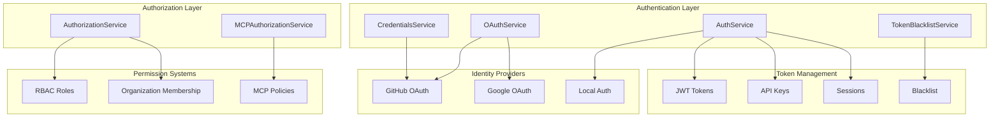
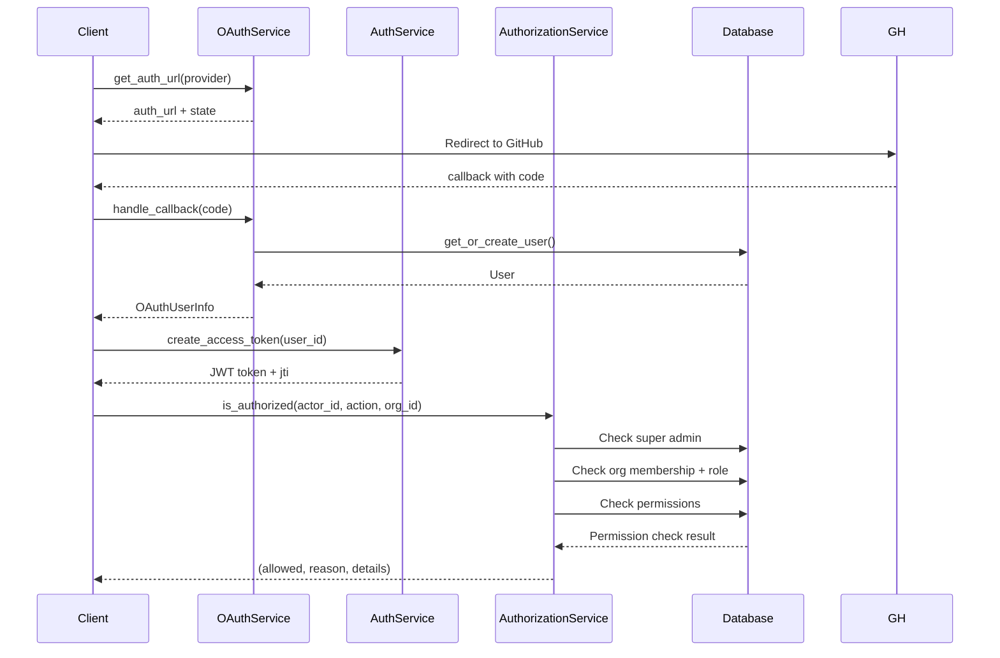
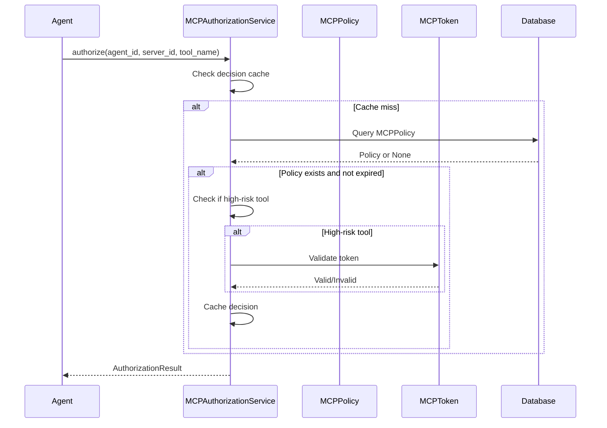
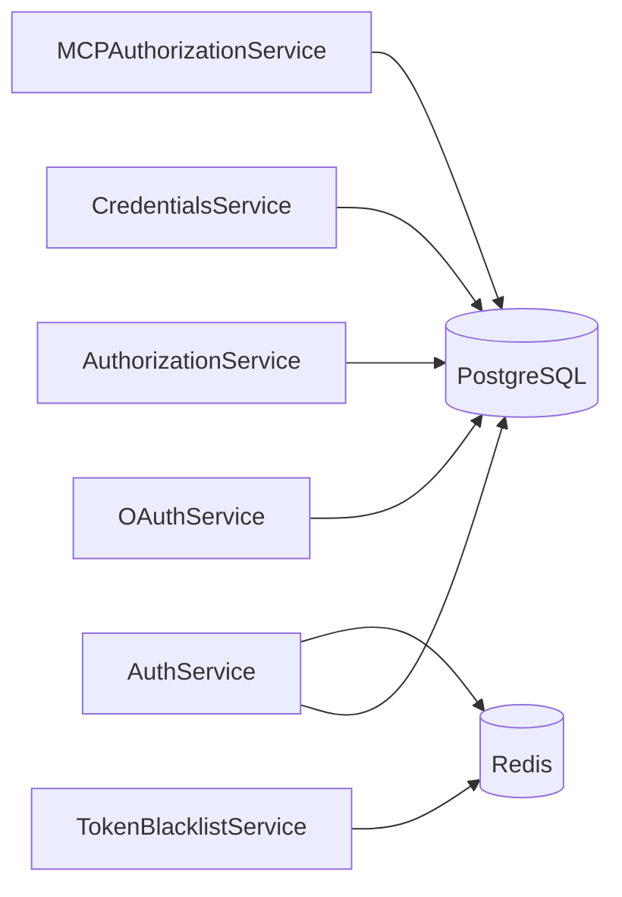

# Authentication & Authorization System Design Document

**Created:** 2026-04-22  
**Status:** Active  
**Purpose:** Comprehensive identity management, access control, and security enforcement for OmoiOS  
**Related Docs:** [Auth Service](./auth_service.md), [API Security](../../architecture/07-auth-and-security.md), [OAuth Integration](../integration/oauth_integration.md)

---

## 1. Architecture Overview

The Authentication & Authorization System provides end-to-end security for OmoiOS, spanning from initial user authentication through OAuth providers to fine-grained RBAC permission enforcement and MCP tool authorization. The system follows defense-in-depth principles with multiple security layers.

### 1.1 High-Level Architecture



### 1.2 Complete Authentication Flow



### 1.3 MCP Authorization Flow



---

## 2. Component Responsibilities

| Component | Responsibility | Key Operations |
|-----------|---------------|----------------|
| **OAuthService** | OAuth flow orchestration for GitHub/Google | `get_auth_url()`, `handle_callback()`, `get_or_create_user()`, `connect_provider_to_user()` |
| **AuthService** | Core authentication, JWT, sessions, API keys | `register_user()`, `authenticate_user()`, `create_access_token()`, `verify_token()`, `create_api_key()` |
| **AuthorizationService** | RBAC permission checking with role inheritance | `is_authorized()`, `get_user_permissions()`, `_check_org_rbac()`, `_has_permission()` |
| **CredentialsService** | Secure credential storage with fallback | `get_anthropic_credentials()`, `get_github_credentials()`, `save_user_credential()` |
| **TokenBlacklistService** | Token revocation and account lockout | `blacklist_token()`, `is_blacklisted()`, `record_failed_login()`, `is_locked_out()` |
| **MCPAuthorizationService** | Per-agent, per-tool authorization | `authorize()`, `grant_permission()`, `revoke_permission()`, `_validate_token()` |

---

## 3. System Boundaries

### 3.1 Inside System Boundaries

- OAuth 2.0 flow implementation for GitHub and Google
- JWT access/refresh token lifecycle management (HS256)
- Session-based authentication with SHA-256 token hashing
- API key generation and verification with scope-based access
- RBAC permission checking with wildcard support (`org:*`, `*:*`)
- Role inheritance hierarchy (parent roles → child roles)
- Token blacklist for logout/revocation (Redis-backed)
- Account lockout after failed login attempts
- MCP tool authorization with time-bounded tokens
- High-risk tool detection (write, delete, modify patterns)
- User credential storage with system fallback
- OAuth token refresh and disconnect

### 3.2 Outside System Boundaries

- Email delivery (handled by external service)
- MFA/TOTP (not implemented)
- SAML/SSO enterprise auth (not implemented)
- Rate limiting (handled by middleware)
- Audit logging persistence (Redis only, external for archive)
- Credit card processing (Stripe handles PCI)
- Raw card data handling (never touches our servers)

---

## 4. Data Models

### 4.1 Database Schema

```sql
-- Users with OAuth attributes
CREATE TABLE users (
    id UUID PRIMARY KEY DEFAULT gen_random_uuid(),
    email VARCHAR(255) UNIQUE NOT NULL,
    hashed_password VARCHAR(255),
    full_name VARCHAR(255),
    is_verified BOOLEAN DEFAULT FALSE,
    is_active BOOLEAN DEFAULT TRUE,
    is_super_admin BOOLEAN DEFAULT FALSE,
    attributes JSONB,  -- OAuth tokens: github_access_token, etc.
    last_login_at TIMESTAMP WITH TIME ZONE,
    created_at TIMESTAMP WITH TIME ZONE DEFAULT NOW()
);

-- Organizations and membership
CREATE TABLE organizations (
    id UUID PRIMARY KEY DEFAULT gen_random_uuid(),
    name VARCHAR(255) NOT NULL,
    slug VARCHAR(255) UNIQUE NOT NULL,
    owner_id UUID REFERENCES users(id),
    billing_email VARCHAR(255),
    created_at TIMESTAMP WITH TIME ZONE DEFAULT NOW()
);

-- Roles with permission arrays
CREATE TABLE roles (
    id UUID PRIMARY KEY DEFAULT gen_random_uuid(),
    name VARCHAR(100) NOT NULL,
    permissions JSONB DEFAULT '[]',  -- ["org:read", "project:write"]
    inherits_from UUID REFERENCES roles(id),
    organization_id UUID REFERENCES organizations(id),
    created_at TIMESTAMP WITH TIME ZONE DEFAULT NOW()
);

-- Organization membership links users to roles
CREATE TABLE organization_memberships (
    id UUID PRIMARY KEY DEFAULT gen_random_uuid(),
    user_id UUID REFERENCES users(id) ON DELETE CASCADE,
    agent_id UUID REFERENCES agents(id) ON DELETE CASCADE,
    organization_id UUID REFERENCES organizations(id) ON DELETE CASCADE,
    role_id UUID REFERENCES roles(id),
    joined_at TIMESTAMP WITH TIME ZONE DEFAULT NOW(),
    CHECK (user_id IS NOT NULL OR agent_id IS NOT NULL)
);

-- User credentials for external APIs
CREATE TABLE user_credentials (
    id UUID PRIMARY KEY DEFAULT gen_random_uuid(),
    user_id UUID REFERENCES users(id) ON DELETE CASCADE,
    provider VARCHAR(50) NOT NULL,  -- 'anthropic', 'openai', 'github'
    api_key VARCHAR(255) NOT NULL,
    base_url VARCHAR(255),
    model VARCHAR(100),
    name VARCHAR(255),
    config_data JSONB,  -- Additional provider-specific config
    is_default BOOLEAN DEFAULT TRUE,
    is_active BOOLEAN DEFAULT TRUE,
    created_at TIMESTAMP WITH TIME ZONE DEFAULT NOW()
);

-- MCP authorization policies
CREATE TABLE mcp_policies (
    id UUID PRIMARY KEY DEFAULT gen_random_uuid(),
    agent_id VARCHAR(255) NOT NULL,
    server_id VARCHAR(255) NOT NULL,
    tool_name VARCHAR(255) NOT NULL,
    actions JSONB DEFAULT '[]',  -- ["read", "write"]
    granted_by VARCHAR(255),
    expires_at TIMESTAMP WITH TIME ZONE,
    created_at TIMESTAMP WITH TIME ZONE DEFAULT NOW(),
    UNIQUE(agent_id, server_id, tool_name)
);

-- MCP time-bounded tokens
CREATE TABLE mcp_tokens (
    id UUID PRIMARY KEY DEFAULT gen_random_uuid(),
    token_id VARCHAR(255) UNIQUE NOT NULL,
    agent_id VARCHAR(255) NOT NULL,
    server_id VARCHAR(255) NOT NULL,
    tool_name VARCHAR(255) NOT NULL,
    expires_at TIMESTAMP WITH TIME ZONE NOT NULL,
    revoked BOOLEAN DEFAULT FALSE,
    created_at TIMESTAMP WITH TIME ZONE DEFAULT NOW()
);

-- Sessions for browser auth
CREATE TABLE sessions (
    id UUID PRIMARY KEY DEFAULT gen_random_uuid(),
    user_id UUID REFERENCES users(id) ON DELETE CASCADE,
    token_hash VARCHAR(64) NOT NULL,  -- SHA-256
    ip_address VARCHAR(45),
    user_agent TEXT,
    expires_at TIMESTAMP WITH TIME ZONE NOT NULL
);

-- API keys for service auth
CREATE TABLE api_keys (
    id UUID PRIMARY KEY DEFAULT gen_random_uuid(),
    user_id UUID REFERENCES users(id) ON DELETE CASCADE,
    organization_id UUID REFERENCES organizations(id) ON DELETE CASCADE,
    name VARCHAR(255) NOT NULL,
    key_prefix VARCHAR(16) NOT NULL,
    hashed_key VARCHAR(64) NOT NULL,  -- SHA-256
    scopes JSONB DEFAULT '[]',
    is_active BOOLEAN DEFAULT TRUE,
    expires_at TIMESTAMP WITH TIME ZONE,
    last_used_at TIMESTAMP WITH TIME ZONE
);
```

### 4.2 Pydantic Models

```python
from pydantic import BaseModel, Field
from typing import Optional, List, Dict, Any
from uuid import UUID
from enum import Enum

class ActorType(str, Enum):
    """Type of actor (user or agent)."""
    USER = "user"
    AGENT = "agent"

class TokenData(BaseModel):
    """Decoded JWT token payload."""
    user_id: UUID
    token_type: str
    jti: Optional[str] = None
    iat: Optional[float] = None

class OAuthUserInfo(BaseModel):
    """User info from OAuth provider."""
    provider: str
    provider_user_id: str
    email: str
    name: Optional[str]
    avatar_url: Optional[str]
    access_token: str
    refresh_token: Optional[str]
    raw_data: Dict[str, Any]

class AuthorizationResult(BaseModel):
    """Result of authorization check."""
    allowed: bool
    reason: str
    details: Dict[str, Any]
    matched_roles: List[str]
    evaluation_order: List[str]

class PolicyDecision(str, Enum):
    """Authorization decision."""
    ALLOW = "ALLOW"
    DENY = "DENY"

class AuthorizationResultMCP:
    """Result of MCP authorization check."""
    def __init__(
        self,
        decision: PolicyDecision,
        cached: bool = False,
        reason: str = "",
        token_required: bool = False
    ):
        self.decision = decision
        self.cached = cached
        self.reason = reason
        self.token_required = token_required

class PolicyGrant:
    """Policy grant for agent-tool access."""
    def __init__(
        self,
        agent_id: str,
        server_id: str,
        tool_name: str,
        actions: List[str],
        token_ttl: timedelta = timedelta(minutes=15),
        token_id: Optional[str] = None
    ):
        self.agent_id = agent_id
        self.server_id = server_id
        self.tool_name = tool_name
        self.actions = actions
        self.token_ttl = token_ttl
        self.token_id = token_id

class AnthropicCredentials:
    """Container for Anthropic API credentials."""
    api_key: str
    oauth_token: Optional[str] = None
    base_url: Optional[str] = None
    model: Optional[str] = None
    max_tokens: int = 16384
    context_length: int = 128000
    source: str = "config"  # "config" or "user"

class GitHubCredentials:
    """Container for GitHub credentials."""
    access_token: Optional[str] = None
    username: Optional[str] = None
    source: str = "config"  # "config", "user", or "oauth"
```

---

## 5. API Surface

### 5.1 OAuth Service Methods

| Method | Signature | Description |
|--------|-----------|-------------|
| `get_available_providers` | `() -> list[dict]` | List configured OAuth providers |
| `get_auth_url` | `(provider_name: str) -> Tuple[str, str]` | Get OAuth URL + state for login |
| `get_connect_auth_url` | `(provider_name: str, user_id: UUID) -> Tuple[str, str]` | Get OAuth URL for connecting to existing user |
| `handle_callback` | `(provider_name: str, code: str) -> Optional[OAuthUserInfo]` | Exchange code for user info |
| `get_or_create_user` | `(oauth_info: OAuthUserInfo) -> User` | Find or create user from OAuth |
| `connect_provider_to_user` | `(user_id: UUID, oauth_info: OAuthUserInfo) -> bool` | Link OAuth to existing user |
| `disconnect_provider` | `(user_id: UUID, provider: str) -> bool` | Remove OAuth connection |
| `verify_state` | `(state: str, provider_name: str) -> bool` | Verify OAuth state parameter |
| `verify_state_and_get_mode` | `(state: str, provider_name: str) -> Tuple[bool, Optional[UUID]]` | Verify state and detect login vs connect |

### 5.2 Authorization Service Methods

| Method | Signature | Description |
|--------|-----------|-------------|
| `is_authorized` | `(actor_id, actor_type, action, org_id, resource_type=None, resource_id=None) -> Tuple[bool, str, Dict]` | Main authorization check |
| `get_user_permissions` | `(user_id: UUID, organization_id: UUID) -> List[str]` | Get all permissions for user |
| `is_organization_member` | `(actor_id, actor_type, organization_id) -> bool` | Check membership |
| `is_organization_owner` | `(user_id: UUID, organization_id: UUID) -> bool` | Check ownership |
| `get_user_organizations` | `(user_id: UUID) -> List[Dict]` | List user's orgs with roles |

### 5.3 Credentials Service Methods

| Method | Signature | Description |
|--------|-----------|-------------|
| `get_anthropic_credentials` | `(user_id: Optional[UUID]) -> AnthropicCredentials` | Get Anthropic creds with fallback |
| `get_github_credentials` | `(user_id: Optional[UUID]) -> GitHubCredentials` | Get GitHub OAuth token |
| `get_user_credential` | `(user_id: UUID, provider: str) -> Optional[UserCredential]` | Get specific credential |
| `save_user_credential` | `(user_id, provider, api_key, ...) -> UserCredential` | Save/update credential |
| `delete_user_credential` | `(user_id: UUID, provider: str) -> bool` | Remove credential |
| `get_sandbox_env_vars` | `(user_id, project_id) -> Dict[str, str]` | Get env vars for sandbox |
| `check_default_credentials` | `() -> Dict[str, bool]` | Check which defaults are configured |

### 5.4 Token Blacklist Service Methods

| Method | Signature | Description |
|--------|-----------|-------------|
| `blacklist_token` | `(jti: str, ttl_seconds: int) -> None` | Add token JTI to blacklist |
| `is_blacklisted` | `(jti: str) -> bool` | Check if token is blacklisted |
| `blacklist_all_user_tokens` | `(user_id: str, ttl_seconds=86400) -> None` | Invalidate all user tokens |
| `is_user_blacklisted_since` | `(user_id: str, token_iat: float) -> bool` | Check if tokens before time are invalid |
| `record_failed_login` | `(email: str, window_seconds=900) -> int` | Record failed attempt, return count |
| `get_failed_login_count` | `(email: str) -> int` | Get current failed count |
| `clear_failed_logins` | `(email: str) -> None` | Reset failed count on success |
| `is_locked_out` | `(email: str, max_attempts=5) -> bool` | Check if account locked |
| `log_auth_event` | `(event_type, user_id, email, ip, details) -> None` | Log auth event for audit |

### 5.5 MCP Authorization Service Methods

| Method | Signature | Description |
|--------|-----------|-------------|
| `authorize` | `(agent_id, server_id, tool_name, require_token=False) -> AuthorizationResult` | Check if agent can use tool |
| `grant_permission` | `(agent_id, server_id, tool_name, actions, granted_by, token_ttl, expires_at) -> PolicyGrant` | Grant tool permission |
| `revoke_permission` | `(agent_id, server_id, tool_name) -> None` | Remove permission |
| `list_agent_permissions` | `(agent_id: str) -> List[PolicyGrant]` | List all agent permissions |
| `_validate_token` | `(agent_id, server_id, tool_name) -> bool` | Check for valid time-bounded token |
| `_is_high_risk_tool` | `(server_id, tool_name) -> bool` | Detect high-risk operations |

---

## 6. Integration Points

### 6.1 Services Called By Auth System



| Service | Purpose | Key Methods Used |
|---------|---------|------------------|
| **PostgreSQL** | User, role, membership, credential persistence | `execute()`, `commit()`, `refresh()` |
| **Redis** | Token blacklist, failed login tracking, auth audit | `setex()`, `get()`, `delete()`, `pipeline()` |
| **bcrypt** | Password hashing | `hashpw()`, `checkpw()` |
| **python-jose** | JWT encoding/decoding | `jwt.encode()`, `jwt.decode()` |
| **stripe** | OAuth state verification | `Webhook.construct_event()` |

### 6.2 Services That Call Auth System

| Service | Purpose |
|---------|---------|
| **API Route Handlers** | User registration, login, OAuth callback |
| **API Middleware** | JWT validation, permission checking |
| **OrchestratorWorker** | Agent authentication, credential injection |
| **Sandbox Spawner** | Fetch credentials for sandbox environment |
| **MCP Tool Registry** | Tool invocation authorization |
| **Billing Service** | Organization access validation |

### 6.3 Event Types

| Event | Direction | Purpose |
|-------|-----------|---------|
| `user.registered` | Published | New user created |
| `user.authenticated` | Published | Successful login |
| `user.password_changed` | Published | Password updated |
| `oauth.connected` | Published | OAuth provider linked |
| `oauth.disconnected` | Published | OAuth provider unlinked |
| `api_key.created` | Published | New API key issued |
| `api_key.revoked` | Published | API key deactivated |
| `mcp.permission.granted` | Published | Tool permission granted |
| `mcp.permission.revoked` | Published | Tool permission revoked |
| `auth.failed` | Published | Failed authentication attempt |
| `auth.locked_out` | Published | Account locked due to failures |

---

## 7. Configuration Parameters

### 7.1 Environment Variables

| Variable | Default | Description |
|----------|---------|-------------|
| `AUTH_JWT_SECRET_KEY` | **Required** | Secret key for JWT signing |
| `AUTH_JWT_ALGORITHM` | HS256 | JWT algorithm |
| `AUTH_ACCESS_TOKEN_EXPIRE_MINUTES` | 15 | Access token lifetime |
| `AUTH_REFRESH_TOKEN_EXPIRE_DAYS` | 7 | Refresh token lifetime |
| `GITHUB_CLIENT_ID` | Optional | GitHub OAuth app ID |
| `GITHUB_CLIENT_SECRET` | Optional | GitHub OAuth secret |
| `GOOGLE_CLIENT_ID` | Optional | Google OAuth client ID |
| `GOOGLE_CLIENT_SECRET` | Optional | Google OAuth secret |
| `ANTHROPIC_API_KEY` | Optional | Default Anthropic API key |
| `CLAUDE_CODE_OAUTH_TOKEN` | Optional | Claude Code OAuth token |
| `STRIPE_WEBHOOK_SECRET` | Optional | Stripe webhook verification |

### 7.2 OAuth Configuration

```yaml
# config/base.yaml
auth:
  jwt_algorithm: HS256
  access_token_expire_minutes: 15
  refresh_token_expire_days: 7
  
  oauth:
    github:
      client_id: "${GITHUB_CLIENT_ID}"
      client_secret: "${GITHUB_CLIENT_SECRET}"
      scopes: ["read:user", "user:email", "repo"]
    
    google:
      client_id: "${GOOGLE_CLIENT_ID}"
      client_secret: "${GOOGLE_CLIENT_SECRET}"
      scopes: ["openid", "email", "profile"]
    
    # Redirect URIs
    oauth_redirect_uri: "http://localhost:3000/auth/callback"
    oauth_backend_url: "http://localhost:18000"  # Optional override
```

### 7.3 Permission Wildcard Patterns

```python
# Supported permission patterns
PERMISSION_PATTERNS = {
    "exact": "project:read",           # Exact match
    "wildcard_resource": "project:*",   # All project actions
    "wildcard_namespace": "*:*",      # All permissions (super admin)
    "hierarchical": "org:read"        # Matches org:read:subresource
}

# Examples
_has_permission(["org:*"], "org:read")        # True
_has_permission(["project:read"], "project:write")  # False
_has_permission(["*:*"], "anything")            # True
```

---

## 8. Error Handling

### 8.1 Error Categories

| Category | Examples | Handling Strategy |
|----------|----------|-------------------|
| **OAuth** | Invalid state, code exchange failure | Return None, log warning |
| **Authorization** | No matching role, permission denied | Return (False, reason, details) |
| **Token** | Expired JWT, blacklisted JTI | Return None from verify |
| **Credentials** | Missing API key, invalid format | Return empty credentials object |
| **Lockout** | Too many failed attempts | Return 429, require cooldown |
| **MCP Auth** | No policy, expired token | Return DENY with reason |

### 8.2 OAuth Error Handling

```python
def handle_callback(self, provider_name: str, code: str) -> Optional[OAuthUserInfo]:
    """Handle OAuth callback with error handling."""
    config = self.settings.get_provider_config(provider_name)
    if not config:
        logger.error(f"Provider {provider_name} not configured")
        return None
    
    try:
        provider = get_provider(...)
        return await provider.exchange_code(code)
    except OAuthError as e:
        logger.warning(f"OAuth exchange failed: {e}")
        return None
```

### 8.3 Authorization Error Handling

```python
async def is_authorized(self, actor_id, actor_type, action, org_id, ...):
    """Authorization with detailed error context."""
    details = {
        "matched_roles": [],
        "evaluation_order": [],
        "actor_type": actor_type.value
    }
    
    # 1. Check super admin
    if actor_type == ActorType.USER:
        user = await self.db.execute(select(User).where(User.id == actor_id))
        if user and user.is_super_admin:
            details["evaluation_order"].append("super_admin")
            return True, "Authorized as super admin", details
    
    # 2. Check RBAC
    rbac_check = await self._check_org_rbac(actor_id, actor_type, org_id, action)
    if rbac_check["allowed"]:
        details["matched_roles"] = rbac_check["roles"]
        details["evaluation_order"].append("org_role")
        return True, f"Authorized via role: {', '.join(rbac_check['roles'])}", details
    
    # 3. Default deny
    return False, "No matching authorization found", details
```

---

## 9. Security Considerations

### 9.1 OAuth Security

- **State parameter**: Cryptographically random state stored in Redis (600s TTL)
- **PKCE**: Not yet implemented (recommended for mobile)
- **Token storage**: OAuth tokens encrypted in user.attributes JSONB
- **Scope validation**: Request minimal scopes needed
- **Disconnect**: Full token removal on disconnect

### 9.2 RBAC Security

- **Default deny**: No access without explicit grant
- **Role inheritance**: Parent role permissions cascade to children
- **Wildcard support**: `org:*` grants all org permissions
- **Super admin**: Bypasses all checks (users only)
- **Agent actors**: Agents can have organization memberships with roles

### 9.3 MCP Authorization Security

- **Default deny**: Tools blocked without explicit policy
- **Time-bounded tokens**: 15-minute TTL for high-risk tools
- **High-risk detection**: Pattern-based (write, delete, modify)
- **Policy expiration**: Optional expiration on grants
- **Token revocation**: All tokens revoked when permission revoked
- **Decision caching**: 5-minute cache with TTL

### 9.4 Token Security

- **JWT**: HS256 with 256-bit secret
- **Blacklist**: Redis-backed with automatic expiry
- **Account lockout**: 5 failed attempts = 15-minute lockout
- **Session hashing**: SHA-256, raw token never stored
- **API key hashing**: SHA-256, prefix for identification

---

## 10. Performance Characteristics

| Metric | Target | Notes |
|--------|--------|-------|
| OAuth callback | < 500ms | Code exchange + user lookup |
| Authorization check | < 50ms | Cached roles, indexed lookups |
| JWT verify | < 1ms | HS256 symmetric |
| Permission check | < 5ms | Wildcard matching |
| MCP authorize | < 10ms | With cache hit |
| Token blacklist | < 5ms | Redis lookup |
| Failed login tracking | < 5ms | Redis increment |

---

## 11. Future Enhancements

1. **PKCE Support** - OAuth PKCE for mobile apps
2. **MFA/TOTP** - Time-based one-time passwords
3. **SAML/SSO** - Enterprise single sign-on
4. **RBAC UI** - Visual role and permission management
5. **API Key Scopes** - Fine-grained API key permissions
6. **Session Management** - View and revoke active sessions
7. **Audit Log** - Persistent auth event logging
8. **Rate Limiting** - Built-in rate limit per endpoint

---

*Document Version: 1.0*  
*Last Updated: 2026-04-22*  
*Maintainer: OmoiOS Core Team*
