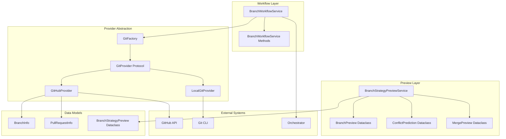
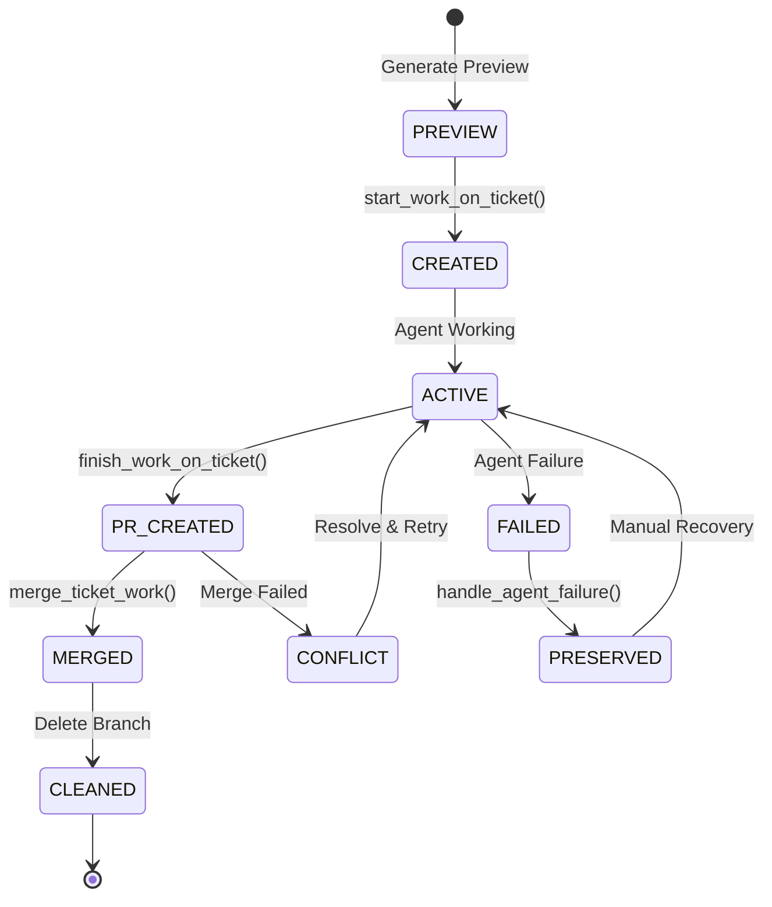
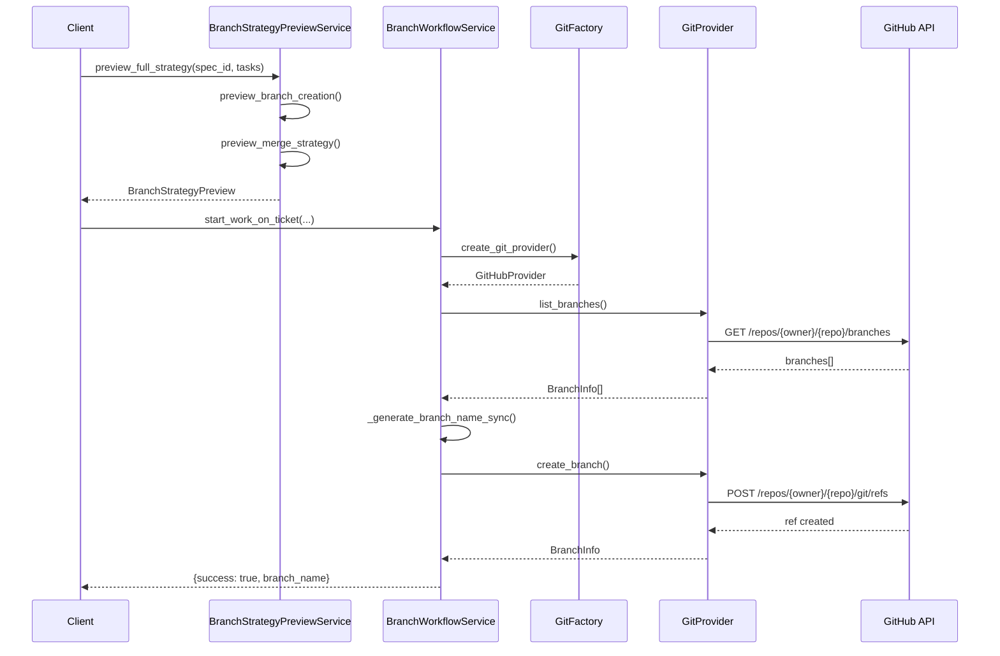
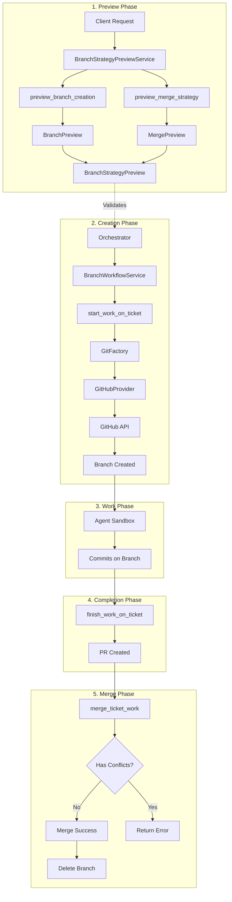
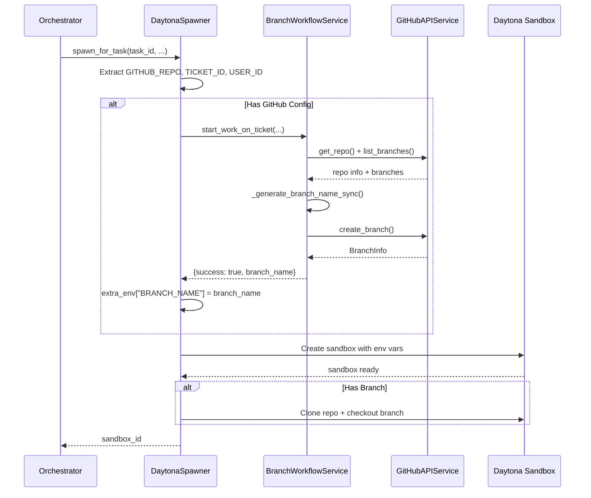
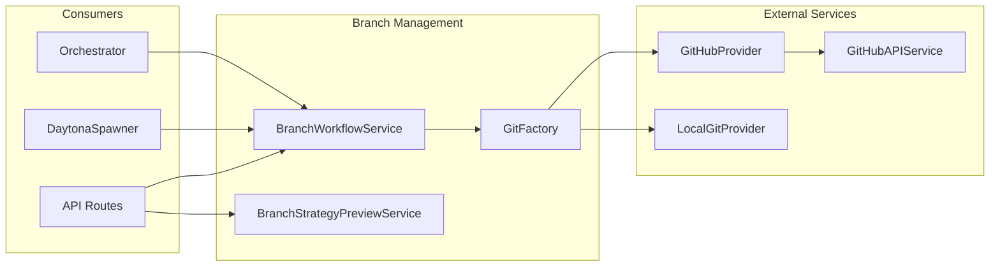

# Branch Management System Design Document

**Created:** 2026-04-22  
**Status:** Active  
**Purpose:** Branch preview, strategy analysis, and workflow management for Git-based development  
**Related Docs:** [Sandbox Provisioning System](./sandbox-provisioning-system.md), [Phase Manager](./phase_manager.md), [Orchestrator Service](./orchestrator_service.md)

---

## 1. Architecture Overview

The Branch Management System provides comprehensive Git branch lifecycle management for ticket-based development. It includes branch preview generation, strategy analysis, workflow orchestration, and integration with both GitHub and local Git providers.

### 1.1 High-Level Architecture



### 1.2 Branch Lifecycle



### 1.3 Data Flow Overview



---

## 2. Branch Preview System

### 2.1 Preview Dataclasses

```python
# backend/omoi_os/services/branch_preview.py
@dataclass
class BranchPreview:
    """Preview of a branch that would be created."""
    branch_name: str
    source_branch: str
    would_collide: bool
    ticket_type: str
    naming_rule: str

@dataclass
class ConflictPrediction:
    """Prediction of merge conflicts for a branch."""
    branch_name: str
    would_conflict: bool
    conflict_count: int
    conflict_files: list[str] = field(default_factory=list)

@dataclass
class MergePreview:
    """Preview of a convergence merge operation."""
    merge_order: list[str]
    conflict_predictions: dict[str, ConflictPrediction]
    total_predicted_conflicts: int
    would_succeed: bool
    requires_manual_review: bool
    recommendation: str  # "proceed" | "review" | "abort"

@dataclass
class BranchStrategyPreview:
    """Full branch strategy preview for a spec."""
    spec_id: str
    branches: list[BranchPreview]
    merge_preview: Optional[MergePreview] = None
    overall_recommendation: str = "proceed"
```

### 2.2 Branch Strategy Preview Service

```python
# backend/omoi_os/services/branch_strategy_preview.py
class BranchStrategyPreviewService:
    """Preview branch strategy without hitting GitHub or Daytona.
    
    Provides dry-run branch and merge previews for local development
    and pre-flight checks before actual branch creation.
    """
    
    # Type prefix mapping from ticket type to branch prefix
    TYPE_PREFIX_MAP = {
        "feature": "feature",
        "bug": "fix",
        "refactor": "refactor",
        "docs": "docs",
        "test": "test",
        "chore": "chore",
    }
    
    def __init__(self, max_conflicts_auto_resolve: int = 10):
        self._max_conflicts = max_conflicts_auto_resolve
    
    def preview_branch_creation(
        self,
        ticket_id: str,
        ticket_title: str,
        ticket_type: str = "feature",
        priority: Optional[str] = None,
        source_branch: str = "main",
        existing_branches: Optional[list[str]] = None,
    ) -> BranchPreview:
        """Preview what branch would be created for a ticket."""
        existing_branches = existing_branches or []
        
        # Determine prefix (hotfix for critical bugs)
        if ticket_type == "bug" and priority == "critical":
            prefix = "hotfix"
        else:
            prefix = self.TYPE_PREFIX_MAP.get(ticket_type, "feature")
        
        # Generate slug from title
        slug = re.sub(r"[^a-zA-Z0-9\s-]", "", ticket_title.lower())
        slug = re.sub(r"\s+", "-", slug.strip())
        slug = slug[:25].rstrip("-")
        
        branch_name = f"{prefix}/{ticket_id}-{slug}"
        would_collide = branch_name in existing_branches
        
        return BranchPreview(
            branch_name=branch_name,
            source_branch=source_branch,
            would_collide=would_collide,
            ticket_type=ticket_type,
            naming_rule=f"{prefix}/{{ticket_id}}-{{slug}}",
        )
    
    def preview_merge_strategy(
        self,
        task_branches: dict[str, str],  # task_id -> branch_name
    ) -> MergePreview:
        """Preview merge strategy for multiple task branches."""
        # Sort by branch name for deterministic ordering
        merge_order = sorted(task_branches.keys())
        
        predictions = {}
        for task_id in merge_order:
            branch_name = task_branches[task_id]
            predictions[task_id] = ConflictPrediction(
                branch_name=branch_name,
                would_conflict=False,  # Can't predict without repo
                conflict_count=0,
                conflict_files=[],
            )
        
        return MergePreview(
            merge_order=merge_order,
            conflict_predictions=predictions,
            total_predicted_conflicts=0,
            would_succeed=True,
            requires_manual_review=False,
            recommendation="proceed",
        )
    
    def preview_full_strategy(
        self,
        spec_id: str,
        tasks: list[dict],
        source_branch: str = "main",
    ) -> BranchStrategyPreview:
        """Generate full branch strategy preview for a spec."""
        branches = []
        task_branches = {}
        
        for task in tasks:
            bp = self.preview_branch_creation(
                ticket_id=task.get("id", "unknown"),
                ticket_title=task.get("title", task.get("description", "untitled")),
                ticket_type=task.get("type", "feature"),
                priority=task.get("priority"),
                source_branch=source_branch,
            )
            branches.append(bp)
            task_branches[task.get("id", "unknown")] = bp.branch_name
        
        merge_preview = None
        if len(task_branches) > 1:
            merge_preview = self.preview_merge_strategy(task_branches)
        
        return BranchStrategyPreview(
            spec_id=spec_id,
            branches=branches,
            merge_preview=merge_preview,
            overall_recommendation="proceed",
        )
```

---

## 3. Branch Workflow Service

### 3.1 Service Architecture

```python
# backend/omoi_os/services/branch_workflow.py
class BranchWorkflowService:
    """Branch workflow service for ticket-based development.
    
    Handles:
    - Creating branches with descriptive names (GitFlow conventions)
    - PR creation and management
    - Merge coordination
    - Rollback and recovery
    
    Branch naming convention:
    - feature/{ticket-id}-{description} for features
    - fix/{ticket-id}-{description} for bug fixes
    - hotfix/{ticket-id}-{description} for critical bugs
    - refactor/{ticket-id}-{description} for refactoring
    - docs/{ticket-id}-{description} for documentation
    - test/{ticket-id}-{description} for test additions
    - chore/{ticket-id}-{description} for maintenance
    """
    
    TYPE_PREFIX_MAP = {
        "feature": "feature",
        "bug": "fix",
        "refactor": "refactor",
        "docs": "docs",
        "test": "test",
        "chore": "chore",
    }
    
    def __init__(
        self,
        github_service: GitHubAPIService,
        max_retries: int = 3,
        retry_delay: float = 1.0,
    ):
        self.github_service = github_service
        self.max_retries = max_retries
        self.retry_delay = retry_delay
```

### 3.2 Core Workflow Methods

| Method | Signature | Description |
|--------|-----------|-------------|
| `start_work_on_ticket` | `(ticket_id, ticket_title, repo_owner, repo_name, user_id, ticket_type="feature", priority=None) → dict` | Create branch for ticket |
| `finish_work_on_ticket` | `(ticket_id, ticket_title, branch_name, repo_owner, repo_name, user_id, pr_body=None) → dict` | Create PR for completed work |
| `merge_ticket_work` | `(ticket_id, pr_number, repo_owner, repo_name, user_id, delete_branch_after=True, merge_method="squash") → dict` | Merge PR for ticket |
| `handle_agent_failure` | `(ticket_id, branch_name, repo_owner, repo_name, user_id, failure_reason) → dict` | Handle agent failure |
| `get_branch_status` | `(branch_name, repo_owner, repo_name, user_id) → dict` | Get branch comparison status |

### 3.3 Branch Name Generation

```python
def _generate_branch_name_sync(
    self,
    ticket_id: str,
    ticket_title: str,
    ticket_type: str = "feature",
    priority: Optional[str] = None,
    existing_branches: Optional[list[str]] = None,
) -> str:
    """Generate a branch name following GitFlow conventions.
    
    Format: {type}/{ticket-id}-{description}
    
    Examples:
    - feature/123-add-user-auth
    - fix/456-fix-login-bug
    - hotfix/789-critical-security-patch
    """
    existing_branches = existing_branches or []
    
    # Determine prefix from type
    if ticket_type == "bug" and priority == "critical":
        prefix = "hotfix"
    else:
        prefix = self.TYPE_PREFIX_MAP.get(ticket_type, "feature")
    
    # Generate description slug from title
    slug = re.sub(r"[^a-zA-Z0-9\s-]", "", ticket_title.lower())
    slug = re.sub(r"\s+", "-", slug.strip())
    slug = slug[:25].rstrip("-")
    
    # Build branch name
    branch_name = f"{prefix}/{ticket_id}-{slug}"
    
    # Handle collisions
    if branch_name in existing_branches:
        i = 2
        while f"{branch_name}-{i}" in existing_branches:
            i += 1
        branch_name = f"{branch_name}-{i}"
    
    return branch_name
```

### 3.4 Start Work on Ticket

```python
async def start_work_on_ticket(
    self,
    ticket_id: str,
    ticket_title: str,
    repo_owner: str,
    repo_name: str,
    user_id: str,
    ticket_type: str = "feature",
    priority: Optional[str] = None,
) -> dict[str, Any]:
    """Create a branch for working on a ticket.
    
    This is the first step in the workflow when an agent starts working
    on a ticket. It creates a new feature branch from the default branch.
    """
    try:
        # Get repository info for default branch
        repo_info = await self.github_service.get_repo(
            user_id, repo_owner, repo_name
        )
        default_branch = repo_info.default_branch if repo_info else None
        
        # Get existing branches for collision detection
        branches = await self.github_service.list_branches(
            user_id, repo_owner, repo_name
        )
        existing_branch_names = [b.name for b in branches]
        
        if not branches:
            return {
                "success": False,
                "error": f"No branches found in {repo_owner}/{repo_name}",
            }
        
        # Find SHA of default branch with fallback logic
        source_sha = None
        
        # First, try the default branch from repo info
        if default_branch:
            for branch in branches:
                if branch.name == default_branch:
                    source_sha = branch.sha
                    break
        
        # If not found, try common default branch names
        if not source_sha:
            common_defaults = ["main", "master", "develop", "trunk"]
            for fallback_name in common_defaults:
                for branch in branches:
                    if branch.name == fallback_name:
                        source_sha = branch.sha
                        default_branch = fallback_name
                        break
                if source_sha:
                    break
        
        # Last resort: use the first branch
        if not source_sha and branches:
            first_branch = branches[0]
            default_branch = first_branch.name
            source_sha = first_branch.sha
        
        if not source_sha:
            return {
                "success": False,
                "error": f"Could not find any branch in {repo_owner}/{repo_name}",
            }
        
        # Generate branch name
        branch_name = self._generate_branch_name_sync(
            ticket_id=ticket_id,
            ticket_title=ticket_title,
            ticket_type=ticket_type,
            priority=priority,
            existing_branches=existing_branch_names,
        )
        
        # Create branch with retry
        async def create_branch():
            return await self.github_service.create_branch(
                user_id=user_id,
                owner=repo_owner,
                repo=repo_name,
                branch_name=branch_name,
                from_sha=source_sha,
            )
        
        result = await self._retry_operation(
            create_branch,
            f"Create branch {branch_name}",
        )
        
        if not result.success:
            return {
                "success": False,
                "error": result.error or "Failed to create branch",
            }
        
        return {
            "success": True,
            "branch_name": branch_name,
            "sha": result.sha,
        }
    
    except Exception as e:
        return {
            "success": False,
            "error": str(e),
        }
```

### 3.5 Finish Work on Ticket (PR Creation)

```python
async def finish_work_on_ticket(
    self,
    ticket_id: str,
    ticket_title: str,
    branch_name: str,
    repo_owner: str,
    repo_name: str,
    user_id: str,
    pr_body: Optional[str] = None,
) -> dict[str, Any]:
    """Create a pull request for completed ticket work.
    
    This is called when an agent finishes working on a ticket and is
    ready to submit a PR for review.
    """
    try:
        # Get default branch
        repo_info = await self.github_service.get_repo(
            user_id, repo_owner, repo_name
        )
        base_branch = repo_info.default_branch if repo_info else "main"
        
        # Build PR title and body
        pr_title = f"[{ticket_id}] {ticket_title}"
        if not pr_body:
            pr_body = (
                f"Resolves #{ticket_id}\n\n"
                f"Automated PR for ticket {ticket_id}."
            )
        
        # Create PR with retry
        async def create_pr():
            return await self.github_service.create_pull_request(
                user_id=user_id,
                owner=repo_owner,
                repo=repo_name,
                title=pr_title,
                head=branch_name,
                base=base_branch,
                body=pr_body,
            )
        
        result = await self._retry_operation(create_pr, f"Create PR for ticket {ticket_id}")
        
        if not result.success:
            return {
                "success": False,
                "error": result.error or "Failed to create PR",
            }
        
        return {
            "success": True,
            "pr_number": result.number,
            "pr_url": result.html_url,
        }
    
    except Exception as e:
        return {
            "success": False,
            "error": str(e),
        }
```

### 3.6 Merge Ticket Work

```python
async def merge_ticket_work(
    self,
    ticket_id: str,
    pr_number: int,
    repo_owner: str,
    repo_name: str,
    user_id: str,
    delete_branch_after: bool = True,
    merge_method: str = "squash",
) -> dict[str, Any]:
    """Merge the PR for a ticket.
    
    This is called when a PR is approved and ready to be merged.
    It checks for merge conflicts before attempting to merge.
    """
    try:
        # Get PR details to check if mergeable
        pr = await self.github_service.get_pull_request(
            user_id=user_id,
            owner=repo_owner,
            repo=repo_name,
            pr_number=pr_number,
        )
        
        if not pr:
            return {
                "success": False,
                "error": f"PR #{pr_number} not found",
            }
        
        # Check if PR has conflicts
        if pr.mergeable is False:
            return {
                "success": False,
                "has_conflicts": True,
                "error": "PR has merge conflicts and cannot be merged",
            }
        
        # Merge the PR
        merge_result = await self.github_service.merge_pull_request(
            user_id=user_id,
            owner=repo_owner,
            repo=repo_name,
            pr_number=pr_number,
            merge_method=merge_method,
            commit_title=f"[{ticket_id}] Merge PR #{pr_number}",
        )
        
        if not merge_result.success:
            return {
                "success": False,
                "error": merge_result.error or "Merge failed",
            }
        
        # Delete branch if requested
        if delete_branch_after and pr.head_branch:
            try:
                await self.github_service.delete_branch(
                    user_id=user_id,
                    owner=repo_owner,
                    repo=repo_name,
                    branch_name=pr.head_branch,
                )
            except Exception as e:
                logger.warning(f"Failed to delete branch {pr.head_branch}: {e}")
        
        return {
            "success": True,
            "merge_sha": merge_result.sha,
        }
    
    except Exception as e:
        return {
            "success": False,
            "error": str(e),
        }
```

### 3.7 Agent Failure Handling

```python
async def handle_agent_failure(
    self,
    ticket_id: str,
    branch_name: str,
    repo_owner: str,
    repo_name: str,
    user_id: str,
    failure_reason: str,
) -> dict[str, Any]:
    """Handle agent failure during ticket work.
    
    IMPORTANT: Agent crashes should NOT delete the branch.
    This preserves any uncommitted work and allows for recovery.
    """
    logger.warning(
        f"Agent failure for ticket {ticket_id} on branch {branch_name}: {failure_reason}"
    )
    
    # DO NOT delete the branch - preserve work for manual recovery
    # The branch can be checked out manually to recover any committed work
    
    return {
        "success": True,
        "action": "preserved",
        "message": f"Branch {branch_name} preserved for manual recovery",
        "branch_name": branch_name,
    }
```

---

## 4. Git Provider System

### 4.1 GitProvider Protocol

```python
# backend/omoi_os/services/git_provider.py
@dataclass
class BranchInfo:
    """Information about a Git branch."""
    name: str
    sha: str
    is_default: bool = False
    is_protected: bool = False

@dataclass
class PullRequestInfo:
    """Information about a pull request."""
    id: str
    title: str
    source_branch: str
    target_branch: str
    status: str  # "open" | "merged" | "closed"
    merge_sha: Optional[str] = None
    conflict_files: Optional[list[str]] = None

@runtime_checkable
class GitProvider(Protocol):
    """Protocol for Git hosting operations."""
    
    async def create_branch(
        self, repo_full_name: str, branch_name: str, source_sha: str
    ) -> BranchInfo: ...
    
    async def delete_branch(self, repo_full_name: str, branch_name: str) -> None: ...
    
    async def get_branch(
        self, repo_full_name: str, branch_name: str
    ) -> Optional[BranchInfo]: ...
    
    async def list_branches(self, repo_full_name: str) -> list[BranchInfo]: ...
    
    async def create_pull_request(
        self,
        repo_full_name: str,
        title: str,
        source_branch: str,
        target_branch: str,
        body: str = "",
    ) -> PullRequestInfo: ...
    
    async def merge_pull_request(
        self, repo_full_name: str, pr_id: str, merge_method: str = "merge"
    ) -> PullRequestInfo: ...
    
    async def get_default_branch(self, repo_full_name: str) -> str: ...
    
    async def clone_repo(self, repo_full_name: str, target_dir: str) -> str: ...
```

### 4.2 GitHubProvider Implementation

```python
# backend/omoi_os/services/github_provider.py
class GitHubProvider:
    """GitProvider backed by GitHub API."""
    
    def __init__(self, github_api, user_id: Optional[UUID | str] = None):
        self._api = github_api
        self._user_id = user_id
    
    def _split_repo(self, repo_full_name: str) -> tuple[str, str]:
        """Split 'owner/repo' into (owner, repo)."""
        owner, repo = repo_full_name.split("/", 1)
        return owner, repo
    
    def _get_user_id(self) -> UUID:
        """Get the user ID as UUID."""
        if self._user_id is None:
            raise ValueError("GitHubProvider requires a user_id")
        if isinstance(self._user_id, str):
            return UUID(self._user_id)
        return self._user_id
    
    async def create_branch(
        self, repo_full_name: str, branch_name: str, source_sha: str
    ) -> BranchInfo:
        owner, repo = self._split_repo(repo_full_name)
        result = await self._api.create_branch(
            self._get_user_id(), owner, repo, branch_name, source_sha
        )
        sha = result.sha if hasattr(result, "sha") else source_sha
        return BranchInfo(name=branch_name, sha=sha)
    
    async def list_branches(self, repo_full_name: str) -> list[BranchInfo]:
        owner, repo = self._split_repo(repo_full_name)
        branches = await self._api.list_branches(self._get_user_id(), owner, repo)
        return [
            BranchInfo(name=b.name, sha=b.sha, is_protected=b.protected)
            for b in branches
        ]
    
    async def create_pull_request(
        self,
        repo_full_name: str,
        title: str,
        source_branch: str,
        target_branch: str,
        body: str = "",
    ) -> PullRequestInfo:
        owner, repo = self._split_repo(repo_full_name)
        result = await self._api.create_pull_request(
            self._get_user_id(), owner, repo, title,
            source_branch, target_branch, body
        )
        return PullRequestInfo(
            id=str(result.number),
            title=title,
            source_branch=source_branch,
            target_branch=target_branch,
            status="open",
        )
```

### 4.3 LocalGitProvider Implementation

```python
# backend/omoi_os/services/local_git_provider.py
class LocalGitProvider:
    """GitProvider using local bare Git repositories. Dev-only."""
    
    def __init__(self, repos_dir: str = ".local-repos"):
        self._repos_dir = Path(repos_dir)
        self._repos_dir.mkdir(parents=True, exist_ok=True)
        self._pull_requests: dict[str, PullRequestInfo] = {}
        self._pr_counter = 0
    
    def _repo_path(self, repo_full_name: str) -> Path:
        """Get the path to a bare repo."""
        safe_name = repo_full_name.replace("/", "--")
        return self._repos_dir / f"{safe_name}.git"
    
    async def _ensure_repo(self, repo_full_name: str) -> Path:
        """Ensure a bare repo exists, creating if necessary."""
        path = self._repo_path(repo_full_name)
        if not path.exists():
            await self._run_git(None, "init", "--bare", str(path))
            await self._create_initial_commit(path)
        return path
    
    async def create_branch(
        self, repo_full_name: str, branch_name: str, source_sha: str
    ) -> BranchInfo:
        repo_path = await self._ensure_repo(repo_full_name)
        await self._run_git(repo_path, "branch", branch_name, source_sha)
        return BranchInfo(name=branch_name, sha=source_sha)
    
    async def list_branches(self, repo_full_name: str) -> list[BranchInfo]:
        repo_path = self._repo_path(repo_full_name)
        if not repo_path.exists():
            return []
        
        result = await self._run_git(
            repo_path,
            "branch",
            "--format=%(refname:short) %(objectname)",
            check=False,
        )
        
        branches = []
        output = result.stdout.decode().strip()
        for line in output.split("\n"):
            if not line.strip():
                continue
            parts = line.strip().split()
            branches.append(
                BranchInfo(name=parts[0], sha=parts[1] if len(parts) > 1 else "")
            )
        return branches
    
    async def create_pull_request(
        self,
        repo_full_name: str,
        title: str,
        source_branch: str,
        target_branch: str,
        body: str = "",
    ) -> PullRequestInfo:
        """Create a pull request (stored in-memory)."""
        self._pr_counter += 1
        pr_id = f"local-pr-{self._pr_counter}"
        pr = PullRequestInfo(
            id=pr_id,
            title=title,
            source_branch=source_branch,
            target_branch=target_branch,
            status="open",
        )
        self._pull_requests[pr_id] = pr
        return pr
```

### 4.4 Git Factory

```python
# backend/omoi_os/services/git_factory.py
def create_git_provider(
    github_api=None, user_id: Optional[UUID | str] = None
) -> "GitProvider":
    """Create GitProvider based on config.
    
    Reads git.provider from config:
    - "github" (default) → GitHubProvider
    - "local" → LocalGitProvider
    """
    from omoi_os.config import get_app_settings
    
    settings = get_app_settings()
    provider_type = settings.git.provider
    
    if provider_type == "local":
        from omoi_os.services.local_git_provider import LocalGitProvider
        return LocalGitProvider(repos_dir=settings.git.local_repos_dir)
    else:
        if github_api is None:
            raise ValueError("GitHubProvider requires a GitHubAPIService instance")
        from omoi_os.services.github_provider import GitHubProvider
        return GitHubProvider(github_api, user_id=user_id)
```

---

## 5. Data Flow

### 5.1 Branch Creation → Preview → Strategy → Merge



### 5.2 Integration with Sandbox Provisioning



---

## 6. Configuration

### 6.1 YAML Configuration

```yaml
# config/base.yaml
git:
  provider: "github"  # or "local" for development
  local_repos_dir: ".local-repos"
  
  # Branch naming conventions
  branch_prefix: "omoi"
  default_branch: "main"
  
  # Workflow settings
  auto_create_branches: true
  delete_branch_after_merge: true
  default_merge_method: "squash"
  
  # Retry settings
  max_retries: 3
  retry_delay_seconds: 1.0

# Preview service settings
branch_preview:
  max_conflicts_auto_resolve: 10
  default_source_branch: "main"
```

### 6.2 Environment Variables

| Variable | Purpose | Default |
|----------|---------|---------|
| `GIT_PROVIDER` | Provider selection (github/local) | github |
| `LOCAL_REPOS_DIR` | Local git repos directory | .local-repos |
| `GITHUB_TOKEN` | GitHub API authentication | - |
| `DEFAULT_BRANCH` | Default source branch | main |
| `BRANCH_PREFIX` | Prefix for auto-generated branches | omoi |

---

## 7. Error Handling

### 7.1 Error Categories

| Error Type | Example | Handling Strategy |
|------------|---------|-------------------|
| **Branch Exists** | Branch name collision | Append counter suffix (-2, -3, etc.) |
| **No Default Branch** | Empty repo or no main/master | Try common defaults, then first branch |
| **GitHub API Error** | 401/403/404 from API | Retry with exponential backoff |
| **Merge Conflict** | PR has mergeable=false | Return has_conflicts=true, don't merge |
| **Agent Failure** | Crash during execution | Preserve branch, don't delete |

### 7.2 Retry Logic

```python
async def _retry_operation(self, operation, operation_name, *args, **kwargs):
    """Retry an async operation with exponential backoff."""
    last_exception = None
    
    for attempt in range(self.max_retries):
        try:
            return await operation(*args, **kwargs)
        except Exception as e:
            last_exception = e
            delay = self.retry_delay * (2 ** attempt)
            logger.warning(
                f"{operation_name} failed (attempt {attempt + 1}/{self.max_retries}): {e}. "
                f"Retrying in {delay:.1f}s..."
            )
            await asyncio.sleep(delay)
    
    raise last_exception
```

---

## 8. Integration Points

### 8.1 Services Integration



### 8.2 API Routes

```python
# Typical routes in api/routes/branch_workflow.py
@router.post("/branch-workflow/start")
async def start_work_on_ticket(
    ticket_id: str,
    ticket_title: str,
    repo_owner: str,
    repo_name: str,
    user_id: str,
    ticket_type: str = "feature",
    workflow: BranchWorkflowService = Depends(get_branch_workflow),
):
    """Create a branch for working on a ticket."""
    return await workflow.start_work_on_ticket(...)

@router.post("/branch-workflow/finish")
async def finish_work_on_ticket(
    ticket_id: str,
    branch_name: str,
    repo_owner: str,
    repo_name: str,
    workflow: BranchWorkflowService = Depends(get_branch_workflow),
):
    """Create a PR for completed work."""
    return await workflow.finish_work_on_ticket(...)

@router.post("/branch-workflow/merge")
async def merge_ticket_work(
    ticket_id: str,
    pr_number: int,
    repo_owner: str,
    repo_name: str,
    workflow: BranchWorkflowService = Depends(get_branch_workflow),
):
    """Merge a PR for a ticket."""
    return await workflow.merge_ticket_work(...)

@router.post("/branch-preview/strategy")
async def preview_branch_strategy(
    spec_id: str,
    tasks: list[dict],
    preview_service: BranchStrategyPreviewService = Depends(),
):
    """Preview branch strategy for a spec."""
    return preview_service.preview_full_strategy(spec_id, tasks)
```

---

## 9. Performance Characteristics

| Metric | Target | Notes |
|--------|--------|-------|
| Branch name generation | < 1ms | Local string operations |
| Branch preview generation | < 10ms | No external calls |
| GitHub branch creation | < 3s | API call + validation |
| PR creation | < 3s | API call |
| Merge operation | < 5s | API call + verification |
| Status check | < 2s | GitHub API call |
| Retry with backoff | 1s, 2s, 4s | Exponential delay |

---

## 10. Security Considerations

1. **Token Management**: GitHub tokens stored in user attributes, never logged
2. **Branch Isolation**: Each ticket gets its own branch, no shared branches
3. **PR Review**: All changes go through PR review process
4. **Failure Preservation**: Failed agent runs preserve branches for audit
5. **Access Control**: User-scoped GitHub operations via user_id
6. **No Force Push**: Merge operations use standard GitHub merge methods

---

*Document Version: 1.0*  
*Last Updated: 2026-04-22*  
*Maintainer: OmoiOS Core Team*
