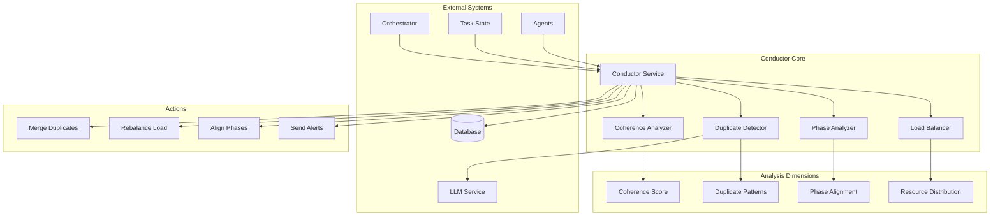
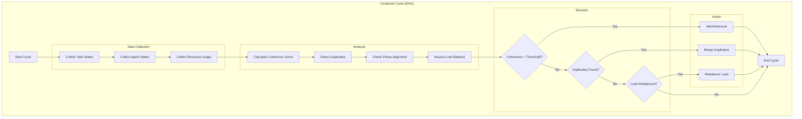
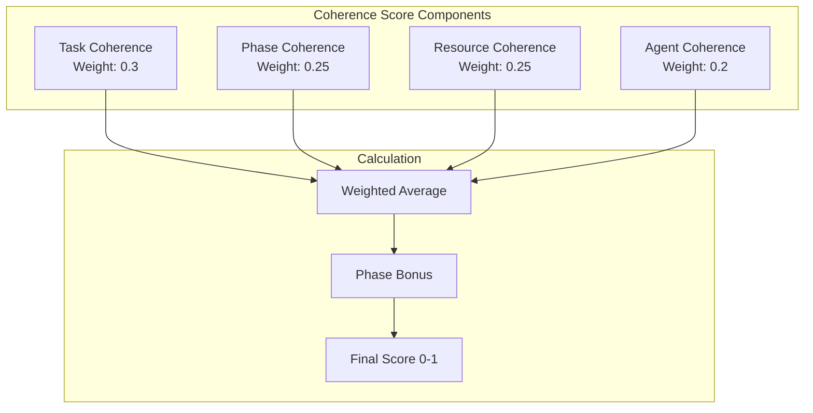

# Conductor Coherence Service Design Document

**Created:** 2026-04-22  
**Status:** Active  
**Purpose:** System coherence analysis, duplicate detection, and load balancing for multi-agent orchestration  
**Related Docs:** [Orchestrator Service](./orchestrator_service.md), [Guardian Monitoring](./guardian_monitoring.md), [Discovery Service](./discovery_service.md)

---

## 1. Architecture Overview

The Conductor Coherence Service maintains system-wide coherence across distributed agent execution. It detects duplicate work, analyzes system-wide patterns, ensures phase alignment across tasks, and optimizes resource distribution through intelligent load balancing.

### 1.1 High-Level Architecture



### 1.2 Coherence Analysis Flow



---

## 2. Component Responsibilities

| Component | Responsibility | Key Operations |
|-----------|---------------|----------------|
| **Conductor Service** | Main coordination, cycle orchestration | `run_cycle()`, `collect_data()`, `execute_actions()` |
| **Coherence Analyzer** | Calculate system coherence score | `calculate_score()`, `identify_conflicts()`, `measure_alignment()` |
| **Duplicate Detector** | Detect and merge duplicate tasks | `scan_duplicates()`, `calculate_similarity()`, `merge_tasks()` |
| **Load Balancer** | Optimize resource distribution | `assess_balance()`, `rebalance()`, `redistribute()` |
| **Phase Analyzer** | Ensure phase alignment across tasks | `check_alignment()`, `detect_phase_conflicts()`, `suggest_sync()` |
| **Action Executor** | Execute coherence actions | `merge()`, `rebalance()`, `alert()`, `intervene()` |

---

## 3. System Boundaries

### 3.1 Inside System Boundaries

- System-wide coherence score calculation (0-1 scale)
- Duplicate task detection via LLM similarity analysis
- Phase coherence analysis across concurrent tasks
- Load distribution assessment and optimization
- Task merging for duplicates (similarity > 0.7)
- Phase coherence bonus calculation
- Resource reallocation recommendations
- Coherence alerting (score < 0.6)
- Cross-task dependency analysis
- System state snapshotting
- Historical coherence trend tracking

### 3.2 Outside System Boundaries

- Actual task execution (handled by Orchestrator)
- Agent code execution (handled by Sandbox/Agent)
- LLM API calls (delegated to LLM Service)
- Database persistence (handled by models layer)
- WebSocket notifications (handled by WebSocket Hub)
- Task queue management (handled by Orchestrator)
- Resource provisioning (handled by Daytona Spawner)

---

## 4. Component Details

### 4.1 Conductor Service Core

The main coordinator that runs the 5-minute coherence analysis cycle.

**Core Methods:**

```python
class ConductorService:
    """
    System coherence maintenance through duplicate detection,
    phase alignment, and load balancing.
    
    Runs on a 5-minute cycle to analyze system-wide patterns
    and maintain optimal task distribution.
    """
    
    CYCLE_INTERVAL_SECONDS = 300  # 5 minutes
    COHERENCE_THRESHOLD = 0.6
    DUPLICATE_SIMILARITY_THRESHOLD = 0.7
    
    async def run_cycle(self) -> ConductorCycleResult:
        """
        Execute a full coherence analysis cycle.
        
        Returns:
            ConductorCycleResult with all findings and actions taken
        """
        start_time = utc_now()
        
        # Phase 1: Data Collection
        system_state = await self._collect_system_state()
        
        # Phase 2: Analysis
        coherence_score = await self.coherence_analyzer.calculate(system_state)
        duplicates = await self.duplicate_detector.scan(system_state)
        phase_alignment = await self.phase_analyzer.check(system_state)
        load_balance = await self.load_balancer.assess(system_state)
        
        # Phase 3: Decision & Action
        actions_taken = []
        
        if coherence_score < self.COHERENCE_THRESHOLD:
            action = await self._handle_low_coherence(
                coherence_score, system_state
            )
            actions_taken.append(action)
        
        if duplicates:
            for duplicate_pair in duplicates:
                action = await self._handle_duplicate(duplicate_pair)
                actions_taken.append(action)
        
        if not load_balance.is_balanced:
            action = await self._handle_imbalance(load_balance)
            actions_taken.append(action)
        
        # Phase 4: Reporting
        result = ConductorCycleResult(
            cycle_start=start_time,
            cycle_end=utc_now(),
            coherence_score=coherence_score,
            duplicates_detected=len(duplicates),
            phase_alignment_score=phase_alignment.score,
            load_balance_score=load_balance.score,
            actions_taken=actions_taken,
            recommendations=self._generate_recommendations(
                coherence_score, phase_alignment, load_balance
            )
        )
        
        await self._persist_result(result)
        await self._emit_status(result)
        
        return result
    
    async def _collect_system_state(self) -> SystemState:
        """
        Collect comprehensive system state snapshot.
        
        Includes:
        - All active tasks with states
        - Agent assignments and health
        - Resource utilization
        - Queue depths
        - Recent completions
        """
        return SystemState(
            tasks=await self._get_all_tasks(),
            agents=await self._get_all_agents(),
            resources=await self._get_resource_usage(),
            queues=await self._get_queue_depths(),
            timestamp=utc_now()
        )
```

### 4.2 Coherence Analyzer

Calculates a system-wide coherence score based on multiple dimensions.

**Coherence Dimensions:**



**Scoring Algorithm:**

```python
class CoherenceAnalyzer:
    """
    Calculate system-wide coherence score.
    
    Coherence measures how well the system is working together:
    - Are tasks progressing smoothly?
    - Are phases aligned?
    - Are resources distributed well?
    - Are agents working efficiently?
    """
    
    WEIGHTS = {
        "task": 0.30,
        "phase": 0.25,
        "resource": 0.25,
        "agent": 0.20
    }
    
    async def calculate(self, system_state: SystemState) -> float:
        """
        Calculate composite coherence score.
        
        Returns score between 0 and 1, where:
        - 0.8-1.0: Excellent coherence
        - 0.6-0.8: Good coherence
        - 0.4-0.6: Fair coherence (attention needed)
        - 0.0-0.4: Poor coherence (intervention required)
        """
        # Calculate component scores
        task_score = self._calculate_task_coherence(system_state.tasks)
        phase_score = self._calculate_phase_coherence(system_state.tasks)
        resource_score = self._calculate_resource_coherence(system_state.resources)
        agent_score = self._calculate_agent_coherence(system_state.agents)
        
        # Weighted average
        composite = (
            task_score * self.WEIGHTS["task"] +
            phase_score * self.WEIGHTS["phase"] +
            resource_score * self.WEIGHTS["resource"] +
            agent_score * self.WEIGHTS["agent"]
        )
        
        # Phase coherence bonus
        phase_bonus = self._calculate_phase_bonus(system_state.tasks)
        
        final_score = min(1.0, composite + phase_bonus)
        
        return final_score
    
    def _calculate_task_coherence(self, tasks: list[Task]) -> float:
        """
        Calculate task-level coherence.
        
        Factors:
        - Ratio of progressing vs stuck tasks
        - Distribution of task states
        - Retry rate (lower is better)
        - Completion velocity
        """
        if not tasks:
            return 1.0
        
        progressing = sum(1 for t in tasks if t.status in ["running", "queued"])
        stuck = sum(1 for t in tasks if t.status == "blocked")
        completed = sum(1 for t in tasks if t.status == "completed")
        
        # Progress ratio (higher is better)
        progress_ratio = progressing / len(tasks) if tasks else 0
        
        # Stuck penalty
        stuck_penalty = (stuck / len(tasks)) * 0.5 if tasks else 0
        
        # Completion velocity bonus
        velocity_bonus = min(0.1, completed / len(tasks) * 0.2) if tasks else 0
        
        return max(0, progress_ratio - stuck_penalty + velocity_bonus)
    
    def _calculate_phase_bonus(self, tasks: list[Task]) -> float:
        """
        Calculate phase coherence bonus.
        
        Rewards systems where tasks in the same spec
        are in aligned phases.
        """
        if not tasks:
            return 0
        
        # Group tasks by spec
        by_spec = defaultdict(list)
        for task in tasks:
            by_spec[task.spec_id].append(task)
        
        total_bonus = 0
        for spec_id, spec_tasks in by_spec.items():
            if len(spec_tasks) < 2:
                continue
            
            # Calculate phase alignment for this spec
            phases = [t.phase for t in spec_tasks]
            phase_counts = Counter(phases)
            
            # Most common phase
            most_common = phase_counts.most_common(1)[0][1]
            alignment = most_common / len(spec_tasks)
            
            # Bonus for high alignment
            if alignment > 0.7:
                total_bonus += 0.05
        
        return min(0.15, total_bonus)  # Cap at 0.15
```

### 4.3 Duplicate Detector

Uses LLM-powered similarity analysis to detect duplicate tasks.

```python
class DuplicateDetector:
    """
    Detect duplicate tasks using LLM similarity analysis.
    
    Compares task descriptions, goals, and contexts to identify
    tasks that are sufficiently similar to be merged.
    """
    
    SIMILARITY_THRESHOLD = 0.7
    
    async def scan(self, system_state: SystemState) -> list[DuplicatePair]:
        """
        Scan for duplicate task pairs.
        
        Returns list of duplicate pairs with similarity scores.
        """
        duplicates = []
        tasks = system_state.tasks
        
        # Compare all task pairs
        for i, task1 in enumerate(tasks):
            for task2 in tasks[i+1:]:
                # Quick checks before expensive LLM call
                if not self._preliminary_check(task1, task2):
                    continue
                
                # LLM similarity analysis
                similarity = await self._calculate_similarity(task1, task2)
                
                if similarity >= self.SIMILARITY_THRESHOLD:
                    duplicates.append(DuplicatePair(
                        task1_id=task1.id,
                        task2_id=task2.id,
                        similarity_score=similarity,
                        merge_recommended=similarity > 0.85
                    ))
        
        return duplicates
    
    async def _calculate_similarity(self, task1: Task, task2: Task) -> float:
        """
        Calculate similarity between two tasks using LLM.
        """
        prompt = f"""
        Compare the following two tasks and rate their similarity.
        
        Task 1:
        - Goal: {task1.goal}
        - Description: {task1.description}
        - Phase: {task1.phase}
        - Context: {task1.context}
        
        Task 2:
        - Goal: {task2.goal}
        - Description: {task2.description}
        - Phase: {task2.phase}
        - Context: {task2.context}
        
        Rate similarity on a scale of 0.0 to 1.0 where:
        - 0.0 = Completely different tasks
        - 0.5 = Somewhat related but distinct
        - 0.8+ = Very similar, could potentially be merged
        - 1.0 = Identical tasks
        
        Provide:
        1. Similarity score (0.0-1.0)
        2. Brief explanation of the rating
        3. Whether these tasks should be merged (yes/no/maybe)
        """
        
        result = await self.llm.structured_output(
            prompt=prompt,
            output_type=SimilarityResult
        )
        
        return result.similarity_score
    
    async def merge_tasks(
        self,
        task1_id: str,
        task2_id: str
    ) -> MergeResult:
        """
        Merge two duplicate tasks into one.
        
        Combines work done, aggregates results, and cancels
        the redundant task.
        """
        # Get task details
        task1 = await self._get_task(task1_id)
        task2 = await self._get_task(task2_id)
        
        # Determine which task to keep (more progress)
        keep_task, cancel_task = self._determine_primary(task1, task2)
        
        # Merge results and context
        merged_context = self._merge_context(keep_task, cancel_task)
        
        # Update kept task
        await self._update_task(keep_task.id, {
            "context": merged_context,
            "merged_from": cancel_task.id,
            "merge_timestamp": utc_now()
        })
        
        # Cancel redundant task
        await self._cancel_task(cancel_task.id, reason="Merged with duplicate")
        
        return MergeResult(
            kept_task_id=keep_task.id,
            cancelled_task_id=cancel_task.id,
            merged_context=merged_context
        )
```

### 4.4 Load Balancer

Optimizes resource distribution across agents and sandboxes.

```python
class LoadBalancer:
    """
    Optimize resource distribution across the system.
    
    Ensures:
    - Even distribution of tasks across agents
    - Resource utilization within optimal range (40-70%)
    - Queue depths balanced across workers
    - Priority tasks get appropriate resources
    """
    
    OPTIMAL_UTILIZATION_MIN = 0.40
    OPTIMAL_UTILIZATION_MAX = 0.70
    
    async def assess(self, system_state: SystemState) -> LoadBalanceAssessment:
        """
        Assess current load distribution.
        
        Returns assessment with balance score and recommendations.
        """
        # Calculate utilization per agent
        agent_utilization = {}
        for agent in system_state.agents:
            assigned_tasks = sum(1 for t in system_state.tasks 
                           if t.agent_id == agent.id)
            utilization = assigned_tasks / agent.capacity
            agent_utilization[agent.id] = utilization
        
        # Calculate balance metrics
        avg_utilization = sum(agent_utilization.values()) / len(agent_utilization)
        variance = sum((u - avg_utilization) ** 2 
                      for u in agent_utilization.values()) / len(agent_utilization)
        
        # Balance score (lower variance = higher score)
        balance_score = max(0, 1 - variance * 4)
        
        # Check if rebalancing needed
        needs_rebalance = (
            variance > 0.1 or  # High variance
            any(u > 0.9 for u in agent_utilization.values()) or  # Overloaded
            any(u < 0.2 for u in agent_utilization.values())    # Underutilized
        )
        
        return LoadBalanceAssessment(
            is_balanced=not needs_rebalance,
            balance_score=balance_score,
            agent_utilization=agent_utilization,
            average_utilization=avg_utilization,
            variance=variance,
            recommendations=self._generate_recommendations(agent_utilization)
        )
    
    async def rebalance(
        self,
        assessment: LoadBalanceAssessment
    ) -> list[RebalanceAction]:
        """
        Execute rebalancing actions.
        
        Moves tasks from overloaded agents to underutilized ones.
        """
        actions = []
        
        # Identify overloaded and underutilized agents
        overloaded = [
            aid for aid, util in assessment.agent_utilization.items()
            if util > self.OPTIMAL_UTILIZATION_MAX
        ]
        underutilized = [
            aid for aid, util in assessment.agent_utilization.items()
            if util < self.OPTIMAL_UTILIZATION_MIN
        ]
        
        # Move tasks from overloaded to underutilized
        for over_id in overloaded:
            for under_id in underutilized:
                tasks_to_move = await self._select_tasks_to_move(over_id, under_id)
                
                for task in tasks_to_move:
                    action = await self._move_task(task.id, over_id, under_id)
                    actions.append(action)
        
        return actions
```

---

## 5. Data Models

### 5.1 Database Schema

```sql
-- Conductor cycle results
CREATE TABLE conductor_cycles (
    id UUID PRIMARY KEY DEFAULT gen_random_uuid(),
    
    -- Timing
    cycle_start TIMESTAMP WITH TIME ZONE NOT NULL,
    cycle_end TIMESTAMP WITH TIME ZONE NOT NULL,
    duration_ms INTEGER,
    
    -- Scores
    coherence_score DECIMAL(3,2) NOT NULL,
    phase_alignment_score DECIMAL(3,2),
    load_balance_score DECIMAL(3,2),
    
    -- Findings
    duplicates_detected INTEGER DEFAULT 0,
    duplicates_merged INTEGER DEFAULT 0,
    phase_conflicts INTEGER DEFAULT 0,
    load_imbalances INTEGER DEFAULT 0,
    
    -- Actions taken
    actions_taken JSONB,  -- Array of action records
    
    -- System state snapshot
    task_count INTEGER,
    agent_count INTEGER,
    queue_depth_total INTEGER,
    
    -- Recommendations
    recommendations JSONB,
    
    created_at TIMESTAMP WITH TIME ZONE DEFAULT NOW()
);

-- Duplicate detections
CREATE TABLE duplicate_detections (
    id UUID PRIMARY KEY DEFAULT gen_random_uuid(),
    
    -- Tasks involved
    task1_id UUID NOT NULL REFERENCES tasks(id) ON DELETE CASCADE,
    task2_id UUID NOT NULL REFERENCES tasks(id) ON DELETE CASCADE,
    
    -- Detection details
    similarity_score DECIMAL(3,2) NOT NULL,  -- 0.00 to 1.00
    detection_method VARCHAR(50),  -- llm_similarity, hash_match, etc.
    
    -- Resolution
    merged BOOLEAN DEFAULT FALSE,
    merged_at TIMESTAMP WITH TIME ZONE,
    kept_task_id UUID REFERENCES tasks(id),
    cancelled_task_id UUID REFERENCES tasks(id),
    merge_reason TEXT,
    
    -- Metadata
    detected_at TIMESTAMP WITH TIME ZONE DEFAULT NOW(),
    detected_in_cycle_id UUID REFERENCES conductor_cycles(id)
);

-- Phase alignment tracking
CREATE TABLE phase_alignments (
    id UUID PRIMARY KEY DEFAULT gen_random_uuid(),
    spec_id UUID NOT NULL REFERENCES specs(id) ON DELETE CASCADE,
    
    -- Alignment metrics
    alignment_score DECIMAL(3,2) NOT NULL,
    dominant_phase VARCHAR(50),
    phase_distribution JSONB,  -- {phase: count}
    
    -- Conflicts
    conflicts_detected INTEGER DEFAULT 0,
    conflict_details JSONB,
    
    -- Recommendations
    recommended_sync BOOLEAN DEFAULT FALSE,
    recommended_phase VARCHAR(50),
    
    analyzed_at TIMESTAMP WITH TIME ZONE DEFAULT NOW(),
    cycle_id UUID REFERENCES conductor_cycles(id)
);

-- Load balance history
CREATE TABLE load_balance_snapshots (
    id UUID PRIMARY KEY DEFAULT gen_random_uuid(),
    
    is_balanced BOOLEAN NOT NULL,
    balance_score DECIMAL(3,2) NOT NULL,
    average_utilization DECIMAL(3,2),
    variance DECIMAL(4,3),
    
    -- Per-agent data
    agent_utilization JSONB,  -- {agent_id: utilization}
    
    -- Rebalancing
    rebalancing_actions JSONB,
    tasks_moved INTEGER DEFAULT 0,
    
    captured_at TIMESTAMP WITH TIME ZONE DEFAULT NOW(),
    cycle_id UUID REFERENCES conductor_cycles(id)
);

-- Indexes
CREATE INDEX idx_conductor_cycles_time ON conductor_cycles(cycle_start DESC);
CREATE INDEX idx_conductor_cycles_score ON conductor_cycles(coherence_score);
CREATE INDEX idx_duplicate_detections_tasks ON duplicate_detections(task1_id, task2_id);
CREATE INDEX idx_duplicate_detections_score ON duplicate_detections(similarity_score DESC);
CREATE INDEX idx_phase_alignments_spec ON phase_alignments(spec_id, analyzed_at DESC);
```

### 5.2 Pydantic Models

```python
from pydantic import BaseModel, Field
from datetime import datetime
from typing import Optional
from enum import Enum

class CoherenceLevel(str, Enum):
    EXCELLENT = "excellent"  # 0.8-1.0
    GOOD = "good"            # 0.6-0.8
    FAIR = "fair"            # 0.4-0.6
    POOR = "poor"            # 0.0-0.4

class SystemState(BaseModel):
    """Snapshot of system state for analysis."""
    tasks: list[Task]
    agents: list[Agent]
    resources: ResourceUsage
    queues: dict[str, int]  # queue_name -> depth
    timestamp: datetime

class CoherenceScore(BaseModel):
    """Coherence score breakdown."""
    composite_score: float = Field(..., ge=0, le=1)
    task_score: float = Field(..., ge=0, le=1)
    phase_score: float = Field(..., ge=0, le=1)
    resource_score: float = Field(..., ge=0, le=1)
    agent_score: float = Field(..., ge=0, le=1)
    phase_bonus: float = Field(..., ge=0, le=0.15)
    
    level: CoherenceLevel
    threshold_met: bool

class DuplicatePair(BaseModel):
    """Pair of duplicate tasks."""
    task1_id: str
    task2_id: str
    similarity_score: float = Field(..., ge=0, le=1)
    merge_recommended: bool
    detection_method: str = "llm_similarity"
    detected_at: datetime = Field(default_factory=utc_now)

class PhaseAlignment(BaseModel):
    """Phase alignment analysis for a spec."""
    spec_id: str
    alignment_score: float = Field(..., ge=0, le=1)
    dominant_phase: str
    phase_distribution: dict[str, int]
    
    conflicts_detected: int
    conflict_details: list[dict]
    
    recommended_sync: bool = False
    recommended_phase: Optional[str] = None

class LoadBalanceAssessment(BaseModel):
    """Load balance assessment results."""
    is_balanced: bool
    balance_score: float = Field(..., ge=0, le=1)
    average_utilization: float
    variance: float
    agent_utilization: dict[str, float]
    recommendations: list[str]

class ConductorCycleResult(BaseModel):
    """Results from a conductor analysis cycle."""
    cycle_start: datetime
    cycle_end: datetime
    duration_ms: int
    
    coherence_score: float
    duplicates_detected: int
    phase_alignment_score: float
    load_balance_score: float
    
    actions_taken: list[dict]
    recommendations: list[str]

class RebalanceAction(BaseModel):
    """Action taken to rebalance load."""
    action_type: str = "move_task"
    task_id: str
    from_agent_id: str
    to_agent_id: str
    reason: str
    executed_at: datetime = Field(default_factory=utc_now)

class MergeResult(BaseModel):
    """Result of merging duplicate tasks."""
    kept_task_id: str
    cancelled_task_id: str
    merged_context: dict
    merged_at: datetime = Field(default_factory=utc_now)
```

---

## 6. API Specifications

### 6.1 REST Endpoints

| Endpoint | Method | Description | Request Body | Response |
|----------|--------|-------------|--------------|----------|
| `/api/v1/conductor/cycle` | POST | Trigger analysis cycle | - | `ConductorCycleResult` |
| `/api/v1/conductor/status` | GET | Current coherence status | - | `CoherenceStatus` |
| `/api/v1/conductor/duplicates` | GET | List detected duplicates | Query params | `DuplicateList` |
| `/api/v1/conductor/duplicates/merge` | POST | Merge duplicate tasks | `MergeRequest` | `MergeResult` |
| `/api/v1/conductor/alignment` | GET | Phase alignment status | Query params | `AlignmentStatus` |
| `/api/v1/conductor/balance` | GET | Load balance status | - | `BalanceStatus` |
| `/api/v1/conductor/rebalance` | POST | Trigger rebalancing | - | `RebalanceResult` |
| `/api/v1/conductor/history` | GET | Cycle history | Query params | `CycleHistory` |

### 6.2 Request/Response Schemas

```python
class CoherenceStatus(BaseModel):
    """Current coherence system status."""
    current_score: float
    level: CoherenceLevel
    last_cycle_at: datetime
    next_cycle_at: datetime
    
    active_tasks: int
    active_agents: int
    queue_depth: int
    
    recent_duplicates: int
    recent_merges: int
    
class MergeRequest(BaseModel):
    """Request to merge duplicate tasks."""
    task1_id: str
    task2_id: str
    force: bool = False  # Bypass confirmation
    
class RebalanceResult(BaseModel):
    """Result of rebalancing operation."""
    rebalanced: bool
    actions_taken: list[RebalanceAction]
    previous_balance_score: float
    new_balance_score: float
    
class CycleHistory(BaseModel):
    """History of conductor cycles."""
    cycles: list[ConductorCycleResult]
    average_coherence: float
    trend: Literal["improving", "stable", "declining"]
    total_cycles: int
```

---

## 7. WebSocket Events

### 7.1 Event Types

| Event | Direction | Payload | Description |
|-------|-----------|---------|-------------|
| `conductor.cycle.complete` | Server → Client | `ConductorCycleResult` | Cycle finished |
| `conductor.coherence.alert` | Server → Client | `CoherenceAlert` | Low coherence detected |
| `conductor.duplicate.found` | Server → Client | `DuplicatePair` | Duplicate detected |
| `conductor.duplicate.merged` | Server → Client | `MergeResult` | Duplicates merged |
| `conductor.alignment.sync` | Server → Client | `PhaseAlignment` | Phase sync recommended |
| `conductor.balance.rebalanced` | Server → Client | `RebalanceResult` | Load rebalanced |
| `conductor.status.update` | Server → Client | `CoherenceStatus` | Status update |

---

## 8. Implementation Details

### 8.1 Similarity Calculation

```python
async def calculate_similarity(task1: Task, task2: Task) -> float:
    """
    Multi-factor similarity calculation.
    
    Factors:
    1. Goal similarity (LLM-based)
    2. Description similarity (embedding cosine)
    3. Context overlap (Jaccard index)
    4. Phase proximity (same phase = higher similarity)
    """
    # Factor 1: Goal similarity via LLM
    goal_sim = await llm_similarity(task1.goal, task2.goal)
    
    # Factor 2: Description embedding similarity
    desc_sim = embedding_cosine(task1.embedding, task2.embedding)
    
    # Factor 3: Context overlap
    context_sim = jaccard_similarity(
        set(task1.context_keys),
        set(task2.context_keys)
    )
    
    # Factor 4: Phase proximity
    phase_sim = 1.0 if task1.phase == task2.phase else 0.5
    
    # Weighted combination
    weights = [0.4, 0.3, 0.2, 0.1]
    scores = [goal_sim, desc_sim, context_sim, phase_sim]
    
    return sum(w * s for w, s in zip(weights, scores))
```

---

## 9. Configuration Parameters

```yaml
# config/base.yaml
conductor:
  # Cycle settings
  cycle_interval_seconds: 300  # 5 minutes
  
  # Coherence thresholds
  coherence:
    threshold: 0.6
    excellent: 0.8
    good: 0.6
    fair: 0.4
    
  # Duplicate detection
  duplicates:
    similarity_threshold: 0.7
    auto_merge_threshold: 0.85
    llm_model: "claude-sonnet-4-20250514"
    
  # Load balancing
  load_balance:
    optimal_min: 0.40
    optimal_max: 0.70
    rebalance_variance_threshold: 0.1
    
  # Phase alignment
  phase_alignment:
    sync_threshold: 0.7
    conflict_detection: true
```

---

## 10. Performance Characteristics

| Metric | Target | Notes |
|--------|--------|-------|
| Cycle duration | < 30s | Full analysis cycle |
| Coherence calculation | < 2s | Score computation |
| Duplicate detection | < 10s | LLM similarity checks |
| Rebalancing latency | < 5s | Task moves |
| Score accuracy | ±0.05 | Variance from ground truth |
| Duplicate precision | > 90% | True positive rate |

---

*Document Version: 1.0*  
*Last Updated: 2026-04-22*  
*Maintainer: OmoiOS Core Team*
