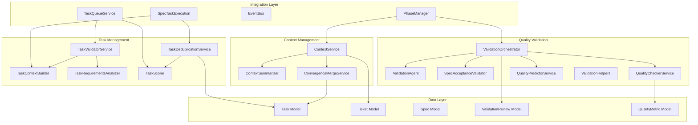
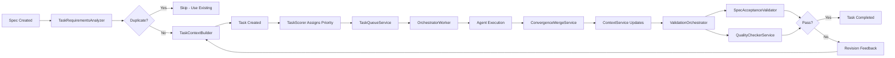
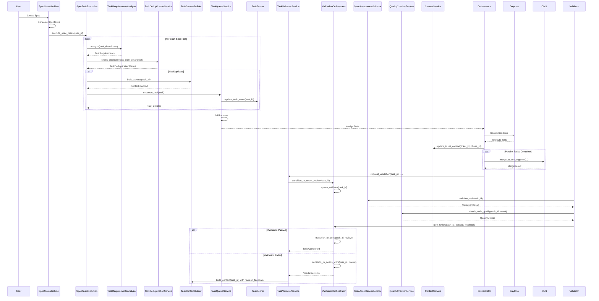

# Context, Validation, and Task Management Systems Design Document

**Created:** 2026-04-22  
**Status:** Active  
**Purpose:** Unified design reference for the three core subsystems that manage execution context, validate work quality, and orchestrate task lifecycle  
**Related Docs:** [Phase Manager](./phase_manager.md), [Spec Task Execution](./spec_task_execution.md), [Event Bus](./event_bus.md), [Orchestrator Service](./orchestrator_service.md)

---

## 1. Architecture Overview

The Context, Validation, and Task Management systems form the execution backbone of OmoiOS. These three subsystems work together to:

1. **Context Management** - Aggregate, summarize, and propagate execution context across phases and parallel tasks
2. **Quality Validation** - Validate work through multi-layered checks (acceptance criteria, code quality, predictions)
3. **Task Management** - Build execution context, analyze requirements, detect duplicates, and prioritize tasks

### 1.1 High-Level Architecture



### 1.2 Data Flow Across Subsystems



---

## 2. Subsystem 1: Context Management

The Context Management subsystem handles state aggregation, summarization, and merging of parallel execution outputs.

### 2.1 ContextService

**File:** `backend/omoi_os/services/context_service.py`

**Purpose:** Manages cross-phase context aggregation and summarization for execution sessions.

**Key Methods:**

```python
class ContextService:
    def __init__(self, db: DatabaseService)
    
    def aggregate_phase_context(
        self, 
        ticket_id: str, 
        phase_id: str
    ) -> dict[str, Any]
    
    def summarize_context(
        self, 
        context: dict[str, Any], 
        max_tokens: int = 2000
    ) -> str
    
    def get_context_for_phase(
        self, 
        ticket_id: str, 
        target_phase: str
    ) -> dict[str, Any]
    
    def update_ticket_context(
        self, 
        ticket_id: str, 
        phase_id: str
    ) -> None
```

**Responsibilities:**
- Aggregate context from completed tasks in a specific phase
- Extract decisions, risks, notes, and artifacts from task results
- Build phase summaries with deduplication
- Maintain ticket context history across phases
- Store context in `PhaseContext` model for persistence

**Data Flow:**
1. Queries completed tasks for ticket/phase combination
2. Extracts structured context blocks from task results
3. Deduplicates decisions, risks, and notes while preserving order
4. Generates textual summary via `ContextSummarizer`
5. Updates ticket context and creates/updates `PhaseContext` record

### 2.2 ContextSummarizer

**File:** `backend/omoi_os/services/context_summarizer.py`

**Purpose:** LLM-powered context compression using PydanticAI for structured output.

**Key Methods:**

```python
class ContextSummarizer:
    async def extract_key_points(
        self, 
        context: dict[str, Any]
    ) -> ContextSummary
    
    def extract_key_points_sync(
        self, 
        context: dict[str, Any]
    ) -> list[str]
    
    def summarize_structured(
        self, 
        context: dict[str, Any]
    ) -> str
```

**Responsibilities:**
- Extract key points (decisions, risks, highlights) using LLM
- Provide synchronous fallback with rule-based extraction
- Generate human-readable summary strings
- Use templates: `prompts/context_analysis.md.j2`, `system/context_analysis.md.j2`

**Output Schema:**
```python
class ContextSummary(BaseModel):
    decisions: list[str]
    risks: list[str]
    highlights: list[str]
    summary: str
```

### 2.3 ConvergenceMergeService

**File:** `backend/omoi_os/services/convergence_merge_service.py`

**Purpose:** Orchestrates code merging at convergence points in the task DAG when parallel tasks complete.

**Key Classes and Methods:**

```python
@dataclass
class ConvergenceMergeConfig:
    max_conflicts_auto_resolve: int = 10
    max_llm_invocations: int = 20
    conflict_timeout_seconds: int = 300
    enable_auto_push: bool = False
    require_clean_merge: bool = False

@dataclass
class ConvergenceMergeResult:
    success: bool
    merge_attempt_id: str
    merged_tasks: list[str]
    failed_tasks: list[str]
    total_conflicts_resolved: int
    llm_invocations: int
    error_message: Optional[str] = None
    
    @property
    def all_merged(self) -> bool

class ConvergenceMergeService:
    def __init__(
        self,
        db: DatabaseService,
        event_bus: Optional[EventBusService] = None,
        config: Optional[ConvergenceMergeConfig] = None,
        conflict_resolver: Optional[AgentConflictResolver] = None,
    )
    
    def subscribe_to_events(self) -> None
    
    async def merge_at_convergence(
        self,
        continuation_task_id: str,
        source_task_ids: list[str],
        ticket_id: str,
        sandbox: Sandbox,
        spec_id: Optional[str] = None,
        workspace_path: str = "/workspace",
        target_branch: Optional[str] = None,
    ) -> ConvergenceMergeResult
```

**Responsibilities:**
- Listen for synthesis completion events (all parallel sources complete)
- Score branches by conflict count (least-conflicts-first strategy)
- Merge in optimal order to minimize conflicts
- Delegate conflict resolution to `AgentConflictResolver` (Claude Agent SDK)
- Record all merge attempts in `MergeAttempt` model for audit trail

**Merge Strategy:**
1. Create `MergeAttempt` record with PENDING status
2. Score source tasks using `ConflictScorer`
3. Check if conflicts exceed `max_conflicts_auto_resolve` threshold
4. Merge in least-conflicts-first order
5. Resolve conflicts via LLM if `conflict_resolver` available
6. Update `MergeAttempt` with results and mark COMPLETED/FAILED

### 2.4 Context Management Patterns

**State Management Pattern:**
```python
# Context is built incrementally across phases
context = {
    "ticket_id": ticket_id,
    "phase_id": phase_id,
    "tasks": [],
    "decisions": [],
    "risks": [],
    "notes": [],
    "artifacts": [],
    "summary": "..."
}
```

**Summarization Strategy:**
- LLM-based extraction for high-quality summaries
- Rule-based fallback for reliability
- Character budget enforcement (default 2000 chars)
- Deduplication with order preservation

---

## 3. Subsystem 2: Quality Validation

The Quality Validation subsystem provides multi-layered validation through orchestration, individual checks, and predictive scoring.

### 3.1 ValidationOrchestrator

**File:** `backend/omoi_os/services/validation_orchestrator.py`

**Purpose:** Orchestrates validation state machine and coordinates validator agents.

**Key Classes:**

```python
class ValidationState:
    PENDING = "pending"
    ASSIGNED = "assigned"
    IN_PROGRESS = "in_progress"
    UNDER_REVIEW = "under_review"
    VALIDATION_IN_PROGRESS = "validation_in_progress"
    NEEDS_WORK = "needs_work"
    DONE = "done"
    FAILED = "failed"

class ValidationOrchestrator:
    def __init__(
        self,
        db: DatabaseService,
        agent_registry: AgentRegistryService,
        memory: Optional[MemoryService] = None,
        diagnostic: Optional[DiagnosticService] = None,
        event_bus: Optional[EventBusService] = None,
    )
```

**State Machine Methods:**

```python
# State transitions
def transition_to_under_review(
    self, 
    task_id: str, 
    commit_sha: Optional[str] = None
) -> bool

def transition_to_validation_in_progress(
    self, 
    task_id: str, 
    validator_agent_id: str
) -> bool

def transition_to_done(
    self, 
    task_id: str, 
    review: ValidationReview
) -> bool

def transition_to_needs_work(
    self, 
    task_id: str, 
    review: ValidationReview
) -> bool
```

**Validator Management:**

```python
def spawn_validator(
    self, 
    task_id: str, 
    commit_sha: Optional[str] = None
) -> Optional[str]

def give_review(
    self,
    task_id: str,
    validator_agent_id: str,
    validation_passed: bool,
    feedback: str,
    evidence: Optional[dict] = None,
    recommendations: Optional[list[str]] = None,
) -> dict[str, any]

def send_feedback(
    self, 
    agent_id: str, 
    feedback: str
) -> bool
```

**Responsibilities:**
- Enforce validation state machine transitions (REQ-VAL-SM-001)
- Spawn validator agents when tasks enter `under_review` (REQ-VAL-LC-001)
- Handle validation reviews and feedback delivery (REQ-VAL-LC-002)
- Integrate with Memory and Diagnosis systems (REQ-VAL-MEM-001, REQ-VAL-DIAG-001)
- Check for repeated failures and spawn diagnostic agents
- Monitor validator timeouts (REQ-VAL-DIAG-002)

**State Transition Flow:**
```
pending → assigned → in_progress → under_review → validation_in_progress → done
                                                    ↓
                                              needs_work → (loop back)
```

### 3.2 ValidationAgent

**File:** `backend/omoi_os/services/validation_agent.py`

**Purpose:** Individual validation checks using PydanticAI for structured validation output.

**Key Methods:**

```python
class ValidationAgent:
    def __init__(self, workspace_dir: str)
    
    async def validate_phase_completion(
        self,
        ticket_id: str,
        phase_id: str,
        artifacts: list[dict[str, Any]],
    ) -> ValidationResult
    
    def validate_phase_completion_sync(
        self,
        ticket_id: str,
        phase_id: str,
        artifacts: list[dict[str, Any]],
    ) -> dict[str, Any]
```

**Responsibilities:**
- Validate phase completion artifacts using LLM
- Check artifact completeness and quality
- Provide structured validation feedback
- Use templates: `prompts/validation.md.j2`, `system/validation.md.j2`

**Output Schema:**
```python
class ValidationResult(BaseModel):
    passed: bool
    feedback: str
    blocking_reasons: list[str]
    completeness_score: float
    missing_artifacts: list[str]
```

### 3.3 SpecAcceptanceValidator

**File:** `backend/omoi_os/services/spec_acceptance_validator.py`

**Purpose:** Validates that completed tasks meet their associated spec acceptance criteria.

**Key Classes and Methods:**

```python
@dataclass
class CriterionResult:
    criterion_id: str
    criterion_text: str
    met: bool
    confidence: float  # 0.0 to 1.0
    evidence: str
    reasoning: str

@dataclass
class ValidationResult:
    task_id: str
    spec_task_id: Optional[str]
    criteria_results: list[CriterionResult]
    all_criteria_met: bool
    total_criteria: int
    criteria_met_count: int
    error: Optional[str] = None
    
    @property
    def completion_percentage(self) -> float

class SpecAcceptanceValidator:
    def __init__(
        self,
        db: DatabaseService,
        llm_service: Optional[LLMService] = None,
        event_bus: Optional[EventBusService] = None,
    )
    
    async def validate_task(
        self,
        task_id: str,
        implementation_evidence: Optional[dict] = None,
    ) -> ValidationResult
    
    async def get_spec_criteria_status(
        self, 
        spec_id: str
    ) -> dict
```

**Responsibilities:**
- Link Tasks back to their SpecTasks via `task.result["spec_task_id"]`
- Get associated SpecRequirements and their AcceptanceCriteria
- Validate if criteria are met based on implementation evidence using LLM
- Update `criterion.completed` status in database
- Publish `SPEC_CRITERIA_VALIDATED` events

**Validation Flow:**
1. Extract `spec_task_id` from task result
2. Load SpecTask with associated Spec and Requirements
3. Build implementation context (task result, evidence)
4. For each criterion, call LLM to validate with `CriterionValidation` schema
5. Update criterion completion status
6. Return aggregated results

### 3.4 QualityCheckerService

**File:** `backend/omoi_os/services/quality_checker.py`

**Purpose:** Code quality validation with metric recording and gate evaluation.

**Key Methods:**

```python
class QualityCheckerService:
    def __init__(
        self,
        event_bus: Optional[EventBusService] = None,
    )
    
    def record_metric(
        self,
        session: Session,
        task_id: str,
        metric_type: str,
        metric_name: str,
        value: float,
        threshold: Optional[float] = None,
        metadata: Optional[dict[str, Any]] = None,
    ) -> QualityMetric
    
    async def check_code_quality(
        self, 
        session: Session, 
        task_id: str, 
        task_result: dict[str, Any]
    ) -> list[QualityMetric]
    
    def check_code_quality_sync(
        self, 
        session: Session, 
        task_id: str, 
        task_result: dict[str, Any]
    ) -> list[QualityMetric]
    
    def evaluate_gate(
        self, 
        session: Session, 
        task_id: str, 
        gate_id: str
    ) -> dict[str, Any]
    
    def get_task_quality_summary(
        self, 
        session: Session, 
        task_id: str
    ) -> dict[str, Any]
```

**Responsibilities:**
- Record quality metrics (coverage, lint, complexity) with threshold checking
- Extract quality metrics from task results using LLM structured output
- Evaluate quality gates against recorded metrics
- Publish `quality.metric.recorded` and `quality.gate.evaluated` events

**Metric Types:**
- `MetricType.COVERAGE` - Test coverage percentage (threshold: 80.0)
- `MetricType.LINT` - Lint errors (threshold: 0.0)
- `MetricType.COMPLEXITY` - Cyclomatic complexity (threshold: 10.0)
- `overall` - Composite code quality score (threshold: 0.7)

### 3.5 QualityPredictorService

**File:** `backend/omoi_os/services/quality_predictor.py`

**Purpose:** Predicts quality based on learned patterns from Memory Squad.

**Key Methods:**

```python
class QualityPredictorService:
    def __init__(
        self,
        memory_service: MemoryService,
        event_bus: Optional[EventBusService] = None,
    )
    
    async def predict_quality(
        self,
        session: Session,
        task_description: str,
        task_type: Optional[str] = None,
    ) -> QualityPrediction
    
    def predict_quality_sync(
        self,
        session: Session,
        task_description: str,
        task_type: Optional[str] = None,
    ) -> dict[str, Any]
    
    def get_quality_trends(
        self,
        session: Session,
        phase_id: Optional[str] = None,
        limit: int = 10,
    ) -> dict[str, Any]
```

**Responsibilities:**
- Predict quality scores for planned tasks using historical patterns
- Search similar successful tasks via MemoryService
- Calculate predicted quality score based on success rates and pattern confidence
- Generate recommendations based on historical patterns
- Assess risk levels (low/medium/high)

**Prediction Formula:**
```python
score = (
    w_p * priority_score +
    w_a * age_norm +
    w_d * deadline_norm +
    w_b * blocker_norm +
    w_r * retry_penalty
)
```

### 3.6 ValidationHelpers

**File:** `backend/omoi_os/services/validation_helpers.py`

**Purpose:** Shared utilities for file validation in result submission.

**Key Functions:**

```python
MAX_FILE_SIZE_KB = 100

def validate_file_size(file_path: str) -> None
def validate_markdown_format(file_path: str) -> None
def validate_no_path_traversal(file_path: str) -> None
def read_markdown_file(file_path: str) -> str
```

**Responsibilities:**
- File size validation (max 100KB)
- Markdown format checking
- Path traversal attack prevention
- Safe file reading with all validations

### 3.7 Validation Hierarchy

```
ValidationOrchestrator (coordination layer)
    ├── ValidationAgent (phase gate validation)
    ├── SpecAcceptanceValidator (acceptance criteria)
    ├── QualityCheckerService (code quality metrics)
    └── QualityPredictorService (pre-execution prediction)
```

**Integration Flow:**
1. Task completes → `ValidationOrchestrator.transition_to_under_review()`
2. Validator agent spawned → `ValidationOrchestrator.spawn_validator()`
3. Agent calls `SpecAcceptanceValidator.validate_task()` for criteria check
4. Agent calls `QualityCheckerService.check_code_quality()` for metrics
5. Results aggregated → `ValidationOrchestrator.give_review()`
6. If passed → `transition_to_done()`
7. If failed → `transition_to_needs_work()` with feedback

---

## 4. Subsystem 3: Task Management

The Task Management subsystem handles task preparation, deduplication, scoring, and validation orchestration.

### 4.1 TaskValidatorService

**File:** `backend/omoi_os/services/task_validator.py`

**Purpose:** Service for validating completed task work through spawned validator agents.

**Key Methods:**

```python
VALIDATION_REQUIREMENTS = {
    "tests_pass": {"description": "All tests must pass", "required": True},
    "build_passes": {"description": "Code must build successfully", "required": True},
    "changes_committed": {"description": "All changes must be committed", "required": True},
    "changes_pushed": {"description": "Changes must be pushed to remote", "required": True},
    "pr_created": {"description": "Pull request must be created", "required": True},
}

class TaskValidatorService:
    def __init__(
        self,
        db: DatabaseService,
        event_bus: Optional[EventBusService] = None,
    )
    
    async def request_validation(
        self,
        task_id: str,
        sandbox_id: str,
        implementation_result: dict,
    ) -> str
    
    async def handle_validation_result(
        self,
        task_id: str,
        validator_agent_id: str,
        passed: bool,
        feedback: str,
        evidence: Optional[dict] = None,
        recommendations: Optional[list] = None,
    ) -> None
```

**Responsibilities:**
- Spawn validator agents to review completed work
- Track validation iterations and feedback
- Determine when tasks can be marked as truly complete
- Enforce max validation iterations (default: 3)
- Publish `TASK_VALIDATION_REQUESTED`, `TASK_VALIDATION_PASSED`, `TASK_VALIDATION_FAILED` events

**Validation Workflow:**
1. Implementer agent completes work
2. `request_validation()` marks task as `pending_validation`
3. Orchestrator polls and spawns validator sandbox
4. Validator reviews code, runs tests, checks PR requirements
5. `handle_validation_result()` updates task status based on pass/fail

### 4.2 TaskContextBuilder

**File:** `backend/omoi_os/services/task_context_builder.py`

**Purpose:** Builds comprehensive task context for sandbox execution.

**Key Dataclasses:**

```python
@dataclass
class AcceptanceCriterionContext:
    id: str
    text: str
    completed: bool
    requirement_id: str

@dataclass
class RequirementContext:
    id: str
    title: str
    description: str
    type: str
    priority: str
    acceptance_criteria: list[AcceptanceCriterionContext]

@dataclass
class DesignContext:
    architecture: Optional[str]
    data_model: Optional[str]
    interfaces: Optional[str]
    error_handling: Optional[str]
    security: Optional[str]

@dataclass
class SpecTaskContext:
    id: str
    title: str
    description: str
    phase: str
    priority: str
    status: str
    dependencies: list[str]

@dataclass
class FullTaskContext:
    # Task info
    task_id: str
    task_type: str
    task_description: str
    task_priority: str
    phase_id: str
    
    # Ticket info
    ticket_id: str
    ticket_title: str
    ticket_description: str
    ticket_priority: str
    ticket_context: dict
    
    # Spec info (optional)
    spec_id: Optional[str]
    spec_title: Optional[str]
    spec_description: Optional[str]
    spec_phase: Optional[str]
    spec_task_id: Optional[str]
    
    # Requirements, Design, SpecTasks
    requirements: list[RequirementContext]
    design: Optional[DesignContext]
    spec_tasks: list[SpecTaskContext]
    current_spec_task: Optional[SpecTaskContext]
    
    # Revision feedback
    revision_feedback: Optional[str]
    revision_recommendations: Optional[list[str]]
    validation_iteration: Optional[int]
    
    # Synthesis context
    synthesis_context: Optional[dict]
```

**Key Methods:**

```python
class TaskContextBuilder:
    def __init__(self, db: DatabaseService)
    
    async def build_context(self, task_id: str) -> FullTaskContext
    def build_context_sync(self, task_id: str) -> FullTaskContext
```

**Responsibilities:**
- Build comprehensive context including task, ticket, spec, requirements
- Extract acceptance criteria with completion status
- Include design artifacts (architecture, data model, interfaces, etc.)
- Add revision feedback for re-validation scenarios
- Include synthesis context from parallel predecessor tasks
- Convert to markdown format for system prompts

### 4.3 TaskRequirementsAnalyzer

**File:** `backend/omoi_os/services/task_requirements_analyzer.py`

**Purpose:** Uses LLM structured output to analyze task descriptions and determine execution requirements.

**Key Classes:**

```python
class ExecutionMode(str, Enum):
    EXPLORATION = "exploration"      # Research, analysis, planning
    IMPLEMENTATION = "implementation"  # Code writing
    VALIDATION = "validation"        # Review and testing

class TaskOutputType(str, Enum):
    ANALYSIS = "analysis"
    DOCUMENTATION = "documentation"
    CODE = "code"
    TESTS = "tests"
    CONFIGURATION = "configuration"
    MIXED = "mixed"

class TaskRequirements(BaseModel):
    execution_mode: ExecutionMode
    output_type: TaskOutputType
    requires_code_changes: bool
    requires_git_commit: bool
    requires_git_push: bool
    requires_pull_request: bool
    requires_tests: bool
    reasoning: str
```

**Key Methods:**

```python
class TaskRequirementsAnalyzer:
    def __init__(self, llm_service: Optional[LLMService] = None)
    
    async def analyze(
        self,
        task_description: str,
        task_type: Optional[str] = None,
        ticket_title: Optional[str] = None,
        ticket_description: Optional[str] = None,
    ) -> TaskRequirements
```

**Responsibilities:**
- Determine execution mode (exploration/implementation/validation)
- Identify output type (analysis/docs/code/tests/config)
- Determine git workflow requirements (commit, push, PR)
- Decide if tests are required
- Provide reasoning for determinations

**Analysis Guidelines:**
- **Exploration**: Research, analysis, investigation, planning, creating specs/designs
- **Implementation**: Writing or modifying source code
- **Validation**: Reviewing, testing, or verifying existing code

### 4.4 TaskDeduplicationService

**File:** `backend/omoi_os/services/task_dedup.py`

**Purpose:** Semantic similarity checking for tasks using pgvector embeddings to prevent duplicate diagnostic/discovery tasks.

**Key Classes:**

```python
@dataclass
class DuplicateTaskCandidate:
    task_id: str
    task_type: str
    title: Optional[str]
    description: Optional[str]
    status: str
    ticket_id: str
    similarity_score: float

@dataclass
class TaskDeduplicationResult:
    is_duplicate: bool
    candidates: list[DuplicateTaskCandidate]
    highest_similarity: float
    embedding: Optional[list[float]]

class TaskDeduplicationService:
    def __init__(
        self,
        db: DatabaseService,
        embedding_service: EmbeddingService,
        similarity_threshold: float = 0.85,
    )
```

**Key Methods:**

```python
def check_duplicate(
    self,
    task_type: str,
    description: str,
    ticket_id: Optional[str] = None,
    title: Optional[str] = None,
    top_k: int = 5,
    threshold: Optional[float] = None,
    exclude_statuses: Optional[list[str]] = None,
    session: Optional[Session] = None,
) -> TaskDeduplicationResult

def generate_and_store_embedding(
    self,
    task: Task,
    session: Optional[Session] = None,
) -> Optional[list[float]]

def check_similar_pending_diagnostic(
    self,
    workflow_id: str,
    description: str,
    threshold: float = 0.90,
    session: Optional[Session] = None,
) -> TaskDeduplicationResult
```

**Responsibilities:**
- Generate embeddings for task content
- Query pgvector for similar tasks using cosine distance
- Provide fallback to in-memory comparison if pgvector fails
- Filter by status (exclude completed/failed by default)
- Generate and store embeddings for new tasks

**Similarity Query:**
```sql
SELECT 
    id, task_type, title, description, status, ticket_id,
    1 - (embedding_vector <=> '[...]'::vector) as similarity
FROM tasks
WHERE embedding_vector IS NOT NULL
    AND similarity >= :threshold
ORDER BY embedding_vector <=> '[...]'::vector
LIMIT :top_k
```

### 4.5 TaskScorer

**File:** `backend/omoi_os/services/task_scorer.py`

**Purpose:** Computes dynamic task scores for priority-based task assignment (REQ-TQM-PRI-002, REQ-TQM-PRI-003, REQ-TQM-PRI-004).

**Key Methods:**

```python
class TaskScorer:
    def __init__(
        self, 
        db: DatabaseService, 
        config: Optional[TaskQueueSettings] = None
    )
    
    def compute_score(
        self, 
        task: Task, 
        now: Optional[datetime] = None
    ) -> float
    
    def update_task_score(
        self, 
        task_id: str, 
        now: Optional[datetime] = None
    ) -> Optional[float]
    
    def update_scores_for_tasks(
        self, 
        task_ids: list[str], 
        now: Optional[datetime] = None
    ) -> dict[str, float]
```

**Scoring Formula:**

```python
score = (
    w_p * P(priority) +
    w_a * A(age) +
    w_d * D(deadline) +
    w_b * B(blocker) +
    w_r * R(retry)
)
```

**Components:**
- **P(priority)**: Discrete mapping (CRITICAL=1.0, HIGH=0.75, MEDIUM=0.5, LOW=0.25)
- **A(age)**: Normalized age with cap at `AGE_CEILING` (default 3600s)
- **D(deadline)**: Higher when closer to deadline, max at 0 slack
- **B(blocker)**: Count of tasks blocked by this task
- **R(retry)**: Penalty as retries accumulate

**Enhancements:**
- **SLA Boost** (REQ-TQM-PRI-003): Multiply score when deadline within `SLA_URGENCY_WINDOW`
- **Starvation Guard** (REQ-TQM-PRI-004): Floor score after `STARVATION_LIMIT` wait time

---

## 5. Integration Points

### 5.1 PhaseManager Integration

The PhaseManager coordinates with all three subsystems:

```python
# Context Management
phase_manager.context_service.update_ticket_context(ticket_id, phase_id)
context = phase_manager.context_service.get_context_for_phase(ticket_id, target_phase)

# Validation
phase_manager.validation_orchestrator.transition_to_under_review(task_id, commit_sha)

# Task Management
phase_manager.task_context_builder.build_context(task_id)
```

**Event Flow:**
- Phase transitions trigger context updates
- Phase gates invoke validation orchestrator
- Task spawning uses context builder

### 5.2 SpecTaskExecution Integration

The SpecTaskExecution service bridges specs to executable tasks:

```python
# Task Requirements Analysis
requirements = task_requirements_analyzer.analyze(
    task_description=spec_task.description,
    task_type=spec_task.task_type
)

# Deduplication Check
dedup_result = task_deduplication_service.check_duplicate(
    task_type=spec_task.task_type,
    description=spec_task.description,
    ticket_id=ticket_id
)

# Context Building
context = task_context_builder.build_context(task_id)

# Task Scoring
task_scorer.update_task_score(task_id)
```

### 5.3 EventBus Integration

All subsystems publish and subscribe to events:

**Published Events:**
- `task.status.changed` - Task state transitions
- `validation_started` - Validation begins
- `validation_passed` / `validation_failed` - Validation results
- `quality.metric.recorded` - Quality metrics recorded
- `quality.prediction.generated` - Quality predictions
- `SPEC_CRITERIA_VALIDATED` - Acceptance criteria validation

**Subscribed Events:**
- `TASK_COMPLETED` - Trigger validation, update context
- `TASK_FAILED` - Trigger diagnostic, record memory
- `coordination.synthesis.completed` - Trigger convergence merge

---

## 6. Data Flow: Spec → Requirements → Tasks → Validation → Execution



---

## 7. Error Handling

### 7.1 Validation Failures

```python
# ValidationOrchestrator error handling
def give_review(...):
    # Verify validator agent
    if not validator or validator.agent_type != "validator":
        raise PermissionError("Only validator agents may call give_review")
    
    # Verify task state
    if task.status != ValidationState.VALIDATION_IN_PROGRESS:
        raise ValueError(f"Task must be in validation_in_progress state")
    
    # Verify feedback present if failed
    if not validation_passed and not feedback:
        raise ValueError("feedback required when validation_passed=False")
```

### 7.2 Context Overflow

```python
# ContextSummarizer handles overflow
def summarize_structured(self, context: dict[str, Any]) -> str:
    key_points = self.extract_key_points_sync(context)
    if not key_points:
        return "No contextual insights available yet."
    
    lines = ["Context Summary:"]
    for point in key_points[:20]:  # Limit to 20 bullet points
        lines.append(f"- {point}")
    return "\n".join(lines)
```

### 7.3 Duplicate Detection Failures

```python
# TaskDeduplicationService fallback
def check_duplicate(self, ...):
    try:
        # Try pgvector query
        result = sess.execute(query, ...)
    except Exception as e:
        logger.error(f"pgvector query failed: {e}")
        # Fallback to in-memory comparison
        return self._fallback_check(sess, embedding, ...)
```

### 7.4 Merge Conflicts

```python
# ConvergenceMergeService conflict handling
if scored_order.total_conflicts > self.config.max_conflicts_auto_resolve:
    if self.config.require_clean_merge:
        return self._fail_merge(merge_attempt_id, "Too many conflicts", ...)
    else:
        # Flag for manual review
        self._update_merge_attempt_status(merge_attempt_id, MergeStatus.MANUAL)
        return ConvergenceMergeResult(success=False, ...)
```

---

## 8. Related Documentation

| Document | Purpose | Relationship |
|----------|---------|--------------|
| [Phase Manager](./phase_manager.md) | Phase state machine and transitions | Uses ContextService for context propagation, ValidationOrchestrator for gate validation |
| [Spec Task Execution](./spec_task_execution.md) | Spec-to-task bridge | Uses TaskContextBuilder, TaskRequirementsAnalyzer, TaskDeduplicationService |
| [Event Bus](./event_bus.md) | System-wide event system | All subsystems publish/subscribe validation and task events |
| [Orchestrator Service](./orchestrator_service.md) | Main execution orchestrator | Calls TaskValidatorService, receives context from ContextService |
| [Task Queue](./task_queue.md) | Priority task queue | Uses TaskScorer for dynamic prioritization |
| [Guardian Monitoring](./guardian_monitoring.md) | Trajectory analysis | Receives validation outcomes, triggers interventions |

---

## 9. Service Catalog Summary

### Context Management (3 services)

| Service | File | Lines | Key Purpose |
|---------|------|-------|-------------|
| ContextService | `context_service.py` | 259 | Phase context aggregation and summarization |
| ContextSummarizer | `context_summarizer.py` | 122 | LLM-powered context compression |
| ConvergenceMergeService | `convergence_merge_service.py` | 727 | Parallel task output merging |

### Quality Validation (6 services)

| Service | File | Lines | Key Purpose |
|---------|------|-------|-------------|
| ValidationOrchestrator | `validation_orchestrator.py` | 791 | Validation state machine coordination |
| ValidationAgent | `validation_agent.py` | 92 | Phase gate validation checks |
| SpecAcceptanceValidator | `spec_acceptance_validator.py` | 465 | Acceptance criteria validation |
| QualityCheckerService | `quality_checker.py` | 399 | Code quality metrics and gates |
| QualityPredictorService | `quality_predictor.py` | 311 | Pre-execution quality prediction |
| ValidationHelpers | `validation_helpers.py` | 79 | File validation utilities |

### Task Management (5 services)

| Service | File | Lines | Key Purpose |
|---------|------|-------|-------------|
| TaskValidatorService | `task_validator.py` | 535 | Task completion validation |
| TaskContextBuilder | `task_context_builder.py` | 678 | Execution context assembly |
| TaskRequirementsAnalyzer | `task_requirements_analyzer.py` | 342 | LLM-based requirements analysis |
| TaskDeduplicationService | `task_dedup.py` | 351 | Semantic duplicate detection |
| TaskScorer | `task_scorer.py` | 186 | Dynamic priority scoring |

**Total: 15 services, ~4,637 lines of code**

---

*Document Version: 1.0*  
*Last Updated: 2026-04-22*  
*Maintainer: OmoiOS Core Team*
