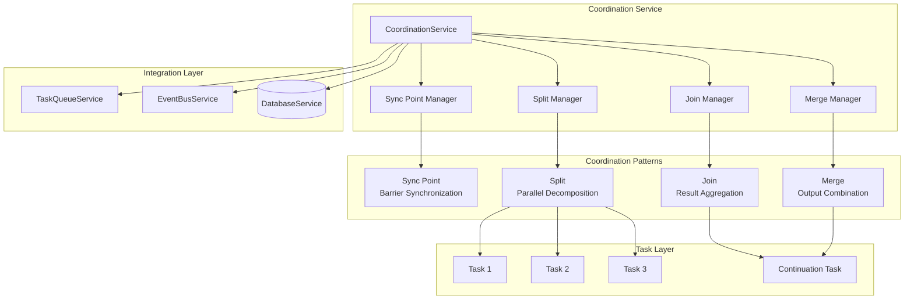
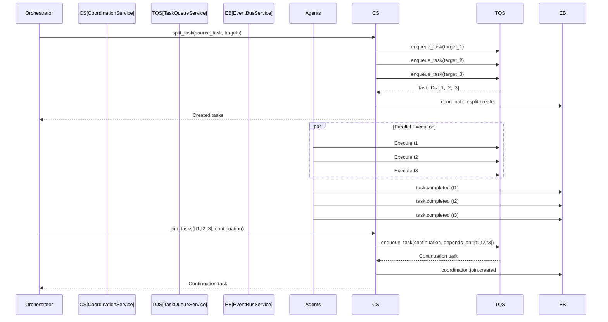
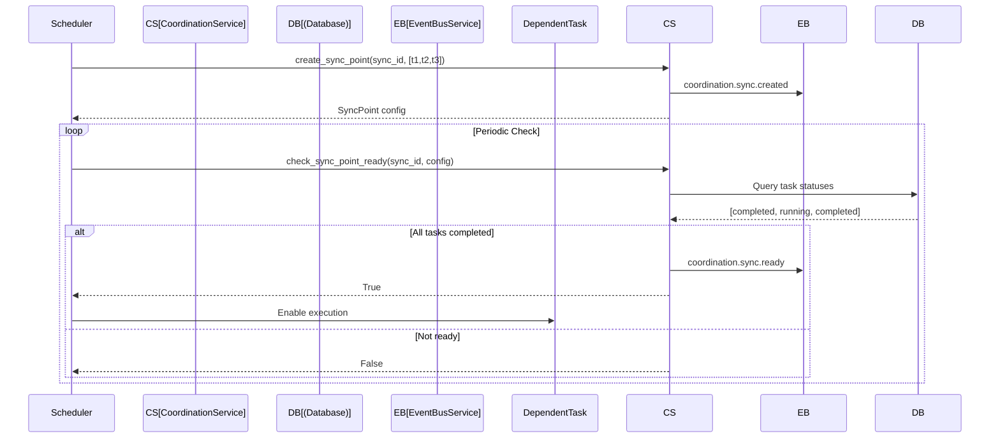
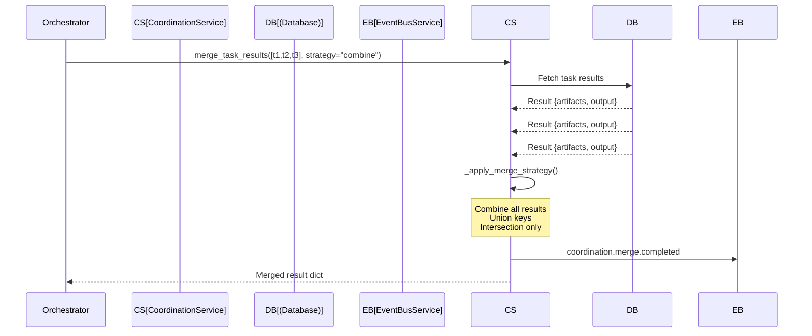
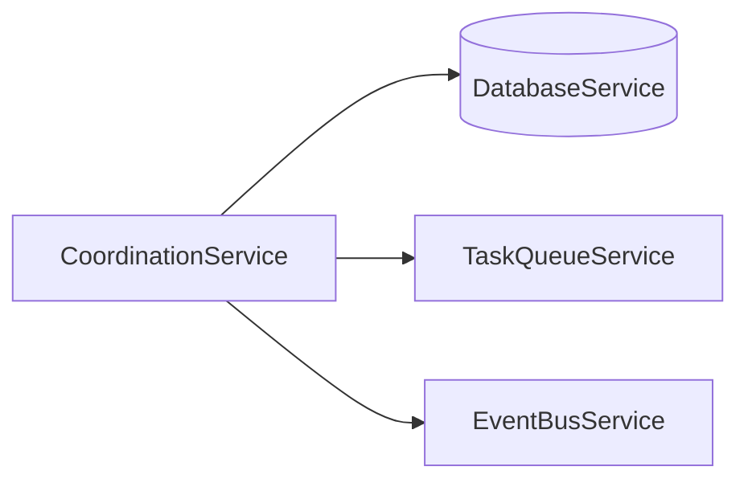

# Coordination Service Design Document

**Created:** 2026-04-22  
**Status:** Active  
**Source File:** `backend/omoi_os/services/coordination.py`  
**Related Docs:** **Task Queue Service**, **Event Bus Service**, [Dependency Graph Service](./dependency_graph_service.md)

---

## 1. Architecture Overview

The Coordination Service provides reusable coordination primitives for multi-agent workflow orchestration. It implements classic parallel computing patterns (sync, split, join, merge) adapted for AI agent workflows. The service enables complex execution patterns where multiple agents work in parallel, synchronize at barriers, and combine their results into coherent outputs.

### 1.1 High-Level Architecture



### 1.2 Split-Join Pattern Flow



### 1.3 Sync Point Pattern Flow



### 1.4 Merge Pattern Flow



---

## 2. Component Responsibilities

| Component | Responsibility | Key Operations |
|-----------|---------------|----------------|
| **CoordinationService** | Main service orchestrating coordination patterns | `execute_pattern()`, `create_sync_point()`, `split_task()`, `join_tasks()`, `merge_task_results()` |
| **Sync Point Manager** | Barrier synchronization for multiple tasks | `create_sync_point()`, `check_sync_point_ready()` |
| **Split Manager** | Decomposes tasks into parallel subtasks | `split_task()` with dependency injection |
| **Join Manager** | Aggregates parallel tasks into continuation | `join_tasks()`, `register_join()` |
| **Merge Manager** | Combines task results using strategies | `merge_task_results()`, `_apply_merge_strategy()` |
| **Pattern Executor** | Generic pattern execution from config | `execute_pattern()` |

---

## 3. System Boundaries

### 3.1 Inside System Boundaries

- Four coordination patterns: SYNC, SPLIT, JOIN, MERGE
- Sync point creation with configurable required completion count
- Task splitting with automatic dependency injection
- Join operations with continuation task creation
- Result merging with multiple strategies (combine, union, intersection, custom)
- Pattern execution from configuration dictionaries
- Event publishing for coordination lifecycle
- Task status querying for sync point readiness

### 3.2 Outside System Boundaries

- Task execution (handled by agent workers)
- Task queue management (handled by TaskQueueService)
- Event bus implementation (handled by EventBusService)
- Database persistence (handled by DatabaseService)
- Custom merge function execution (would need dynamic loading)
- Timeout enforcement (handled by external scheduler)
- Result validation (handled by calling services)

---

## 4. Data Models

### 4.1 Configuration Dataclasses

```python
from dataclasses import dataclass
from typing import Any, Dict, List, Optional
from enum import Enum

class CoordinationPattern(str, Enum):
    """Coordination pattern types."""
    SYNC = "sync"
    SPLIT = "split"
    JOIN = "join"
    MERGE = "merge"

@dataclass
class SyncPoint:
    """Synchronization point configuration.
    
    A sync point waits for multiple tasks to complete before allowing
    dependent tasks to proceed.
    """
    sync_id: str
    waiting_task_ids: List[str]
    required_count: Optional[int] = None  # None = wait for all
    timeout_seconds: Optional[int] = None

@dataclass
class SplitConfig:
    """Split configuration for parallel task creation.
    
    Splits a single task into multiple parallel tasks that can execute
    independently.
    """
    split_id: str
    source_task_id: str
    target_tasks: List[Dict[str, Any]]  # List of task configs
    required_capabilities: Optional[List[str]] = None

@dataclass
class JoinConfig:
    """Join configuration for aggregating parallel tasks.
    
    Joins multiple parallel tasks and creates a continuation task
    that depends on all joined tasks completing.
    """
    join_id: str
    source_task_ids: List[str]
    continuation_task: Dict[str, Any]  # Task config for continuation
    merge_strategy: str = "all"  # "all", "first", "majority"

@dataclass
class MergeConfig:
    """Merge configuration for combining task results.
    
    Merges results from multiple tasks using a specified strategy.
    """
    merge_id: str
    source_task_ids: List[str]
    merge_strategy: str = "combine"  # "combine", "union", "intersection", "custom"
    custom_merge_fn: Optional[str] = None  # Reference to custom merge function
```

### 4.2 Pattern Execution Configuration

```python
# Generic pattern configuration for execute_pattern()
PATTERN_CONFIGS = {
    "sync": {
        "type": "sync",
        "id": "sync_exploration_001",
        "waiting_task_ids": ["task_1", "task_2", "task_3"],
        "required_count": 2,  # Wait for 2 of 3
        "timeout_seconds": 300,
    },
    
    "split": {
        "type": "split",
        "id": "split_analysis_001",
        "source_task_id": "task_parent",
        "target_tasks": [
            {"task_type": "analyze_frontend", "description": "Analyze React components"},
            {"task_type": "analyze_backend", "description": "Analyze API routes"},
            {"task_type": "analyze_db", "description": "Analyze schema"},
        ],
        "required_capabilities": ["code_analysis"],
    },
    
    "join": {
        "type": "join",
        "id": "join_synthesis_001",
        "source_task_ids": ["task_1", "task_2", "task_3"],
        "continuation_task": {
            "task_type": "synthesize_results",
            "description": "Combine analysis results",
            "phase_id": "PHASE_DESIGN",
        },
        "merge_strategy": "all",
    },
    
    "merge": {
        "type": "merge",
        "id": "merge_outputs_001",
        "source_task_ids": ["task_1", "task_2", "task_3"],
        "merge_strategy": "combine",
        "custom_merge_fn": None,
    },
}
```

### 4.3 Merge Strategies

```python
# Available merge strategies
MERGE_STRATEGIES = {
    "combine": "Merge all results into single dict (last write wins for conflicts)",
    "union": "Union of all keys, values from last result",
    "intersection": "Only keys present in ALL results",
    "custom": "User-defined merge function (requires custom_merge_fn)",
}

# Strategy behavior examples
EXAMPLE_RESULTS = [
    {"files": ["a.py"], "summary": "Frontend analysis"},
    {"files": ["b.py"], "summary": "Backend analysis"},
    {"files": ["c.py"], "summary": "Database analysis"},
]

# combine: {"files": ["c.py"], "summary": "Database analysis"}
# union: {"files": ["c.py"], "summary": "Database analysis"}  
# intersection: {}  # No common keys across all

# For list values, strategies could be extended:
# combine_lists: {"files": ["a.py", "b.py", "c.py"], "summary": "..."}
```

---

## 5. API Surface

### 5.1 Sync Point Methods

| Method | Signature | Description |
|--------|-----------|-------------|
| `create_sync_point` | `(sync_id, waiting_task_ids, required_count=None, timeout_seconds=None) -> SyncPoint` | Create synchronization barrier |
| `check_sync_point_ready` | `(sync_id, sync_point) -> bool` | Check if required tasks completed |

### 5.2 Split Methods

| Method | Signature | Description |
|--------|-----------|-------------|
| `split_task` | `(split_id, source_task_id, target_tasks, required_capabilities=None) -> List[Task]` | Split task into parallel subtasks |

### 5.3 Join Methods

| Method | Signature | Description |
|--------|-----------|-------------|
| `join_tasks` | `(join_id, source_task_ids, continuation_task, merge_strategy="all") -> Task` | Join tasks with new continuation |
| `register_join` | `(join_id, source_task_ids, continuation_task_id, merge_strategy="all") -> None` | Register join for existing task |

### 5.4 Merge Methods

| Method | Signature | Description |
|--------|-----------|-------------|
| `merge_task_results` | `(merge_id, source_task_ids, merge_strategy="combine", custom_merge_fn=None) -> Dict[str, Any]` | Merge completed task results |
| `_apply_merge_strategy` | `(results, strategy, custom_fn) -> Dict[str, Any]` | Internal strategy application |

### 5.5 Generic Execution

| Method | Signature | Description |
|--------|-----------|-------------|
| `execute_pattern` | `(pattern_config: Dict[str, Any]) -> Dict[str, Any]` | Execute any pattern from config |

### 5.6 FastAPI Route Integration

```python
from fastapi import APIRouter, Depends, HTTPException
from typing import Dict, Any, List, Optional

router = APIRouter()

@router.post("/coordination/sync")
async def create_sync(
    sync_id: str,
    waiting_task_ids: List[str],
    required_count: Optional[int] = None,
    timeout_seconds: Optional[int] = None,
    coord: CoordinationService = Depends(get_coordination_service)
):
    """Create a synchronization point."""
    sync_point = coord.create_sync_point(
        sync_id=sync_id,
        waiting_task_ids=waiting_task_ids,
        required_count=required_count,
        timeout_seconds=timeout_seconds
    )
    return sync_point

@router.get("/coordination/sync/{sync_id}/ready")
async def check_sync_ready(
    sync_id: str,
    sync_point: SyncPoint,  # Would be loaded from storage
    coord: CoordinationService = Depends(get_coordination_service)
):
    """Check if sync point is ready."""
    is_ready = coord.check_sync_point_ready(sync_id, sync_point)
    return {"sync_id": sync_id, "ready": is_ready}

@router.post("/coordination/split")
async def split_task(
    split_id: str,
    source_task_id: str,
    target_tasks: List[Dict[str, Any]],
    required_capabilities: Optional[List[str]] = None,
    coord: CoordinationService = Depends(get_coordination_service)
):
    """Split a task into parallel subtasks."""
    try:
        tasks = coord.split_task(
            split_id=split_id,
            source_task_id=source_task_id,
            target_tasks=target_tasks,
            required_capabilities=required_capabilities
        )
        return {"split_id": split_id, "tasks": tasks}
    except ValueError as e:
        raise HTTPException(404, detail=str(e))

@router.post("/coordination/join")
async def join_tasks(
    join_id: str,
    source_task_ids: List[str],
    continuation_task: Dict[str, Any],
    merge_strategy: str = "all",
    coord: CoordinationService = Depends(get_coordination_service)
):
    """Join multiple tasks into continuation."""
    try:
        continuation = coord.join_tasks(
            join_id=join_id,
            source_task_ids=source_task_ids,
            continuation_task=continuation_task,
            merge_strategy=merge_strategy
        )
        return {"join_id": join_id, "continuation_task": continuation}
    except ValueError as e:
        raise HTTPException(404, detail=str(e))

@router.post("/coordination/merge")
async def merge_results(
    merge_id: str,
    source_task_ids: List[str],
    merge_strategy: str = "combine",
    custom_merge_fn: Optional[str] = None,
    coord: CoordinationService = Depends(get_coordination_service)
):
    """Merge results from multiple tasks."""
    try:
        merged = coord.merge_task_results(
            merge_id=merge_id,
            source_task_ids=source_task_ids,
            merge_strategy=merge_strategy,
            custom_merge_fn=custom_merge_fn
        )
        return {"merge_id": merge_id, "result": merged}
    except ValueError as e:
        raise HTTPException(400, detail=str(e))

@router.post("/coordination/execute")
async def execute_pattern(
    pattern_config: Dict[str, Any],
    coord: CoordinationService = Depends(get_coordination_service)
):
    """Execute a coordination pattern from configuration."""
    try:
        result = coord.execute_pattern(pattern_config)
        return result
    except ValueError as e:
        raise HTTPException(400, detail=str(e))
```

---

## 6. Integration Points

### 6.1 Services Called By CoordinationService



| Service | Purpose | Key Methods Used |
|---------|---------|------------------|
| **DatabaseService** | Task status queries | `get_session()`, `query(Task)` |
| **TaskQueueService** | Task creation and enqueueing | `enqueue_task()` |
| **EventBusService** | Coordination event publishing | `publish()` |

### 6.2 Services That Call CoordinationService

| Service | Purpose |
|---------|---------|
| **OrchestratorWorker** | Workflow pattern execution |
| **SpecTaskExecutionService** | Parallel task decomposition |
| **SynthesisService** | Result aggregation |
| **PhaseManager** | Phase transition coordination |
| **API Routes** | User-defined coordination patterns |
| **Scheduler** | Sync point monitoring |

### 6.3 Event Types

| Event | Direction | Purpose |
|-------|-----------|---------|
| `coordination.sync.created` | Published | New sync point created |
| `coordination.sync.ready` | Published | Sync point requirements met |
| `coordination.split.created` | Published | Task split into parallel tasks |
| `coordination.join.created` | Published | Tasks joined with continuation |
| `coordination.merge.completed` | Published | Results merged successfully |
| `task.completed` | Subscribed | Triggers sync point checks |

---

## 7. Configuration Parameters

### 7.1 Class Constants

```python
class CoordinationService:
    # No hardcoded constants - all configurable via parameters
    pass

# Default values used in methods
DEFAULTS = {
    "sync_required_count": None,  # Wait for all by default
    "sync_timeout_seconds": None,  # No timeout by default
    "join_merge_strategy": "all",
    "merge_strategy": "combine",
    "split_priority_inherit": True,
}
```

### 7.2 Merge Strategies Detail

```python
MERGE_STRATEGIES = {
    # Combine: Simple dict update (last write wins for conflicts)
    "combine": lambda results: {
        k: v for r in results for k, v in (r or {}).items()
    },
    
    # Union: Same as combine for dicts
    "union": lambda results: {
        k: v for r in results for k, v in (r or {}).items()
    },
    
    # Intersection: Only keys in ALL results
    "intersection": lambda results: (
        {k: results[-1][k] for k in set.intersection(
            *[set(r.keys()) for r in results if r]
        )} if results and all(r for r in results) else {}
    ),
    
    # Custom: User-provided function (not implemented)
    "custom": None,
}

# Future strategies
FUTURE_STRATEGIES = [
    "combine_lists",  # Concatenate list values
    "vote",           # Majority voting for scalar values
    "average",        # Numeric averaging
    "concat",         # String concatenation
]
```

### 7.3 Pattern Configuration Schema

```python
# JSON Schema for pattern validation
PATTERN_SCHEMA = {
    "sync": {
        "required": ["type", "id", "waiting_task_ids"],
        "properties": {
            "type": {"const": "sync"},
            "id": {"type": "string"},
            "waiting_task_ids": {"type": "array", "items": {"type": "string"}},
            "required_count": {"type": "integer", "minimum": 1},
            "timeout_seconds": {"type": "integer", "minimum": 1},
        },
    },
    "split": {
        "required": ["type", "id", "source_task_id", "target_tasks"],
        "properties": {
            "type": {"const": "split"},
            "id": {"type": "string"},
            "source_task_id": {"type": "string"},
            "target_tasks": {"type": "array", "items": {"type": "object"}},
            "required_capabilities": {"type": "array", "items": {"type": "string"}},
        },
    },
    "join": {
        "required": ["type", "id", "source_task_ids", "continuation_task"],
        "properties": {
            "type": {"const": "join"},
            "id": {"type": "string"},
            "source_task_ids": {"type": "array", "items": {"type": "string"}},
            "continuation_task": {"type": "object"},
            "merge_strategy": {"enum": ["all", "first", "majority"]},
        },
    },
    "merge": {
        "required": ["type", "id", "source_task_ids"],
        "properties": {
            "type": {"const": "merge"},
            "id": {"type": "string"},
            "source_task_ids": {"type": "array", "items": {"type": "string"}},
            "merge_strategy": {"enum": ["combine", "union", "intersection", "custom"]},
            "custom_merge_fn": {"type": "string"},
        },
    },
}
```

---

## 8. Error Handling

### 8.1 Error Categories

| Category | Examples | Handling Strategy |
|----------|----------|-------------------|
| **Not Found** | Source task doesn't exist | Raise `ValueError` with clear message |
| **Invalid State** | Task not completed for merge | Raise `ValueError` before merge attempt |
| **Incomplete Join** | Missing source tasks | Raise `ValueError` with list of missing |
| **Invalid Strategy** | Unknown merge strategy | Fall back to "combine" strategy |
| **Custom Function** | Custom merge fn not found | Fall back to "combine" strategy |
| **Database** | Connection failure | Propagate exception, rollback |

### 8.2 Error Handling Patterns

```python
# Source task validation
def split_task(self, split_id, source_task_id, target_tasks, ...):
    source_task = session.query(Task).filter(Task.id == source_task_id).first()
    if not source_task:
        raise ValueError(f"Source task {source_task_id} not found")
    # ... proceed

# Join validation
def join_tasks(self, join_id, source_task_ids, ...):
    source_tasks = session.query(Task).filter(Task.id.in_(source_task_ids)).all()
    if len(source_tasks) != len(source_task_ids):
        raise ValueError("Some source tasks not found")
    # ... proceed

# Merge validation
def merge_task_results(self, merge_id, source_task_ids, ...):
    for task in source_tasks:
        if task.status != "completed":
            raise ValueError(f"Task {task.id} is not completed")
    # ... proceed

# Strategy fallback
def _apply_merge_strategy(self, results, strategy, custom_fn):
    if strategy == "custom" and custom_fn:
        # Would need dynamic loading
        return self._apply_merge_strategy(results, "combine", None)
    # ... other strategies
```

### 8.3 Graceful Degradation

```python
# Remediation task creation (best effort)
def _create_remediation_task(self, ticket_id, blocker_type):
    try:
        self.task_queue.create_task(...)
    except Exception:
        # Fail silently - remediation is best effort
        pass

# Custom function fallback
if strategy == "custom" and custom_merge_fn:
    # For now, fall back to combine
    # Future: Load and execute custom function
    return self._apply_merge_strategy(results, "combine", None)
```

---

## 9. Usage Patterns

### 9.1 Parallel Code Analysis

```python
# Split a large analysis task into parallel subtasks
split_config = {
    "type": "split",
    "id": "analyze_codebase_001",
    "source_task_id": "task_explore",
    "target_tasks": [
        {"task_type": "analyze_frontend", "description": "Analyze React components"},
        {"task_type": "analyze_backend", "description": "Analyze API routes"},
        {"task_type": "analyze_database", "description": "Analyze schema"},
        {"task_type": "analyze_tests", "description": "Analyze test coverage"},
    ],
}

tasks = coordination_service.execute_pattern(split_config)

# Later, join results
join_config = {
    "type": "join",
    "id": "synthesize_analysis_001",
    "source_task_ids": [t.id for t in tasks["tasks"]],
    "continuation_task": {
        "task_type": "synthesize_analysis",
        "description": "Combine all analysis results",
    },
}

continuation = coordination_service.execute_pattern(join_config)
```

### 9.2 Synchronization Barrier

```python
# Wait for multiple exploration tasks before proceeding
sync_config = {
    "type": "sync",
    "id": "sync_exploration",
    "waiting_task_ids": ["explore_1", "explore_2", "explore_3"],
    "required_count": 2,  # Proceed after 2 complete
    "timeout_seconds": 300,
}

sync_point = coordination_service.execute_pattern(sync_config)

# Check readiness
while not coordination_service.check_sync_point_ready(sync_id, sync_point):
    await asyncio.sleep(10)

# Proceed with dependent tasks
```

### 9.3 Result Aggregation

```python
# Merge results from parallel implementations
merge_config = {
    "type": "merge",
    "id": "merge_implementations",
    "source_task_ids": ["impl_1", "impl_2", "impl_3"],
    "merge_strategy": "combine",
}

merged = coordination_service.execute_pattern(merge_config)
# merged contains combined artifacts from all implementations
```

---

## 10. Performance Characteristics

| Metric | Target | Notes |
|--------|--------|-------|
| Sync point creation | < 10ms | In-memory config creation |
| Sync point check | < 50ms | DB query for task statuses |
| Task split | < 100ms | Task creation per subtask |
| Task join | < 100ms | Continuation task creation |
| Result merge | < 50ms | In-memory dict operations |
| Pattern execution | < 200ms | Total pattern setup |
| Event publishing | < 5ms | Async fire-and-forget |

---

## 11. Future Enhancements

1. **Dynamic Custom Functions** - Load and execute custom merge functions
2. **Nested Patterns** - Support patterns within patterns (split within join)
3. **Conditional Patterns** - Execute patterns based on runtime conditions
4. **Pattern Templates** - Pre-defined reusable pattern configurations
5. **Visual Editor** - Drag-and-drop pattern composition UI
6. **Timeout Handling** - Built-in timeout enforcement with callbacks
7. **Partial Results** - Handle incomplete merges with partial data
8. **Conflict Resolution** - Smart merging with conflict detection and resolution
9. **Pattern Analytics** - Performance metrics per pattern type
10. **Distributed Coordination** - Cross-node coordination for scaled deployments

---

*Document Version: 1.0*  
*Last Updated: 2026-04-22*  
*Maintainer: OmoiOS Core Team*
