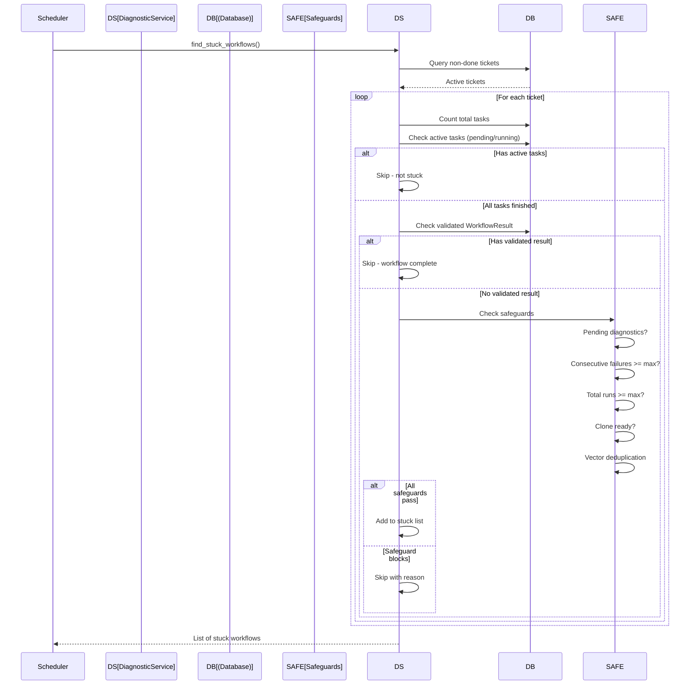
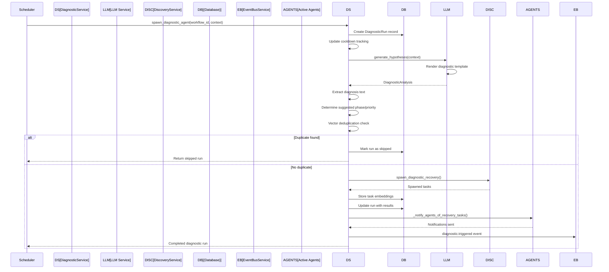
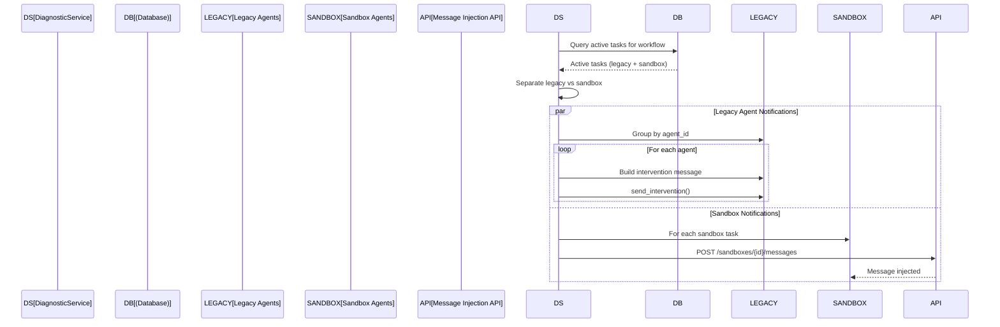
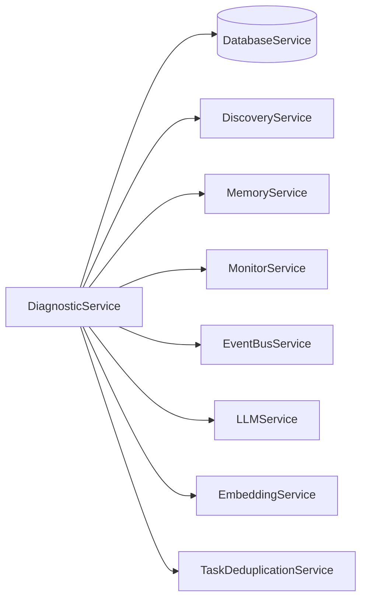

# Diagnostic Service Design Document

**Created:** 2026-04-22  
**Status:** Active  
**Source File:** `backend/omoi_os/services/diagnostic.py`  
**Related Docs:** [Discovery Service](./discovery_service.md), [Monitor Service](./monitor_service.md), [Intelligent Guardian](../../architecture/04-readjustment-system.md)

---

## 1. Architecture Overview

The Diagnostic Service provides automated detection and recovery for stuck workflows. It monitors workflow execution, identifies when tickets are stalled (all tasks complete but no validated result), and spawns diagnostic agents to analyze root causes and create recovery tasks. The service implements multiple safeguards against runaway task spawning including cooldown periods, failure tracking, and vector-based semantic deduplication.

### 1.1 High-Level Architecture

```mermaid
flowchart TB
    subgraph "Diagnostic Service"
        DS[DiagnosticService]
        DET[Stuck Detector]
        HYP[Hypothesis Generator]
        REC[Recovery Spawner]
        SAFE[Safeguard Manager]
    end
    
    subgraph "Detection Criteria"
        C1[All Tasks Finished]
        C2[No Validated Result]
        C3[Cooldown Passed]
        C4[Stuck Time Met]
    end
    
    subgraph "Safeguards"
        S1[Pending Check]
        S2[Failure Limit]
        S3[Total Run Limit]
        S4[Clone Readiness]
        S5[Vector Deduplication]
    end
    
    subgraph "Integration Layer"
        DISC[DiscoveryService]
        MEM[MemoryService]
        MON[MonitorService]
        EB[EventBusService]
        EMB[EmbeddingService]
    end
    
    subgraph "Data Layer"
        TICKET[Ticket Model]
        TASK[Task Model]
        DR[DiagnosticRun Model]
        WR[WorkflowResult Model]
    end
    
    DS --> DET
    DS --> HYP
    DS --> REC
    DS --> SAFE
    
    DET --> C1
    DET --> C2
    DET --> C3
    DET --> C4
    
    SAFE --> S1
    SAFE --> S2
    SAFE --> S3
    SAFE --> S4
    SAFE --> S5
    
    DS --> DISC
    DS --> MEM
    DS --> MON
    DS --> EB
    DS --> EMB
    
    DS --> TICKET
    DS --> TASK
    DS --> DR
    DS --> WR
```



### 1.2 Stuck Workflow Detection Flow



### 1.3 Diagnostic Agent Spawning Flow



### 1.4 Agent Notification Flow



---

## 2. Component Responsibilities

| Component | Responsibility | Key Operations |
|-----------|---------------|----------------|
| **DiagnosticService** | Main service orchestrating stuck workflow detection and recovery | `find_stuck_workflows()`, `spawn_diagnostic_agent()`, `build_diagnostic_context()` |
| **Stuck Detector** | Identifies workflows meeting stuck criteria | Checks tasks finished, no validated result, cooldown, stuck time |
| **Safeguard Manager** | Prevents runaway diagnostic spawning | Pending check, failure limits, clone readiness, vector dedup |
| **Hypothesis Generator** | LLM-powered root cause analysis | `generate_hypotheses()`, renders diagnostic templates |
| **Recovery Spawner** | Creates diagnostic recovery tasks | `spawn_diagnostic_recovery()`, task embedding storage |
| **Agent Notifier** | Alerts active agents about recovery tasks | `_notify_agents_of_recovery_tasks()`, sandbox message injection |
| **Failure Tracker** | Tracks consecutive failures per workflow | `record_diagnostic_task_failure()`, `record_diagnostic_task_success()` |

---

## 3. System Boundaries

### 3.1 Inside System Boundaries

- Stuck workflow detection with 6 criteria (active workflow, tasks exist, all finished, no validated result, cooldown passed, stuck time met)
- 5 safeguard checks (pending diagnostics, consecutive failures, total runs, clone readiness, vector deduplication)
- LLM-powered hypothesis generation with structured output
- Diagnostic recovery task spawning via DiscoveryService
- Vector-based semantic deduplication for pending tasks
- Agent notification via intervention system (legacy) and message injection (sandbox)
- Failure tracking with consecutive failure counting
- Diagnostic run lifecycle management (running → completed/failed/skipped)
- Cooldown tracking per workflow

### 3.2 Outside System Boundaries

- Task execution (handled by agent workers)
- LLM inference (handled by LLMService)
- Recovery task creation (handled by DiscoveryService)
- Vector embedding generation (handled by EmbeddingService)
- Event bus implementation (handled by EventBusService)
- Database persistence (handled by DatabaseService)
- GitHub token management (handled by User/Project models)
- Sandbox message injection API (external HTTP endpoint)

---

## 4. Data Models

### 4.1 Database Schema

```sql
-- Diagnostic runs tracking
CREATE TABLE diagnostic_runs (
    id UUID PRIMARY KEY DEFAULT gen_random_uuid(),
    workflow_id UUID NOT NULL REFERENCES tickets(id) ON DELETE CASCADE,
    triggered_at TIMESTAMP WITH TIME ZONE NOT NULL,
    completed_at TIMESTAMP WITH TIME ZONE,
    status VARCHAR(50) NOT NULL DEFAULT 'running',  -- running, completed, failed, skipped
    
    -- Trigger context
    total_tasks_at_trigger INTEGER NOT NULL,
    done_tasks_at_trigger INTEGER NOT NULL,
    failed_tasks_at_trigger INTEGER NOT NULL,
    time_since_last_task_seconds INTEGER NOT NULL,
    
    -- Analysis results
    workflow_goal TEXT,
    phases_analyzed JSONB,
    agents_reviewed JSONB,
    diagnosis TEXT,
    
    -- Spawned tasks
    tasks_created_count INTEGER DEFAULT 0,
    tasks_created_ids JSONB DEFAULT '{}',  -- {"task_ids": [...]}
    
    created_at TIMESTAMP WITH TIME ZONE DEFAULT NOW()
);

CREATE INDEX idx_diagnostic_runs_workflow_id ON diagnostic_runs(workflow_id);
CREATE INDEX idx_diagnostic_runs_triggered_at ON diagnostic_runs(triggered_at);
CREATE INDEX idx_diagnostic_runs_status ON diagnostic_runs(status);

-- Tickets (workflows) with diagnostic-relevant fields
CREATE TABLE tickets (
    id UUID PRIMARY KEY DEFAULT gen_random_uuid(),
    title VARCHAR(255) NOT NULL,
    description TEXT,
    status VARCHAR(50) NOT NULL DEFAULT 'backlog',
    phase_id VARCHAR(50) NOT NULL DEFAULT 'PHASE_BACKLOG',
    project_id UUID REFERENCES projects(id),
    
    -- Blocking state
    is_blocked BOOLEAN DEFAULT FALSE,
    blocked_reason VARCHAR(100),
    blocked_at TIMESTAMP WITH TIME ZONE,
    
    created_at TIMESTAMP WITH TIME ZONE DEFAULT NOW(),
    updated_at TIMESTAMP WITH TIME ZONE DEFAULT NOW()
);

-- Tasks with diagnostic-relevant fields
CREATE TABLE tasks (
    id UUID PRIMARY KEY DEFAULT gen_random_uuid(),
    ticket_id UUID NOT NULL REFERENCES tickets(id) ON DELETE CASCADE,
    phase_id VARCHAR(50) NOT NULL,
    task_type VARCHAR(50) NOT NULL,
    status VARCHAR(50) NOT NULL DEFAULT 'pending',
    description TEXT,
    priority INTEGER DEFAULT 0,
    
    -- Agent assignment (legacy mode)
    assigned_agent_id UUID REFERENCES agents(id),
    conversation_id VARCHAR(255),
    persistence_dir VARCHAR(500),
    
    -- Sandbox mode
    sandbox_id VARCHAR(255),
    
    -- Results
    result JSONB,
    error_message TEXT,
    
    -- Timestamps
    created_at TIMESTAMP WITH TIME ZONE DEFAULT NOW(),
    started_at TIMESTAMP WITH TIME ZONE,
    completed_at TIMESTAMP WITH TIME ZONE
);

CREATE INDEX idx_tasks_ticket_id ON tasks(ticket_id);
CREATE INDEX idx_tasks_status ON tasks(status);
CREATE INDEX idx_tasks_task_type ON tasks(task_type);
CREATE INDEX idx_tasks_completed_at ON tasks(completed_at);

-- Workflow results
CREATE TABLE workflow_results (
    id UUID PRIMARY KEY DEFAULT gen_random_uuid(),
    workflow_id UUID NOT NULL REFERENCES tickets(id) ON DELETE CASCADE,
    status VARCHAR(50) NOT NULL,  -- submitted, validated, rejected
    markdown_file_path VARCHAR(500),
    explanation TEXT,
    validation_feedback TEXT,
    validated_at TIMESTAMP WITH TIME ZONE,
    created_at TIMESTAMP WITH TIME ZONE DEFAULT NOW()
);

CREATE INDEX idx_workflow_results_workflow_id ON workflow_results(workflow_id);
CREATE INDEX idx_workflow_results_status ON workflow_results(status);
```

### 4.2 Pydantic Models

```python
from pydantic import BaseModel, Field
from typing import Optional, List, Dict, Any
from enum import StrEnum
from datetime import datetime
from uuid import UUID

class DiagnosticStatus(StrEnum):
    """Status of a diagnostic run."""
    RUNNING = "running"
    COMPLETED = "completed"
    FAILED = "failed"
    SKIPPED = "skipped"

class Hypothesis(BaseModel):
    """A diagnostic hypothesis."""
    statement: str
    likelihood: float = Field(..., ge=0.0, le=1.0)
    evidence: List[str] = Field(default_factory=list)

class Recommendation(BaseModel):
    """A recovery recommendation."""
    description: str
    priority: str  # HIGH, MEDIUM, LOW
    action_type: str  # retry, refactor, investigate, escalate
    estimated_effort: Optional[str] = None

class DiagnosticAnalysis(BaseModel):
    """Structured output from LLM diagnostic analysis."""
    root_cause: Optional[str] = None
    hypotheses: List[Hypothesis] = Field(default_factory=list)
    recommendations: List[Recommendation] = Field(default_factory=list)
    confidence_score: float = Field(0.0, ge=0.0, le=1.0)
    suggested_phase: Optional[str] = None
    suggested_priority: Optional[str] = None

class StuckWorkflowInfo(BaseModel):
    """Information about a stuck workflow."""
    workflow_id: UUID
    time_stuck_seconds: int
    total_tasks: int
    done_tasks: int
    failed_tasks: int
    last_task_completed_at: Optional[datetime] = None

class DiagnosticRunRecord(BaseModel):
    """Diagnostic run record for API responses."""
    id: UUID
    workflow_id: UUID
    triggered_at: datetime
    completed_at: Optional[datetime]
    status: DiagnosticStatus
    total_tasks_at_trigger: int
    done_tasks_at_trigger: int
    failed_tasks_at_trigger: int
    time_since_last_task_seconds: int
    diagnosis: Optional[str] = None
    tasks_created_count: int
    tasks_created_ids: Dict[str, List[str]]

class DiagnosticContext(BaseModel):
    """Comprehensive context for diagnostic analysis."""
    workflow_id: UUID
    workflow_goal: str
    ticket_title: str
    ticket_description: str
    current_phase: str
    total_tasks: int
    done_tasks: int
    failed_tasks: int
    time_stuck_seconds: int
    recent_tasks: List[Dict[str, Any]]
    agents_reviewed: Dict[str, Any]
    phases_analyzed: Dict[str, Any]
    conductor_analyses: List[Dict[str, Any]]
    submitted_results: List[Dict[str, Any]]

class SafeguardConfig(BaseModel):
    """Configuration for diagnostic safeguards."""
    max_consecutive_failures: int = 3
    max_diagnostics_per_workflow: int = 5
    cooldown_seconds: int = 60
    stuck_threshold_seconds: int = 60
    vector_similarity_threshold: float = 0.90
```

### 4.3 Service Configuration

```python
from omoi_os.config import OmoiBaseSettings
from pydantic_settings import SettingsConfigDict
from functools import lru_cache

class DiagnosticSettings(OmoiBaseSettings):
    """Diagnostic service configuration."""
    yaml_section = "diagnostic"
    model_config = SettingsConfigDict(env_prefix="DIAGNOSTIC_")
    
    # Runaway prevention
    max_consecutive_failures: int = 3
    max_diagnostics_per_workflow: int = 5
    
    # Detection thresholds
    cooldown_seconds: int = 60
    stuck_threshold_seconds: int = 60
    
    # LLM settings
    hypothesis_max_tokens: int = 2000
    hypothesis_temperature: float = 0.3
    
    # Vector deduplication
    enable_vector_dedup: bool = True
    vector_similarity_threshold: float = 0.90
    
    # Notification settings
    enable_agent_notifications: bool = True
    max_recovery_tasks_to_show: int = 3

@lru_cache(maxsize=1)
def get_diagnostic_settings() -> DiagnosticSettings:
    return DiagnosticSettings()
```

---

## 5. API Surface

### 5.1 Detection Methods

| Method | Signature | Description |
|--------|-----------|-------------|
| `find_stuck_workflows` | `(cooldown_seconds=60, stuck_threshold_seconds=60) -> List[dict]` | Find workflows meeting all stuck criteria with safeguards |
| `build_diagnostic_context` | `(workflow_id, max_agents=15, max_analyses=5) -> dict` | Build comprehensive context for diagnostic analysis |

### 5.2 Diagnostic Execution Methods

| Method | Signature | Description |
|--------|-----------|-------------|
| `spawn_diagnostic_agent` | `(workflow_id, context, max_tasks=5) -> DiagnosticRun` | Create diagnostic run, generate hypotheses, spawn recovery tasks |
| `generate_hypotheses` | `(context) -> DiagnosticAnalysis` | LLM-powered root cause analysis |
| `complete_diagnostic_run` | `(run_id, tasks_created, diagnosis) -> Optional[DiagnosticRun]` | Mark diagnostic run as completed |

### 5.3 History and Query Methods

| Method | Signature | Description |
|--------|-----------|-------------|
| `get_diagnostic_runs` | `(workflow_id=None, limit=100) -> List[DiagnosticRun]` | Get diagnostic run history |

### 5.4 Failure Tracking Methods

| Method | Signature | Description |
|--------|-----------|-------------|
| `record_diagnostic_task_failure` | `(workflow_id) -> int` | Record a diagnostic task failure |
| `record_diagnostic_task_success` | `(workflow_id) -> None` | Record a diagnostic task success (resets counter) |
| `reset_failure_tracking` | `(workflow_id=None) -> None` | Reset failure tracking for workflow or all |
| `get_failure_stats` | `() -> Dict[str, int]` | Get current failure statistics |
| `check_diagnostic_task_outcomes` | `() -> None` | Check recent outcomes and update tracking |

### 5.5 FastAPI Route Integration

```python
from fastapi import APIRouter, Depends, HTTPException
from typing import Optional, List

router = APIRouter()

@router.get("/diagnostics/stuck-workflows")
async def get_stuck_workflows(
    cooldown_seconds: int = 60,
    stuck_threshold_seconds: int = 60,
    diagnostic: DiagnosticService = Depends(get_diagnostic_service)
):
    """Find workflows that appear to be stuck."""
    stuck = diagnostic.find_stuck_workflows(
        cooldown_seconds=cooldown_seconds,
        stuck_threshold_seconds=stuck_threshold_seconds
    )
    return {"stuck_workflows": stuck, "count": len(stuck)}

@router.post("/diagnostics/workflow/{workflow_id}")
async def run_diagnostic(
    workflow_id: str,
    max_tasks: int = 5,
    diagnostic: DiagnosticService = Depends(get_diagnostic_service)
):
    """Manually trigger diagnostic for a workflow."""
    context = diagnostic.build_diagnostic_context(workflow_id)
    if not context:
        raise HTTPException(404, detail="Workflow not found")
    
    run = await diagnostic.spawn_diagnostic_agent(
        workflow_id=workflow_id,
        context=context,
        max_tasks=max_tasks
    )
    return run

@router.get("/diagnostics/runs")
async def get_diagnostic_runs(
    workflow_id: Optional[str] = None,
    limit: int = 100,
    diagnostic: DiagnosticService = Depends(get_diagnostic_service)
):
    """Get diagnostic run history."""
    runs = diagnostic.get_diagnostic_runs(workflow_id=workflow_id, limit=limit)
    return {"runs": runs}

@router.get("/diagnostics/failure-stats")
async def get_failure_stats(
    diagnostic: DiagnosticService = Depends(get_diagnostic_service)
):
    """Get diagnostic failure statistics."""
    stats = diagnostic.get_failure_stats()
    return {"failure_stats": stats}

@router.post("/diagnostics/reset-failures")
async def reset_failures(
    workflow_id: Optional[str] = None,
    diagnostic: DiagnosticService = Depends(get_diagnostic_service)
):
    """Reset failure tracking for a workflow or all workflows."""
    diagnostic.reset_failure_tracking(workflow_id=workflow_id)
    return {"message": "Failure tracking reset", "workflow_id": workflow_id}
```

---

## 6. Integration Points

### 6.1 Services Called By DiagnosticService



| Service | Purpose | Key Methods Used |
|---------|---------|------------------|
| **DatabaseService** | Ticket, Task, DiagnosticRun queries | `get_session()` |
| **DiscoveryService** | Spawn diagnostic recovery tasks | `spawn_diagnostic_recovery()` |
| **MemoryService** | Context building | Memory retrieval |
| **MonitorService** | Metrics and health | Health checks |
| **EventBusService** | Publish diagnostic events | `publish()` |
| **LLMService** | Hypothesis generation | `structured_output()` |
| **EmbeddingService** | Vector embeddings for dedup | Embedding generation |
| **TaskDeduplicationService** | Semantic task deduplication | `check_similar_pending_diagnostic()` |
| **TemplateService** | Prompt rendering | `render()`, `render_system_prompt()` |
| **ConversationInterventionService** | Agent notifications | `send_intervention()` |

### 6.2 Services That Call DiagnosticService

| Service | Purpose |
|---------|---------|
| **MonitoringLoop** | Periodic stuck workflow detection |
| **IntelligentGuardian** | Trigger diagnostics for stuck agents |
| **API Routes** | Manual diagnostic triggering |
| **Scheduler** | Automated diagnostic checks |

### 6.3 Event Types

| Event | Direction | Purpose |
|-------|-----------|---------|
| `diagnostic.triggered` | Published | New diagnostic run started |
| `diagnostic.completed` | Published | Diagnostic run completed |
| `coordination.sync.created` | Published | Sync point for recovery tasks |
| `task.completed` | Subscribed | Update failure tracking |
| `task.failed` | Subscribed | Update failure tracking |

---

## 7. Configuration Parameters

### 7.1 Environment Variables

| Variable | Default | Description |
|----------|---------|-------------|
| `DIAGNOSTIC_MAX_CONSECUTIVE_FAILURES` | 3 | Stop spawning after N consecutive failures |
| `DIAGNOSTIC_MAX_DIAGNOSTICS_PER_WORKFLOW` | 5 | Max total diagnostic runs per workflow |
| `DIAGNOSTIC_COOLDOWN_SECONDS` | 60 | Min time between diagnostics for same workflow |
| `DIAGNOSTIC_STUCK_THRESHOLD_SECONDS` | 60 | Min time since last task activity to consider stuck |
| `DIAGNOSTIC_ENABLE_VECTOR_DEDUP` | true | Enable vector-based semantic deduplication |
| `DIAGNOSTIC_VECTOR_SIMILARITY_THRESHOLD` | 0.90 | Similarity threshold for deduplication |
| `DIAGNOSTIC_ENABLE_AGENT_NOTIFICATIONS` | true | Notify active agents about recovery tasks |
| `DIAGNOSTIC_MAX_RECOVERY_TASKS_TO_SHOW` | 3 | Max tasks to list in agent notifications |

### 7.2 Stuck Detection Criteria

```python
# All must be true for workflow to be considered stuck
STUCK_CRITERIA = {
    "active_workflow": "Ticket status != 'done'",
    "has_tasks": "Total tasks > 0",
    "all_tasks_finished": "No pending/running/assigned tasks",
    "no_validated_result": "No WorkflowResult with status='validated'",
    "cooldown_passed": "Time since last diagnostic > cooldown_seconds",
    "stuck_time_met": "Time since last task activity > stuck_threshold_seconds",
}

# Any true = skip workflow (safeguards)
SAFEGUARD_CHECKS = {
    "has_pending_diagnostics": "Pending/running diagnostic tasks exist",
    "exceeded_consecutive_failures": "Failures >= max_consecutive_failures",
    "exceeded_total_runs": "Total runs >= max_diagnostics_per_workflow",
    "not_clone_ready": "Missing project, GitHub config, or token",
    "vector_duplicate": "Semantically similar pending task exists",
    "all_tasks_succeeded": "Completed tasks > 0 AND failed tasks == 0",
    "diagnostics_completed_but_failed_remain": "Completed diagnostics but original tasks still failed",
}
```

### 7.3 Clone Readiness Chain

```python
# Complete chain for clone readiness
CLONE_READINESS_CHAIN = [
    ("ticket.project_id", "Ticket linked to project"),
    ("project.exists", "Project exists"),
    ("project.github_owner", "Project has GitHub owner"),
    ("project.github_repo", "Project has GitHub repo"),
    ("project.created_by", "Project has owner"),
    ("owner.exists", "Owner exists"),
    ("owner.attributes.github_access_token", "Owner has GitHub token"),
]

# Failure reasons
CLONE_FAILURE_REASONS = {
    "ticket_not_linked_to_project": "Ticket must be linked to project at creation",
    "project_not_found": "Project does not exist",
    "project_missing_github_config": "Project missing GitHub owner/repo",
    "project_has_no_owner": "Project has no created_by",
    "project_owner_not_found": "Project owner user not found",
    "owner_missing_github_token": "Owner missing GitHub access token",
}
```

---

## 8. Error Handling

### 8.1 Error Categories

| Category | Examples | Handling Strategy |
|----------|----------|-------------------|
| **Not Found** | Workflow doesn't exist | Return empty context / None |
| **Safeguard Block** | Pending diagnostics exist | Skip with debug log |
| **LLM Failure** | Hypothesis generation fails | Use fallback diagnosis text |
| **Spawn Failure** | Recovery task creation fails | Mark run as failed |
| **Notification Failure** | Agent notification fails | Log warning, don't fail diagnostic |
| **Vector Dedup Failure** | Embedding service unavailable | Log warning, continue with spawn |
| **Database** | Connection failure | Propagate exception |

### 8.2 Error Handling Patterns

```python
# LLM failure fallback
try:
    analysis = await self.generate_hypotheses(context)
    diagnosis_text = self._format_analysis(analysis)
    suggested_phase = analysis.suggested_phase or "PHASE_IMPLEMENTATION"
except Exception:
    # Fallback if hypothesis generation fails
    diagnosis_text = f"Diagnostic triggered: Workflow stuck for {context.get('time_stuck_seconds', 0)} seconds"
    suggested_phase = "PHASE_IMPLEMENTATION"
    suggested_priority = "HIGH"

# Spawn failure handling
try:
    spawned_tasks = await self.discovery.spawn_diagnostic_recovery(...)
    # Update run as completed
except Exception as e:
    # Mark run as failed
    diagnostic_run.status = "failed"
    diagnostic_run.diagnosis = f"Failed to spawn recovery tasks: {str(e)}"

# Notification failure (best effort)
try:
    self._notify_agents_of_recovery_tasks(...)
except Exception as e:
    logger.warning(f"Failed to notify agents: {e}")
    # Don't fail diagnostic

# Vector dedup failure (continue with spawn)
try:
    dedup_result = self._task_dedup.check_similar_pending_diagnostic(...)
    if dedup_result.is_duplicate:
        # Skip and mark as skipped
        return diagnostic_run
except Exception as e:
    logger.warning(f"Vector deduplication check failed, continuing: {e}")
```

### 8.3 Failure Tracking

```python
# Record failure (increments counter)
def record_diagnostic_task_failure(self, workflow_id: str) -> int:
    current_count = self._consecutive_failures.get(workflow_id, 0)
    new_count = current_count + 1
    self._consecutive_failures[workflow_id] = new_count
    
    if new_count >= self.max_consecutive_failures:
        logger.warning(f"Workflow {workflow_id} reached max failures ({new_count})")
    
    return new_count

# Record success (resets counter)
def record_diagnostic_task_success(self, workflow_id: str) -> None:
    if workflow_id in self._consecutive_failures:
        del self._consecutive_failures[workflow_id]
        logger.info(f"Workflow {workflow_id} diagnostic success - counter reset")
```

---

## 9. Safeguards and Runaway Prevention

### 9.1 Safeguard Hierarchy

```
┌─────────────────────────────────────────────────────────────┐
│                    SAFEGUARD CHECKS                           │
├─────────────────────────────────────────────────────────────┤
│ 1. All Tasks Succeeded?                                      │
│    → If completed > 0 AND failed == 0: SKIP                  │
│    (Prevents diagnostics for simple successful workflows)      │
├─────────────────────────────────────────────────────────────┤
│ 2. Diagnostics Completed But Failed Remain?                  │
│    → If completed_diagnostics > 0 AND failed_original > 0:   │
│      SKIP (needs human review)                               │
├─────────────────────────────────────────────────────────────┤
│ 3. Pending Diagnostic Tasks?                                 │
│    → If pending diagnostic tasks exist: SKIP                 │
├─────────────────────────────────────────────────────────────┤
│ 4. Consecutive Failures >= Max?                              │
│    → If failures >= max_consecutive_failures: SKIP           │
├─────────────────────────────────────────────────────────────┤
│ 5. Total Runs >= Max?                                        │
│    → If total_runs >= max_diagnostics_per_workflow: SKIP     │
├─────────────────────────────────────────────────────────────┤
│ 6. Clone Ready?                                              │
│    → If missing project/GitHub/token: SKIP                   │
├─────────────────────────────────────────────────────────────┤
│ 7. Vector Duplicate?                                         │
│    → If semantically similar pending task: SKIP              │
└─────────────────────────────────────────────────────────────┘
```

### 9.2 Vector Deduplication

```python
# Check for semantically similar pending diagnostic tasks
dedup_result = self._task_dedup.check_similar_pending_diagnostic(
    workflow_id=workflow_id,
    description=diagnosis_text,
    threshold=0.90,  # High threshold for strict matching
)

if dedup_result.is_duplicate:
    logger.warning(
        f"Skipping diagnostic spawn: Found similar pending task(s) "
        f"with similarity {dedup_result.highest_similarity:.2f}"
    )
    # Mark run as skipped
    diagnostic_run.status = "skipped"
    return diagnostic_run

# Store embedding for future dedup
for task in spawned_tasks:
    self._task_dedup.generate_and_store_embedding(task, session)
```

---

## 10. Performance Characteristics

| Metric | Target | Notes |
|--------|--------|-------|
| Stuck workflow detection | < 5s | Query all non-done tickets |
| Per-ticket stuck check | < 100ms | Task status queries |
| Hypothesis generation | < 3s | LLM call with context |
| Recovery task spawning | < 500ms | DiscoveryService call |
| Agent notification | < 1s | Intervention + sandbox API |
| Vector dedup check | < 500ms | Embedding similarity search |
| Full diagnostic cycle | < 10s | Detection → Spawn → Notify |

---

## 11. Future Enhancements

1. **Predictive Diagnostics** - ML-based early warning before workflows get stuck
2. **Diagnostic Templates** - Custom diagnostic prompts per workflow type
3. **Root Cause Database** - Learn from past diagnostics to improve hypotheses
4. **Diagnostic Playbooks** - Predefined recovery procedures for common issues
5. **Human-in-the-Loop** - Escalation to human experts when diagnostics fail
6. **Cross-Workflow Learning** - Apply insights from one workflow to similar others
7. **Diagnostic Visualization** - UI showing diagnostic reasoning and recommendations
8. **Automated Validation** - Self-healing workflows that validate their own recovery
9. **Diagnostic Metrics Dashboard** - Success rates, common root causes, MTTR
10. **Integration with APM** - Correlate stuck workflows with system metrics

---

*Document Version: 1.0*  
*Last Updated: 2026-04-22*  
*Maintainer: OmoiOS Core Team*
