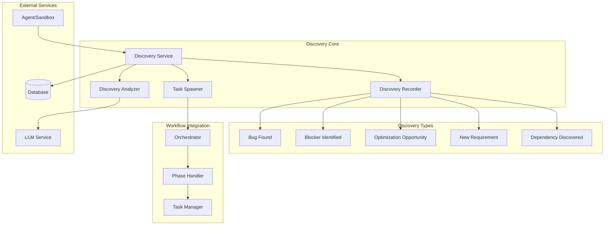
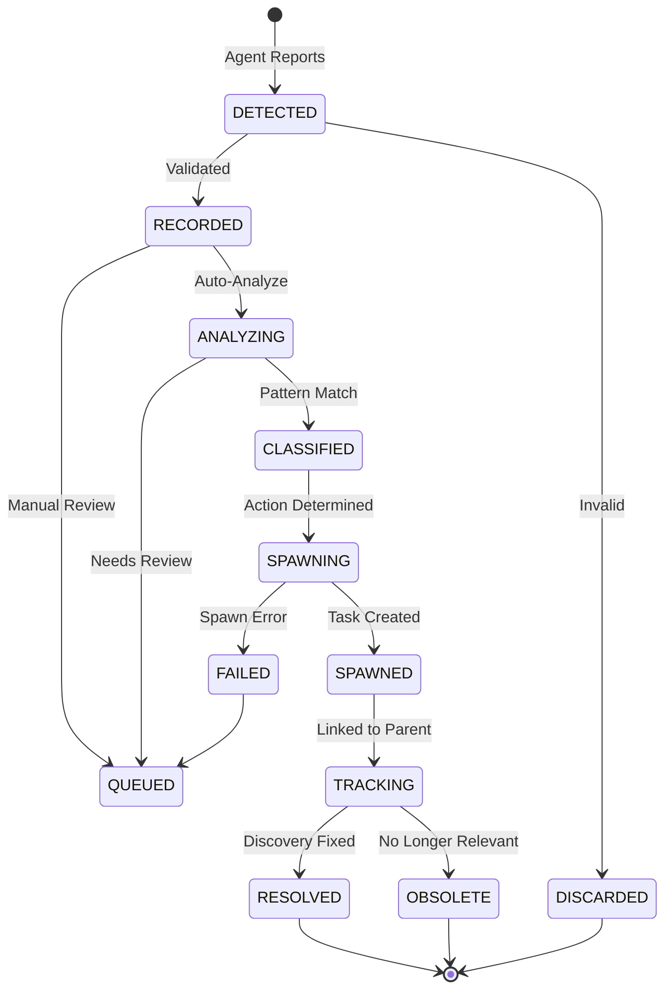
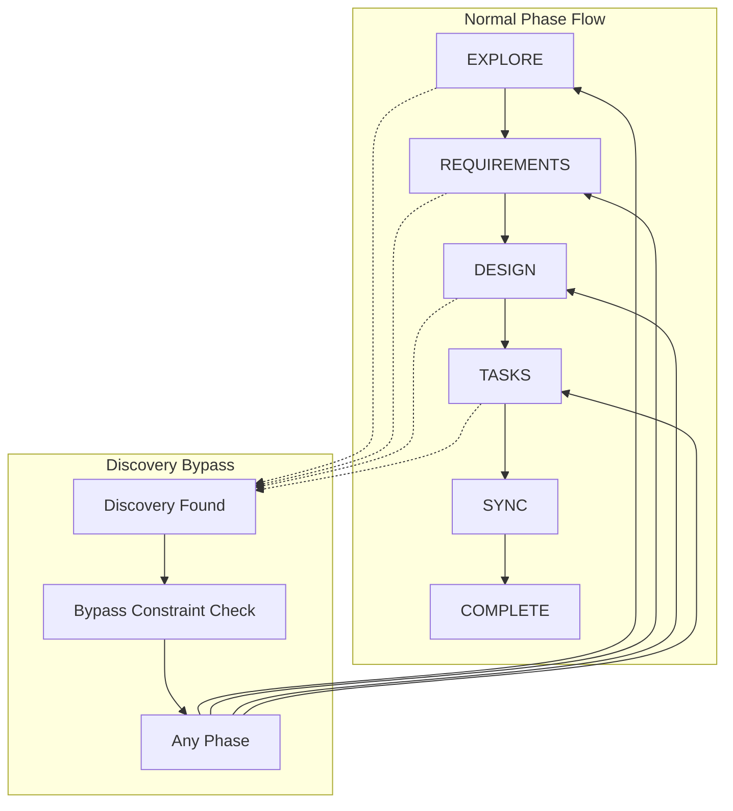
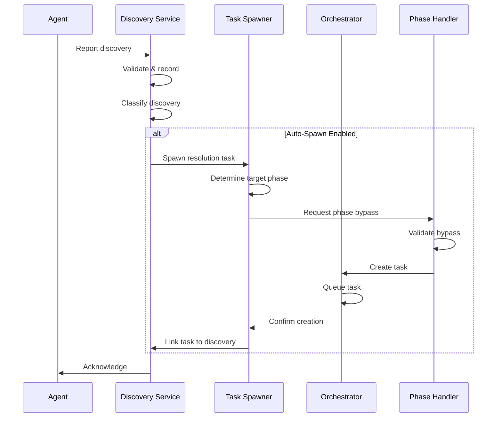

# Discovery Service Design Document

**Created:** 2026-04-22  
**Status:** Active  
**Purpose:** Adaptive workflow branching system for handling discoveries during agent execution  
**Related Docs:** [Orchestrator Service](./orchestrator_service.md), [Guardian Monitoring](./guardian_monitoring.md), **Discovery Analyzer**

---

## 1. Architecture Overview

The Discovery Service enables OmoiOS to handle unexpected findings during agent execution through adaptive workflow branching. When agents discover bugs, blockers, or optimization opportunities, the Discovery Service records these findings and spawns appropriate follow-up tasks—even allowing transitions that bypass normal phase constraints.

### 1.1 High-Level Architecture



### 1.2 Discovery Lifecycle



---

## 2. Component Responsibilities

| Component | Responsibility | Key Operations |
|-----------|---------------|----------------|
| **Discovery Service** | Main coordination, discovery lifecycle | `record_discovery()`, `classify_discovery()`, `spawn_resolution_task()` |
| **Discovery Recorder** | Persist discovery records | `validate()`, `record()`, `update_status()` |
| **Task Spawner** | Create resolution tasks | `spawn_task()`, `link_parent()`, `bypass_phase_constraints()` |
| **Discovery Analyzer** | LLM-powered pattern analysis | `analyze()`, `predict_blockers()`, `recommend_agents()` |
| **Phase Handler** | Manage phase transitions | `check_constraints()`, `allow_bypass()`, `track_transition()` |
| **Discovery Tracker** | Track discovery resolution | `track_progress()`, `mark_resolved()`, `notify_parent()` |

---

## 3. System Boundaries

### 3.1 Inside System Boundaries

- Discovery validation and recording
- Discovery classification (bug, blocker, optimization, requirement, dependency)
- Automatic task spawning for resolution
- Phase constraint bypass for discovery tasks
- Parent-child task linking
- Discovery pattern analysis via LLM
- Blocker prediction
- Agent recommendation for resolution
- Discovery status tracking
- Resolution verification
- Hephaestus pattern implementation
- Diagnostic recovery workflows

### 3.2 Outside System Boundaries

- Actual task execution (handled by Orchestrator)
- Agent code execution (handled by Sandbox/Agent)
- LLM API calls (delegated to LLM Service)
- Database persistence (handled by models layer)
- WebSocket notifications (handled by WebSocket Hub)
- User interface for discovery review (handled by Frontend)

---

## 4. Component Details

### 4.1 Discovery Service Core

The central coordinator for all discovery-related operations.

**Discovery Types:**

| Type | Description | Auto-Spawn | Priority |
|------|-------------|------------|----------|
| **BUG_FOUND** | Bug discovered during execution | Yes | High |
| **BLOCKER_IDENTIFIED** | Blocking issue preventing progress | Yes | Critical |
| **OPTIMIZATION_OPPORTUNITY** | Potential improvement found | Optional | Low |
| **NEW_REQUIREMENT** | Additional requirement discovered | Yes | Medium |
| **DEPENDENCY_DISCOVERED** | Hidden dependency found | Yes | High |
| **TECHNICAL_DEBT** | Technical debt identified | Optional | Low |
| **SECURITY_ISSUE** | Security vulnerability found | Yes | Critical |
| **PERFORMANCE_ISSUE** | Performance bottleneck found | Yes | Medium |

**Core Methods:**

```python
class DiscoveryService:
    """
    Adaptive workflow branching through discovery handling.
    
    The Discovery Service enables agents to report unexpected findings
    during execution. These discoveries can spawn new tasks that bypass
    normal phase constraints, enabling flexible workflow adaptation.
    """
    
    DISCOVERY_TYPES = [
        "BUG_FOUND",
        "BLOCKER_IDENTIFIED", 
        "OPTIMIZATION_OPPORTUNITY",
        "NEW_REQUIREMENT",
        "DEPENDENCY_DISCOVERED",
        "TECHNICAL_DEBT",
        "SECURITY_ISSUE",
        "PERFORMANCE_ISSUE"
    ]
    
    async def record_discovery(
        self,
        task_id: str,
        discovery_type: str,
        description: str,
        evidence: dict,
        severity: str,
        auto_spawn: bool = True
    ) -> Discovery:
        """
        Record a new discovery from agent execution.
        
        Args:
            task_id: Task that made the discovery
            discovery_type: Type of discovery (from DISCOVERY_TYPES)
            description: Human-readable description
            evidence: Supporting data (logs, screenshots, code)
            severity: critical, high, medium, low
            auto_spawn: Whether to auto-spawn resolution task
        
        Returns:
            Discovery record with ID and status
        """
        # Validate discovery type
        if discovery_type not in self.DISCOVERY_TYPES:
            raise ValueError(f"Invalid discovery type: {discovery_type}")
        
        # Create discovery record
        discovery = await self.recorder.record(
            task_id=task_id,
            discovery_type=discovery_type,
            description=description,
            evidence=evidence,
            severity=severity,
            status="recorded"
        )
        
        # Auto-analyze if enabled
        if self.config.auto_analyze:
            analysis = await self.analyzer.analyze(discovery)
            discovery = await self.recorder.update_analysis(
                discovery.id, analysis
            )
        
        # Auto-spawn resolution task if appropriate
        if auto_spawn and self._should_auto_spawn(discovery_type, severity):
            resolution_task = await self.spawn_resolution_task(discovery)
            discovery = await self.recorder.link_task(
                discovery.id, resolution_task.id
            )
        
        # Notify parent task
        await self._notify_parent_task(task_id, discovery)
        
        return discovery
    
    async def spawn_resolution_task(
        self,
        discovery: Discovery,
        parent_task_id: Optional[str] = None
    ) -> Task:
        """
        Spawn a task to resolve a discovery.
        
        Key feature: Can spawn tasks in ANY phase, bypassing
        normal allowed_transitions constraints.
        """
        # Determine appropriate phase for resolution
        target_phase = self._determine_resolution_phase(discovery)
        
        # Get parent task for context
        parent = parent_task_id or discovery.task_id
        parent_task = await self._get_parent_task(parent)
        
        # Create resolution task with phase bypass
        resolution_task = await self.task_spawner.spawn(
            spec_id=parent_task.spec_id,
            phase=target_phase,
            priority=self._calculate_priority(discovery),
            parent_task_id=parent,
            discovery_context={
                "discovery_id": discovery.id,
                "discovery_type": discovery.discovery_type,
                "description": discovery.description,
                "evidence": discovery.evidence,
                "severity": discovery.severity
            },
            bypass_phase_constraints=True  # Key feature!
        )
        
        # Link discovery to resolution task
        await self.recorder.link_resolution_task(
            discovery.id, resolution_task.id
        )
        
        # Track the resolution
        await self.tracker.start_tracking(discovery.id, resolution_task.id)
        
        return resolution_task
```

### 4.2 Phase Constraint Bypass

A key feature of the Discovery Service is the ability to spawn tasks that bypass normal phase transition constraints.



**Implementation:**

```python
class PhaseConstraintBypass:
    """
    Allows discovery-spawned tasks to bypass phase constraints.
    
    Normal tasks must follow: EXPLORE → REQUIREMENTS → DESIGN → TASKS → SYNC → COMPLETE
    
    Discovery tasks can start in ANY phase, enabling:
    - Bug fixes during DESIGN phase
    - Additional exploration during TASKS phase
    - Requirement updates during SYNC phase
    """
    
    # Normal phase transitions
    ALLOWED_TRANSITIONS = {
        "EXPLORE": ["REQUIREMENTS"],
        "REQUIREMENTS": ["DESIGN"],
        "DESIGN": ["TASKS"],
        "TASKS": ["SYNC"],
        "SYNC": ["COMPLETE"],
        "COMPLETE": []
    }
    
    async def validate_transition(
        self,
        from_phase: str,
        to_phase: str,
        is_discovery_task: bool = False
    ) -> bool:
        """
        Validate phase transition.
        
        Discovery tasks bypass normal constraints.
        """
        if is_discovery_task:
            # Discovery tasks can go to any phase
            return True
        
        # Normal constraint check
        return to_phase in self.ALLOWED_TRANSITIONS.get(from_phase, [])
    
    async def spawn_with_bypass(
        self,
        spec_id: str,
        target_phase: str,
        discovery_context: dict
    ) -> Task:
        """
        Spawn a task with phase constraint bypass.
        """
        # Mark as discovery task
        task_data = {
            "spec_id": spec_id,
            "phase": target_phase,
            "is_discovery_task": True,
            "discovery_context": discovery_context,
            "bypass_constraints": True
        }
        
        # Create task (bypasses normal validation)
        return await self.task_manager.create_task(
            task_data,
            bypass_validation=True
        )
```

### 4.3 Discovery Analyzer

LLM-powered analysis of discovery patterns and blocker prediction.

```python
class DiscoveryAnalyzer:
    """
    Analyzes discoveries using LLM for pattern detection,
    blocker prediction, and agent recommendations.
    """
    
    async def analyze(self, discovery: Discovery) -> DiscoveryAnalysis:
        """
        Perform comprehensive discovery analysis.
        """
        prompt = f"""
        Analyze the following discovery and provide insights:
        
        Discovery Type: {discovery.discovery_type}
        Description: {discovery.description}
        Evidence: {discovery.evidence}
        Severity: {discovery.severity}
        
        Provide:
        1. Pattern classification (is this a known pattern?)
        2. Root cause analysis
        3. Impact assessment (what else might be affected?)
        4. Blocker prediction (will this block other work?)
        5. Recommended agent type for resolution
        6. Estimated resolution complexity (1-10)
        7. Similar discoveries in history
        """
        
        return await self.llm.structured_output(
            prompt=prompt,
            output_type=DiscoveryAnalysis
        )
    
    async def predict_blockers(
        self,
        spec_id: str,
        current_phase: str
    ) -> list[PredictedBlocker]:
        """
        Predict potential blockers based on spec and phase.
        
        Uses historical discovery patterns to predict issues
        before they occur.
        """
        # Get spec details
        spec = await self._get_spec(spec_id)
        
        # Get historical patterns for similar specs
        patterns = await self._get_historical_patterns(
            spec.type, current_phase
        )
        
        prompt = f"""
        Based on the following specification and historical patterns,
        predict potential blockers that might be encountered:
        
        Specification: {spec}
        Current Phase: {current_phase}
        Historical Patterns: {patterns}
        
        Predict:
        1. Likely blockers (with probability 0-1)
        2. Early warning signs to watch for
        3. Preventive actions that could be taken
        4. Recommended monitoring approach
        """
        
        return await self.llm.structured_output(
            prompt=prompt,
            output_type=list[PredictedBlocker]
        )
```

---

## 5. Data Models

### 5.1 Database Schema

```sql
-- Discovery records
CREATE TABLE discoveries (
    id UUID PRIMARY KEY DEFAULT gen_random_uuid(),
    task_id UUID NOT NULL REFERENCES tasks(id) ON DELETE CASCADE,
    spec_id UUID NOT NULL REFERENCES specs(id) ON DELETE CASCADE,
    
    -- Discovery details
    discovery_type VARCHAR(50) NOT NULL,
    description TEXT NOT NULL,
    evidence JSONB,  -- Logs, screenshots, code snippets
    severity VARCHAR(20) NOT NULL,  -- critical, high, medium, low
    
    -- Status tracking
    status VARCHAR(50) NOT NULL DEFAULT 'recorded',
    -- recorded, analyzing, classified, queued, resolved, obsolete, discarded
    
    -- Analysis results
    pattern_classification VARCHAR(100),
    root_cause TEXT,
    impact_assessment TEXT,
    complexity_score INTEGER,  -- 1-10
    
    -- Resolution tracking
    resolution_task_id UUID REFERENCES tasks(id),
    resolved_at TIMESTAMP WITH TIME ZONE,
    resolution_notes TEXT,
    
    -- Metadata
    auto_spawned BOOLEAN DEFAULT FALSE,
    change_metadata JSONB,
    created_at TIMESTAMP WITH TIME ZONE DEFAULT NOW(),
    updated_at TIMESTAMP WITH TIME ZONE DEFAULT NOW()
);

-- Discovery patterns (for learning)
CREATE TABLE discovery_patterns (
    id UUID PRIMARY KEY DEFAULT gen_random_uuid(),
    pattern_name VARCHAR(255) NOT NULL,
    discovery_type VARCHAR(50) NOT NULL,
    
    -- Pattern matching
    matching_criteria JSONB NOT NULL,  -- Keywords, regex patterns
    severity_trend VARCHAR(20),  -- usually critical, high, etc.
    
    -- Resolution guidance
    recommended_phase VARCHAR(50),
    recommended_agent_type VARCHAR(100),
    estimated_complexity INTEGER,
    common_pitfalls TEXT,
    
    -- Statistics
    occurrence_count INTEGER DEFAULT 1,
    avg_resolution_time_hours DECIMAL(8,2),
    success_rate DECIMAL(3,2),  -- 0.00 to 1.00
    
    created_at TIMESTAMP WITH TIME ZONE DEFAULT NOW(),
    last_seen_at TIMESTAMP WITH TIME ZONE DEFAULT NOW()
);

-- Predicted blockers
CREATE TABLE predicted_blockers (
    id UUID PRIMARY KEY DEFAULT gen_random_uuid(),
    spec_id UUID NOT NULL REFERENCES specs(id) ON DELETE CASCADE,
    
    prediction TEXT NOT NULL,
    probability DECIMAL(3,2) NOT NULL,  -- 0.00 to 1.00
    predicted_phase VARCHAR(50),
    
    early_warning_signs JSONB,
    preventive_actions JSONB,
    
    -- Validation
    actualized BOOLEAN DEFAULT FALSE,
    actualized_at TIMESTAMP WITH TIME ZONE,
    prevention_successful BOOLEAN,
    
    created_at TIMESTAMP WITH TIME ZONE DEFAULT NOW(),
    expires_at TIMESTAMP WITH TIME ZONE  -- Prediction no longer relevant
);

-- Discovery-task links (parent-child relationships)
CREATE TABLE discovery_task_links (
    id UUID PRIMARY KEY DEFAULT gen_random_uuid(),
    discovery_id UUID NOT NULL REFERENCES discoveries(id) ON DELETE CASCADE,
    parent_task_id UUID NOT NULL REFERENCES tasks(id) ON DELETE CASCADE,
    resolution_task_id UUID REFERENCES tasks(id),
    
    link_type VARCHAR(50) NOT NULL,  -- spawned_from, related_to, blocks
    link_strength DECIMAL(2,1),  -- 0.0 to 1.0
    
    created_at TIMESTAMP WITH TIME ZONE DEFAULT NOW()
);

-- Indexes
CREATE INDEX idx_discoveries_task ON discoveries(task_id, created_at DESC);
CREATE INDEX idx_discoveries_spec ON discoveries(spec_id, status);
CREATE INDEX idx_discoveries_type ON discoveries(discovery_type, severity);
CREATE INDEX idx_discoveries_status ON discoveries(status) 
WHERE status IN ('recorded', 'analyzing', 'queued');
CREATE INDEX idx_predicted_blockers_spec ON predicted_blockers(spec_id, probability DESC);
```

### 5.2 Pydantic Models

```python
from pydantic import BaseModel, Field
from datetime import datetime
from typing import Optional, Literal

class DiscoveryType(str):
    BUG_FOUND = "BUG_FOUND"
    BLOCKER_IDENTIFIED = "BLOCKER_IDENTIFIED"
    OPTIMIZATION_OPPORTUNITY = "OPTIMIZATION_OPPORTUNITY"
    NEW_REQUIREMENT = "NEW_REQUIREMENT"
    DEPENDENCY_DISCOVERED = "DEPENDENCY_DISCOVERED"
    TECHNICAL_DEBT = "TECHNICAL_DEBT"
    SECURITY_ISSUE = "SECURITY_ISSUE"
    PERFORMANCE_ISSUE = "PERFORMANCE_ISSUE"

class Discovery(BaseModel):
    """Record of a discovery during agent execution."""
    id: str
    task_id: str
    spec_id: str
    
    discovery_type: str
    description: str
    evidence: Optional[dict] = None
    severity: Literal["critical", "high", "medium", "low"]
    
    status: Literal[
        "recorded", "analyzing", "classified", "queued", 
        "resolved", "obsolete", "discarded"
    ] = "recorded"
    
    pattern_classification: Optional[str] = None
    root_cause: Optional[str] = None
    impact_assessment: Optional[str] = None
    complexity_score: Optional[int] = Field(None, ge=1, le=10)
    
    resolution_task_id: Optional[str] = None
    resolved_at: Optional[datetime] = None
    resolution_notes: Optional[str] = None
    
    auto_spawned: bool = False
    change_metadata: Optional[dict] = None
    
    created_at: datetime = Field(default_factory=utc_now)
    updated_at: datetime = Field(default_factory=utc_now)

class DiscoveryAnalysis(BaseModel):
    """LLM analysis of a discovery."""
    discovery_id: str
    
    pattern_classification: str
    is_known_pattern: bool
    similar_discoveries: list[str]  # IDs of similar discoveries
    
    root_cause: str
    impact_assessment: str
    affected_components: list[str]
    
    blocker_prediction: Optional[dict] = None
    predicted_blockers: list[str]
    early_warning_signs: list[str]
    
    recommended_agent_type: str
    recommended_phase: str
    complexity_score: int = Field(..., ge=1, le=10)
    estimated_resolution_hours: float
    
    preventive_actions: list[str]
    common_pitfalls: list[str]
    
    analyzed_at: datetime = Field(default_factory=utc_now)

class PredictedBlocker(BaseModel):
    """Predicted future blocker."""
    id: str
    spec_id: str
    
    prediction: str
    probability: float = Field(..., ge=0, le=1)
    predicted_phase: str
    predicted_timeframe: str  # e.g., "2-3 days", "next phase"
    
    early_warning_signs: list[str]
    preventive_actions: list[str]
    monitoring_approach: str
    
    actualized: bool = False
    actualized_at: Optional[datetime] = None
    prevention_successful: Optional[bool] = None
    
    created_at: datetime = Field(default_factory=utc_now)
    expires_at: Optional[datetime] = None

class DiscoveryTaskLink(BaseModel):
    """Link between discovery and tasks."""
    id: str
    discovery_id: str
    parent_task_id: str
    resolution_task_id: Optional[str] = None
    
    link_type: Literal["spawned_from", "related_to", "blocks", "depends_on"]
    link_strength: Optional[float] = Field(None, ge=0, le=1)
    
    created_at: datetime = Field(default_factory=utc_now)
```

---

## 6. API Specifications

### 6.1 REST Endpoints

| Endpoint | Method | Description | Request Body | Response |
|----------|--------|-------------|--------------|----------|
| `/api/v1/discoveries` | POST | Record new discovery | `DiscoveryCreateRequest` | `Discovery` |
| `/api/v1/discoveries` | GET | List discoveries | Query params | `DiscoveryListResponse` |
| `/api/v1/discoveries/{id}` | GET | Get discovery details | - | `Discovery` |
| `/api/v1/discoveries/{id}/analyze` | POST | Analyze discovery | - | `DiscoveryAnalysis` |
| `/api/v1/discoveries/{id}/spawn` | POST | Spawn resolution task | `SpawnRequest` | `Task` |
| `/api/v1/discoveries/{id}/resolve` | POST | Mark as resolved | `ResolveRequest` | `Discovery` |
| `/api/v1/discoveries/patterns` | GET | List known patterns | - | `PatternList` |
| `/api/v1/discoveries/predict` | POST | Predict blockers | `PredictionRequest` | `PredictionResponse` |

### 6.2 Request/Response Schemas

```python
class DiscoveryCreateRequest(BaseModel):
    """Request to record a discovery."""
    task_id: str
    discovery_type: str
    description: str
    evidence: Optional[dict] = None
    severity: Literal["critical", "high", "medium", "low"]
    auto_spawn: bool = True

class SpawnRequest(BaseModel):
    """Request to spawn resolution task."""
    target_phase: Optional[str] = None  # Auto-detect if not provided
    priority: Optional[int] = None  # Auto-calculate if not provided
    assignee_agent_type: Optional[str] = None

class ResolveRequest(BaseModel):
    """Request to mark discovery as resolved."""
    resolution_notes: str
    resolution_task_id: Optional[str] = None
    verified: bool = False  # Has the fix been verified?

class PredictionRequest(BaseModel):
    """Request blocker prediction."""
    spec_id: str
    current_phase: str
    look_ahead_phases: int = 2  # How many phases ahead to predict

class PredictionResponse(BaseModel):
    """Blocker prediction results."""
    spec_id: str
    current_phase: str
    predicted_blockers: list[PredictedBlocker]
    overall_risk_score: float = Field(..., ge=0, le=1)
    recommended_preventive_actions: list[str]
```

---

## 7. WebSocket Events

### 7.1 Event Types

| Event | Direction | Payload | Description |
|-------|-----------|---------|-------------|
| `discovery.recorded` | Server → Client | `Discovery` | New discovery recorded |
| `discovery.analyzed` | Server → Client | `DiscoveryAnalysis` | Analysis complete |
| `discovery.spawned` | Server → Client | `DiscoveryTaskLink` | Resolution task spawned |
| `discovery.resolved` | Server → Client | `Discovery` | Discovery marked resolved |
| `discovery.blocker.predicted` | Server → Client | `PredictedBlocker` | Blocker prediction |
| `discovery.blocker.actualized` | Server → Client | `PredictedBlocker` | Predicted blocker occurred |
| `discovery.pattern.matched` | Server → Client | `PatternMatch` | Known pattern detected |

---

## 8. Implementation Details

### 8.1 Hephaestus Pattern

The Hephaestus pattern enables diagnostic recovery through intelligent task spawning:

```python
class HephaestusPattern:
    """
    Hephaestus Pattern: Forge solutions through diagnostic recovery.
    
    When a task fails or discovers a blocker:
    1. Analyze the failure/discovery
    2. Spawn diagnostic tasks to understand root cause
    3. Spawn resolution tasks based on diagnostic findings
    4. Link all tasks for tracking
    5. Resume original task when resolved
    """
    
    async def apply(
        self,
        failed_task: Task,
        discovery: Optional[Discovery] = None
    ) -> list[Task]:
        """
        Apply Hephaestus pattern to recover from failure.
        
        Returns list of spawned tasks (diagnostic + resolution).
        """
        spawned_tasks = []
        
        # Phase 1: Diagnostic tasks
        diagnostics = await self._spawn_diagnostics(failed_task, discovery)
        spawned_tasks.extend(diagnostics)
        
        # Wait for diagnostic completion (async)
        diagnostic_results = await self._await_diagnostics(diagnostics)
        
        # Phase 2: Resolution tasks based on diagnostics
        resolutions = await self._spawn_resolutions(
            failed_task, discovery, diagnostic_results
        )
        spawned_tasks.extend(resolutions)
        
        # Phase 3: Resume original task
        await self._schedule_resume(failed_task, resolutions)
        
        return spawned_tasks
    
    async def _spawn_diagnostics(
        self,
        failed_task: Task,
        discovery: Optional[Discovery]
    ) -> list[Task]:
        """Spawn diagnostic tasks to understand the issue."""
        diagnostics = []
        
        # Diagnostic 1: Log analysis
        log_analysis = await self.discovery_service.spawn_resolution_task(
            discovery=Discovery(
                task_id=failed_task.id,
                discovery_type="TECHNICAL_DEBT",
                description=f"Analyze logs for task {failed_task.id} failure",
                severity="high"
            ),
            target_phase="EXPLORE"
        )
        diagnostics.append(log_analysis)
        
        # Diagnostic 2: Environment check
        env_check = await self.discovery_service.spawn_resolution_task(
            discovery=Discovery(
                task_id=failed_task.id,
                discovery_type="DEPENDENCY_DISCOVERED",
                description=f"Check environment for task {failed_task.id}",
                severity="medium"
            ),
            target_phase="EXPLORE"
        )
        diagnostics.append(env_check)
        
        return diagnostics
```

### 8.2 Auto-Spawn Decision Logic

```python
def should_auto_spawn(discovery_type: str, severity: str) -> bool:
    """
    Determine if a discovery should auto-spawn a resolution task.
    
    Rules:
    - Critical severity: Always spawn
    - High severity: Usually spawn (except optimizations)
    - Medium severity: Spawn for bugs, blockers, security
    - Low severity: Never auto-spawn
    """
    AUTO_SPAWN_RULES = {
        "critical": True,  # Always
        "high": lambda t: t != "OPTIMIZATION_OPPORTUNITY",
        "medium": lambda t: t in [
            "BUG_FOUND", "BLOCKER_IDENTIFIED", 
            "SECURITY_ISSUE", "DEPENDENCY_DISCOVERED"
        ],
        "low": False  # Never
    }
    
    rule = AUTO_SPAWN_RULES.get(severity)
    
    if callable(rule):
        return rule(discovery_type)
    return bool(rule)
```

---

## 9. Integration Points

### 9.1 Orchestrator Integration



---

## 10. Configuration Parameters

```yaml
# config/base.yaml
discovery:
  # Auto-handling settings
  auto_analyze: true
  auto_spawn:
    critical: true
    high: true
    medium: true
    low: false
  
  # Analysis settings
  analysis:
    llm_model: "claude-sonnet-4-20250514"
    pattern_matching: true
    blocker_prediction: true
    
  # Phase bypass settings
  phase_bypass:
    enabled: true
    allowed_phases:
      - EXPLORE
      - REQUIREMENTS
      - DESIGN
      - TASKS
      - SYNC
    require_approval_above: 5  # Priority level
    
  # Hephaestus pattern
  hephaestus:
    enabled: true
    max_diagnostic_tasks: 3
    max_resolution_tasks: 5
    await_diagnostics_timeout_seconds: 300
```

---

## 11. Performance Characteristics

| Metric | Target | Notes |
|--------|--------|-------|
| Discovery recording latency | < 100ms | From report to persistence |
| Analysis latency | < 5s | LLM-based analysis |
| Task spawn latency | < 200ms | From decision to queued |
| Pattern matching accuracy | > 85% | Correct classification |
| Blocker prediction accuracy | > 70% | True positive rate |
| False positive rate | < 10% | Unnecessary spawns |

---

*Document Version: 1.0*  
*Last Updated: 2026-04-22*  
*Maintainer: OmoiOS Core Team*
