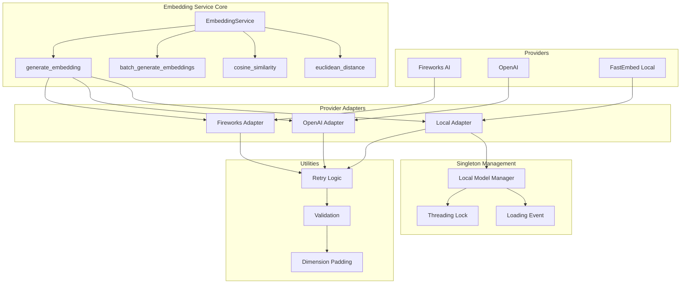
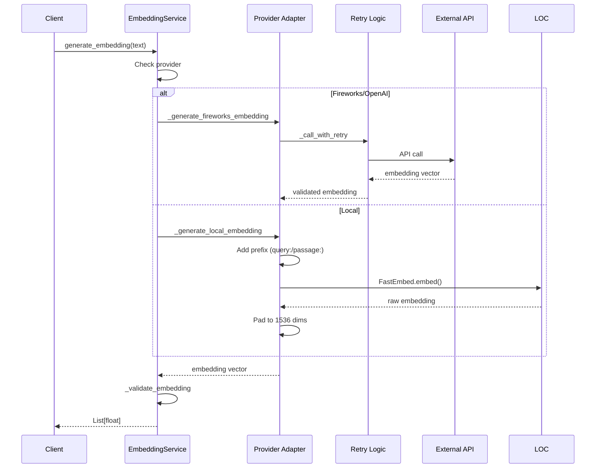
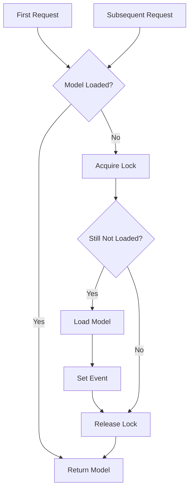
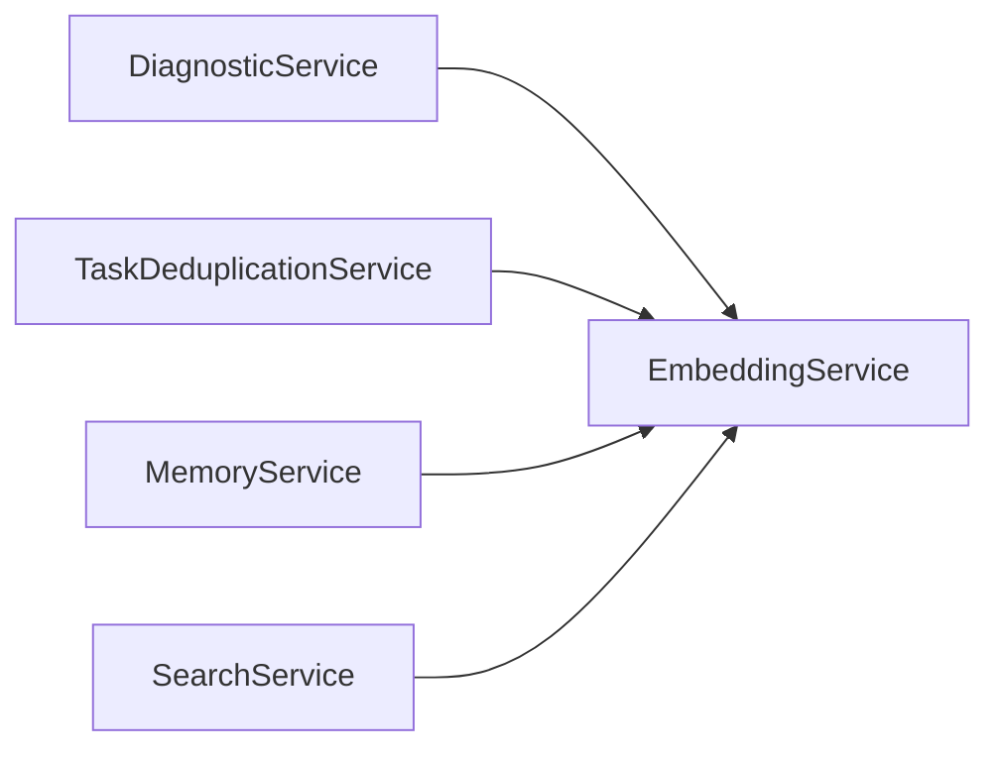

# Embedding Service Design Document

**Created:** 2026-04-22  
**Status:** Active  
**Purpose:** Generate text embeddings using Fireworks AI, OpenAI, or local FastEmbed models with pgvector integration  
**Related Docs:** [Diagnostic Service](./diagnostic_service.md), [Monitor Service](./monitor_service.md)

---

## 1. Architecture Overview

The EmbeddingService provides a unified interface for generating text embeddings across multiple providers (Fireworks AI, OpenAI, local FastEmbed). It handles provider-specific quirks, dimension normalization, and retry logic.

### 1.1 High-Level Architecture



### 1.2 Embedding Generation Flow



### 1.3 Local Model Singleton Pattern



---

## 2. Component Responsibilities

| Component | Responsibility | Key Operations |
|-----------|---------------|----------------|
| **EmbeddingService** | Main service interface | `generate_embedding()`, `batch_generate_embeddings()` |
| **Provider Adapters** | Provider-specific generation | `_generate_fireworks_embedding()`, `_generate_openai_embedding()`, `_generate_local_embedding()` |
| **Retry Logic** | Exponential backoff for API calls | `_call_with_retry()` |
| **Validation** | Dimension validation and adjustment | `_validate_embedding()` |
| **Local Model Manager** | Singleton FastEmbed instance | `_get_local_model()`, `preload_embedding_model()` |
| **Similarity Functions** | Vector comparison utilities | `cosine_similarity()`, `euclidean_distance()` |

---

## 3. System Boundaries

### 3.1 Inside System Boundaries

- Multi-provider embedding generation (Fireworks, OpenAI, Local)
- Lazy client initialization for API providers
- Singleton pattern for local FastEmbed model
- Thread-safe model loading with locks and events
- Automatic dimension padding for local embeddings (to 1536)
- Exponential backoff retry with jitter
- Batch embedding generation
- Cosine similarity and Euclidean distance calculations

### 3.2 Outside System Boundaries

- Vector storage (handled by database layer with pgvector)
- Similarity search queries (handled by SQLAlchemy/pgvector)
- Model training/fine-tuning (not supported)
- Custom embedding models (limited to supported providers)
- Embedding caching (not implemented)

---

## 4. Data Models

### 4.1 Pydantic Models

```python
from pydantic import BaseModel, Field
from typing import List, Optional
from enum import Enum

class EmbeddingProvider(str, Enum):
    """Embedding provider options."""
    FIREWORKS = "fireworks"
    OPENAI = "openai"
    LOCAL = "local"

class EmbeddingConfig(BaseModel):
    """Configuration for embedding generation."""
    provider: EmbeddingProvider = Field(default=EmbeddingProvider.FIREWORKS)
    model_name: Optional[str] = None
    dimensions: int = Field(default=1536)
    api_key: Optional[str] = None
    cache_dir: Optional[str] = None
    lazy_load: bool = Field(default=True)
    preload_in_background: bool = Field(default=False)
```

### 4.2 Constants

```python
# Default embedding dimensions - must match pgvector column definitions
# pgvector supports up to 16,000 dimensions for storage, but standard indexing
# (HNSW/IVFFlat) is limited to 2,000 dimensions. Using 1536 for compatibility.
DEFAULT_EMBEDDING_DIMENSIONS = 1536

# Retry configuration
MAX_RETRIES = 3
RETRY_BASE_DELAY = 1.0  # seconds
RETRY_MAX_DELAY = 10.0  # seconds

# Provider-specific defaults
FIREWORKS_DEFAULT_MODEL = "fireworks/qwen3-embedding-8b"
OPENAI_DEFAULT_MODEL = "text-embedding-3-small"
LOCAL_DEFAULT_MODEL = "intfloat/multilingual-e5-large"

# Fireworks AI API base URL (OpenAI-compatible)
FIREWORKS_BASE_URL = "https://api.fireworks.ai/inference/v1"
```

### 4.3 Database Schema (pgvector)

```sql
-- Enable pgvector extension
CREATE EXTENSION IF NOT EXISTS vector;

-- Example table with vector column
CREATE TABLE task_embeddings (
    id UUID PRIMARY KEY DEFAULT gen_random_uuid(),
    task_id UUID NOT NULL REFERENCES tasks(id) ON DELETE CASCADE,
    content_type VARCHAR(50) NOT NULL,  -- 'description', 'result', 'error'
    content_hash VARCHAR(64) NOT NULL,  -- SHA-256 for deduplication
    embedding vector(1536) NOT NULL,  -- pgvector type
    model_name VARCHAR(100) NOT NULL,
    created_at TIMESTAMP WITH TIME ZONE DEFAULT NOW()
);

-- HNSW index for fast similarity search
CREATE INDEX idx_task_embeddings_hnsw 
ON task_embeddings 
USING hnsw (embedding vector_cosine_ops)
WITH (m = 16, ef_construction = 64);

-- Query for similar tasks
SELECT task_id, 1 - (embedding <=> query_embedding) AS similarity
FROM task_embeddings
WHERE 1 - (embedding <=> query_embedding) > 0.90
ORDER BY embedding <=> query_embedding
LIMIT 10;
```

---

## 5. API Surface

### 5.1 Service Methods

| Method | Signature | Description |
|--------|-----------|-------------|
| `generate_embedding` | `(text: str, is_query: bool = False) -> List[float]` | Generate single embedding |
| `batch_generate_embeddings` | `(texts: List[str], is_query: bool = False) -> List[List[float]]` | Batch generation |
| `cosine_similarity` | `(vec1: List[float], vec2: List[float]) -> float` | Calculate cosine similarity |
| `euclidean_distance` | `(vec1: List[float], vec2: List[float]) -> float` | Calculate Euclidean distance |

### 5.2 Constructor

```python
def __init__(
    self,
    provider: Optional[EmbeddingProvider] = None,
    fireworks_api_key: Optional[str] = None,
    openai_api_key: Optional[str] = None,
    model_name: Optional[str] = None,
):
    """
    Initialize embedding service.
    
    Args:
        provider: Embedding provider (fireworks, openai, or local)
        fireworks_api_key: Fireworks AI API key
        openai_api_key: OpenAI API key
        model_name: Model name override
    """
```

### 5.3 Utility Functions

| Function | Signature | Description |
|----------|-----------|-------------|
| `preload_embedding_model` | `() -> None` | Preload local model in background thread |
| `wait_for_model_ready` | `(timeout: Optional[float] = None) -> bool` | Wait for model loading |
| `is_model_loaded` | `() -> bool` | Check if model is loaded |
| `get_local_model_instance` | `() -> Optional[TextEmbedding]` | Get local model instance |

### 5.4 FastAPI Routes

```python
# Routes typically found in api/routes/embeddings.py
@router.post("/embeddings")
async def create_embedding(
    text: str,
    is_query: bool = False,
    embedding_service: EmbeddingService = Depends(get_embedding_service)
):
    """Generate embedding for text."""
    embedding = embedding_service.generate_embedding(text, is_query)
    return {"embedding": embedding, "dimensions": len(embedding)}

@router.post("/embeddings/batch")
async def create_embeddings_batch(
    texts: List[str],
    is_query: bool = False,
    embedding_service: EmbeddingService = Depends(get_embedding_service)
):
    """Generate embeddings for multiple texts."""
    embeddings = embedding_service.batch_generate_embeddings(texts, is_query)
    return {"embeddings": embeddings, "count": len(embeddings)}

@router.post("/embeddings/similarity")
async def calculate_similarity(
    vec1: List[float],
    vec2: List[float],
    embedding_service: EmbeddingService = Depends(get_embedding_service)
):
    """Calculate cosine similarity between two vectors."""
    similarity = embedding_service.cosine_similarity(vec1, vec2)
    return {"similarity": similarity}
```

---

## 6. Integration Points

### 6.1 Services That Use EmbeddingService



| Service | Purpose |
|---------|---------|
| **DiagnosticService** | Vector-based task deduplication for diagnostic recovery |
| **TaskDeduplicationService** | Semantic similarity detection for duplicate tasks |
| **MemoryService** | Embedding memories for semantic search |
| **SearchService** | Code/content similarity search |

### 6.2 External APIs

| Provider | API | Authentication |
|----------|-----|----------------|
| **Fireworks AI** | OpenAI-compatible embeddings API | API key in header |
| **OpenAI** | text-embedding-3-small API | API key in header |
| **Local** | FastEmbed (no API) | None |

### 6.3 Provider-Specific Details

**Fireworks AI:**
- OpenAI-compatible API
- Default model: `fireworks/qwen3-embedding-8b`
- Variable dimensions supported via API parameter
- Base URL: `https://api.fireworks.ai/inference/v1`

**OpenAI:**
- Standard OpenAI SDK
- Default model: `text-embedding-3-small`
- Fixed 1536 dimensions

**Local (FastEmbed):**
- Default model: `intfloat/multilingual-e5-large`
- Requires prefixes for optimal performance:
  - Queries: `"query: "` prefix
  - Passages: `"passage: "` prefix
- Padded to 1536 dimensions for consistency
- Cached in `~/.cache/fastembed` by default

---

## 7. Configuration Parameters

### 7.1 YAML Configuration

```yaml
# config/base.yaml
embedding:
  # Provider selection
  provider: "fireworks"  # fireworks, openai, or local
  
  # Model configuration
  model_name: null  # Use provider default if null
  dimensions: 1536  # Must match pgvector column
  
  # API keys (can also use env vars)
  fireworks_api_key: null  # From EMBEDDING_FIREWORKS_API_KEY
  openai_api_key: null  # From EMBEDDING_OPENAI_API_KEY
  
  # Local model settings
  cache_dir: "~/.cache/fastembed"
  lazy_load: true  # Defer initialization until first use
  preload_in_background: false  # Preload at startup
```

### 7.2 Environment Variables

| Variable | Default | Description |
|----------|---------|-------------|
| `EMBEDDING_PROVIDER` | fireworks | Provider selection |
| `EMBEDDING_FIREWORKS_API_KEY` | null | Fireworks AI API key |
| `EMBEDDING_OPENAI_API_KEY` | null | OpenAI API key |
| `EMBEDDING_MODEL_NAME` | null | Override model name |
| `EMBEDDING_DIMENSIONS` | 1536 | Output dimensions |
| `EMBEDDING_CACHE_DIR` | ~/.cache/fastembed | Local model cache |

### 7.3 Code-Level Configuration

```python
# Retry configuration
MAX_RETRIES = 3
RETRY_BASE_DELAY = 1.0
RETRY_MAX_DELAY = 10.0

# Dimension configuration
DEFAULT_EMBEDDING_DIMENSIONS = 1536  # For pgvector compatibility

# Provider defaults
FIREWORKS_DEFAULT_MODEL = "fireworks/qwen3-embedding-8b"
OPENAI_DEFAULT_MODEL = "text-embedding-3-small"
LOCAL_DEFAULT_MODEL = "intfloat/multilingual-e5-large"
```

---

## 8. Error Handling

### 8.1 Error Categories

| Category | Examples | Handling Strategy |
|----------|----------|-------------------|
| **API** | Rate limit, timeout, 5xx errors | Exponential backoff retry |
| **Authentication** | Invalid API key | Raise ValueError immediately |
| **Validation** | Empty text, dimension mismatch | Raise ValueError |
| **Local Model** | Import error, download failure | Raise ImportError with instructions |
| **Network** | Connection error | Retry with backoff |

### 8.2 Retry Logic

```python
def _call_with_retry(self, func, operation_name: str):
    """Call function with exponential backoff retry."""
    last_exception = None
    
    for attempt in range(MAX_RETRIES):
        try:
            return func()
        except Exception as e:
            last_exception = e
            
            # Check if error is retryable
            retryable = any(
                indicator in str(e).lower()
                for indicator in [
                    "rate limit", "timeout", "503", "502", "429",
                    "connection", "temporarily"
                ]
            )
            
            if not retryable or attempt == MAX_RETRIES - 1:
                logger.error(f"{operation_name} failed: {e}")
                raise
            
            # Exponential backoff with jitter
            delay = min(
                RETRY_BASE_DELAY * (2 ** attempt) + random.uniform(0, 1),
                RETRY_MAX_DELAY
            )
            logger.warning(f"Retrying in {delay:.1f}s (attempt {attempt + 1})")
            time.sleep(delay)
```

### 8.3 Validation

```python
def _validate_embedding(self, embedding: List[float]) -> List[float]:
    """Validate and adjust embedding dimensions."""
    expected_dims = self.dimensions
    actual_dims = len(embedding)
    
    if actual_dims != expected_dims:
        logger.warning(
            f"Dimension mismatch: got {actual_dims}, expected {expected_dims}"
        )
        
        # Truncate or pad to match
        if actual_dims > expected_dims:
            return embedding[:expected_dims]
        else:
            return embedding + [0.0] * (expected_dims - actual_dims)
    
    return embedding
```

---

## 9. Performance Characteristics

| Metric | Target | Notes |
|--------|--------|-------|
| Single embedding (API) | < 500ms | Network latency dominates |
| Single embedding (Local) | < 100ms | First call includes model load |
| Batch embedding (API) | < 1s | 100 texts |
| Batch embedding (Local) | < 500ms | 100 texts |
| Model load time | < 30s | One-time on first use |
| Memory usage (Local) | ~500MB | Model size |
| Similarity calculation | < 1ms | NumPy vectorized |

---

## 10. Future Enhancements

1. **Embedding Cache** - LRU cache for frequently accessed embeddings
2. **Quantization** - Support for int8 embeddings to reduce storage
3. **Multi-Modal** - Image embedding support
4. **Custom Models** - Support for fine-tuned embedding models
5. **Streaming** - Stream embeddings for large batches
6. **Metrics** - Embedding generation latency and success rate metrics

---

*Document Version: 1.0*  
*Last Updated: 2026-04-22*  
*Maintainer: OmoiOS Core Team*
