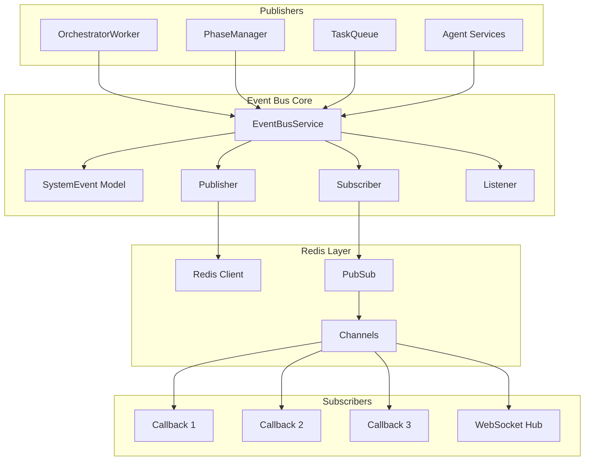
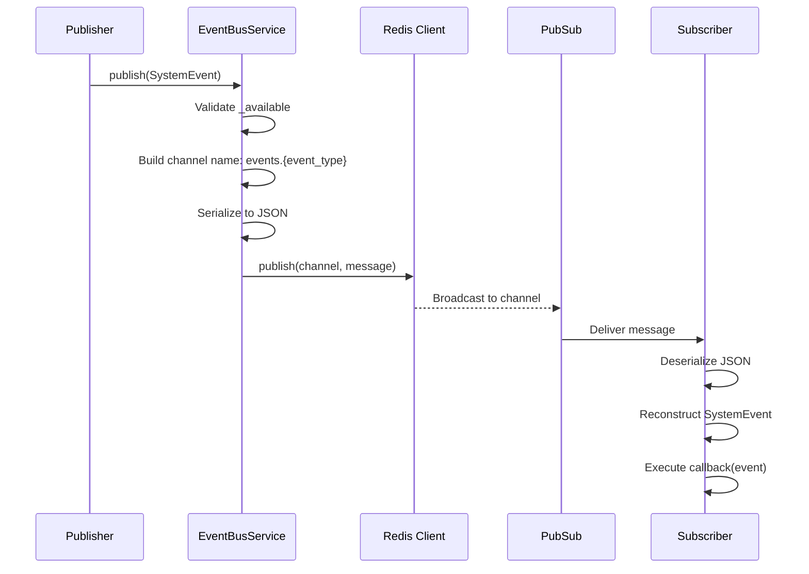
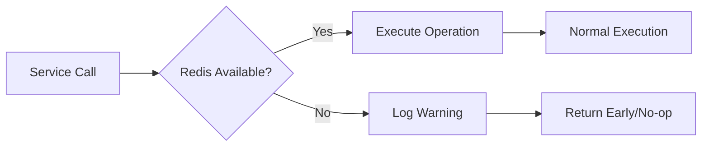
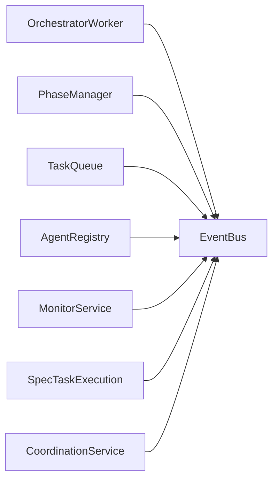

# Event Bus Service Design Document

**Created:** 2026-04-22  
**Status:** Active  
**Purpose:** System-wide event publishing and subscription via Redis Pub/Sub with graceful degradation  
**Related Docs:** [Orchestrator Service](./orchestrator_service.md), [Monitor Service](./monitor_service.md), [Phase Manager](./phase_manager.md)

---

## 1. Architecture Overview

The EventBusService provides a lightweight, Redis-backed event system for cross-component communication. It implements graceful degradation - if Redis is unavailable, operations become no-ops rather than failing.

### 1.1 High-Level Architecture



### 1.2 Event Flow



### 1.3 Graceful Degradation Flow



---

## 2. Component Responsibilities

| Component | Responsibility | Key Operations |
|-----------|---------------|----------------|
| **EventBusService** | Main service managing Redis connection | `__init__()`, `publish()`, `subscribe()`, `listen()`, `close()` |
| **SystemEvent** | Pydantic model for event structure | Validation, serialization |
| **Publisher** | Publishes events to Redis channels | Channel naming, JSON serialization |
| **Subscriber** | Manages callback registration | Channel subscription, message routing |
| **Listener** | Blocking message consumer | `listen()` loop |
| **Graceful Degradation** | Handles Redis unavailability | `_available` flag checks |

---

## 3. System Boundaries

### 3.1 Inside System Boundaries

- Redis connection management with timeout handling
- Event publishing with automatic JSON serialization
- Event subscription with callback registration
- Channel naming convention: `events.{event_type}`
- Graceful degradation when Redis unavailable
- Connection testing via `ping()`

### 3.2 Outside System Boundaries

- WebSocket forwarding (handled by separate WebSocket Hub)
- Event persistence (Redis Pub/Sub is fire-and-forget)
- Event replay/history (not implemented)
- Guaranteed delivery (Pub/Sub provides at-most-once)
- Message ordering across different channels

---

## 4. Data Models

### 4.1 Pydantic Models

```python
from pydantic import BaseModel, Field
from typing import Dict, Any

class SystemEvent(BaseModel):
    """System-wide orchestration event (not OpenHands conversation events)."""
    
    event_type: str = Field(
        ..., 
        description="Event type: TASK_ASSIGNED, TASK_COMPLETED, etc."
    )
    entity_type: str = Field(
        ..., 
        description="Entity type: ticket, task, agent"
    )
    entity_id: str = Field(
        ..., 
        description="ID of the entity"
    )
    payload: Dict[str, Any] = Field(
        default_factory=dict, 
        description="Event payload data"
    )
    
    # Pydantic v2 method for JSON serialization
    def model_dump_json(self, **kwargs) -> str:
        """Serialize to JSON string."""
        return super().model_dump_json(**kwargs)
```

### 4.2 Event Type Catalog

| Event Type | Entity Type | Description | Payload Fields |
|------------|-------------|-------------|----------------|
| `TASK_ASSIGNED` | task | Task assigned to agent | `task_id`, `agent_id`, `ticket_id` |
| `TASK_COMPLETED` | task | Task finished successfully | `task_id`, `result`, `agent_id` |
| `TASK_FAILED` | task | Task failed | `task_id`, `error`, `agent_id` |
| `TASK_CREATED` | task | New task created | `task_id`, `ticket_id`, `spec_id` |
| `AGENT_REGISTERED` | agent | New agent registered | `agent_id`, `agent_type`, `capabilities` |
| `AGENT_STATUS_CHANGED` | agent | Agent status updated | `agent_id`, `old_status`, `new_status` |
| `ticket.phase_transitioned` | ticket | Phase changed | `from_phase`, `to_phase`, `reason` |
| `TICKET_STATUS_CHANGED` | ticket | Status changed | `from_status`, `to_status`, `phase_id` |
| `ticket.blocked` | ticket | Ticket blocked | `blocker_type`, `suggested_remediation` |
| `ticket.unblocked` | ticket | Ticket unblocked | `previous_blocker` |
| `monitor.anomaly.detected` | anomaly | Anomaly detected | `metric_name`, `severity`, `deviation` |
| `monitor.agent.anomaly` | agent | Agent anomaly | `anomaly_score`, `consecutive_readings` |
| `SPEC_EXECUTION_STARTED` | spec | Spec execution began | `spec_id`, `ticket_id`, `tasks_created` |
| `diagnostic.triggered` | diagnostic_run | Diagnostic spawned | `workflow_id`, `tasks_created` |
| `coordination.sync.created` | sync_point | Sync point created | `sync_id`, `waiting_task_ids` |
| `coordination.sync.ready` | sync_point | Sync point ready | `completed_count`, `required_count` |
| `coordination.split.created` | split | Task split created | `split_id`, `target_task_ids` |
| `coordination.join.created` | join | Join registered | `join_id`, `source_task_ids` |
| `coordination.merge.completed` | merge | Merge completed | `merge_id`, `result_keys` |

---

## 5. API Surface

### 5.1 Service Methods

| Method | Signature | Description |
|--------|-----------|-------------|
| `publish` | `(event: SystemEvent) -> None` | Publish event to system bus |
| `subscribe` | `(event_type: str, callback: Callable[[SystemEvent], None]) -> None` | Subscribe to event type |
| `listen` | `() -> None` | Start listening for events (blocking) |
| `close` | `() -> None` | Close Redis connections |

### 5.2 Constructor

```python
def __init__(self, redis_url: str | None = None):
    """
    Initialize event bus service.
    
    Args:
        redis_url: Redis connection URL. If None, tries to get from settings.
    
    If Redis is unavailable, operations are no-ops (graceful degradation).
    """
```

### 5.3 Callback Signature

```python
from typing import Callable

# Callback function signature
def callback(event: SystemEvent) -> None:
    """Handle received event."""
    pass

# Registration
EventBusService.subscribe("TASK_COMPLETED", callback)
```

### 5.4 FastAPI Routes

```python
# Event bus is typically used internally, not exposed directly via API
# But monitoring endpoints may use it:

@router.get("/events/health")
async def event_bus_health(
    event_bus: EventBusService = Depends(get_event_bus)
):
    """Check event bus health."""
    return {
        "available": event_bus._available,
        "redis_connected": event_bus.redis_client is not None
    }
```

---

## 6. Integration Points

### 6.1 Services That Publish Events



| Service | Events Published |
|---------|-----------------|
| **OrchestratorWorker** | `TASK_ASSIGNED`, `TASK_COMPLETED`, `TASK_FAILED` |
| **PhaseManager** | `ticket.phase_transitioned`, `TICKET_STATUS_CHANGED` |
| **TaskQueue** | `TASK_CREATED`, task lifecycle events |
| **AgentRegistry** | `AGENT_REGISTERED`, `agent.capability.updated` |
| **MonitorService** | `monitor.anomaly.detected`, `monitor.agent.anomaly` |
| **SpecTaskExecution** | `SPEC_EXECUTION_STARTED`, `TASK_CREATED` |
| **CoordinationService** | `coordination.*` events |
| **DiagnosticService** | `diagnostic.triggered`, `diagnostic.completed` |

### 6.2 Services That Subscribe to Events

| Service | Events Subscribed | Purpose |
|---------|-------------------|---------|
| **SpecTaskExecution** | `TASK_COMPLETED`, `TASK_FAILED` | Update SpecTask status |
| **PhaseManager** | `TASK_STARTED`, `TASK_COMPLETED` | Auto-advance phases |
| **WebSocket Hub** | All events | Forward to UI clients |
| **SynthesisService** | `coordination.join.created` | Merge parallel task results |
| **Monitoring Loop** | Various | Track system state |

### 6.3 Redis Integration

```python
# Connection with timeouts
self.redis_client = redis.from_url(
    redis_url,
    decode_responses=True,
    socket_timeout=5.0,
    socket_connect_timeout=5.0,
)

# Test connection
self.redis_client.ping()

# Pub/Sub setup
self.pubsub = self.redis_client.pubsub()
```

---

## 7. Configuration Parameters

### 7.1 YAML Configuration

```yaml
# config/base.yaml
event_bus:
  # Redis connection
  redis_url: "redis://localhost:6379/0"
  
  # Timeouts (seconds)
  socket_timeout: 5.0
  socket_connect_timeout: 5.0
  
  # Graceful degradation
  fail_silently: true  # If true, operations no-op when Redis unavailable
```

### 7.2 Environment Variables

| Variable | Default | Description |
|----------|---------|-------------|
| `REDIS_URL` | redis://localhost:6379/0 | Redis connection URL |
| `EVENT_BUS_SOCKET_TIMEOUT` | 5.0 | Socket timeout in seconds |
| `EVENT_BUS_CONNECT_TIMEOUT` | 5.0 | Connection timeout in seconds |

### 7.3 Code-Level Configuration

```python
# Channel naming convention
CHANNEL_PREFIX = "events"
CHANNEL_FORMAT = f"{CHANNEL_PREFIX}.{{event_type}}"

# Example: events.TASK_COMPLETED
```

---

## 8. Error Handling

### 8.1 Error Categories

| Category | Examples | Handling Strategy |
|----------|----------|-------------------|
| **Connection** | Redis unreachable, timeout | Log warning, set `_available=False` |
| **Publish** | Connection lost during publish | Log warning, continue |
| **Subscribe** | Invalid callback | Raise TypeError |
| **Listen** | Connection dropped | Exit listen loop gracefully |
| **Serialization** | Non-serializable payload | Pydantic handles automatically |

### 8.2 Graceful Degradation Pattern

```python
def publish(self, event: SystemEvent) -> None:
    """Publish event to system bus."""
    # Check availability - no-op if Redis unavailable
    if not self._available or not self.redis_client:
        return  # Graceful no-op when Redis unavailable
    
    channel = f"events.{event.event_type}"
    message = event.model_dump_json()
    
    try:
        self.redis_client.publish(channel, message)
    except redis.exceptions.ConnectionError:
        logger.warning("Redis connection lost during publish")
        # Don't raise - continue operation

def subscribe(self, event_type: str, callback: Callable) -> None:
    """Subscribe to event type."""
    # Check availability - no-op if Redis unavailable
    if not self._available or not self.pubsub:
        return  # Graceful no-op when Redis unavailable
    
    channel = f"events.{event_type}"
    
    def message_handler(message: dict) -> None:
        if message["type"] == "message":
            data = json.loads(message["data"])
            event = SystemEvent(**data)
            callback(event)
    
    self.pubsub.subscribe(**{channel: message_handler})
```

### 8.3 Connection Error Handling

```python
try:
    self.redis_client = redis.from_url(
        redis_url,
        decode_responses=True,
        socket_timeout=5.0,
        socket_connect_timeout=5.0,
    )
    self.redis_client.ping()
    self.pubsub = self.redis_client.pubsub()
    self._available = True
    logger.info("EventBus connected to Redis")
    
except redis.exceptions.ConnectionError as e:
    logger.warning(f"Redis connection failed, EventBus disabled: {e}")
    # _available remains False
    
except redis.exceptions.TimeoutError as e:
    logger.warning(f"Redis connection timed out, EventBus disabled: {e}")
    # _available remains False
    
except Exception as e:
    logger.warning(f"Redis initialization failed, EventBus disabled: {e}")
    # _available remains False
```

---

## 9. Performance Characteristics

| Metric | Target | Notes |
|--------|--------|-------|
| Publish latency | < 1ms | Local Redis, async network |
| Subscribe latency | < 5ms | Includes deserialization |
| Throughput | > 10,000 events/sec | Per Redis instance |
| Connection recovery | Manual | Requires service restart |
| Memory usage | Minimal | Fire-and-forget, no persistence |

---

## 10. Future Enhancements

1. **Event Persistence** - Optional Redis Streams for event history
2. **Guaranteed Delivery** - Acknowledgment-based delivery for critical events
3. **Event Replay** - Replay events from history for new subscribers
4. **Multi-Region** - Cross-region event replication
5. **Metrics** - Event throughput and latency metrics
6. **Schema Registry** - Versioned event schemas

---

*Document Version: 1.0*  
*Last Updated: 2026-04-22*  
*Maintainer: OmoiOS Core Team*
