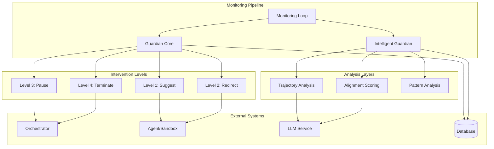
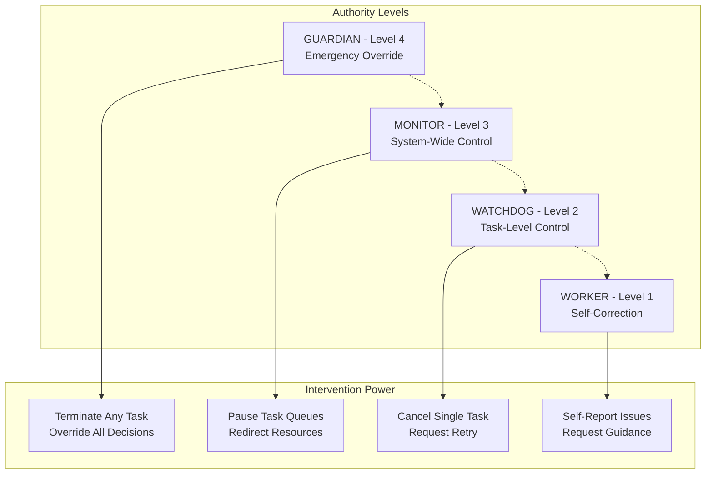
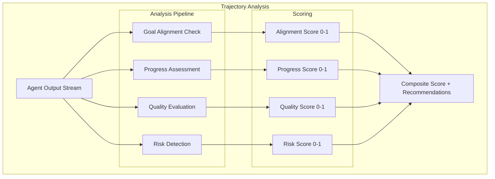
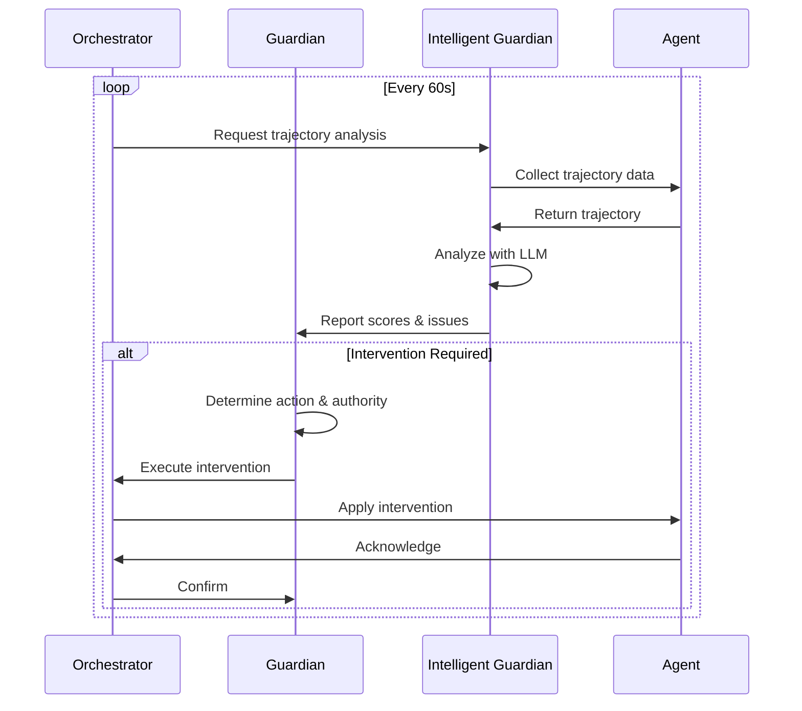
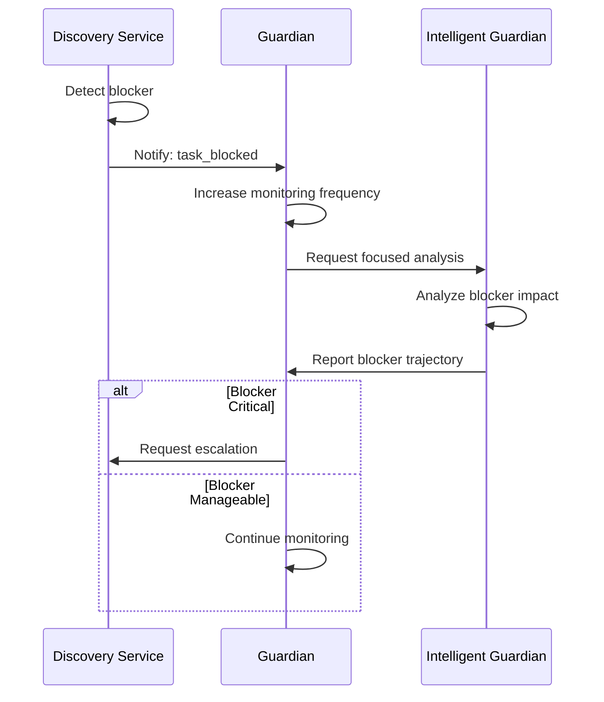

# Guardian Monitoring Service Design Document

**Created:** 2026-04-22  
**Status:** Active  
**Purpose:** Real-time trajectory analysis and emergency intervention system for agent alignment and safety  
**Related Docs:** [Orchestrator Service](./orchestrator_service.md), **Intelligent Guardian**, **Monitoring Loop**

---

## 1. Architecture Overview

The Guardian Monitoring Service provides continuous oversight of AI agent execution, detecting misalignment, drift, and safety issues in real-time. It operates with a hierarchical authority system that can intervene at multiple levels—from gentle steering suggestions to immediate task termination.

### 1.1 High-Level Architecture



### 1.2 Authority Hierarchy

The Guardian implements a four-level authority system for intervention decisions:



---

## 2. Component Responsibilities

| Component | Responsibility | Key Operations |
|-----------|---------------|----------------|
| **Guardian Core** | Emergency intervention, authority enforcement | `intervene()`, `authorize_action()`, `escalate()` |
| **Intelligent Guardian** | LLM-powered trajectory analysis | `analyze_trajectory()`, `score_alignment()`, `detect_drift()` |
| **Trajectory Analyzer** | Pattern detection in agent behavior | `extract_patterns()`, `identify_anomalies()`, `predict_outcomes()` |
| **Alignment Scorer** | Quantify agent-task alignment | `calculate_score()`, `evaluate_progress()`, `assess_risk()` |
| **Intervention Engine** | Execute intervention decisions | `suggest()`, `redirect()`, `pause()`, `terminate()` |
| **Authority Manager** | Hierarchical permission system | `check_authority()`, `grant_authority()`, `revoke_authority()` |
| **Monitoring Loop** | Orchestrate analysis cycles | `run_guardian_cycle()`, `run_conductor_cycle()`, `run_health_cycle()` |

---

## 3. System Boundaries

### 3.1 Inside System Boundaries

- Real-time trajectory analysis (60-second cycles)
- Alignment scoring (0-1 scale with thresholds)
- Pattern detection in agent behavior
- Emergency intervention with 4 authority levels
- Task cancellation and resource reallocation
- Priority override for critical issues
- Steering intervention generation
- Trajectory history tracking
- Drift detection and alerting
- Sandbox vs legacy agent routing decisions

### 3.2 Outside System Boundaries

- Actual agent code execution (handled by Orchestrator)
- Sandbox lifecycle management (handled by Daytona Spawner)
- Task queue management (handled by Orchestrator)
- Database persistence (handled by models layer)
- LLM API calls (delegated to LLM Service)
- User authentication (handled by Auth middleware)
- WebSocket message delivery (handled by WebSocket Hub)

---

## 4. Component Details

### 4.1 Guardian Core

The foundational intervention system with hierarchical authority control.

**Authority Levels:**

| Level | Name | Power Scope | Use Case |
|-------|------|-------------|----------|
| 4 | GUARDIAN | System-wide emergency | Critical safety violations, system compromise |
| 3 | MONITOR | Queue and resource control | Load balancing, resource exhaustion |
| 2 | WATCHDOG | Single task control | Task misalignment, runaway execution |
| 1 | WORKER | Self-correction | Agent self-reported issues |

**Core Methods:**

```python
class Guardian:
    """
    Emergency intervention and authority management.
    
    The Guardian operates on a hierarchical authority system where
    higher levels can override lower levels. All interventions are
    logged for audit and analysis.
    """
    
    AUTHORITY_LEVELS = {
        "GUARDIAN": 4,
        "MONITOR": 3,
        "WATCHDOG": 2,
        "WORKER": 1
    }
    
    async def intervene(
        self,
        target_task_id: str,
        action: InterventionAction,
        authority_level: int,
        reason: str,
        evidence: dict
    ) -> InterventionResult:
        """
        Execute an intervention on a running task.
        
        Args:
            target_task_id: Task to intervene on
            action: Type of intervention (suggest, redirect, pause, terminate)
            authority_level: Required authority for this action
            reason: Human-readable explanation
            evidence: Supporting data (trajectory, scores, etc.)
        
        Returns:
            InterventionResult with status and any error details
        """
        # Verify caller has sufficient authority
        if not self._check_authority(authority_level):
            raise AuthorityError(f"Insufficient authority for {action}")
        
        # Log intervention attempt
        await self._log_intervention(
            target_task_id, action, authority_level, reason
        )
        
        # Execute based on action type
        if action == InterventionAction.SUGGEST:
            return await self._suggest_correction(target_task_id, evidence)
        elif action == InterventionAction.REDIRECT:
            return await self._redirect_task(target_task_id, evidence)
        elif action == InterventionAction.PAUSE:
            return await self._pause_task(target_task_id, reason)
        elif action == InterventionAction.TERMINATE:
            return await self._terminate_task(target_task_id, reason)
        
    def _check_authority(self, required_level: int) -> bool:
        """Verify the current context has sufficient authority."""
        current_level = self._get_current_authority_level()
        return current_level >= required_level
```

### 4.2 Intelligent Guardian

LLM-powered analysis system for sophisticated trajectory evaluation.

**Analysis Dimensions:**



**Key Methods:**

```python
class IntelligentGuardian:
    """
    LLM-powered trajectory analysis and steering.
    
    Analyzes agent behavior patterns, detects misalignment,
    and generates steering interventions to keep agents
    on track toward goals.
    """
    
    # Score thresholds for intervention
    ALIGNMENT_THRESHOLD = 0.7
    PROGRESS_THRESHOLD = 0.3
    RISK_THRESHOLD = 0.8
    
    async def analyze_trajectory(
        self,
        task_id: str,
        trajectory: list[TrajectoryPoint],
        goal: str,
        constraints: list[str]
    ) -> TrajectoryAnalysis:
        """
        Perform comprehensive trajectory analysis.
        
        Returns alignment score, detected issues, and
        recommended interventions.
        """
        # Build analysis prompt
        prompt = self._build_analysis_prompt(
            trajectory, goal, constraints
        )
        
        # Get structured analysis from LLM
        analysis = await self.llm.structured_output(
            prompt=prompt,
            output_type=TrajectoryAnalysis
        )
        
        # Calculate composite scores
        alignment_score = self._calculate_alignment(analysis)
        progress_score = self._calculate_progress(trajectory, goal)
        risk_score = self._assess_risk(analysis)
        
        return TrajectoryAnalysis(
            alignment_score=alignment_score,
            progress_score=progress_score,
            risk_score=risk_score,
            issues=analysis.issues,
            recommendations=analysis.recommendations,
            requires_intervention=self._needs_intervention(
                alignment_score, progress_score, risk_score
            )
        )
    
    async def generate_steering_intervention(
        self,
        task_id: str,
        analysis: TrajectoryAnalysis
    ) -> SteeringIntervention:
        """
        Generate a steering intervention to correct course.
        
        Creates specific guidance for the agent to get back
        on track toward the goal.
        """
        prompt = f"""
        Based on the following trajectory analysis, generate
        a steering intervention to help the agent correct course.
        
        Task Goal: {analysis.goal}
        Alignment Score: {analysis.alignment_score}
        Issues Detected: {analysis.issues}
        
        Generate:
        1. A clear explanation of what's going wrong
        2. Specific corrective actions to take
        3. Success criteria to verify correction
        4. Priority level (low/medium/high/critical)
        """
        
        return await self.llm.structured_output(
            prompt=prompt,
            output_type=SteeringIntervention
        )
```

### 4.3 Monitoring Loop

Orchestrates the Guardian and Conductor analysis cycles.

**Cycle Intervals:**

| Cycle | Interval | Purpose | Components |
|-------|----------|---------|------------|
| Guardian | 60 seconds | Trajectory analysis, steering | Intelligent Guardian |
| Conductor | 5 minutes | Coherence, duplicates, load | Conductor |
| Health | 30 seconds | System health, quick checks | Health Checker |

```mermaid
flowchart TB
    subgraph "Monitoring Loop"
        START[Start Loop]
        
        subgraph "Guardian Cycle [60s]"
            G1[Collect Trajectories]
            G2[Analyze Alignment]
            G3[Detect Drift]
            G4[Generate Steering]
            G5[Apply Interventions]
        end
        
        subgraph "Conductor Cycle [5min]"
            C1[Check Coherence]
            C2[Detect Duplicates]
            C3[Assess Load Balance]
            C4[Rebalance if Needed]
        end
        
        subgraph "Health Cycle [30s]"
            H1[Check System Health]
            H2[Verify Connections]
            H3[Report Status]
        end
        
        END[Wait Next Cycle]
    end
    
    START --> G1
    G1 --> G2 --> G3 --> G4 --> G5
    G5 --> H1
    
    H1 --> H2 --> H3 --> END
    
    C1 --> C2 --> C3 --> C4
    C4 -.->|Every 5min| G1
```



---

## 5. Data Models

### 5.1 Database Schema

```sql
-- Guardian interventions audit log
CREATE TABLE guardian_interventions (
    id UUID PRIMARY KEY DEFAULT gen_random_uuid(),
    task_id UUID NOT NULL REFERENCES tasks(id) ON DELETE CASCADE,
    
    -- Intervention details
    action VARCHAR(50) NOT NULL,  -- suggest, redirect, pause, terminate
    authority_level INTEGER NOT NULL,  -- 1-4
    reason TEXT NOT NULL,
    
    -- Analysis data
    alignment_score DECIMAL(3,2),  -- 0.00 to 1.00
    progress_score DECIMAL(3,2),
    risk_score DECIMAL(3,2),
    trajectory_snapshot JSONB,
    
    -- Outcome
    status VARCHAR(50) NOT NULL,  -- pending, applied, rejected, failed
    agent_response TEXT,
    outcome TEXT,
    
    -- Metadata
    triggered_by VARCHAR(100),  -- intelligent_guardian, monitoring_loop, manual
    change_metadata JSONB,
    created_at TIMESTAMP WITH TIME ZONE DEFAULT NOW(),
    resolved_at TIMESTAMP WITH TIME ZONE
);

-- Trajectory analysis history
CREATE TABLE trajectory_analyses (
    id UUID PRIMARY KEY DEFAULT gen_random_uuid(),
    task_id UUID NOT NULL REFERENCES tasks(id) ON DELETE CASCADE,
    
    -- Scores
    alignment_score DECIMAL(3,2) NOT NULL,
    progress_score DECIMAL(3,2) NOT NULL,
    quality_score DECIMAL(3,2),
    risk_score DECIMAL(3,2) NOT NULL,
    composite_score DECIMAL(3,2) NOT NULL,
    
    -- Analysis details
    issues JSONB,  -- Array of detected issues
    recommendations JSONB,  -- Array of recommendations
    requires_intervention BOOLEAN DEFAULT FALSE,
    
    -- Raw data
    trajectory_sample JSONB,  -- Sample of trajectory points
    analysis_prompt TEXT,
    
    created_at TIMESTAMP WITH TIME ZONE DEFAULT NOW()
);

-- Authority grants (for audit)
CREATE TABLE authority_grants (
    id UUID PRIMARY KEY DEFAULT gen_random_uuid(),
    granter_id VARCHAR(255) NOT NULL,
    grantee_id VARCHAR(255) NOT NULL,
    authority_level INTEGER NOT NULL,
    scope VARCHAR(100),  -- task_id, system, queue, etc.
    granted_at TIMESTAMP WITH TIME ZONE DEFAULT NOW(),
    expires_at TIMESTAMP WITH TIME ZONE,
    revoked_at TIMESTAMP WITH TIME ZONE
);

-- Indexes for common queries
CREATE INDEX idx_guardian_interventions_task 
ON guardian_interventions(task_id, created_at DESC);

CREATE INDEX idx_guardian_interventions_pending 
ON guardian_interventions(status) 
WHERE status = 'pending';

CREATE INDEX idx_trajectory_analyses_task 
ON trajectory_analyses(task_id, created_at DESC);

CREATE INDEX idx_trajectory_analyses_intervention 
ON trajectory_analyses(requires_intervention, created_at) 
WHERE requires_intervention = TRUE;
```

### 5.2 Pydantic Models

```python
from pydantic import BaseModel, Field
from datetime import datetime
from typing import Optional, Literal
from enum import Enum

class AuthorityLevel(int, Enum):
    WORKER = 1
    WATCHDOG = 2
    MONITOR = 3
    GUARDIAN = 4

class InterventionAction(str, Enum):
    SUGGEST = "suggest"      # Gentle guidance
    REDIRECT = "redirect"    # Change approach
    PAUSE = "pause"          # Pause for review
    TERMINATE = "terminate"  # Stop immediately

class TrajectoryPoint(BaseModel):
    """Single point in agent execution trajectory."""
    timestamp: datetime
    action: str
    input_context: Optional[str] = None
    output_result: Optional[str] = None
    tool_calls: list[dict] = Field(default_factory=list)
    reasoning: Optional[str] = None

class TrajectoryAnalysis(BaseModel):
    """Comprehensive trajectory analysis results."""
    task_id: str
    goal: str
    
    # Scores (0-1 scale)
    alignment_score: float = Field(..., ge=0, le=1)
    progress_score: float = Field(..., ge=0, le=1)
    quality_score: Optional[float] = Field(None, ge=0, le=1)
    risk_score: float = Field(..., ge=0, le=1)
    composite_score: float = Field(..., ge=0, le=1)
    
    # Analysis results
    issues: list[dict] = Field(default_factory=list)
    recommendations: list[str] = Field(default_factory=list)
    requires_intervention: bool = False
    intervention_urgency: Literal["low", "medium", "high", "critical"] = "low"
    
    # Metadata
    trajectory_sample: list[TrajectoryPoint] = Field(default_factory=list)
    analyzed_at: datetime = Field(default_factory=utc_now)

class SteeringIntervention(BaseModel):
    """Specific guidance to correct agent trajectory."""
    task_id: str
    
    # Intervention content
    explanation: str = Field(..., description="What's going wrong")
    corrective_actions: list[str] = Field(..., description="Steps to fix")
    success_criteria: list[str] = Field(..., description="How to verify fix")
    
    # Priority
    priority: Literal["low", "medium", "high", "critical"] = "medium"
    
    # Context
    relevant_context: Optional[str] = None
    examples: list[str] = Field(default_factory=list)
    
    created_at: datetime = Field(default_factory=utc_now)

class GuardianIntervention(BaseModel):
    """Record of a guardian intervention."""
    id: str
    task_id: str
    
    action: InterventionAction
    authority_level: AuthorityLevel
    reason: str
    
    # Analysis snapshot
    alignment_score: Optional[float] = None
    progress_score: Optional[float] = None
    risk_score: Optional[float] = None
    trajectory_snapshot: Optional[list[TrajectoryPoint]] = None
    
    # Outcome tracking
    status: Literal["pending", "applied", "rejected", "failed"] = "pending"
    agent_response: Optional[str] = None
    outcome: Optional[str] = None
    
    triggered_by: str
    change_metadata: Optional[dict] = None
    
    created_at: datetime = Field(default_factory=utc_now)
    resolved_at: Optional[datetime] = None

class InterventionResult(BaseModel):
    """Result of an intervention attempt."""
    success: bool
    intervention_id: str
    action_taken: InterventionAction
    message: str
    error: Optional[str] = None
```

---

## 6. API Specifications

### 6.1 REST Endpoints

| Endpoint | Method | Description | Request Body | Response |
|----------|--------|-------------|--------------|----------|
| `/api/v1/guardian/analyze` | POST | Analyze task trajectory | `TrajectoryAnalysisRequest` | `TrajectoryAnalysis` |
| `/api/v1/guardian/intervene` | POST | Execute intervention | `InterventionRequest` | `InterventionResult` |
| `/api/v1/guardian/steer` | POST | Generate steering guidance | `SteeringRequest` | `SteeringIntervention` |
| `/api/v1/guardian/interventions` | GET | List interventions | Query params | `InterventionListResponse` |
| `/api/v1/guardian/scores/{task_id}` | GET | Get current scores | - | `ScoreSnapshot` |
| `/api/v1/guardian/authority/grant` | POST | Grant authority | `AuthorityGrantRequest` | `AuthorityGrant` |
| `/api/v1/guardian/authority/revoke` | POST | Revoke authority | `AuthorityRevokeRequest` | `SuccessResponse` |

### 6.2 Request/Response Schemas

```python
class TrajectoryAnalysisRequest(BaseModel):
    """Request trajectory analysis."""
    task_id: str
    trajectory: list[TrajectoryPoint]
    goal: str
    constraints: list[str] = Field(default_factory=list)
    analysis_depth: Literal["quick", "standard", "deep"] = "standard"

class InterventionRequest(BaseModel):
    """Request intervention on a task."""
    task_id: str
    action: InterventionAction
    authority_level: AuthorityLevel
    reason: str
    evidence: Optional[dict] = None
    force: bool = False  # Bypass confirmation

class SteeringRequest(BaseModel):
    """Request steering intervention."""
    task_id: str
    analysis_id: Optional[str] = None  # Use existing analysis
    urgency: Literal["low", "medium", "high", "critical"] = "medium"

class ScoreSnapshot(BaseModel):
    """Current alignment scores for a task."""
    task_id: str
    alignment_score: float
    progress_score: float
    quality_score: Optional[float]
    risk_score: float
    composite_score: float
    trend: Literal["improving", "stable", "declining"]
    last_analysis_at: datetime
    next_analysis_at: datetime

class AuthorityGrantRequest(BaseModel):
    """Grant authority to a component/user."""
    grantee_id: str
    authority_level: AuthorityLevel
    scope: str  # task_id, "system", "queue", etc.
    duration_seconds: Optional[int] = None  # None = permanent
    reason: str

class AuthorityGrant(BaseModel):
    """Authority grant confirmation."""
    grant_id: str
    granter_id: str
    grantee_id: str
    authority_level: AuthorityLevel
    scope: str
    granted_at: datetime
    expires_at: Optional[datetime]
```

---

## 7. WebSocket Events

### 7.1 Event Types

| Event | Direction | Payload | Description |
|-------|-----------|---------|-------------|
| `guardian.analysis.complete` | Server → Client | `TrajectoryAnalysis` | Analysis finished |
| `guardian.intervention.required` | Server → Client | `InterventionAlert` | Intervention needed |
| `guardian.intervention.applied` | Server → Client | `GuardianIntervention` | Intervention executed |
| `guardian.score.update` | Server → Client | `ScoreSnapshot` | Scores changed |
| `guardian.drift.detected` | Server → Client | `DriftAlert` | Trajectory drift |
| `guardian.steering.suggest` | Server → Client | `SteeringIntervention` | Steering guidance |
| `guardian.authority.change` | Server → Client | `AuthorityChange` | Authority granted/revoked |
| `guardian.health` | Server → Client | `GuardianHealth` | Guardian system health |

### 7.2 Event Payloads

```python
class InterventionAlert(BaseModel):
    """Alert that intervention is required."""
    task_id: str
    urgency: Literal["low", "medium", "high", "critical"]
    detected_issues: list[str]
    recommended_action: InterventionAction
    current_scores: ScoreSnapshot
    timestamp: datetime = Field(default_factory=utc_now)

class DriftAlert(BaseModel):
    """Alert for trajectory drift detection."""
    task_id: str
    drift_type: Literal["goal", "quality", "approach", "safety"]
    severity: Literal["minor", "moderate", "severe", "critical"]
    description: str
    expected_trajectory: str
    actual_trajectory: str
    recommended_correction: str
    timestamp: datetime = Field(default_factory=utc_now)

class GuardianHealth(BaseModel):
    """Guardian system health status."""
    status: Literal["healthy", "degraded", "unhealthy"]
    active_analyses: int
    pending_interventions: int
    last_cycle_at: datetime
    cycle_duration_ms: float
    llm_api_health: Literal["up", "down", "slow"]
    alert_count_24h: int
```

---

## 8. Implementation Details

### 8.1 Trajectory Analysis Pipeline

```python
class TrajectoryAnalyzer:
    """
    Multi-stage trajectory analysis pipeline.
    
    Stages:
    1. Preprocessing - Clean and normalize trajectory data
    2. Pattern Extraction - Identify behavior patterns
    3. Anomaly Detection - Find deviations from expected
    4. Outcome Prediction - Predict likely outcomes
    5. Scoring - Calculate alignment scores
    """
    
    async def analyze(
        self,
        trajectory: list[TrajectoryPoint],
        goal: str,
        constraints: list[str]
    ) -> TrajectoryAnalysis:
        # Stage 1: Preprocessing
        clean_trajectory = self._preprocess(trajectory)
        
        # Stage 2: Pattern extraction
        patterns = await self._extract_patterns(clean_trajectory)
        
        # Stage 3: Anomaly detection
        anomalies = self._detect_anomalies(clean_trajectory, patterns)
        
        # Stage 4: Outcome prediction
        predicted_outcome = await self._predict_outcome(
            clean_trajectory, goal, constraints
        )
        
        # Stage 5: Scoring via LLM
        scores = await self._llm_score(
            clean_trajectory, goal, patterns, anomalies, predicted_outcome
        )
        
        return TrajectoryAnalysis(
            alignment_score=scores.alignment,
            progress_score=scores.progress,
            risk_score=scores.risk,
            issues=anomalies,
            requires_intervention=scores.risk > 0.7 or scores.alignment < 0.5
        )
```

### 8.2 Alignment Scoring Algorithm

```python
def calculate_composite_score(
    alignment: float,
    progress: float,
    quality: Optional[float],
    risk: float,
    weights: dict = None
) -> float:
    """
    Calculate composite alignment score.
    
    Formula:
    - Base: weighted average of alignment, progress, quality
    - Penalty: risk score reduces final score
    - Bonus: high progress with good alignment
    
    Default weights:
    - alignment: 0.4
    - progress: 0.3
    - quality: 0.2
    - risk penalty: 0.1
    """
    weights = weights or {
        "alignment": 0.4,
        "progress": 0.3,
        "quality": 0.2
    }
    
    # Calculate weighted base score
    base_score = (
        alignment * weights["alignment"] +
        progress * weights["progress"]
    )
    
    if quality:
        base_score += quality * weights["quality"]
        base_score /= sum(weights.values())
    else:
        base_score /= (weights["alignment"] + weights["progress"])
    
    # Apply risk penalty
    risk_penalty = risk * 0.3  # Up to 30% reduction
    
    # Progress bonus (high progress + good alignment)
    progress_bonus = 0
    if progress > 0.7 and alignment > 0.8:
        progress_bonus = 0.1
    
    final_score = base_score - risk_penalty + progress_bonus
    return max(0, min(1, final_score))  # Clamp to 0-1
```

### 8.3 Intervention Decision Matrix

```python
INTERVENTION_MATRIX = {
    # (alignment, progress, risk) -> (action, authority_level)
    
    # High alignment, good progress, low risk
    ("high", "good", "low"): (None, None),  # No intervention
    
    # High alignment, good progress, high risk
    ("high", "good", "high"): ("suggest", AuthorityLevel.WORKER),
    
    # High alignment, poor progress, low risk
    ("high", "poor", "low"): ("redirect", AuthorityLevel.WATCHDOG),
    
    # High alignment, poor progress, high risk
    ("high", "poor", "high"): ("pause", AuthorityLevel.WATCHDOG),
    
    # Poor alignment, good progress, low risk
    ("poor", "good", "low"): ("redirect", AuthorityLevel.WATCHDOG),
    
    # Poor alignment, good progress, high risk
    ("poor", "good", "high"): ("pause", AuthorityLevel.MONITOR),
    
    # Poor alignment, poor progress, low risk
    ("poor", "poor", "low"): ("redirect", AuthorityLevel.WATCHDOG),
    
    # Poor alignment, poor progress, high risk
    ("poor", "poor", "high"): ("terminate", AuthorityLevel.GUARDIAN),
}

def determine_intervention(
    alignment_score: float,
    progress_score: float,
    risk_score: float
) -> tuple[Optional[str], Optional[AuthorityLevel]]:
    """
    Determine appropriate intervention based on scores.
    
    Thresholds:
    - alignment: high > 0.7, poor < 0.5
    - progress: good > 0.5, poor < 0.3
    - risk: low < 0.5, high > 0.7
    """
    alignment = "high" if alignment_score > 0.7 else "poor" if alignment_score < 0.5 else "medium"
    progress = "good" if progress_score > 0.5 else "poor" if progress_score < 0.3 else "medium"
    risk = "low" if risk_score < 0.5 else "high" if risk_score > 0.7 else "medium"
    
    key = (alignment, progress, risk)
    return INTERVENTION_MATRIX.get(key, ("suggest", AuthorityLevel.WORKER))
```

---

## 9. Integration Points

### 9.1 Orchestrator Integration



### 9.2 Discovery Service Integration

When the Discovery Service finds blockers, the Guardian adjusts monitoring:



---

## 10. Configuration Parameters

### 10.1 YAML Configuration

```yaml
# config/base.yaml
guardian:
  # Analysis settings
  analysis:
    cycle_interval_seconds: 60
    trajectory_sample_size: 50  # Points to analyze
    analysis_depth: "standard"  # quick, standard, deep
    
  # Scoring thresholds
  thresholds:
    alignment_high: 0.7
    alignment_low: 0.5
    progress_good: 0.5
    progress_poor: 0.3
    risk_low: 0.5
    risk_high: 0.7
    
  # Intervention settings
  intervention:
    auto_intervene: true
    require_confirmation_above: 3  # Authority level
    max_interventions_per_hour: 10
    cooldown_seconds: 300  # Between interventions on same task
    
  # LLM settings
  llm:
    model: "claude-sonnet-4-20250514"
    temperature: 0.2
    max_tokens: 2000
    timeout_seconds: 30
    
  # Monitoring loop
  monitoring:
    guardian_cycle_seconds: 60
    conductor_cycle_seconds: 300
    health_cycle_seconds: 30
    
  # Steering
  steering:
    enabled: true
    max_steering_per_task: 5
    steering_effectiveness_threshold: 0.6
```

### 10.2 Environment Variables

| Variable | Default | Description |
|----------|---------|-------------|
| `GUARDIAN_CYCLE_INTERVAL` | 60 | Analysis cycle interval (seconds) |
| `GUARDIAN_ALIGNMENT_THRESHOLD` | 0.7 | High alignment threshold |
| `GUARDIAN_RISK_THRESHOLD` | 0.7 | High risk threshold |
| `GUARDIAN_AUTO_INTERVENE` | true | Enable automatic interventions |
| `GUARDIAN_LLM_MODEL` | claude-sonnet-4-20250514 | LLM model for analysis |
| `GUARDIAN_MAX_INTERVENTIONS_HOUR` | 10 | Rate limit for interventions |

---

## 11. Performance Characteristics

| Metric | Target | Notes |
|--------|--------|-------|
| Analysis latency | < 5s | From request to scores |
| LLM call latency | < 3s | Trajectory analysis |
| Intervention latency | < 500ms | From decision to execution |
| Cycle overhead | < 10% | Of total cycle time |
| False positive rate | < 5% | Unnecessary interventions |
| Detection accuracy | > 90% | True issues caught |
| Score stability | ±0.1 | Variance between cycles |

---

## 12. Security & Safety

### 12.1 Safety Mechanisms

1. **Authority Verification**: All interventions verified against authority hierarchy
2. **Audit Logging**: Every intervention recorded with full context
3. **Rate Limiting**: Max interventions per hour to prevent thrashing
4. **Human Override**: Manual intervention can override automatic decisions
5. **Rollback Capability**: Interventions can be reverted if incorrect

### 12.2 Privacy Considerations

- Trajectory data retained for 30 days then anonymized
- LLM prompts don't include sensitive user data
- Analysis results shared only with authorized components
- Authority grants logged for compliance auditing

---

## 13. Future Enhancements

1. **Predictive Intervention**: Predict issues before they occur
2. **Multi-Agent Coordination**: Monitor agent-to-agent interactions
3. **Learning from History**: Improve scoring based on past outcomes
4. **Visual Trajectory Maps**: Graphical trajectory visualization
5. **Custom Scoring Models**: Domain-specific alignment metrics

---

*Document Version: 1.0*  
*Last Updated: 2026-04-22*  
*Maintainer: OmoiOS Core Team*
