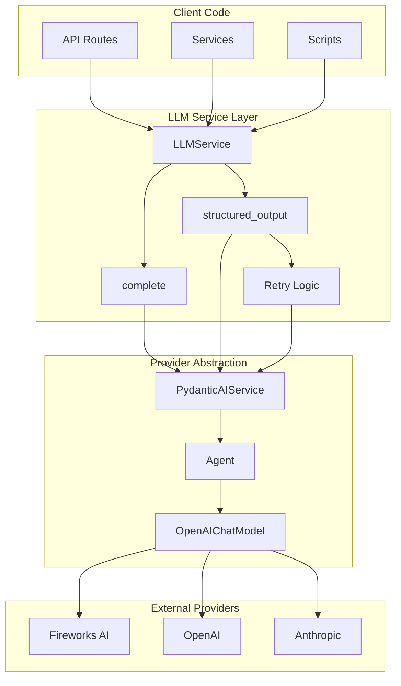
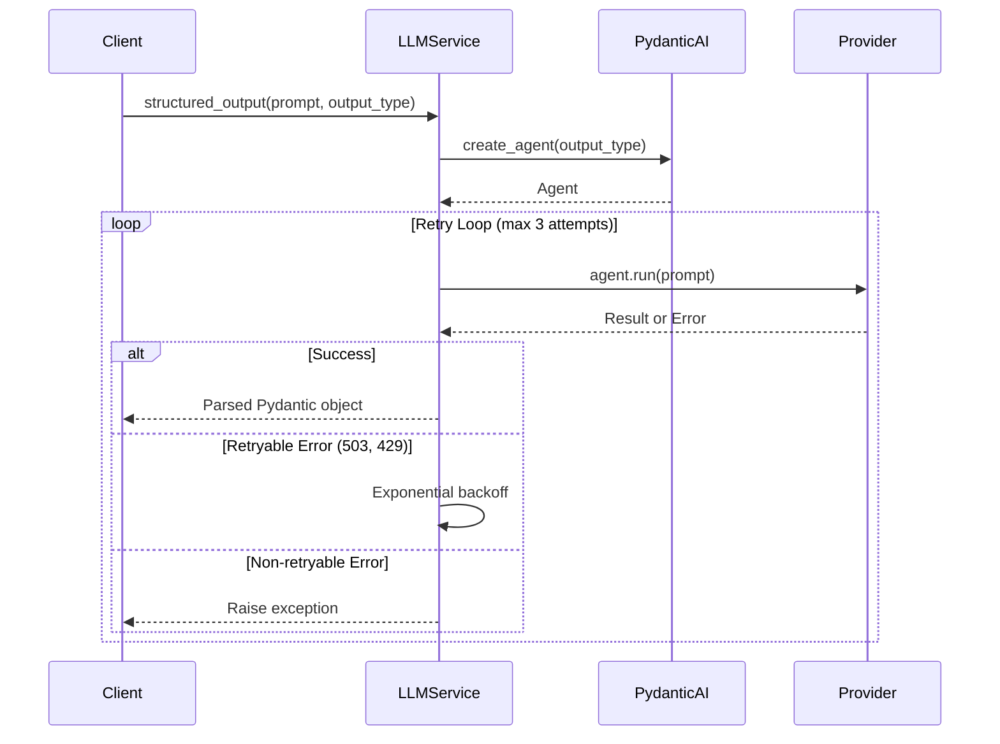
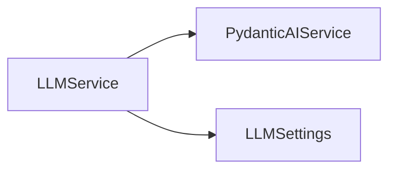

# LLM Service Usage Guide

**Created:** 2025-11-20  
**Status:** Active  
**Source File:** `backend/omoi_os/services/llm_service.py`  
**Related Docs:** [LLM Service Internals](../../architecture/18-llm-service-internals.md), **PydanticAI Service**, **Agent Executor**

---

## 1. Architecture Overview

The `LLMService` provides a unified, simplified interface for calling Large Language Models throughout the OmoiOS codebase. It abstracts provider-specific details and offers two primary capabilities: simple text completion and structured outputs with Pydantic models.

### 1.1 High-Level Architecture



### 1.2 Service Flow



---

## 2. Component Responsibilities

| Component | Responsibility | Key Operations |
|-----------|---------------|----------------|
| **LLMService** | Main service facade | `complete()`, `structured_output()` |
| **Retry Handler** | Exponential backoff for transient errors | HTTP 503, 429, 502 detection |
| **PydanticAIService** | Provider abstraction layer | Agent creation, model configuration |
| **Agent** | PydanticAI execution unit | `run()` method with structured output |
| **OpenAIChatModel** | Model adapter | Provider-specific settings |
| **Singleton Factory** | Global instance management | `get_llm_service()`, `reset_llm_service()` |

---

## 3. System Boundaries

### 3.1 Inside System Boundaries

- Simple text completion with optional system prompts
- Structured output with Pydantic model validation
- Automatic retry with exponential backoff (1s, 2s, 4s + jitter)
- HTTP error classification (retryable vs non-retryable)
- Singleton pattern for service reuse
- Provider-agnostic interface (Fireworks, OpenAI, Anthropic)

### 3.2 Outside System Boundaries

- Workspace execution (handled by `AgentExecutor`)
- Tool calling and function execution
- Streaming responses
- Conversation history management
- Fine-tuning or model training
- Embedding generation (handled by `EmbeddingService`)

---

## 4. Data Models

### 4.1 Service Configuration

```python
from pydantic_settings import BaseSettings
from typing import Optional

class LLMSettings(BaseSettings):
    """Configuration for LLM service."""
    
    # Model selection
    LLM_MODEL: str = "accounts/fireworks/models/kimi-k2-thinking"
    LLM_API_KEY: Optional[str] = None
    LLM_BASE_URL: Optional[str] = None
    
    # Retry configuration
    LLM_MAX_RETRIES: int = 3
    LLM_RETRY_DELAY_BASE: float = 1.0
    LLM_RETRY_DELAY_MAX: float = 8.0
    
    # Timeouts
    LLM_TIMEOUT_SECONDS: float = 60.0
    
    class Config:
        env_prefix = "LLM_"
```

### 4.2 Retryable Status Codes

```python
# HTTP status codes that trigger retry with exponential backoff
RETRYABLE_STATUS_CODES = {429, 500, 502, 503, 504}

# Error indicators for string matching
RETRYABLE_INDICATORS = [
    "503", "502", "500", "504", "429",
    "service unavailable",
    "bad gateway",
    "gateway timeout",
    "rate limit",
    "too many requests",
]
```

### 4.3 Output Type Pattern

```python
from pydantic import BaseModel, Field
from typing import TypeVar

T = TypeVar("T", bound=BaseModel)

# Example structured output models
class SentimentAnalysis(BaseModel):
    """Sentiment analysis result."""
    sentiment: str = Field(..., description="positive, negative, or neutral")
    confidence: float = Field(..., ge=0.0, le=1.0)
    reasoning: str = Field(..., description="Brief explanation")

class CodeReviewResult(BaseModel):
    """Code review structured output."""
    issues: list[dict] = Field(default_factory=list)
    suggestions: list[str] = Field(default_factory=list)
    security_concerns: list[str] = Field(default_factory=list)
    overall_quality: str = Field(..., description="excellent, good, fair, poor")
    estimated_effort: str = Field(..., description="hours to address issues")
```

---

## 5. API Surface

### 5.1 Service Methods

| Method | Signature | Description |
|--------|-----------|-------------|
| `complete` | `(prompt: str, system_prompt: Optional[str] = None, **kwargs) -> str` | Simple text completion |
| `structured_output` | `(prompt: str, output_type: type[T], system_prompt: Optional[str] = None, output_retries: int = 5, http_retries: int = 3, **kwargs) -> T` | Structured output with validation |

### 5.2 Factory Functions

| Function | Signature | Description |
|----------|-----------|-------------|
| `get_llm_service` | `(settings: Optional[LLMSettings] = None) -> LLMService` | Get or create singleton instance |
| `reset_llm_service` | `() -> None` | Reset singleton (useful for testing) |

### 5.3 Method Details

```python
async def complete(
    self, 
    prompt: str, 
    system_prompt: Optional[str] = None, 
    **kwargs
) -> str:
    """
    Simple text completion - just get text back from the LLM.
    
    Args:
        prompt: User prompt
        system_prompt: Optional system prompt for context
        **kwargs: Additional arguments (reserved for future use)
    
    Returns:
        Text response from the LLM
    
    Example:
        >>> llm = get_llm_service()
        >>> result = await llm.complete("What is Python?")
        >>> print(result)
        "Python is a high-level programming language..."
    """

async def structured_output(
    self,
    prompt: str,
    output_type: type[T],
    system_prompt: Optional[str] = None,
    output_retries: int = 5,
    http_retries: int = 3,
    **kwargs,
) -> T:
    """
    Get structured output matching a Pydantic model.
    
    Includes automatic retry with exponential backoff for transient HTTP errors
    (503, 429, etc.) that can occur with LLM providers like Fireworks.
    
    Args:
        prompt: User prompt
        output_type: Pydantic model class for structured output
        system_prompt: Optional system prompt
        output_retries: Number of retries for structured output validation
        http_retries: Number of retries for transient HTTP errors
        **kwargs: Additional arguments (reserved for future use)
    
    Returns:
        Instance of output_type with structured data
    
    Example:
        >>> class Analysis(BaseModel):
        ...     score: float
        ...     summary: str
        >>> llm = get_llm_service()
        >>> result = await llm.structured_output(
        ...     "Analyze this code",
        ...     output_type=Analysis
        ... )
        >>> print(result.score)
        0.95
    """
```

---

## 6. Integration Points

### 6.1 Services Called By LLMService



| Service | Purpose | Key Methods Used |
|---------|---------|------------------|
| **PydanticAIService** | Provider abstraction and agent creation | `create_agent()`, model configuration |
| **LLMSettings** | Configuration loading | Environment variable access |

### 6.2 Services That Call LLMService

| Service | Purpose |
|---------|---------|
| **MemoryService** | Memory classification and analysis |
| **IntelligentGuardian** | Trajectory analysis and intervention |
| **DiscoveryService** | Requirement analysis and classification |
| **ConductorService** | Coherence analysis |
| **API Routes** | On-demand LLM operations |
| **Various Services** | Any service needing LLM capabilities |

### 6.3 Usage Patterns

```mermaid
flowchart TB
    subgraph "Dependency Injection (API Routes)"
        route[API Route]
        depends[Depends get_llm_service]
        route --> depends
    end
    
    subgraph "Direct Import (Services)"
        svc[Service Class]
        init[__init__ get_llm_service]
        call[method call]
        svc --> init
        svc --> call
    end
    
    subgraph "Standalone (Scripts)"
        script[Script]
        get[get_llm_service]
        run[await llm.complete]
        script --> get
        script --> run
    end
```

---

## 7. Configuration Parameters

### 7.1 Environment Variables

| Variable | Default | Description |
|----------|---------|-------------|
| `LLM_MODEL` | `accounts/fireworks/models/kimi-k2-thinking` | Model identifier |
| `LLM_API_KEY` | None | API key for provider |
| `LLM_BASE_URL` | None | Optional custom base URL |
| `LLM_MAX_RETRIES` | 3 | Maximum HTTP retry attempts |
| `LLM_RETRY_DELAY_BASE` | 1.0 | Base delay for exponential backoff (seconds) |
| `LLM_RETRY_DELAY_MAX` | 8.0 | Maximum delay between retries (seconds) |
| `LLM_TIMEOUT_SECONDS` | 60.0 | Request timeout (seconds) |

### 7.2 Provider-Specific Settings

```python
# Fireworks AI (default)
LLM_MODEL=accounts/fireworks/models/kimi-k2-thinking
LLM_API_KEY=fw_...

# OpenAI
LLM_MODEL=gpt-4o
LLM_API_KEY=sk-...

# Anthropic (via OpenAI-compatible endpoint)
LLM_MODEL=claude-3-5-sonnet-20241022
LLM_API_KEY=sk-ant-...
LLM_BASE_URL=https://api.anthropic.com/v1
```

### 7.3 Retry Configuration

```python
# Exponential backoff formula:
# delay = (2 ** attempt) + random.uniform(0, 0.5 * (2 ** attempt))
#
# Attempt 1: ~1.0-1.5s
# Attempt 2: ~2.0-3.0s
# Attempt 3: ~4.0-6.0s
# Attempt 4: ~8.0-12.0s (if max_retries > 3)
```

---

## 8. Error Handling

### 8.1 Error Categories

| Category | Examples | Handling Strategy |
|----------|----------|-------------------|
| **Retryable HTTP** | 503, 502, 429, 504 | Exponential backoff retry |
| **Validation** | Pydantic validation failure | Retry with `output_retries` |
| **Authentication** | 401, 403 | Raise immediately |
| **Client Error** | 400, 422 | Raise immediately |
| **Timeout** | Connection timeout | Retry with backoff |

### 8.2 Retry Logic Implementation

```python
async def structured_output(self, prompt, output_type, ..., http_retries=3):
    agent = self._pydantic_ai.create_agent(output_type=output_type, ...)
    
    last_error = None
    for attempt in range(http_retries + 1):
        try:
            result = await agent.run(prompt)
            return result.output
        except Exception as e:
            error_str = str(e).lower()
            
            # Check if retryable
            is_retryable = any(
                indicator in error_str
                for indicator in RETRYABLE_INDICATORS
            )
            
            if is_retryable and attempt < http_retries:
                # Exponential backoff with jitter
                base_delay = 2 ** attempt
                jitter = random.uniform(0, 0.5 * base_delay)
                delay = base_delay + jitter
                
                logger.warning(
                    f"LLM HTTP error (attempt {attempt + 1}/{http_retries + 1}), "
                    f"retrying in {delay:.1f}s",
                    extra={"error": str(e)[:200], "attempt": attempt + 1}
                )
                
                await asyncio.sleep(delay)
                last_error = e
            else:
                # Not retryable or exhausted retries
                raise
    
    if last_error:
        raise last_error
    raise RuntimeError("Unexpected state in retry loop")
```

### 8.3 Error Handling Patterns

```python
# Pattern 1: Try/catch with fallback
from omoi_os.services.llm_service import get_llm_service

llm = get_llm_service()

try:
    result = await llm.structured_output(
        "Analyze this text",
        output_type=MySchema,
        output_retries=3
    )
except Exception as e:
    logger.error(f"LLM analysis failed: {e}")
    # Fallback to simple completion or cached result
    result = await llm.complete("Fallback analysis...")

# Pattern 2: Graceful degradation
async def analyze_with_fallback(text: str) -> dict:
    llm = get_llm_service()
    
    try:
        structured = await llm.structured_output(
            f"Analyze: {text}",
            output_type=AnalysisResult
        )
        return structured.model_dump()
    except Exception:
        # Return simple text if structured fails
        text_result = await llm.complete(f"Analyze: {text}")
        return {"raw_analysis": text_result}
```

---

## 9. Performance Characteristics

| Metric | Target | Notes |
|--------|--------|-------|
| Simple completion | < 2s | Depends on model and prompt size |
| Structured output | < 3s | Includes validation retry time |
| Retry overhead | +1-8s | Per retry attempt |
| Connection pool | Reused | PydanticAI manages connections |
| Memory footprint | Low | Stateless service, singleton pattern |

### 9.1 Optimization Tips

```python
# 1. Cache the service instance (automatic via singleton)
llm = get_llm_service()  # Same instance on subsequent calls

# 2. Use structured outputs for complex parsing
# (Avoids manual JSON parsing errors)

# 3. Set appropriate retry limits
# - output_retries: 3-5 for validation
# - http_retries: 2-3 for transient errors

# 4. Use system prompts for consistent behavior
result = await llm.complete(
    "Analyze this code",
    system_prompt="You are a code review expert. Be concise."
)
```

---

## 10. Usage Examples

### 10.1 In API Routes (Dependency Injection)

```python
from fastapi import APIRouter, Depends
from omoi_os.api.dependencies import get_llm_service
from omoi_os.services.llm_service import LLMService
from pydantic import BaseModel

router = APIRouter()

class AnalysisRequest(BaseModel):
    text: str
    analysis_type: str = "sentiment"

class AnalysisResponse(BaseModel):
    result: str
    confidence: float

@router.post("/analyze")
async def analyze_text(
    request: AnalysisRequest,
    llm: LLMService = Depends(get_llm_service)
):
    """Analyze text using LLM."""
    
    # Use structured output for type-safe results
    class SentimentResult(BaseModel):
        sentiment: str
        confidence: float
        explanation: str
    
    result = await llm.structured_output(
        prompt=f"Analyze the sentiment of: {request.text}",
        output_type=SentimentResult,
        system_prompt="You are a sentiment analysis expert."
    )
    
    return AnalysisResponse(
        result=result.sentiment,
        confidence=result.confidence
    )
```

### 10.2 In Services (Direct Import)

```python
from omoi_os.services.llm_service import get_llm_service
from pydantic import BaseModel, Field

class MemoryClassification(BaseModel):
    """Classification schema for memory analysis."""
    category: str = Field(..., description="memory category")
    importance: int = Field(..., ge=1, le=10)
    summary: str = Field(..., description="brief summary")

class MemoryAnalyzer:
    """Service for analyzing and classifying memories."""
    
    def __init__(self):
        self.llm = get_llm_service()
    
    async def classify(self, content: str) -> MemoryClassification:
        """Classify memory content."""
        return await self.llm.structured_output(
            prompt=f"Classify this memory: {content}",
            output_type=MemoryClassification,
            system_prompt="You classify memories by importance and category."
        )
    
    async def summarize(self, content: str) -> str:
        """Generate summary."""
        return await self.llm.complete(
            prompt=f"Summarize: {content}",
            system_prompt="Create a concise one-sentence summary."
        )
```

### 10.3 Standalone Usage

```python
import asyncio
from omoi_os.services.llm_service import get_llm_service
from pydantic import BaseModel

class CodeAnalysis(BaseModel):
    complexity: str
    issues: list[str]
    suggestions: list[str]

async def main():
    llm = get_llm_service()
    
    # Simple completion
    answer = await llm.complete(
        "What are Python dataclasses?",
        system_prompt="You are a Python expert."
    )
    print(f"Answer: {answer}")
    
    # Structured output
    code = """
    def process(data):
        result = []
        for item in data:
            if item > 0:
                result.append(item * 2)
        return result
    """
    
    analysis = await llm.structured_output(
        prompt=f"Analyze this code: {code}",
        output_type=CodeAnalysis,
        system_prompt="You are a code review expert."
    )
    
    print(f"Complexity: {analysis.complexity}")
    print(f"Issues: {analysis.issues}")
    print(f"Suggestions: {analysis.suggestions}")

if __name__ == "__main__":
    asyncio.run(main())
```

### 10.4 Migration from Direct PydanticAI Usage

```python
# BEFORE: Direct PydanticAI usage
from omoi_os.services.pydantic_ai_service import PydanticAIService
from pydantic import BaseModel

class Analysis(BaseModel):
    score: float
    summary: str

ai_service = PydanticAIService()
agent = ai_service.create_agent(output_type=Analysis)
result = await agent.run("Analyze this")
data = result.output

# AFTER: Using LLMService
from omoi_os.services.llm_service import get_llm_service
from pydantic import BaseModel

class Analysis(BaseModel):
    score: float
    summary: str

llm = get_llm_service()
data = await llm.structured_output(
    "Analyze this",
    output_type=Analysis
)
```

---

## 11. Testing

### 11.1 Unit Testing with Mock

```python
import pytest
from unittest.mock import AsyncMock, patch
from omoi_os.services.llm_service import LLMService, get_llm_service

@pytest.fixture
def mock_llm_service():
    """Create mock LLM service."""
    with patch("omoi_os.services.llm_service.get_llm_service") as mock:
        service = AsyncMock(spec=LLMService)
        mock.return_value = service
        yield service

@pytest.mark.asyncio
async def test_structured_output(mock_llm_service):
    """Test structured output call."""
    from pydantic import BaseModel
    
    class TestResult(BaseModel):
        value: str
    
    mock_llm_service.structured_output.return_value = TestResult(value="test")
    
    llm = get_llm_service()
    result = await llm.structured_output(
        "test prompt",
        output_type=TestResult
    )
    
    assert result.value == "test"
    mock_llm_service.structured_output.assert_called_once()

@pytest.mark.asyncio
async def test_complete(mock_llm_service):
    """Test simple completion."""
    mock_llm_service.complete.return_value = "test response"
    
    llm = get_llm_service()
    result = await llm.complete("test prompt")
    
    assert result == "test response"
```

### 11.2 Integration Testing

```python
import pytest
from omoi_os.services.llm_service import get_llm_service, reset_llm_service

@pytest.fixture(autouse=True)
def reset_service():
    """Reset LLM service between tests."""
    reset_llm_service()
    yield
    reset_llm_service()

@pytest.mark.integration
@pytest.mark.asyncio
async def test_real_completion():
    """Test with real LLM (requires API key)."""
    llm = get_llm_service()
    
    result = await llm.complete(
        "What is 2+2?",
        system_prompt="You are a helpful assistant."
    )
    
    assert "4" in result

@pytest.mark.integration
@pytest.mark.asyncio
async def test_real_structured_output():
    """Test structured output with real LLM."""
    from pydantic import BaseModel, Field
    
    class MathResult(BaseModel):
        answer: int
        explanation: str = Field(..., description="How you calculated it")
    
    llm = get_llm_service()
    
    result = await llm.structured_output(
        "What is 2+2?",
        output_type=MathResult
    )
    
    assert result.answer == 4
    assert len(result.explanation) > 0
```

---

## 12. Best Practices

### 12.1 Do's and Don'ts

| ✅ DO | ❌ DON'T |
|-------|----------|
| Use `structured_output()` for complex parsing | Parse JSON manually from text responses |
| Cache the service instance via `get_llm_service()` | Create new service instances per call |
| Handle errors gracefully with try/catch | Let exceptions bubble up unhandled |
| Use system prompts for consistent behavior | Repeat instructions in every prompt |
| Set appropriate retry limits | Disable retries or set infinite retries |
| Use Pydantic models for type safety | Use untyped dictionaries |
| Test with mocked service in unit tests | Make real LLM calls in unit tests |

### 12.2 Common Pitfalls

```python
# ❌ DON'T: Manual JSON parsing
response = await llm.complete("Return JSON: {...}")
import json
data = json.loads(response)  # Fragile!

# ✅ DO: Use structured_output
from pydantic import BaseModel
class Data(BaseModel):
    field: str
data = await llm.structured_output("...", output_type=Data)

# ❌ DON'T: Create service per call
for item in items:
    llm = LLMService()  # Inefficient
    result = await llm.complete(item)

# ✅ DO: Reuse singleton
llm = get_llm_service()  # Once
for item in items:
    result = await llm.complete(item)

# ❌ DON'T: Ignore errors
data = await llm.structured_output("...", output_type=MySchema)
use_data(data)  # May fail if LLM errors

# ✅ DO: Handle errors
try:
    data = await llm.structured_output("...", output_type=MySchema)
    use_data(data)
except Exception as e:
    logger.error(f"LLM failed: {e}")
    use_fallback()
```

---

## 13. Future Enhancements

1. **Streaming Support** - Add streaming response capability
2. **Batch Processing** - Support for batch LLM calls
3. **Caching Layer** - Redis cache for common queries
4. **Circuit Breaker** - Fail-fast for provider outages
5. **Multi-Provider Fallback** - Automatic provider switching
6. **Cost Tracking** - Per-call cost attribution
7. **Prompt Templates** - Built-in template system

---

## 14. Related Documentation

- [LLM Service Internals](../../architecture/18-llm-service-internals.md) - Deep dive into implementation
- **PydanticAI Service** - Provider abstraction layer
- **Agent Executor** - For workspace execution
- [Configuration System](../../architecture/12-configuration-system.md) - Settings management
- [Embedding Service](../services/embedding_service.md) - For vector operations

---

*Document Version: 2.0*  
*Last Updated: 2026-04-22*  
*Maintainer: OmoiOS Core Team*
