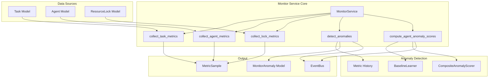
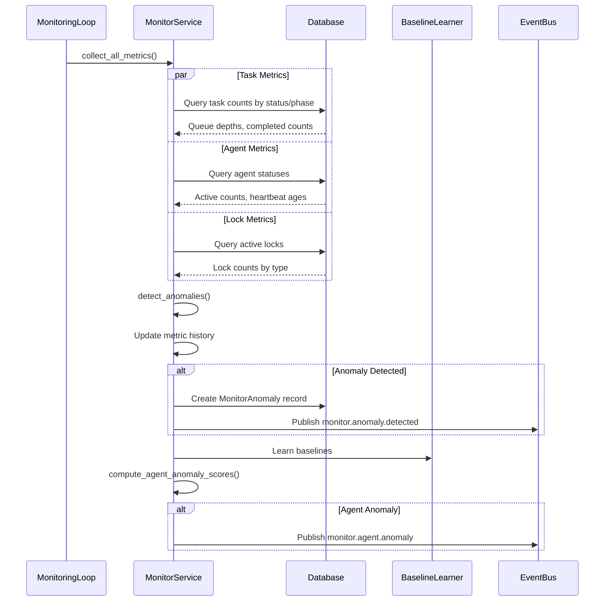
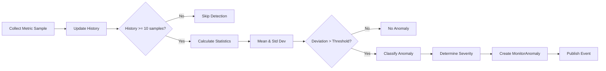
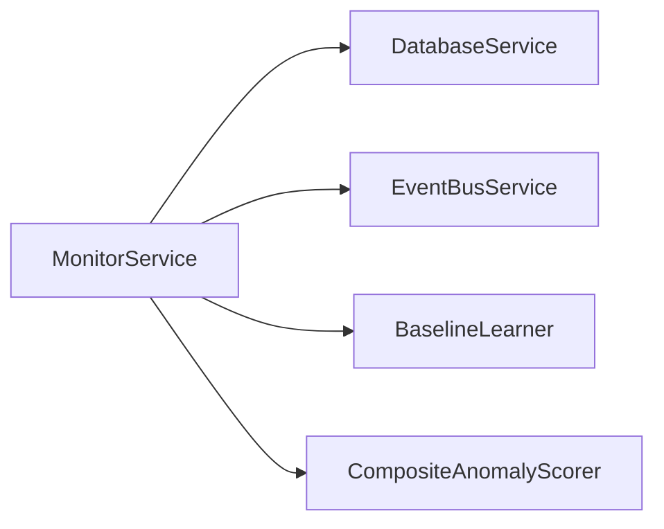

# Monitor Service Design Document

**Created:** 2026-04-22  
**Status:** Active  
**Purpose:** System health monitoring, metrics collection, anomaly detection, and agent status tracking  
**Related Docs:** [Orchestrator Service](./orchestrator_service.md), [Agent Registry](./agent_registry.md), [Event Bus](./event_bus.md)

---

## 1. Architecture Overview

The MonitorService collects system metrics, detects anomalies using statistical analysis, and provides composite anomaly scoring for agents. It integrates with BaselineLearner and CompositeAnomalyScorer for intelligent anomaly detection.

### 1.1 High-Level Architecture



### 1.2 Metrics Collection Flow



### 1.3 Anomaly Detection Flow



---

## 2. Component Responsibilities

| Component | Responsibility | Key Operations |
|-----------|---------------|----------------|
| **MonitorService** | Main service orchestrating monitoring | `collect_all_metrics()`, `detect_anomalies()`, `compute_agent_anomaly_scores()` |
| **Task Metrics Collector** | Collects task-related metrics | `collect_task_metrics()` - queue depth, completion rates, durations |
| **Agent Metrics Collector** | Collects agent-related metrics | `collect_agent_metrics()` - active counts, heartbeat ages |
| **Lock Metrics Collector** | Collects resource lock metrics | `collect_lock_metrics()` - active locks by type |
| **Anomaly Detector** | Statistical anomaly detection | `detect_anomalies()` - rolling statistics, threshold-based |
| **Agent Anomaly Scorer** | Composite scoring for agents | `compute_agent_anomaly_scores()` - uses BaselineLearner and CompositeAnomalyScorer |
| **Baseline Learner** | Learns normal behavior patterns | `learn_baseline()` - per agent type and phase |
| **Composite Scorer** | Calculates composite anomaly scores | `compute_anomaly_score()` - multi-factor scoring |

---

## 3. System Boundaries

### 3.1 Inside System Boundaries

- Task metrics: queue depth, completion counts, durations by phase
- Agent metrics: active counts by type, heartbeat ages
- Resource lock metrics: active locks by type and mode
- Statistical anomaly detection with rolling history
- Severity classification (critical, error, warning, info)
- Agent-level composite anomaly scoring
- Baseline learning for agent behavior
- Anomaly persistence and acknowledgment

### 3.2 Outside System Boundaries

- Alerting/notification (handled by external systems)
- Dashboard visualization (handled by frontend)
- Metric storage time-series DB (uses PostgreSQL)
- Log aggregation (handled by logging infrastructure)
- Infrastructure monitoring (CPU, memory, disk)

---

## 4. Data Models

### 4.1 Database Schema

```sql
-- Monitor anomalies
CREATE TABLE monitor_anomalies (
    id UUID PRIMARY KEY DEFAULT gen_random_uuid(),
    metric_name VARCHAR(255) NOT NULL,
    anomaly_type VARCHAR(50) NOT NULL,  -- 'spike', 'drop'
    severity VARCHAR(20) NOT NULL,  -- 'critical', 'error', 'warning', 'info'
    baseline_value DOUBLE PRECISION NOT NULL,
    observed_value DOUBLE PRECISION NOT NULL,
    deviation_percent DOUBLE PRECISION NOT NULL,
    description TEXT,
    labels JSONB,  -- Additional context
    acknowledged_at TIMESTAMP WITH TIME ZONE,
    detected_at TIMESTAMP WITH TIME ZONE DEFAULT NOW()
);

-- Indexes for anomaly queries
CREATE INDEX idx_monitor_anomalies_detected_at 
ON monitor_anomalies(detected_at DESC);

CREATE INDEX idx_monitor_anomalies_severity 
ON monitor_anomalies(severity) 
WHERE severity IN ('critical', 'error');

-- Conductor analyses (for system context)
CREATE TABLE conductor_analyses (
    id UUID PRIMARY KEY DEFAULT gen_random_uuid(),
    cycle_id UUID NOT NULL,
    coherence_score DOUBLE PRECISION NOT NULL,
    system_status VARCHAR(50) NOT NULL,
    num_agents INTEGER NOT NULL,
    duplicate_count INTEGER DEFAULT 0,
    termination_count INTEGER DEFAULT 0,
    coordination_count INTEGER DEFAULT 0,
    details JSONB,
    created_at TIMESTAMP WITH TIME ZONE DEFAULT NOW()
);

-- Agent model (referenced by monitor)
CREATE TABLE agents (
    id UUID PRIMARY KEY DEFAULT gen_random_uuid(),
    agent_name VARCHAR(255) NOT NULL,
    agent_type VARCHAR(100) NOT NULL,
    phase_id VARCHAR(50),
    status VARCHAR(50) NOT NULL,
    health_status VARCHAR(50),
    anomaly_score DOUBLE PRECISION DEFAULT 0.0,
    consecutive_anomalous_readings INTEGER DEFAULT 0,
    last_heartbeat TIMESTAMP WITH TIME ZONE,
    -- ... other fields
);

-- Task model (referenced by monitor)
CREATE TABLE tasks (
    id UUID PRIMARY KEY DEFAULT gen_random_uuid(),
    ticket_id UUID NOT NULL REFERENCES tickets(id),
    phase_id VARCHAR(50) NOT NULL,
    task_type VARCHAR(50) NOT NULL,
    status VARCHAR(50) NOT NULL,
    priority VARCHAR(20) NOT NULL,
    started_at TIMESTAMP WITH TIME ZONE,
    completed_at TIMESTAMP WITH TIME ZONE,
    -- ... other fields
);

-- Resource lock model
CREATE TABLE resource_locks (
    id UUID PRIMARY KEY DEFAULT gen_random_uuid(),
    resource_type VARCHAR(100) NOT NULL,
    resource_id VARCHAR(255) NOT NULL,
    lock_mode VARCHAR(50) NOT NULL,  -- 'read', 'write'
    acquired_at TIMESTAMP WITH TIME ZONE DEFAULT NOW(),
    released_at TIMESTAMP WITH TIME ZONE,
    -- ... other fields
);
```

### 4.2 Pydantic Models

```python
from pydantic import BaseModel, Field
from typing import Dict, Optional, List, Any
from datetime import datetime

class MetricSample(BaseModel):
    """A single metric sample."""
    metric_name: str
    value: float
    labels: Dict[str, str] = Field(default_factory=dict)
    timestamp: datetime

class AnomalyDetectionConfig(BaseModel):
    """Configuration for anomaly detection."""
    sensitivity: float = Field(default=2.0, description="Standard deviations for threshold")
    history_size: int = Field(default=100, description="Rolling window size")
    min_samples: int = Field(default=10, description="Minimum samples for detection")
    
    # Severity thresholds (multipliers of sensitivity)
    critical_threshold: float = 3.0
    error_threshold: float = 2.5
    warning_threshold: float = 2.0

class AgentAnomalyResult(BaseModel):
    """Result of agent anomaly scoring."""
    agent_id: str
    agent_type: str
    phase_id: Optional[str]
    anomaly_score: float
    consecutive_readings: int
    should_quarantine: bool

class MonitorAnomaly(BaseModel):
    """Anomaly record model."""
    id: str
    metric_name: str
    anomaly_type: str  # 'spike', 'drop'
    severity: str
    baseline_value: float
    observed_value: float
    deviation_percent: float
    description: str
    labels: Optional[Dict[str, Any]]
    acknowledged_at: Optional[datetime]
    detected_at: datetime
```

---

## 5. API Surface

### 5.1 Service Methods

| Method | Signature | Description |
|--------|-----------|-------------|
| `collect_task_metrics` | `(phase_id: Optional[str] = None) -> Dict[str, MetricSample]` | Collect task-related metrics |
| `collect_agent_metrics` | `() -> Dict[str, MetricSample]` | Collect agent-related metrics |
| `collect_lock_metrics` | `() -> Dict[str, MetricSample]` | Collect resource lock metrics |
| `collect_all_metrics` | `(phase_id: Optional[str] = None) -> Dict[str, MetricSample]` | Collect all system metrics |
| `detect_anomalies` | `(metric_samples: Dict[str, MetricSample], sensitivity: float = 2.0) -> List[MonitorAnomaly]` | Detect anomalies using rolling statistics |
| `compute_agent_anomaly_scores` | `(agent_ids: Optional[List[str]] = None, anomaly_threshold: float = 0.8, consecutive_threshold: int = 3) -> List[Dict[str, Any]]` | Compute composite anomaly scores |
| `get_recent_anomalies` | `(hours: int = 24, severity: Optional[str] = None) -> List[MonitorAnomaly]` | Get recent anomalies |
| `acknowledge_anomaly` | `(anomaly_id: str) -> bool` | Acknowledge an anomaly |

### 5.2 Internal Methods

| Method | Purpose |
|--------|---------|
| `_create_anomaly` | Create and persist anomaly record |
| `_get_agent_health_metrics` | Get health metrics for agent |
| `_collect_agent_metrics_for_baseline` | Collect metrics for baseline learning |

### 5.3 FastAPI Routes

```python
# Routes typically found in api/routes/monitoring.py
@router.get("/metrics")
async def get_metrics(
    phase_id: Optional[str] = None,
    monitor: MonitorService = Depends(get_monitor_service)
):
    """Get current system metrics."""
    metrics = monitor.collect_all_metrics(phase_id)
    return {"metrics": {k: v.dict() for k, v in metrics.items()}}

@router.get("/anomalies")
async def get_anomalies(
    hours: int = 24,
    severity: Optional[str] = None,
    monitor: MonitorService = Depends(get_monitor_service)
):
    """Get recent anomalies."""
    anomalies = monitor.get_recent_anomalies(hours, severity)
    return {"anomalies": [a.dict() for a in anomalies]}

@router.post("/anomalies/{anomaly_id}/acknowledge")
async def acknowledge_anomaly(
    anomaly_id: str,
    monitor: MonitorService = Depends(get_monitor_service)
):
    """Acknowledge an anomaly."""
    success = monitor.acknowledge_anomaly(anomaly_id)
    return {"acknowledged": success}

@router.get("/agents/anomaly-scores")
async def get_agent_anomaly_scores(
    monitor: MonitorService = Depends(get_monitor_service)
):
    """Get anomaly scores for all agents."""
    scores = monitor.compute_agent_anomaly_scores()
    return {"scores": scores}
```

---

## 6. Integration Points

### 6.1 Services Called By MonitorService



| Service | Purpose | Key Methods Used |
|---------|---------|------------------|
| **DatabaseService** | Persistence for metrics and anomalies | `get_session()` |
| **EventBusService** | Publishing anomaly events | `publish()` |
| **BaselineLearner** | Learning normal behavior baselines | `learn_baseline()` |
| **CompositeAnomalyScorer** | Calculating composite anomaly scores | `compute_anomaly_score()` |

### 6.2 Services That Call MonitorService

| Service | Purpose |
|---------|---------|
| **MonitoringLoop** | Periodic metrics collection and anomaly detection |
| **Guardian** | Uses anomaly scores for intervention decisions |
| **API Routes** | On-demand metrics and anomaly queries |

### 6.3 Event Types

| Event | Direction | Purpose |
|-------|-----------|---------|
| `monitor.anomaly.detected` | Published | System metric anomaly detected |
| `monitor.agent.anomaly` | Published | Agent anomaly score above threshold |

---

## 7. Configuration Parameters

### 7.1 YAML Configuration

```yaml
# config/base.yaml
monitoring:
  # Anomaly detection
  anomaly_detection:
    sensitivity: 2.0  # Standard deviations for threshold
    history_size: 100  # Rolling window size
    min_samples: 10  # Minimum samples for detection
    
  # Agent anomaly scoring
  agent_anomaly:
    threshold: 0.8  # Score threshold for anomaly
    consecutive_threshold: 3  # Consecutive readings before quarantine
    
  # Metric collection
  metrics:
    task_duration_lookback_hours: 1
    agent_heartbeat_timeout_seconds: 90
    
  # Baseline learning
  baseline:
    enabled: true
    learning_rate: 0.1
```

### 7.2 Environment Variables

| Variable | Default | Description |
|----------|---------|-------------|
| `MONITOR_ANOMALY_SENSITIVITY` | 2.0 | Anomaly detection sensitivity |
| `MONITOR_AGENT_ANOMALY_THRESHOLD` | 0.8 | Agent anomaly score threshold |
| `MONITOR_CONSECUTIVE_THRESHOLD` | 3 | Consecutive readings for quarantine |
| `MONITOR_HEARTBEAT_TIMEOUT` | 90 | Agent heartbeat timeout in seconds |

### 7.3 Code-Level Configuration

```python
# Anomaly detection thresholds
SENSITIVITY = 2.0  # Standard deviations
HISTORY_SIZE = 100  # Rolling window
MIN_SAMPLES = 10  # Minimum for detection

# Severity thresholds (as multipliers of sensitivity)
CRITICAL_THRESHOLD = 3.0
ERROR_THRESHOLD = 2.5
WARNING_THRESHOLD = 2.0

# Agent anomaly scoring
DEFAULT_ANOMALY_THRESHOLD = 0.8
DEFAULT_CONSECUTIVE_THRESHOLD = 3
```

---

## 8. Error Handling

### 8.1 Error Categories

| Category | Examples | Handling Strategy |
|----------|----------|-------------------|
| **Database** | Connection error, query timeout | Log error, return empty metrics |
| **Calculation** | Division by zero, NaN values | Guard with defaults |
| **Baseline** | No baseline data | Use default values |
| **Event** | Event bus unavailable | Log warning, continue |

### 8.2 Error Handling Patterns

```python
# Database error handling
try:
    with self.db.get_session() as session:
        # Query operations
        pass
except Exception as e:
    logger.error("Database error in metrics collection", error=str(e))
    return {}  # Return empty metrics

# Statistical calculation guards
mean = sum(history) / len(history) if history else 0.0
variance = sum((x - mean) ** 2 for x in history) / len(history) if history else 0.0
std_dev = variance ** 0.5 if variance > 0 else 0.0

# Avoid division by zero
deviation_percent = (deviation / mean * 100) if mean != 0 else 0
```

---

## 9. Performance Characteristics

| Metric | Target | Notes |
|--------|--------|-------|
| Metrics collection | < 100ms | Single pass through database |
| Anomaly detection | < 50ms | Per metric, in-memory calculation |
| Agent scoring | < 200ms | Includes baseline learning |
| Database queries | 3-5 per collection | Task, agent, lock metrics |
| Memory usage | < 100MB | Metric history per metric key |

---

## 10. Future Enhancements

1. **Time-Series Storage** - Dedicated TSDB for metrics
2. **Predictive Anomalies** - ML-based forecasting
3. **Custom Metrics** - User-defined metric collection
4. **Alert Rules** - Configurable alerting thresholds
5. **Metric Dashboard** - Real-time visualization
6. **Distributed Tracing** - Request flow tracking

---

*Document Version: 1.0*  
*Last Updated: 2026-04-22*  
*Maintainer: OmoiOS Core Team*
