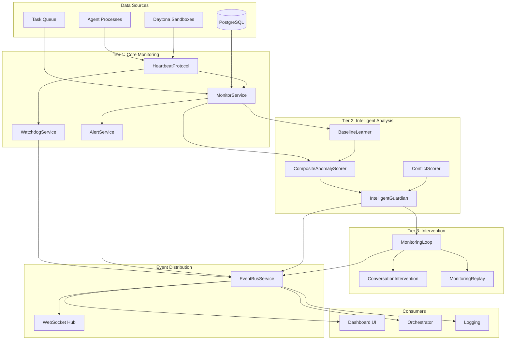
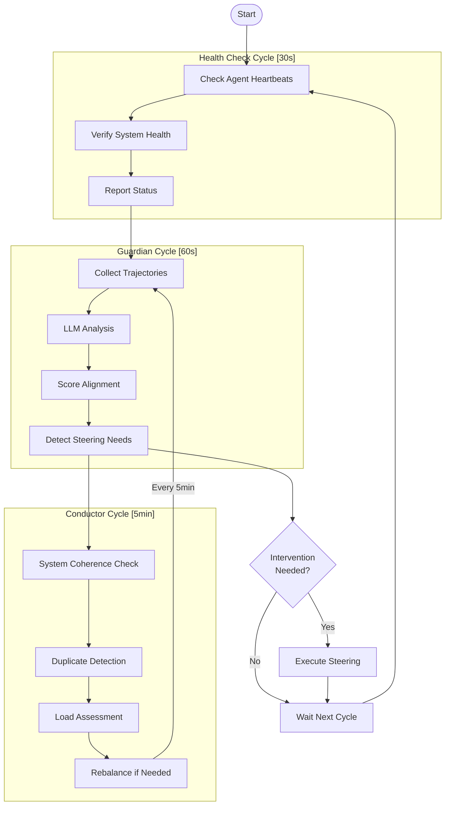
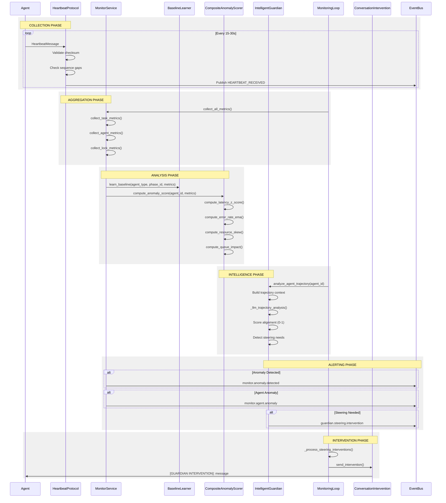

# Monitoring & Observability System Design Document

**Created:** 2026-04-22  
**Status:** Active  
**Purpose:** Comprehensive monitoring, observability, and intervention system for multi-agent orchestration with three-tier architecture  
**Related Docs:** [Guardian Monitoring](./guardian_monitoring.md), [Monitor Service](./monitor_service.md), [Orchestrator Service](./orchestrator_service.md)

---

## 1. Overview

The Monitoring & Observability System provides comprehensive oversight of the OmoiOS multi-agent orchestration platform. It implements a **three-tier monitoring architecture** that scales from basic health checking to intelligent analysis and proactive intervention.

### 1.1 Three-Tier Architecture

```
┌─────────────────────────────────────────────────────────────────────────────┐
│                           MONITORING HIERARCHY                              │
├─────────────────────────────────────────────────────────────────────────────┤
│                                                                             │
│  TIER 3: INTERVENTION & ANALYSIS                                            │
│  ┌─────────────────┐  ┌─────────────────┐  ┌─────────────────┐                 │
│  │ Conversation    │  │ MonitoringLoop  │  │ MonitoringReplay│                 │
│  │ Intervention    │  │                 │  │                 │                 │
│  └────────┬────────┘  └────────┬────────┘  └────────┬────────┘                 │
│           │                    │                    │                          │
│           ▼                    ▼                    ▼                          │
│  ┌─────────────────────────────────────────────────────────────────┐       │
│  │                    Real-time Agent Guidance                        │       │
│  └─────────────────────────────────────────────────────────────────┘       │
│                                                                             │
│  TIER 2: INTELLIGENT ANALYSIS                                               │
│  ┌─────────────────┐  ┌─────────────────┐  ┌─────────────────┐                 │
│  │ Intelligent     │  │ BaselineLearner │  │ CompositeAnomaly│                 │
│  │ Guardian        │  │                 │  │ Scorer          │                 │
│  └────────┬────────┘  └────────┬────────┘  └────────┬────────┘                 │
│           │                    │                    │                          │
│  ┌─────────────────┐  ┌─────────────────┐  ┌─────────────────┐                 │
│  │ ConflictScorer  │  │                 │  │                 │                 │
│  └────────┬────────┘  └─────────────────┘  └─────────────────┘                 │
│           │                                                                 │
│           ▼                                                                 │
│  ┌─────────────────────────────────────────────────────────────────┐       │
│  │                    ML-Based Anomaly Detection                    │       │
│  └─────────────────────────────────────────────────────────────────┘       │
│                                                                             │
│  TIER 1: CORE MONITORING                                                    │
│  ┌─────────────────┐  ┌─────────────────┐  ┌─────────────────┐                 │
│  │ Watchdog        │  │ MonitorService  │  │ Alerting        │                 │
│  │ Service         │  │                 │  │ Service         │                 │
│  └────────┬────────┘  └────────┬────────┘  └────────┬────────┘                 │
│           │                    │                    │                          │
│  ┌─────────────────┐  ┌─────────────────┐  ┌─────────────────┐                 │
│  │ Heartbeat       │  │                 │  │                 │                 │
│  │ Protocol        │  │                 │  │                 │                 │
│  └────────┬────────┘  └─────────────────┘  └─────────────────┘                 │
│           │                                                                 │
│           ▼                                                                 │
│  ┌─────────────────────────────────────────────────────────────────┐       │
│  │                    Health Metrics & Liveness                     │       │
│  └─────────────────────────────────────────────────────────────────┘       │
│                                                                             │
└─────────────────────────────────────────────────────────────────────────────┘
```

### 1.2 Design Principles

| Principle | Description |
|-----------|-------------|
| **Hierarchical Escalation** | Issues flow upward: Watchdog → Monitor → Guardian |
| **Progressive Intelligence** | Each tier adds sophistication: metrics → baselines → LLM analysis |
| **Non-Intrusive Monitoring** | Agents run unmodified; monitoring observes from outside |
| **Event-Driven Architecture** | All state changes publish events for real-time visibility |
| **Graceful Degradation** | System continues operating even if higher tiers fail |

---

## 2. Architecture Diagram

### 2.1 Data Flow Architecture



### 2.2 Monitoring Loop Cycle



---

## 3. Service Matrix

| Service | Tier | Responsibility | Key Methods |
|---------|------|----------------|-------------|
| **WatchdogService** | 1 - Core | Meta-monitoring of monitor agents with fast heartbeat detection (15s TTL) and automated remediation | `monitor_monitor_agents()`, `execute_remediation()`, `_execute_restart()`, `_execute_failover()`, `_escalate_to_guardian()` |
| **MonitorService** | 1 - Core | Health metrics collection, statistical anomaly detection, and agent status aggregation | `collect_all_metrics()`, `detect_anomalies()`, `compute_agent_anomaly_scores()`, `collect_task_metrics()`, `collect_agent_metrics()` |
| **AlertService** | 1 - Core | Alert generation, rule evaluation, and notification routing | `evaluate_rules()`, `route_alert()`, `acknowledge_alert()`, `resolve_alert()`, `get_active_alerts()` |
| **HeartbeatProtocolService** | 1 - Core | Bidirectional heartbeat protocol with sequence tracking, gap detection, and escalation ladder | `receive_heartbeat()`, `check_missed_heartbeats()`, `_apply_escalation()`, `_validate_checksum()`, `_detect_sequence_gaps()` |
| **IntelligentGuardian** | 2 - Analysis | LLM-powered trajectory analysis, alignment scoring, and steering intervention generation | `analyze_agent_trajectory()`, `detect_steering_interventions()`, `execute_steering_intervention()`, `_llm_trajectory_analysis()` |
| **BaselineLearner** | 2 - Analysis | Per-agent-type and phase baseline establishment using exponential moving average (EMA) | `learn_baseline()`, `get_baseline()`, `decay_baseline()` |
| **CompositeAnomalyScorer** | 2 - Analysis | Multi-signal anomaly scoring from latency, error rate, resource skew, and queue impact | `compute_anomaly_score()`, `compute_latency_z_score()`, `compute_error_rate_ema()`, `compute_resource_skew()`, `compute_queue_impact()` |
| **ConflictScorer** | 2 - Analysis | Least-conflicts-first merge ordering for optimal branch merging | `score_branch()`, `score_branches()`, `score_task_commits()`, `estimate_merge_complexity()` |
| **ConversationInterventionService** | 3 - Intervention | Real-time agent guidance via OpenHands conversation injection | `send_intervention()` |
| **MonitoringLoop** | 3 - Intervention | Orchestrates Guardian, Conductor, and health check cycles with unified monitoring interface | `start()`, `stop()`, `run_single_cycle()`, `analyze_agent_trajectory()`, `trigger_emergency_analysis()` |
| **MonitoringReplayService** | 3 - Intervention | Post-hoc analysis and debugging by replaying recorded agent sessions | `replay_guardian()`, `replay_conductor()`, `list_recordings()` |

---

## 4. Tier 1 - Core Monitoring

### 4.1 WatchdogService

The WatchdogService provides meta-monitoring for monitor agents themselves, ensuring the monitoring infrastructure remains healthy.

**Key Features:**
- **Fast heartbeat detection**: 15s TTL for monitor agents (vs 30s for idle workers)
- **Remediation policies**: YAML-configurable restart, failover, and escalation actions
- **Authority level**: WATCHDOG (2) - can remediate monitors, escalates to Guardian (4)

**Class Definition:**
```python
class WatchdogService:
    """Watchdog service for meta-monitoring of monitor agents per REQ-WATCHDOG-001."""
    
    WATCHDOG_HEARTBEAT_TTL = timedelta(seconds=15)
    WATCHDOG_CHECK_INTERVAL = timedelta(seconds=5)
    DETECTION_TIME_THRESHOLD = timedelta(seconds=20)
    ESCALATION_TIME_THRESHOLD = timedelta(seconds=5)
    
    def __init__(
        self,
        db: DatabaseService,
        agent_registry: AgentRegistryService,
        restart_orchestrator: RestartOrchestrator,
        guardian_service: Optional[GuardianService] = None,
        event_bus: Optional[EventBusService] = None,
        status_manager: Optional[AgentStatusManager] = None,
        policies_dir: Optional[Path] = None,
    )
```

**Remediation Actions:**
| Action | Description | Use Case |
|--------|-------------|----------|
| `restart` | Restart unresponsive monitor agent | 3+ consecutive missed heartbeats |
| `failover` | Transfer to backup monitor | Primary monitor failed/unresponsive |
| `escalate` | Escalate to Guardian | Remediation failed, need higher authority |

### 4.2 MonitorService

The MonitorService collects system metrics and detects anomalies using statistical analysis.

**Metrics Collection:**
```python
def collect_all_metrics(self, phase_id: Optional[str] = None) -> Dict[str, MetricSample]:
    """Collect all system metrics."""
    metrics = {}
    metrics.update(self.collect_task_metrics(phase_id))
    metrics.update(self.collect_agent_metrics())
    metrics.update(self.collect_lock_metrics())
    return metrics
```

**Anomaly Detection:**
- Rolling window statistics (100 samples)
- Standard deviation-based thresholds
- Severity classification: critical (3σ), error (2.5σ), warning (2σ), info

**Agent Anomaly Scoring (REQ-FT-AN-001):**
```python
def compute_agent_anomaly_scores(
    self,
    agent_ids: Optional[List[str]] = None,
    anomaly_threshold: float = 0.8,
    consecutive_threshold: int = 3,
) -> List[Dict[str, Any]]
```

### 4.3 AlertService

The AlertService provides rule-based alert generation and multi-channel routing.

**AlertRule Configuration:**
```python
class AlertRule:
    """Alert rule definition from YAML."""
    
    def __init__(self, rule_id: str, config: Dict[str, Any]):
        self.rule_id = rule_id
        self.name = config.get("name", rule_id)
        self.metric_name = config.get("metric", "")
        self.condition = config.get("condition", "")  # e.g., "value > 2"
        self.severity = config.get("severity", "warning")
        self.routing = config.get("routing", [])  # ["email", "slack", "webhook"]
        self.deduplication_window = self._parse_duration(
            config.get("deduplication_window", "300s")
        )
```

**Routing Adapters:**
- `EmailRouter` - SMTP/email service integration
- `SlackRouter` - Slack webhook notifications
- `WebhookRouter` - Generic HTTP webhook POST

### 4.4 HeartbeatProtocolService

The HeartbeatProtocolService implements an enhanced bidirectional heartbeat protocol.

**TTL Thresholds (REQ-FT-HB-002):**
| Agent Status | TTL | Rationale |
|--------------|-----|-----------|
| IDLE | 30s | Lower urgency for idle agents |
| RUNNING | 15s | Faster detection for active work |
| monitor | 15s | Critical infrastructure |
| watchdog | 15s | Critical infrastructure |
| guardian | 60s | Less frequent, more analysis |

**Escalation Ladder (REQ-FT-AR-001):**
| Missed Heartbeats | Action | Status Change |
|-------------------|--------|---------------|
| 1 | Warn, increase monitoring | - |
| 2 | Mark DEGRADED | `AgentStatus.DEGRADED` |
| 3+ | Mark FAILED, initiate restart | `AgentStatus.FAILED` |

**Message Integrity:**
- SHA256 checksums on heartbeat payloads
- Sequence number tracking with gap detection
- Bidirectional acknowledgments (HeartbeatAck)

---

## 5. Tier 2 - Intelligent Analysis

### 5.1 IntelligentGuardian

The IntelligentGuardian provides LLM-powered trajectory analysis and steering intervention.

**Class Definition:**
```python
class IntelligentGuardian:
    """Intelligent Guardian with trajectory analysis and LLM-powered understanding."""
    
    def __init__(
        self,
        db: DatabaseService,
        llm_service: Optional[LLMService] = None,
        event_bus: Optional[EventBusService] = None,
        workspace_root: Optional[str] = None,
        llm_analysis_enabled: bool = True,
    )
```

**Analysis Pipeline:**
1. **Trajectory Context Building** - Accumulates agent conversation history
2. **LLM Analysis** - Uses Jinja2 templates for structured prompts
3. **Alignment Scoring** - 0-1 scale with configurable thresholds
4. **Steering Detection** - Identifies when intervention is needed
5. **Intervention Generation** - Creates specific guidance messages

**Steering Types:**
| Type | Description | Trigger |
|------|-------------|---------|
| `restart` | Agent appears stuck, no events | No activity for extended period |
| `redirect` | Agent has events but no output | May be looping or off-track |
| `refocus` | Low alignment score | Agent drifting from goal |
| `guidance` | General course correction | Minor adjustments needed |

**Sandbox vs Legacy Routing:**
```python
def _is_sandbox_task(self, task: Task) -> bool:
    """Check if task is running in a Daytona sandbox."""
    return bool(task.sandbox_id)

async def _sandbox_intervention(self, intervention: SteeringIntervention, task: Task) -> bool:
    """Send intervention via HTTP API for sandbox agents."""
    
async def _legacy_intervention(self, intervention: SteeringIntervention, task: Task) -> bool:
    """Send intervention via OpenHands conversation for legacy agents."""
```

### 5.2 BaselineLearner

The BaselineLearner establishes normal behavior patterns for anomaly detection.

**EMA Learning:**
```python
class BaselineLearner:
    """Baseline learning service per REQ-FT-AN-002."""
    
    LEARNING_RATE = 0.1  # Alpha for EMA updates
    DECAY_FACTOR = 0.9   # Reduce baselines by 10% after resurrection
    
    def learn_baseline(
        self,
        agent_type: str,
        phase_id: Optional[str],
        metrics: Dict[str, float],
    ) -> AgentBaseline
```

**Tracked Metrics:**
- `latency_ms` - Task execution latency
- `latency_std` - Latency standard deviation
- `error_rate` - Failed task ratio
- `cpu_usage_percent` - CPU utilization
- `memory_usage_mb` - Memory consumption
- `additional_metrics` - Custom metric dictionary

### 5.3 CompositeAnomalyScorer

The CompositeAnomalyScorer calculates multi-factor anomaly scores.

**Weight Distribution (REQ-FT-AN-001):**
| Factor | Weight | Description |
|--------|--------|-------------|
| Latency z-score | 0.35 | Deviation from baseline latency |
| Error rate EMA | 0.30 | Exponential moving average of errors |
| Resource skew | 0.20 | CPU/memory deviation from baseline |
| Queue impact | 0.15 | Blocked dependent tasks |

**Scoring Formula:**
```python
composite = (
    LATENCY_WEIGHT * latency_normalized +
    ERROR_RATE_WEIGHT * error_rate_normalized +
    RESOURCE_SKEW_WEIGHT * resource_normalized +
    QUEUE_IMPACT_WEIGHT * queue_normalized
)
```

**Quarantine Threshold:**
- Default threshold: 0.8
- Consecutive readings required: 3
- Action: Mark agent for quarantine/restart

### 5.4 ConflictScorer

The ConflictScorer enables least-conflicts-first merge ordering.

**Data Classes:**
```python
@dataclass
class BranchScore:
    """Score for a single branch's merge potential."""
    branch: str
    task_id: Optional[str] = None
    conflict_count: int = 0
    conflict_files: List[str] = field(default_factory=list)
    score_error: Optional[str] = None

@dataclass
class ScoredMergeOrder:
    """Result of scoring and ordering branches for merge."""
    scores: Dict[str, BranchScore]
    merge_order: List[str]  # Least conflicts first
    total_conflicts: int
    clean_count: int
    failed_count: int
```

**Merge Strategy:**
1. Score all branches using `git merge-tree` dry-run
2. Sort by conflict count (ascending)
3. Merge clean branches first to build base incrementally
4. Minimize total conflicts requiring LLM resolution

---

## 6. Tier 3 - Intervention & Analysis

### 6.1 ConversationInterventionService

The ConversationInterventionService sends real-time guidance to active OpenHands conversations.

**Implementation:**
```python
class ConversationInterventionService:
    """Service for sending Guardian interventions to active OpenHands conversations."""
    
    def send_intervention(
        self,
        conversation_id: str,
        persistence_dir: str,
        workspace_dir: str,
        message: str,
        agent: Optional[Agent] = None,
    ) -> bool
```

**Features:**
- Resumes conversation with same ID and persistence
- Sends `[GUARDIAN INTERVENTION]: {message}` prefix
- Works even while agent is running (async processing)
- Triggers background processing if agent is idle

### 6.2 MonitoringLoop

The MonitoringLoop orchestrates all monitoring cycles and provides a unified interface.

**Configuration:**
```python
@dataclass
class MonitoringConfig:
    """Configuration for monitoring loop behavior."""
    
    guardian_interval_seconds: int = 60      # Analyze agents every minute
    conductor_interval_seconds: int = 300    # System coherence every 5 minutes
    health_check_interval_seconds: int = 30  # Health checks every 30 seconds
    auto_steering_enabled: bool = False      # Auto-execute interventions
    max_concurrent_analyses: int = 5         # Limit concurrent LLM calls
    llm_analysis_enabled: bool = True        # Enable LLM-based analysis
```

**Cycle Orchestration:**
```python
async def run_single_cycle(self) -> MonitoringCycle:
    """Run a single complete monitoring cycle."""
    
    # Step 1: Guardian trajectory analysis
    guardian_analyses = await self._run_guardian_analysis()
    
    # Step 2: Conductor system coherence analysis
    conductor_analysis = await self._run_conductor_analysis(cycle_id)
    
    # Step 3: Generate and execute steering interventions
    steering_interventions = await self._process_steering_interventions()
    
    # Step 4: Update system state
    await self._update_system_state(guardian_analyses, conductor_analysis)
```

**Dual Agent Support:**
- Legacy agents: Registered in `agents` table with heartbeats
- Sandbox agents: Tasks with `sandbox_id` in 'running' status
- Auto-routing based on task type

### 6.3 MonitoringReplayService

The MonitoringReplayService enables post-hoc analysis without live agents.

**Data Classes:**
```python
@dataclass
class AgentSessionSnapshot:
    """A recorded snapshot of agent state for monitoring replay."""
    
    agent_id: str
    task_id: str
    sandbox_id: str
    phase: str
    started_at: str
    events: list[dict] = field(default_factory=list)
    tool_calls: list[dict] = field(default_factory=list)
    current_output: str = ""
    status: str = "running"

@dataclass
class GuardianReplayResult:
    """Result of replaying a session through Guardian analysis."""
    
    session_file: str
    agent_id: str
    trajectory_score: float
    alignment_score: float
    would_intervene: bool
    intervention_type: Optional[str] = None
    intervention_recommendation: Optional[str] = None
```

**Usage:**
```python
replay_service = MonitoringReplayService(replay_dir=".monitoring-recordings")

# Replay single session
guardian_result = replay_service.replay_guardian("agent-123-task-456.json")

# Replay multiple sessions for Conductor analysis
conductor_result = replay_service.replay_conductor([
    "agent-1.json", "agent-2.json", "agent-3.json"
])
```

---

## 7. Data Flow

### 7.1 Collection → Analysis → Scoring → Alerting → Intervention



### 7.2 Event Flow

| Event | Publisher | Consumers | Purpose |
|-------|-----------|-----------|---------|
| `HEARTBEAT_RECEIVED` | HeartbeatProtocol | MonitorService, Watchdog | Agent liveness confirmation |
| `HEARTBEAT_MISSED` | HeartbeatProtocol | AlertService, Guardian | Missed heartbeat detection |
| `AGENT_STATUS_CHANGED` | HeartbeatProtocol | Dashboard, Orchestrator | Status transitions |
| `monitor.anomaly.detected` | MonitorService | AlertService, Dashboard | System metric anomaly |
| `monitor.agent.anomaly` | MonitorService | Guardian, Dashboard | Agent anomaly score high |
| `alert.triggered` | AlertService | Notification adapters | Alert notification |
| `guardian.steering.intervention` | IntelligentGuardian | ConversationIntervention | Steering guidance |
| `watchdog.remediation.started` | WatchdogService | Dashboard, Audit log | Remediation action |
| `watchdog.escalation` | WatchdogService | Guardian | Failed remediation |

---

## 8. Integration

### 8.1 EventBus Integration

All monitoring services publish events via the EventBusService for loose coupling:

```python
# Publishing pattern used across services
if self.event_bus:
    self.event_bus.publish(
        SystemEvent(
            event_type="monitor.anomaly.detected",
            entity_type="anomaly",
            entity_id=anomaly.id,
            payload={
                "metric_name": metric_name,
                "severity": severity,
                "deviation_percent": deviation_percent,
            },
        )
    )
```

### 8.2 Guardian Integration

The MonitoringLoop integrates with IntelligentGuardian for trajectory analysis:

```python
# In MonitoringLoop.__init__
self.guardian = IntelligentGuardian(
    db,
    workspace_root=self.config.workspace_root,
    event_bus=event_bus,
    llm_analysis_enabled=self.config.llm_analysis_enabled,
)
```

### 8.3 Database Integration

Services use DatabaseService for persistence:

```python
with self.db.get_session() as session:
    # Query operations
    agent = session.query(Agent).filter_by(id=agent_id).first()
    
    # Create records
    anomaly = MonitorAnomaly(...)
    session.add(anomaly)
    session.commit()
    session.refresh(anomaly)
    session.expunge(anomaly)  # Detach for use outside session
```

---

## 9. Configuration

### 9.1 Monitoring Intervals

| Component | Interval | Config Key |
|-----------|----------|------------|
| Health Check | 30s | `monitoring.health_check_interval_seconds` |
| Guardian Analysis | 60s | `monitoring.guardian_interval_seconds` |
| Conductor Analysis | 5min | `monitoring.conductor_interval_seconds` |
| Watchdog Check | 5s | `watchdog.check_interval_seconds` |
| Heartbeat (IDLE) | 30s | `heartbeat.ttl_idle_seconds` |
| Heartbeat (RUNNING) | 15s | `heartbeat.ttl_running_seconds` |

### 9.2 Thresholds

| Threshold | Default | Description |
|-----------|---------|-------------|
| Anomaly sensitivity | 2.0σ | Standard deviations for anomaly detection |
| Agent anomaly threshold | 0.8 | Score threshold for agent quarantine |
| Consecutive readings | 3 | Required consecutive anomalies before action |
| Alignment threshold | 0.7 | Minimum alignment score for healthy trajectory |
| Risk threshold | 0.7 | Maximum risk score before intervention |

### 9.3 Scoring Weights

| Factor | Weight | Config Key |
|--------|--------|------------|
| Latency | 0.35 | `anomaly_scorer.latency_weight` |
| Error rate | 0.30 | `anomaly_scorer.error_rate_weight` |
| Resource skew | 0.20 | `anomaly_scorer.resource_skew_weight` |
| Queue impact | 0.15 | `anomaly_scorer.queue_impact_weight` |

### 9.4 YAML Configuration

```yaml
# config/base.yaml
monitoring:
  intervals:
    guardian_seconds: 60
    conductor_seconds: 300
    health_check_seconds: 30
    
  thresholds:
    anomaly_sensitivity: 2.0
    agent_anomaly_threshold: 0.8
    consecutive_readings: 3
    alignment_high: 0.7
    risk_high: 0.7
    
  anomaly_scorer:
    latency_weight: 0.35
    error_rate_weight: 0.30
    resource_skew_weight: 0.20
    queue_impact_weight: 0.15
    
  heartbeat:
    ttl_idle_seconds: 30
    ttl_running_seconds: 15
    ttl_monitor_seconds: 15
    ttl_guardian_seconds: 60
    
  guardian:
    llm_analysis_enabled: true
    auto_steering_enabled: false
    max_concurrent_analyses: 5
    
  watchdog:
    check_interval_seconds: 5
    detection_threshold_seconds: 20
    escalation_threshold_seconds: 5
```

---

## 10. Error Handling

### 10.1 Monitoring Cascade Failures

| Failure Scenario | Detection | Response |
|------------------|-----------|----------|
| Heartbeat service down | Watchdog detects no heartbeats | Escalate to Guardian, alert operators |
| Database unavailable | Connection timeout | Return empty metrics, log error, retry |
| LLM service failure | Timeout or error response | Skip LLM analysis, use statistical only |
| Event bus failure | Publish timeout | Log warning, continue monitoring |
| Guardian analysis failure | Exception in cycle | Log error, continue with next cycle |

### 10.2 Alert Fatigue Prevention

| Mechanism | Implementation |
|-----------|----------------|
| Deduplication | 5-minute window per rule/metric combination |
| Escalation suppression | Max 10 interventions per hour per agent |
| Cooldown periods | 5-minute cooldown between same-type interventions |
| Severity filtering | Info/warning only logged, not alerted |
| Acknowledgment | Manual acknowledgment stops further alerts |

### 10.3 Error Handling Patterns

```python
# Database error handling
try:
    with self.db.get_session() as session:
        # Query operations
        pass
except Exception as e:
    logger.error("Database error in monitoring", error=str(e))
    return {}  # Return empty metrics, don't crash

# LLM error handling
try:
    analysis = await self.llm_service.structured_output(...)
except Exception as e:
    logger.warning(f"LLM analysis failed: {e}")
    return minimal_fallback_structure()  # Graceful degradation

# Event bus error handling
if self.event_bus:
    try:
        self.event_bus.publish(event)
    except Exception as e:
        logger.warning(f"Failed to publish event: {e}")
        # Continue without event - monitoring is more important than events
```

---

## 11. Related Documentation

| Document | Purpose | Relationship |
|----------|---------|--------------|
| [Guardian Monitoring](./guardian_monitoring.md) | Trajectory analysis and intervention | Tier 2-3 detailed design |
| [Monitor Service](./monitor_service.md) | Health metrics and anomaly detection | Tier 1 detailed design |
| [Orchestrator Service](./orchestrator_service.md) | Task execution and agent management | Primary consumer of monitoring |
| [Event Bus](./event_bus.md) | Event distribution system | Infrastructure dependency |
| [Agent Registry](./agent_registry.md) | Agent registration and lifecycle | Data source for monitoring |
| [Architecture: Readjustment System](../../architecture/04-readjustment-system.md) | System-wide monitoring architecture | High-level architecture |
| [Requirements: Monitoring](../../requirements/monitoring/monitoring_architecture.md) | Monitoring requirements | Requirements traceability |

---

*Document Version: 1.0*  
*Last Updated: 2026-04-22*  
*Maintainer: OmoiOS Core Team*
