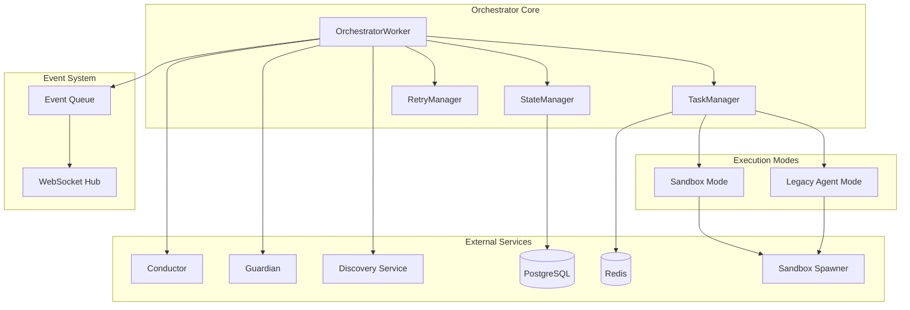
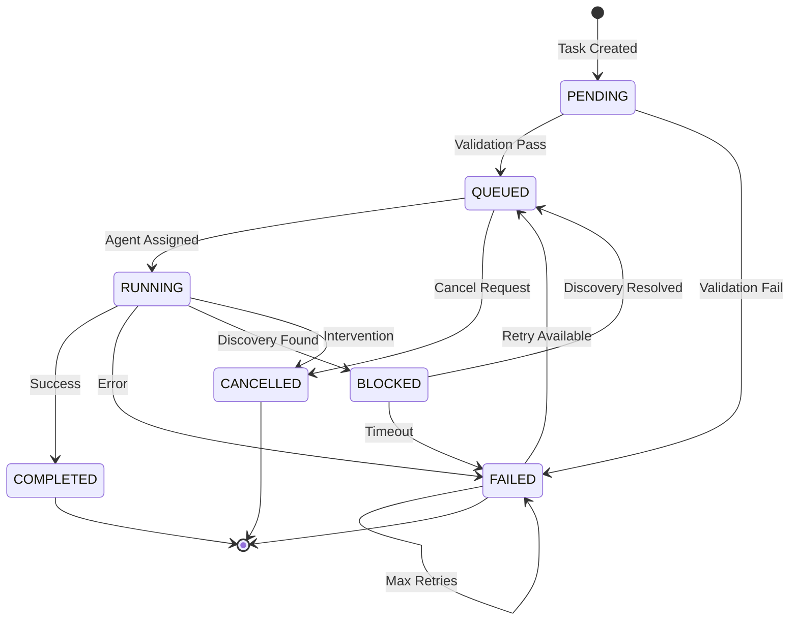
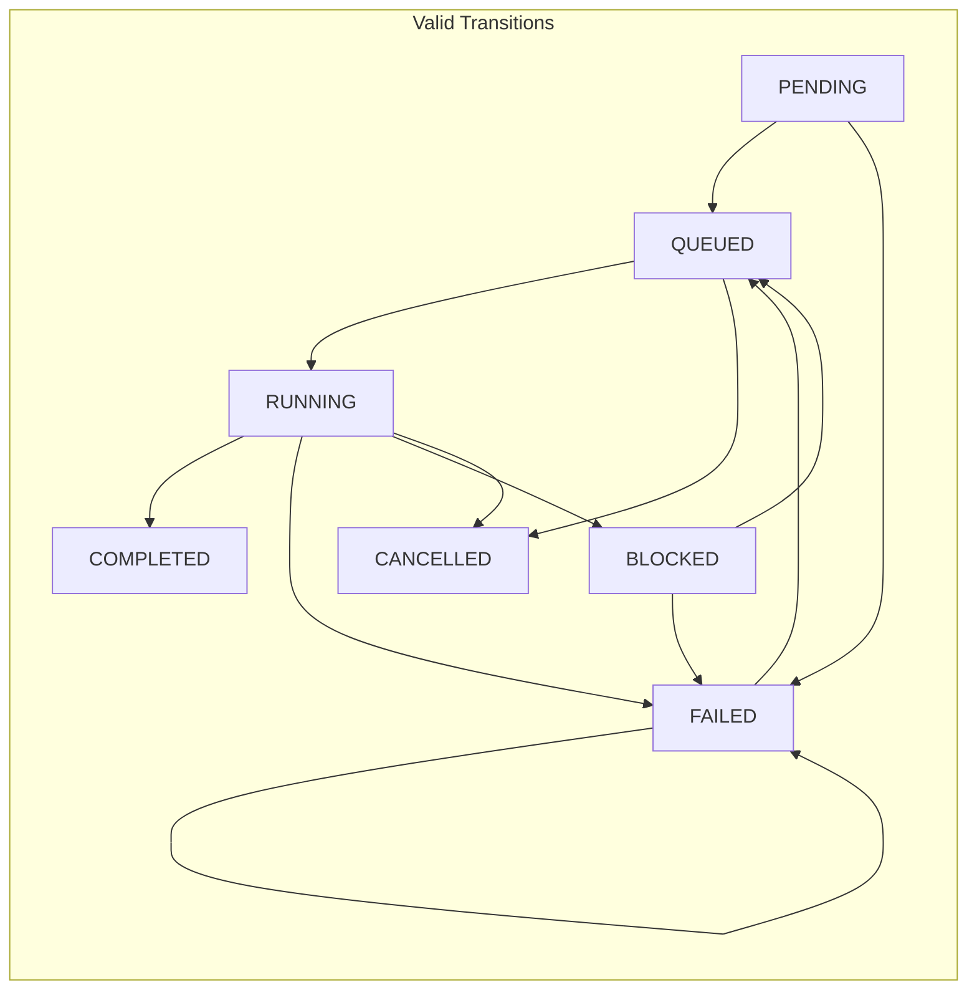
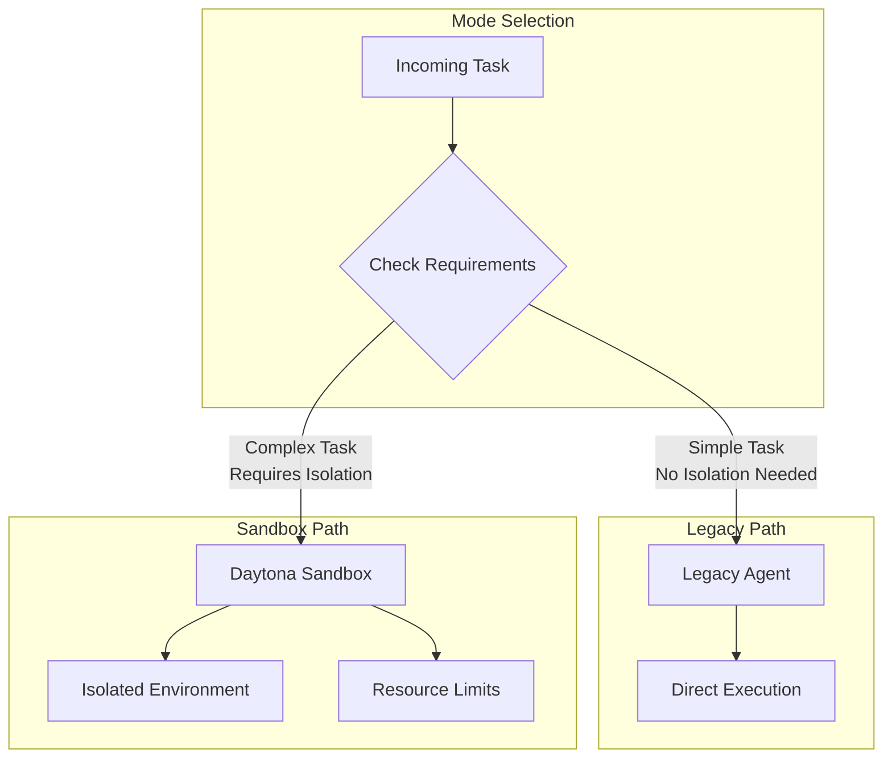
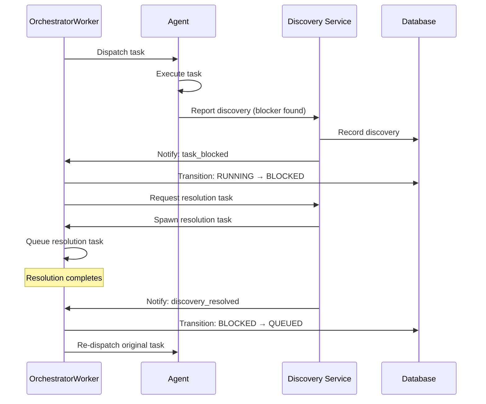
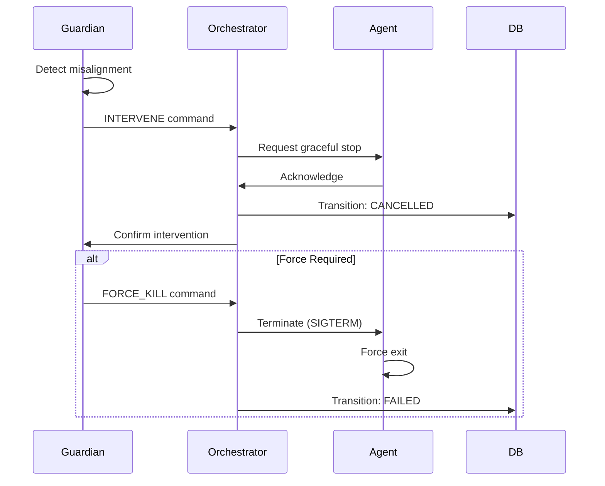
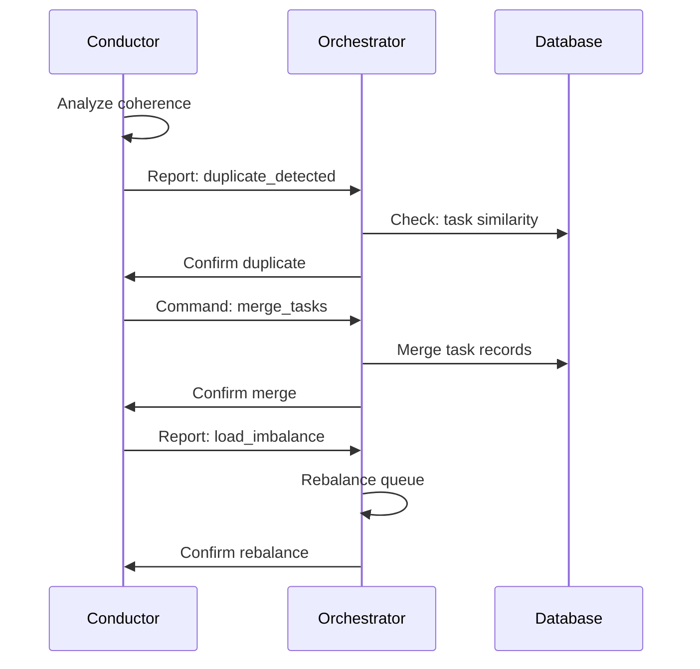

# Orchestrator Service Design Document

**Created:** 2026-04-22  
**Status:** Active  
**Purpose:** Core task dispatch and execution coordination system for OmoiOS multi-agent workflows  
**Related Docs:** [Guardian Monitoring](./guardian_monitoring.md), [Discovery Service](./discovery_service.md), [Sandbox Spawner](./sandbox_spawner.md), [Conductor Coherence](./conductor_coherence.md)

---

## 1. Architecture Overview

The Orchestrator Service is the central nervous system of OmoiOS, responsible for managing the complete lifecycle of tasks across the multi-agent execution environment. It coordinates between planning, execution, monitoring, and readjustment phases while maintaining seamless integration with both legacy agent execution and modern sandbox-based workflows.

### 1.1 High-Level Architecture



### 1.2 Task Lifecycle Flow



---

## 2. Component Responsibilities

| Component | Responsibility | Key Operations |
|-----------|---------------|----------------|
| **OrchestratorWorker** | Main execution loop, event coordination | `run()`, `process_task()`, `handle_event()` |
| **TaskManager** | Task lifecycle management, agent assignment | `create_task()`, `assign_agent()`, `transition_state()` |
| **StateManager** | Persistent state tracking, checkpointing | `save_state()`, `load_checkpoint()`, `cleanup_stale()` |
| **RetryManager** | Failure recovery, backoff strategies | `schedule_retry()`, `calculate_backoff()`, `exhaustion_check()` |
| **EventProcessor** | Event-driven task triggering | `process_event()`, `route_event()`, `emit_status()` |
| **PollingFallback** | Polling-based task discovery | `poll_pending()`, `detect_stalled()`, `force_trigger()` |

---

## 3. System Boundaries

### 3.1 Inside System Boundaries

- Task creation and validation
- Agent assignment and dispatch
- State machine enforcement
- Retry logic with exponential backoff
- Event-driven task triggering
- Polling fallback (5-second intervals)
- Stale task detection and cleanup (3-minute threshold)
- Idle sandbox monitoring (10-minute threshold)
- WebSocket status broadcasting
- Integration with Discovery, Guardian, and Conductor services

### 3.2 Outside System Boundaries

- Actual code execution (delegated to agents/sandboxes)
- LLM trajectory analysis (handled by Intelligent Guardian)
- Sandbox resource provisioning (handled by Daytona Spawner)
- Duplicate task detection (handled by Conductor)
- Database schema migrations (handled by Alembic)
- Authentication and authorization (handled by Auth middleware)

---

## 4. Component Details

### 4.1 OrchestratorWorker

The main worker class that runs the continuous execution loop. It operates in a hybrid mode supporting both event-driven and polling-based task discovery.

**Key Attributes:**
- `event_queue`: Async queue for event-driven processing
- `polling_interval`: 5 seconds (configurable)
- `stale_threshold`: 180 seconds (3 minutes)
- `idle_sandbox_threshold`: 600 seconds (10 minutes)

**Core Methods:**

```python
async def run(self) -> None:
    """
    Main execution loop. Runs indefinitely until shutdown signal.
    Hybrid approach: event-driven primary, polling fallback.
    """
    while self._running:
        try:
            # Event-driven path (primary)
            event = await asyncio.wait_for(
                self.event_queue.get(), 
                timeout=self.polling_interval
            )
            await self._process_event(event)
        except asyncio.TimeoutError:
            # Polling fallback path
            await self._poll_pending_tasks()
            await self._cleanup_stale_tasks()
            await self._monitor_idle_sandboxes()
```

### 4.2 Task State Machine

The orchestrator enforces a strict state machine for task lifecycle management:



**State Transition Rules:**
- `PENDING → QUEUED`: Task validation successful
- `PENDING → FAILED`: Validation failed or pre-checks failed
- `QUEUED → RUNNING`: Agent successfully assigned and started
- `QUEUED → CANCELLED`: External cancellation request
- `RUNNING → COMPLETED`: Agent reports success
- `RUNNING → FAILED`: Agent reports error or crashes
- `RUNNING → BLOCKED`: Discovery service identifies blocker
- `RUNNING → CANCELLED`: Guardian intervention or user request
- `BLOCKED → QUEUED`: Discovery resolved, task re-queued
- `BLOCKED → FAILED`: Blocker resolution timeout
- `FAILED → QUEUED`: Retry scheduled (if attempts remaining)
- `FAILED → FAILED`: Max retries exhausted

### 4.3 Dual Execution Modes

The orchestrator supports two execution modes:

#### 4.3.1 Legacy Agent Mode
- Direct agent execution via function calls
- Suitable for simple, short-running tasks
- No sandbox isolation
- Faster startup, lower overhead

#### 4.3.2 Sandbox Mode
- Daytona sandbox provisioning
- Full isolation and resource limits
- Git repository integration
- Spec skill enforcement
- Continuous mode support for long-running tasks



---

## 5. Data Models

### 5.1 Database Schema

```sql
-- Task execution tracking
CREATE TABLE task_executions (
    id UUID PRIMARY KEY DEFAULT gen_random_uuid(),
    task_id UUID NOT NULL REFERENCES tasks(id) ON DELETE CASCADE,
    agent_id UUID REFERENCES agents(id),
    sandbox_id VARCHAR(255),  -- Daytona sandbox identifier
    
    -- Execution state
    status VARCHAR(50) NOT NULL DEFAULT 'pending',
    started_at TIMESTAMP WITH TIME ZONE,
    completed_at TIMESTAMP WITH TIME ZONE,
    
    -- Retry tracking
    attempt_number INTEGER NOT NULL DEFAULT 1,
    max_attempts INTEGER NOT NULL DEFAULT 3,
    
    -- Error tracking
    error_message TEXT,
    error_type VARCHAR(100),
    stack_trace TEXT,
    
    -- Resource usage (sandbox mode)
    cpu_seconds DECIMAL(10,2),
    memory_peak_mb INTEGER,
    disk_usage_mb INTEGER,
    
    -- Metadata
    execution_mode VARCHAR(20) NOT NULL,  -- 'legacy' or 'sandbox'
    change_metadata JSONB,  -- Reserved word workaround
    created_at TIMESTAMP WITH TIME ZONE DEFAULT NOW(),
    updated_at TIMESTAMP WITH TIME ZONE DEFAULT NOW()
);

-- Task state transitions (audit log)
CREATE TABLE task_state_transitions (
    id UUID PRIMARY KEY DEFAULT gen_random_uuid(),
    task_id UUID NOT NULL REFERENCES tasks(id) ON DELETE CASCADE,
    from_state VARCHAR(50) NOT NULL,
    to_state VARCHAR(50) NOT NULL,
    triggered_by VARCHAR(100),  -- agent, user, system, guardian
    reason TEXT,
    created_at TIMESTAMP WITH TIME ZONE DEFAULT NOW()
);

-- Stale task detection index
CREATE INDEX idx_task_executions_stale 
ON task_executions(status, started_at) 
WHERE status = 'running';

-- Sandbox idle monitoring index
CREATE INDEX idx_task_executions_sandbox_idle 
ON task_executions(sandbox_id, status, completed_at) 
WHERE execution_mode = 'sandbox' AND status = 'completed';
```

### 5.2 Pydantic Models

```python
from pydantic import BaseModel, Field
from datetime import datetime
from typing import Optional, Literal
from enum import Enum

class ExecutionMode(str, Enum):
    LEGACY = "legacy"
    SANDBOX = "sandbox"

class TaskStatus(str, Enum):
    PENDING = "pending"
    QUEUED = "queued"
    RUNNING = "running"
    COMPLETED = "completed"
    FAILED = "failed"
    BLOCKED = "blocked"
    CANCELLED = "cancelled"

class TaskExecution(BaseModel):
    """Represents a single task execution attempt."""
    id: str = Field(..., description="Unique execution identifier")
    task_id: str = Field(..., description="Parent task reference")
    agent_id: Optional[str] = Field(None, description="Assigned agent")
    sandbox_id: Optional[str] = Field(None, description="Daytona sandbox ID")
    
    status: TaskStatus = Field(default=TaskStatus.PENDING)
    started_at: Optional[datetime] = None
    completed_at: Optional[datetime] = None
    
    attempt_number: int = Field(default=1, ge=1)
    max_attempts: int = Field(default=3, ge=1)
    
    error_message: Optional[str] = None
    error_type: Optional[str] = None
    stack_trace: Optional[str] = None
    
    cpu_seconds: Optional[float] = None
    memory_peak_mb: Optional[int] = None
    disk_usage_mb: Optional[int] = None
    
    execution_mode: ExecutionMode
    change_metadata: Optional[dict] = Field(None, alias="metadata")
    
    created_at: datetime = Field(default_factory=utc_now)
    updated_at: datetime = Field(default_factory=utc_now)

class StateTransition(BaseModel):
    """Audit record for task state changes."""
    id: str
    task_id: str
    from_state: TaskStatus
    to_state: TaskStatus
    triggered_by: Literal["agent", "user", "system", "guardian", "conductor"]
    reason: Optional[str] = None
    created_at: datetime = Field(default_factory=utc_now)

class RetryPolicy(BaseModel):
    """Configuration for retry behavior."""
    max_attempts: int = Field(default=3, ge=1, le=10)
    backoff_strategy: Literal["fixed", "linear", "exponential"] = "exponential"
    base_delay_seconds: float = Field(default=5.0, ge=0)
    max_delay_seconds: float = Field(default=300.0, ge=0)
    retryable_errors: list[str] = Field(default_factory=list)
```

---

## 6. API Specifications

### 6.1 REST Endpoints

| Endpoint | Method | Description | Request Body | Response |
|----------|--------|-------------|--------------|----------|
| `/api/v1/orchestrator/tasks` | POST | Create new task | `TaskCreateRequest` | `TaskResponse` |
| `/api/v1/orchestrator/tasks/{id}` | GET | Get task status | - | `TaskResponse` |
| `/api/v1/orchestrator/tasks/{id}/cancel` | POST | Cancel running task | `CancelRequest` | `TaskResponse` |
| `/api/v1/orchestrator/tasks/{id}/retry` | POST | Force retry failed task | - | `TaskResponse` |
| `/api/v1/orchestrator/executions` | GET | List task executions | Query params | `ExecutionListResponse` |
| `/api/v1/orchestrator/health` | GET | Orchestrator health check | - | `HealthResponse` |
| `/api/v1/orchestrator/stats` | GET | Execution statistics | - | `StatsResponse` |

### 6.2 Request/Response Schemas

```python
class TaskCreateRequest(BaseModel):
    """Request to create a new task."""
    spec_id: str = Field(..., description="Specification to execute")
    phase: str = Field(..., description="Target phase (explore, requirements, etc.)")
    priority: int = Field(default=5, ge=1, le=10)
    execution_mode: ExecutionMode = ExecutionMode.SANDBOX
    parent_task_id: Optional[str] = None  # For subtasks
    discovery_context: Optional[dict] = None  # For discovery-spawned tasks

class TaskResponse(BaseModel):
    """Task creation/update response."""
    id: str
    status: TaskStatus
    execution_id: Optional[str] = None
    agent_id: Optional[str] = None
    sandbox_id: Optional[str] = None
    queue_position: Optional[int] = None
    estimated_start: Optional[datetime] = None
    message: Optional[str] = None

class CancelRequest(BaseModel):
    """Task cancellation request."""
    reason: str = Field(..., min_length=1)
    force: bool = Field(default=False)  # Force kill vs graceful shutdown
    requested_by: str = Field(..., description="User or system identifier")
```

---

## 7. WebSocket Events

The orchestrator emits real-time events via WebSocket for UI updates and external integrations.

### 7.1 Event Types

| Event | Direction | Payload | Description |
|-------|-----------|---------|-------------|
| `task.created` | Server → Client | `TaskResponse` | New task queued |
| `task.assigned` | Server → Client | `TaskResponse` | Agent assigned |
| `task.started` | Server → Client | `TaskResponse` | Execution began |
| `task.progress` | Server → Client | `ProgressUpdate` | Progress percentage |
| `task.completed` | Server → Client | `TaskResponse` | Successful completion |
| `task.failed` | Server → Client | `TaskResponse` + error | Execution failed |
| `task.blocked` | Server → Client | `TaskResponse` + blocker | Discovery found blocker |
| `task.cancelled` | Server → Client | `TaskResponse` + reason | Task cancelled |
| `task.retrying` | Server → Client | `TaskResponse` | Retry scheduled |
| `orchestrator.health` | Server → Client | `HealthStatus` | System health update |

### 7.2 Event Payloads

```python
class ProgressUpdate(BaseModel):
    """Real-time task progress notification."""
    task_id: str
    execution_id: str
    progress_percent: float = Field(..., ge=0, le=100)
    current_step: str
    total_steps: int
    step_number: int
    message: Optional[str] = None
    timestamp: datetime = Field(default_factory=utc_now)

class HealthStatus(BaseModel):
    """Orchestrator health status."""
    status: Literal["healthy", "degraded", "unhealthy"]
    active_tasks: int
    queued_tasks: int
    idle_sandboxes: int
    stale_tasks: int
    last_poll_at: datetime
    event_queue_depth: int
```

---

## 8. Implementation Details

### 8.1 Hybrid Event + Polling Architecture

The orchestrator uses a hybrid approach to ensure no tasks are missed while maintaining responsiveness:

```python
class HybridTaskProcessor:
    """
    Combines event-driven efficiency with polling reliability.
    
    Event-driven path:
    - Immediate response to new tasks
    - Lower latency for high-priority work
    - Reduced database polling load
    
    Polling fallback path:
    - Catches tasks missed by events (race conditions, restarts)
    - Stale task detection
    - Idle resource cleanup
    """
    
    async def run_hybrid_loop(self):
        while self.running:
            # Try event-driven first (with timeout)
            try:
                event = await asyncio.wait_for(
                    self.event_queue.get(),
                    timeout=self.polling_interval
                )
                await self._handle_event(event)
            except asyncio.TimeoutError:
                # No events - run maintenance cycle
                await self._maintenance_cycle()
    
    async def _maintenance_cycle(self):
        """Periodic maintenance tasks."""
        await asyncio.gather(
            self._poll_pending_tasks(),
            self._cleanup_stale_tasks(),
            self._monitor_idle_sandboxes(),
            self._emit_health_status()
        )
```

### 8.2 Stale Task Detection

Tasks that appear stuck are automatically detected and recovered:

```python
async def _cleanup_stale_tasks(self) -> None:
    """
    Detect and recover tasks stuck in running state.
    
    A task is considered stale if:
    - Status is 'running'
    - started_at is older than stale_threshold (180s)
    - No heartbeat received in threshold period
    """
    stale_cutoff = utc_now() - timedelta(seconds=self.stale_threshold)
    
    stale_tasks = await self.db.execute(
        select(TaskExecution)
        .where(TaskExecution.status == TaskStatus.RUNNING)
        .where(TaskExecution.started_at < stale_cutoff)
    )
    
    for task in stale_tasks:
        # Attempt graceful recovery first
        if await self._attempt_recovery(task):
            continue
            
        # Mark as failed, trigger retry if available
        await self._transition_state(
            task, 
            TaskStatus.FAILED,
            reason=f"Stale task detected (no heartbeat for {self.stale_threshold}s)"
        )
```

### 8.3 Idle Sandbox Monitoring

Completed sandboxes are monitored and cleaned up to prevent resource leaks:

```python
async def _monitor_idle_sandboxes(self) -> None:
    """
    Track sandboxes that have completed but not been cleaned up.
    
    Idle threshold: 600 seconds (10 minutes)
    Action: Notify spawner to destroy sandbox
    """
    idle_cutoff = utc_now() - timedelta(seconds=self.idle_sandbox_threshold)
    
    idle_sandboxes = await self.db.execute(
        select(TaskExecution.sandbox_id)
        .where(TaskExecution.execution_mode == ExecutionMode.SANDBOX)
        .where(TaskExecution.status.in_([TaskStatus.COMPLETED, TaskStatus.FAILED]))
        .where(TaskExecution.completed_at < idle_cutoff)
        .where(TaskExecution.sandbox_id.isnot(None))
        .distinct()
    )
    
    for sandbox_id in idle_sandboxes:
        await self.sandbox_spawner.destroy_sandbox(sandbox_id)
        logger.info(f"Cleaned up idle sandbox: {sandbox_id}")
```

---

## 9. Integration Points

### 9.1 Discovery Service Integration

The orchestrator integrates with the Discovery Service for adaptive workflow branching:



### 9.2 Guardian Integration

Emergency intervention capabilities:



### 9.3 Conductor Integration

System coherence and duplicate detection:



---

## 10. Configuration Parameters

### 10.1 YAML Configuration

```yaml
# config/base.yaml
orchestrator:
  # Execution loop settings
  polling_interval_seconds: 5
  max_concurrent_tasks: 50
  
  # Stale task detection
  stale_task_threshold_seconds: 180
  stale_check_interval_seconds: 60
  
  # Idle sandbox cleanup
  idle_sandbox_threshold_seconds: 600
  sandbox_cleanup_interval_seconds: 300
  
  # Retry configuration
  retry:
    max_attempts: 3
    backoff_strategy: "exponential"  # fixed, linear, exponential
    base_delay_seconds: 5
    max_delay_seconds: 300
    retryable_errors:
      - "ConnectionError"
      - "TimeoutError"
      - "ResourceExhausted"
  
  # Event queue settings
  event_queue:
    max_size: 1000
    timeout_seconds: 5
    
  # Health reporting
  health_check_interval_seconds: 30
  
  # WebSocket settings
  websocket:
    heartbeat_interval_seconds: 30
    connection_timeout_seconds: 60
```

### 10.2 Environment Variables

| Variable | Default | Description |
|----------|---------|-------------|
| `ORCHESTRATOR_POLLING_INTERVAL` | 5 | Polling fallback interval (seconds) |
| `ORCHESTRATOR_STALE_THRESHOLD` | 180 | Stale task detection threshold (seconds) |
| `ORCHESTRATOR_IDLE_SANDBOX_THRESHOLD` | 600 | Idle sandbox cleanup threshold (seconds) |
| `ORCHESTRATOR_MAX_CONCURRENT` | 50 | Maximum concurrent task executions |
| `ORCHESTRATOR_RETRY_MAX_ATTEMPTS` | 3 | Default max retry attempts |

---

## 11. Performance Characteristics

| Metric | Target | Notes |
|--------|--------|-------|
| Task dispatch latency | < 100ms | From QUEUED to RUNNING |
| Event processing rate | > 1000/sec | Event-driven path |
| Polling overhead | < 5% CPU | At 5-second intervals |
| Stale detection latency | < 60s | From stall to detection |
| Sandbox cleanup latency | < 10min | From completion to destruction |
| State transition atomicity | 100% | All transitions ACID compliant |

---

## 12. Error Handling

### 12.1 Error Categories

| Category | Examples | Handling Strategy |
|----------|----------|-------------------|
| **Transient** | Network timeout, rate limit | Automatic retry with backoff |
| **Agent Failure** | Crash, OOM, syntax error | Retry with new agent instance |
| **Validation** | Invalid spec, missing data | Immediate fail, no retry |
| **Resource** | Disk full, memory exhausted | Retry with larger resources |
| **Intervention** | Guardian cancel, user stop | Immediate stop, no retry |
| **Discovery** | Blocker found, needs research | Transition to BLOCKED state |

### 12.2 Retry Exponential Backoff

```python
def calculate_backoff(attempt: int, base: float = 5.0, max_delay: float = 300.0) -> float:
    """
    Calculate delay with exponential backoff and jitter.
    
    Formula: min(base * 2^attempt + jitter, max_delay)
    """
    import random
    
    exponential = base * (2 ** (attempt - 1))
    jitter = random.uniform(0, exponential * 0.1)  # 10% jitter
    
    return min(exponential + jitter, max_delay)
```

---

## 13. Monitoring & Observability

### 13.1 Key Metrics

| Metric | Type | Description |
|--------|------|-------------|
| `orchestrator.tasks.created` | Counter | Total tasks created |
| `orchestrator.tasks.completed` | Counter | Successful completions |
| `orchestrator.tasks.failed` | Counter | Failed executions |
| `orchestrator.tasks.retried` | Counter | Retry attempts |
| `orchestrator.tasks.stale` | Counter | Stale tasks detected |
| `orchestrator.queue.depth` | Gauge | Current queue size |
| `orchestrator.execution.duration` | Histogram | Task execution time |
| `orchestrator.state.transitions` | Counter | State change counts |
| `orchestrator.sandboxes.active` | Gauge | Active sandboxes |
| `orchestrator.sandboxes.idle` | Gauge | Idle sandboxes pending cleanup |

### 13.2 Logging Levels

| Level | Events |
|-------|--------|
| **DEBUG** | State transitions, heartbeat checks, polling cycles |
| **INFO** | Task created, assigned, completed, retry scheduled |
| **WARNING** | Stale task detected, retry exhaustion, slow execution |
| **ERROR** | State transition failures, sandbox spawn failures |
| **CRITICAL** | Database connection loss, unrecoverable errors |

---

## 14. Security Considerations

1. **Sandbox Isolation**: All untrusted code runs in Daytona sandboxes with resource limits
2. **State Validation**: All state transitions validated against allowed transitions matrix
3. **Audit Logging**: Every state change recorded with timestamp, actor, and reason
4. **Resource Limits**: CPU, memory, and disk limits enforced at sandbox level
5. **Timeout Enforcement**: Hard timeouts prevent infinite loops or runaway tasks
6. **Secret Isolation**: No secrets passed to sandbox environments

---

## 15. Future Enhancements

1. **Priority Preemption**: Higher priority tasks can preempt lower priority ones
2. **Batch Processing**: Group similar tasks for efficient bulk execution
3. **Predictive Scaling**: Pre-warm sandboxes based on queue depth predictions
4. **Multi-Region**: Support for geographically distributed task execution
5. **Workflow DAG**: Support for complex task dependency graphs

---

*Document Version: 1.0*  
*Last Updated: 2026-04-22*  
*Maintainer: OmoiOS Core Team*
