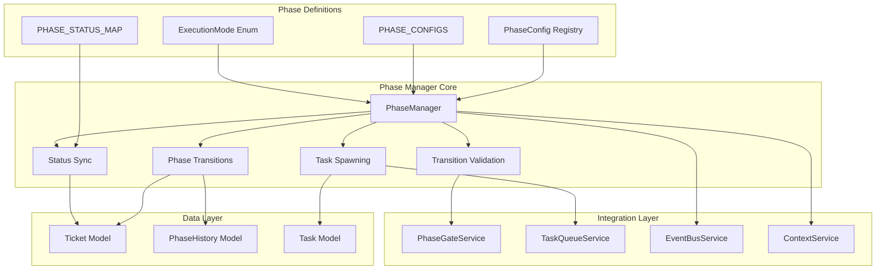
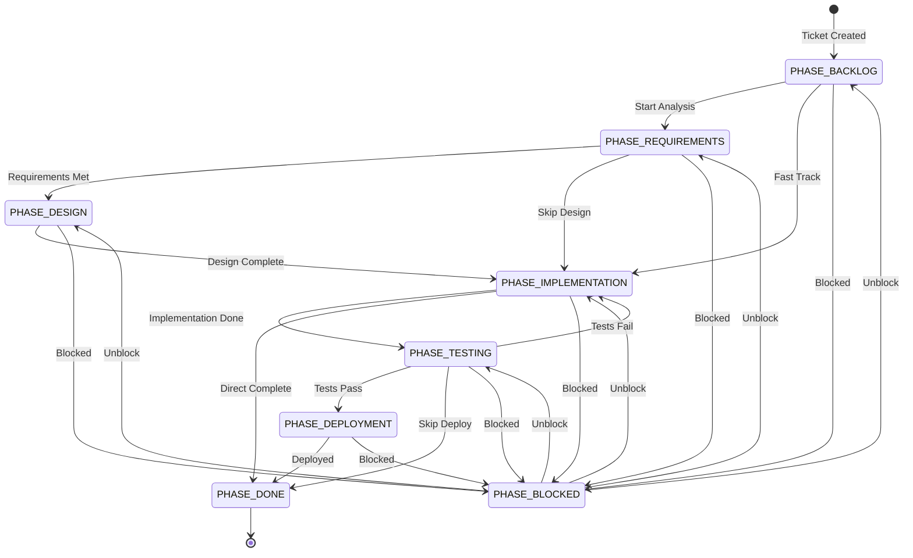
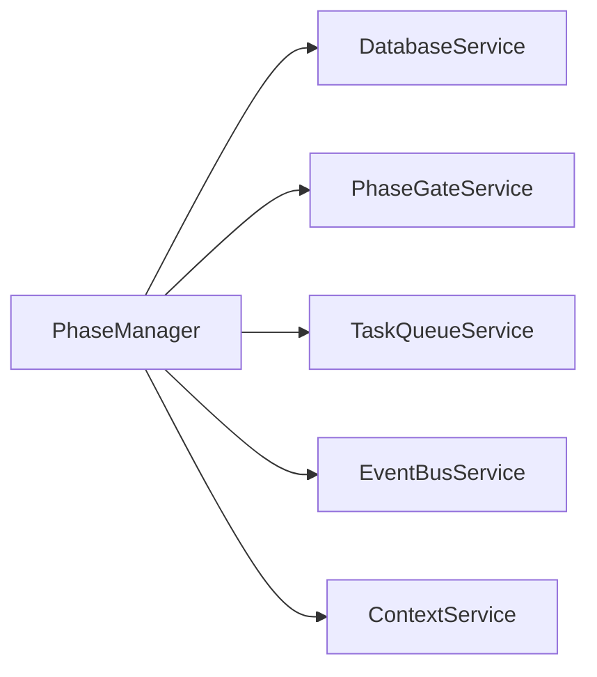

# Phase Manager Service Design Document

**Created:** 2026-04-22  
**Status:** Active  
**Purpose:** Unified phase management for orchestrating ticket phase transitions with validation, gate orchestration, and automatic progression  
**Related Docs:** [Orchestrator Service](./orchestrator_service.md), [Ticket Workflow](./ticket_workflow.md), [Spec Task Execution](./spec_task_execution.md)

---

## 1. Architecture Overview

The PhaseManager provides a centralized, authoritative source for all phase-related operations. It consolidates functionality from PhaseProgressionService, PhaseGateService, and TicketWorkflowOrchestrator to provide clear, documented rules for phase transitions.

### 1.1 High-Level Architecture



### 1.2 Phase Transition Flow



---

## 2. Component Responsibilities

| Component | Responsibility | Key Operations |
|-----------|---------------|----------------|
| **PhaseManager** | Main service orchestrating phase transitions | `transition_to_phase()`, `check_and_advance()`, `fast_track_to_implementation()` |
| **Transition Validator** | Validates phase transitions against allowed paths | `can_transition()`, `validate_transition_path()` |
| **Phase Gate Checker** | Validates gate criteria before phase exit | Integrates with PhaseGateService |
| **Task Spawner** | Spawns initial tasks for new phases | `_spawn_phase_tasks()` |
| **Status Synchronizer** | Syncs ticket status with phase | `sync_status_with_phase()`, `sync_phase_with_status()` |
| **Event Handler** | Handles task events for automatic progression | `_handle_task_started()`, `_handle_task_completed()` |
| **Callback Registry** | Manages pre/post transition callbacks | `register_pre_transition_callback()`, `register_post_transition_callback()` |

---

## 3. System Boundaries

### 3.1 Inside System Boundaries

- Phase configuration management (8 phases: BACKLOG, REQUIREMENTS, DESIGN, IMPLEMENTATION, TESTING, DEPLOYMENT, DONE, BLOCKED)
- Transition validation with gate criteria checking
- Automatic status synchronization
- Task spawning for new phases with context propagation
- Pre/post transition callback execution
- Event subscription for automatic phase advancement
- Fast-track to implementation (skipping requirements/design)
- Blocked state management with unblock transitions

### 3.2 Outside System Boundaries

- Phase gate evaluation details (handled by PhaseGateService)
- Task queue management (handled by TaskQueueService)
- Event bus implementation (handled by EventBusService)
- Context aggregation details (handled by ContextService)
- Ticket CRUD operations (handled by Ticket model/repository)

---

## 4. Data Models

### 4.1 Database Schema

```sql
-- Phase configuration is code-defined, not database tables
-- But phase history is persisted:

CREATE TABLE phase_histories (
    id UUID PRIMARY KEY DEFAULT gen_random_uuid(),
    ticket_id UUID NOT NULL REFERENCES tickets(id) ON DELETE CASCADE,
    from_phase VARCHAR(50) NOT NULL,
    to_phase VARCHAR(50) NOT NULL,
    transition_reason TEXT,
    transitioned_by VARCHAR(255),
    artifacts JSONB,
    created_at TIMESTAMP WITH TIME ZONE DEFAULT NOW()
);

-- Tickets reference current phase
CREATE TABLE tickets (
    id UUID PRIMARY KEY DEFAULT gen_random_uuid(),
    title VARCHAR(255) NOT NULL,
    description TEXT,
    phase_id VARCHAR(50) NOT NULL DEFAULT 'PHASE_BACKLOG',
    previous_phase_id VARCHAR(50),
    status VARCHAR(50) NOT NULL,
    is_blocked BOOLEAN DEFAULT FALSE,
    blocked_reason VARCHAR(255),
    blocked_at TIMESTAMP WITH TIME ZONE,
    context JSONB,  -- Stores phase context
    -- ... other fields
);

-- Tasks are spawned per phase
CREATE TABLE tasks (
    id UUID PRIMARY KEY DEFAULT gen_random_uuid(),
    ticket_id UUID NOT NULL REFERENCES tickets(id),
    phase_id VARCHAR(50) NOT NULL,
    task_type VARCHAR(50) NOT NULL,
    -- ... other fields
);
```

### 4.2 Pydantic Models

```python
from pydantic import BaseModel, Field
from dataclasses import dataclass, field
from typing import Optional, List, Dict, Tuple, Callable
from enum import StrEnum

class ExecutionMode(StrEnum):
    """Execution modes that determine how tasks run."""
    EXPLORATION = "exploration"  # Stops early, doesn't push code
    IMPLEMENTATION = "implementation"  # Runs to completion, pushes code
    VALIDATION = "validation"  # Runs tests, validates functionality

@dataclass
class PhaseGateCriteria:
    """Criteria that must be met to exit a phase."""
    required_artifacts: List[str] = field(default_factory=list)
    all_tasks_completed: bool = True
    min_test_coverage: Optional[float] = None
    custom_validators: List[str] = field(default_factory=list)

@dataclass
class PhaseConfig:
    """Configuration for a single phase."""
    id: str
    name: str
    description: str
    sequence_order: int
    allowed_transitions: Tuple[str, ...]
    mapped_status: str
    execution_mode: ExecutionMode
    default_task_types: List[str] = field(default_factory=list)
    gate_criteria: Optional[PhaseGateCriteria] = None
    is_terminal: bool = False
    continuous_mode: bool = False
    skippable: bool = False

@dataclass
class TransitionResult:
    """Result of a phase transition attempt."""
    success: bool
    from_phase: str
    to_phase: Optional[str] = None
    from_status: Optional[str] = None
    to_status: Optional[str] = None
    reason: Optional[str] = None
    blocking_reasons: List[str] = field(default_factory=list)
    artifacts_collected: int = 0
    tasks_spawned: int = 0

# Phase configuration registry (code-defined)
PHASE_CONFIGS: Dict[str, PhaseConfig] = {
    "PHASE_BACKLOG": PhaseConfig(
        id="PHASE_BACKLOG",
        name="Backlog",
        description="Ticket is queued but not yet being worked on",
        sequence_order=0,
        allowed_transitions=("PHASE_REQUIREMENTS", "PHASE_IMPLEMENTATION"),
        mapped_status="backlog",
        execution_mode=ExecutionMode.EXPLORATION,
        skippable=True,
    ),
    "PHASE_REQUIREMENTS": PhaseConfig(
        id="PHASE_REQUIREMENTS",
        name="Requirements",
        description="Analyzing and documenting requirements",
        sequence_order=1,
        allowed_transitions=("PHASE_DESIGN", "PHASE_IMPLEMENTATION"),
        mapped_status="analyzing",
        execution_mode=ExecutionMode.EXPLORATION,
        default_task_types=["analyze_requirements", "generate_prd"],
        gate_criteria=PhaseGateCriteria(
            required_artifacts=["requirements_document"],
            all_tasks_completed=True,
        ),
        skippable=True,
    ),
    "PHASE_DESIGN": PhaseConfig(
        id="PHASE_DESIGN",
        name="Design",
        description="Creating technical design and architecture",
        sequence_order=2,
        allowed_transitions=("PHASE_IMPLEMENTATION",),
        mapped_status="analyzing",
        execution_mode=ExecutionMode.EXPLORATION,
        default_task_types=["create_design"],
        gate_criteria=PhaseGateCriteria(
            required_artifacts=["design_document"],
            all_tasks_completed=True,
        ),
        skippable=True,
    ),
    "PHASE_IMPLEMENTATION": PhaseConfig(
        id="PHASE_IMPLEMENTATION",
        name="Implementation",
        description="Building the feature or fix",
        sequence_order=3,
        allowed_transitions=("PHASE_TESTING", "PHASE_DONE"),
        mapped_status="building",
        execution_mode=ExecutionMode.IMPLEMENTATION,
        default_task_types=["implement_feature"],
        gate_criteria=PhaseGateCriteria(
            required_artifacts=["code_changes"],
            all_tasks_completed=True,
            min_test_coverage=80.0,
        ),
        continuous_mode=True,
        skippable=False,
    ),
    "PHASE_TESTING": PhaseConfig(
        id="PHASE_TESTING",
        name="Testing",
        description="Validating the implementation",
        sequence_order=4,
        allowed_transitions=("PHASE_DEPLOYMENT", "PHASE_IMPLEMENTATION", "PHASE_DONE"),
        mapped_status="testing",
        execution_mode=ExecutionMode.VALIDATION,
        default_task_types=["run_tests", "write_tests"],
        gate_criteria=PhaseGateCriteria(
            required_artifacts=["test_results"],
            all_tasks_completed=True,
            custom_validators=["all_tests_passing"],
        ),
        continuous_mode=True,
        skippable=False,
    ),
    "PHASE_DEPLOYMENT": PhaseConfig(
        id="PHASE_DEPLOYMENT",
        name="Deployment",
        description="Deploying to target environment",
        sequence_order=5,
        allowed_transitions=("PHASE_DONE",),
        mapped_status="building_done",
        execution_mode=ExecutionMode.IMPLEMENTATION,
        default_task_types=["deploy"],
        gate_criteria=PhaseGateCriteria(
            required_artifacts=["deployment_evidence"],
            all_tasks_completed=True,
        ),
        continuous_mode=True,
        skippable=True,
    ),
    "PHASE_DONE": PhaseConfig(
        id="PHASE_DONE",
        name="Done",
        description="Work is complete",
        sequence_order=6,
        allowed_transitions=(),
        mapped_status="done",
        execution_mode=ExecutionMode.EXPLORATION,
        is_terminal=True,
        skippable=False,
    ),
    "PHASE_BLOCKED": PhaseConfig(
        id="PHASE_BLOCKED",
        name="Blocked",
        description="Work is blocked by external dependency",
        sequence_order=99,
        allowed_transitions=(
            "PHASE_BACKLOG", "PHASE_REQUIREMENTS", "PHASE_DESIGN",
            "PHASE_IMPLEMENTATION", "PHASE_TESTING"
        ),
        mapped_status="backlog",
        execution_mode=ExecutionMode.EXPLORATION,
        is_terminal=True,
        skippable=False,
    ),
}

# Status mappings
PHASE_STATUS_MAP: Dict[str, str] = {
    "PHASE_BACKLOG": "backlog",
    "PHASE_REQUIREMENTS": "analyzing",
    "PHASE_DESIGN": "analyzing",
    "PHASE_IMPLEMENTATION": "building",
    "PHASE_TESTING": "testing",
    "PHASE_DEPLOYMENT": "building_done",
    "PHASE_DONE": "done",
    "PHASE_BLOCKED": "backlog",
}

STATUS_PHASE_MAP: Dict[str, str] = {
    "backlog": "PHASE_BACKLOG",
    "analyzing": "PHASE_REQUIREMENTS",
    "building": "PHASE_IMPLEMENTATION",
    "building_done": "PHASE_DEPLOYMENT",
    "testing": "PHASE_TESTING",
    "done": "PHASE_DONE",
}

# Task type sets
CONTINUOUS_TASK_TYPES = frozenset({
    "implement_feature", "fix_bug", "write_tests", "refactor", "deploy"
})

EXPLORATION_TASK_TYPES = frozenset({
    "analyze_requirements", "analyze_codebase", "explore_problem",
    "generate_prd", "create_design"
})
```

---

## 5. API Surface

### 5.1 Service Methods

| Method | Signature | Description |
|--------|-----------|-------------|
| `transition_to_phase` | `(ticket_id, to_phase, initiated_by=None, reason=None, force=False, spawn_tasks=True) -> TransitionResult` | Main transition method with validation |
| `check_and_advance` | `(ticket_id) -> TransitionResult` | Auto-advance if gate criteria met |
| `fast_track_to_implementation` | `(ticket_id, initiated_by=None) -> TransitionResult` | Skip requirements/design phases |
| `move_to_done` | `(ticket_id, initiated_by=None, reason=None) -> TransitionResult` | Move directly to done |
| `can_transition` | `(ticket_id, to_phase) -> Tuple[bool, List[str]]` | Check if transition allowed |
| `validate_transition_path` | `(from_phase, to_phase) -> Tuple[bool, List[str]]` | Validate path without ticket state |
| `sync_status_with_phase` | `(ticket_id) -> bool` | Sync status to match phase |
| `sync_phase_with_status` | `(ticket_id) -> bool` | Sync phase to match status |
| `get_phase_config` | `(phase_id) -> Optional[PhaseConfig]` | Get phase configuration |
| `get_execution_mode` | `(phase_id) -> ExecutionMode` | Get execution mode for phase |
| `is_continuous_mode_enabled` | `(phase_id) -> bool` | Check continuous mode |
| `subscribe_to_events` | `() -> None` | Subscribe to task events |

### 5.2 Callback Registration

| Method | Purpose |
|--------|---------|
| `register_pre_transition_callback` | Register callback before transition |
| `register_post_transition_callback` | Register callback after transition |
| `register_gate_failure_callback` | Register callback on gate failure |

### 5.3 FastAPI Routes

```python
# Routes typically found in api/routes/tickets.py or api/routes/phases.py
@router.post("/tickets/{ticket_id}/transition")
async def transition_ticket_phase(
    ticket_id: str,
    to_phase: str,
    reason: Optional[str] = None,
    force: bool = False,
    phase_manager: PhaseManager = Depends(get_phase_manager)
):
    """Transition ticket to new phase."""
    result = phase_manager.transition_to_phase(
        ticket_id, to_phase, reason=reason, force=force
    )
    if not result.success:
        raise HTTPException(400, detail=result.blocking_reasons)
    return result

@router.post("/tickets/{ticket_id}/fast-track")
async def fast_track_ticket(
    ticket_id: str,
    phase_manager: PhaseManager = Depends(get_phase_manager)
):
    """Fast-track ticket to implementation phase."""
    result = phase_manager.fast_track_to_implementation(ticket_id)
    return result

@router.get("/phases/config")
async def get_phase_configs(
    phase_manager: PhaseManager = Depends(get_phase_manager)
):
    """Get all phase configurations."""
    return phase_manager.get_all_phases()
```

---

## 6. Integration Points

### 6.1 Services Called By PhaseManager



| Service | Purpose | Key Methods Used |
|---------|---------|------------------|
| **DatabaseService** | Persistence for tickets, phase history | `get_session()` |
| **PhaseGateService** | Gate criteria validation, artifact collection | `check_gate_requirements()`, `collect_artifacts()` |
| **TaskQueueService** | Task spawning for new phases | `enqueue_task()` |
| **EventBusService** | Publishing phase transition events | `publish()` |
| **ContextService** | Phase context aggregation | `update_ticket_context()`, `get_context_for_phase()` |

### 6.2 Services That Call PhaseManager

| Service | Purpose |
|---------|---------|
| **TicketWorkflowOrchestrator** | Delegates phase transitions |
| **OrchestratorWorker** | Triggers automatic advancement |
| **API Routes** | User-initiated phase changes |
| **Event Handlers** | Task completion triggers advancement |

### 6.3 Event Types

| Event | Direction | Purpose |
|-------|-----------|---------|
| `ticket.phase_transitioned` | Published | Notifies of phase change |
| `TICKET_STATUS_CHANGED` | Published | Notifies of status sync |
| `TASK_STARTED` | Subscribed | May trigger phase change |
| `TASK_COMPLETED` | Subscribed | Triggers auto-advancement check |

---

## 7. Configuration Parameters

### 7.1 Phase Configuration (Code-Defined)

```python
# Phase configurations are defined in code, not YAML
# This ensures consistency and type safety

# Key configuration aspects per phase:
PHASE_CONFIGS = {
    "PHASE_IMPLEMENTATION": PhaseConfig(
        # Execution characteristics
        execution_mode=ExecutionMode.IMPLEMENTATION,
        continuous_mode=True,  # Tasks run to completion
        
        # Gate criteria
        gate_criteria=PhaseGateCriteria(
            required_artifacts=["code_changes"],
            all_tasks_completed=True,
            min_test_coverage=80.0,
        ),
        
        # Task spawning
        default_task_types=["implement_feature"],
        
        # Transition rules
        allowed_transitions=("PHASE_TESTING", "PHASE_DONE"),
        skippable=False,
    ),
    # ... other phases
}
```

### 7.2 Task Type Sets

```python
# Task types that enable continuous mode
CONTINUOUS_TASK_TYPES = frozenset({
    "implement_feature", "fix_bug", "write_tests", "refactor", "deploy"
})

# Task types that run in exploration mode
EXPLORATION_TASK_TYPES = frozenset({
    "analyze_requirements", "analyze_codebase", "explore_problem",
    "generate_prd", "create_design"
})
```

### 7.3 Environment Variables

| Variable | Default | Description |
|----------|---------|-------------|
| `PHASE_ENABLE_AUTO_ADVANCE` | true | Enable automatic phase advancement |
| `PHASE_FAST_TRACK_ENABLED` | true | Enable fast-track to implementation |

---

## 8. Error Handling

### 8.1 Error Categories

| Category | Examples | Handling Strategy |
|----------|----------|-------------------|
| **Validation** | Invalid transition, blocked ticket | Return TransitionResult with blocking_reasons |
| **Gate Failure** | Missing artifacts, incomplete tasks | Execute gate failure callbacks, return failure result |
| **Not Found** | Ticket not found, phase not found | Return failure result with reason |
| **Callback Error** | Pre/post transition callback fails | Log error, continue with transition |
| **Spawn Error** | Task spawning fails | Log error, transition succeeds but tasks_spawned=0 |

### 8.2 Error Handling Patterns

```python
# Validation with detailed blocking reasons
def can_transition(self, ticket_id: str, to_phase: str) -> Tuple[bool, List[str]]:
    blocking_reasons: List[str] = []
    
    # Check if blocked
    if is_blocked and to_phase != "PHASE_BLOCKED":
        blocked_config = self.get_phase_config("PHASE_BLOCKED")
        if to_phase not in blocked_config.allowed_transitions:
            blocking_reasons.append(
                f"Ticket is blocked. Can only transition to: {blocked_config.allowed_transitions}"
            )
    
    # Check transition allowed
    if to_phase not in from_config.allowed_transitions:
        blocking_reasons.append(
            f"Transition from {current_phase} to {to_phase} not allowed. "
            f"Allowed transitions: {from_config.allowed_transitions}"
        )
    
    # Check phase gate
    if from_config.gate_criteria and self.phase_gate:
        gate_check = self.phase_gate.check_gate_requirements(ticket_id, current_phase)
        if not gate_check.get("requirements_met"):
            blocking_reasons.append("Phase gate requirements not met")
    
    return len(blocking_reasons) == 0, blocking_reasons

# Callback error handling (doesn't block transition)
for callback in self._pre_transition_callbacks:
    try:
        callback(self, ticket_id, ticket.phase_id, to_phase)
    except Exception as e:
        logger.error("Pre-transition callback failed", callback=callback.__name__, error=str(e))
```

### 8.3 Transition Result Pattern

```python
# Success case
return TransitionResult(
    success=True,
    from_phase=from_phase,
    to_phase=to_phase,
    from_status=from_status,
    to_status=to_status,
    reason=reason,
    artifacts_collected=artifacts_collected,
    tasks_spawned=tasks_spawned,
)

# Failure case
return TransitionResult(
    success=False,
    from_phase=current_phase,
    to_phase=to_phase,
    blocking_reasons=reasons,
    reason="Transition validation failed",
)
```

---

## 9. Performance Characteristics

| Metric | Target | Notes |
|--------|--------|-------|
| Transition validation | < 10ms | Single database query + config lookup |
| Phase advancement check | < 50ms | Gate criteria check + potential transition |
| Task spawning | < 100ms | Per task, includes context building |
| Event publishing | < 5ms | Async fire-and-forget |

---

## 10. Future Enhancements

1. **Conditional Transitions** - Rules-based transition paths
2. **Phase Templates** - Custom phase configurations per project type
3. **Parallel Phases** - Support for concurrent phase execution
4. **Phase Metrics** - Time-in-phase analytics
5. **Predictive Advancement** - ML-based auto-advancement

---

*Document Version: 1.0*  
*Last Updated: 2026-04-22*  
*Maintainer: OmoiOS Core Team*
