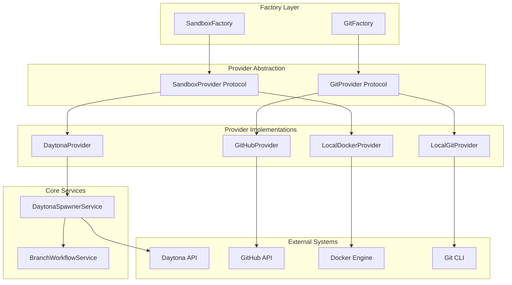
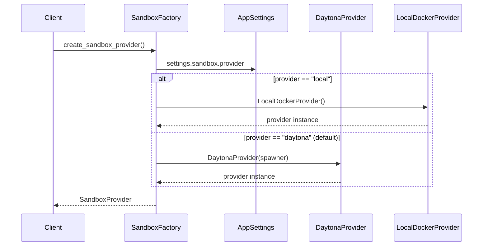
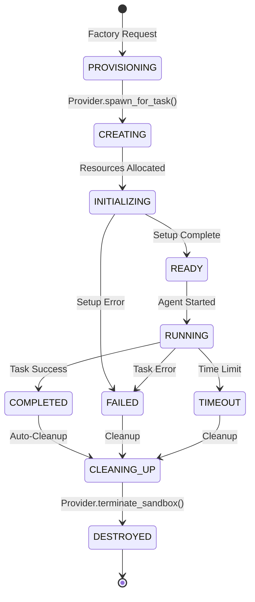
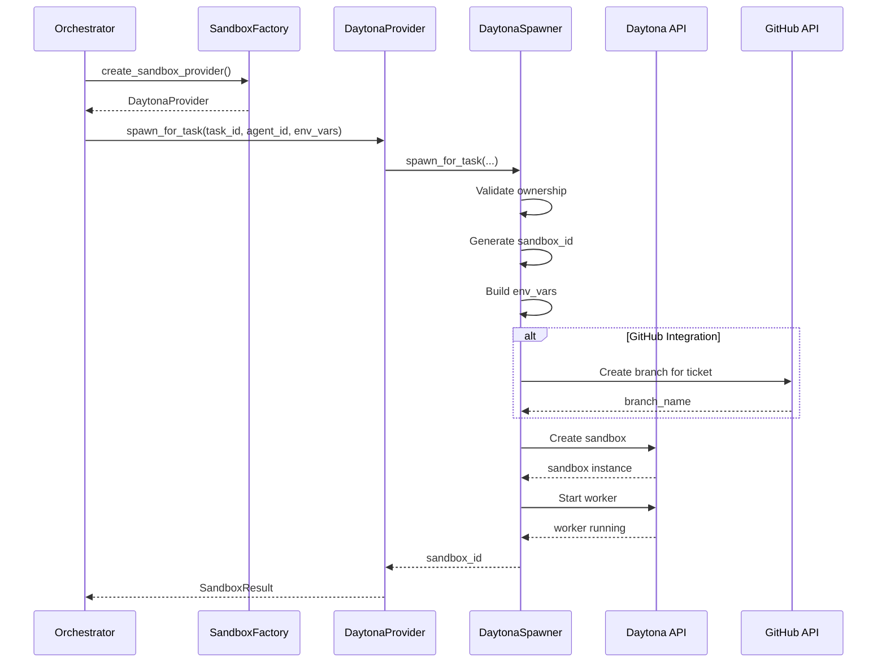
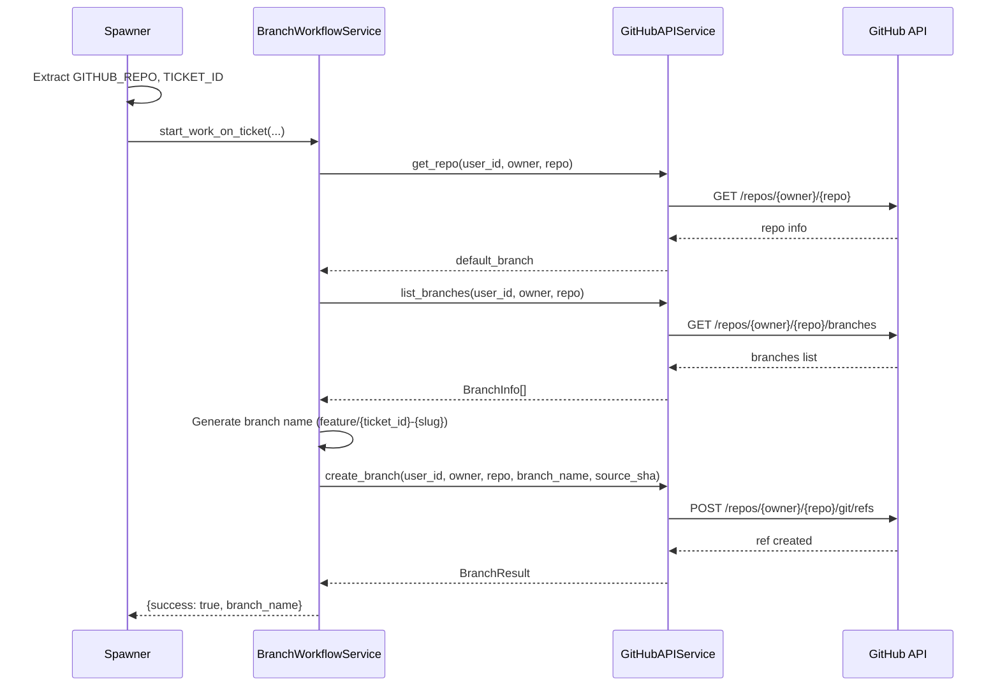
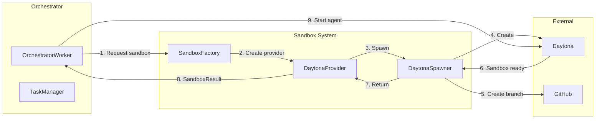

# Sandbox Provisioning System Design Document

**Created:** 2026-04-22  
**Status:** Active  
**Purpose:** Multi-provider sandbox architecture for isolated agent execution with Daytona and local Docker support  
**Related Docs:** [Sandbox Spawner](./sandbox_spawner.md), [Branch Management System](./branch-management-system.md), [Orchestrator Service](./orchestrator_service.md)

---

## 1. Architecture Overview

The Sandbox Provisioning System provides a unified abstraction for creating and managing isolated execution environments for AI agents. It supports multiple backend providers (Daytona Cloud for production, local Docker for development) through a consistent factory/provider pattern.

### 1.1 High-Level Architecture



### 1.2 Provider Selection Flow



### 1.3 Sandbox Lifecycle



---

## 2. Factory Pattern Implementation

### 2.1 Sandbox Factory

The `SandboxFactory` creates the appropriate `SandboxProvider` based on configuration:

```python
# backend/omoi_os/services/sandbox_factory.py
def create_sandbox_provider(
    db=None, 
    event_bus=None, 
    **kwargs
) -> SandboxProvider:
    """Create SandboxProvider based on config.
    
    Reads settings.sandbox.provider:
    - "local" → LocalDockerProvider (development)
    - "daytona" (default) → DaytonaProvider (production)
    """
    from omoi_os.config import get_app_settings
    
    settings = get_app_settings()
    provider_type = settings.sandbox.provider
    
    if provider_type == "local":
        from omoi_os.services.local_docker_provider import LocalDockerProvider
        return LocalDockerProvider(
            image=settings.sandbox.local_image,
            mount_workspace=settings.sandbox.local_mount_workspace,
            api_base_url=settings.sandbox.local_api_base_url,
        )
    else:
        # Daytona provider (default for production)
        if db is None or event_bus is None:
            raise ValueError("DaytonaProvider requires db and event_bus")
        
        from omoi_os.services.daytona_spawner import get_daytona_spawner
        from omoi_os.services.daytona_provider import DaytonaProvider
        
        spawner = get_daytona_spawner(db=db, event_bus=event_bus)
        return DaytonaProvider(spawner)
```

### 2.2 Git Factory

The `GitFactory` creates the appropriate `GitProvider` for branch operations:

```python
# backend/omoi_os/services/git_factory.py
def create_git_provider(
    github_api=None, 
    user_id: Optional[UUID | str] = None
) -> "GitProvider":
    """Create GitProvider based on config.
    
    Reads git.provider from config:
    - "github" (default) → GitHubProvider
    - "local" → LocalGitProvider
    """
    from omoi_os.config import get_app_settings
    
    settings = get_app_settings()
    provider_type = settings.git.provider
    
    if provider_type == "local":
        from omoi_os.services.local_git_provider import LocalGitProvider
        return LocalGitProvider(repos_dir=settings.git.local_repos_dir)
    else:
        if github_api is None:
            raise ValueError("GitHubProvider requires a GitHubAPIService instance")
        from omoi_os.services.github_provider import GitHubProvider
        return GitHubProvider(github_api, user_id=user_id)
```

---

## 3. Provider Protocols

### 3.1 SandboxProvider Protocol

```python
# backend/omoi_os/services/sandbox_provider.py
@dataclass
class SandboxResult:
    """Result of spawning a sandbox."""
    sandbox_id: str
    status: str  # "creating" | "running" | "completed" | "failed" | "terminated"
    connection_info: dict[str, Any] = field(default_factory=dict)

@dataclass
class SandboxStatus:
    """Current status of a sandbox."""
    sandbox_id: str
    status: str
    started_at: Optional[str] = None
    error: Optional[str] = None

@runtime_checkable
class SandboxProvider(Protocol):
    """Protocol for sandbox lifecycle management."""
    
    async def spawn_for_task(
        self,
        task_id: str,
        agent_id: str,
        phase_id: str,
        env_vars: dict[str, str],
        *,
        runtime: str = "claude",
        execution_mode: str = "implementation",
        image: Optional[str] = None,
    ) -> SandboxResult: ...
    
    async def terminate_sandbox(self, sandbox_id: str) -> None: ...
    
    async def get_status(self, sandbox_id: str) -> SandboxStatus: ...
    
    async def list_active(self) -> list[SandboxStatus]: ...
```

### 3.2 GitProvider Protocol

```python
# backend/omoi_os/services/git_provider.py
@dataclass
class BranchInfo:
    """Information about a Git branch."""
    name: str
    sha: str
    is_default: bool = False
    is_protected: bool = False

@dataclass
class PullRequestInfo:
    """Information about a pull request."""
    id: str
    title: str
    source_branch: str
    target_branch: str
    status: str  # "open" | "merged" | "closed"
    merge_sha: Optional[str] = None
    conflict_files: Optional[list[str]] = None

@runtime_checkable
class GitProvider(Protocol):
    """Protocol for Git hosting operations."""
    
    async def create_branch(
        self, repo_full_name: str, branch_name: str, source_sha: str
    ) -> BranchInfo: ...
    
    async def delete_branch(self, repo_full_name: str, branch_name: str) -> None: ...
    
    async def get_branch(
        self, repo_full_name: str, branch_name: str
    ) -> Optional[BranchInfo]: ...
    
    async def list_branches(self, repo_full_name: str) -> list[BranchInfo]: ...
    
    async def create_pull_request(
        self,
        repo_full_name: str,
        title: str,
        source_branch: str,
        target_branch: str,
        body: str = "",
    ) -> PullRequestInfo: ...
    
    async def merge_pull_request(
        self, repo_full_name: str, pr_id: str, merge_method: str = "merge"
    ) -> PullRequestInfo: ...
    
    async def get_default_branch(self, repo_full_name: str) -> str: ...
    
    async def clone_repo(self, repo_full_name: str, target_dir: str) -> str: ...
```

---

## 4. Provider Implementations

### 4.1 DaytonaProvider (Production)

```python
# backend/omoi_os/services/daytona_provider.py
class DaytonaProvider:
    """SandboxProvider backed by Daytona Cloud."""
    
    def __init__(self, spawner):
        self._spawner = spawner
    
    async def spawn_for_task(
        self,
        task_id: str,
        agent_id: str,
        phase_id: str,
        env_vars: dict[str, str],
        *,
        runtime: str = "claude",
        execution_mode: str = "implementation",
        image: Optional[str] = None,
    ) -> SandboxResult:
        """Spawn a Daytona sandbox for a task."""
        sandbox_id = await self._spawner.spawn_for_task(
            task_id=task_id,
            agent_id=agent_id,
            phase_id=phase_id,
            runtime=runtime,
            execution_mode=execution_mode,
            extra_env=env_vars,
        )
        return SandboxResult(
            sandbox_id=sandbox_id,
            status="creating",
            connection_info={"provider": "daytona"},
        )
    
    async def terminate_sandbox(self, sandbox_id: str) -> None:
        await self._spawner.terminate_sandbox(sandbox_id)
    
    async def get_status(self, sandbox_id: str) -> SandboxStatus:
        try:
            info = self._spawner.get_sandbox_info(sandbox_id)
            return SandboxStatus(
                sandbox_id=sandbox_id,
                status=info.status if info else "unknown",
            )
        except Exception:
            return SandboxStatus(sandbox_id=sandbox_id, status="unknown")
    
    async def list_active(self) -> list[SandboxStatus]:
        try:
            active = getattr(self._spawner, "_active_sandboxes", {})
            return [
                SandboxStatus(
                    sandbox_id=sid, 
                    status=getattr(info, "status", "unknown")
                )
                for sid, info in active.items()
            ]
        except Exception:
            return []
```

### 4.2 LocalDockerProvider (Development)

```python
# backend/omoi_os/services/local_docker_provider.py
@dataclass
class ContainerInfo:
    """Tracking info for a local Docker container."""
    container_id: str
    sandbox_id: str
    task_id: str

class LocalDockerProvider:
    """SandboxProvider using local Docker containers. Dev-only."""
    
    DEFAULT_IMAGE = "nikolaik/python-nodejs:python3.12-nodejs22"
    
    def __init__(
        self,
        worker_script_path: str = "backend/omoi_os/workers/claude_sandbox_worker.py",
        api_base_url: str = "http://host.docker.internal:18000",
        image: Optional[str] = None,
        mount_workspace: Optional[str] = None,
    ):
        self._worker_script = worker_script_path
        self._api_base_url = api_base_url
        self._image = image or self.DEFAULT_IMAGE
        self._mount_workspace = mount_workspace
        self._active: dict[str, ContainerInfo] = {}
    
    async def spawn_for_task(
        self,
        task_id: str,
        agent_id: str,
        phase_id: str,
        env_vars: dict[str, str],
        *,
        runtime: str = "claude",
        execution_mode: str = "implementation",
        image: Optional[str] = None,
    ) -> SandboxResult:
        """Spawn a local Docker container for development."""
        sandbox_id = f"local-{task_id[:8]}-{uuid4().hex[:6]}"
        
        container_env = {
            "SANDBOX_ID": sandbox_id,
            "CALLBACK_URL": self._api_base_url,
            "IS_SANDBOX": "1",
            **env_vars,
        }
        
        env_flags = " ".join(f'-e {k}="{v}"' for k, v in container_env.items())
        mount_flag = (
            f"-v {self._mount_workspace}:/workspace" 
            if self._mount_workspace else ""
        )
        use_image = image or self._image
        
        cmd = (
            f"docker run -d --name {sandbox_id} {env_flags} {mount_flag} "
            f"--add-host=host.docker.internal:host-gateway "
            f"{use_image} python /workspace/claude_sandbox_worker.py"
        )
        
        proc = await asyncio.create_subprocess_shell(
            cmd,
            stdout=asyncio.subprocess.PIPE,
            stderr=asyncio.subprocess.PIPE,
        )
        stdout, stderr = await proc.communicate()
        
        if proc.returncode != 0:
            raise RuntimeError(f"Failed to start container: {stderr.decode()}")
        
        container_id = stdout.decode().strip()
        self._active[sandbox_id] = ContainerInfo(
            container_id=container_id,
            sandbox_id=sandbox_id,
            task_id=task_id,
        )
        
        return SandboxResult(
            sandbox_id=sandbox_id,
            status="running",
            connection_info={
                "provider": "local-docker",
                "container_id": container_id,
                "logs_cmd": f"docker logs -f {sandbox_id}",
                "exec_cmd": f"docker exec -it {sandbox_id} bash",
            },
        )
    
    async def terminate_sandbox(self, sandbox_id: str) -> None:
        if sandbox_id in self._active:
            await asyncio.create_subprocess_shell(
                f"docker rm -f {sandbox_id}",
                stdout=asyncio.subprocess.DEVNULL,
                stderr=asyncio.subprocess.DEVNULL,
            )
            del self._active[sandbox_id]
    
    async def get_status(self, sandbox_id: str) -> SandboxStatus:
        proc = await asyncio.create_subprocess_shell(
            f'docker inspect -f "{{{{.State.Status}}}}" {sandbox_id}',
            stdout=asyncio.subprocess.PIPE,
            stderr=asyncio.subprocess.PIPE,
        )
        stdout, _ = await proc.communicate()
        docker_status = stdout.decode().strip()
        status_map = {"running": "running", "exited": "completed", "dead": "failed"}
        return SandboxStatus(
            sandbox_id=sandbox_id,
            status=status_map.get(docker_status, "unknown"),
        )
    
    async def list_active(self) -> list[SandboxStatus]:
        results = []
        for sid in list(self._active.keys()):
            status = await self.get_status(sid)
            results.append(status)
        return results
```

### 4.3 GitHubProvider (Production)

```python
# backend/omoi_os/services/github_provider.py
class GitHubProvider:
    """GitProvider backed by GitHub API. Wraps GitHubAPIService."""
    
    def __init__(self, github_api, user_id: Optional[UUID | str] = None):
        self._api = github_api
        self._user_id = user_id
    
    def _split_repo(self, repo_full_name: str) -> tuple[str, str]:
        """Split 'owner/repo' into (owner, repo)."""
        owner, repo = repo_full_name.split("/", 1)
        return owner, repo
    
    def _get_user_id(self) -> UUID:
        """Get the user ID as UUID."""
        if self._user_id is None:
            raise ValueError("GitHubProvider requires a user_id")
        if isinstance(self._user_id, str):
            return UUID(self._user_id)
        return self._user_id
    
    async def create_branch(
        self, repo_full_name: str, branch_name: str, source_sha: str
    ) -> BranchInfo:
        """Create a new branch via GitHub API."""
        owner, repo = self._split_repo(repo_full_name)
        result = await self._api.create_branch(
            self._get_user_id(), owner, repo, branch_name, source_sha
        )
        sha = result.sha if hasattr(result, "sha") else source_sha
        return BranchInfo(name=branch_name, sha=sha)
    
    async def create_pull_request(
        self,
        repo_full_name: str,
        title: str,
        source_branch: str,
        target_branch: str,
        body: str = "",
    ) -> PullRequestInfo:
        """Create a pull request via GitHub API."""
        owner, repo = self._split_repo(repo_full_name)
        result = await self._api.create_pull_request(
            self._get_user_id(),
            owner,
            repo,
            title,
            source_branch,
            target_branch,
            body,
        )
        pr_number = result.number if hasattr(result, "number") else 0
        return PullRequestInfo(
            id=str(pr_number),
            title=title,
            source_branch=source_branch,
            target_branch=target_branch,
            status="open",
        )
    
    async def merge_pull_request(
        self, repo_full_name: str, pr_id: str, merge_method: str = "merge"
    ) -> PullRequestInfo:
        """Merge a pull request via GitHub API."""
        owner, repo = self._split_repo(repo_full_name)
        result = await self._api.merge_pull_request(
            self._get_user_id(), owner, repo, int(pr_id), merge_method=merge_method
        )
        merge_sha = result.sha if hasattr(result, "sha") else None
        return PullRequestInfo(
            id=pr_id,
            title="",
            source_branch="",
            target_branch="",
            status="merged",
            merge_sha=merge_sha,
        )
```

### 4.4 LocalGitProvider (Development)

```python
# backend/omoi_os/services/local_git_provider.py
class LocalGitProvider:
    """GitProvider using local bare Git repositories. Dev-only."""
    
    def __init__(self, repos_dir: str = ".local-repos"):
        self._repos_dir = Path(repos_dir)
        self._repos_dir.mkdir(parents=True, exist_ok=True)
        self._pull_requests: dict[str, PullRequestInfo] = {}
        self._pr_counter = 0
    
    def _repo_path(self, repo_full_name: str) -> Path:
        """Get the path to a bare repo."""
        safe_name = repo_full_name.replace("/", "--")
        return self._repos_dir / f"{safe_name}.git"
    
    async def _ensure_repo(self, repo_full_name: str) -> Path:
        """Ensure a bare repo exists, creating if necessary."""
        path = self._repo_path(repo_full_name)
        if not path.exists():
            await self._run_git(None, "init", "--bare", str(path))
            await self._create_initial_commit(path)
        return path
    
    async def create_branch(
        self, repo_full_name: str, branch_name: str, source_sha: str
    ) -> BranchInfo:
        """Create a new branch."""
        repo_path = await self._ensure_repo(repo_full_name)
        await self._run_git(repo_path, "branch", branch_name, source_sha)
        return BranchInfo(name=branch_name, sha=source_sha)
    
    async def create_pull_request(
        self,
        repo_full_name: str,
        title: str,
        source_branch: str,
        target_branch: str,
        body: str = "",
    ) -> PullRequestInfo:
        """Create a pull request (stored in-memory)."""
        self._pr_counter += 1
        pr_id = f"local-pr-{self._pr_counter}"
        pr = PullRequestInfo(
            id=pr_id,
            title=title,
            source_branch=source_branch,
            target_branch=target_branch,
            status="open",
        )
        self._pull_requests[pr_id] = pr
        return pr
```

---

## 5. Daytona Spawner Service

The `DaytonaSpawnerService` is the core service that manages Daytona sandbox lifecycle:

```python
# backend/omoi_os/services/daytona_spawner.py
class DaytonaSpawnerService:
    """Service for spawning and managing Daytona sandboxes."""
    
    def __init__(
        self,
        db: Optional[DatabaseService] = None,
        event_bus: Optional[EventBusService] = None,
        mcp_server_url: str = "http://localhost:18000/mcp/",
        daytona_api_key: Optional[str] = None,
        daytona_api_url: str = "https://app.daytona.io/api",
        sandbox_image: Optional[str] = "nikolaik/python-nodejs:python3.12-nodejs22",
        sandbox_snapshot: Optional[str] = None,
        auto_cleanup: bool = True,
        sandbox_memory_gb: int = 4,
        sandbox_cpu: int = 2,
        sandbox_disk_gb: int = 8,
    ):
        self.db = db
        self.event_bus = event_bus
        self.mcp_server_url = mcp_server_url
        self.sandbox_image = sandbox_image
        self.sandbox_snapshot = sandbox_snapshot
        self.auto_cleanup = auto_cleanup
        
        # Load Daytona settings
        daytona_settings = load_daytona_settings()
        self.daytona_api_key = daytona_api_key or daytona_settings.api_key
        self.daytona_api_url = daytona_api_url or daytona_settings.api_url
        
        # Resource limits from config
        self.sandbox_memory_gb = min(daytona_settings.sandbox_memory_gb, 8)
        self.sandbox_cpu = min(daytona_settings.sandbox_cpu, 4)
        self.sandbox_disk_gb = min(daytona_settings.sandbox_disk_gb, 10)
        
        # In-memory tracking
        self._sandboxes: Dict[str, SandboxInfo] = {}
        self._task_to_sandbox: Dict[str, str] = {}
```

### 5.1 Key Spawner Methods

| Method | Signature | Description |
|--------|-----------|-------------|
| `spawn_for_task` | `(task_id, agent_id, phase_id, env_vars, runtime="claude", execution_mode="implementation") → str` | Spawn sandbox for a task |
| `spawn_for_phase` | `(spec_id, phase, project_id, phase_context=None) → str` | Spawn sandbox for spec phase |
| `terminate_sandbox` | `(sandbox_id) → None` | Destroy a sandbox |
| `get_sandbox_info` | `(sandbox_id) → SandboxInfo` | Get sandbox status |
| `_create_daytona_sandbox` | `(sandbox_id, env_vars, labels, runtime, execution_mode, continuous_mode) → None` | Core Daytona SDK integration |
| `_start_worker_in_sandbox` | `(sandbox, env_vars, runtime, execution_mode, continuous_mode) → None` | Start agent worker |

---

## 6. Configuration

### 6.1 Environment-Based Provider Selection

```yaml
# config/base.yaml
sandbox:
  provider: "daytona"  # or "local" for development
  
  # Daytona settings (production)
  daytona:
    api_key: "${DAYTONA_API_KEY}"
    api_url: "https://app.daytona.io/api"
    snapshot: "omoios-base-v1"
    
  # Resource limits
  sandbox_memory_gb: 4
  sandbox_cpu: 2
  sandbox_disk_gb: 8
  
  # Local development settings
  local:
    image: "nikolaik/python-nodejs:python3.12-nodejs22"
    mount_workspace: "/path/to/workspace"
    api_base_url: "http://host.docker.internal:18000"

git:
  provider: "github"  # or "local" for development
  local_repos_dir: ".local-repos"
```

### 6.2 Environment Variables

| Variable | Purpose | Provider |
|----------|---------|----------|
| `DAYTONA_API_KEY` | Daytona API authentication | Daytona |
| `DAYTONA_API_URL` | Daytona API endpoint | Daytona |
| `SANDBOX_PROVIDER` | Provider selection (daytona/local) | Both |
| `GIT_PROVIDER` | Git provider (github/local) | Both |
| `LOCAL_REPOS_DIR` | Local git repos directory | LocalGit |

---

## 7. Data Flow

### 7.1 Sandbox Creation Flow



### 7.2 Git Branch Creation Flow



---

## 8. Error Handling

### 8.1 Provider Failure Handling

```python
# DaytonaProvider handles spawner failures
async def get_status(self, sandbox_id: str) -> SandboxStatus:
    try:
        info = self._spawner.get_sandbox_info(sandbox_id)
        return SandboxStatus(
            sandbox_id=sandbox_id,
            status=info.status if info else "unknown",
        )
    except Exception:
        # Graceful degradation - return unknown status
        return SandboxStatus(sandbox_id=sandbox_id, status="unknown")
```

### 8.2 Sandbox Timeout Handling

```python
# In DaytonaSpawnerService.spawn_for_task()
# Continuous mode with limits
if effective_continuous_mode and runtime == "claude":
    env_vars["CONTINUOUS_MODE"] = "true"
    env_vars.setdefault("MAX_ITERATIONS", "10")
    env_vars.setdefault("MAX_TOTAL_COST_USD", "20.0")
    env_vars.setdefault("MAX_DURATION_SECONDS", "3600")  # 1 hour
```

### 8.3 Error Categories

| Error Type | Example | Handling Strategy |
|------------|---------|-------------------|
| **Provider Config** | Missing Daytona API key | Raise `RuntimeError` with clear message |
| **Resource Limit** | Memory/disk exceeded | Log warning, attempt graceful shutdown |
| **Git Operation** | Branch creation failed | Log warning, continue without branch |
| **Worker Startup** | Worker script failed | Log error with traceback, re-raise |
| **Sandbox Timeout** | Max duration exceeded | Auto-terminate, mark task failed |

---

## 9. Integration Points

### 9.1 Orchestrator Integration



### 9.2 Branch Workflow Integration

The spawner integrates with `BranchWorkflowService` to create branches before sandbox creation:

```python
# From daytona_spawner.py
if extra_env and self.db:
    github_repo = extra_env.get("GITHUB_REPO")
    ticket_id = extra_env.get("TICKET_ID")
    user_id = extra_env.get("USER_ID")
    
    if github_repo and ticket_id and user_id:
        from omoi_os.services.branch_workflow import BranchWorkflowService
        from omoi_os.services.github_api import GitHubAPIService
        
        github_service = GitHubAPIService(self.db)
        branch_workflow = BranchWorkflowService(github_service)
        
        result = await branch_workflow.start_work_on_ticket(
            ticket_id=ticket_id,
            ticket_title=ticket_title,
            repo_owner=repo_owner,
            repo_name=repo_name,
            user_id=user_id,
            ticket_type=ticket_type,
        )
        
        if result.get("success"):
            branch_name = result.get("branch_name")
            extra_env["BRANCH_NAME"] = branch_name
```

---

## 10. Performance Characteristics

| Metric | Target | Notes |
|--------|--------|-------|
| Provider selection | < 1ms | Simple config lookup |
| Daytona spawn | < 30s | From request to ready |
| Local Docker spawn | < 10s | Container startup time |
| Git branch creation | < 5s | GitHub API call |
| Status check | < 100ms | In-memory or API call |
| Termination | < 10s | Resource cleanup |

---

## 11. Security Considerations

1. **API Key Management**: Daytona and GitHub API keys stored in environment variables, never in code
2. **Token Isolation**: Each sandbox gets its own JWT token for OmoiOS API access
3. **Git Credentials**: GitHub tokens passed via SDK, never exposed in shell commands
4. **Resource Limits**: CPU, memory, disk limits enforced at container level
5. **Ephemeral Sandboxes**: Auto-delete when stopped (ephemeral=True)
6. **Network Isolation**: Sandboxes run in isolated network contexts

---

*Document Version: 1.0*  
*Last Updated: 2026-04-22*  
*Maintainer: OmoiOS Core Team*
