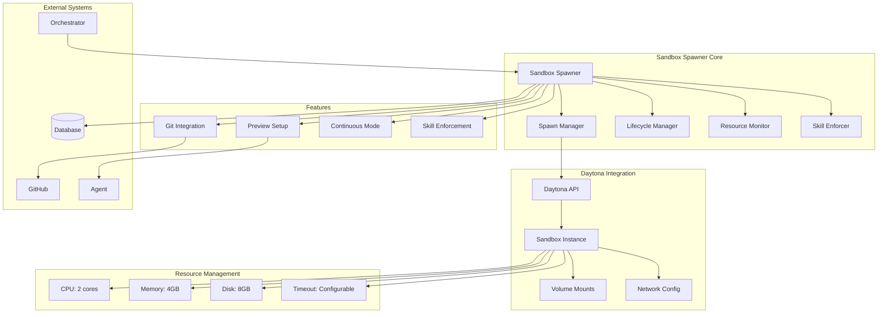
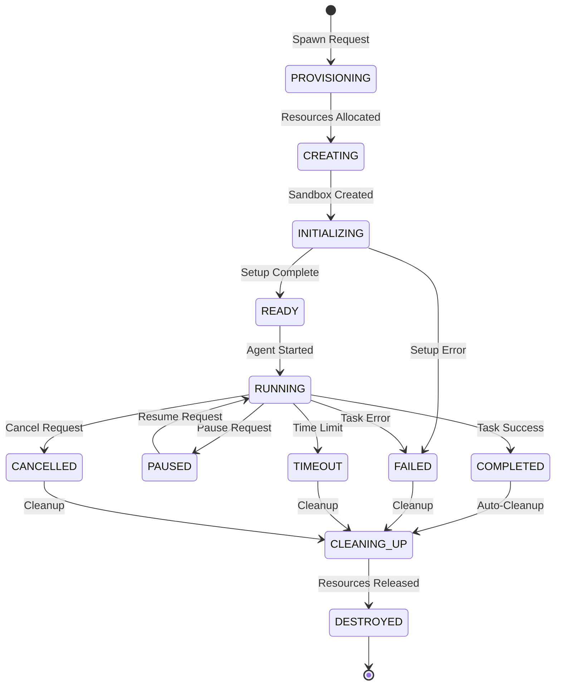
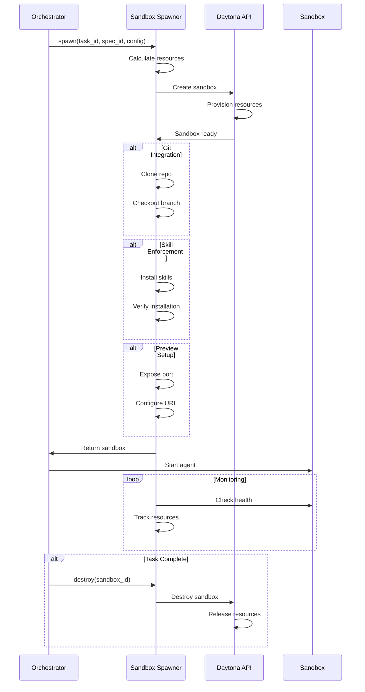

# Sandbox Spawner Service Design Document

**Created:** 2026-04-22  
**Status:** Active  
**Purpose:** Daytona sandbox provisioning, lifecycle management, and spec skill enforcement for isolated agent execution  
**Related Docs:** [Orchestrator Service](./orchestrator_service.md), [Guardian Monitoring](./guardian_monitoring.md), [Discovery Service](./discovery_service.md)

---

## 1. Architecture Overview

The Sandbox Spawner Service manages the complete lifecycle of isolated execution environments using Daytona sandboxes. It handles provisioning, resource allocation, Git repository integration, spec skill enforcement, and continuous mode support for long-running agent tasks.

### 1.1 High-Level Architecture



### 1.2 Sandbox Lifecycle



---

## 2. Component Responsibilities

| Component | Responsibility | Key Operations |
|-----------|---------------|----------------|
| **Sandbox Spawner** | Main coordination, API surface | `spawn()`, `destroy()`, `get_status()` |
| **Spawn Manager** | Daytona API interaction | `create_sandbox()`, `configure_resources()`, `mount_volumes()` |
| **Lifecycle Manager** | State transitions, monitoring | `transition()`, `monitor_health()`, `handle_timeout()` |
| **Resource Monitor** | Resource usage tracking | `track_usage()`, `enforce_limits()`, `alert_threshold()` |
| **Skill Enforcer** | Spec skill installation | `enforce_skills()`, `install_skill()`, `verify_installation()` |
| **Git Integration** | Repository setup | `clone_repo()`, `checkout_branch()`, `setup_preview()` |
| **Preview Manager** | Frontend preview setup | `configure_preview()`, `expose_port()`, `generate_url()` |

---

## 3. System Boundaries

### 3.1 Inside System Boundaries

- Daytona sandbox provisioning via API
- Resource allocation (CPU: 2 cores, Memory: 4GB, Disk: 8GB)
- Sandbox lifecycle management (create, pause, resume, destroy)
- Git repository cloning and branch checkout
- GitHub branch creation for sandbox isolation
- Preview environment setup for frontend tasks
- Spec skill enforcement and installation
- Continuous mode support (long-running sandboxes)
- Resource usage monitoring and limits enforcement
- Timeout management and automatic cleanup
- Volume mounting for persistent storage
- Network configuration for sandbox connectivity
- Sandbox health monitoring and heartbeat

### 3.2 Outside System Boundaries

- Actual agent code execution (handled by Agent/Worker)
- Task orchestration (handled by Orchestrator)
- LLM API calls (delegated to LLM Service)
- Database persistence (handled by models layer)
- Git hosting (delegated to GitHub/GitLab)
- Container runtime (managed by Daytona platform)
- Infrastructure provisioning (managed by Daytona)

---

## 4. Component Details

### 4.1 Sandbox Spawner Core

The main service class providing the sandbox management API.

**Core Methods:**

```python
class SandboxSpawner:
    """
    Daytona sandbox provisioning and lifecycle management.
    
    Provides isolated execution environments for agents with:
    - Resource limits (CPU, memory, disk)
    - Git repository integration
    - Spec skill enforcement
    - Preview environment support
    - Continuous mode for long-running tasks
    """
    
    # Default resource limits
    DEFAULT_RESOURCES = {
        "cpu_cores": 2,
        "memory_mb": 4096,  # 4GB
        "disk_mb": 8192,    # 8GB
        "timeout_seconds": 3600  # 1 hour
    }
    
    async def spawn(
        self,
        spec_id: str,
        task_id: str,
        git_repo_url: Optional[str] = None,
        branch_name: Optional[str] = None,
        create_branch: bool = False,
        skills: list[str] = None,
        continuous_mode: bool = False,
        preview_config: Optional[PreviewConfig] = None,
        resource_overrides: Optional[dict] = None
    ) -> Sandbox:
        """
        Spawn a new sandbox for task execution.
        
        Args:
            spec_id: Specification being executed
            task_id: Task that will run in sandbox
            git_repo_url: Repository to clone (optional)
            branch_name: Branch to checkout
            create_branch: Whether to create a new branch
            skills: List of spec skills to enforce
            continuous_mode: Enable long-running mode
            preview_config: Frontend preview configuration
            resource_overrides: Override default resource limits
        
        Returns:
            Sandbox instance with connection details
        """
        # Phase 1: Resource calculation
        resources = self._calculate_resources(resource_overrides)
        
        # Phase 2: Create sandbox via Daytona API
        sandbox_config = SandboxConfig(
            resources=resources,
            environment_variables=self._build_env_vars(spec_id, task_id),
            volumes=self._configure_volumes(task_id),
            network=self._configure_network()
        )
        
        daytona_sandbox = await self.spawn_manager.create(sandbox_config)
        
        # Phase 3: Git setup (if requested)
        if git_repo_url:
            await self.git_integration.setup(
                sandbox_id=daytona_sandbox.id,
                repo_url=git_repo_url,
                branch_name=branch_name,
                create_branch=create_branch
            )
        
        # Phase 4: Skill enforcement
        if skills:
            await self.skill_enforcer.enforce(
                sandbox_id=daytona_sandbox.id,
                skills=skills
            )
        
        # Phase 5: Preview setup (for frontend tasks)
        if preview_config:
            preview_url = await self.preview_manager.setup(
                sandbox_id=daytona_sandbox.id,
                config=preview_config
            )
            daytona_sandbox.preview_url = preview_url
        
        # Phase 6: Record and return
        sandbox = Sandbox(
            id=daytona_sandbox.id,
            task_id=task_id,
            spec_id=spec_id,
            status="ready",
            resources=resources,
            preview_url=preview_url if preview_config else None,
            continuous_mode=continuous_mode,
            created_at=utc_now()
        )
        
        await self._persist_sandbox(sandbox)
        
        # Start monitoring
        await self.lifecycle_manager.start_monitoring(sandbox.id)
        
        return sandbox
    
    async def destroy(self, sandbox_id: str, force: bool = False) -> None:
        """
        Destroy a sandbox and release resources.
        
        Args:
            sandbox_id: Sandbox to destroy
            force: Force destroy even if running
        """
        sandbox = await self._get_sandbox(sandbox_id)
        
        if sandbox.status == "running" and not force:
            raise SandboxError(
                "Cannot destroy running sandbox. Use force=True or stop first."
            )
        
        # Stop monitoring
        await self.lifecycle_manager.stop_monitoring(sandbox_id)
        
        # Destroy via Daytona API
        await self.spawn_manager.destroy(sandbox_id)
        
        # Update record
        await self._update_status(sandbox_id, "destroyed")
        
        logger.info(f"Destroyed sandbox {sandbox_id}")
```

### 4.2 Resource Management

Resource allocation and limit enforcement.

```python
class ResourceMonitor:
    """
    Monitor and enforce resource limits for sandboxes.
    
    Tracks:
    - CPU usage
    - Memory consumption
    - Disk utilization
    - Network I/O
    
    Enforces limits and alerts when approaching thresholds.
    """
    
    ALERT_THRESHOLDS = {
        "cpu_percent": 80,
        "memory_percent": 85,
        "disk_percent": 90
    }
    
    async def track_usage(self, sandbox_id: str) -> ResourceUsage:
        """
        Get current resource usage for a sandbox.
        """
        metrics = await self.daytona_api.get_metrics(sandbox_id)
        
        usage = ResourceUsage(
            sandbox_id=sandbox_id,
            cpu_seconds=metrics.cpu_seconds,
            cpu_percent=metrics.cpu_percent,
            memory_mb=metrics.memory_mb,
            memory_percent=(metrics.memory_mb / metrics.memory_limit_mb) * 100,
            disk_mb=metrics.disk_mb,
            disk_percent=(metrics.disk_mb / metrics.disk_limit_mb) * 100,
            network_rx_mb=metrics.network_rx_mb,
            network_tx_mb=metrics.network_tx_mb,
            timestamp=utc_now()
        )
        
        # Check thresholds
        await self._check_thresholds(usage)
        
        # Persist metrics
        await self._persist_usage(usage)
        
        return usage
    
    async def enforce_limits(self, sandbox_id: str) -> None:
        """
        Enforce resource limits on a sandbox.
        
        Actions:
        - Throttle CPU if over limit
        - Kill processes if memory exceeded
        - Prevent writes if disk full
        """
        usage = await self.track_usage(sandbox_id)
        limits = await self._get_limits(sandbox_id)
        
        # Memory enforcement
        if usage.memory_mb > limits.memory_mb:
            logger.warning(f"Sandbox {sandbox_id} exceeded memory limit")
            await self._handle_memory_exceeded(sandbox_id)
        
        # Disk enforcement
        if usage.disk_mb > limits.disk_mb:
            logger.warning(f"Sandbox {sandbox_id} exceeded disk limit")
            await self._handle_disk_exceeded(sandbox_id)
    
    async def _handle_memory_exceeded(self, sandbox_id: str) -> None:
        """
        Handle memory limit violation.
        
        Strategy:
        1. Attempt graceful OOM handling
        2. Kill highest memory processes
        3. If still exceeded, pause sandbox
        """
        # Get process list sorted by memory
        processes = await self.daytona_api.get_processes(sandbox_id)
        processes.sort(key=lambda p: p.memory_mb, reverse=True)
        
        # Kill top memory consumers (excluding critical system processes)
        for proc in processes[:3]:
            if proc.name not in ["init", "sshd", "daytona-agent"]:
                await self.daytona_api.kill_process(sandbox_id, proc.pid)
                logger.info(f"Killed process {proc.name} in sandbox {sandbox_id}")
```

### 4.3 Git Integration

Repository cloning and branch management.

```python
class GitIntegration:
    """
    Git repository integration for sandboxes.
    
    Handles:
    - Repository cloning
    - Branch checkout
    - New branch creation
    - Commit and push (for continuous mode)
    """
    
    async def setup(
        self,
        sandbox_id: str,
        repo_url: str,
        branch_name: Optional[str] = None,
        create_branch: bool = False,
        base_branch: str = "main"
    ) -> GitSetupResult:
        """
        Setup Git repository in sandbox.
        
        If create_branch is True, creates a new branch from base_branch.
        """
        # Clone repository
        await self._execute_in_sandbox(
            sandbox_id,
            f"git clone {repo_url} /workspace/repo"
        )
        
        if create_branch:
            # Create new branch
            branch_name = branch_name or f"omoi-task-{generate_id()}"
            
            await self._execute_in_sandbox(
                sandbox_id,
                f"cd /workspace/repo && git checkout -b {branch_name} {base_branch}"
            )
            
            # Push branch to remote
            await self._execute_in_sandbox(
                sandbox_id,
                f"cd /workspace/repo && git push -u origin {branch_name}"
            )
        else:
            # Checkout existing branch
            if branch_name:
                await self._execute_in_sandbox(
                    sandbox_id,
                    f"cd /workspace/repo && git checkout {branch_name}"
                )
        
        return GitSetupResult(
            repo_path="/workspace/repo",
            branch_name=branch_name,
            commit_hash=await self._get_commit_hash(sandbox_id)
        )
    
    async def create_branch_for_sandbox(
        self,
        sandbox_id: str,
        repo_url: str,
        task_id: str
    ) -> str:
        """
        Create a dedicated branch for sandbox work.
        
        Branch naming: omoi/{sandbox_id}/{task_id}
        """
        branch_name = f"omoi/{sandbox_id[:8]}/{task_id[:8]}"
        
        # Use GitHub API to create branch
        # This avoids needing to clone first
        github = GitHubAPI(token=self.config.github_token)
        
        # Get base branch SHA
        base_sha = await github.get_branch_sha(repo_url, "main")
        
        # Create new branch
        await github.create_branch(repo_url, branch_name, base_sha)
        
        return branch_name
```

### 4.4 Preview Manager

Frontend preview environment setup.

```python
class PreviewManager:
    """
    Setup and manage preview environments for frontend tasks.
    
    Exposes sandbox services via public URLs for:
    - Frontend development servers
    - API endpoints
    - Static sites
    """
    
    async def setup(
        self,
        sandbox_id: str,
        config: PreviewConfig
    ) -> str:
        """
        Setup preview environment.
        
        Returns public preview URL.
        """
        # Configure port exposure
        await self.daytona_api.expose_port(
            sandbox_id=sandbox_id,
            port=config.port,
            protocol=config.protocol  # http or https
        )
        
        # Generate preview URL
        preview_url = await self.daytona_api.get_preview_url(
            sandbox_id=sandbox_id,
            port=config.port
        )
        
        # Configure authentication if needed
        if config.require_auth:
            await self._configure_auth(sandbox_id, config.auth_config)
        
        # Setup custom domain if specified
        if config.custom_domain:
            await self._configure_custom_domain(
                sandbox_id, preview_url, config.custom_domain
            )
        
        return preview_url
    
    async def configure_for_frontend(
        self,
        sandbox_id: str,
        framework: str  # react, vue, svelte, etc.
    ) -> str:
        """
        Auto-configure preview for common frontend frameworks.
        """
        framework_ports = {
            "react": 3000,
            "vue": 8080,
            "svelte": 5000,
            "nextjs": 3000,
            "nuxt": 3000
        }
        
        port = framework_ports.get(framework, 3000)
        
        config = PreviewConfig(
            port=port,
            protocol="http",
            require_auth=True
        )
        
        return await self.setup(sandbox_id, config)
```

### 4.5 Skill Enforcer

Spec skill installation and verification.

```python
class SkillEnforcer:
    """
    Enforce spec skill requirements in sandboxes.
    
    Ensures required skills are installed and available
    before task execution begins.
    """
    
    async def enforce(
        self,
        sandbox_id: str,
        skills: list[str]
    ) -> SkillEnforcementResult:
        """
        Install and verify required skills.
        
        Skills are installed via:
        1. Package managers (npm, pip, etc.)
        2. Direct download and install
        3. Pre-built container layers
        """
        results = []
        
        for skill in skills:
            try:
                # Check if already installed
                if await self._is_installed(sandbox_id, skill):
                    results.append(SkillResult(skill=skill, status="already_installed"))
                    continue
                
                # Install skill
                install_result = await self._install_skill(sandbox_id, skill)
                
                # Verify installation
                if await self._verify_installation(sandbox_id, skill):
                    results.append(SkillResult(
                        skill=skill,
                        status="installed",
                        version=install_result.version
                    ))
                else:
                    results.append(SkillResult(
                        skill=skill,
                        status="verification_failed",
                        error="Installation verification failed"
                    ))
                    
            except Exception as e:
                results.append(SkillResult(
                    skill=skill,
                    status="install_failed",
                    error=str(e)
                ))
        
        return SkillEnforcementResult(
            sandbox_id=sandbox_id,
            skills=results,
            all_installed=all(r.status in ["installed", "already_installed"] for r in results)
        )
    
    async def _install_skill(self, sandbox_id: str, skill: str) -> InstallResult:
        """
        Install a skill in the sandbox.
        
        Skill installation methods:
        - npm install (for Node.js skills)
        - pip install (for Python skills)
        - apt-get install (for system packages)
        - Direct download and setup
        """
        skill_config = self._get_skill_config(skill)
        
        if skill_config.type == "npm":
            return await self._install_npm_package(sandbox_id, skill_config)
        elif skill_config.type == "pip":
            return await self._install_pip_package(sandbox_id, skill_config)
        elif skill_config.type == "apt":
            return await self._install_apt_package(sandbox_id, skill_config)
        else:
            return await self._install_custom(sandbox_id, skill_config)
```

---

## 5. Data Models

### 5.1 Database Schema

```sql
-- Sandbox instances
CREATE TABLE sandboxes (
    id VARCHAR(255) PRIMARY KEY,  -- Daytona sandbox ID
    task_id UUID NOT NULL REFERENCES tasks(id) ON DELETE CASCADE,
    spec_id UUID NOT NULL REFERENCES specs(id) ON DELETE CASCADE,
    
    -- Status
    status VARCHAR(50) NOT NULL DEFAULT 'provisioning',
    -- provisioning, creating, initializing, ready, running, paused, 
    -- completed, failed, timeout, cancelled, cleaning_up, destroyed
    
    -- Resources
    cpu_cores INTEGER NOT NULL DEFAULT 2,
    memory_mb INTEGER NOT NULL DEFAULT 4096,
    disk_mb INTEGER NOT NULL DEFAULT 8192,
    timeout_seconds INTEGER NOT NULL DEFAULT 3600,
    
    -- Git configuration
    git_repo_url TEXT,
    git_branch VARCHAR(255),
    git_commit_hash VARCHAR(255),
    created_branch BOOLEAN DEFAULT FALSE,
    
    -- Preview configuration
    preview_url TEXT,
    preview_port INTEGER,
    preview_enabled BOOLEAN DEFAULT FALSE,
    
    -- Mode
    continuous_mode BOOLEAN DEFAULT FALSE,
    
    -- Timing
    created_at TIMESTAMP WITH TIME ZONE DEFAULT NOW(),
    started_at TIMESTAMP WITH TIME ZONE,
    completed_at TIMESTAMP WITH TIME ZONE,
    destroyed_at TIMESTAMP WITH TIME ZONE,
    
    -- Metadata
    change_metadata JSONB,
    environment_variables JSONB
);

-- Resource usage history
CREATE TABLE sandbox_resource_usage (
    id UUID PRIMARY KEY DEFAULT gen_random_uuid(),
    sandbox_id VARCHAR(255) NOT NULL REFERENCES sandboxes(id) ON DELETE CASCADE,
    
    -- Usage metrics
    cpu_seconds DECIMAL(10,2),
    cpu_percent DECIMAL(5,2),
    memory_mb INTEGER,
    memory_percent DECIMAL(5,2),
    disk_mb INTEGER,
    disk_percent DECIMAL(5,2),
    network_rx_mb DECIMAL(10,2),
    network_tx_mb DECIMAL(10,2),
    
    -- Alerts
    alert_threshold_exceeded BOOLEAN DEFAULT FALSE,
    alert_details JSONB,
    
    captured_at TIMESTAMP WITH TIME ZONE DEFAULT NOW()
);

-- Skill enforcement records
CREATE TABLE sandbox_skills (
    id UUID PRIMARY KEY DEFAULT gen_random_uuid(),
    sandbox_id VARCHAR(255) NOT NULL REFERENCES sandboxes(id) ON DELETE CASCADE,
    
    skill_name VARCHAR(255) NOT NULL,
    skill_version VARCHAR(100),
    install_status VARCHAR(50) NOT NULL,
    -- pending, installing, installed, already_installed, failed, verification_failed
    
    install_log TEXT,
    error_message TEXT,
    
    installed_at TIMESTAMP WITH TIME ZONE,
    created_at TIMESTAMP WITH TIME ZONE DEFAULT NOW()
);

-- Lifecycle events
CREATE TABLE sandbox_lifecycle_events (
    id UUID PRIMARY KEY DEFAULT gen_random_uuid(),
    sandbox_id VARCHAR(255) NOT NULL REFERENCES sandboxes(id) ON DELETE CASCADE,
    
    from_status VARCHAR(50),
    to_status VARCHAR(50) NOT NULL,
    triggered_by VARCHAR(100),  -- system, user, api, timeout, error
    reason TEXT,
    
    created_at TIMESTAMP WITH TIME ZONE DEFAULT NOW()
);

-- Indexes
CREATE INDEX idx_sandboxes_task ON sandboxes(task_id);
CREATE INDEX idx_sandboxes_status ON sandboxes(status);
CREATE INDEX idx_sandboxes_created ON sandboxes(created_at DESC);
CREATE INDEX idx_resource_usage_sandbox ON sandbox_resource_usage(sandbox_id, captured_at DESC);
CREATE INDEX idx_lifecycle_events_sandbox ON sandbox_lifecycle_events(sandbox_id, created_at DESC);
```

### 5.2 Pydantic Models

```python
from pydantic import BaseModel, Field
from datetime import datetime
from typing import Optional, Literal

class ResourceConfig(BaseModel):
    """Resource configuration for a sandbox."""
    cpu_cores: int = Field(default=2, ge=1, le=8)
    memory_mb: int = Field(default=4096, ge=512, le=16384)
    disk_mb: int = Field(default=8192, ge=1024, le=51200)
    timeout_seconds: int = Field(default=3600, ge=60, le=86400)

class PreviewConfig(BaseModel):
    """Preview environment configuration."""
    port: int = Field(..., ge=1, le=65535)
    protocol: Literal["http", "https"] = "http"
    require_auth: bool = True
    auth_config: Optional[dict] = None
    custom_domain: Optional[str] = None

class Sandbox(BaseModel):
    """Sandbox instance record."""
    id: str
    task_id: str
    spec_id: str
    
    status: Literal[
        "provisioning", "creating", "initializing", "ready",
        "running", "paused", "completed", "failed", "timeout",
        "cancelled", "cleaning_up", "destroyed"
    ] = "provisioning"
    
    resources: ResourceConfig
    
    git_repo_url: Optional[str] = None
    git_branch: Optional[str] = None
    git_commit_hash: Optional[str] = None
    created_branch: bool = False
    
    preview_url: Optional[str] = None
    preview_port: Optional[int] = None
    preview_enabled: bool = False
    
    continuous_mode: bool = False
    
    created_at: datetime = Field(default_factory=utc_now)
    started_at: Optional[datetime] = None
    completed_at: Optional[datetime] = None
    destroyed_at: Optional[datetime] = None
    
    change_metadata: Optional[dict] = None
    environment_variables: Optional[dict] = None

class ResourceUsage(BaseModel):
    """Resource usage snapshot."""
    sandbox_id: str
    
    cpu_seconds: Optional[float] = None
    cpu_percent: Optional[float] = Field(None, ge=0, le=100)
    memory_mb: Optional[int] = None
    memory_percent: Optional[float] = Field(None, ge=0, le=100)
    disk_mb: Optional[int] = None
    disk_percent: Optional[float] = Field(None, ge=0, le=100)
    network_rx_mb: Optional[float] = None
    network_tx_mb: Optional[float] = None
    
    alert_threshold_exceeded: bool = False
    alert_details: Optional[dict] = None
    
    timestamp: datetime = Field(default_factory=utc_now)

class SkillResult(BaseModel):
    """Result of skill installation."""
    skill: str
    status: Literal["installed", "already_installed", "failed", "verification_failed", "pending"]
    version: Optional[str] = None
    error: Optional[str] = None

class SkillEnforcementResult(BaseModel):
    """Result of skill enforcement."""
    sandbox_id: str
    skills: list[SkillResult]
    all_installed: bool
    completed_at: datetime = Field(default_factory=utc_now)

class GitSetupResult(BaseModel):
    """Result of Git setup."""
    repo_path: str
    branch_name: str
    commit_hash: str
    setup_at: datetime = Field(default_factory=utc_now)

class SandboxLifecycleEvent(BaseModel):
    """Sandbox lifecycle transition event."""
    id: str
    sandbox_id: str
    from_status: Optional[str] = None
    to_status: str
    triggered_by: str
    reason: Optional[str] = None
    created_at: datetime = Field(default_factory=utc_now)
```

---

## 6. API Specifications

### 6.1 REST Endpoints

| Endpoint | Method | Description | Request Body | Response |
|----------|--------|-------------|--------------|----------|
| `/api/v1/sandboxes` | POST | Spawn new sandbox | `SpawnRequest` | `Sandbox` |
| `/api/v1/sandboxes` | GET | List sandboxes | Query params | `SandboxList` |
| `/api/v1/sandboxes/{id}` | GET | Get sandbox | - | `Sandbox` |
| `/api/v1/sandboxes/{id}` | DELETE | Destroy sandbox | `DestroyRequest` | `SuccessResponse` |
| `/api/v1/sandboxes/{id}/pause` | POST | Pause sandbox | - | `Sandbox` |
| `/api/v1/sandboxes/{id}/resume` | POST | Resume sandbox | - | `Sandbox` |
| `/api/v1/sandboxes/{id}/usage` | GET | Resource usage | - | `ResourceUsage` |
| `/api/v1/sandboxes/{id}/skills` | POST | Enforce skills | `SkillEnforceRequest` | `SkillEnforcementResult` |
| `/api/v1/sandboxes/{id}/preview` | POST | Setup preview | `PreviewConfig` | `PreviewSetupResult` |

### 6.2 Request/Response Schemas

```python
class SpawnRequest(BaseModel):
    """Request to spawn a sandbox."""
    spec_id: str
    task_id: str
    git_repo_url: Optional[str] = None
    branch_name: Optional[str] = None
    create_branch: bool = False
    skills: list[str] = Field(default_factory=list)
    continuous_mode: bool = False
    preview_config: Optional[PreviewConfig] = None
    resource_overrides: Optional[ResourceConfig] = None

class DestroyRequest(BaseModel):
    """Request to destroy a sandbox."""
    force: bool = False
    reason: Optional[str] = None

class SkillEnforceRequest(BaseModel):
    """Request to enforce skills."""
    skills: list[str]
    fail_on_missing: bool = True

class PreviewSetupResult(BaseModel):
    """Result of preview setup."""
    sandbox_id: str
    preview_url: str
    port: int
    setup_at: datetime = Field(default_factory=utc_now)
```

---

## 7. WebSocket Events

### 7.1 Event Types

| Event | Direction | Payload | Description |
|-------|-----------|---------|-------------|
| `sandbox.created` | Server → Client | `Sandbox` | Sandbox created |
| `sandbox.ready` | Server → Client | `Sandbox` | Sandbox ready for use |
| `sandbox.running` | Server → Client | `Sandbox` | Agent started |
| `sandbox.paused` | Server → Client | `Sandbox` | Sandbox paused |
| `sandbox.completed` | Server → Client | `Sandbox` | Task completed |
| `sandbox.failed` | Server → Client | `Sandbox` + error | Sandbox failed |
| `sandbox.destroyed` | Server → Client | `Sandbox` | Sandbox destroyed |
| `sandbox.usage.alert` | Server → Client | `ResourceUsage` | Resource threshold exceeded |
| `sandbox.skill.installed` | Server → Client | `SkillResult` | Skill installed |
| `sandbox.preview.ready` | Server → Client | `PreviewSetupResult` | Preview ready |

---

## 8. Implementation Details

### 8.1 Continuous Mode

```python
class ContinuousModeManager:
    """
    Manage long-running sandboxes for continuous tasks.
    
    Unlike regular sandboxes that are destroyed after task completion,
    continuous mode sandboxes persist for:
    - Long-running development sessions
    - Persistent development environments
    - Hot-reload development servers
    """
    
    async def enable(self, sandbox_id: str) -> None:
        """
        Enable continuous mode for a sandbox.
        
        Effects:
        - Disable auto-cleanup on completion
        - Enable periodic health checks
        - Allow manual pause/resume
        - Support graceful shutdown on request
        """
        await self._update_mode(sandbox_id, continuous=True)
        
        # Disable auto-cleanup
        await self._disable_auto_cleanup(sandbox_id)
        
        # Setup persistent volume mounts
        await self._configure_persistent_storage(sandbox_id)
        
        # Start extended monitoring
        await self.lifecycle_manager.start_continuous_monitoring(sandbox_id)
    
    async def graceful_shutdown(self, sandbox_id: str) -> None:
        """
        Gracefully shutdown a continuous mode sandbox.
        
        Steps:
        1. Notify running processes
        2. Wait for cleanup (with timeout)
        3. Commit any pending changes
        4. Destroy sandbox
        """
        # Signal shutdown
        await self._signal_shutdown(sandbox_id)
        
        # Wait for processes to exit
        await asyncio.wait_for(
            self._wait_for_processes(sandbox_id),
            timeout=30
        )
        
        # Commit pending changes if Git configured
        if await self._has_pending_changes(sandbox_id):
            await self._commit_changes(sandbox_id, message="Auto-commit on shutdown")
        
        # Destroy
        await self.sandbox_spawner.destroy(sandbox_id)
```

### 8.2 Timeout Management

```python
class TimeoutManager:
    """
    Manage sandbox timeouts and automatic cleanup.
    
    Supports:
    - Hard timeouts (force kill)
    - Soft timeouts (graceful shutdown attempt)
    - Idle timeouts (no activity)
    - Extended timeouts (for continuous mode)
    """
    
    async def monitor_timeouts(self) -> None:
        """
        Check for timed-out sandboxes.
        
        Runs periodically to identify and handle timeouts.
        """
        # Get active sandboxes with timeout approaching
        approaching = await self._get_timeouts_approaching(minutes=5)
        
        for sandbox in approaching:
            # Send warning
            await self._send_timeout_warning(sandbox.id, sandbox.time_remaining)
        
        # Get expired sandboxes
        expired = await self._get_expired_timeouts()
        
        for sandbox in expired:
            if sandbox.continuous_mode:
                # Request graceful shutdown for continuous mode
                await self.continuous_mode_manager.graceful_shutdown(sandbox.id)
            else:
                # Force destroy regular sandboxes
                await self.sandbox_spawner.destroy(sandbox.id, force=True)
```

---

## 9. Integration Points

### 9.1 Orchestrator Integration



---

## 10. Configuration Parameters

```yaml
# config/base.yaml
sandbox:
  # Default resources
  resources:
    cpu_cores: 2
    memory_mb: 4096
    disk_mb: 8192
    timeout_seconds: 3600
  
  # Resource limits (max)
  max_resources:
    cpu_cores: 8
    memory_mb: 16384
    disk_mb: 51200
    timeout_seconds: 86400
  
  # Daytona API
  daytona:
    api_url: "https://api.daytona.io/v1"
    api_key: "${DAYTONA_API_KEY}"
    region: "us-east-1"
    
  # Git integration
  git:
    default_branch: "main"
    branch_prefix: "omoi"
    auto_create_branches: true
    
  # Preview settings
  preview:
    enabled: true
    default_port: 3000
    require_auth: true
    domain_template: "{sandbox_id}.preview.omoios.dev"
    
  # Monitoring
  monitoring:
    health_check_interval_seconds: 30
    resource_tracking_interval_seconds: 60
    alert_thresholds:
      cpu_percent: 80
      memory_percent: 85
      disk_percent: 90
      
  # Cleanup
  cleanup:
    auto_destroy_completed: true
    auto_destroy_failed: true
    idle_cleanup_threshold_seconds: 600
    grace_period_seconds: 30
```

---

## 11. Performance Characteristics

| Metric | Target | Notes |
|--------|--------|-------|
| Spawn latency | < 30s | From request to ready |
| Destroy latency | < 10s | From request to destroyed |
| Pause/Resume | < 5s | State transition time |
| Resource tracking | 60s | Collection interval |
| Health check | 30s | Check interval |
| Preview setup | < 10s | URL generation |
| Skill install | < 60s | Per skill |

---

## 12. Security Considerations

1. **Isolation**: Each sandbox runs in complete isolation
2. **Resource Limits**: Enforced at container level
3. **Network Policies**: Restricted outbound connections
4. **Secret Management**: No secrets mounted in sandboxes
5. **Volume Permissions**: Read-only where possible
6. **Audit Logging**: All sandbox operations logged
7. **Timeout Enforcement**: Prevents resource exhaustion

---

*Document Version: 1.0*  
*Last Updated: 2026-04-22*  
*Maintainer: OmoiOS Core Team*
