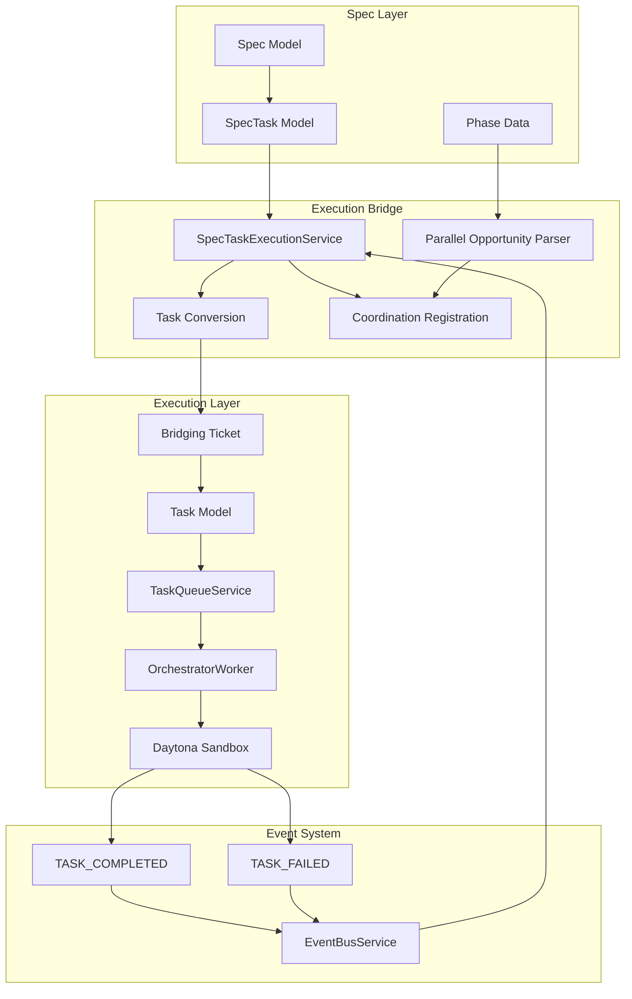
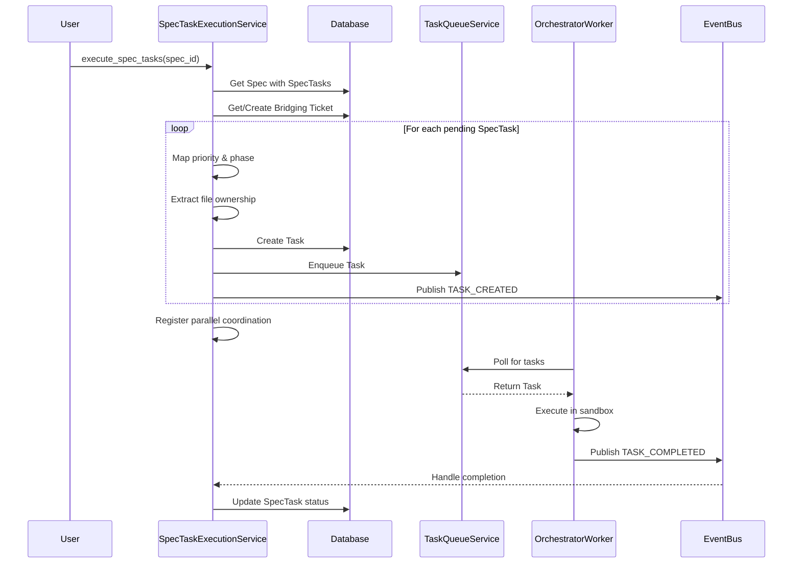
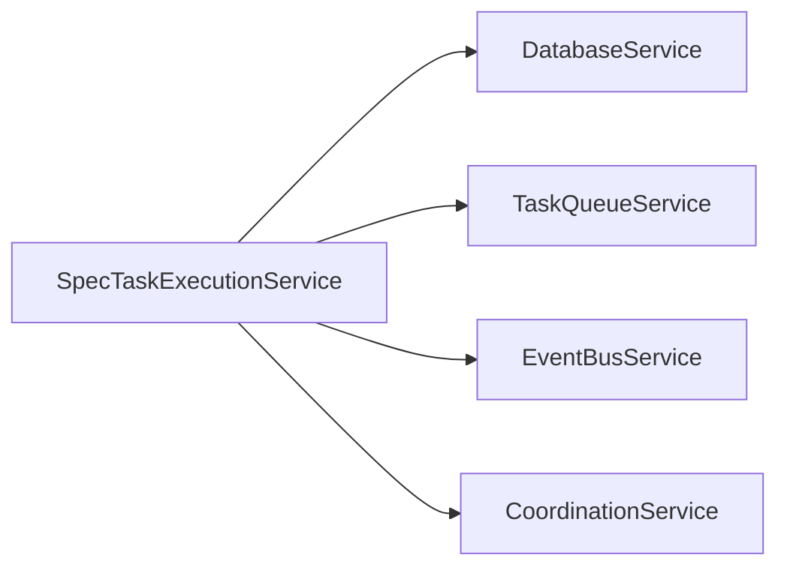

# Spec Task Execution Service Design Document

**Created:** 2026-04-22  
**Status:** Active  
**Purpose:** Bridge between spec-driven development (SpecTasks) and the execution system (Tasks + TaskQueueService + Daytona sandboxes)  
**Related Docs:** [Task Queue](./task_queue.md), [Orchestrator Service](./orchestrator_service.md), [Coordination Service](./coordination_service.md)

---

## 1. Architecture Overview

The SpecTaskExecutionService bridges the gap between spec-driven development and the sandbox execution system. It converts SpecTasks (from the spec-driven planning phase) into executable Tasks that can be picked up by the TaskQueueService and executed in Daytona sandboxes.

### 1.1 High-Level Architecture



### 1.2 Execution Flow



---

## 2. Component Responsibilities

| Component | Responsibility | Key Operations |
|-----------|---------------|----------------|
| **SpecTaskExecutionService** | Main service orchestrating spec-to-task conversion | `execute_spec_tasks()`, `get_execution_status()` |
| **Task Converter** | Converts SpecTasks to executable Tasks | `_convert_and_enqueue()`, priority/phase mapping |
| **Parallel Opportunity Parser** | Extracts parallel execution groups from spec | `_parse_parallel_opportunities()`, `_find_continuation_task()` |
| **Coordination Registrar** | Registers parallel groups with CoordinationService | `_register_parallel_coordination()` |
| **File Ownership Extractor** | Extracts file patterns from spec phase_data | `_extract_owned_files()` |
| **Event Handlers** | Listens for task completion/failure | `_handle_task_completed()`, `_handle_task_failed()` |
| **Bridging Ticket Manager** | Creates/retrieves tickets for spec execution | `_get_or_create_ticket()` |

---

## 3. System Boundaries

### 3.1 Inside System Boundaries

- SpecTask to Task conversion with priority/phase mapping
- Bridging Ticket creation and management
- File ownership pattern extraction from spec phase_data
- Parallel opportunity parsing from SYNC phase output
- Coordination registration for parallel task synthesis
- Event subscription for task completion/failure
- SpecTask status synchronization

### 3.2 Outside System Boundaries

- Actual sandbox execution (handled by OrchestratorWorker)
- Task queue management (handled by TaskQueueService)
- Parallel task synthesis (handled by SynthesisService via CoordinationService)
- Spec creation and planning (handled by SpecStateMachine)
- Phase gate validation (handled by PhaseGateService)

---

## 4. Data Models

### 4.1 Database Schema

```sql
-- Spec model (source)
CREATE TABLE specs (
    id UUID PRIMARY KEY DEFAULT gen_random_uuid(),
    title VARCHAR(255) NOT NULL,
    description TEXT,
    phase VARCHAR(50) NOT NULL,
    design_approved BOOLEAN DEFAULT FALSE,
    phase_data JSONB,  -- Contains parallel_opportunities, tasks with file ownership
    project_id UUID REFERENCES projects(id),
    user_id UUID REFERENCES users(id),
    created_at TIMESTAMP WITH TIME ZONE DEFAULT NOW(),
    updated_at TIMESTAMP WITH TIME ZONE DEFAULT NOW()
);

-- SpecTask model (source tasks)
CREATE TABLE spec_tasks (
    id VARCHAR(50) PRIMARY KEY,  -- TSK-001 format
    spec_id UUID NOT NULL REFERENCES specs(id) ON DELETE CASCADE,
    title VARCHAR(255) NOT NULL,
    description TEXT,
    phase VARCHAR(50) NOT NULL,  -- Requirements, Design, Implementation, Testing
    priority VARCHAR(20) NOT NULL,  -- critical, high, medium, low
    status VARCHAR(20) DEFAULT 'pending',  -- pending, in_progress, completed, blocked
    dependencies JSONB,  -- Array of spec_task_ids
    assigned_agent VARCHAR(255),
    created_at TIMESTAMP WITH TIME ZONE DEFAULT NOW(),
    updated_at TIMESTAMP WITH TIME ZONE DEFAULT NOW()
);

-- Task model (executable tasks - created by this service)
CREATE TABLE tasks (
    id UUID PRIMARY KEY DEFAULT gen_random_uuid(),
    ticket_id UUID NOT NULL REFERENCES tickets(id),
    phase_id VARCHAR(50) NOT NULL,  -- PHASE_IMPLEMENTATION, etc.
    task_type VARCHAR(50) NOT NULL,  -- implement_feature, write_tests
    title VARCHAR(255) NOT NULL,
    description TEXT,
    priority VARCHAR(20) NOT NULL,
    status VARCHAR(20) DEFAULT 'pending',
    dependencies JSONB,  -- {depends_on: [task_ids]}
    owned_files JSONB,  -- File ownership patterns for conflict detection
    result JSONB,  -- Contains spec_task_id link back to SpecTask
    created_at TIMESTAMP WITH TIME ZONE DEFAULT NOW(),
    updated_at TIMESTAMP WITH TIME ZONE DEFAULT NOW()
);

-- Ticket model (bridging entity)
CREATE TABLE tickets (
    id UUID PRIMARY KEY DEFAULT gen_random_uuid(),
    title VARCHAR(255) NOT NULL,
    description TEXT,
    phase_id VARCHAR(50) NOT NULL,
    status VARCHAR(50) NOT NULL,
    priority VARCHAR(20) NOT NULL,
    project_id UUID REFERENCES projects(id),
    user_id UUID REFERENCES users(id),
    context JSONB  -- Contains spec_id reference
);
```

### 4.2 Pydantic Models

```python
from pydantic import BaseModel, Field
from dataclasses import dataclass, field
from typing import Optional, List, Dict

class ExecutionStats(BaseModel):
    """Statistics from SpecTask execution conversion."""
    tasks_created: int = 0
    tasks_skipped: int = 0
    ticket_id: Optional[str] = None
    parallel_groups_created: int = 0
    errors: List[str] = Field(default_factory=list)

class ExecutionResult(BaseModel):
    """Result of SpecTask execution initiation."""
    success: bool
    message: str
    stats: ExecutionStats = Field(default_factory=ExecutionStats)

@dataclass
class ParallelGroup:
    """A group of tasks that can run in parallel with a continuation."""
    source_task_ids: List[str]
    continuation_task_id: Optional[str]
    description: str
    merge_strategy: str = "combine"

# Phase mapping constants
PRIORITY_MAP = {
    "critical": "CRITICAL",
    "high": "HIGH",
    "medium": "MEDIUM",
    "low": "LOW",
}

PHASE_MAP = {
    "Requirements": "PHASE_IMPLEMENTATION",
    "Design": "PHASE_IMPLEMENTATION",
    "Implementation": "PHASE_IMPLEMENTATION",
    "Testing": "PHASE_INTEGRATION",
    "Done": "PHASE_REFACTORING",
}
```

---

## 5. API Surface

### 5.1 Service Methods

| Method | Signature | Description |
|--------|-------------|-------------|
| `execute_spec_tasks` | `(spec_id: str, task_ids: Optional[List[str]] = None) -> ExecutionResult` | Main entry point - converts and enqueues SpecTasks |
| `get_execution_status` | `(spec_id: str) -> dict` | Returns task counts by status and progress percentage |
| `subscribe_to_completions` | `() -> None` | Subscribes to task completion events |

### 5.2 Internal Methods

| Method | Purpose |
|--------|---------|
| `_get_or_create_ticket` | Gets existing or creates bridging Ticket for Spec |
| `_convert_and_enqueue` | Converts single SpecTask to Task and enqueues |
| `_extract_owned_files` | Extracts file ownership patterns from spec phase_data |
| `_parse_parallel_opportunities` | Parses parallel groups from SYNC phase output |
| `_find_continuation_task` | Finds continuation task in dependency graph |
| `_register_parallel_coordination` | Registers parallel groups with CoordinationService |
| `_handle_task_completed` | Event handler for task completion |
| `_handle_task_failed` | Event handler for task failure |

### 5.3 FastAPI Routes Using This Service

```python
# Routes typically found in api/routes/specs.py
@router.post("/{spec_id}/execute")
async def execute_spec(
    spec_id: str,
    task_ids: Optional[List[str]] = None,
    service: SpecTaskExecutionService = Depends(get_spec_task_execution_service)
):
    """Execute spec tasks via sandbox system."""
    result = await service.execute_spec_tasks(spec_id, task_ids)
    return result

@router.get("/{spec_id}/execution-status")
async def get_execution_status(
    spec_id: str,
    service: SpecTaskExecutionService = Depends(get_spec_task_execution_service)
):
    """Get execution status for a spec."""
    return await service.get_execution_status(spec_id)
```

---

## 6. Integration Points

### 6.1 Services Called By SpecTaskExecutionService



| Service | Purpose | Key Methods Used |
|---------|---------|------------------|
| **DatabaseService** | Persistence for Specs, SpecTasks, Tasks, Tickets | `get_async_session()`, `get_session()` |
| **TaskQueueService** | Task enqueueing for sandbox execution | `enqueue_task()` |
| **EventBusService** | Event publishing and subscription | `publish()`, `subscribe()` |
| **CoordinationService** | Parallel task coordination | `register_join()` |

### 6.2 Services That Call SpecTaskExecutionService

| Service | Purpose |
|---------|---------|
| **SpecStateMachine** | Triggers execution when design is approved |
| **API Routes** | User-initiated spec execution |
| **OrchestratorWorker** | May trigger via events |

### 6.3 Event Types

| Event | Direction | Purpose |
|-------|-----------|---------|
| `SPEC_EXECUTION_STARTED` | Published | Notifies that spec execution has begun |
| `TASK_CREATED` | Published | Notifies that a Task has been created from SpecTask |
| `TASK_COMPLETED` | Subscribed | Updates SpecTask status to completed |
| `TASK_FAILED` | Subscribed | Updates SpecTask status to blocked |
| `coordination.join.created` | Published (via CoordinationService) | Registers parallel task joins |

---

## 7. Configuration Parameters

### 7.1 YAML Configuration

```yaml
# config/base.yaml
spec_execution:
  # Phase mapping configuration
  default_phase: "PHASE_IMPLEMENTATION"
  testing_phase: "PHASE_INTEGRATION"
  
  # Task type configuration
  default_task_type: "implement_feature"
  testing_task_type: "write_tests"
  
  # Parallel coordination
  enable_parallel_coordination: true
  
  # File ownership extraction
  max_owned_files_logged: 5
  
  # Execution defaults
  default_priority: "MEDIUM"
```

### 7.2 Environment Variables

| Variable | Default | Description |
|----------|---------|-------------|
| `SPEC_EXECUTION_DEFAULT_PHASE` | PHASE_IMPLEMENTATION | Default phase for converted tasks |
| `SPEC_EXECUTION_ENABLE_PARALLEL` | true | Enable parallel task coordination |

### 7.3 Constants (Code-Level)

```python
# Priority mapping from SpecTask to Task
PRIORITY_MAP = {
    "critical": "CRITICAL",
    "high": "HIGH",
    "medium": "MEDIUM",
    "low": "LOW",
}

# Phase mapping (all default to PHASE_IMPLEMENTATION for continuous mode)
PHASE_MAP = {
    "Requirements": "PHASE_IMPLEMENTATION",
    "Design": "PHASE_IMPLEMENTATION",
    "Implementation": "PHASE_IMPLEMENTATION",
    "Testing": "PHASE_INTEGRATION",
    "Done": "PHASE_REFACTORING",
}

# Original phase mapping (for reference)
ORIGINAL_PHASE_MAP = {
    "Requirements": "PHASE_INITIAL",
    "Design": "PHASE_INITIAL",
    "Implementation": "PHASE_IMPLEMENTATION",
    "Testing": "PHASE_INTEGRATION",
    "Done": "PHASE_REFACTORING",
}
```

---

## 8. Error Handling

### 8.1 Error Categories

| Category | Examples | Handling Strategy |
|----------|----------|-------------------|
| **Validation** | Spec not found, design not approved | Return ExecutionResult with success=False |
| **Conversion** | Invalid priority/phase mapping | Log warning, use defaults |
| **Database** | Connection errors, constraint violations | Log error, include in ExecutionStats.errors |
| **Coordination** | Parallel opportunity parse errors | Log warning, continue without coordination |
| **Event Handling** | Event bus unavailable | Graceful degradation (no-op) |

### 8.2 Error Handling Patterns

```python
# Validation error - returns structured result
if not spec:
    return ExecutionResult(
        success=False,
        message=f"Spec not found: {spec_id}",
        stats=stats,
    )

# Conversion error - logged but doesn't stop batch
for spec_task in tasks_to_execute:
    try:
        task = await self._convert_and_enqueue(session, spec, spec_task, ticket_id)
    except Exception as e:
        error_msg = f"Failed to convert task {spec_task.id}: {e}"
        stats.errors.append(error_msg)
        logger.error("spec_task_conversion_failed", ...)

# Coordination error - logged but execution continues
for group in parallel_groups:
    try:
        self.coordination.register_join(...)
    except Exception as e:
        logger.error("parallel_coordination_registration_failed", ...)
```

### 8.3 Safeguards

| Safeguard | Purpose |
|-----------|---------|
| Design approval check | Prevents execution of unapproved specs |
| Pending status filter | Only converts pending SpecTasks |
| Duplicate ticket detection | Reuses existing bridging tickets |
| File ownership validation | Ensures valid glob patterns |
| Parallel group validation | Requires minimum 2 tasks for parallel groups |

---

## 9. Performance Characteristics

| Metric | Target | Notes |
|--------|--------|-------|
| Task conversion rate | > 100/sec | Batch conversion of SpecTasks |
| Parallel group parsing | < 100ms | Regex-based parsing |
| Event handling latency | < 50ms | Async event handlers |
| Database queries per spec | 3-5 | Spec fetch, ticket get/create, task inserts |

---

## 10. Future Enhancements

1. **Incremental Execution** - Execute only changed SpecTasks
2. **Dependency-Aware Ordering** - Respect complex dependency graphs
3. **Parallel Group Visualization** - Expose parallel opportunities to UI
4. **Execution Replay** - Re-run failed SpecTasks without re-conversion
5. **Smart Phase Mapping** - Auto-detect optimal phase based on task content

---

*Document Version: 1.0*  
*Last Updated: 2026-04-22*  
*Maintainer: OmoiOS Core Team*
