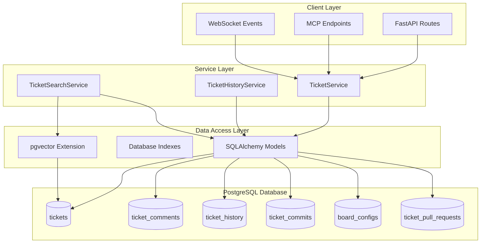
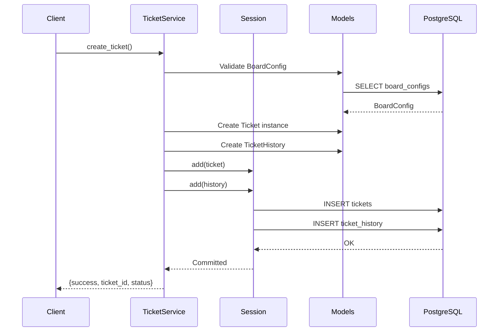
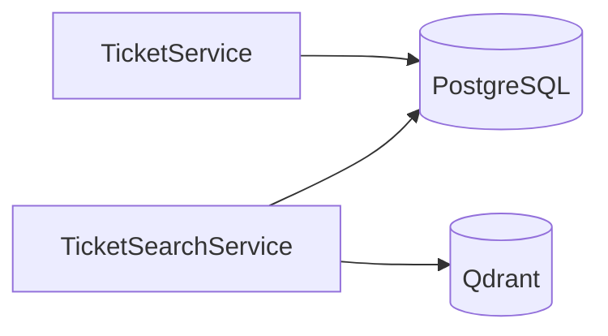

# Hephaestus Ticket Tracking System — PostgreSQL Design (SQLAlchemy)

**Created:** 2025-11-20  
**Status:** Active  
**Source File:** `backend/omoi_os/ticketing/models.py`, `backend/omoi_os/ticketing/services/`  
**Related Docs:** [Ticket Tracking Implementation Guide](./ticket_tracking_implementation_guide.md), [Ticket Workflow](./ticket_workflow.md), [Database Schema](../../architecture/11-database-schema.md)

---

## 1. Architecture Overview

The Hephaestus Ticket Tracking System provides a comprehensive PostgreSQL-backed ticketing infrastructure for workflow orchestration. It replaces the original SQLite implementation with a production-grade PostgreSQL solution using SQLAlchemy 2.x ORM, supporting complex queries, hybrid search, and high-concurrency scenarios.

### 1.1 High-Level Architecture



### 1.2 Data Flow Architecture



---

## 2. Component Responsibilities

| Component | Responsibility | Key Operations |
|-----------|---------------|----------------|
| **TicketService** | Core ticket CRUD and lifecycle management | `create_ticket()`, `update_ticket()`, `change_status()`, `resolve_ticket()` |
| **TicketHistoryService** | Audit trail and change tracking | `record_change()`, `record_status_transition()`, `get_ticket_history()` |
| **TicketSearchService** | Hybrid search (semantic + keyword) | `semantic_search()`, `search_by_keywords()`, `hybrid_search()` |
| **Ticket Model** | SQLAlchemy model for tickets table | Relationships, indexes, constraints |
| **TicketComment Model** | Comment storage with mentions/attachments | Linked to tickets via FK |
| **TicketHistory Model** | Immutable audit log entries | Auto-increment ID, timestamp indexed |
| **TicketCommit Model** | Git commit linkage to tickets | Unique constraint on (ticket_id, commit_sha) |
| **BoardConfig Model** | Kanban board configuration | Workflow-specific column definitions |
| **TicketPullRequest Model** | PR linkage for auto-completion | Tracks merge state |

---

## 3. System Boundaries

### 3.1 Inside System Boundaries

- PostgreSQL database with SQLAlchemy ORM models
- Synchronous session management (DB-bound)
- Ticket CRUD operations with automatic history recording
- Status transition validation against board configuration
- Blocker dependency tracking and cascade unblocking
- Hybrid search with RRF (Reciprocal Rank Fusion) algorithm
- Comment threading with mentions and attachments
- Git commit and PR linkage to tickets
- Board configuration per workflow

### 3.2 Outside System Boundaries

- Qdrant vector database integration (semantic search placeholder)
- Embedding generation service (external to this module)
- Git provider API interactions (GitHub/GitLab)
- Real-time event broadcasting (handled by EventBusService)
- Workflow orchestration logic (handled by TicketWorkflow)
- Agent execution (handled by AgentExecutor)

---

## 4. Data Models

### 4.1 Database Schema

```sql
-- Core tickets table
CREATE TABLE tickets (
    id VARCHAR PRIMARY KEY,
    workflow_id VARCHAR NOT NULL,
    created_by_agent_id VARCHAR NOT NULL,
    assigned_agent_id VARCHAR,
    title VARCHAR(500) NOT NULL,
    description TEXT NOT NULL,
    ticket_type VARCHAR(50) NOT NULL,
    priority VARCHAR(20) NOT NULL,
    status VARCHAR(50) NOT NULL,
    created_at TIMESTAMP WITH TIME ZONE NOT NULL DEFAULT NOW(),
    updated_at TIMESTAMP WITH TIME ZONE NOT NULL DEFAULT NOW(),
    started_at TIMESTAMP WITH TIME ZONE,
    completed_at TIMESTAMP WITH TIME ZONE,
    resolved_at TIMESTAMP WITH TIME ZONE,
    parent_ticket_id VARCHAR REFERENCES tickets(id),
    related_task_ids JSONB,
    related_ticket_ids JSONB,
    tags JSONB,
    embedding JSONB,
    embedding_id VARCHAR,
    embedding_vector VECTOR(1536),
    blocked_by_ticket_ids JSONB,
    is_resolved BOOLEAN NOT NULL DEFAULT FALSE
);

-- Comments on tickets
CREATE TABLE ticket_comments (
    id VARCHAR PRIMARY KEY,
    ticket_id VARCHAR NOT NULL REFERENCES tickets(id) ON DELETE CASCADE,
    agent_id VARCHAR NOT NULL,
    comment_text TEXT NOT NULL,
    comment_type VARCHAR(50),
    mentions JSONB,
    attachments JSONB,
    created_at TIMESTAMP WITH TIME ZONE NOT NULL DEFAULT NOW(),
    updated_at TIMESTAMP WITH TIME ZONE,
    is_edited BOOLEAN NOT NULL DEFAULT FALSE
);

-- Audit history (immutable log)
CREATE TABLE ticket_history (
    id BIGSERIAL PRIMARY KEY,
    ticket_id VARCHAR NOT NULL REFERENCES tickets(id) ON DELETE CASCADE,
    agent_id VARCHAR NOT NULL,
    change_type VARCHAR(50) NOT NULL,
    field_name VARCHAR(100),
    old_value TEXT,
    new_value TEXT,
    change_description TEXT,
    change_metadata JSONB,
    changed_at TIMESTAMP WITH TIME ZONE NOT NULL DEFAULT NOW()
);

-- Linked commits
CREATE TABLE ticket_commits (
    id VARCHAR PRIMARY KEY,
    ticket_id VARCHAR NOT NULL REFERENCES tickets(id) ON DELETE CASCADE,
    agent_id VARCHAR NOT NULL,
    commit_sha VARCHAR(64) NOT NULL,
    commit_message TEXT NOT NULL,
    commit_timestamp TIMESTAMP WITH TIME ZONE NOT NULL,
    files_changed INTEGER,
    insertions INTEGER,
    deletions INTEGER,
    files_list JSONB,
    linked_at TIMESTAMP WITH TIME ZONE NOT NULL DEFAULT NOW(),
    link_method VARCHAR(50),
    UNIQUE(ticket_id, commit_sha)
);

-- Board configuration per workflow
CREATE TABLE board_configs (
    id VARCHAR PRIMARY KEY,
    workflow_id VARCHAR UNIQUE NOT NULL,
    name VARCHAR(200) NOT NULL,
    columns JSONB NOT NULL,
    ticket_types JSONB NOT NULL,
    default_ticket_type VARCHAR(50),
    initial_status VARCHAR(50) NOT NULL,
    settings JSONB,
    created_at TIMESTAMP WITH TIME ZONE NOT NULL DEFAULT NOW(),
    updated_at TIMESTAMP WITH TIME ZONE NOT NULL DEFAULT NOW()
);

-- Pull request linkage
CREATE TABLE ticket_pull_requests (
    id VARCHAR PRIMARY KEY,
    ticket_id VARCHAR NOT NULL REFERENCES tickets(id) ON DELETE CASCADE,
    pr_number INTEGER NOT NULL,
    pr_title VARCHAR(500) NOT NULL,
    pr_body TEXT,
    head_branch VARCHAR(200) NOT NULL,
    base_branch VARCHAR(200) NOT NULL,
    repo_owner VARCHAR(200) NOT NULL,
    repo_name VARCHAR(200) NOT NULL,
    state VARCHAR(20) NOT NULL DEFAULT 'open',
    html_url VARCHAR(500) NOT NULL,
    created_at TIMESTAMP WITH TIME ZONE NOT NULL DEFAULT NOW(),
    merged_at TIMESTAMP WITH TIME ZONE,
    closed_at TIMESTAMP WITH TIME ZONE,
    github_user VARCHAR(200) NOT NULL,
    merge_commit_sha VARCHAR(64),
    UNIQUE(ticket_id, pr_number)
);
```

### 4.2 SQLAlchemy Models

```python
from sqlalchemy import (
    BigInteger, Boolean, DateTime, ForeignKey, 
    Index, Integer, String, Text
)
from sqlalchemy.dialects.postgresql import JSONB
from sqlalchemy.orm import DeclarativeBase, Mapped, mapped_column, relationship
from pgvector.sqlalchemy import Vector
from datetime import datetime
from typing import Optional

class Base(DeclarativeBase):
    pass

class Ticket(Base):
    """Core ticket model with workflow tracking."""
    __tablename__ = "tickets"
    __table_args__ = {"extend_existing": True}
    
    id: Mapped[str] = mapped_column(String, primary_key=True)
    workflow_id: Mapped[str] = mapped_column(String, index=True)
    created_by_agent_id: Mapped[str] = mapped_column(String, nullable=False)
    assigned_agent_id: Mapped[Optional[str]] = mapped_column(String, nullable=True, index=True)
    
    title: Mapped[str] = mapped_column(String(500), nullable=False)
    description: Mapped[str] = mapped_column(Text, nullable=False)
    ticket_type: Mapped[str] = mapped_column(String(50), nullable=False, index=True)
    priority: Mapped[str] = mapped_column(String(20), nullable=False, index=True)
    status: Mapped[str] = mapped_column(String(50), nullable=False, index=True)
    
    created_at: Mapped[datetime] = mapped_column(DateTime(timezone=True), nullable=False)
    updated_at: Mapped[datetime] = mapped_column(DateTime(timezone=True), nullable=False)
    started_at: Mapped[Optional[datetime]] = mapped_column(DateTime(timezone=True), nullable=True)
    completed_at: Mapped[Optional[datetime]] = mapped_column(DateTime(timezone=True), nullable=True)
    resolved_at: Mapped[Optional[datetime]] = mapped_column(DateTime(timezone=True), nullable=True)
    
    parent_ticket_id: Mapped[Optional[str]] = mapped_column(
        String, ForeignKey("tickets.id"), nullable=True
    )
    related_task_ids: Mapped[Optional[dict]] = mapped_column(JSONB, nullable=True)
    related_ticket_ids: Mapped[Optional[dict]] = mapped_column(JSONB, nullable=True)
    tags: Mapped[Optional[dict]] = mapped_column(JSONB, nullable=True)
    
    embedding: Mapped[Optional[dict]] = mapped_column(JSONB, nullable=True)
    embedding_id: Mapped[Optional[str]] = mapped_column(String, nullable=True)
    embedding_vector: Mapped[Optional[list[float]]] = mapped_column(Vector(1536), nullable=True)
    
    blocked_by_ticket_ids: Mapped[Optional[dict]] = mapped_column(JSONB, nullable=True)
    is_resolved: Mapped[bool] = mapped_column(Boolean, nullable=False, default=False, index=True)
    
    # Relationships
    parent: Mapped["Ticket"] = relationship(remote_side=[id])
    comments: Mapped[list["TicketComment"]] = relationship(
        back_populates="ticket", cascade="all, delete-orphan"
    )
    history: Mapped[list["TicketHistory"]] = relationship(
        back_populates="ticket", cascade="all, delete-orphan"
    )
    commits: Mapped[list["TicketCommit"]] = relationship(
        back_populates="ticket", cascade="all, delete-orphan"
    )

class TicketComment(Base):
    """Comments with mentions and attachments."""
    __tablename__ = "ticket_comments"
    
    id: Mapped[str] = mapped_column(String, primary_key=True)
    ticket_id: Mapped[str] = mapped_column(
        String, ForeignKey("tickets.id", ondelete="CASCADE"), index=True
    )
    agent_id: Mapped[str] = mapped_column(String, index=True)
    comment_text: Mapped[str] = mapped_column(Text, nullable=False)
    comment_type: Mapped[Optional[str]] = mapped_column(String(50), nullable=True)
    mentions: Mapped[Optional[dict]] = mapped_column(JSONB, nullable=True)
    attachments: Mapped[Optional[dict]] = mapped_column(JSONB, nullable=True)
    created_at: Mapped[datetime] = mapped_column(DateTime(timezone=True), nullable=False)
    updated_at: Mapped[Optional[datetime]] = mapped_column(DateTime(timezone=True), nullable=True)
    is_edited: Mapped[bool] = mapped_column(Boolean, nullable=False, default=False)
    
    ticket: Mapped["Ticket"] = relationship(back_populates="comments")

class TicketHistory(Base):
    """Immutable audit log."""
    __tablename__ = "ticket_history"
    
    id: Mapped[int] = mapped_column(BigInteger, primary_key=True, autoincrement=True)
    ticket_id: Mapped[str] = mapped_column(
        String, ForeignKey("tickets.id", ondelete="CASCADE"), index=True
    )
    agent_id: Mapped[str] = mapped_column(String, index=True)
    change_type: Mapped[str] = mapped_column(String(50), nullable=False, index=True)
    field_name: Mapped[Optional[str]] = mapped_column(String(100), nullable=True)
    old_value: Mapped[Optional[str]] = mapped_column(Text, nullable=True)
    new_value: Mapped[Optional[str]] = mapped_column(Text, nullable=True)
    change_description: Mapped[Optional[str]] = mapped_column(Text, nullable=True)
    change_metadata: Mapped[Optional[dict]] = mapped_column(JSONB, nullable=True)
    changed_at: Mapped[datetime] = mapped_column(
        DateTime(timezone=True), nullable=False, index=True
    )
    
    ticket: Mapped["Ticket"] = relationship(back_populates="history")

class TicketCommit(Base):
    """Git commit linkage."""
    __tablename__ = "ticket_commits"
    
    id: Mapped[str] = mapped_column(String, primary_key=True)
    ticket_id: Mapped[str] = mapped_column(
        String, ForeignKey("tickets.id", ondelete="CASCADE"), index=True
    )
    agent_id: Mapped[str] = mapped_column(String, index=True)
    commit_sha: Mapped[str] = mapped_column(String(64), index=True, nullable=False)
    commit_message: Mapped[str] = mapped_column(Text, nullable=False)
    commit_timestamp: Mapped[datetime] = mapped_column(DateTime(timezone=True), nullable=False)
    files_changed: Mapped[Optional[int]] = mapped_column(Integer, nullable=True)
    insertions: Mapped[Optional[int]] = mapped_column(Integer, nullable=True)
    deletions: Mapped[Optional[int]] = mapped_column(Integer, nullable=True)
    files_list: Mapped[Optional[dict]] = mapped_column(JSONB, nullable=True)
    linked_at: Mapped[datetime] = mapped_column(DateTime(timezone=True), nullable=False)
    link_method: Mapped[Optional[str]] = mapped_column(String(50), nullable=True)
    
    ticket: Mapped["Ticket"] = relationship(back_populates="commits")
    
    __table_args__ = (
        Index("idx_unique_ticket_commit", "ticket_id", "commit_sha", unique=True),
    )

class BoardConfig(Base):
    """Kanban board configuration per workflow."""
    __tablename__ = "board_configs"
    
    id: Mapped[str] = mapped_column(String, primary_key=True)
    workflow_id: Mapped[str] = mapped_column(String, unique=True, index=True)
    name: Mapped[str] = mapped_column(String(200), nullable=False)
    columns: Mapped[dict] = mapped_column(JSONB, nullable=False)
    ticket_types: Mapped[dict] = mapped_column(JSONB, nullable=False)
    default_ticket_type: Mapped[Optional[str]] = mapped_column(String(50), nullable=True)
    initial_status: Mapped[str] = mapped_column(String(50), nullable=False)
    settings: Mapped[Optional[dict]] = mapped_column(JSONB, nullable=True)
    created_at: Mapped[datetime] = mapped_column(DateTime(timezone=True), nullable=False)
    updated_at: Mapped[datetime] = mapped_column(DateTime(timezone=True), nullable=False)

class TicketPullRequest(Base):
    """Pull request linkage for auto-completion."""
    __tablename__ = "ticket_pull_requests"
    
    id: Mapped[str] = mapped_column(String, primary_key=True)
    ticket_id: Mapped[str] = mapped_column(
        String, ForeignKey("tickets.id", ondelete="CASCADE"), index=True
    )
    pr_number: Mapped[int] = mapped_column(Integer, nullable=False)
    pr_title: Mapped[str] = mapped_column(String(500), nullable=False)
    pr_body: Mapped[Optional[str]] = mapped_column(Text, nullable=True)
    head_branch: Mapped[str] = mapped_column(String(200), nullable=False)
    base_branch: Mapped[str] = mapped_column(String(200), nullable=False)
    repo_owner: Mapped[str] = mapped_column(String(200), nullable=False, index=True)
    repo_name: Mapped[str] = mapped_column(String(200), nullable=False, index=True)
    state: Mapped[str] = mapped_column(String(20), nullable=False, default="open", index=True)
    html_url: Mapped[str] = mapped_column(String(500), nullable=False)
    created_at: Mapped[datetime] = mapped_column(DateTime(timezone=True), nullable=False)
    merged_at: Mapped[Optional[datetime]] = mapped_column(DateTime(timezone=True), nullable=True)
    closed_at: Mapped[Optional[datetime]] = mapped_column(DateTime(timezone=True), nullable=True)
    github_user: Mapped[str] = mapped_column(String(200), nullable=False)
    merge_commit_sha: Mapped[Optional[str]] = mapped_column(String(64), nullable=True)
    
    ticket: Mapped["Ticket"] = relationship(back_populates="pull_requests")
    
    __table_args__ = (
        Index("idx_unique_ticket_pr", "ticket_id", "pr_number", unique=True),
        Index("idx_pr_repo", "repo_owner", "repo_name", "pr_number"),
    )
```

---

## 5. API Surface

### 5.1 TicketService Methods

| Method | Signature | Description |
|--------|-----------|-------------|
| `create_ticket` | `(workflow_id, agent_id, title, description, ticket_type, priority, initial_status, assigned_agent_id, parent_ticket_id, blocked_by_ticket_ids, tags, related_task_ids) -> dict` | Create new ticket with validation |
| `update_ticket` | `(ticket_id, agent_id, updates, update_comment) -> dict` | Update ticket fields with history |
| `change_status` | `(ticket_id, agent_id, new_status, comment, commit_sha) -> dict` | Transition status with blocker check |
| `add_comment` | `(ticket_id, agent_id, comment_text, comment_type, mentions, attachments) -> dict` | Add comment to ticket |
| `get_ticket` | `(ticket_id) -> dict` | Retrieve single ticket |
| `get_tickets` | `(workflow_id, filters, limit, offset, include_completed, sort_by, sort_order) -> dict` | List tickets with filtering |
| `link_commit` | `(ticket_id, agent_id, commit_sha, commit_message) -> dict` | Link git commit |
| `resolve_ticket` | `(ticket_id, agent_id, resolution_comment, commit_sha) -> dict` | Mark resolved and unblock dependents |

### 5.2 TicketHistoryService Methods

| Method | Signature | Description |
|--------|-----------|-------------|
| `record_change` | `(ticket_id, agent_id, change_type, old_value, new_value, change_metadata, field_name, change_description) -> None` | Generic change recording |
| `record_status_transition` | `(ticket_id, agent_id, from_status, to_status) -> None` | Status change shorthand |
| `link_commit` | `(ticket_id, agent_id, commit_sha, message) -> None` | Commit linkage history |
| `get_ticket_history` | `(ticket_id) -> list[dict]` | Retrieve full history |

### 5.3 TicketSearchService Methods

| Method | Signature | Description |
|--------|-----------|-------------|
| `semantic_search` | `(query_text, workflow_id, limit, filters) -> dict` | Vector similarity search (Qdrant) |
| `search_by_keywords` | `(keywords, workflow_id, filters) -> dict` | ILIKE text search |
| `hybrid_search` | `(query_text, workflow_id, limit, filters, include_comments, semantic_weight, keyword_weight) -> dict` | RRF combined search |
| `index_ticket` | `(ticket_id) -> None` | Add to vector index |
| `reindex_ticket` | `(ticket_id) -> None` | Update vector index |

---

## 6. Integration Points

### 6.1 Services Called By Ticket Tracking



| Service | Purpose | Key Methods Used |
|---------|---------|------------------|
| **PostgreSQL** | Primary data persistence | SQLAlchemy session operations |
| **Qdrant** | Vector storage for semantic search | `semantic_search()` (placeholder) |

### 6.2 Services That Call Ticket Tracking

| Service | Purpose |
|---------|---------|
| **TicketWorkflow** | Orchestrates ticket lifecycle |
| **OrchestratorWorker** | Creates and manages tickets |
| **API Routes** | HTTP endpoints for ticket operations |
| **MCP Server** | Model Context Protocol endpoints |

### 6.3 Event Types

| Event | Direction | Purpose |
|-------|-----------|---------|
| `ticket.created` | Published | New ticket created |
| `ticket.status_changed` | Published | Status transition occurred |
| `ticket.resolved` | Published | Ticket marked resolved |
| `ticket.blocked` | Published | Ticket blocked by dependencies |
| `ticket.unblocked` | Published | Dependencies resolved |

---

## 7. Configuration Parameters

### 7.1 Database Connection

```python
# Environment variables (loaded via pydantic-settings)
DB_HOST = "localhost"
DB_PORT = 15432
DB_NAME = "omoios"
DB_USER = "omoios"
DB_PASSWORD = "..."
DB_SSLMODE = "prefer"

# Connection URL
DATABASE_URL = f"postgresql+psycopg://{DB_USER}:{DB_PASSWORD}@{DB_HOST}:{DB_PORT}/{DB_NAME}?sslmode={DB_SSLMODE}"
```

### 7.2 Search Configuration

| Parameter | Default | Description |
|-----------|---------|-------------|
| `semantic_weight` | 0.6 | Weight for semantic search in RRF |
| `keyword_weight` | 0.4 | Weight for keyword search in RRF |
| `rrf_k` | 60 | RRF constant for rank fusion |
| `embedding_dim` | 1536 | Vector dimension (must match model) |

### 7.3 Board Configuration Schema

```json
{
  "columns": [
    {"id": "backlog", "name": "Backlog", "order": 0, "color": "#gray"},
    {"id": "in_progress", "name": "In Progress", "order": 1, "color": "#blue"},
    {"id": "done", "name": "Done", "order": 2, "color": "#green"}
  ],
  "ticket_types": [
    {"id": "feature", "name": "Feature", "color": "#purple"},
    {"id": "bug", "name": "Bug", "color": "#red"},
    {"id": "task", "name": "Task", "color": "#blue"}
  ],
  "initial_status": "backlog",
  "default_ticket_type": "task"
}
```

---

## 8. Error Handling

### 8.1 Error Categories

| Category | Examples | Handling Strategy |
|----------|----------|-------------------|
| **Validation** | Invalid status, missing board config | Raise `ValueError` with descriptive message |
| **Not Found** | Ticket doesn't exist | Raise `ValueError("Ticket not found")` |
| **Blocked** | Ticket has unresolved blockers | Return `{"success": False, "blocked": True}` |
| **Database** | Connection lost, constraint violation | SQLAlchemy exception propagation |
| **Search** | Qdrant unavailable | Return empty results, log warning |

### 8.2 Error Handling Patterns

```python
# Validation with ValueError
def change_status(self, ticket_id, agent_id, new_status, comment, commit_sha):
    ticket = self.session.get(Ticket, ticket_id)
    if not ticket:
        raise ValueError("Ticket not found")
    
    # Blocker check
    blocked_ids = (ticket.blocked_by_ticket_ids or {}).get("ids", [])
    if blocked_ids:
        return {
            "success": False,
            "ticket_id": ticket.id,
            "blocked": True,
            "blocking_ticket_ids": list(blocked_ids),
        }
    
    # ... proceed with status change

# History recording (never fails silently)
def record_change(self, ticket_id, agent_id, change_type, ...):
    self.session.add(
        TicketHistory(
            ticket_id=ticket_id,
            agent_id=agent_id,
            change_type=change_type,
            # ... all fields
        )
    )
```

### 8.3 Response Patterns

```python
# Success response
{
    "success": True,
    "ticket_id": "ticket-uuid",
    "status": "in_progress"
}

# Blocked response
{
    "success": False,
    "ticket_id": "ticket-uuid",
    "blocked": True,
    "blocking_ticket_ids": ["ticket-blocker-1", "ticket-blocker-2"]
}

# List response
{
    "success": True,
    "tickets": [...],
    "total_count": 42,
    "has_more": True
}
```

---

## 9. Performance Characteristics

| Metric | Target | Notes |
|--------|--------|-------|
| Ticket creation | < 50ms | Includes history write |
| Status transition | < 30ms | With blocker check |
| Keyword search | < 100ms | ILIKE on indexed columns |
| Hybrid search | < 500ms | Includes Qdrant round-trip |
| History retrieval | < 50ms | Indexed by ticket_id + timestamp |
| List with filters | < 100ms | B-tree indexes on all filter columns |

### 9.1 Database Indexes

```sql
-- Primary access patterns
CREATE INDEX idx_tickets_workflow_status ON tickets(workflow_id, status);
CREATE INDEX idx_tickets_created_at ON tickets(created_at);
CREATE INDEX idx_tickets_assigned ON tickets(assigned_agent_id);

-- History queries
CREATE INDEX idx_history_ticket_changed ON ticket_history(ticket_id, changed_at);

-- Comment retrieval
CREATE INDEX idx_comments_ticket_created ON ticket_comments(ticket_id, created_at);

-- Unique constraints
CREATE UNIQUE INDEX idx_unique_ticket_commit ON ticket_commits(ticket_id, commit_sha);
CREATE UNIQUE INDEX idx_unique_ticket_pr ON ticket_pull_requests(ticket_id, pr_number);
```

---

## 10. Future Enhancements

1. **Async Support** - Convert to AsyncSession for non-blocking I/O
2. **Full-Text Search** - PostgreSQL tsvector for advanced keyword search
3. **Materialized Views** - Pre-computed search projections
4. **Partitioning** - Table partitioning by workflow_id for scale
5. **Caching Layer** - Redis cache for hot tickets
6. **Webhook Integration** - Automatic PR status synchronization
7. **Analytics** - Time-in-status metrics and reporting

---

## 11. Related Documentation

- [Ticket Tracking Implementation Guide](./ticket_tracking_implementation_guide.md) - Setup and migration guide
- [Ticket Workflow](./ticket_workflow.md) - Workflow orchestration
- [Database Schema](../../architecture/11-database-schema.md) - Complete database documentation
- [API Route Catalog](../../architecture/13-api-route-catalog.md) - HTTP endpoints

---

*Document Version: 2.0*  
*Last Updated: 2026-04-22*  
*Maintainer: OmoiOS Core Team*
