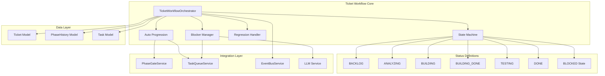
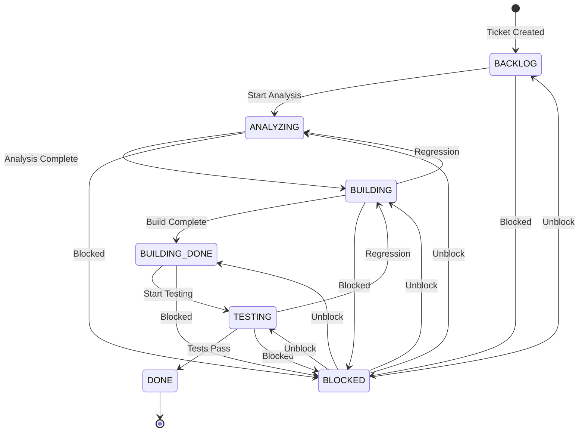
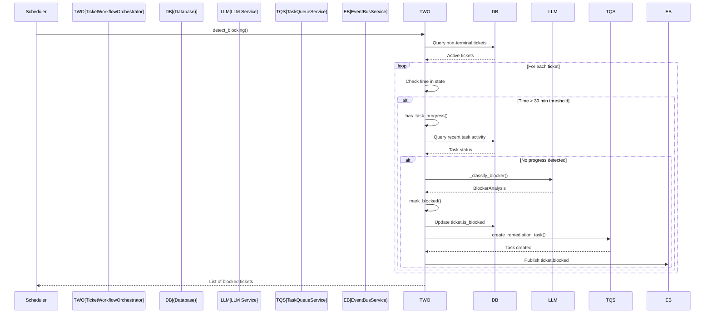
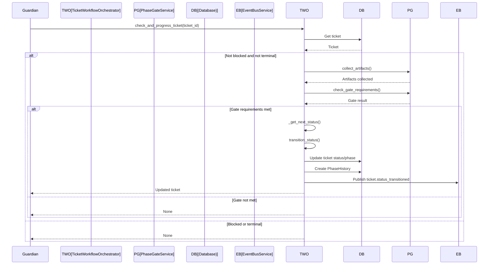
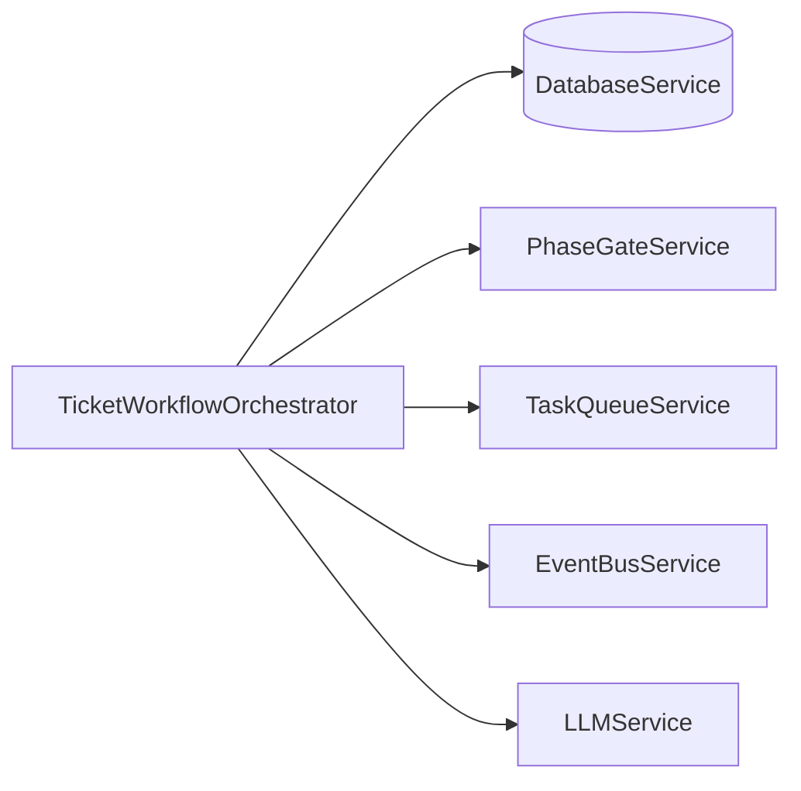

# Ticket Workflow Service Design Document

**Created:** 2026-04-22  
**Status:** Active  
**Source File:** `backend/omoi_os/services/ticket_workflow.py`  
**Related Docs:** [Phase Manager](./phase_manager.md), **Phase Gate Service**, **Ticket Status Model**

---

## 1. Architecture Overview

The Ticket Workflow Orchestrator enforces a Kanban-style state machine for ticket lifecycle management. It validates state transitions, orchestrates automatic phase progression based on gate criteria, manages ticket blocking/unblocking, and coordinates with the Task Queue and Phase Gate systems. The service implements human-in-the-loop patterns through approval gates and provides intelligent blocker classification using LLM analysis.

### 1.1 High-Level Architecture



### 1.2 State Machine Flow



### 1.3 Blocking Detection Flow



### 1.4 Automatic Progression Flow



---

## 2. Component Responsibilities

| Component | Responsibility | Key Operations |
|-----------|---------------|----------------|
| **TicketWorkflowOrchestrator** | Main service orchestrating ticket lifecycle | `transition_status()`, `check_and_progress_ticket()`, `mark_blocked()`, `unblock_ticket()` |
| **State Machine** | Enforces valid status transitions | `is_valid_transition()`, `BLOCKED_TRANSITIONS` validation |
| **Auto Progression** | Automatically advances tickets when gates pass | `check_and_progress_ticket()`, `_get_next_status()` |
| **Regression Handler** | Manages moving tickets back to previous states | `regress_ticket()`, regression context tracking |
| **Blocker Manager** | Detects, classifies, and manages blocked tickets | `detect_blocking()`, `mark_blocked()`, `unblock_ticket()`, `_classify_blocker()` |
| **Remediation Task Creator** | Spawns tasks to resolve blockers | `_create_remediation_task()` |

---

## 3. System Boundaries

### 3.1 Inside System Boundaries

- Kanban state machine enforcement (6 statuses: BACKLOG → ANALYZING → BUILDING → BUILDING_DONE → TESTING → DONE)
- Status transition validation with blocked state handling
- Phase-to-status and status-to-phase bidirectional mapping
- Automatic progression when phase gate criteria are met
- Regression handling with context preservation
- Blocking detection based on time thresholds (30 min default)
- Blocker classification using LLM analysis (dependency, waiting_on_clarification, failing_checks, environment)
- Remediation task auto-creation
- Phase history recording for audit trail
- Event publishing for state changes

### 3.2 Outside System Boundaries

- Phase gate criteria evaluation (handled by PhaseGateService)
- Task queue management (handled by TaskQueueService)
- Event bus implementation (handled by EventBusService)
- LLM analysis implementation (handled by LLMService)
- Ticket CRUD operations (handled by Ticket model/repository)
- Task execution (handled by agent workers)
- Human approval UI (handled by frontend)

---

## 4. Data Models

### 4.1 Database Schema

```sql
-- Tickets with workflow state
CREATE TABLE tickets (
    id UUID PRIMARY KEY DEFAULT gen_random_uuid(),
    title VARCHAR(255) NOT NULL,
    description TEXT,
    status VARCHAR(50) NOT NULL DEFAULT 'backlog',
    phase_id VARCHAR(50) NOT NULL DEFAULT 'PHASE_BACKLOG',
    previous_phase_id VARCHAR(50),
    
    -- Blocking state
    is_blocked BOOLEAN DEFAULT FALSE,
    blocked_reason VARCHAR(100),
    blocked_at TIMESTAMP WITH TIME ZONE,
    
    -- Context for regressions and metadata
    context JSONB DEFAULT '{}',
    
    -- Standard timestamps
    created_at TIMESTAMP WITH TIME ZONE DEFAULT NOW(),
    updated_at TIMESTAMP WITH TIME ZONE DEFAULT NOW(),
    deleted_at TIMESTAMP WITH TIME ZONE
);

CREATE INDEX idx_tickets_status ON tickets(status);
CREATE INDEX idx_tickets_phase_id ON tickets(phase_id);
CREATE INDEX idx_tickets_is_blocked ON tickets(is_blocked) WHERE is_blocked = TRUE;
CREATE INDEX idx_tickets_updated_at ON tickets(updated_at);

-- Phase history for audit trail
CREATE TABLE phase_histories (
    id UUID PRIMARY KEY DEFAULT gen_random_uuid(),
    ticket_id UUID NOT NULL REFERENCES tickets(id) ON DELETE CASCADE,
    from_phase VARCHAR(50) NOT NULL,
    to_phase VARCHAR(50) NOT NULL,
    transition_reason TEXT,
    transitioned_by VARCHAR(255),
    artifacts JSONB,
    created_at TIMESTAMP WITH TIME ZONE DEFAULT NOW()
);

CREATE INDEX idx_phase_histories_ticket_id ON phase_histories(ticket_id);
CREATE INDEX idx_phase_histories_created_at ON phase_histories(created_at);

-- Tasks linked to tickets
CREATE TABLE tasks (
    id UUID PRIMARY KEY DEFAULT gen_random_uuid(),
    ticket_id UUID NOT NULL REFERENCES tickets(id) ON DELETE CASCADE,
    phase_id VARCHAR(50) NOT NULL,
    task_type VARCHAR(50) NOT NULL,
    status VARCHAR(50) NOT NULL DEFAULT 'pending',
    description TEXT,
    priority INTEGER DEFAULT 0,
    created_at TIMESTAMP WITH TIME ZONE DEFAULT NOW(),
    started_at TIMESTAMP WITH TIME ZONE,
    completed_at TIMESTAMP WITH TIME ZONE,
    result JSONB
);

CREATE INDEX idx_tasks_ticket_id ON tasks(ticket_id);
CREATE INDEX idx_tasks_status ON tasks(status);
CREATE INDEX idx_tasks_completed_at ON tasks(completed_at);
```

### 4.2 Pydantic Models

```python
from pydantic import BaseModel, Field
from typing import Optional, List, Dict, Any
from enum import StrEnum
from datetime import datetime
from uuid import UUID

class TicketStatus(StrEnum):
    """Kanban ticket statuses."""
    BACKLOG = "backlog"
    ANALYZING = "analyzing"
    BUILDING = "building"
    BUILDING_DONE = "building_done"
    TESTING = "testing"
    DONE = "done"

class BlockerType(StrEnum):
    """Types of blockers that can affect tickets."""
    DEPENDENCY = "dependency"
    WAITING_ON_CLARIFICATION = "waiting_on_clarification"
    FAILING_CHECKS = "failing_checks"
    ENVIRONMENT = "environment"

class BlockerAnalysis(BaseModel):
    """LLM-powered blocker classification result."""
    blocker_type: BlockerType
    confidence: float = Field(..., ge=0.0, le=1.0)
    explanation: str
    suggested_remediation: str
    unblocking_steps: List[str] = Field(default_factory=list)
    estimated_resolution_time: Optional[str] = None

class TransitionResult(BaseModel):
    """Result of a status transition attempt."""
    success: bool
    ticket_id: UUID
    from_status: str
    to_status: str
    from_phase: str
    to_phase: str
    reason: Optional[str] = None
    initiated_by: Optional[str] = None
    timestamp: datetime

class RegressionContext(BaseModel):
    """Context preserved when ticket regresses."""
    regressed_from: str
    regressed_to: str
    validation_feedback: Optional[str] = None
    regressed_at: datetime
    regression_count: int = 1

class BlockingDetectionResult(BaseModel):
    """Result of blocking detection scan."""
    ticket_id: UUID
    should_block: bool
    blocker_type: Optional[str] = None
    time_in_state_minutes: float
    confidence: float = Field(0.0, ge=0.0, le=1.0)

class TicketWorkflowConfig(BaseModel):
    """Configuration for ticket workflow orchestrator."""
    blocking_threshold_minutes: int = 30
    max_retry_attempts: int = 3
    enable_auto_progression: bool = True
    enable_auto_blocking: bool = True
    enable_remediation_tasks: bool = True
```

### 4.3 Status Transition Matrix

```python
# Valid transitions (is_valid_transition function)
TRANSITION_MATRIX = {
    "backlog": ["analyzing", "blocked"],
    "analyzing": ["building", "blocked", "backlog"],  # Can regress
    "building": ["building_done", "blocked", "analyzing"],  # Can regress
    "building_done": ["testing", "blocked", "building"],  # Can regress
    "testing": ["done", "blocked", "building"],  # Can regress to building
    "done": [],  # Terminal state
    "blocked": ["backlog", "analyzing", "building", "building_done", "testing"],  # Unblock
}

# Blocked transitions (allowed when unblocking)
BLOCKED_TRANSITIONS = ["backlog", "analyzing", "building", "building_done", "testing"]

# Phase to status mapping
PHASE_TO_STATUS = {
    "PHASE_BACKLOG": "backlog",
    "PHASE_REQUIREMENTS": "analyzing",
    "PHASE_DESIGN": "analyzing",
    "PHASE_IMPLEMENTATION": "building",
    "PHASE_TESTING": "testing",
    "PHASE_DEPLOYMENT": "building_done",
    "PHASE_DONE": "done",
}

# Status to phase mapping (reverse)
STATUS_TO_PHASE = {
    "backlog": "PHASE_BACKLOG",
    "analyzing": "PHASE_REQUIREMENTS",
    "building": "PHASE_IMPLEMENTATION",
    "building_done": "PHASE_DEPLOYMENT",
    "testing": "PHASE_TESTING",
    "done": "PHASE_DONE",
}

# Automatic progression chain
PROGRESSION_CHAIN = {
    "backlog": "analyzing",
    "analyzing": "building",
    "building": "building_done",
    "building_done": "testing",
    "testing": "done",
}
```

---

## 5. API Surface

### 5.1 State Transition Methods

| Method | Signature | Description |
|--------|-----------|-------------|
| `transition_status` | `(ticket_id, to_status, initiated_by=None, reason=None, force=False) -> Ticket` | Main transition method with validation |
| `check_and_progress_ticket` | `(ticket_id: str) -> Optional[Ticket]` | Auto-advance if phase gate criteria met |
| `regress_ticket` | `(ticket_id, to_status, validation_feedback=None, initiated_by=None) -> Ticket` | Move ticket back to previous state |

### 5.2 Blocking Management Methods

| Method | Signature | Description |
|--------|-----------|-------------|
| `mark_blocked` | `(ticket_id, blocker_type, suggested_remediation=None, initiated_by=None) -> Ticket` | Mark ticket as blocked |
| `unblock_ticket` | `(ticket_id: str, initiated_by=None) -> Ticket` | Unblock and return to previous phase |
| `detect_blocking` | `() -> List[Dict[str, Any]]` | Scan for tickets that should be blocked |

### 5.3 Internal Helper Methods

| Method | Signature | Description |
|--------|-----------|-------------|
| `_get_next_status` | `(current_status: str) -> Optional[str]` | Get next status in progression chain |
| `_has_task_progress` | `(session, ticket_id: str, threshold: timedelta) -> bool` | Check for recent task activity |
| `_classify_blocker` | `(session, ticket: Ticket) -> BlockerAnalysis` | LLM-based blocker classification |
| `_classify_blocker_sync` | `(session, ticket: Ticket) -> str` | Rule-based blocker classification fallback |
| `_create_remediation_task` | `(ticket_id: str, blocker_type: str) -> None` | Create task to resolve blocker |

### 5.4 FastAPI Route Integration

```python
from fastapi import APIRouter, Depends, HTTPException
from typing import Optional

router = APIRouter()

@router.post("/tickets/{ticket_id}/transition")
async def transition_ticket(
    ticket_id: str,
    to_status: str,
    reason: Optional[str] = None,
    force: bool = False,
    workflow: TicketWorkflowOrchestrator = Depends(get_workflow_orchestrator)
):
    """Transition ticket to new status with validation."""
    try:
        ticket = workflow.transition_status(
            ticket_id=ticket_id,
            to_status=to_status,
            reason=reason,
            force=force
        )
        return ticket
    except InvalidTransitionError as e:
        raise HTTPException(400, detail=str(e))
    except TicketBlockedError as e:
        raise HTTPException(409, detail=str(e))

@router.post("/tickets/{ticket_id}/block")
async def block_ticket(
    ticket_id: str,
    blocker_type: str,
    suggested_remediation: Optional[str] = None,
    workflow: TicketWorkflowOrchestrator = Depends(get_workflow_orchestrator)
):
    """Mark ticket as blocked."""
    ticket = workflow.mark_blocked(
        ticket_id=ticket_id,
        blocker_type=blocker_type,
        suggested_remediation=suggested_remediation
    )
    return ticket

@router.post("/tickets/{ticket_id}/unblock")
async def unblock_ticket(
    ticket_id: str,
    workflow: TicketWorkflowOrchestrator = Depends(get_workflow_orchestrator)
):
    """Unblock ticket."""
    ticket = workflow.unblock_ticket(ticket_id=ticket_id)
    return ticket

@router.post("/tickets/{ticket_id}/regress")
async def regress_ticket(
    ticket_id: str,
    to_status: str,
    validation_feedback: Optional[str] = None,
    workflow: TicketWorkflowOrchestrator = Depends(get_workflow_orchestrator)
):
    """Regress ticket to previous state."""
    try:
        ticket = workflow.regress_ticket(
            ticket_id=ticket_id,
            to_status=to_status,
            validation_feedback=validation_feedback
        )
        return ticket
    except InvalidTransitionError as e:
        raise HTTPException(400, detail=str(e))

@router.get("/workflow/detect-blocking")
async def detect_blocking(
    workflow: TicketWorkflowOrchestrator = Depends(get_workflow_orchestrator)
):
    """Detect tickets that should be marked as blocked."""
    results = workflow.detect_blocking()
    return {"detected": results}
```

---

## 6. Integration Points

### 6.1 Services Called By TicketWorkflowOrchestrator



| Service | Purpose | Key Methods Used |
|---------|---------|------------------|
| **DatabaseService** | Ticket, PhaseHistory, Task persistence | `get_session()` |
| **PhaseGateService** | Gate criteria validation, artifact collection | `check_gate_requirements()`, `collect_artifacts()` |
| **TaskQueueService** | Remediation task creation | `create_task()` |
| **EventBusService** | Publishing workflow events | `publish()` |
| **LLMService** | Blocker classification | `structured_output()` |
| **TemplateService** | Prompt rendering | `render()`, `render_system_prompt()` |

### 6.2 Services That Call TicketWorkflowOrchestrator

| Service | Purpose |
|---------|---------|
| **OrchestratorWorker** | Automatic progression checks |
| **IntelligentGuardian** | Blocking detection, regression decisions |
| **API Routes** | User-initiated transitions |
| **PhaseManager** | Phase transition coordination |
| **Scheduler** | Periodic blocking detection |

### 6.3 Event Types

| Event | Direction | Purpose |
|-------|-----------|---------|
| `ticket.status_transitioned` | Published | Status change notification |
| `ticket.blocked` | Published | Ticket marked as blocked |
| `ticket.unblocked` | Published | Ticket unblocked |
| `ticket.regressed` | Published | Ticket moved back to previous state |
| `task.completed` | Subscribed | Triggers progression check |
| `gate.criteria_met` | Subscribed | Triggers auto-progression |

---

## 7. Configuration Parameters

### 7.1 Class Constants

```python
class TicketWorkflowOrchestrator:
    # Blocking detection threshold (REQ-TKT-BL-001)
    BLOCKING_THRESHOLD_MINUTES = 30
    
    # Maximum retry attempts for operations
    MAX_RETRY_ATTEMPTS = 3
    
    # Phase to status mapping
    PHASE_TO_STATUS: Dict[str, str] = {
        "PHASE_BACKLOG": "backlog",
        "PHASE_REQUIREMENTS": "analyzing",
        "PHASE_DESIGN": "analyzing",
        "PHASE_IMPLEMENTATION": "building",
        "PHASE_TESTING": "testing",
        "PHASE_DEPLOYMENT": "building_done",
        "PHASE_DONE": "done",
    }
    
    # Status to phase mapping (reverse lookup)
    STATUS_TO_PHASE: Dict[str, str] = {
        "backlog": "PHASE_BACKLOG",
        "analyzing": "PHASE_REQUIREMENTS",
        "building": "PHASE_IMPLEMENTATION",
        "building_done": "PHASE_DEPLOYMENT",
        "testing": "PHASE_TESTING",
        "done": "PHASE_DONE",
    }
```

### 7.2 Environment Variables

| Variable | Default | Description |
|----------|---------|-------------|
| `WORKFLOW_BLOCKING_THRESHOLD_MINUTES` | 30 | Time before considering ticket blocked |
| `WORKFLOW_MAX_RETRY_ATTEMPTS` | 3 | Retry attempts for failed operations |
| `WORKFLOW_ENABLE_AUTO_PROGRESSION` | true | Enable automatic phase advancement |
| `WORKFLOW_ENABLE_AUTO_BLOCKING` | true | Enable automatic blocking detection |
| `WORKFLOW_ENABLE_REMEDIATION_TASKS` | true | Auto-create tasks for blockers |

### 7.3 Remediation Task Mapping

```python
# Task descriptions by blocker type
REMEDIATION_TASKS = {
    "dependency": "Resolve dependency blocking ticket progress",
    "waiting_on_clarification": "Request clarification to unblock ticket",
    "failing_checks": "Fix failing checks to unblock ticket",
    "environment": "Fix environment issues to unblock ticket",
}

# Task priorities match ticket priority
TASK_PRIORITY_MAP = {
    "critical": 10,
    "high": 5,
    "medium": 3,
    "low": 1,
}
```

---

## 8. Error Handling

### 8.1 Error Categories

| Category | Examples | Handling Strategy |
|----------|----------|-------------------|
| **Invalid Transition** | backlog → done directly | Raise `InvalidTransitionError` with allowed transitions |
| **Blocked Ticket** | Transition while blocked | Raise `TicketBlockedError` with unblock instructions |
| **Not Found** | Ticket ID doesn't exist | Raise `ValueError` with clear message |
| **Gate Not Met** | Phase criteria incomplete | Return `None` from progression check |
| **LLM Failure** | Blocker classification fails | Fall back to rule-based classification |
| **Task Creation Failure** | Remediation task fails | Fail silently (best effort) |

### 8.2 Error Handling Patterns

```python
# Transition validation with blocked state check
if not force:
    # Check if blocked first
    if ticket.is_blocked and to_status not in BLOCKED_TRANSITIONS:
        raise TicketBlockedError(
            f"Ticket is blocked (reason: {ticket.blocked_reason}), "
            f"cannot transition to {to_status}. "
            f"Must transition to an unblock state: {BLOCKED_TRANSITIONS}"
        )
    
    # Validate transition
    if not is_valid_transition(from_status, to_status, is_blocked=ticket.is_blocked):
        raise InvalidTransitionError(
            f"Invalid transition from {from_status} to {to_status} "
            f"(blocked={ticket.is_blocked})"
        )

# Regression validation
if not is_valid_transition(ticket.status, to_status, is_blocked=ticket.is_blocked):
    raise InvalidTransitionError(
        f"Invalid regression from {ticket.status} to {to_status}"
    )

# Remediation task creation (best effort)
try:
    self.task_queue.create_task(...)
except Exception:
    # Fail silently - remediation task creation is best effort
    pass
```

### 8.3 Regression Context Preservation

```python
# Store regression context in ticket
regression_context = {
    "regressed_from": ticket.status,
    "regressed_to": to_status,
    "validation_feedback": validation_feedback,
    "regressed_at": utc_now().isoformat(),
}

current_context = ticket.context or {}
if "regressions" not in current_context:
    current_context["regressions"] = []
current_context["regressions"].append(regression_context)

ticket.context = current_context
```

---

## 9. Human-in-the-Loop Patterns

### 9.1 Approval Gates

The workflow supports human approval at key transitions:

1. **Phase Gate Approval**: Human reviews artifacts before auto-progression
2. **Blocker Resolution**: Human intervention required for certain blocker types
3. **Regression Approval**: Human confirms regression is appropriate
4. **Force Transition**: Guardian/admin can force transitions with `force=True`

### 9.2 Blocker Classification Confidence

```python
class BlockerAnalysis(BaseModel):
    blocker_type: BlockerType
    confidence: float  # 0.0 - 1.0
    explanation: str
    suggested_remediation: str
    unblocking_steps: List[str]
    estimated_resolution_time: Optional[str]

# High confidence (>0.8): Auto-classify and create remediation task
# Medium confidence (0.5-0.8): Flag for human review
# Low confidence (<0.5): Use rule-based fallback
```

### 9.3 Notification Triggers

| Event | Notification | Recipient |
|-------|------------|-----------|
| Ticket blocked | Immediate | Ticket owner, watchers |
| Regression | Immediate | Ticket owner, team lead |
| Auto-progression | Summary | Ticket owner (batched) |
| Gate criteria met | Digest | Reviewers (hourly) |

---

## 10. Performance Characteristics

| Metric | Target | Notes |
|--------|--------|-------|
| Transition validation | < 5ms | In-memory state machine check |
| Status transition | < 50ms | DB update + history record |
| Blocking detection (per ticket) | < 100ms | Task progress query |
| Full blocking scan | < 5s | All non-terminal tickets |
| Blocker classification | < 2s | LLM call (async) |
| Auto-progression check | < 100ms | Gate check + potential transition |
| Event publishing | < 5ms | Async fire-and-forget |

---

## 11. Future Enhancements

1. **Conditional Transitions** - Rules-based transition paths (e.g., skip testing for docs)
2. **Parallel States** - Support for tickets in multiple phases simultaneously
3. **Custom Workflows** - Per-project workflow configuration
4. **SLA Tracking** - Time-in-state alerts and escalation
5. **Predictive Blocking** - ML-based early warning before blocking
6. **Smart Routing** - Auto-assign tickets based on workload and expertise
7. **Workflow Analytics** - Cycle time, throughput, bottleneck analysis
8. **Integration Webhooks** - External system state synchronization

---

*Document Version: 1.0*  
*Last Updated: 2026-04-22*  
*Maintainer: OmoiOS Core Team*
