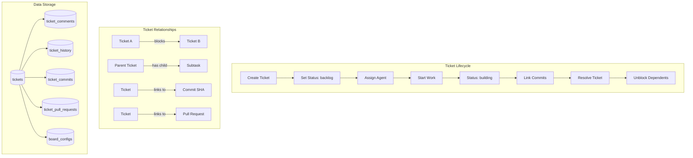
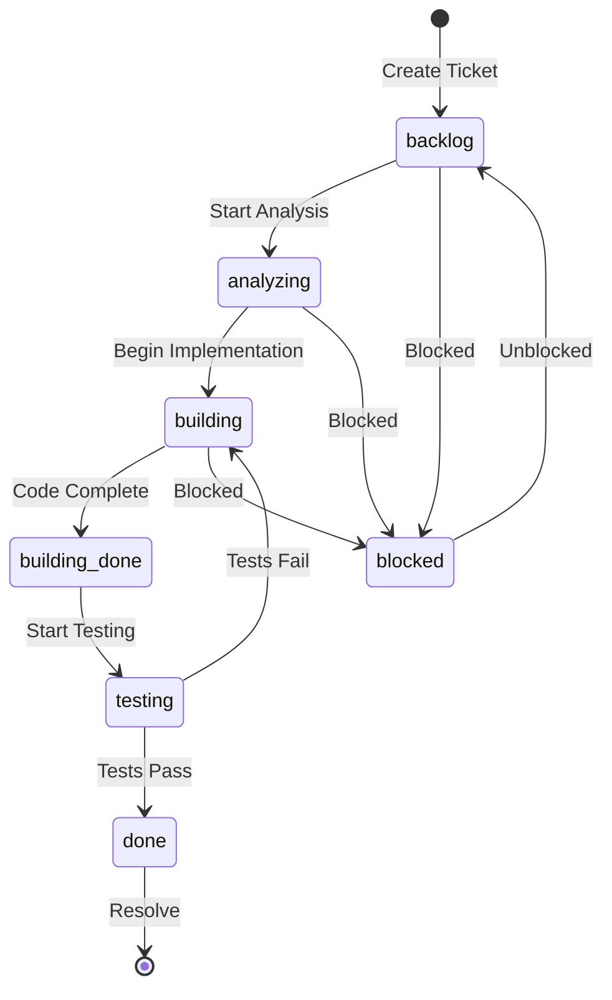

# Ticket Tracking SQLite Implementation Guide

**Created**: 2025-11-20  
**Updated**: 2025-04-22  
**Status**: Approved  
**Purpose**: Provides step-by-step instructions for implementing the Ticket Tracking System with SQLite. It complements the design in `docs/design/services/ticket_tracking_postgres.md`.

**Source Files**:
- `backend/omoi_os/ticketing/services/ticket_service.py` (440 lines)
- `backend/omoi_os/ticketing/models.py` (253 lines)
- `backend/omoi_os/ticketing/db.py` (89 lines)
- `backend/omoi_os/models/ticket.py` (177 lines)

**Related Documents**:
- [Ticket Tracking PostgreSQL](./services/ticket_tracking_postgres.md)
- [Ticket Tracking Implementation Guide](./services/ticket_tracking_implementation_guide.md)
- **Architecture: Ticket Tracking** (see Architecture documentation)

---

## Table of Contents

1. [Architecture Overview](#architecture-overview)
2. [Data Models](#data-models)
3. [Database Configuration](#database-configuration)
4. [API Surface](#api-surface)
5. [Integration Points](#integration-points)
6. [Configuration](#configuration)
7. [Related Documentation](#related-documentation)

---

## Architecture Overview

The Ticket Tracking System provides workflow orchestration for OmoiOS, managing tasks from creation through resolution. While the primary implementation uses PostgreSQL for production, this guide documents the SQLite implementation suitable for development, testing, and lightweight deployments.

### Key Design Principles

1. **Workflow Isolation**: Each workflow has its own ticket space via `workflow_id`
2. **Agent-Centric**: Tickets are created by and assigned to agents
3. **Dependency Tracking**: Tickets can block other tickets via `blocked_by_ticket_ids`
4. **Audit Trail**: All changes recorded in `TicketHistory`
5. **Git Integration**: Commits and PRs can be linked to tickets
6. **Semantic Search**: Optional pgvector embedding support (PostgreSQL only, disabled in SQLite)

### System Architecture



---

## Data Models

### Ticket Model (Ticketing Subsystem)

**File**: `backend/omoi_os/ticketing/models.py` (lines 27-96)

```python
class Ticket(Base):
    """Ticket for workflow orchestration."""
    
    __tablename__ = "tickets"
    __table_args__ = {"extend_existing": True}
    
    # Primary key (string format: "ticket-{uuid}")
    id: Mapped[str] = mapped_column(String, primary_key=True)
    
    # Workflow isolation
    workflow_id: Mapped[str] = mapped_column(String, index=True)
    
    # Agent ownership
    created_by_agent_id: Mapped[str] = mapped_column(String, nullable=False)
    assigned_agent_id: Mapped[Optional[str]] = mapped_column(String, nullable=True, index=True)
    
    # Content
    title: Mapped[str] = mapped_column(String(500), nullable=False)
    description: Mapped[str] = mapped_column(Text, nullable=False)
    ticket_type: Mapped[str] = mapped_column(String(50), nullable=False, index=True)
    priority: Mapped[str] = mapped_column(String(20), nullable=False, index=True)
    status: Mapped[str] = mapped_column(String(50), nullable=False, index=True)
    
    # Timestamps
    created_at: Mapped[datetime] = mapped_column(DateTime(timezone=True), nullable=False, default=utc_now)
    updated_at: Mapped[datetime] = mapped_column(DateTime(timezone=True), nullable=False, default=utc_now, onupdate=utc_now)
    started_at: Mapped[Optional[datetime]] = mapped_column(DateTime(timezone=True), nullable=True)
    completed_at: Mapped[Optional[datetime]] = mapped_column(DateTime(timezone=True), nullable=True)
    resolved_at: Mapped[Optional[datetime]] = mapped_column(DateTime(timezone=True), nullable=True)
    
    # Relationships
    parent_ticket_id: Mapped[Optional[str]] = mapped_column(String, ForeignKey("tickets.id"), nullable=True)
    related_task_ids: Mapped[Optional[dict]] = mapped_column(JSONB, nullable=True)
    related_ticket_ids: Mapped[Optional[dict]] = mapped_column(JSONB, nullable=True)
    tags: Mapped[Optional[dict]] = mapped_column(JSONB, nullable=True)
    
    # Blocking mechanism
    blocked_by_ticket_ids: Mapped[Optional[dict]] = mapped_column(JSONB, nullable=True)
    is_resolved: Mapped[bool] = mapped_column(Boolean, nullable=False, default=False, index=True)
    
    # Embeddings (PostgreSQL only)
    embedding: Mapped[Optional[dict]] = mapped_column(JSONB, nullable=True)
    embedding_id: Mapped[Optional[str]] = mapped_column(String, nullable=True)
    embedding_vector: Mapped[Optional[list[float]]] = mapped_column(Vector(1536), nullable=True)
    
    # Relationships
    parent: Mapped["Ticket"] = relationship(remote_side=[id])
    comments: Mapped[list["TicketComment"]] = relationship(back_populates="ticket", cascade="all, delete-orphan")
    history: Mapped[list["TicketHistory"]] = relationship(back_populates="ticket", cascade="all, delete-orphan")
    commits: Mapped[list["TicketCommit"]] = relationship(back_populates="ticket", cascade="all, delete-orphan")
```

### TicketComment Model

**File**: `backend/omoi_os/ticketing/models.py` (lines 98-123)

```python
class TicketComment(Base):
    """Comments on tickets."""
    
    __tablename__ = "ticket_comments"
    
    id: Mapped[str] = mapped_column(String, primary_key=True)
    ticket_id: Mapped[str] = mapped_column(
        String, ForeignKey("tickets.id", ondelete="CASCADE"), index=True
    )
    agent_id: Mapped[str] = mapped_column(String, index=True)
    
    comment_text: Mapped[str] = mapped_column(Text, nullable=False)
    comment_type: Mapped[Optional[str]] = mapped_column(String(50), nullable=True)
    mentions: Mapped[Optional[dict]] = mapped_column(JSONB, nullable=True)
    attachments: Mapped[Optional[dict]] = mapped_column(JSONB, nullable=True)
    
    created_at: Mapped[datetime] = mapped_column(DateTime(timezone=True), nullable=False, default=utc_now)
    updated_at: Mapped[Optional[datetime]] = mapped_column(DateTime(timezone=True), nullable=True)
    is_edited: Mapped[bool] = mapped_column(Boolean, nullable=False, default=False)
    
    ticket: Mapped["Ticket"] = relationship(back_populates="comments")
```

### TicketHistory Model

**File**: `backend/omoi_os/ticketing/models.py` (lines 125-146)

```python
class TicketHistory(Base):
    """Audit trail for ticket changes."""
    
    __tablename__ = "ticket_history"
    
    id: Mapped[int] = mapped_column(BigInteger, primary_key=True, autoincrement=True)
    ticket_id: Mapped[str] = mapped_column(
        String, ForeignKey("tickets.id", ondelete="CASCADE"), index=True
    )
    agent_id: Mapped[str] = mapped_column(String, index=True)
    
    change_type: Mapped[str] = mapped_column(String(50), nullable=False, index=True)
    field_name: Mapped[Optional[str]] = mapped_column(String(100), nullable=True)
    old_value: Mapped[Optional[str]] = mapped_column(Text, nullable=True)
    new_value: Mapped[Optional[str]] = mapped_column(Text, nullable=True)
    
    change_description: Mapped[Optional[str]] = mapped_column(Text, nullable=True)
    change_metadata: Mapped[Optional[dict]] = mapped_column(JSONB, nullable=True)
    changed_at: Mapped[datetime] = mapped_column(DateTime(timezone=True), nullable=False, default=utc_now, index=True)
    
    ticket: Mapped["Ticket"] = relationship(back_populates="history")
```

### TicketCommit Model

**File**: `backend/omoi_os/ticketing/models.py` (lines 148-178)

```python
class TicketCommit(Base):
    """Git commits linked to tickets."""
    
    __tablename__ = "ticket_commits"
    
    id: Mapped[str] = mapped_column(String, primary_key=True)
    ticket_id: Mapped[str] = mapped_column(
        String, ForeignKey("tickets.id", ondelete="CASCADE"), index=True
    )
    agent_id: Mapped[str] = mapped_column(String, index=True)
    
    commit_sha: Mapped[str] = mapped_column(String(64), index=True, nullable=False)
    commit_message: Mapped[str] = mapped_column(Text, nullable=False)
    commit_timestamp: Mapped[datetime] = mapped_column(DateTime(timezone=True), nullable=False)
    
    # Stats
    files_changed: Mapped[Optional[int]] = mapped_column(Integer, nullable=True)
    insertions: Mapped[Optional[int]] = mapped_column(Integer, nullable=True)
    deletions: Mapped[Optional[int]] = mapped_column(Integer, nullable=True)
    files_list: Mapped[Optional[dict]] = mapped_column(JSONB, nullable=True)
    
    linked_at: Mapped[datetime] = mapped_column(DateTime(timezone=True), nullable=False, default=utc_now)
    link_method: Mapped[Optional[str]] = mapped_column(String(50), nullable=True)
    
    ticket: Mapped["Ticket"] = relationship(back_populates="commits")
```

### TicketPullRequest Model

**File**: `backend/omoi_os/ticketing/models.py` (lines 180-233)

```python
class TicketPullRequest(Base):
    """Pull requests linked to tickets for automatic task completion on merge."""
    
    __tablename__ = "ticket_pull_requests"
    
    id: Mapped[str] = mapped_column(String, primary_key=True)
    ticket_id: Mapped[str] = mapped_column(
        String, ForeignKey("tickets.id", ondelete="CASCADE"), index=True
    )
    
    # GitHub PR identifiers
    pr_number: Mapped[int] = mapped_column(Integer, nullable=False)
    pr_title: Mapped[str] = mapped_column(String(500), nullable=False)
    pr_body: Mapped[Optional[str]] = mapped_column(Text, nullable=True)
    
    # Branch information
    head_branch: Mapped[str] = mapped_column(String(200), nullable=False)
    base_branch: Mapped[str] = mapped_column(String(200), nullable=False)
    
    # Repository
    repo_owner: Mapped[str] = mapped_column(String(200), nullable=False, index=True)
    repo_name: Mapped[str] = mapped_column(String(200), nullable=False, index=True)
    
    # PR state
    state: Mapped[str] = mapped_column(String(20), nullable=False, default="open", index=True)
    html_url: Mapped[str] = mapped_column(String(500), nullable=False)
    
    # Timestamps
    created_at: Mapped[datetime] = mapped_column(DateTime(timezone=True), nullable=False, default=utc_now)
    merged_at: Mapped[Optional[datetime]] = mapped_column(DateTime(timezone=True), nullable=True)
    closed_at: Mapped[Optional[datetime]] = mapped_column(DateTime(timezone=True), nullable=True)
    
    # GitHub user
    github_user: Mapped[str] = mapped_column(String(200), nullable=False)
    
    # Merge commit SHA
    merge_commit_sha: Mapped[Optional[str]] = mapped_column(String(64), nullable=True)
    
    ticket: Mapped["Ticket"] = relationship(back_populates="pull_requests")
```

### BoardConfig Model

**File**: `backend/omoi_os/ticketing/models.py` (lines 235-253)

```python
class BoardConfig(Base):
    """Kanban board configuration per workflow."""
    
    __tablename__ = "board_configs"
    
    id: Mapped[str] = mapped_column(String, primary_key=True)
    workflow_id: Mapped[str] = mapped_column(String, unique=True, index=True)
    name: Mapped[str] = mapped_column(String(200), nullable=False)
    
    # Board columns (JSONB)
    columns: Mapped[dict] = mapped_column(JSONB, nullable=False)
    
    # Ticket types allowed
    ticket_types: Mapped[dict] = mapped_column(JSONB, nullable=False)
    default_ticket_type: Mapped[Optional[str]] = mapped_column(String(50), nullable=True)
    initial_status: Mapped[str] = mapped_column(String(50), nullable=False)
    
    settings: Mapped[Optional[dict]] = mapped_column(JSONB, nullable=True)
    
    created_at: Mapped[datetime] = mapped_column(DateTime(timezone=True), nullable=False, default=utc_now)
    updated_at: Mapped[datetime] = mapped_column(DateTime(timezone=True), nullable=False, default=utc_now, onupdate=utc_now)
```

---

## Database Configuration

### SQLite Setup

**File**: `backend/omoi_os/ticketing/db.py`

```python
from contextlib import contextmanager
from typing import Iterator, Optional

from pydantic_settings import BaseSettings, SettingsConfigDict
from sqlalchemy import create_engine
from sqlalchemy.engine import Engine
from sqlalchemy.orm import Session, sessionmaker

class DBSettings(BaseSettings):
    """Database settings with environment file priority."""
    
    model_config = SettingsConfigDict(
        env_file=get_env_files(),
        env_file_encoding="utf-8",
        env_prefix="DB_",
        extra="ignore",
    )
    
    host: str = "localhost"
    port: int = 15432
    name: str = "omoi_os"
    user: str = "postgres"
    password: str = "postgres"
    sslmode: Optional[str] = None
    
    def url(self) -> str:
        base = f"postgresql+psycopg://{self.user}:{self.password}@{self.host}:{self.port}/{self.name}"
        if self.sslmode:
            return f"{base}?sslmode={self.sslmode}"
        return base

# Engine singleton
_engine: Optional[Engine] = None
_SessionLocal: Optional[sessionmaker] = None

def get_engine() -> Engine:
    """Get or create database engine."""
    global _engine, _SessionLocal
    if _engine is None:
        settings = DBSettings()
        _engine = create_engine(settings.url(), pool_pre_ping=True)
        _SessionLocal = sessionmaker(bind=_engine, autoflush=False, autocommit=False)
    return _engine

@contextmanager
def get_session() -> Iterator[Session]:
    """Context manager for database sessions."""
    SessionLocal = get_session_factory()
    session = SessionLocal()
    try:
        yield session
        session.commit()
    except Exception:
        session.rollback()
        raise
    finally:
        session.close()
```

### SQLite-Specific Considerations

When using SQLite instead of PostgreSQL:

1. **Remove pgvector**: SQLite doesn't support vector types
2. **JSONB handling**: Use JSON columns instead of JSONB
3. **DateTime timezone**: SQLite stores naive datetimes
4. **Concurrency**: SQLite has file-level locking (suitable for single-process dev)

```python
# SQLite-specific model adjustments
class TicketSQLite(Base):
    """SQLite-compatible Ticket model."""
    
    # ... same fields except:
    
    # Use JSON instead of JSONB
    tags: Mapped[Optional[dict]] = mapped_column(JSON, nullable=True)
    blocked_by_ticket_ids: Mapped[Optional[dict]] = mapped_column(JSON, nullable=True)
    
    # Remove vector column (not supported)
    # embedding_vector: Not available in SQLite
```

---

## API Surface

### TicketService Methods

**File**: `backend/omoi_os/ticketing/services/ticket_service.py`

```python
class TicketService:
    """Service for ticket operations."""
    
    def __init__(self, session: Session):
        self.session = session
    
    # Ticket CRUD
    def create_ticket(
        self,
        *,
        workflow_id: str,
        agent_id: str,
        title: str,
        description: str,
        ticket_type: str,
        priority: str,
        initial_status: Optional[str],
        assigned_agent_id: Optional[str],
        parent_ticket_id: Optional[str],
        blocked_by_ticket_ids: list[str] | None,
        tags: list[str] | None,
        related_task_ids: list[str] | None,
    ) -> dict[str, Any]: ...
    
    def update_ticket(
        self,
        *,
        ticket_id: str,
        agent_id: str,
        updates: dict[str, Any],
        update_comment: Optional[str],
    ) -> dict[str, Any]: ...
    
    def change_status(
        self,
        *,
        ticket_id: str,
        agent_id: str,
        new_status: str,
        comment: str,
        commit_sha: Optional[str],
    ) -> dict[str, Any]: ...
    
    # Ticket queries
    def get_ticket(self, *, ticket_id: str) -> dict[str, Any]: ...
    
    def get_tickets(
        self,
        *,
        workflow_id: str,
        filters: Optional[dict],
        limit: int,
        offset: int,
        include_completed: bool,
        sort_by: str,
        sort_order: str,
    ) -> dict[str, Any]: ...
    
    # Comments
    def add_comment(
        self,
        *,
        ticket_id: str,
        agent_id: str,
        comment_text: str,
        comment_type: Optional[str],
        mentions: list[str],
        attachments: list[str],
    ) -> dict[str, Any]: ...
    
    # Git integration
    def link_commit(
        self,
        *,
        ticket_id: str,
        agent_id: str,
        commit_sha: str,
        commit_message: Optional[str],
    ) -> dict[str, Any]: ...
    
    # Resolution
    def resolve_ticket(
        self,
        *,
        ticket_id: str,
        agent_id: str,
        resolution_comment: str,
        commit_sha: Optional[str],
    ) -> dict[str, Any]: ...
```

### Ticket Status Flow



### Priority Levels

| Priority | Description | SLA |
|----------|-------------|-----|
| CRITICAL | Production outage, security incident | 1 hour |
| HIGH | Major feature broken, significant impact | 4 hours |
| MEDIUM | Standard feature requests, bugs | 24 hours |
| LOW | Nice-to-have, minor issues | 72 hours |

---

## Integration Points

### Workflow Integration

```python
# Creating tickets from workflow events
def on_workflow_event(event: WorkflowEvent):
    """Create ticket when workflow reaches certain state."""
    service = TicketService(session)
    
    ticket = service.create_ticket(
        workflow_id=event.workflow_id,
        agent_id=event.agent_id,
        title=f"Implement: {event.spec_title}",
        description=event.spec_description,
        ticket_type="implementation",
        priority=event.priority,
        initial_status="backlog",
        related_task_ids=event.task_ids,
    )
    
    return ticket["ticket_id"]
```

### Git Integration

```python
# Linking commits to tickets
def on_commit_received(commit: CommitInfo):
    """Auto-link commits to tickets based on message."""
    # Parse ticket ID from commit message
    # Format: "TKT-123: Fix the bug"
    ticket_id = parse_ticket_id(commit.message)
    
    if ticket_id:
        service = TicketService(session)
        service.link_commit(
            ticket_id=ticket_id,
            agent_id=commit.author_agent_id,
            commit_sha=commit.sha,
            commit_message=commit.message,
        )
```

### PR Merge Integration

```python
# Auto-resolve tickets when PR merges
def on_pr_merged(pr: PullRequestInfo):
    """Resolve linked tickets when PR merges."""
    service = TicketService(session)
    
    # Find tickets linked to this PR
    linked_tickets = service.find_by_pr(pr.number)
    
    for ticket_id in linked_tickets:
        service.resolve_ticket(
            ticket_id=ticket_id,
            agent_id="system",
            resolution_comment=f"Resolved by PR #{pr.number}",
            commit_sha=pr.merge_commit_sha,
        )
```

---

## Configuration

### Board Configuration

```python
# Default board config
DEFAULT_BOARD_CONFIG = {
    "columns": [
        {"id": "backlog", "name": "Backlog", "order": 0},
        {"id": "analyzing", "name": "Analyzing", "order": 1},
        {"id": "building", "name": "Building", "order": 2},
        {"id": "building_done", "name": "Building Done", "order": 3},
        {"id": "testing", "name": "Testing", "order": 4},
        {"id": "done", "name": "Done", "order": 5},
    ],
    "ticket_types": [
        {"id": "bug", "name": "Bug", "color": "#ff0000"},
        {"id": "feature", "name": "Feature", "color": "#00ff00"},
        {"id": "task", "name": "Task", "color": "#0000ff"},
        {"id": "implementation", "name": "Implementation", "color": "#ffff00"},
    ],
    "default_ticket_type": "task",
    "initial_status": "backlog",
}
```

### Environment Variables

```bash
# Database
DB_HOST=localhost
DB_PORT=15432
DB_NAME=omoi_os
DB_USER=postgres
DB_PASSWORD=postgres

# Ticket System
TICKET_DEFAULT_PRIORITY=MEDIUM
TICKET_ENABLE_AUTO_LINKING=true
TICKET_RESOLVE_ON_PR_MERGE=true
```

---

## Related Documentation

| Document | Purpose |
|----------|---------|
| [Ticket Tracking PostgreSQL](./services/ticket_tracking_postgres.md) | PostgreSQL-specific implementation |
| [Ticket Tracking Implementation Guide](./services/ticket_tracking_implementation_guide.md) | Step-by-step setup guide |
| **Architecture: Ticket Tracking** | System architecture overview |
| [Workflows: Ticket Workflow](./workflows/ticket_workflow.md) | Ticket lifecycle workflow |
| [User Journey: Sandbox Troubleshooting](../user_journey/18_sandbox_troubleshooting.md) | Ticket-based troubleshooting |

---

## Changelog

| Date | Change | Author |
|------|--------|--------|
| 2025-11-20 | Initial draft | System |
| 2025-04-22 | Expanded with full SQLite implementation details | AI Agent |

---

*This document is part of the OmoiOS design documentation. For questions or updates, refer to the source files listed above.*
