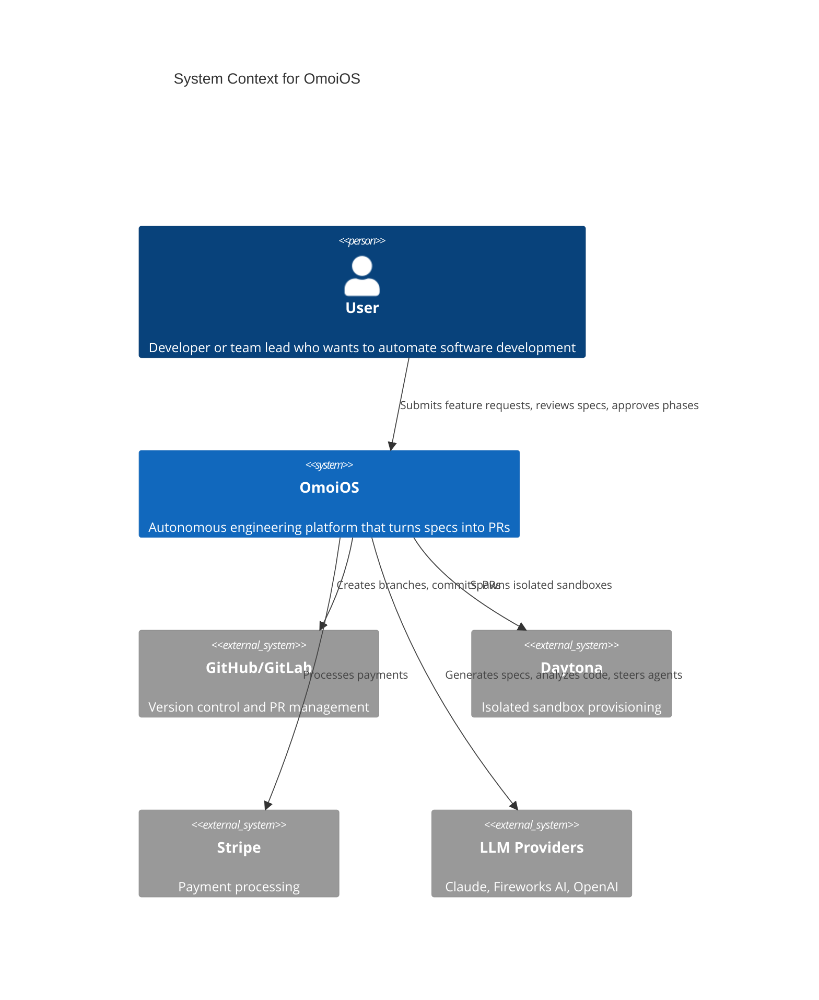
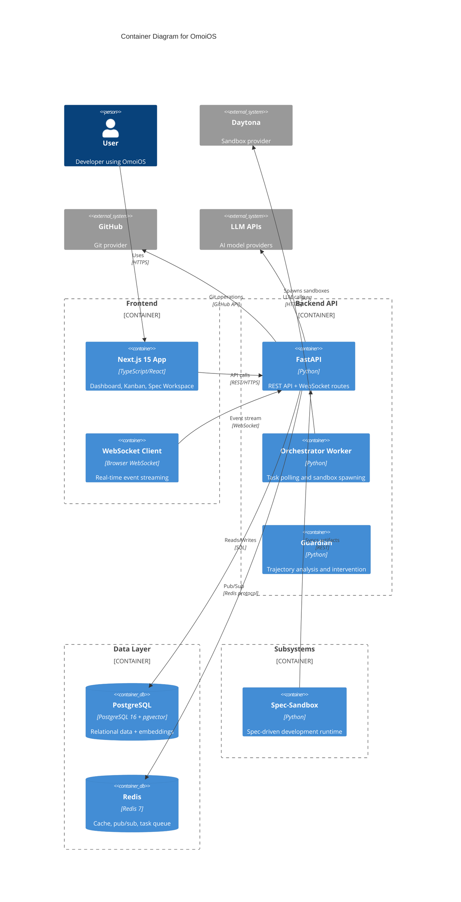
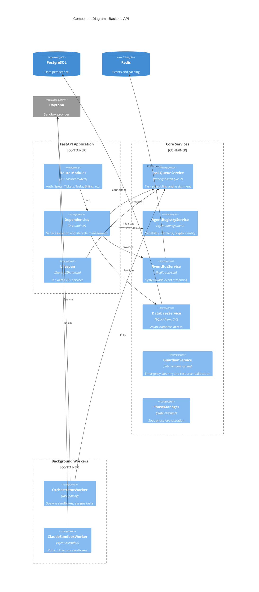

# 2. Architecture Overview

## Executive Summary

OmoiOS is an autonomous engineering platform that orchestrates multiple AI agents through a **spec-driven, discovery-enabled, self-adjusting workflow**. The system handles three core capabilities:

| Capability | System | Purpose |
|------------|--------|---------|
| **Plans** | Spec-Sandbox State Machine | Convert feature ideas into structured requirements, designs, and atomic tasks |
| **Discoveries** | DiscoveryService + Analyzer | Detect new work during execution and spawn adaptive branch tasks |
| **Readjustments** | MonitoringLoop + Guardian + Conductor | Monitor agent trajectories and intervene when goals drift |

**Production URLs:**
- Frontend: `https://omoios.dev`
- Backend API: `https://api.omoios.dev`

## C4 Model Diagrams

### Level 1: System Context



### Level 2: Container Diagram



### Level 3: Component Diagram (Backend)



## Architecture Deep-Dive (from ARCHITECTURE.md)

> From legacy `ARCHITECTURE.md` — verified accurate 2026-04-22.

### System Overview

```
                                 +---------------------------+
                                 |    User / Frontend        |
                                 |  (Specs, Tickets, Tasks)  |
                                 +-------------+-------------+
                                               |
                                               ▼
+-----------------------------------------------------------------------------------------+
|                                       API Layer                                          |
|                         FastAPI Routes + WebSocket Events                                |
+---------------+-----------------------------+---------------------------+---------------+
                |                             |                           |
                ▼                             ▼                           ▼
+---------------------------+   +-----------------------------+   +-------------------------+
|     PLANNING SYSTEM       |   |    EXECUTION SYSTEM         |   |   READJUSTMENT SYSTEM   |
|  +---------------------+  |   |  +---------------------+    |   |  +---------------------+|
|  |  Spec-Sandbox       |  |   |  | OrchestratorWorker  |    |   |  |   MonitoringLoop    ||
|  |  State Machine      |  |   |  | (task dispatch)     |    |   |  |  +---------------+  ||
|  |                     |  |   |  +----------+----------+    |   |  |  |   Guardian    |  ||
|  | EXPLORE → PRD →     |  |   |             |               |   |  |  |  (trajectory) |  ||
|  | REQUIREMENTS →      |  |   |             ▼               |   |  |  +---------------+  ||
|  | DESIGN → TASKS →    |  |   |  +---------------------+    |   |  |  +---------------+  ||
|  | SYNC               |  |   |  |  DaytonaSpawner     |    |   |  |  |   Conductor   |  ||
|  |                     |  |   |  |  (sandbox creation) |    |   |  |  |  (coherence)  |  ||
|  +---------------------+  |   |  +----------+----------+    |   |  |  +---------------+  ||
|           |               |   |             |               |   |  +---------------------+|
|           ▼               |   |             ▼               |   |            |            |
|  +---------------------+  |   |  +---------------------+    |   |            ▼            |
|  |  Phase Evaluators   |  |   |  | ClaudeSandboxWorker |    |   |  +---------------------+|
|  |  (quality gates)    |  |   |  | + EventReporter     |    |   |  |  Steering           ||
|  +---------------------+  |   |  | + MessagePoller     |    |   |  |  Interventions      ||
|           |               |   |  | + FileChangeTracker |    |   |  +---------------------+|
|           ▼               |   |  +----------+----------+    |   +-------------------------+
|  +---------------------+  |   |             |               |
|  |  HTTPReporter       |  |   |             | (discoveries) |
|  |  (event streaming)  |  |   |             ▼               |
|  +---------------------+  |   |  +---------------------+    |
+---------------------------+   |  |  DiscoveryService   |    |
                                |  |  (adaptive branch)  |    |
                                |  +---------------------+    |
                                +-----------------------------+
                                              |
                                              ▼
+-----------------------------------------------------------------------------------------+
|                                   DATA LAYER                                             |
|  +-----------------+  +-----------------+  +-----------------+  +-----------------+     |
|  |  MemoryService  |  |  ContextService |  | SynthesisService|  |  DAG Merge      |     |
|  |  (hybrid search)|  |  (phase context)|  | (parallel merge)|  |  System         |     |
|  +-----------------+  +-----------------+  +-----------------+  +-----------------+     |
|  +-----------------+  +-----------------+  +-----------------+  +-----------------+     |
|  |  SpecDedup      |  | EmbeddingService|  |  BillingService |  | CostTracking    |     |
|  |  (hash+semantic)|  |  (pgvector 1536)|  |  (Stripe+tiers) |  | (per-task LLM)  |     |
|  +-----------------+  +-----------------+  +-----------------+  +-----------------+     |
|                                                                                          |
|                          PostgreSQL + pgvector + Redis                                   |
+-----------------------------------------------------------------------------------------+
```

### The Three Pillars

1. **Planning System**: Converts natural language into a structured Directed Acyclic Graph (DAG) of atomic tasks through a 7-phase state machine
2. **Execution System**: Dispatches tasks to agents running in isolated Daytona sandboxes, managing the lifecycle from environment provisioning to code implementation
3. **Readjustment System**: Employs a multi-loop monitoring architecture (Guardian and Conductor) to detect drift and inject steering interventions

### System Deep-Dives

| System | Key Components | Deep-Dive Link |
|--------|---------------|----------------|
| **Planning** | Spec-Sandbox State Machine, Phase Evaluators, HTTPReporter | [01-planning-system.md](architecture/01-planning-system.md) |
| **Execution** | OrchestratorWorker, DaytonaSpawner, ClaudeSandboxWorker | [02-execution-system.md](architecture/02-execution-system.md) |
| **Discovery** | DiscoveryService, DiscoveryAnalyzerService | [03-discovery-system.md](architecture/03-discovery-system.md) |
| **Readjustment** | MonitoringLoop, IntelligentGuardian, ConductorService | [04-readjustment-system.md](architecture/04-readjustment-system.md) |
| **Frontend** | Next.js 15, ShadCN UI, Zustand, React Query | [05-frontend-architecture.md](architecture/05-frontend-architecture.md) |
| **Real-Time Events** | EventBusService, WebSocket server | [06-realtime-events.md](architecture/06-realtime-events.md) |
| **Auth & Security** | AuthService, JWT middleware, OAuth | [07-auth-and-security.md](architecture/07-auth-and-security.md) |
| **Billing** | BillingService, StripeService, SubscriptionService | [08-billing-and-subscriptions.md](architecture/08-billing-and-subscriptions.md) |
| **Database** | SQLAlchemy models, pgvector, Alembic | [11-database-schema.md](architecture/11-database-schema.md) |
| **Configuration** | OmoiBaseSettings, YAML loaders | [12-configuration-system.md](architecture/12-configuration-system.md) |
| **API Routes** | 38 FastAPI route modules | [13-api-route-catalog.md](architecture/13-api-route-catalog.md) |
| **Service Catalog** | ~94 backend services | [16-service-catalog.md](architecture/16-service-catalog.md) |

## Architectural Patterns

### 1. Spec-Driven Development (SDD)

Agents operate against versioned artifacts (Requirements, Design, Tasks) grounded in the actual codebase. The 7-phase pipeline ensures quality at each transition:

```
EXPLORE → PRD → REQUIREMENTS → DESIGN → TASKS → SYNC → COMPLETE
```

Each phase has an LLM evaluator (quality gate) that scores output and retries on failure.

### 2. DAG-Based Execution

Tasks form a dependency graph via `DependencyGraphService`. Nothing executes until dependencies are met. Critical path analysis determines what runs in parallel.

### 3. Isolated Sandboxing

Every agent runs in a dedicated Daytona container with its own Git branch, filesystem, and resources. No shared state. No interference.

### 4. Active Supervision

The `IntelligentGuardian` scores agent alignment mid-task and can inject steering interventions to correct drift. The `ConductorService` monitors system-wide coherence.

### 5. Discovery-Enabled Workflows

The Hephaestus pattern allows discovery-based branching — a Phase 3 validation agent can spawn Phase 1 investigation tasks when new requirements are found.

### 6. Hybrid Memory System

Combines pgvector semantic search with PostgreSQL full-text search for hybrid retrieval using Reciprocal Rank Fusion (RRF).

### 7. Dual-Path Deduplication

SHA256 content hashing for exact matches + pgvector embedding similarity for semantic near-duplicate detection.

## Module Breakdown

### Backend Modules

| Module | Purpose | Key Files |
|--------|---------|-----------|
| **API Routes** | 40+ REST endpoints | `api/routes/*.py` |
| **Models** | 75+ SQLAlchemy entities | `models/*.py` |
| **Services** | Business logic | `services/*.py` |
| **Workers** | Background execution | `workers/*.py` |
| **Config** | YAML + env settings | `config.py`, `config/*.yaml` |

### Frontend Modules

| Module | Purpose | Key Files |
|--------|---------|-----------|
| **App Router** | 60+ pages | `app/(app)/*.tsx` |
| **Components** | 130+ React components | `components/**/*.tsx` |
| **Hooks** | Data fetching | `hooks/use*.ts` |
| **Providers** | Context providers | `providers/*.tsx` |
| **API Client** | Typed HTTP client | `lib/api/*.ts` |

### Subsystem Modules

| Module | Purpose | Key Files |
|--------|---------|-----------|
| **State Machine** | Spec phase orchestration | `worker/state_machine.py` |
| **Executor** | Claude Agent SDK wrapper | `executor/claude_executor.py` |
| **Evaluators** | Quality gates | `evaluators/phases.py` |
| **Reporters** | Event streaming | `reporters/*.py` |
| **Sync** | Backend integration | `sync/service.py` |

## Service Initialization Map (CRITICAL)

OmoiOS has **two separate service initialization points** that don't share state:

| Location | File | Function | Services |
|----------|------|----------|----------|
| **API Server** | `api/main.py` | `lifespan()` | 25+ services |
| **Orchestrator Worker** | `workers/orchestrator_worker.py` | `init_services()` | 8 services |

**These run as separate processes.** Services initialized in one are NOT available in the other.

### Service Availability Matrix

| Service | API Server | Orchestrator | Notes |
|---------|:----------:|:------------:|-------|
| DatabaseService | yes | yes | Both have own connections |
| EventBusService | yes | yes | Both have own Redis connections |
| TaskQueueService | yes | yes | Both have own instances |
| AgentRegistryService | yes | yes | Both have own instances |
| PhaseGateService | yes | yes | Both have own instances |
| PhaseManager | yes | no | API-only |
| PhaseProgressionService | no | yes | Worker-only |
| TaskRequirementsAnalyzer | no | yes | Worker-only |
| TicketWorkflowOrchestrator | no | yes | Worker-only |
| MonitoringLoop | yes | no | API-only |

## Code Review Checklist

When reviewing code for OmoiOS, verify:

1. **SQLAlchemy Column Names**: Never use `metadata` or `registry` as column names (reserved by SQLAlchemy)
2. **Datetime Usage**: Always use `omoi_os.utils.datetime.utc_now()` instead of `datetime.utcnow()`
3. **LLM Calls**: Use `structured_output()` with Pydantic models, never manual JSON parsing
4. **Service Initialization**: Check if the service needs to be available in both API and Worker processes
5. **Event Publishing**: Ensure events are published through `EventBusService` for real-time updates
6. **Error Handling**: Handle errors at every level with user-friendly messages in UI, detailed logs server-side
7. **Database Transactions**: Use async sessions properly with context managers
8. **Configuration**: Settings go in YAML, secrets go in `.env`
9. **Type Safety**: Use Pydantic models for all API inputs/outputs
10. **Testing**: Include unit, integration, and E2E tests for new features

## Glossary

| Term | Definition |
|------|------------|
| **Spec** | A feature specification that goes through EXPLORE → SYNC phases |
| **Ticket** | A work grouping (TKT-NNN) containing multiple tasks |
| **Task** | An atomic work unit (TSK-NNN) executable by an agent |
| **Discovery** | New work found during execution that spawns branch tasks |
| **Trajectory** | An agent's conversation and tool usage history |
| **Alignment** | How well an agent's trajectory matches its goal |
| **Coherence** | System-wide measure of agent coordination |
| **Synthesis** | Merging results from parallel predecessor tasks |
| **Phase Gate** | Quality evaluation that must pass to proceed |
| **EARS** | "Easy Approach to Requirements Syntax" format |

## Next Steps

1. **Verify Event Flow**: Use checklist in Integration Gaps doc to verify each event
2. **Test DAG System**: Services are wired; needs integration tests with parallel tasks
3. **Complete Live Preview**: ~80% done, needs HMR WebSocket connection
4. **Add Frontend Tests**: No test infrastructure exists yet
5. **Implement Alerting Channels**: Slack/email routers are stubs

---

For deeper dives into specific systems, see the [Architecture Decision Records](architecture/) in `docs/architecture/`.
