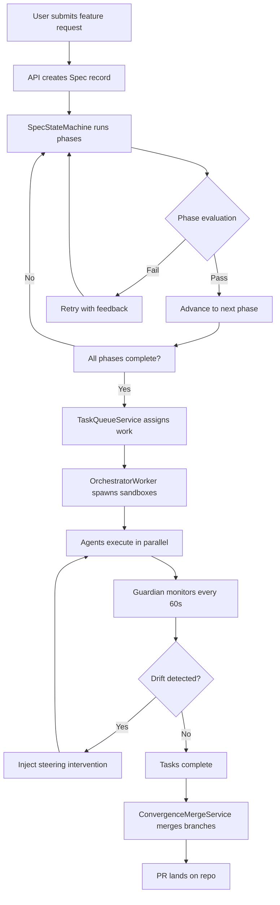
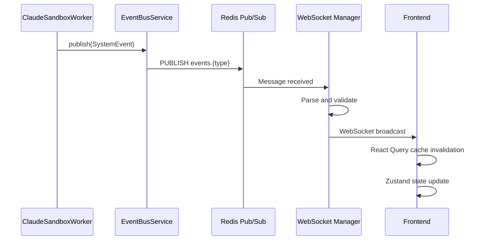
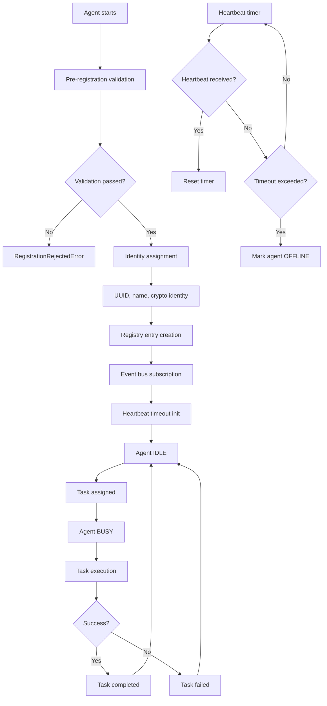
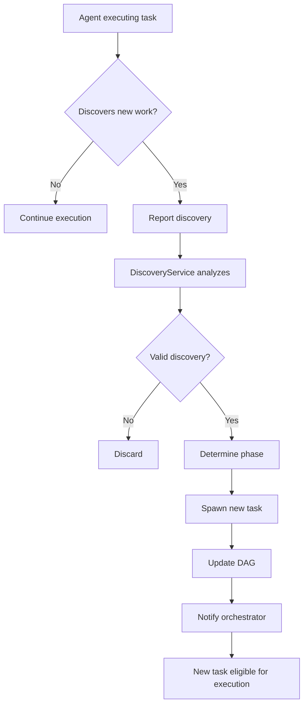
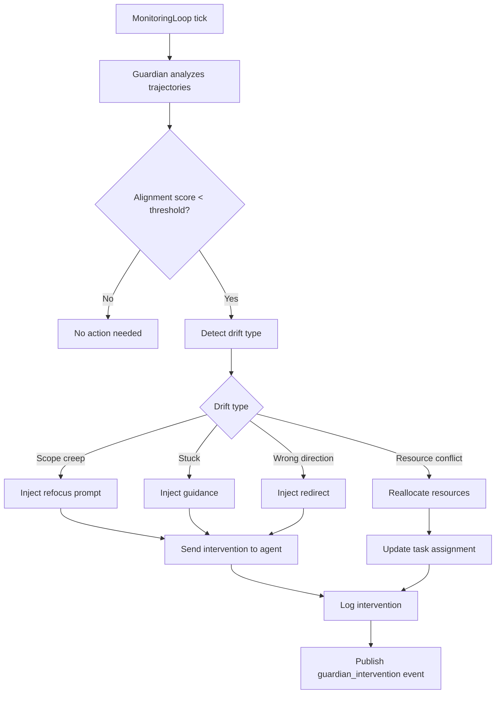
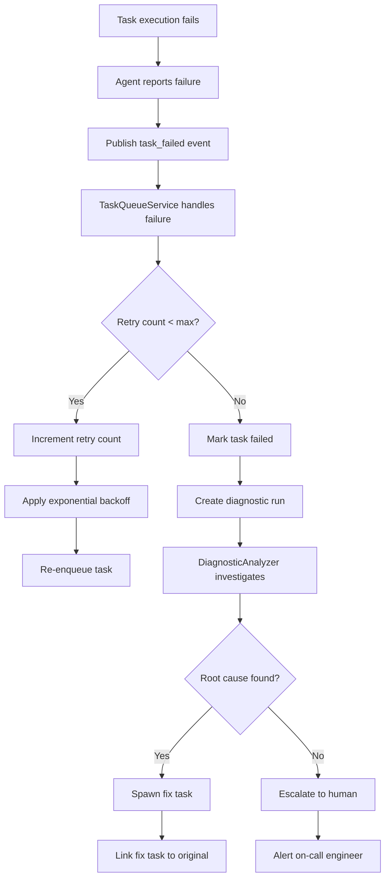
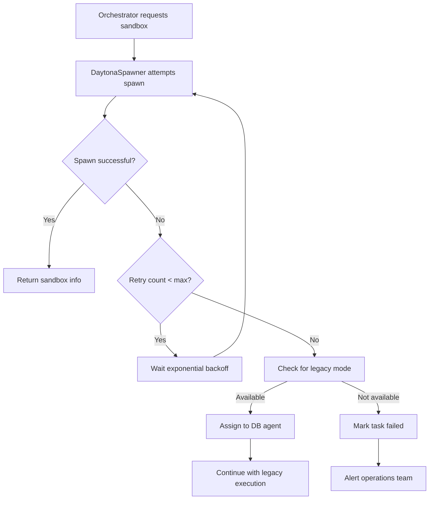
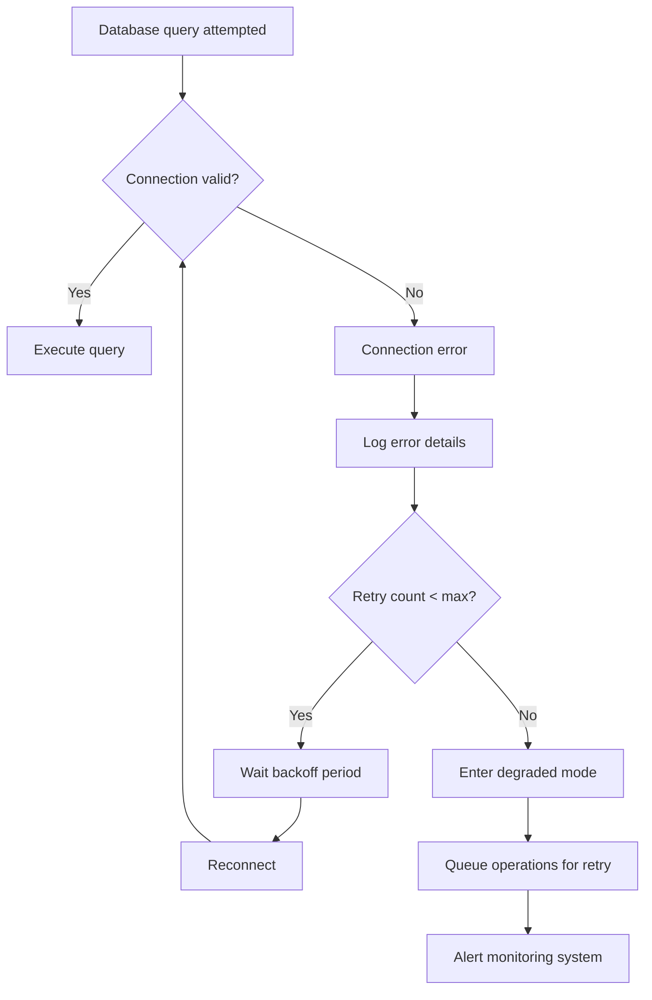

# 3. Workflow Overview

This document describes the core workflows in OmoiOS, from feature specification through execution to completion.

## Workflow 1: Feature Specification to PR

The primary workflow converts a user feature request into a production-ready pull request.

### Entry Points

1. **Web UI**: User submits feature via `/command` page
2. **API**: Direct POST to `/api/v1/specs`
3. **CLI**: `spec-sandbox` command-line tool

### Steps



### Detailed Flow

1. **Spec Creation**
   `file:backend/omoi_os/api/routes/specs.py:80-126`
   ```python
   @router.post("")
   async def create_spec(
       request: CreateSpecRequest,
       db: DatabaseService = Depends(get_db),
   ) -> SpecResponse:
       """Create a new spec in draft status."""
       spec = await db.create_spec(request)
       return SpecResponse.from_model(spec)
   ```

2. **Phase Execution**
   `file:subsystems/spec-sandbox/src/spec_sandbox/worker/state_machine.py:52-68`
   ```python
   class SpecStateMachine:
       """Orchestrates phases: EXPLORE → PRD → REQUIREMENTS → DESIGN → TASKS → SYNC"""
       
       PHASES = [
           SpecPhase.EXPLORE,
           SpecPhase.PRD,
           SpecPhase.REQUIREMENTS,
           SpecPhase.DESIGN,
           SpecPhase.TASKS,
           SpecPhase.SYNC,
       ]
   ```

3. **Task Queue Assignment**
   `file:backend/omoi_os/services/task_queue.py:81-99`
   ```python
   class TaskQueueService:
       """Manages task queue operations: enqueue, retrieve, assign, update."""
       
       def __init__(
           self,
           db: DatabaseService,
           event_bus: Optional["EventBusService"] = None,
       ):
           self.db = db
           self.scorer = TaskScorer(db)
           self.event_bus = event_bus
   ```

4. **Sandbox Spawning**
   `file:backend/omoi_os/workers/orchestrator_worker.py:127-165`
   ```python
   def get_execution_mode(task_type: str) -> Literal["exploration", "implementation", "validation"]:
       """Determine execution mode based on task type."""
       if task_type in EXPLORATION_TASK_TYPES:
           return "exploration"
       elif task_type in VALIDATION_TASK_TYPES:
           return "validation"
       else:
           return "implementation"
   ```

## Workflow 2: Real-Time Event Streaming

Events flow from agents through the backend to the frontend in real-time.

### Entry Points

1. **Agent Events**: Published from `ClaudeSandboxWorker`
2. **System Events**: Published from services (`TaskQueueService`, `GuardianService`)
3. **User Events**: Published from API routes

### Steps



### Event Types

| Category | Event Types |
|----------|-------------|
| **Lifecycle** | `agent_created`, `agent_updated`, `agent_deleted` |
| **Task** | `task_created`, `task_assigned`, `task_completed`, `task_failed` |
| **Sandbox** | `sandbox_spawned`, `sandbox_terminated`, `sandbox_event` |
| **Spec** | `spec_phase_changed`, `spec_completed` |
| **Monitoring** | `guardian_intervention`, `conductor_alert` |

### Implementation

`file:backend/omoi_os/services/event_bus.py:26-82`
```python
class EventBusService:
    """Manages system-wide event publishing and subscription via Redis Pub/Sub.
    
    If Redis is unavailable, operations are no-ops (graceful degradation).
    """
    
    def publish(self, event: SystemEvent) -> None:
        """Publish event to system bus."""
        if not self._available or not self.redis_client:
            return  # Graceful no-op when Redis unavailable
        
        channel = f"events.{event.event_type}"
        message = event.model_dump_json()
        try:
            self.redis_client.publish(channel, message)
        except redis.exceptions.ConnectionError:
            logger.warning("Redis connection lost during publish")
```

## Workflow 3: Agent Registration and Heartbeat

Agents register with the system and maintain liveness through heartbeats.

### Entry Points

1. **API Registration**: POST `/api/v1/agents/register`
2. **Auto-Registration**: Spawned agents self-register
3. **Heartbeat**: Periodic POST `/api/v1/agents/{id}/heartbeat`

### Steps



### Implementation

`file:backend/omoi_os/services/agent_registry.py:75-118`
```python
def register_agent(
    self,
    *,
    agent_type: str,
    capabilities: List[str],
    capacity: int = 1,
    status: str = AgentStatus.IDLE.value,
) -> Agent:
    """
    Register a new agent using multi-step protocol.
    
    Steps:
    1. Pre-registration validation
    2. Identity assignment (UUID, name, crypto)
    3. Registry entry creation
    4. Event bus subscription
    5. Initial heartbeat timeout (60s)
    """
    # Step 1: Pre-Registration Validation
    validation = self._pre_validate(...)
    if not validation.success:
        raise RegistrationRejectedError(...)
    
    # Step 2: Identity Assignment
    agent_id = str(uuid.uuid4())
    agent_name = self._generate_agent_name(agent_type, phase_id)
    crypto_identity = self._generate_crypto_identity(agent_id)
```

## Workflow 4: Discovery and Adaptive Branching

Agents discover new work during execution and spawn adaptive tasks.

### Entry Points

1. **Agent Discovery**: Agent finds bug/missing requirement during task execution
2. **Analyzer Detection**: `DiscoveryAnalyzerService` detects patterns
3. **Manual Creation**: User creates task via API

### Steps



### Hephaestus Pattern

The Hephaestus pattern allows discovery-based branching to bypass normal phase transitions — a Phase 3 validation agent can spawn Phase 1 investigation tasks.

`file:backend/omoi_os/services/discovery.py`
```python
class DiscoveryService:
    """Enables adaptive workflow branching when agents discover new requirements."""
    
    async def handle_discovery(
        self,
        discovery: TaskDiscovery,
        context: DiscoveryContext,
    ) -> DiscoveryResult:
        """Process a discovery and spawn appropriate tasks."""
        # Analyze discovery type and urgency
        analysis = await self._analyze_discovery(discovery, context)
        
        # Determine target phase (can be earlier than current)
        target_phase = self._determine_target_phase(analysis)
        
        # Spawn new task in appropriate phase
        new_task = await self._spawn_adaptive_task(
            discovery=discovery,
            target_phase=target_phase,
            parent_task=context.current_task,
        )
        
        return DiscoveryResult(task=new_task, phase=target_phase)
```

## Workflow 5: Guardian Monitoring and Intervention

The Guardian monitors agent trajectories and intervenes when goals drift.

### Entry Points

1. **Scheduled Analysis**: MonitoringLoop runs Guardian every 60s
2. **Event-Triggered**: Critical events trigger immediate analysis
3. **Manual Request**: Admin requests trajectory analysis

### Steps



### Implementation

`file:backend/omoi_os/services/intelligent_guardian.py`
```python
class IntelligentGuardian:
    """Analyzes agent trajectories and injects steering interventions."""
    
    async def analyze_trajectory(
        self,
        agent_id: str,
        trajectory: Trajectory,
        goal: str,
    ) -> TrajectoryAnalysis:
        """Analyze agent trajectory against goal."""
        # Calculate alignment score (0.0 - 1.0)
        alignment = await self._calculate_alignment(trajectory, goal)
        
        # Detect drift patterns
        drift_type = self._detect_drift(trajectory, alignment)
        
        if alignment < self.intervention_threshold:
            intervention = await self._generate_intervention(
                drift_type=drift_type,
                trajectory=trajectory,
                goal=goal,
            )
            await self._inject_intervention(agent_id, intervention)
        
        return TrajectoryAnalysis(
            alignment_score=alignment,
            drift_type=drift_type,
            intervention=intervention if alignment < self.intervention_threshold else None,
        )
```

## Error Path: Task Failure and Recovery

When a task fails, the system attempts recovery through several mechanisms.

### Steps



### Error Handling Implementation

`file:backend/omoi_os/services/task_queue.py`
```python
async def handle_task_failure(
    self,
    task_id: str,
    error: TaskError,
) -> TaskStatus:
    """Handle task failure with retry logic."""
    task = await self.db.get_task(task_id)
    
    if task.retry_count < task.max_retries:
        # Retry with exponential backoff
        task.retry_count += 1
        delay = 2 ** task.retry_count  # 2, 4, 8, 16...
        task.scheduled_at = utc_now() + timedelta(seconds=delay)
        task.status = TaskStatus.PENDING
        await self.db.update_task(task)
        return TaskStatus.PENDING
    else:
        # Max retries exceeded
        task.status = TaskStatus.FAILED
        await self.db.update_task(task)
        
        # Trigger diagnostic
        await self.diagnostic_service.create_diagnostic_run(
            task_id=task_id,
            error=error,
        )
        return TaskStatus.FAILED
```

## Error Path: Sandbox Spawn Failure

When sandbox spawning fails, the system has fallback mechanisms.

### Steps



## Error Path: Database Connection Loss

When database connections fail, services must handle gracefully.

### Steps



## Workflow Summary

| Workflow | Entry Point | Key Services | Output |
|----------|-------------|--------------|--------|
| Feature to PR | `/api/v1/specs` POST | SpecStateMachine, TaskQueue, Orchestrator, Guardian | Pull Request |
| Event Streaming | Agent/system actions | EventBusService, WebSocket | Real-time UI updates |
| Agent Registration | `/api/v1/agents/register` | AgentRegistryService | Registered agent |
| Discovery Branching | Agent discovery report | DiscoveryService, TaskQueue | New adaptive task |
| Guardian Intervention | MonitoringLoop (60s) | IntelligentGuardian | Steering intervention |
| Task Failure Recovery | Task failure event | TaskQueueService, DiagnosticService | Retry or fix task |
| Sandbox Spawn Failure | Spawn request | DaytonaSpawner, Orchestrator | Fallback execution |

---

For more details on specific workflows, see:
- [4. Deep Dive/backend.md](4. Deep Dive/backend.md) - Backend workflow details
- [4. Deep Dive/frontend.md](4. Deep Dive/frontend.md) - Frontend event handling
- [4. Deep Dive/subsystems.md](4. Deep Dive/subsystems.md) - Spec execution workflow
