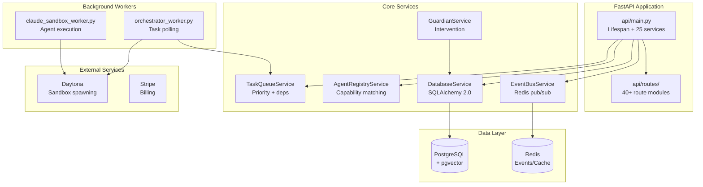

# Backend API & Services

## Overview

The OmoiOS backend is a Python FastAPI application that orchestrates multi-agent execution in isolated sandboxes. It provides 40+ REST API route modules, 100+ business logic services, and 75+ SQLAlchemy models for managing specs, tasks, agents, and billing. The backend coordinates with Daytona for sandbox provisioning, Redis for event streaming, and PostgreSQL with pgvector for data persistence and semantic search.

## Architecture



## Key files

| Path | Purpose |
|------|---------|
| `backend/omoi_os/api/main.py` | FastAPI entry point with lifespan management, initializes 25+ services |
| `backend/omoi_os/config.py` | OmoiBaseSettings with YAML + env configuration layering |
| `backend/omoi_os/services/task_queue.py` | Priority-based task queue with dependency resolution |
| `backend/omoi_os/services/agent_registry.py` | Agent CRUD, capability matching, crypto identity |
| `backend/omoi_os/services/event_bus.py` | Redis pub/sub for real-time system events |
| `backend/omoi_os/services/database.py` | SQLAlchemy 2.0 with sync/async session management |
| `backend/omoi_os/services/llm_service.py` | Unified LLM interface with structured output support |
| `backend/omoi_os/services/guardian.py` | Emergency intervention and resource reallocation |
| `backend/omoi_os/services/billing_service.py` | Stripe integration, usage tracking, invoicing |
| `backend/omoi_os/workers/orchestrator_worker.py` | Standalone task polling and sandbox spawning |
| `backend/omoi_os/workers/claude_sandbox_worker.py` | Agent execution in Daytona sandboxes |
| `backend/omoi_os/models/task.py` | Task model with dependencies, scoring, validation fields |
| `backend/omoi_os/models/spec.py` | Spec model with phase tracking, requirements, design |
| `backend/omoi_os/models/base.py` | SQLAlchemy DeclarativeBase for all models |
| `backend/pyproject.toml` | UV-based Python project with 50+ dependencies |

## Implementation details

### Configuration System (YAML + Environment)

The backend uses a layered configuration system where application settings live in YAML files and secrets in environment files. The `OmoiBaseSettings` class extends Pydantic's `BaseSettings` to merge these sources.

`backend/omoi_os/config.py:99-127`

```python
class OmoiBaseSettings(BaseSettings):
    yaml_section: ClassVar[Optional[str]] = None

    model_config = SettingsConfigDict(
        env_file=get_env_files(),
        env_file_encoding="utf-8",
        extra="ignore",
    )

    @classmethod
    def settings_customise_sources(
        cls,
        settings_cls: type[BaseSettings],
        init_settings: PydanticBaseSettingsSource,
        env_settings: PydanticBaseSettingsSource,
        dotenv_settings: PydanticBaseSettingsSource,
        file_secret_settings: PydanticBaseSettingsSource,
    ) -> tuple[PydanticBaseSettingsSource, ...]:
        sources: list[PydanticBaseSettingsSource] = [
            init_settings,
            env_settings,
            dotenv_settings,
            file_secret_settings,
        ]
        if cls.yaml_section:
            sources.append(
                YamlSectionSettingsSource(settings_cls, section=cls.yaml_section)
            )
        return tuple(sources)
```

This pattern allows settings to cascade: code defaults → YAML config → environment variables. The `yaml_section` class variable specifies which section of `config/base.yaml` or `config/local.yaml` to load.

### Task Queue with Dynamic Scoring

Tasks are scheduled using a dynamic scoring algorithm that combines priority, age, deadline proximity, and blocker count. The `TaskQueueService` manages the full lifecycle from enqueue through assignment.

`backend/omoi_os/services/task_queue.py:81-99`

```python
class TaskQueueService:
    """Manages task queue operations: enqueue, retrieve, assign, update."""

    def __init__(
        self,
        db: DatabaseService,
        event_bus: Optional["EventBusService"] = None,
    ):
        self.db = db
        self.scorer = TaskScorer(db)
        self.event_bus = event_bus
```

The `Task` model includes fields for dependency tracking via JSONB, required capabilities for agent matching, and validation iteration counters for quality gates.

`backend/omoi_os/models/task.py:24-75`

```python
class Task(Base):
    """Task represents a single work unit that can be assigned to an agent."""

    __tablename__ = "tasks"

    id: Mapped[str] = mapped_column(
        String, primary_key=True, default=lambda: str(uuid4())
    )
    ticket_id: Mapped[str] = mapped_column(
        String, ForeignKey("tickets.id", ondelete="CASCADE"), nullable=False, index=True
    )
    phase_id: Mapped[str] = mapped_column(String(50), nullable=False, index=True)
    task_type: Mapped[str] = mapped_column(
        String(100), nullable=False
    )
    priority: Mapped[str] = mapped_column(
        String(20), nullable=False, index=True
    )
    score: Mapped[float] = mapped_column(
        Float,
        nullable=False,
        default=0.0,
        index=True,
        comment="Dynamic scheduling score computed from priority, age, deadline, blocker count, and retry penalty",
    )
    dependencies: Mapped[Optional[dict]] = mapped_column(
        JSONB, nullable=True
    )
    required_capabilities: Mapped[Optional[list[str]]] = mapped_column(
        JSONB, nullable=True,
        comment="Required capabilities: ['python', 'fastapi', 'postgres']",
    )
```

### Agent Registry with Capability Matching

The `AgentRegistryService` manages agent lifecycle with a five-step registration protocol: pre-validation, identity assignment, registry entry creation, event bus subscription, and heartbeat timeout initialization.

`backend/omoi_os/services/agent_registry.py:75-118`

```python
def register_agent(
    self,
    *,
    agent_type: str,
    phase_id: Optional[str],
    capabilities: List[str],
    capacity: int = 1,
    status: str = AgentStatus.IDLE.value,
    tags: Optional[List[str]] = None,
    config: Optional[Dict[str, Any]] = None,
    resource_requirements: Optional[Dict[str, Any]] = None,
    binary_path: Optional[str] = None,
    version: Optional[str] = None,
) -> Agent:
    """
    Register a new agent using multi-step protocol.

    Steps:
    1. Pre-registration validation
    2. Identity assignment (UUID, name, crypto)
    3. Registry entry creation
    4. Event bus subscription
    5. Initial heartbeat timeout (60s)
    """
    # Step 1: Pre-Registration Validation
    validation = self._pre_validate(...)
    if not validation.success:
        raise RegistrationRejectedError(...)

    # Step 2: Identity Assignment
    agent_id = str(uuid.uuid4())
    agent_name = self._generate_agent_name(agent_type, phase_id)
    crypto_identity = self._generate_crypto_identity(agent_id)
```

### Real-Time Event Bus

The `EventBusService` provides Redis-backed pub/sub for system-wide events. It gracefully degrades to no-op when Redis is unavailable.

`backend/omoi_os/services/event_bus.py:26-82`

```python
class EventBusService:
    """Manages system-wide event publishing and subscription via Redis Pub/Sub.

    If Redis is unavailable, operations are no-ops (graceful degradation).
    """

    def __init__(self, redis_url: str | None = None):
        self.redis_client: Optional[redis.Redis] = None
        self.pubsub = None
        self._available = False

        # ... connection logic ...

    def publish(self, event: SystemEvent) -> None:
        """Publish event to system bus."""
        if not self._available or not self.redis_client:
            return  # Graceful no-op when Redis unavailable

        channel = f"events.{event.event_type}"
        message = event.model_dump_json()
        try:
            self.redis_client.publish(channel, message)
        except redis.exceptions.ConnectionError:
            logger.warning("Redis connection lost during publish")
```

### LLM Service with Structured Output

The `LLMService` provides a unified interface for LLM calls, with strong preference for `structured_output()` using Pydantic models rather than manual JSON parsing.

`backend/omoi_os/services/llm_service.py:92-141`

```python
async def structured_output(
    self,
    prompt: str,
    output_type: type[T],
    system_prompt: Optional[str] = None,
    output_retries: int = 5,
    http_retries: int = 3,
    **kwargs,
) -> T:
    """
    Get structured output matching a Pydantic model.

    Includes automatic retry with exponential backoff for transient HTTP errors
    (503, 429, etc.) that can occur with LLM providers like Fireworks.
    """
    agent = self._pydantic_ai.create_agent(
        output_type=output_type,
        system_prompt=system_prompt,
        output_retries=output_retries,
    )

    last_error = None
    for attempt in range(http_retries + 1):
        try:
            result = await agent.run(prompt)
            return result.output
        except Exception as e:
            error_str = str(e).lower()
            is_retryable = any(
                indicator in error_str
                for indicator in ["503", "502", "500", "504", "429"]
            )
            if not is_retryable or attempt == http_retries:
                raise
            # Exponential backoff with jitter
            delay = (2 ** attempt) + random.uniform(0, 1)
            await asyncio.sleep(delay)
```

### Orchestrator Worker

The `OrchestratorWorker` is a standalone process that polls for pending tasks and spawns Daytona sandboxes. It supports two execution modes: sandbox mode (spawns isolated containers per task) and legacy mode (assigns to database-registered agents).

`backend/omoi_os/workers/orchestrator_worker.py:127-165`

```python
def get_execution_mode(
    task_type: str,
) -> Literal["exploration", "implementation", "validation"]:
    """Determine execution mode based on task type.

    This controls which skills are loaded into the sandbox:
    - exploration: spec-driven-dev skill for creating specs/tickets/tasks
    - implementation: git-workflow, code-review, etc. for executing tasks
    - validation: code-review, test-writer for validating implementation
    """
    if task_type in EXPLORATION_TASK_TYPES:
        return "exploration"
    elif task_type in VALIDATION_TASK_TYPES:
        return "validation"
    else:
        return "implementation"
```

## Dependencies

### Internal Dependencies

The backend has minimal internal coupling to other domains. It shares the `subsystems/spec-sandbox/` package as a workspace dependency for lightweight spec execution. The frontend domain consumes the backend exclusively via REST API and WebSocket connections—there is no direct code sharing.

### External Dependencies

The backend declares 50+ production dependencies in `pyproject.toml`:

**Web Framework**: FastAPI 0.104+, Uvicorn, Gunicorn, Pydantic 2.7+, Pydantic-Settings, python-multipart

**Database**: SQLAlchemy 2.0+, psycopg3 (PostgreSQL driver), pgvector (vector extension), Alembic (migrations)

**AI/LLM**: OpenHands SDK, Claude Agent SDK, Pydantic-AI, Anthropic SDK, OpenAI SDK, Instructor, FastEmbed

**Infrastructure**: Redis 5.0+, Daytona SDK, Taskiq (background tasks), PyYAML

**Auth/Security**: python-jose, bcrypt, cryptography, slowapi (rate limiting)

**Observability**: Sentry SDK, PostHog, Logfire, OpenTelemetry

**Billing**: Stripe SDK, Resend (email)

> From legacy `backend/CLAUDE.md` — verified accurate 2026-04-22.

The configuration system uses YAML for application settings and `.env` files for secrets, loaded via Pydantic-Settings with custom `YamlSectionSettingsSource` for merging layers.
