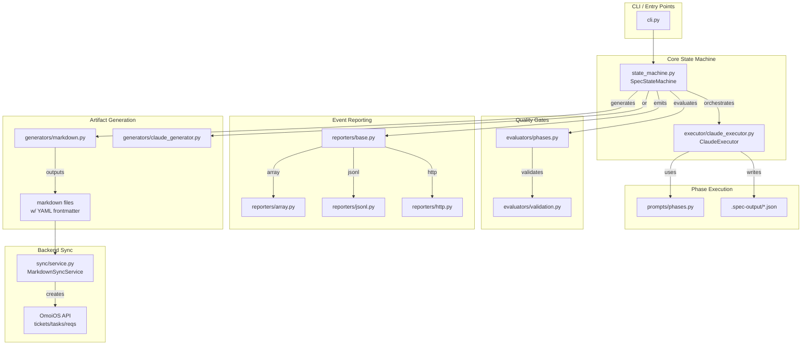

# subsystems

## Overview

The subsystems domain contains the `spec-sandbox` — a standalone, isolated runtime for spec-driven development (SDD) that executes independently of the main OmoiOS backend. It implements a complete state machine that transforms natural language feature descriptions into structured, executable plans through six phases: EXPLORE → PRD → REQUIREMENTS → DESIGN → TASKS → SYNC. The subsystem runs in three modes: in-memory (for tests), JSONL file output (for local debugging), or HTTP callback (for production integration with the OmoiOS API). It uses the Claude Agent SDK for intelligent phase execution, with pluggable evaluators that enforce quality gates between phases.

## Architecture



The architecture follows a pipeline pattern where each phase feeds into the next, with evaluation gates ensuring quality before progression. The reporter abstraction allows the same event stream to be consumed differently depending on environment — tests use `ArrayReporter`, local development uses `JSONLReporter`, and production sandboxes use `HTTPReporter` to stream events back to the OmoiOS backend.

## Key files

| Path | Purpose |
|------|---------|
| `subsystems/spec-sandbox/src/spec_sandbox/worker/state_machine.py` | Core `SpecStateMachine` class that orchestrates all six phases with retry logic and evaluation gates |
| `subsystems/spec-sandbox/src/spec_sandbox/executor/claude_executor.py` | `ClaudeExecutor` that wraps the Claude Agent SDK for phase execution with file-based JSON output |
| `subsystems/spec-sandbox/src/spec_sandbox/evaluators/phases.py` | Phase-specific evaluators (`ExploreEvaluator`, `PRDEvaluator`, `RequirementsEvaluator`, `DesignEvaluator`, `TasksEvaluator`, `SyncEvaluator`) |
| `subsystems/spec-sandbox/src/spec_sandbox/evaluators/validation.py` | Shared validation utilities for EARS format, circular dependencies, ID formats, traceability |
| `subsystems/spec-sandbox/src/spec_sandbox/schemas/spec.py` | Pydantic schemas for `SpecPhase` enum and `PhaseResult` model |
| `subsystems/spec-sandbox/src/spec_sandbox/schemas/events.py` | Unified event schema with 25+ event types for lifecycle, phases, artifacts, and sync |
| `subsystems/spec-sandbox/src/spec_sandbox/reporters/base.py` | Abstract `Reporter` base class defining the event reporting interface |
| `subsystems/spec-sandbox/src/spec_sandbox/sync/service.py` | `MarkdownSyncService` for syncing generated artifacts to OmoiOS backend API |
| `subsystems/spec-sandbox/src/spec_sandbox/config.py` | `SpecSandboxSettings` Pydantic settings with environment variable binding |
| `subsystems/spec-sandbox/src/spec_sandbox/cli.py` | Click-based CLI with `run`, `run-phase`, `inspect`, `create-tickets`, `sync-markdown` commands |
| `subsystems/spec-sandbox/src/spec_sandbox/generators/markdown.py` | Static template-based markdown generator for requirements, design, tasks |
| `subsystems/spec-sandbox/src/spec_sandbox/generators/claude_generator.py` | Claude SDK-based generator for intelligent, language-aware documentation |
| `subsystems/spec-sandbox/src/spec_sandbox/prompts/phases.py` | Phase-specific prompt templates with context injection |
| `subsystems/spec-sandbox/pyproject.toml` | Package manifest defining `spec-sandbox` CLI entry point |

## Implementation details

### Phase State Machine with Quality Gates

The `SpecStateMachine` orchestrates the six-phase workflow with built-in evaluation and retry logic. Each phase runs sequentially, and must pass an evaluator before proceeding to the next phase.

`subsystems/spec-sandbox/src/spec_sandbox/worker/state_machine.py:52-68`

```python
class SpecStateMachine:
    """Spec-driven development state machine.

    Orchestrates phases: EXPLORE → PRD → REQUIREMENTS → DESIGN → TASKS → SYNC

    All events are emitted through the reporter abstraction.
    """

    # Default phase order
    PHASES = [
        SpecPhase.EXPLORE,
        SpecPhase.PRD,
        SpecPhase.REQUIREMENTS,
        SpecPhase.DESIGN,
        SpecPhase.TASKS,
        SpecPhase.SYNC,
    ]
```

The `run_phase` method implements a retry loop with exponential backoff. If evaluation fails, the phase retries with evaluator feedback injected into the prompt.

`subsystems/spec-sandbox/src/spec_sandbox/worker/state_machine.py:270-330`

```python
async def run_phase(self, phase: SpecPhase) -> PhaseResult:
    """Run a single phase with evaluation and retry logic."""
    await self._emit(EventTypes.PHASE_STARTED, phase=phase.value)

    start_time = time.time()
    max_retries = 3
    retry_count = 0
    last_eval_feedback: Optional[str] = None

    while retry_count < max_retries:
        try:
            # Execute the phase (with eval feedback if retrying)
            output = await self._execute_phase(phase, eval_feedback=last_eval_feedback)

            # Evaluate the output
            evaluator = get_evaluator(phase.value)
            eval_result = await evaluator.evaluate(output, self.context)

            if eval_result.passed:
                # Success - evaluation passed
                duration = time.time() - start_time
                result = PhaseResult(
                    phase=phase,
                    success=True,
                    eval_score=eval_result.score,
                    duration_seconds=duration,
                    output=output,
                    retry_count=retry_count,
                )
                self.phase_results[phase] = result
                self.context[phase.value] = output
                await self._emit(
                    EventTypes.PHASE_COMPLETED,
                    phase=phase.value,
                    data={
                        "eval_score": result.eval_score,
                        "duration_seconds": result.duration_seconds,
                        "retry_count": retry_count,
                        "phase_output": output,
                    },
                )
                return result
            else:
                # Evaluation failed - retry with feedback
                retry_count += 1
                last_eval_feedback = eval_result.feedback
                await asyncio.sleep(2**retry_count)  # Exponential backoff
```

### Claude Agent SDK Executor

The `ClaudeExecutor` wraps the Claude Agent SDK to execute phases with structured output. It uses a file-based approach for reliable JSON extraction — the agent writes to a designated temp file, and the executor reads and validates it after execution.

`subsystems/spec-sandbox/src/spec_sandbox/executor/claude_executor.py:221-268`

```python
async def _execute_with_sdk(
    self,
    phase: SpecPhase,
    prompt: str,
) -> ExecutionResult:
    """Execute using Claude Agent SDK with file-based output."""
    from claude_agent_sdk import (
        AssistantMessage,
        ClaudeAgentOptions,
        ClaudeSDKClient,
        ResultMessage,
        TextBlock,
        ToolUseBlock,
    )

    # Create temp directory for output file
    cwd = Path(self.config.cwd) if self.config.cwd else Path.cwd()
    output_dir = cwd / ".spec_sandbox_output"
    output_dir.mkdir(exist_ok=True)
    output_file = output_dir / f"{phase.value}_output.json"

    # Configure the agent with file output instructions
    options = ClaudeAgentOptions(
        model=self.config.model,
        max_turns=self.config.max_turns,
        max_budget_usd=self.config.max_budget_usd,
        allowed_tools=self.config.allowed_tools,
        cwd=self.config.cwd,
        permission_mode="bypassPermissions",  # Auto-approve in sandbox
        system_prompt=self._get_system_prompt(phase, output_file),
        env=env_vars,
    )

    async with ClaudeSDKClient(options=options) as client:
        full_prompt = f"""{prompt}

---
🚨 REQUIRED ACTION: Write your JSON output to: {output_file}
Use the Write tool to create this file when your analysis is complete.
The task is NOT finished until the JSON file has been written."""
        await client.query(full_prompt)

        async for message in client.receive_messages():
            if isinstance(message, AssistantMessage):
                # ... handle streaming
            elif isinstance(message, ResultMessage):
                cost_usd = message.total_cost_usd or 0.0
                break
```

### Phase Evaluators with Weighted Scoring

Each phase has a dedicated evaluator that validates output structure and content. Evaluators use weighted scoring with configurable thresholds (default 0.7). The `TasksEvaluator` demonstrates comprehensive validation including circular dependency detection.

`subsystems/spec-sandbox/src/spec_sandbox/evaluators/phases.py:864-1150`

```python
class TasksEvaluator(BaseEvaluator):
    """Evaluator for TASKS phase output.

    Validates:
    - Has feature_name
    - Has tickets list (TKT-NNN format IDs)
    - Has tasks list (TSK-NNN format IDs)
    - Tasks have valid dependencies (no circular, all refs exist)
    - Tasks are atomic (estimated 1-4 hours)
    - Has critical_path defined
    """

    threshold: float = 0.7

    async def evaluate(self, output: Dict[str, Any], context: Dict[str, Any]) -> EvalResult:
        """Evaluate TASKS phase output."""
        scores = {}
        issues = []
        warnings = []

        # Check for circular dependencies using validation module
        circular_errors = detect_circular_dependencies(tasks)
        if circular_errors:
            scores["circular_deps"] = 0.0
            for error in circular_errors:
                issues.append(error.message)
        else:
            scores["circular_deps"] = 1.0

        # Check that all dependency references exist
        ref_errors = validate_task_references(tasks)
        if ref_errors:
            scores["dependencies"] = max(0.0, 1.0 - len(ref_errors) * 0.2)
            for error in ref_errors:
                issues.append(error.message)
        else:
            scores["dependencies"] = 1.0

        # Calculate overall score with weights
        weights = {
            "feature_name": 0.03,
            "tickets": 0.12,
            "structure": 0.15,
            "atomicity": 0.12,
            "id_format": 0.05,
            "files_specified": 0.08,
            "parent_tickets": 0.12,
            "circular_deps": 0.15,
            "dependencies": 0.08,
            "critical_path": 0.05,
            "total_hours": 0.05,
        }

        total_score = sum(scores.get(k, 0) * weights.get(k, 0) for k in weights)
```

### Reporter Abstraction for Multi-Environment Support

The reporter pattern allows the same event stream to work across test, local, and production environments. All reporters implement the base interface and emit unified `Event` schemas.

`subsystems/spec-sandbox/src/spec_sandbox/reporters/base.py:13-37`

```python
class Reporter(ABC):
    """Abstract reporter - where events go.

    Implementations:
    - ArrayReporter: In-memory list (for tests)
    - JSONLReporter: Append-only file (for local debugging)
    - HTTPReporter: POST to callback URL (for production)
    """

    @abstractmethod
    async def report(self, event: Event) -> None:
        """Report a single event."""
        pass

    @abstractmethod
    async def flush(self) -> None:
        """Ensure all events are persisted."""
        pass
```

### Markdown Sync Service for Backend Integration

The `MarkdownSyncService` bridges the gap between local spec execution and the OmoiOS backend. It reads markdown files with YAML frontmatter, validates them against Pydantic schemas, and creates/updates tickets, tasks, and requirements via the REST API.

`subsystems/spec-sandbox/src/spec_sandbox/sync/service.py:302-419`

```python
class MarkdownSyncService:
    """Syncs markdown files to backend API.

    The service reads markdown files from a directory structure:
    ```
    output_dir/
    ├── tickets/
    │   ├── TKT-001.md
    │   └── TKT-002.md
    └── tasks/
        ├── TSK-001.md
        └── TSK-002.md
    ```

    Each file is parsed for YAML frontmatter (structured data) and
    markdown body (description). The frontmatter is validated against
    Pydantic models and converted to API payloads.
    """

    async def sync_directory(self, output_dir: Path) -> SyncSummary:
        """Sync all markdown files from a directory.

        Behavior:
        - CREATE: If ticket/task doesn't exist (by title match)
        - UPDATE: If exists but description differs
        - SKIP: If exists with same description
        """
        summary = SyncSummary()

        tickets_dir = output_dir / "tickets"
        tasks_dir = output_dir / "tasks"

        # Fetch existing items for comparison (create/update/skip logic)
        existing_tickets = await self._list_tickets()
        existing_tasks = await self._list_tasks()

        # Build lookup by title for comparison
        ticket_by_title = {t.get("title", ""): t for t in existing_tickets}
        task_by_title = {t.get("title", ""): t for t in existing_tasks}

        # Sync tickets first (tasks depend on ticket IDs)
        if tickets_dir.exists():
            await self._sync_tickets(tickets_dir, summary, ticket_by_title)

        # Sync tasks (using ticket ID map for parent resolution)
        if tasks_dir.exists():
            await self._sync_tasks(tasks_dir, summary, task_by_title)

        return summary
```

### CLI with Multi-Reporter Support

The CLI uses a `MultiReporter` to broadcast events to multiple destinations simultaneously — JSONL for persistence and console for visibility.

`subsystems/spec-sandbox/src/spec_sandbox/cli.py:29-47`

```python
class MultiReporter:
    """Combines multiple reporters to report to all of them."""

    def __init__(self, reporters: list):
        self.reporters = reporters

    async def report(self, event):
        for reporter in self.reporters:
            await reporter.report(event)

    async def flush(self):
        for reporter in self.reporters:
            await reporter.flush()
```

## Dependencies

### Internal Dependencies

The spec-sandbox subsystem is designed to run standalone, but integrates with the main OmoiOS system through:

- **Backend API** (`backend/omoi_os/api/routes/specs.py`, `backend/omoi_os/api/routes/tickets.py`, `backend/omoi_os/api/routes/tasks.py`): The sync service calls these endpoints to persist generated artifacts. The backend also spawns the spec-sandbox as a subprocess within Daytona sandboxes via `DaytonaSpawnerService`.

- **Claude Sandbox Worker** (`backend/omoi_os/workers/claude_sandbox_worker.py`): Injects the spec-sandbox into sandboxes and enforces spec-driven development workflows during agent execution.

- **MCP Spec Workflow** (`backend/omoi_os/mcp/spec_workflow.py`): Provides Model Context Protocol tools for agents to interact with specs programmatically.

### External Dependencies

From `subsystems/spec-sandbox/pyproject.toml`:

- **claude-agent-sdk**: The core SDK for agent execution with tool use, streaming, and session management
- **pydantic** and **pydantic-settings**: Schema validation and environment-based configuration
- **httpx**: Async HTTP client for backend API communication and HTTP reporter
- **click**: CLI framework for the `spec-sandbox` command-line interface

The subsystem requires Python 3.12+ and runs independently with its own dependency tree, making it suitable for isolated sandbox execution without the full OmoiOS backend installed.
