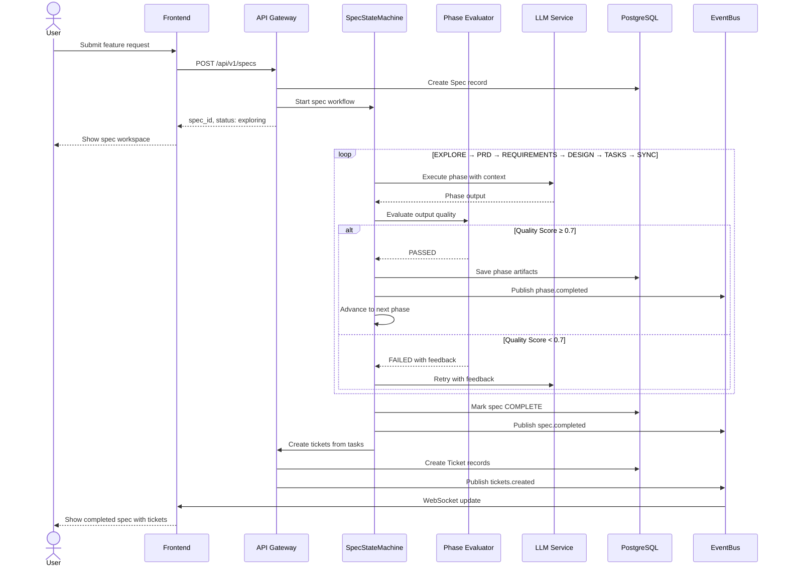
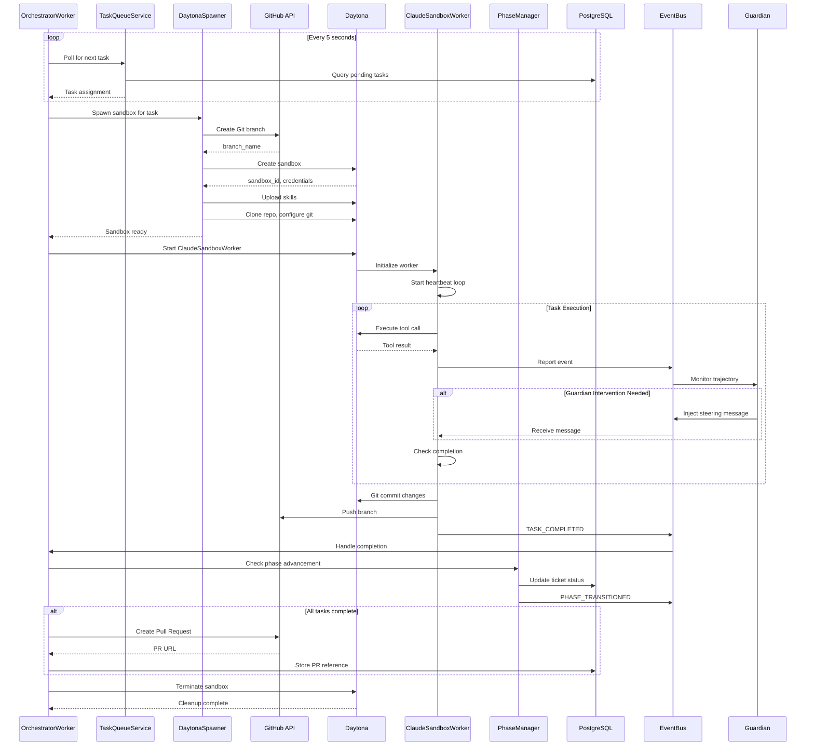
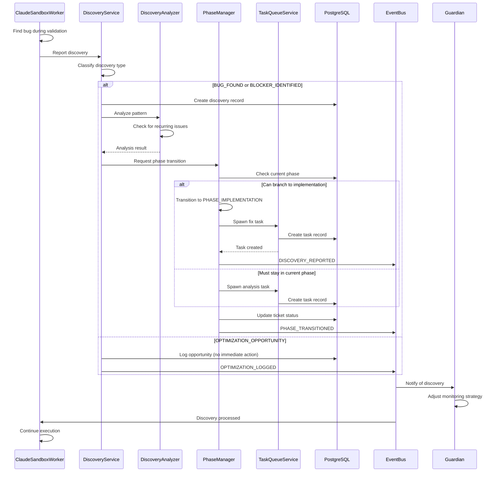
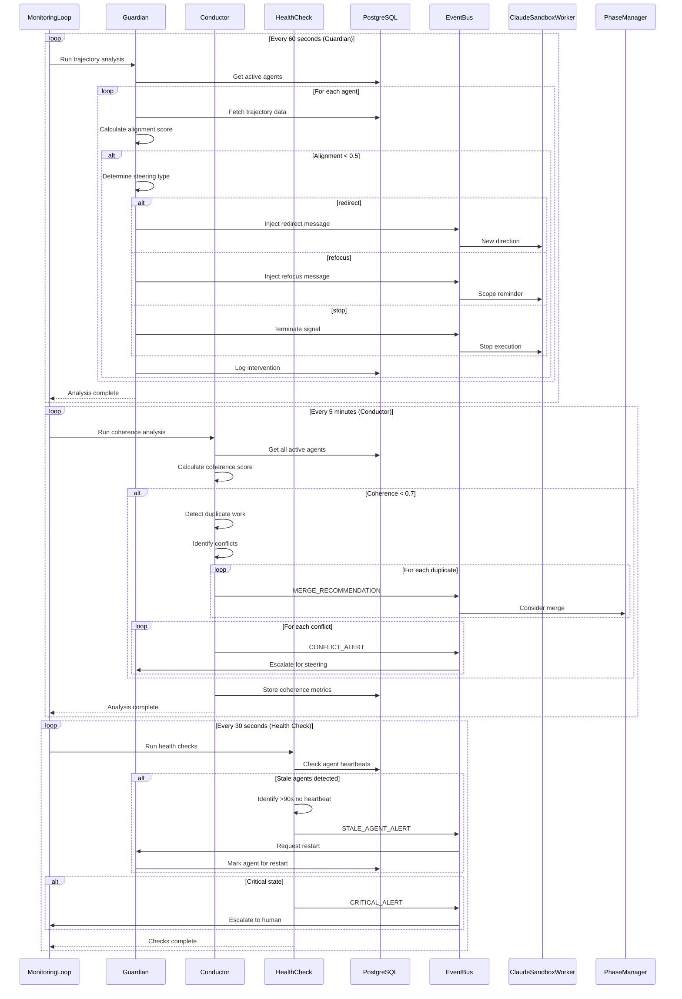
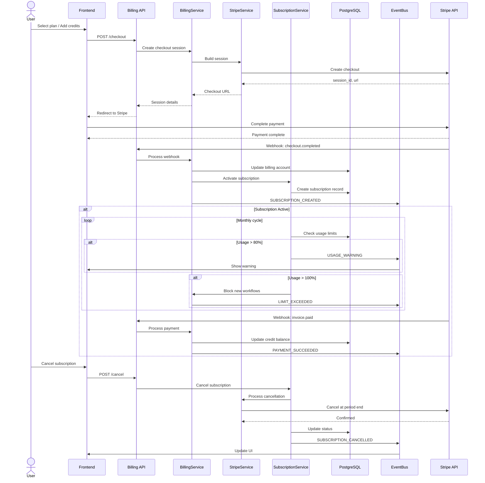

# OmoiOS Workflow Overview

**Created**: 2025-04-22  
**Status**: Active  
**Purpose**: Comprehensive end-to-end workflow documentation with sequence diagrams for all major OmoiOS systems  
**Related**: ARCHITECTURE.md, docs/architecture/*.md

---

## Table of Contents

1. [Introduction](#introduction)
2. [Feature Creation Workflow](#1-feature-creation-workflow)
3. [Task Execution Workflow](#2-task-execution-workflow)
4. [Discovery Workflow](#3-discovery-workflow)
5. [Monitoring Workflow](#4-monitoring-workflow)
6. [Billing Workflow](#5-billing-workflow)
7. [System Integration Map](#system-integration-map)
8. [Error Recovery Patterns](#error-recovery-patterns)

---

## Introduction

OmoiOS is a spec-driven, multi-agent orchestration system that transforms feature ideas into production code through autonomous AI agents. This document provides comprehensive workflow documentation with Mermaid sequence diagrams showing how all major systems work together.

### Core Systems

| System | Purpose | Key Components |
|--------|---------|----------------|
| **Planning** | Convert ideas to executable specs | SpecStateMachine, Phase Evaluators |
| **Execution** | Run tasks in isolated sandboxes | OrchestratorWorker, DaytonaSpawner |
| **Discovery** | Adapt workflows based on findings | DiscoveryService, Analyzer |
| **Readjustment** | Monitor and steer agents | Guardian, Conductor, Health Check |
| **Billing** | Manage subscriptions and usage | BillingService, Stripe Integration |

---

## 1. Feature Creation Workflow

The Feature Creation Workflow transforms a user's feature request into a fully structured, executable specification through a 7-phase pipeline. Each phase has quality gates that must pass before progression.

### Sequence Diagram



### Workflow Explanation

The Feature Creation Workflow follows a structured 7-phase pipeline:

1. **EXPLORE**: Analyzes the existing codebase to understand structure, tech stack, and relevant files. Produces a `codebase_summary` and identifies `discovery_questions`.

2. **PRD**: Generates a Product Requirements Document with goals, user stories, scope boundaries, risks, and success metrics.

3. **REQUIREMENTS**: Creates formal requirements in EARS format ("WHEN [trigger], THE SYSTEM SHALL [action]") with acceptance criteria.

4. **DESIGN**: Produces architecture diagrams, API specifications, data models, and implementation considerations.

5. **TASKS**: Breaks down work into Tickets (TKT-NNN) and Tasks (TSK-NNN) with dependencies and time estimates.

6. **SYNC**: Validates traceability between requirements, design, and tasks. Ensures coverage matrix is complete.

7. **COMPLETE**: Final validation and transition to execution-ready state.

### Decision Points

| Decision | Condition | Action |
|------------|-----------|--------|
| Phase Retry | Score < 0.7 | Retry with evaluator feedback |
| Phase Advance | Score ≥ 0.7 | Save artifacts, proceed to next phase |
| Skip Phase | User request | Fast-track to implementation |
| Discovery Branch | New requirement found | Spawn Phase 1 investigation |

### Error Recovery

- **LLM Timeout**: Retry with exponential backoff (1s, 2s, 4s)
- **Invalid Output**: Re-run with stricter system prompt
- **Phase Stuck**: Guardian detects and injects steering intervention
- **Data Loss**: Incremental writes preserve progress at each sub-step

---

## 2. Task Execution Workflow

The Task Execution Workflow handles the complete lifecycle of a task from queue assignment through sandbox execution to completion and PR creation.

### Sequence Diagram



### Workflow Explanation

The Task Execution Workflow orchestrates the complete execution lifecycle:

1. **Task Polling**: OrchestratorWorker polls TaskQueueService every 5 seconds for pending tasks, respecting priority and dependencies.

2. **Sandbox Spawning**: DaytonaSpawner creates an isolated Daytona sandbox with:
   - Git branch created BEFORE sandbox (prevents conflicts)
   - Environment variables and credentials
   - Claude skills uploaded
   - Repository cloned and configured

3. **Worker Execution**: ClaudeSandboxWorker runs inside the sandbox using the Claude Agent SDK with three modes:
   - **Exploration**: Read-only analysis, stops early
   - **Implementation**: Full file access, runs to completion
   - **Validation**: Test execution, spawns fix tasks

4. **Monitoring**: Guardian analyzes trajectory every 60 seconds, injecting steering messages if agents drift from goals.

5. **Completion**: On task completion:
   - Changes committed and pushed
   - PhaseManager checks for phase advancement
   - Pull request created if all tasks complete
   - Sandbox terminated and cleaned up

### Decision Points

| Decision | Condition | Action |
|------------|-----------|--------|
| Spawn Sandbox | Task assigned, concurrency < 5 | Create Daytona sandbox |
| Queue Task | Concurrency limit reached | Wait for slot |
| Steering | Alignment score < 0.5 | Inject redirect/refocus message |
| Terminate | Task complete or timeout | Cleanup sandbox |
| Create PR | All tasks in phase complete | Open pull request |

### Error Recovery

- **Sandbox Creation Fails**: Retry with exponential backoff, alert after 3 failures
- **Agent Crash**: Restart agent, resume from last checkpoint
- **Git Conflict**: Use ConvergenceMergeService with LLM resolution
- **Timeout**: Cancel task, spawn retry with extended timeout
- **Discovery**: Branch workflow, spawn investigation task

---

## 3. Discovery Workflow

The Discovery Workflow enables adaptive workflow branching when agents find new requirements, bugs, or optimizations during execution.

### Sequence Diagram



### Workflow Explanation

The Discovery Workflow implements the Hephaestus pattern for adaptive branching:

1. **Discovery Detection**: Agents report discoveries during execution (bugs, blockers, missing dependencies, optimizations).

2. **Classification**: DiscoveryService classifies the discovery type:
   - `BUG_FOUND`: Critical issue requiring immediate fix
   - `BLOCKER_IDENTIFIED`: Blocking dependency discovered
   - `MISSING_DEPENDENCY`: Required component missing
   - `OPTIMIZATION_OPPORTUNITY`: Performance improvement found
   - `DIAGNOSTIC_NO_RESULT`: Stuck workflow recovery

3. **Pattern Analysis**: DiscoveryAnalyzerService uses LLM to:
   - Find recurring patterns across discoveries
   - Predict likely blockers based on history
   - Recommend agent types for handling
   - Summarize workflow health

4. **Adaptive Branching**: Unlike normal phase transitions, discovery branching can:
   - Go BACK to earlier phases (e.g., testing → implementation for bug fixes)
   - Spawn tasks in ANY phase regardless of current phase
   - Priority boost critical discoveries

### Decision Points

| Decision | Condition | Action |
|------------|-----------|--------|
| Immediate Branch | BUG_FOUND or BLOCKER | Spawn fix task, priority boost |
| Log Only | OPTIMIZATION_OPPORTUNITY | Record for future consideration |
| Pattern Alert | Recurring issue detected | Alert tech lead, suggest systemic fix |
| Phase Override | Critical blocker | Bypass normal phase transitions |

### Error Recovery

- **False Discovery**: Validation agent verifies before spawning tasks
- **Duplicate Discovery**: DeduplicationService prevents redundant tasks
- **Circular Branching**: Max depth limit prevents infinite loops
- **Analysis Failure**: Rule-based fallback classification

---

## 4. Monitoring Workflow

The Monitoring Workflow provides continuous oversight of agent trajectories and system coherence through three nested monitoring loops.

### Sequence Diagram



### Workflow Explanation

The Monitoring Workflow runs three nested loops with different cadences:

1. **Guardian Loop (60s)**: Per-agent trajectory analysis
   - Calculates alignment score (0.0 - 1.0) for each agent
   - Detects drift from original goals
   - Injects steering interventions: `redirect`, `refocus`, or `stop`
   - Uses LLM-powered analysis for trajectory scoring

2. **Conductor Loop (5min)**: System-wide coherence analysis
   - Computes coherence score across all agents
   - Detects duplicate work between agents
   - Identifies conflicting approaches
   - Issues merge recommendations

3. **Health Check Loop (30s)**: Critical state monitoring
   - Checks agent heartbeats (expect every 30s)
   - Flags stale agents (>90s no heartbeat)
   - Alerts on critical system states
   - Triggers automatic restarts

### Decision Points

| Decision | Condition | Action |
|------------|-----------|--------|
| Redirect | Alignment < 0.3, wrong direction | Inject new direction message |
| Refocus | Alignment 0.3-0.5, scope drift | Remind of original goal |
| Stop | Alignment < 0.2, causing harm | Terminate agent execution |
| Merge | Duplicate work detected | Recommend task consolidation |
| Restart | Stale agent detected | Spawn replacement agent |
| Escalate | Critical coherence < 0.3 | Alert human operator |

### Error Recovery

- **Steering Ignored**: Escalate to stronger intervention or human
- **Analysis Timeout**: Use cached scores, flag for review
- **False Duplicate**: Human review of merge recommendations
- **Restart Loop**: Max 3 restarts, then escalate to human

---

## 5. Billing Workflow

The Billing Workflow manages subscription lifecycle, usage tracking, and payment processing through Stripe integration.

### Sequence Diagram



### Workflow Explanation

The Billing Workflow handles the complete subscription lifecycle:

1. **Checkout Flow**:
   - User selects plan or credit amount
   - Stripe checkout session created
   - User completes payment on Stripe
   - Webhook confirms completion

2. **Subscription Management**:
   - 5 tiers: Free, Pro ($299), Team ($999), Enterprise, Lifetime ($499)
   - Usage limits enforced per tier
   - BYO (Bring Your Own) API keys on paid tiers
   - Automatic monthly usage reset

3. **Usage Tracking**:
   - Per-task LLM cost tracking (prompt/completion tokens)
   - Per-sandbox cost aggregation
   - Cost forecasting for pending tasks
   - `check_and_reserve_workflow()` validates quota before execution

4. **Payment Processing**:
   - Automated dunning: 3 retries (24h, 72h, 72h)
   - Daily payment reminders for invoices due within 3 days
   - Low credit balance warnings ($5 threshold)
   - Account suspension after failed dunning

### Decision Points

| Decision | Condition | Action |
|------------|-----------|--------|
| Allow Workflow | Quota available | Reserve capacity, proceed |
| Block Workflow | Quota exhausted | Return 402 Payment Required |
| Usage Warning | Usage > 80% | Email + UI notification |
| Dunning | Payment failed | Retry 1: 24h, Retry 2: 72h, Retry 3: 72h |
| Suspend | Dunning exhausted | Block workflows, alert user |

### Error Recovery

- **Webhook Failure**: Retry with exponential backoff, store for replay
- **Payment Declined**: Dunning sequence, user notification
- **Quota Miscalculation**: Recalculate from usage records, adjust if needed
- **Stripe Outage**: Queue operations, retry when available

---

## System Integration Map

### Data Flow Overview

```
┌─────────────────────────────────────────────────────────────────────────┐
│                         USER / FRONTEND                                  │
│              (Specs, Tickets, Tasks, Monitoring, Billing)               │
└─────────────────────────────────┬───────────────────────────────────────┘
                                  │
                                  ▼
┌─────────────────────────────────────────────────────────────────────────┐
│                         API LAYER (FastAPI)                              │
│    Routes: specs, tickets, tasks, sandboxes, billing, agents, auth       │
└─────────────────────────────────┬───────────────────────────────────────┘
                                  │
          ┌───────────────────────┼───────────────────────┐
          │                       │                       │
          ▼                       ▼                       ▼
┌─────────────────┐    ┌─────────────────┐    ┌─────────────────┐
│ PLANNING SYSTEM │    │ EXECUTION SYSTEM│    │ READJUSTMENT    │
│                 │    │                 │    │ SYSTEM          │
│ SpecStateMachine│    │ Orchestrator    │    │ MonitoringLoop  │
│ Phase Evaluators│    │ DaytonaSpawner  │    │ Guardian        │
│ HTTPReporter    │    │ ClaudeSandbox   │    │ Conductor       │
└────────┬────────┘    └────────┬────────┘    └────────┬────────┘
         │                      │                      │
         └──────────────────────┼──────────────────────┘
                                │
                                ▼
┌─────────────────────────────────────────────────────────────────────────┐
│                         DATA LAYER                                       │
│  PostgreSQL + pgvector │ Redis │ EventBus │ MemoryService │ Billing      │
└─────────────────────────────────────────────────────────────────────────┘
```

### Service Dependencies

| Service | Depends On | Used By |
|---------|------------|---------|
| SpecStateMachine | LLMService, EventBus | OrchestratorWorker |
| OrchestratorWorker | TaskQueue, DaytonaSpawner, PhaseManager | Background loop |
| DaytonaSpawner | GitHub API, Daytona SDK | OrchestratorWorker |
| Guardian | LLMService, EventBus | MonitoringLoop |
| Conductor | LLMService, Database | MonitoringLoop |
| BillingService | StripeService, Database | API routes |
| DiscoveryService | PhaseManager, TaskQueue | ClaudeSandboxWorker |

---

## Error Recovery Patterns

### Retry Patterns

| Pattern | Use Case | Implementation |
|---------|----------|----------------|
| Exponential Backoff | LLM API calls | 1s, 2s, 4s, 8s + jitter |
| Circuit Breaker | External services | Open after 5 failures, 60s timeout |
| Max Retries | Task execution | 3 attempts, then permanent failure |
| Dead Letter Queue | Event processing | Store failed events for replay |

### Fallback Patterns

| Primary | Fallback | Trigger |
|---------|----------|---------|
| LLM structured_output | Manual JSON parsing | Validation fails 5x |
| Semantic search | Keyword search | Embedding service down |
| Real-time events | Polling | WebSocket disconnected |
| Stripe API | Queue for retry | Stripe outage |

### Escalation Patterns

| Level | Condition | Action |
|-------|-----------|--------|
| 1 - Automatic | Retryable error | Retry with backoff |
| 2 - Steering | Agent drift | Guardian intervention |
| 3 - Restart | Stale/crashed agent | Spawn replacement |
| 4 - Human | Critical failure | Alert on-call engineer |

---

## Summary

OmoiOS workflows form a cohesive system where:

1. **Feature Creation** transforms ideas into structured, executable specifications
2. **Task Execution** runs work in isolated sandboxes with full monitoring
3. **Discovery** enables adaptive branching when agents find new requirements
4. **Monitoring** provides continuous oversight and steering interventions
5. **Billing** manages subscriptions, usage, and payments

All workflows integrate through the EventBus for real-time coordination, PostgreSQL for persistence, and Redis for caching and pub/sub messaging.

---

**Related Documentation**:
- [ARCHITECTURE.md](../ARCHITECTURE.md) - System architecture overview
- [docs/architecture/01-planning-system.md](architecture/01-planning-system.md) - Planning deep-dive
- [docs/architecture/02-execution-system.md](architecture/02-execution-system.md) - Execution deep-dive
- [docs/architecture/03-discovery-system.md](architecture/03-discovery-system.md) - Discovery deep-dive
- [docs/architecture/04-readjustment-system.md](architecture/04-readjustment-system.md) - Monitoring deep-dive
- [docs/architecture/08-billing-and-subscriptions.md](architecture/08-billing-and-subscriptions.md) - Billing deep-dive
