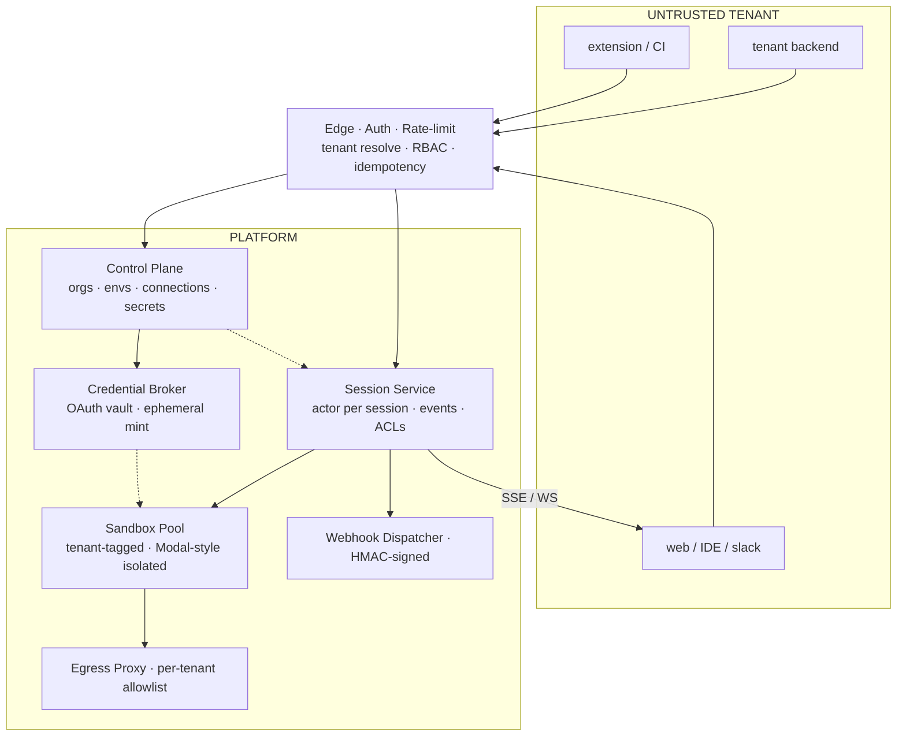
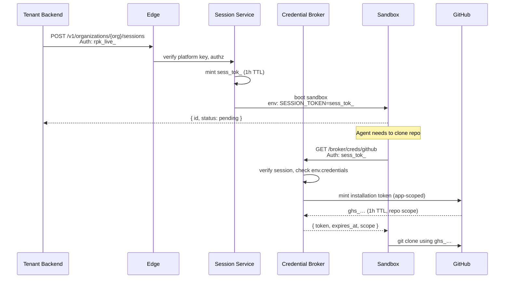

# 02 · Spec Overview

A structured read of the 19 files in `agent_spec.zip`, organized by what they demand of an implementation.

## 2.1 · What the Spec Is (and Isn't)

**Is:** A v0.2 specification for a **Multi-Tenant Background Agent API** — the externally-facing surface that turns "Ramp's Inspect" (single-tenant internal tool) into a SaaS product where every tenant, session, and credential has its own trust boundary.

**Isn't:** A rewrite target for an existing product. File `17-omoi-os-adaptation.md` is unusually explicit: the spec is a *vocabulary* and *checklist* for teams with working systems, not a green-fields blueprint.

## 2.2 · The Six Design Decisions

From `00-overview.md`, the non-negotiable principles:

1. **Pooled compute, siloed data.** One sandbox pool shared across tenants; each sandbox tagged by tenant and network-policy-blocked from cross-tenant traffic at the egress proxy. Storage partitioned per org.
2. **Three-tier auth.** Platform API key (server↔server), User JWT (humans), Session Token (the sandbox itself). Never collapse these — the sandbox will be attacked.
3. **Credentials via delegation, never storage.** OAuth connections mint ephemeral, scoped tokens on demand. Raw refresh tokens never leave the vault.
4. **Environments are declarative and versioned.** Every session pins to an `env_…@vN`. Customers build images, platform snapshots them. Rolling updates are opt-in.
5. **Async-first, three streaming modes.** `POST /sessions` returns in <200ms. Events via SSE (simple), WebSocket (multiplayer + input), or webhooks (server↔server).
6. **Multiplayer is an ACL, not a feature.** Sessions have owners/editors/viewers within an org. Cross-org sharing explicitly unsupported. Presence rides the WebSocket.

## 2.3 · The Architecture



## 2.4 · The Five Resources

From `02-resources.md`. Every other object is a child of one of these.

| Resource | Prefix | Role | OmoiOS equivalent |
|---|---|---|---|
| `Organization` | `org_` | Tenant. Billing boundary. Data partition. Trust root. | ✅ `Organization` |
| `Workspace` | `ws_` | Optional grouping: repo set, product area, customer project. | ✅ `Project` |
| `Environment` | `env_` | Immutable sandbox recipe: image + env + tools + egress + resources. Versioned. | ❌ **Missing** |
| `Session` | `sess_` | One agent execution. Has state, events, artifacts, participants. | ✅ `Task` |
| `Artifact` | `art_` | Output surface: PRs, patches, files, screenshots, logs. | ⚠️ Scattered across `TicketPullRequest`, `TicketCommit`, `AgentLog` |

### Environment — the critical new primitive

```json
{
  "id": "env_Jk2p",
  "version": 7,
  "image": { "kind": "snapshot", "ref": "snap_payments_7" },
  "env": {
    "DATABASE_URL": { "$secret": "sec_db_prod_ro" },
    "NODE_ENV":     "development"
  },
  "tools": ["bash", "editor", "git", "browser"],
  "egress": {
    "allowed_hosts":  ["api.github.com", "*.internal.acme.com"],
    "allowed_ports":  [443, 5432]
  },
  "resources": { "cpu": 4, "memory_gb": 8, "timeout_sec": 3600 },
  "credentials": {
    "github":    { "kind": "github_app",   "repositories": ["acme/payments-service"] },
    "linear":    { "kind": "user_oauth",   "provider": "linear", "scope": "read write" },
    "anthropic": { "kind": "bearer_secret","secretId": "sec_ant_prod", "provider": "anthropic" }
  }
}
```

Three things OmoiOS doesn't have:
- **`files[]`** (extended from `14-omo-opencode-sandbox.md §11`): pre-populated config files written at sandbox boot (e.g. `~/.config/opencode/opencode.json`)
- **`credentials: {...}`** map with three binding kinds (`github_app`, `user_oauth`, `bearer_secret`)
- **`egress.allowed_hosts`** enforced at an HTTP proxy, not IP-level

## 2.5 · The Three Token Types

From `01-auth-and-tenancy.md`. Every auth decision reduces to "which of these is this, and what scope does it carry?"

| Token | Prefix | Subject | Lifetime | Scope |
|---|---|---|---|---|
| **Platform API Key** | `rpk_live_…` | tenant backend | long-lived, rotatable | full org |
| **User JWT** | `eyJ…` | human end-user | 15 min access + refresh | RBAC subset of org |
| **Session Token** | `sess_tok_…` | the sandbox itself | 1h sliding | one session + declared scopes |

**Losing one:**
- Platform key → compromise the tenant's entire platform access. Rotate on employee offboarding.
- User JWT → compromise one user's org-scoped actions for 15 min. Refresh required after.
- Session token → compromise one session. Never more. **This is the key security invariant.**



## 2.6 · The API Surface

From `03-sessions-api.md`. The only blocking endpoint is `GET /events` (streams).

| Method | Path | Purpose |
|---|---|---|
| `POST` | `/v1/organizations/{org}/sessions` | Create. Returns `{ id, status: "pending" }`. |
| `GET` | `/v1/organizations/{org}/sessions` | List. Filters: `status`, `created_by`, `workspace`, `since`. |
| `GET` | `/v1/organizations/{org}/sessions/{id}` | Full state + URLs + usage. |
| `POST` | `/v1/organizations/{org}/sessions/{id}/messages` | Follow-up prompt mid-session. |
| `POST` | `/v1/organizations/{org}/sessions/{id}/cancel` | Cancel. Idempotent. Graceful shutdown. |
| `POST` | `/v1/organizations/{org}/sessions/{id}/fork` | Branch from event `{ seq }` with a new prompt. |
| `GET` | `/v1/organizations/{org}/sessions/{id}/events` | SSE. Supports `Last-Event-Id`. |
| `GET` | `/v1/organizations/{org}/sessions/{id}/artifacts` | List artifacts. |

Plus: `/environments`, `/secrets`, `/connections/oauth/start`, `/connections/oauth/callback`, `/broker/creds/{provider}`, `/webhooks/*`.

## 2.7 · The Event Envelope

From `03-sessions-api.md §Event envelope`. Every event — SSE frame, WebSocket message, or webhook body — uses this shape:

```json
{
  "id": "evt_01HW…",
  "seq": 142,
  "type": "tool_call",
  "session_id": "sess_9Qw2",
  "actor": "agent",
  "timestamp": "2026-04-21T14:03:22.481Z",
  "data": { "tool": "bash", "args": { "cmd": "pnpm test payments/refund_spec.ts" } }
}
```

Key invariants:
- `seq` is monotonic per session and survives reconnect (via `Last-Event-Id`)
- `actor` is `"agent"`, `"user:<user_id>"`, or `"system"`
- Idempotency: `evt.id` is the webhook-delivery deduplication key

OmoiOS has `Event` with `{ id, event_type, entity_type, entity_id, payload, timestamp }` — missing `seq`, `actor`, and per-session scoping.

## 2.8 · The Streaming Modes

From `06-streaming-and-webhooks.md`.

| Channel | When | How |
|---|---|---|
| **SSE** | Browser or simple client wants a live feed. | `GET /events`, `text/event-stream`, resume via `Last-Event-Id`. |
| **WebSocket** | Multiplayer, bidirectional, IDE integrations. | `wss://…` with per-connection user JWT. Presence + replies. |
| **Webhooks** | Server-to-server async notification. | HMAC-SHA256 signed. Retries with exponential backoff up to 24h. |

OmoiOS has WebSocket + Redis. Missing SSE and outbound webhooks.

## 2.9 · Quotas and Errors

From `08-quotas-and-errors.md`.

### Limit dimensions

| Limit | Enforcement |
|---|---|
| `concurrent_sessions` | hard; 429 on exceed |
| `sessions_per_minute` | token-bucket; 429 w/ `Retry-After` |
| `monthly_compute_seconds` | soft warn at 80 %, hard 429 at 100 % |
| `monthly_tokens_(in/out)` | same |
| `sandbox_egress_mb_per_session` | hard; session fails with `reason: egress_limit` |
| `environment_image_size_gb` | hard; build fails |

OmoiOS has `max_concurrent_agents` (org-level, hard) and `max_agent_runtime_hours`. Budget enforcer covers $$, not compute seconds or tokens.

### Stable error codes

| Code | HTTP |
|---|---|
| `invalid_request` | 400 |
| `unauthenticated` | 401 |
| `forbidden` | 403 |
| `not_found` | 404 |
| `conflict` | 409 |
| `quota_exceeded` | 429 |
| `environment_build_failed` | 422 |
| `egress_denied` | 451 |
| `sandbox_timeout` | 408 |
| `internal_error` | 500 |

## 2.10 · The Deployment Decision

Two different topology docs in the spec, driven by starting conditions:

| File | Audience | Recommendation |
|---|---|---|
| `16-deployment-topology.md` | Greenfield — zero existing Python | Next.js + Modal Functions. **No FastAPI.** |
| `17-omoi-os-adaptation.md` | Has existing FastAPI (= OmoiOS) | **Keep FastAPI.** Skip Better Auth. Don't rewrite. |

These look contradictory but aren't. The greenfield doc says "don't introduce FastAPI if you don't have it." The adaptation doc says "don't remove FastAPI if you do." Both are correct; they apply to different starting conditions.

**OmoiOS falls squarely under §17's guidance.**

## 2.11 · The Hard Parts Worth Reading Closely

From §17 §10, these four docs are "the things you're most likely to get subtly wrong on your first pass":

1. **Credential Broker design** — `13-better-auth-integration.md §8`
2. **OmO fallback chain configuration** — `14-omo-opencode-sandbox.md`
3. **Egress model** — `05-environments.md`
4. **Event envelope** — `03-sessions-api.md`

If you're going to skim something, don't skim these.

## 2.12 · Two Reflective Questions from the Spec

The spec repeatedly asks reflective questions at the end of sections. Two worth internalizing:

**From §12 (Next Steps):** *"Which phase is the one you'd be tempted to skip in a hackathon demo — and which phase would the customer notice missing in the first week of production?"*
→ For OmoiOS: skip multiplayer / SDK polish for demo. Customers will notice missing quota enforcement and Broker within a week.

**From §14 (OmO + OpenCode):** *"When Claude rate-limits the tenant's session, should the platform fall back to its own aggregator keys (OpenCode Go, Vercel Gateway) and bill the tenant a markup? Or fail the session?"*
→ This is a pricing question masquerading as a technical question. Answer it before Phase 3.

## Next

[`03-current-implementation.md`](./03-current-implementation.md) — what OmoiOS has today, by file.
