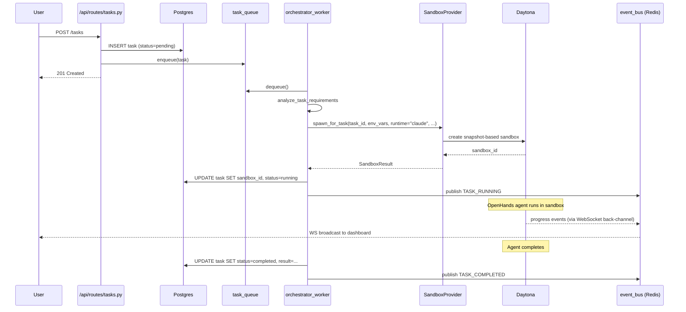

# 03 · Current OmoiOS Implementation

A ground-truth mapping of the existing codebase to the spec's concepts. Every finding here is backed by file paths and line numbers in the backend (`backend/omoi_os/`) and frontend (`frontend/`) trees.

## 3.1 · Domain Model

### Organization — `backend/omoi_os/models/organization.py:33-98`

Top-level billing boundary. Has `max_concurrent_agents: int = 5` and `max_agent_runtime_hours: float = 100.0` — already quota-aware at the model level. Owner is a single `User`.

```python
class Organization(Base):
    __tablename__ = "organizations"
    id: Mapped[UUID] = mapped_column(PGUUID(as_uuid=True), primary_key=True)
    name: Mapped[str]
    owner_id: Mapped[UUID] = mapped_column(ForeignKey("users.id"))
    billing_email: Mapped[Optional[str]]
    max_concurrent_agents: Mapped[int] = mapped_column(Integer, default=5)
    max_agent_runtime_hours: Mapped[float] = mapped_column(Float, default=100.0)
```

**Maps to:** Spec's `Organization` (`org_…`). **Status:** ✅ 1:1 match.

### Project — `backend/omoi_os/models/project.py:22-99`

Grouping between Organization and Ticket/Task. Has GitHub repo binding.

```python
class Project(Base):
    __tablename__ = "projects"
    organization_id: Mapped[Optional[UUID]] = ForeignKey("organizations.id")
    name: Mapped[str]
    github_owner: Mapped[Optional[str]]
    github_repo: Mapped[Optional[str]]
    github_webhook_secret: Mapped[Optional[str]]
    autonomous_execution_enabled: Mapped[bool] = default=False
```

**Maps to:** Spec's `Workspace` (`ws_…`). **Status:** ✅ Match, different name. Adaptation advice: alias in the API layer, don't rename the DB column.

### Task — `backend/omoi_os/models/task.py:24-192`

The unit of agent execution. ~30 fields including state machine, retry logic, dependencies, synthesis, ownership tracking, validation fields, and a pgvector 1536-dim embedding.

```python
class Task(Base):
    id, ticket_id, phase_id, task_type, title, description
    priority (CRITICAL|HIGH|MEDIUM|LOW), score
    status (pending|assigned|running|completed|failed), assigned_agent_id
    conversation_id, persistence_dir, sandbox_id
    result, error_message, synthesis_context, owned_files
    dependencies (JSONB), required_capabilities (list)
    retry_count, max_retries, timeout_seconds, deadline_at
    parent_task_id, validation_enabled, validation_iteration
    last_validation_feedback, review_done
    embedding_vector (pgvector 1536), execution_config (JSONB)
    created_at, updated_at, started_at, completed_at
```

**Maps to:** Spec's `Session` (`sess_…`). **Status:** ✅ Match, different name. Richer than the spec requires (has validation loop, parallel coordination, semantic search built in). Migration strategy: alias at the API layer — `Task.id` responds to both `task_id` and `session_id`.

### Event — `backend/omoi_os/models/event.py:15-35`

Persisted system event. Minimal fields.

```python
class Event(Base):
    id: Mapped[str] = primary_key
    event_type: Mapped[str]
    entity_type: Mapped[Optional[str]]
    entity_id: Mapped[Optional[str]]
    payload: Mapped[Optional[dict]] = JSONB
    timestamp: Mapped[datetime]
```

**Maps to:** Partially to spec's event envelope. **Status:** ⚠️ Missing `seq` (monotonic per session), `actor` field, session-scoping. These are trivially added as columns + emit-time wrapping — see [`04-gap-analysis.md §4.4`](./04-gap-analysis.md).

### Artifacts — scattered across 3 models

- PRs → `backend/omoi_os/models/ticket_pull_request.py`
- Commits → `backend/omoi_os/models/ticket_commit.py`
- Logs → `backend/omoi_os/models/agent_log.py` or `Task.persistence_dir` filesystem
- Screenshots → filesystem inside OpenHands conversation dir

**Maps to:** Spec's unified `Artifact` (`art_…`). **Status:** ❌ Fragmented. Adaptation: introduce a thin `Artifact` view/table that joins these, exposes the spec shape. Don't migrate the underlying storage — just adapt the API.

## 3.2 · Authentication

### API Key generation — `backend/omoi_os/services/auth_service.py:345-357`

Custom implementation. `sk_live_` prefix, 32-byte URL-safe random, SHA256 hashed on storage.

```python
def generate_api_key(self) -> Tuple[str, str, str]:
    random_part = secrets.token_urlsafe(32)
    full_key = f"sk_live_{random_part}"
    prefix = full_key[:16]
    hashed_key = hashlib.sha256(full_key.encode()).hexdigest()
    return full_key, prefix, hashed_key
```

**Maps to:** Spec's Platform API Key (`rpk_live_`). **Status:** ✅ Same mechanism, different prefix. Rename is cosmetic; don't break existing keys.

### APIKey model — `backend/omoi_os/models/auth.py:76-167`

Supports both user and agent ownership (`user_id | agent_id` with CHECK constraint), optional org scope, scopes JSONB, last-used tracking, expiration.

```python
class APIKey(Base):
    user_id | agent_id (CHECK constraint — one or other)
    organization_id (optional)
    name, key_prefix, hashed_key, scopes (JSONB)
    is_active, last_used_at, expires_at
```

**Maps to:** Spec's Platform API Key + Session Token (with added `kind` column). **Status:** ✅ Extensible. Adding a new `kind='session'` entry with short TTL gives you session tokens for free.

### JWT — `backend/omoi_os/services/auth_service.py:198-199`

```python
access_token, _access_jti = auth_service.create_access_token(user_id)
refresh_token, _refresh_jti = auth_service.create_refresh_token(user_id)
```

**Maps to:** Spec's User JWT (`eyJ…`). **Status:** ✅ Match.

### Sessions table — `backend/omoi_os/models/auth.py:28-74`

Browser session. `token_hash` is SHA-256 of the bearer token, `expires_at` tracks lifetime.

**Status:** Match for dashboard-session concept; orthogonal to agent-execution sessions (`Task`).

### GitHub OAuth — `backend/omoi_os/services/oauth_service.py:480-520`

Per-user tokens stored in `User.attributes` JSONB.

```python
def get_user_oauth_token(self, user_id: UUID, provider: str) -> Optional[str]:
    user = session.get(User, user_id)
    attrs = user.attributes or {}
    return attrs.get(f"{provider}_access_token")
```

**Maps to:** Spec's Model A — user-linked OAuth. **Status:** ✅ Match. Plaintext storage is flagged as a TODO in the code; encrypt-at-rest is part of the Broker migration. Missing Model B (GitHub App installation tokens for org-wide access).

### RBAC — `backend/omoi_os/models/organization.py:179-229` + `services/authorization_service.py:22-146`

Full role + membership model with inheritance.

```python
class Role(Base):
    organization_id (NULL for system roles)
    name, permissions (JSONB array)
    is_system, inherits_from (self-ref)

class OrganizationMembership(Base):
    user_id | agent_id (CHECK)
    role_id, organization_id
    joined_at, invited_by
```

Enforcement is explicit in route handlers, not decorator-based. Example from billing:

```python
ok, reason, _ = await authorization_service.is_authorized(
    actor_id=user.id, actor_type="user", action="billing:read",
    organization_id=org_id,
)
if not ok: raise HTTPException(403, reason)
```

**Maps to:** Spec's RBAC (owner/admin/editor/viewer). **Status:** ✅ Match. Better Auth's `createAccessControl` is a greenfield convenience — don't introduce it here.

## 3.3 · Sandbox and Agent

### SandboxProvider Protocol — `backend/omoi_os/services/sandbox_provider.py:28-49`

```python
@runtime_checkable
class SandboxProvider(Protocol):
    async def spawn_for_task(
        self, task_id: str, agent_id: str, phase_id: str,
        env_vars: dict[str, str], *,
        runtime: str = "claude",
        execution_mode: str = "implementation",
        image: Optional[str] = None,
    ) -> SandboxResult: ...

    async def terminate_sandbox(self, sandbox_id: str) -> None: ...
    async def get_status(self, sandbox_id: str) -> SandboxStatus: ...
    async def list_active(self) -> list[SandboxStatus]: ...
```

**Maps to:** Spec's sandbox abstraction. **Status:** ✅ Clean, extensible. **This is the cleanest place to plug in Modal.**

### Factory — `backend/omoi_os/services/sandbox_factory.py:7-30`

Selects provider from config.

```python
def create_sandbox_provider(db=None, event_bus=None, **kwargs) -> SandboxProvider:
    settings = get_app_settings()
    provider_type = settings.sandbox.provider
    if provider_type == "local":
        return LocalDockerProvider(...)
    else:
        spawner = get_daytona_spawner(db=db, event_bus=event_bus)
        return DaytonaProvider(spawner)
```

**Status:** ✅ Ready for a third `elif provider_type == "modal": return ModalProvider(...)`.

### Provider implementations

- `backend/omoi_os/services/daytona_provider.py` — wraps `DaytonaSpawnerService`
- `backend/omoi_os/services/local_docker_provider.py` — local Docker for dev
- **Missing:** Modal provider

### Task → Sandbox flow

End-to-end path (with references from `backend/omoi_os/workers/orchestrator_worker.py`):



### Provider API key injection — `backend/omoi_os/models/user_credentials.py:24-158`

```python
class UserCredential(Base):
    user_id: UUID
    provider: str  # anthropic, openai, z_ai
    api_key: str   # Plaintext (TODO: should be encrypted!)
    base_url: Optional[str]
    model: Optional[str]
    config_data: Optional[dict]  # JSONB
```

The spawner retrieves the user's credentials, builds an env dict `{ANTHROPIC_API_KEY: ..., OPENAI_API_KEY: ...}`, and passes it to `spawn_for_task(env_vars=...)`. The env vars land in the sandbox at boot.

**This is the most significant security gap.** See [`04-gap-analysis.md §4.1`](./04-gap-analysis.md).

### Event streaming — `backend/omoi_os/api/routes/events.py:70-200`

```python
class WebSocketEventManager:
    async def connect(self, websocket: WebSocket, filters: Optional[dict] = None):
        await websocket.accept()
        self.active_connections.add(websocket)
        self._start_redis_listener()

    async def _listen_to_redis(self):
        # Subscribe to events.* channels
        while True:
            message = await loop.run_in_executor(
                None, lambda: self.redis_pubsub.get_message(timeout=1.0)
            )
            await self._broadcast_event(event)
```

Redis Pub/Sub → WebSocket. Filters supported: `event_type`, `entity_type`, `entity_id`.

**Maps to:** Spec's WebSocket streaming mode. **Status:** ✅ Match. Missing SSE path (2-hour add) and standardized event envelope.

### Retry / fallback

Task-level retry via `Task.retry_count`, `Task.max_retries` (default 3). No LLM-level fallback chain (OmO's per-agent fallback from `14-omo-opencode-sandbox.md §5` would need to be layered on top). For now, agents handle their own recovery via OpenHands conversation resume.

## 3.4 · Frontend

### Directory layout

```
frontend/
├── app/                 # Next.js app directory
│   ├── (auth)/         # login, register, verify-email
│   ├── command/        # main dashboard
│   └── api/            # proxy routes to FastAPI
├── components/
├── hooks/
├── lib/api/            # client.ts, auth.ts, types.ts
├── stores/             # Zustand
├── providers/          # auth, theme, WebSocket
├── middleware/
├── proxy.ts            # edge proxy for auth
```

### Auth — `frontend/proxy.ts:43-80`

```typescript
export default function proxy(request: NextRequest) {
  const authCookie = request.cookies.get("omoios_auth_state")
  const isAuthenticated = authCookie?.value === "true"
  if (!isAuthenticated && !isPublicRoute) {
    return NextResponse.redirect(new URL("/login", request.url))
  }
}
```

Dashboard does **not** auth itself — delegates to FastAPI (`POST /api/v1/auth/login` returns JWT; dashboard sets a cookie state flag). Subsequent requests include JWT in Authorization header.

**Maps to:** Spec's "tenant backend" + "web client" from §16 / §17 — Next.js talks to FastAPI which is the auth boundary. **Status:** ✅ Architecturally correct per spec §17.

### WebSocket consumption

Frontend subscribes at `wss://api.example.com/ws/events?token=JWT&filters=...`. JWT-in-query-string is suboptimal (query strings appear in logs) but functional.

### SDK

**None.** No Python or TypeScript SDK package. Customers would currently hit REST directly. Spec requires shipping both — see [`06-recommended-roadmap.md §Phase 4`](./06-recommended-roadmap.md).

## 3.5 · Billing and Quotas

### Budget model — `backend/omoi_os/models/budget.py:23-82`

```python
class Budget(Base):
    scope: Enum(GLOBAL, TICKET, AGENT, PHASE)
    limit_amount: Decimal  # USD
    spent_amount: Decimal
    alert_threshold: Decimal
    period_start: datetime
    period_end: datetime
```

- `backend/omoi_os/services/cost_tracking.py` — token usage → USD cost
- `backend/omoi_os/services/budget_enforcer.py` — blocks execution when limit exceeded
- `backend/omoi_os/services/stripe_service.py` — Stripe payment integration
- `backend/omoi_os/services/subscription_service.py` — billing cycle

**Maps to:** Partially to spec's quota system. **Status:** ⚠️ Covers $ but not compute-seconds or tokens-in/out as monthly limits. `Organization.max_concurrent_agents` gives org-level concurrency. Adding `monthly_compute_seconds`, `monthly_tokens_input`, `monthly_tokens_output` as additional limits = 1 day.

## 3.6 · File-level Backend Map

```
backend/omoi_os/
├── agents/           # Agent definitions
├── analytics/
├── api/
│   ├── routes/       # 40+ route modules
│   │   ├── auth.py              # register/login/API keys
│   │   ├── billing.py           # Stripe, subscriptions
│   │   ├── events.py            # WebSocket streaming
│   │   ├── github.py            # GitHub webhook
│   │   ├── oauth.py             # OAuth callbacks
│   │   ├── organizations.py     # Org CRUD, members
│   │   ├── projects.py          # Project (= Workspace) CRUD
│   │   ├── sandbox.py           # Sandbox status, logs
│   │   ├── specs.py             # Spec creation
│   │   ├── tasks.py             # Task CRUD (= Session)
│   │   ├── tickets.py           # Ticket lifecycle
│   │   └── …30 more
│   ├── main.py
│   └── cookie_auth.py
├── cli/
├── config/
├── mcp/
├── models/           # 60+ ORM models
├── sandbox_modules/
├── sandbox_skills/
├── schemas/          # Pydantic DTOs
├── services/         # 125+ service classes
├── tasks/
├── telemetry/
├── ticketing/
├── tools/
├── utils/
├── workers/          # orchestrator, monitoring, watchdog
└── workspace/
```

## 3.7 · The Takeaway

OmoiOS is a **mature, working FastAPI SaaS** with:
- Clean domain model that matches 70%+ of the spec (Organization, Project→Workspace, Task→Session, APIKey, RBAC)
- Sandbox abstraction already in place (`SandboxProvider` Protocol)
- Real-time event streaming (WebSocket + Redis)
- Working billing (Stripe)
- GitHub OAuth (user-linked)
- Robust auth service with JWT + API keys + roles

What's missing is not the foundation — it's the specific spec primitives that close the trust-boundary gaps: Environment entity, session-scoped tokens, Credential Broker, egress proxy, unified Artifact, standardized event envelope, and the two adapters (Modal, OpenCode/OmO).

Next: [`04-gap-analysis.md`](./04-gap-analysis.md) — prioritized breakages and missing pieces.
