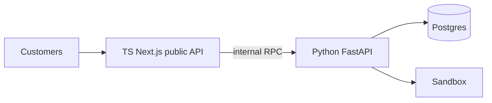

# 05 · Implementation Strategies — TS Rewrite vs. OmoiOS Refactor

An honest comparison of the two paths, graded on cost, risk, time-to-customer-value, and match against the project's starting conditions.

## 5.1 · The Two Options

### Option A — TypeScript Greenfield

Build the platform from scratch following `16-deployment-topology.md`: Next.js + Modal Functions, no FastAPI. Better Auth for all the auth primitives. TS Modal SDK for sandbox runtime. Python only for the build-pipeline Modal Function.

**Deploys:** 1 Next.js + Modal Functions.
**Language split:** ~98% TypeScript, ~2% Python (image builds only).
**New code:** Everything. Routers, auth, RBAC, billing adapters, SDK, SandboxProvider, event bus, WebSocket, dashboard migration.

### Option B — OmoiOS Refactor

Keep FastAPI. Keep the domain model. Add the 16 gaps from [`04-gap-analysis.md`](./04-gap-analysis.md) incrementally. Ship client surfaces (Chrome extension, TS SDK) as TypeScript alongside the Python core.

**Deploys:** 1 FastAPI + 1 Next.js + optional Modal Functions for builds.
**Language split:** backend Python, frontend + SDK + ext TypeScript.
**New code:** Environment resource, Broker, egress proxy, Artifact adapter, event envelope tweaks, SSE endpoint, webhook dispatcher, SDK, Modal provider, multiplayer ACL, quota dims, idempotency. **~5–6 weeks of focused work.**

## 5.2 · Cost Comparison

### What Option A forces you to rebuild

Items OmoiOS already has that Option A requires rewriting from scratch:

| Capability | OmoiOS (today) | Option A (rewrite) |
|---|---|---|
| Organization CRUD | `models/organization.py`, `api/routes/organizations.py` | Better Auth `organization` plugin — ~2 days config |
| User / Role / Membership | `models/organization.py` (Role, OrganizationMembership), `services/authorization_service.py` | Better Auth AC + `createAccessControl` — ~3 days |
| API key mint + verify | `auth_service.py:345-436` | Better Auth `apiKey` plugin, two configs — ~2 days |
| JWT + refresh | `auth_service.py:198-199` | Better Auth `jwt` plugin + JWKS — ~1 day |
| GitHub OAuth (user-linked) | `oauth_service.py:480-520` | Better Auth `socialProviders.github` — ~1 day |
| WebSocket + Redis pub/sub | `api/routes/events.py`, `services/event_bus.py` | Build from scratch in Next.js route + Redis client — ~3 days |
| Stripe billing | `services/stripe_service.py`, `services/subscription_service.py` | Better Auth Stripe plugin or custom — **~1 week** (billing is always more work than expected) |
| Task queue + retry | `services/task_queue.py` (Taskiq-based) | BullMQ or Inngest — ~3 days |
| Agent orchestration loop | `workers/orchestrator_worker.py:114-600+` | Rebuild entirely in TS — **~2 weeks** |
| Cost tracking | `services/cost_tracking.py`, `services/budget_enforcer.py` | Rebuild in TS — ~1 week |
| SandboxProvider + Daytona | `services/sandbox_provider.py`, `services/daytona_provider.py` | New TS adapters — ~1 week |
| 60+ ORM models | `models/*.py` | Rewrite in Drizzle/Prisma — ~2 weeks |
| 40+ API routers | `api/routes/*.py` | Rewrite in Next.js route handlers — **~3 weeks** |

**Lower-bound estimate for Option A baseline:** 10–14 weeks before you start adding the new spec primitives.
**Plus the new work:** 5–6 weeks (same as Option B).
**Total Option A:** 15–20 weeks = **4–5 months**.

**Option B:** **6–8 weeks.**

### Sanity-check: the "it'll be faster in TypeScript" argument

The intuition behind Option A is that TypeScript tooling (Next.js, Drizzle, Better Auth, Zod) is faster than Python tooling. In a **greenfield** this is true — Better Auth saves 4+ weeks of auth work because you're not writing it from scratch anyway.

**Here you're writing it from scratch twice.** Once (Python, done). Again (TS, to replace what works).

## 5.3 · Risk Comparison

### Option A risks

1. **Billing regression.** Rewriting working Stripe integration is the highest-risk migration in any SaaS. A subtle bug in subscription cancellation or proration loses real money. Insurance: running Option A in parallel with Option B's billing until customers migrate — which adds another month of ops.
2. **Dual-maintenance period.** Until migration is complete, every bug fix and feature has to ship in both codebases. Schedules slip, one side diverges, the other breaks.
3. **TS Modal SDK gaps.** Per `15-modal-integration.md §1`: snapshot-restore, image builder chains (`apt_install().pip_install()`), Modal Dicts, container lifecycle hooks are **not yet** in the TS SDK. Python SDK has all of these. The work-around is calling Python via Modal Functions — which re-introduces a cross-language boundary that Option B already has (and has handled).
4. **Context loss.** 125+ services, 60+ models, 40+ routes encode thousands of small decisions (cost formulas, validator order, phase state machine edges). Rewriting from scratch reverses those decisions implicitly, some of which were learned from customer incidents. Every lost decision = potential reintroduced bug.
5. **Morale.** Months of rewriting for zero customer-visible progress is demoralizing. Momentum is a real asset.

### Option B risks

1. **Technical debt compounding.** If OmoiOS has known dirty corners, Option B doesn't force you to clean them. Mitigated by doing adapter interfaces (step 2 in §9 of `17-omoi-os-adaptation.md`) as a risk-free first PR that pays down debt while unblocking Modal.
2. **Vocabulary drift.** Internal code uses "Task"; public API uses "Session". Consumers of both get confused. Mitigated by consistent use of aliases in the API layer and clear documentation.
3. **Python at hot path.** If sandbox RPS gets truly high, FastAPI async perf eventually bottlenecks. Not a near-term issue; revisit at >5k concurrent sessions.
4. **Python Modal SDK requires Python at the orchestration edge.** True but not a problem — OmoiOS is already Python-first.

## 5.4 · Time-to-Customer-Value

The question here is: **when does the first paying customer notice a new capability?**

### Option A timeline

| Week | Outcome |
|---|---|
| 0 | Start rewriting |
| 4 | Auth + org + members working |
| 8 | Basic task CRUD |
| 12 | Billing re-implemented |
| 16 | SandboxProvider + Daytona |
| 18 | **First non-rewrite feature** (e.g. Broker) |
| 22 | Modal adapter |
| 24 | SDK + client surfaces |

**First customer-visible new capability: Week 18. Product shipped: Week 24.**

### Option B timeline

| Week | Outcome |
|---|---|
| 0 | Start refactor |
| 1 | Audit + adapter interfaces |
| 2 | `/v1/.../sessions/*` alias + event envelope |
| 3 | Environment resource |
| 4 | Session token + Broker (all three security gaps closed) |
| 5 | Egress proxy |
| 6 | Modal adapter (parallel in staging) |
| 7 | SDK scaffold |
| 8 | Multiplayer, webhook dispatcher |

**First customer-visible new capability: Week 2 (sessions API, standardized events). Modal option: Week 6. Full spec conformance: Week 8.**

Option B ships in the time Option A would spend re-implementing things that already work.

## 5.5 · When Option A Would Actually Be Right

The spec's own `16-deployment-topology.md` describes Option A as the right choice — but only under specific conditions. Option A is correct when:

- ✅ **Greenfield.** No existing Python services.
- ✅ **Zero customers.** Rewrites don't cost customer confidence.
- ✅ **TypeScript team.** All senior engineers prefer TS.
- ✅ **Public API is primary surface.** Not a dashboard-first product.
- ✅ **Willing to wait for TS Modal SDK maturity.** Or accept Python bridge for build pipeline.

OmoiOS meets 0/5 of these.

## 5.6 · The Hybrid Option (not recommended but worth naming)

"Rewrite the *public API* in TypeScript; keep the internal orchestration in Python."

**Pros:** Decouples client-facing API versioning from internal orchestration.
**Cons:** Adds an internal hop (latency, failure mode, debugging surface) that solves no customer problem. Two things to deploy, version, monitor. Not worth it unless you're planning to extract the Python core as a separate product — which you're not.

Skip unless there's a specific reason to introduce it.

## 5.7 · Decision Matrix

| Criterion | Option A (TS rewrite) | Option B (OmoiOS refactor) |
|---|---|---|
| Time to first customer value | 18 weeks | 2 weeks |
| Total time to full spec | 20–24 weeks | 6–8 weeks |
| Lines of new code | ~30,000 | ~3,000 |
| Existing tests preserved | 0% | 90%+ |
| Billing risk | **High** | **Low** (untouched) |
| Security gap closure | Week 18 | Week 4 |
| Cross-language complexity | TS + Python bridge for builds | Python-only hot path |
| Team ramp-up | TS experts required | Python experts available |
| Morale / momentum | Rebuild phase demoralizing | Constant forward progress |
| Spec §17 recommendation | ❌ "You probably don't want it" | ✅ "Add names, extend, adapt" |

## 5.8 · The Recommendation

**Option B — OmoiOS Refactor.** Build the 16 gaps from [`04-gap-analysis.md`](./04-gap-analysis.md) on top of the existing FastAPI core.

- Ship TypeScript-native client surfaces (TS SDK, Chrome extension, hosted editor iframe if built) alongside — those are TS because they *are* TS, not because the backend is.
- Keep billing, org, auth untouched unless specifically breaking.
- Do the §17 audit as the first step (already mostly done in [`03-current-implementation.md`](./03-current-implementation.md)).
- Use adapter interfaces as the first PR — pure refactor, pays down debt, unblocks everything.

**Key spec lines to keep in mind as you work through this:**

> *"Not a rewrite target. A checklist and vocabulary."* — `17-omoi-os-adaptation.md §10`

> *"The risk isn't that you'll do too little; it's that you'll do too much."* — `17-omoi-os-adaptation.md §Reflective question`

> *"Ripping out your existing auth to replace with Better Auth would be a rewrite that gains you nothing except consistency with a spec that exists to help greenfield builders."* — `17 §6`

Next: [`06-recommended-roadmap.md`](./06-recommended-roadmap.md) — the concrete 8-PR plan.
